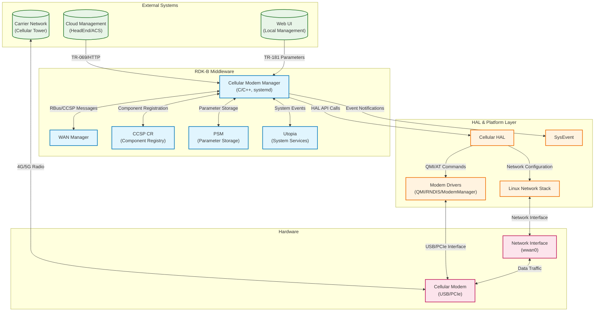
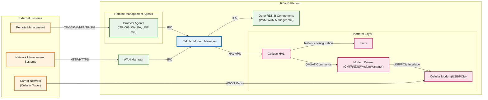
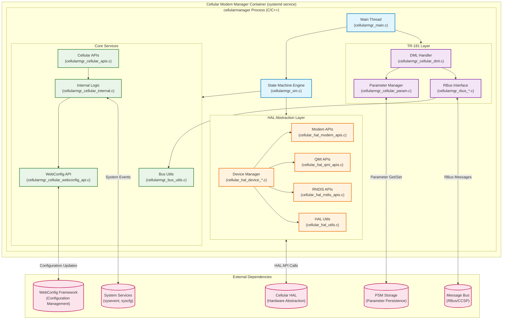
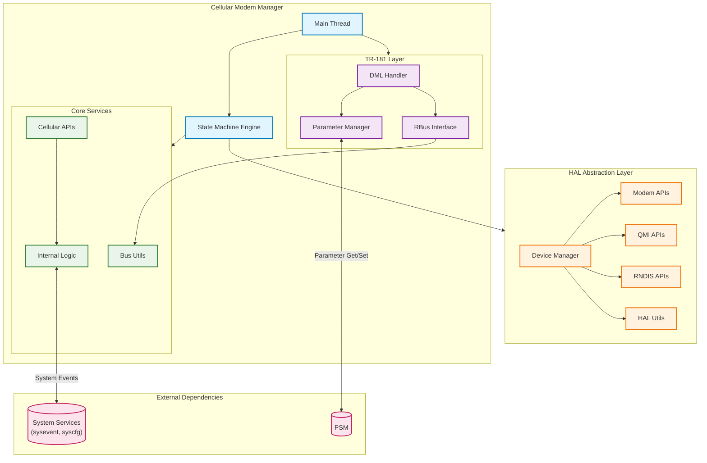
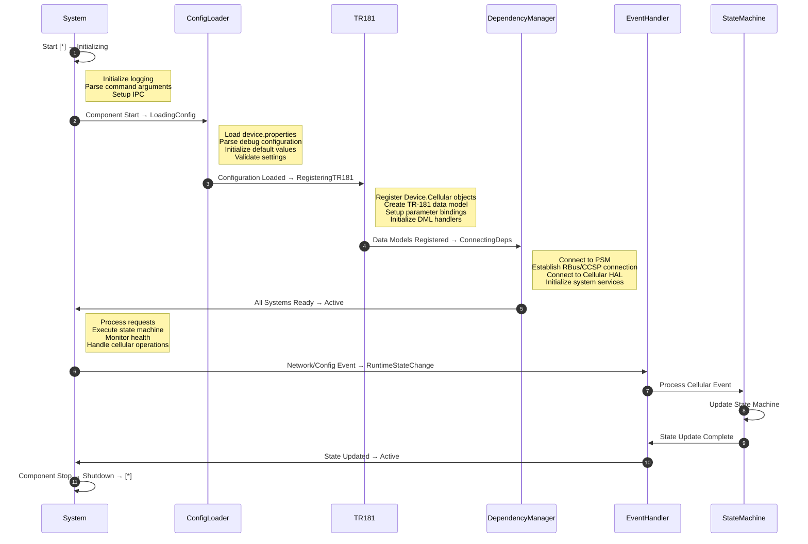
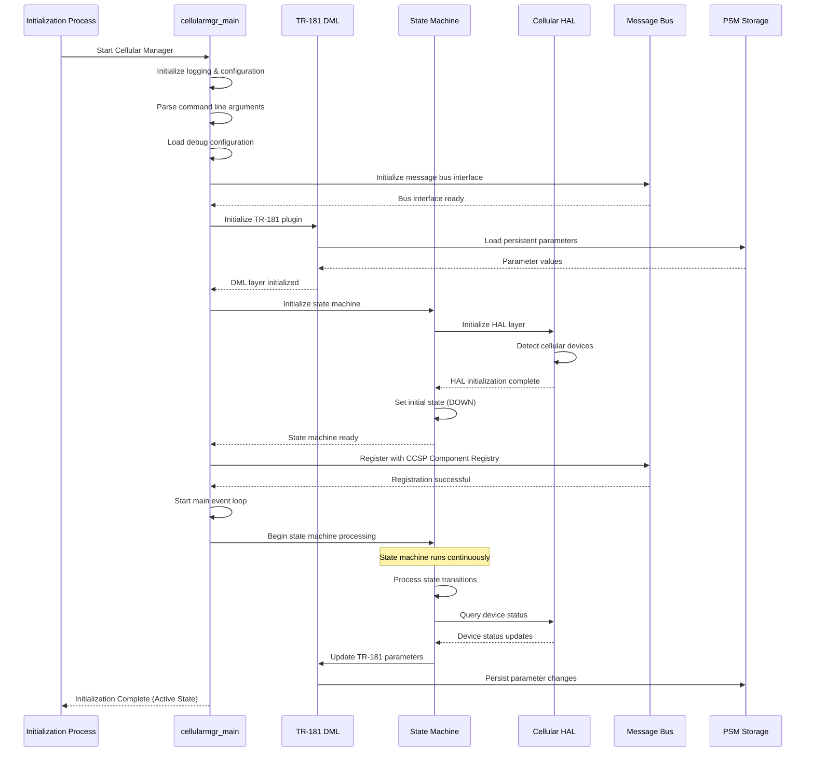
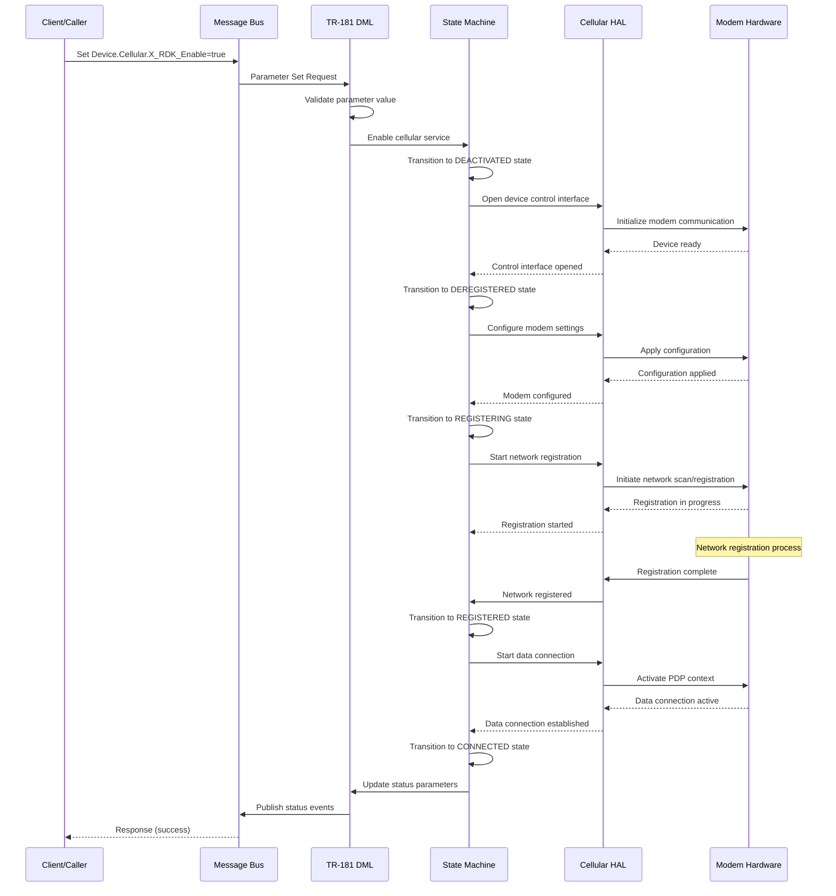
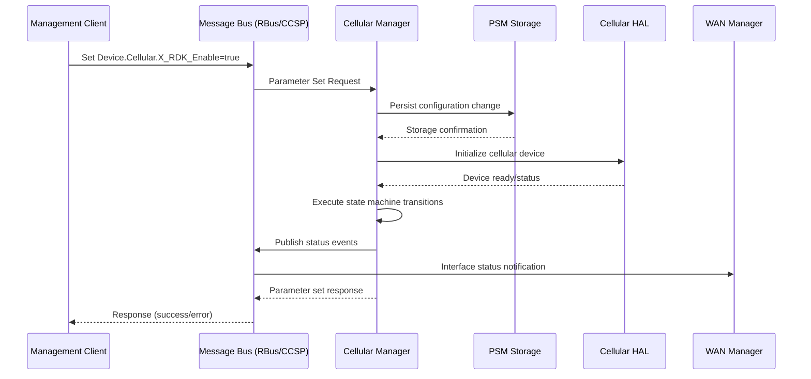
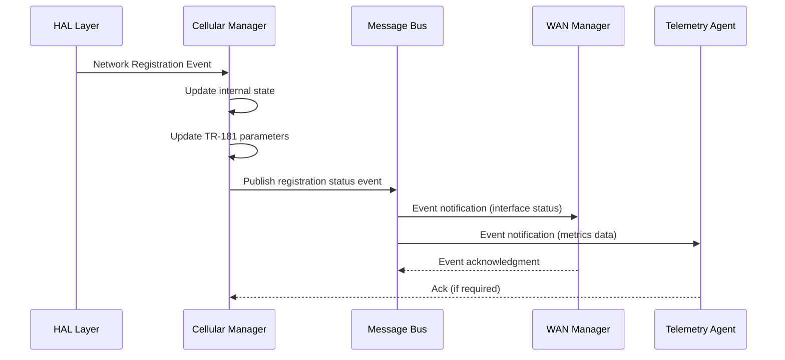

# Cellular Modem Manager Documentation

Cellular Modem Manager is the RDK-B middleware component that provides comprehensive cellular modem management, connectivity orchestration, and network interface control for broadband devices with cellular capabilities. This component serves as the central coordination point for all cellular-related operations, implementing a sophisticated state machine to manage device lifecycle, network registration, and data connectivity.

Cellular Modem Manager operates across different service layers. At the device level, it provides complete cellular connectivity services to end products, enabling broadband devices to establish and maintain cellular WAN connections as primary or backup internet connectivity. The service encompasses device discovery, carrier network registration, data session management, and failover coordination with other WAN interfaces through integration with WAN Manager. At the middleware integration level, the Cellular Modem Manager serves as the authoritative cellular service provider within the RDK-B stack. It publishes comprehensive TR-181 data models for cellular configuration and monitoring, coordinates with other middleware components through standardized IPC mechanisms, and maintains persistent configuration storage. The component implements both traditional CCSP messaging and optional RBus communication patterns based on platform capabilities, ensuring broad compatibility across RDK-B deployments.

At the module architecture level, the component provides a clean separation of concerns through distinct functional layers including TR-181 parameter management, state machine coordination, HAL abstraction, and modem driver integration. This layered approach enables support for multiple modem types (QMI, RNDIS, ModemManager) while maintaining consistent upper-layer interfaces and behavior patterns.

**old to delete**





**Key Features & Responsibilities**: 

- **Cellular Device Management**: Comprehensive lifecycle management of cellular modems including device detection, initialization, configuration, and monitoring with support for multiple modem types and interface technologies
- **Network Registration & Connectivity**: Automated carrier network registration, roaming management, access technology selection, and data session establishment with intelligent retry mechanisms and fallback strategies
- **State Machine Coordination**: Sophisticated state machine implementation managing transitions between DOWN, DEACTIVATED, DEREGISTERED, REGISTERING, REGISTERED, and CONNECTED states with proper error handling and recovery procedures
- **TR-181 Data Model Implementation**: Complete implementation of Device.Cellular TR-181 parameters with custom RDK extensions, providing standardized configuration and monitoring interfaces for cellular services
- **HAL Abstraction Layer**: Hardware abstraction layer supporting multiple modem driver technologies including QMI, RNDIS, and ModemManager with unified upper-layer interfaces
- **Multi-Protocol IPC Support**: Flexible inter-process communication supporting both traditional CCSP messaging and modern RBus protocols based on platform capabilities and configuration requirements
- **WAN Integration**: Seamless integration with WAN Manager for coordinated multi-WAN scenarios, failover management, and network interface lifecycle coordination

## Design

The Cellular Modem Manager follows a layered architecture design that prioritizes modularity, maintainability, and platform flexibility. The design centers around a state machine-driven approach where cellular connectivity lifecycle is managed through well-defined states and transitions, ensuring predictable behavior and robust error handling. The architecture separates concerns across distinct functional layers: TR-181 parameter management for standardized configuration interfaces, state machine coordination for connectivity lifecycle management, HAL abstraction for hardware independence, and driver-specific implementations for modem communication protocols.

The northbound interfaces integrate seamlessly with RDK-B middleware components through standardized IPC mechanisms, supporting both traditional CCSP messaging for backward compatibility and modern RBus protocols for enhanced performance and scalability. The component publishes comprehensive TR-181 data models following BBF specifications with RDK-specific extensions, enabling consistent management interfaces across different RDK-B deployments. Configuration persistence is managed through PSM integration, ensuring cellular settings survive system reboots and providing atomic parameter updates.

Southbound interfaces utilize a sophisticated HAL abstraction layer that provides unified APIs regardless of underlying modem driver technology. This design enables support for diverse cellular modem types including QMI-based devices, RNDIS modems, and ModemManager-controlled hardware without requiring changes to upper-layer logic. The HAL layer implements intelligent device detection, capability discovery, and driver-specific optimizations while maintaining consistent behavior patterns.

The IPC design supports both synchronous parameter operations and asynchronous event notifications, enabling efficient communication with WAN Manager for coordinated interface management and with other RDK-B components for system-wide state synchronization. Event-driven architecture ensures responsive system behavior while minimizing resource consumption through intelligent polling strategies and interrupt-driven status updates.

Data persistence and storage management leverage PSM for configuration parameters and utilize system-level storage for operational state information. The design implements atomic parameter updates, configuration validation, and rollback mechanisms to ensure system stability during configuration changes. WebConfig integration enables cloud-based configuration management with proper security boundaries and validation pipelines.
**old diagram**



**new diagram**




### Prerequisites and Dependencies

**Build-Time Flags and Configuration:**

| Configure Option | DISTRO Feature | Build Flag | Purpose | Default |
|------------------|----------------|------------|---------|---------|
| N/A | `cellular_hybrid_support` | `IS_HYBRID_SUPPORT=true` | Enable hybrid cellular modem support with additional drivers | Disabled |
| N/A | `WanFailOverSupportEnable` | `RBUS_BUILD_FLAG_ENABLE=True` | Enable RBus communication and WAN failover support | Disabled |

**RDK-B Platform and Integration Requirements (MUST):**

- **Build Dependencies**: meta-rdk-broadband layer, ccsp-common-library, hal-cellular, libsysevent, syscfg, webconfig-framework, modemmanager
- **RDK-B Components**: CCSP Component Registry (CcspCr), PSM (Parameter Storage Manager), WAN Manager for interface coordination 
- **HAL Dependencies**: Cellular HAL interface version 1.0+, supporting device detection, modem control, and status reporting APIs 
- **Systemd Services**: utopia.service, CcspCrSsp.service, PsmSsp.service, RdkWanManager.service must be active before startup 
- **Message Bus**: RBus registration for Device.Cellular namespace or CCSP component registration with eRT.com.cisco.spvtg.ccsp.cellularmanager 
- **TR-181 Data Model**: Device.Cellular object implementation with X_RDK custom extensions for RDK-specific functionality 
- **Configuration Files**: /etc/device.properties for platform identification, debug.ini for logging configuration 
- **Startup Order**: Must initialize after HAL dependencies and before dependent services like telemetry collectors 

<br>

**Threading Model** 

The Cellular Modem Manager implements a single-threaded event-driven architecture with asynchronous I/O handling for optimal resource utilization and simplified synchronization requirements.

- **Threading Architecture**: Single-threaded with event-driven message processing and state machine execution
- **Main Thread**: Handles all component operations including message bus communication, state machine processing, HAL interactions, and TR-181 parameter management
- **Event Loop Processing**: Utilizes select/poll mechanisms for efficient handling of multiple I/O sources including message bus events, HAL callbacks, timer expiration, and system signals
- **Asynchronous Operations**: HAL API calls, modem communication, and network operations are handled asynchronously with callback-based completion notification
- **Synchronization**: No inter-thread synchronization required due to single-threaded design, simplifying data access patterns and eliminating race conditions

### Component State Flow

**Initialization to Active State**

The Cellular Modem Manager follows a structured initialization sequence progressing through distinct phases from process startup to full operational capability. The initialization process ensures all dependencies are properly established before beginning cellular service operations.



**Runtime State Changes and Context Switching**

During normal operation, the component manages cellular connectivity through a sophisticated state machine with six primary states: DOWN, DEACTIVATED, DEREGISTERED, REGISTERING, REGISTERED, and CONNECTED. State transitions occur based on configuration changes, hardware events, network conditions, and external service requests.

**State Change Triggers:**

- Configuration parameter updates (X_RDK_Enable state changes)
- Hardware events (modem insertion/removal, interface state changes)
- Network events (registration success/failure, connection establishment/loss)
- System events (network interface status, carrier signal changes)
- Service requests from WAN Manager or other RDK-B components
- Timer expirations for retry mechanisms and periodic status checks

**Context Switching Scenarios:**

- Cellular enable/disable operations triggering full state machine reset
- Network roaming transitions requiring re-registration procedures
- Modem hardware failures necessitating device recovery sequences
- Configuration updates requiring service restart with parameter validation
- Failover scenarios coordinating with WAN Manager for interface priorities

### Call Flow

**Initialization Call Flow:**



**Request Processing Call Flow:**

The most critical flow supported by the component involves cellular service enablement and network connection establishment, demonstrating the complete state machine progression from disabled to connected state.



## TR‑181 Data Models

### Supported TR-181 Parameters

The Cellular Modem Manager implements a comprehensive TR-181 data model following BBF TR-181 Issue 2 specifications with RDK-specific extensions to support advanced cellular connectivity features and operational requirements. The implementation provides complete support for Device.Cellular object hierarchy with custom X_RDK extensions for enhanced functionality not covered by standard BBF specifications.

### Object Hierarchy

```
Device.
└── Cellular.
    ├── X_RDK_Enable (boolean, R/W)
    ├── X_RDK_Status (string, R)
    ├── X_RDK_DeviceType (string, R)
    ├── X_RDK_Model (string, R)
    ├── X_RDK_HardwareRevision (string, R)
    ├── X_RDK_Vendor (string, R)
    ├── X_RDK_ControlInterface (string, R)
    ├── X_RDK_ControlInterfaceStatus (string, R)
    ├── X_RDK_DataInterface (string, R)
    ├── X_RDK_DataInterfaceLink (string, R)
    ├── CellularConfig (string, R/W)
    ├── X_RDK_DeviceManagement.
    │   ├── Imei (string, R)
    │   └── FactoryReset (boolean, R/W)
    ├── X_RDK_Firmware.
    │   ├── CurrentImageVersion (string, R)
    │   └── FallbackImageVersion (string, R)
    └── Interface.{i}.
        ├── Enable (boolean, R/W)
        ├── Status (string, R)
        ├── Alias (string, R/W)
        ├── Name (string, R)
        ├── LowerLayers (string, R/W)
        ├── IMEI (string, R)
        ├── SupportedAccessTechnologies (string, R)
        ├── PreferredAccessTechnologies (string, R/W)
        ├── CurrentAccessTechnology (string, R)
        ├── X_RDK_RegisteredService (string, R)
        ├── X_RDK_PhyConnectedStatus (boolean, R)
        ├── X_RDK_LinkAvailableStatus (boolean, R)
        ├── X_RDK_Identification.
        │   ├── Imei (string, R)
        │   └── Iccid (string, R)
        └── X_RDK_PlmnAccess.
            ├── RoamingEnable (boolean, R)
            ├── RoamingStatus (string, R)
            └── HomeNetwork.
                ├── MCC (string, R)
                └── MNC (string, R)
```

### Parameter Definitions

**Core Parameters:**

| Parameter Path | Data Type | Access | Default Value | Description | BBF Compliance |
|----------------|-----------|--------|---------------|-------------|----------------|
| `Device.Cellular.X_RDK_Enable` | boolean | R/W | `false` | Master enable/disable control for cellular services. When true, initiates cellular service startup and state machine progression. When false, forces immediate shutdown of all cellular operations and transitions to DOWN state. | Custom Extension |
| `Device.Cellular.X_RDK_Status` | string | R | `"DOWN"` | Current operational status of cellular service with enumerated values: DOWN(1), DEACTIVATED(2), DEREGISTERED(3), REGISTERING(4), REGISTERED(5), CONNECTED(6). Reflects real-time state machine status. | Custom Extension |
| `Device.Cellular.X_RDK_DeviceType` | string | R | `"UNKNOWN"` | Detected cellular modem type with enumerated values: UNKNOWN(1), SOCMODEM(2), USBMODEM(3), USBRNDIS(4), ODU(5). Automatically determined during device detection phase. | Custom Extension |
| `Device.Cellular.X_RDK_Model` | string(20) | R | `""` | Cellular modem hardware model identifier as reported by device firmware. Populated during device initialization and capability discovery. | Custom Extension |
| `Device.Cellular.X_RDK_Vendor` | string(20) | R | `""` | Cellular modem manufacturer identifier obtained from device hardware information. Used for driver selection and capability determination. | Custom Extension |
| `Device.Cellular.Interface.{i}.Enable` | boolean | R/W | `true` | Interface-specific enable control allowing selective activation of individual cellular interfaces on multi-modem systems. | TR-181 Issue 2 |
| `Device.Cellular.Interface.{i}.Status` | string | R | `"Down"` | Interface operational status with enumerated values: Up(1), Down(2), Unknown(3), Dormant(4), NotPresent(5), LowerLayerDown(6), Error(7). | TR-181 Issue 2 |
| `Device.Cellular.Interface.{i}.IMEI` | string(15) | R | `""` | International Mobile Equipment Identity uniquely identifying the cellular modem hardware. Critical for carrier registration and device tracking. | TR-181 Issue 2 |
| `Device.Cellular.Interface.{i}.CurrentAccessTechnology` | string | R | `""` | Currently active cellular access technology (2G, 3G, 4G, 5G) as negotiated with carrier network. Updates dynamically during operation. | TR-181 Issue 2 |
| `Device.Cellular.Interface.{i}.X_RDK_RegisteredService` | string | R | `"NONE"` | Current network service registration status with enumerated values: NONE(0), PS(1), CS(2), PS-CS(3) indicating packet/circuit service availability. | Custom Extension |

### Parameter Registration and Access

- **Implemented Parameters**: Complete implementation of Device.Cellular object hierarchy with 40+ parameters covering device identification, network status, interface configuration, and operational metrics
- **Parameter Registration**: Parameters registered through TR-181 DML layer using CCSP framework with automatic RBus registration when enabled, supporting both get/set operations and event notifications
- **Access Mechanism**: Direct parameter access via CCSP message bus or RBus protocol with component path eRT.com.cisco.spvtg.ccsp.cellularmanager for CCSP and Device.Cellular for RBus
- **Validation Rules**: Comprehensive parameter validation including range checking for numeric values, enumeration validation for status parameters, and string length constraints for identifier fields

## Internal Modules

The Cellular Modem Manager architecture comprises distinct functional modules organized across multiple layers to provide clear separation of concerns and maintainable code structure. Each module has specific responsibilities within the overall system architecture, with well-defined interfaces and data flows between components.

| Module/Class | Description | Key Files |
|-------------|------------|-----------|
| Main Thread Controller | Primary process management and initialization coordination, handles command line processing, daemon mode setup, and main event loop execution | `cellularmgr_main.c` |
| State Machine Engine | Core cellular connectivity state machine managing transitions between DOWN, DEACTIVATED, DEREGISTERED, REGISTERING, REGISTERED, and CONNECTED states with timer management and event processing | `cellularmgr_sm.c` |
| TR-181 DML Handler | Data Model Layer implementation providing TR-181 parameter access, validation, and persistence with complete Device.Cellular object hierarchy support | `cellularmgr_cellular_dml.c`, `cellularmgr_cellular_dml.h` |
| Parameter Manager | Configuration parameter processing and WebConfig integration for cloud-based configuration management with JSON parsing and validation | `cellularmgr_cellular_param.c`, `cellularmgr_cellular_param.h` |
| HAL Device Manager | Hardware abstraction layer providing unified device management APIs across different modem types with device detection and capability discovery | `cellular_hal_device_manager.c`, `cellular_hal_device_manager.h` |
| QMI Protocol Handler | Qualcomm MSM Interface protocol implementation for modem communication with command/response handling and event processing | `cellular_hal_qmi_apis.c`, `cellular_hal_qmi_apis.h` |
| RNDIS Protocol Handler | Remote Network Driver Interface Specification implementation for USB cellular modems with network interface management | `cellular_hal_rndis_apis.c`, `cellular_hal_rndis_apis.h` |
| ModemManager Interface | ModemManager daemon integration providing standardized modem control APIs for compatible cellular devices | `cellular_hal_mm_apis.c`, `cellular_hal_mm_apis.h` |
| Message Bus Interface | Inter-process communication layer supporting both CCSP and RBus protocols with component registration and event publishing | `cellularmgr_messagebus_interface.c`, `cellularmgr_bus_utils.c` |
| RBus Integration | Modern RBus protocol implementation for enhanced IPC performance with event publishing and subscription management | `cellularmgr_rbus_dml.c`, `cellularmgr_rbus_events.c` |

```mermaid
flowchart TD
    subgraph CellularManager ["Cellular Manager"]
        Main([Main Thread<br/>cellularmgr_main.c])
        SM([State Machine<br/>cellularmgr_sm.c])
        CellAPIs([Cellular APIs<br/>cellularmgr_cellular_apis.c])
        Internal([Internal Logic<br/>cellularmgr_cellular_internal.c])
        BusUtils([Bus Utils<br/>cellularmgr_bus_utils.c])
        MsgBusIF([Message Bus Interface<br/>cellularmgr_messagebus_interface.c])
    end

    subgraph TR181Layer ["TR-181 Data Model Layer"]
        DML([DML Handler<br/>cellularmgr_cellular_dml.c])
        ParamMgr([Parameter Manager<br/>cellularmgr_cellular_param.c])
        Helpers([Helpers<br/>cellularmgr_cellular_helpers.c])
        PluginMain([Plugin Main<br/>cellularmgr_plugin_main.c])
        Utils([Utils<br/>cellularmgr_utils.c])
        WebConfigAPI([WebConfig API<br/>cellularmgr_cellular_webconfig_api.c])
    end

    subgraph RBusLayer ["RBus Integration (Conditional)"]
        RBusDML([RBus DML<br/>cellularmgr_rbus_dml.c])
        RBusEvents([RBus Events<br/>cellularmgr_rbus_events.c])
        RBusHelpers([RBus Helpers<br/>cellularmgr_rbus_helpers.c])
    end

    subgraph HALAbstraction ["HAL Abstraction Layer"]
        HALCore([HAL Core<br/>cellular_hal.c])
        HALDevice([Device Abstraction<br/>cellular_hal_device_abstraction.c])
        HALDevMgr([Device Manager<br/>cellular_hal_device_manager.c])
        HALModem([Modem APIs<br/>cellular_hal_modem_apis.c])
        HALUtils([HAL Utils<br/>cellular_hal_utils.c])
    end

    subgraph ModemDrivers ["Modem Driver Interfaces"]
        QMIAPIs([QMI APIs<br/>cellular_hal_qmi_apis.c])
        RNDISAPIs([RNDIS APIs<br/>cellular_hal_rndis_apis.c])
        MMAPIs([ModemManager APIs<br/>cellular_hal_mm_apis.c])
    end

    %% Main flow connections
    Main --> SM
    Main --> MsgBusIF
    SM --> CellAPIs
    SM --> Internal
    CellAPIs --> Internal
    MsgBusIF --> BusUtils

    %% TR-181 connections
    Main --> TR181Layer
    DML --> ParamMgr
    DML --> Helpers
    PluginMain --> DML
    ParamMgr --> Utils
    Internal --> WebConfigAPI

    %% RBus connections (conditional)
    TR181Layer --> RBusLayer
    RBusDML --> RBusEvents
    RBusDML --> RBusHelpers

    %% HAL connections
    CellAPIs --> HALAbstraction
    Internal --> HALAbstraction
    HALCore --> HALDevice
    HALCore --> HALDevMgr
    HALDevMgr --> HALModem
    HALDevice --> HALUtils

    %% Driver connections
    HALModem --> ModemDrivers
    HALDevice --> ModemDrivers
    QMIAPIs --> RNDISAPIs
    MMAPIs --> QMIAPIs

    %% Styling
    classDef main fill:#e1f5fe,stroke:#0277bd,stroke-width:2px
    classDef tr181 fill:#f3e5f5,stroke:#7b1fa2,stroke-width:2px
    classDef rbus fill:#fff3e0,stroke:#ef6c00,stroke-width:2px
    classDef hal fill:#e8f5e8,stroke:#2e7d32,stroke-width:2px
    classDef drivers fill:#fce4ec,stroke:#c2185b,stroke-width:2px

    class Main,SM,CellAPIs,Internal,BusUtils,MsgBusIF main
    class DML,ParamMgr,Helpers,PluginMain,Utils,WebConfigAPI tr181
    class RBusDML,RBusEvents,RBusHelpers rbus
    class HALCore,HALDevice,HALDevMgr,HALModem,HALUtils hal
    class QMIAPIs,RNDISAPIs,MMAPIs drivers
```



## Component Interactions

The Cellular Modem Manager integrates extensively with RDK-B middleware components, system services, and hardware abstraction layers to provide comprehensive cellular connectivity services. The component serves as both a service provider publishing cellular status and capabilities, and a service consumer requiring system-level services for proper operation.

### Interaction Matrix

| Target Component/Layer | Interaction Purpose | Key APIs/Endpoints |
|------------------------|-------------------|------------------|
| **RDK-B Middleware Components** |
| WAN Manager | Interface status coordination, failover management, priority-based connection control | `Device.X_RDK_WanManager.InterfaceStatus`, `cellular_wan_interface_status` |
| CCSP Component Registry | Component lifecycle management, parameter routing, service discovery | `registerComponent()`, `getParameterValues()`, `setParameterValues()` |
| PSM (Parameter Storage) | Configuration persistence, parameter storage, atomic updates | `PSM_Get_Record_Value2()`, `PSM_Set_Record_Value2()` |
| Telemetry Agent | Performance metrics reporting, KPI data collection, operational statistics | `Device.Cellular.Interface.Stats`, `cellular_connection_metrics` |
| **System & HAL Layers** |
| Cellular HAL | Hardware control, device management, status monitoring, driver abstraction | `cellular_hal_init()`, `cellular_hal_get_device_status()`, `cellular_hal_start_network()` |
| SysEvent | System-wide event notification, network state changes, interface status | `sysevent_set()`, `sysevent_get()`, event topics: `cellular_wan_*` |
| SysCfg | System configuration storage, persistent settings, factory defaults | `syscfg_get()`, `syscfg_set()`, `/etc/utopia/system_defaults` |
| WebConfig Framework | Cloud configuration management, remote provisioning, configuration validation | `webconfig_framework_register()`, cellular configuration subdoc |
| **External Systems** |
| Carrier Networks | Network registration, data connectivity, roaming services | Hardware-dependent via HAL abstraction |


**Events Published by Cellular Modem Manager:**

| Event Name | Event Topic/Path | Trigger Condition | Subscriber Components |
|------------|-----------------|-------------------|---------------------|
| Cellular Status Change | `Device.Cellular.X_RDK_Status` | State machine transitions (DOWN→CONNECTED) | WAN Manager, Telemetry Agent, System Monitor |
| Interface Status Update | `cellular_wan_interface_status` | Network interface up/down events | WAN Manager, Network Services, Routing Services |
| Registration Status | `Device.Cellular.Interface.RegistrationStatus` | Network registration changes | Network Monitor, Telemetry Agent |
| Connection Metrics | `cellular_connection_metrics` | Periodic performance data collection | Telemetry Agent, Performance Monitor |
| Configuration Change | `cellular_config_applied` | WebConfig or parameter updates | Configuration Manager, Audit Logger |


**Events Consumed by Cellular Modem Manager:**

| Event Source | Event Topic/Path | Purpose | Handler Function |
|-------------|-----------------|---------|------------------|
| WAN Manager | `wan_interface_priority_change` | React to WAN interface priority updates | `cellularmgr_wan_priority_handler()` |
| System Services | `system_ready` | Begin cellular service initialization | `cellularmgr_system_ready_handler()` |
| HAL Layer | `cellular_device_event` | Handle hardware events (insertion/removal) | `cellularmgr_device_event_handler()` |
| WebConfig Framework | `cellular_config_update` | Apply cloud-provided configuration | `cellularmgr_webconfig_handler()` |


### IPC Flow Patterns

**Primary IPC Flow - Cellular Service Enablement:**



**Event Notification Flow:**



## Implementation Details

### Major HAL APIs Integration

The Cellular Modem Manager integrates with the Cellular HAL through a comprehensive set of APIs that provide hardware abstraction for diverse cellular modem types and interface technologies. The HAL integration supports multiple communication protocols and device management operations while maintaining consistent upper-layer interfaces.

**Core HAL APIs:**

| HAL API | Purpose | Implementation File |
|---------|---------|-------------------|
| `cellular_hal_init` | Initialize HAL layer and detect cellular devices | `cellular_hal.c` |
| `cellular_hal_get_device_info` | Retrieve device identification and capability information | `cellular_hal_device_manager.c` |
| `cellular_hal_open_device` | Open control interface for modem communication | `cellular_hal_device_abstraction.c` |
| `cellular_hal_start_network` | Initiate network registration and data connection | `cellular_hal_modem_apis.c` |
| `cellular_hal_get_network_status` | Query current network registration and connection status | `cellular_hal_modem_apis.c` |
| `cellular_hal_set_modem_config` | Configure modem parameters and operational settings | `cellular_hal_modem_apis.c` |
| `cellular_hal_register_callback` | Register event callbacks for asynchronous notifications | `cellular_hal_utils.c` |


### Key Implementation Logic

- **State Machine Engine**: Core state machine implementation resides in `cellularmgr_sm.c` with six primary states (DOWN, DEACTIVATED, DEREGISTERED, REGISTERING, REGISTERED, CONNECTED) and comprehensive transition logic handling configuration changes, hardware events, and network conditions. The state machine utilizes timer-based processing with 500ms loop intervals for responsive operation while minimizing CPU utilization.

- **Event Processing**: Asynchronous hardware and network events are processed through callback mechanisms registered with the HAL layer, with event queuing and prioritization logic ensuring critical events receive immediate processing while maintaining system stability during high-frequency event scenarios.

- **Error Handling Strategy**: Multi-layer error handling approach with HAL-level error detection, state machine error recovery mechanisms, and upper-layer error reporting through TR-181 parameter updates and event notifications. Timeout handling implements exponential backoff for network operations with configurable retry limits and fallback procedures.

- **Logging & Debugging**: Comprehensive logging framework with configurable verbosity levels (ERROR, WARN, INFO, DEBUG) and component-specific log categories enabling targeted debugging of state machine transitions, HAL interactions, and network operations. Debug configuration loaded from `/etc/debug.ini` with runtime log level adjustment capabilities.

### Key Configuration Files

| Configuration File | Purpose | Override Mechanisms |
|--------------------|---------|---------------------|
| `/tmp/cellularmanager_initialized_bootup` | Initialization status tracking | Automatic creation/removal |
| `RdkCellularManager.xml` | TR-181 data model definitions | Build-time customization |
