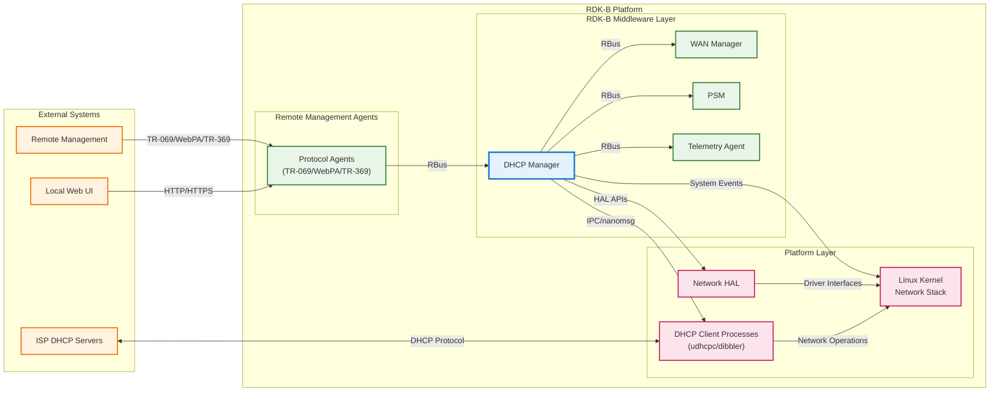
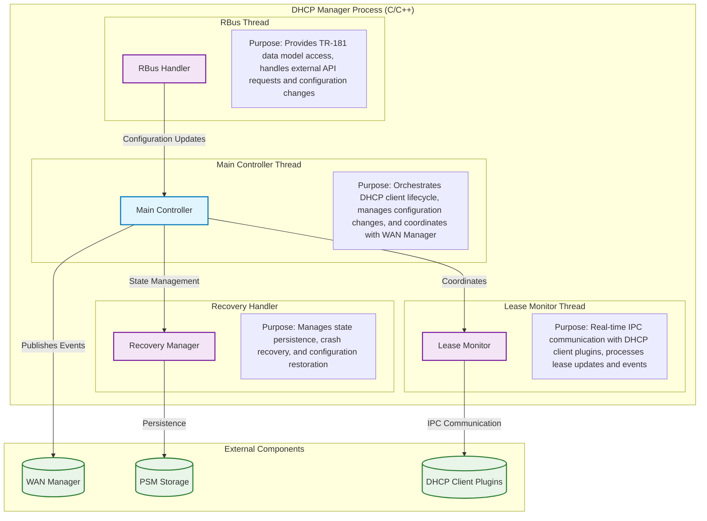
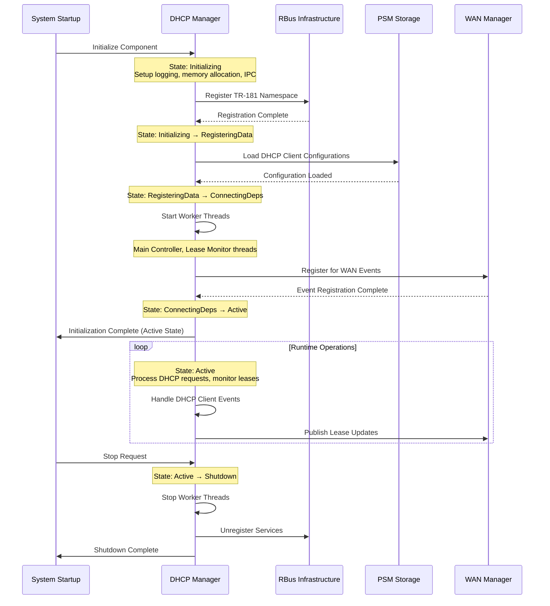
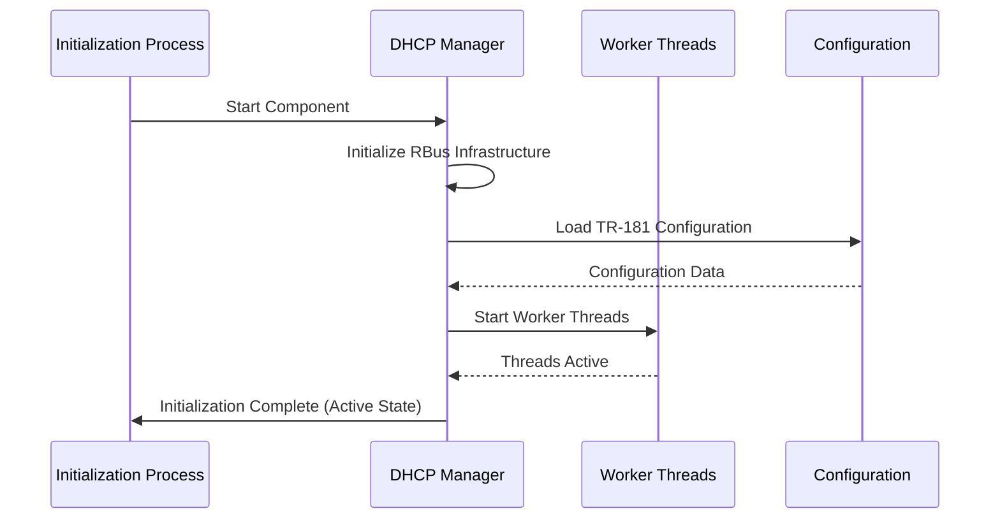
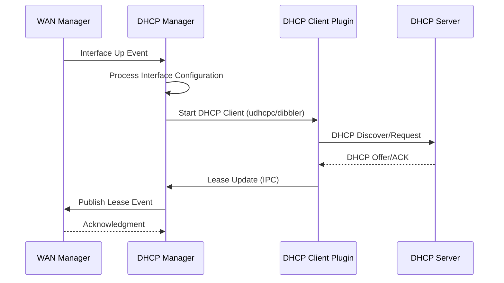
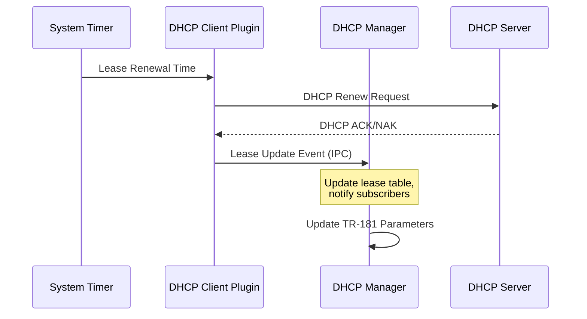

# DHCP Manager Documentation

The DHCP Manager is a comprehensive component of the RDK-B (Reference Design Kit for Broadband) framework that provides centralized management and orchestration of DHCP operations for both IPv4 and IPv6 protocols. This component serves as the primary controller for DHCP client configurations, lease monitoring, and dynamic IP address management across WAN interfaces. It ensures efficient IPv4/IPv6 coexistence, seamless network transitions, and robust recovery mechanisms in RDK-B networking environments.




**Key Features & Responsibilities**: 

- **Dual Protocol Support**: Comprehensive management of both DHCPv4 and DHCPv6 clients with unified configuration interface
- **Centralized DHCP Orchestration**: Single point of control for all DHCP client operations across multiple WAN interfaces with dynamic client lifecycle management
- **Real-time Lease Monitoring**: IPC-based system for receiving, processing, and distributing lease updates from DHCP client plugins to WAN Manager and other subscribers
- **TR-181 Data Model Integration**: Full compliance with TR-181 DHCP specifications providing standardized management interface for remote configuration and monitoring
- **Recovery and Persistence**: Automatic recovery of DHCP client states, lease information, and configuration after system restarts with crash-resistant state management
- **Custom DHCP Options Support**: Extensive support for vendor-specific and custom DHCP options including option 125, user class identifiers, and MAP-T transition technology
- **Event-driven Architecture**: Publishes lease events and state changes to WAN Manager, which orchestrates reactive system responses to network state changes, interface events, and lease lifecycle transitions with minimal latency

## Design

The DHCP Manager follows a modular, event-driven architecture designed to provide centralized control over DHCP operations while maintaining loose coupling with other RDK-B components. The core design principle centers on separation of concerns, where the main controller orchestrates DHCP client lifecycle management, while specialized modules handle lease monitoring, recovery operations, and custom option processing. This architecture ensures scalability, maintainability, and robust error handling across diverse network scenarios.

The system employs a multi-threaded design with dedicated threads for different operational aspects: the main controller thread manages client configurations and state transitions, the lease monitor thread handles real-time IPC communication with DHCP client plugins (udhcpc and dibbler), and the RBus thread provides TR-181 data model access for external management. This threading model ensures that critical operations like lease renewals and state updates are not blocked by configuration changes or external API calls.

Northbound interactions are managed through the TR-181 data model interface via RBus, enabling remote management systems and local web interfaces to configure DHCP clients, retrieve status information, and monitor lease states. The component publishes lease events and status changes to subscribing components, particularly WAN Manager, ensuring coordinated network state management across the entire RDK-B stack.

Southbound interactions include direct communication with HAL layers for network interface control, file system operations for configuration persistence, and IPC communication with DHCP client processes. The design abstracts the complexity of different DHCP client implementations (udhcpc for IPv4, dibbler for IPv6) through a unified plugin architecture, allowing for easy extension and platform-specific optimizations.

Data persistence and storage management is achieved through integration with PSM (Persistent Storage Manager) for TR-181 parameter storage, local file system for DHCP client configuration files, and in-memory structures for runtime state management. The recovery handler module ensures that all persistent state is regularly synchronized and can be restored after unexpected shutdowns or component crashes.




### Prerequisites and Dependencies

**Build-Time Flags and Configuration:**

| Configure Option | DISTRO Feature | Build Flag | Purpose | Default |
|------------------|----------------|------------|---------|---------|
| `--enable-maptsupport` | `nat46` / `feature_mapt` / `unified_mapt` | `FEATURE_SUPPORT_MAPT_NAT46` | Enable MAP-T (Mapping of Address and Port with Translation) support for IPv4/IPv6 transition technology | Disabled |
| `--enable-notify` | `systemd` | `ENABLE_SD_NOTIFY` | Enable systemd notify support for service status reporting and lifecycle management | Required |
| `--enable-dropearly` | N/A | `DROP_ROOT_EARLY` | Enable early privilege dropping for enhanced security and reduced attack surface | Disabled |
| `--enable-dhcp_server_support` | N/A | `DHCP_SERVER_SUPPORT` | Enable DHCP server functionality for LAN-side IP address assignment | Disabled (recipe sets to no) |
| `--enable-dhcp_client_support` | N/A | `DHCP_CLIENT_SUPPORT` | Enable DHCP client functionality for WAN-side IP address acquisition | Enabled (recipe sets to yes) |
| `--enable-dhcpv4_server_support` | N/A | `DHCPV4_SERVER_SUPPORT` | Enable DHCPv4 server support for IPv4 address management | Disabled (recipe sets to no) |
| `--enable-dhcpv6_server_support` | N/A | `DHCPV6_SERVER_SUPPORT` | Enable DHCPv6 server support for IPv6 address and prefix delegation | Disabled (recipe sets to no) |
| `--enable-dhcpv4_client_support` | N/A | `DHCPV4_CLIENT_SUPPORT` | Enable DHCPv4 client support for IPv4 DHCP operations via udhcpc plugin | Enabled (recipe sets to yes) |
| `--enable-dhcpv6_client_support` | N/A | `DHCPV6_CLIENT_SUPPORT` | Enable DHCPv6 client support for IPv6 DHCP operations via dibbler plugin | Enabled (recipe sets to yes) |
| `--enable-bci_support` | `bci` | `BCI_SUPPORT` | Enable Box Cloud Initiative support for telemetry reporting and cloud integration | Conditional on DISTRO feature |
| `--with-ccsp-platform` | N/A | `CCSP_PLATFORM` | Specify CCSP platform type (intel_usg, pc, bcm) for platform-specific optimizations | bcm (recipe sets) |
| `--with-ccsp-arch` | N/A | `CCSP_ARCH` | Specify CCSP CPU architecture (arm, atom, pc, mips) for target-specific builds | arm (recipe sets) |

**RDK-B Platform and Integration Requirements:**

* **RDK-B Components**: `CcspPandM`, `CcspPsm`, `CcspCommonLibrary`, `CcspLMLite`, `WanManager`
* **HAL Dependencies**: Network HAL interfaces (hal-dhcpv4c, hal-ethsw, hal-moca, hal-wifi) for interface management and DHCP operations
* **Systemd Services**: `CcspCrSsp.service`, `CcspPsmSsp.service`, `gwprovapp.service` must be active before `CcspDHCPMgr.service` starts
* **Message Bus**: RBus registration under TR-181 namespace `Device.DHCPv4.Client.{i}.*` and `Device.DHCPv6.Client.{i}.*` for parameter management
* **TR-181 Data Model**: Full TR-181 Issue 2 Amendment 15 DHCP objects and parameters support with MAP-T extensions when enabled
* **Configuration Files**: `/usr/ccsp/dhcpmgr/TR181-DHCPMgr.XML` for data model definition; systemd unit files for service management
* **Startup Order**: Initialize after Component Registry, PSM services, and network interfaces are active; before WAN Manager final configuration

<br>

**Threading Model:** 

The DHCP Manager implements a sophisticated multi-threaded architecture using POSIX pthreads for concurrent DHCP operations while maintaining system responsiveness and data consistency. The component creates multiple worker threads to handle different aspects of DHCP client management, lease monitoring, and recovery operations.

| Thread & Function | Purpose | Cycle/Timeout | Synchronization |
|-------------------|---------|----------------|------------------|
| **Main Thread**<br>`ssp_main()` / `main()` | Component initialization, RBus registration, TR-181 parameter handling, message loop processing | Event-driven message loop with RBus callbacks and SSP lifecycle management | RBus async callbacks, pthread mutexes for shared data structures, TR-181 parameter access control |
| **Main Controller Thread**<br>`DhcpMgr_MainController()` | DHCP client lifecycle management, configuration processing, WAN Manager coordination, client process control | Continuous monitoring loop with configurable intervals for client state management | pthread_create() in `DhcpMgr_StartMainController()`, pthread_detach() for autonomous operation, mutex synchronization for lease tables |
| **Lease Monitor Thread**<br>`DhcpMgr_LeaseMonitor_Thrd()` | Real-time IPC communication with DHCP client plugins, lease event processing, status updates via nanomsg | Continuous IPC message processing with blocking receive operations on `tcp://127.0.0.1:50324` | pthread_create() in `DhcpMgr_LeaseMonitor_Start()`, pthread_detach() for autonomous operation, nanomsg NN_PULL socket for IPC |
| **PID Monitor Thread**<br>`dhcp_pid_mon()` | DHCP client process monitoring, crash detection and recovery operations for udhcpc/dibbler processes | Continuous process monitoring with periodic PID file validation and process status checks | pthread_create() in `DhcpMgr_Dhcp_Recovery_Start()`, pthread_detach() for autonomous operation, file-based PID monitoring |
| **IFL Framework Threads**<br>`IFL_Thread()` worker functions | Generic event handling and IPC communication framework supporting sysevent processing and task queuing | Configurable thread lifecycle with joinable/detached modes based on thread properties | pthread_attr_setdetachstate(), mutex/spinlock coordination via IFL framework, task queue management |

### Component State Flow

**Initialization to Active State**

The DHCP Manager follows a structured initialization sequence that ensures all dependencies are satisfied and the system is ready for DHCP operations before transitioning to active state.



**Runtime State Changes and Context Switching**

The DHCP Manager undergoes several runtime state changes based on network conditions, interface status, and configuration updates that impact its operational context.

**State Change Triggers:**

- **Interface State Changes**: WAN interface up/down events trigger DHCP client start/stop operations
- **Configuration Updates**: TR-181 parameter changes trigger client reconfiguration and restart cycles
- **Lease Events**: DHCP lease acquire/renew/expire events cause lease table updates and WAN Manager notifications
- **Recovery Operations**: Crash detection or configuration corruption triggers state restoration from persistent storage

**Context Switching Scenarios:**

- **Active to Maintenance Mode**: Triggered by critical configuration changes requiring client restart
- **IPv4/IPv6 Protocol Switching**: Dynamic switching between single-stack and dual-stack operations based on provider support
- **Interface Failover**: DHCP Manager maintains client configurations across interface transitions while WAN Manager controls failover decisions and seamless migration between primary and backup WAN interfaces

### Call Flow

**Initialization Call Flow:**



**DHCP Client Request Processing Call Flow:**



**Lease Renewal Call Flow:**



## TR‑181 Data Models

### Supported TR-181 Parameters

The DHCP Manager implements comprehensive TR-181 DHCP data models supporting both DHCPv4 and DHCPv6 client configurations with full BBF compliance for parameter definitions, access methods, and validation rules.

### Object Hierarchy

```
Device.
├── DHCPv4.
│   ├── ClientNumberOfEntries (unsignedInt, R)
│   └── Client.{i}.
│       ├── Enable (boolean, R/W)
│       ├── Status (string, R)
│       ├── Interface (string, R/W)
│       ├── Alias (string, R/W)
│       ├── DHCPStatus (string, R)
│       ├── IPAddress (string, R)
│       ├── SubnetMask (string, R)
│       ├── IPRouters (string, R)
│       ├── DNSServers (string, R)
│       ├── LeaseTimeRemaining (int, R)
│       ├── RenewTime (dateTime, R)
│       ├── RebindTime (dateTime, R)
│       ├── SentOptionNumberOfEntries (unsignedInt, R)
│       ├── ReqOptionNumberOfEntries (unsignedInt, R)
│       ├── SentOption.{i}.
│       │   ├── Enable (boolean, R/W)
│       │   ├── Tag (unsignedInt, R/W)
│       │   └── Value (hexBinary, R/W)
│       └── ReqOption.{i}.
│           ├── Enable (boolean, R/W)
│           ├── Order (unsignedInt, R/W)
│           └── Tag (unsignedInt, R/W)
└── DHCPv6.
    ├── ClientNumberOfEntries (unsignedInt, R)
    └── Client.{i}.
        ├── Enable (boolean, R/W)
        ├── Status (string, R)
        ├── Interface (string, R/W)
        ├── Alias (string, R/W)
        ├── DUID (hexBinary, R)
        ├── RequestAddresses (boolean, R/W)
        ├── RequestPrefixes (boolean, R/W)
        ├── RapidCommit (boolean, R/W)
        ├── SentOptionNumberOfEntries (unsignedInt, R)
        ├── ReceivedOptionNumberOfEntries (unsignedInt, R)
        ├── SentOption.{i}.
        │   ├── Enable (boolean, R/W)
        │   ├── Tag (unsignedInt, R/W)
        │   └── Value (hexBinary, R/W)
        └── ReceivedOption.{i}.
            ├── Tag (unsignedInt, R)
            ├── Value (hexBinary, R)
            └── Server (string, R)
```

### Parameter Definitions

**Core DHCPv4 Parameters:**

| Parameter Path | Data Type | Access | Default Value | Description | BBF Compliance |
|----------------|-----------|--------|---------------|-------------|----------------|
| `Device.DHCPv4.ClientNumberOfEntries` | unsignedInt | R | `0` | The number of entries in the DHCPv4 Client table. Automatically managed by the system. | TR-181 Issue 2 |
| `Device.DHCPv4.Client.{i}.Enable` | boolean | R/W | `false` | Enables or disables the DHCPv4 client instance. When enabled, the client will attempt to obtain IP configuration from a DHCP server. | TR-181 Issue 2 |
| `Device.DHCPv4.Client.{i}.Status` | string | R | `"Disabled"` | Current operational status of the DHCPv4 client. Enumerated values: Disabled, Enabled, Error_Misconfigured, Error | TR-181 Issue 2 |
| `Device.DHCPv4.Client.{i}.Interface` | string | R/W | `""` | Reference to the IP interface on which the DHCP client will operate. Must be a valid Device.IP.Interface reference. | TR-181 Issue 2 |
| `Device.DHCPv4.Client.{i}.DHCPStatus` | string | R | `"Init"` | Current DHCP protocol state. Values: Init, Selecting, Requesting, Bound, Renewing, Rebinding, InitReboot, Rebooting | TR-181 Issue 2 |
| `Device.DHCPv4.Client.{i}.IPAddress` | string | R | `""` | Current IP address assigned by the DHCP server. Empty if no lease is active. Format: IPv4 dotted decimal notation. | TR-181 Issue 2 |
| `Device.DHCPv4.Client.{i}.SubnetMask` | string | R | `""` | Subnet mask assigned by the DHCP server. Format: IPv4 dotted decimal notation. | TR-181 Issue 2 |
| `Device.DHCPv4.Client.{i}.LeaseTimeRemaining` | int | R | `-1` | Number of seconds remaining in the current DHCP lease. -1 indicates infinite lease or no active lease. | TR-181 Issue 2 |

**Core DHCPv6 Parameters:**

| Parameter Path | Data Type | Access | Default Value | Description | BBF Compliance |
|----------------|-----------|--------|---------------|-------------|----------------|
| `Device.DHCPv6.ClientNumberOfEntries` | unsignedInt | R | `0` | The number of entries in the DHCPv6 Client table. Automatically managed by the system. | TR-181 Issue 2 |
| `Device.DHCPv6.Client.{i}.Enable` | boolean | R/W | `false` | Enables or disables the DHCPv6 client instance for address and/or prefix delegation. | TR-181 Issue 2 |
| `Device.DHCPv6.Client.{i}.Status` | string | R | `"Disabled"` | Current operational status of the DHCPv6 client. Values: Disabled, Enabled, Error_Misconfigured, Error | TR-181 Issue 2 |
| `Device.DHCPv6.Client.{i}.DUID` | hexBinary | R | `""` | DHCP Unique Identifier used by the client. Generated based on hardware address and timestamp. | TR-181 Issue 2 |
| `Device.DHCPv6.Client.{i}.RequestAddresses` | boolean | R/W | `true` | Enable Identity Association for Non-temporary Addresses (IA_NA) in DHCPv6 requests. | TR-181 Issue 2 |
| `Device.DHCPv6.Client.{i}.RequestPrefixes` | boolean | R/W | `false` | Enable Identity Association for Prefix Delegation (IA_PD) in DHCPv6 requests for prefix delegation. | TR-181 Issue 2 |

## Internal Modules

The DHCP Manager consists of several specialized modules that work together to provide comprehensive DHCP client management. Each module has specific responsibilities and interfaces for handling different aspects of DHCP operations.

| Module/Class | Description | Key Files |
|-------------|------------|-----------|
| **Main Controller** | Central orchestration module that manages DHCP client lifecycle, configuration changes, and coordination with other RDK-B components | `dhcpmgr_controller.c`, `dhcpmgr_controller.h` |
| **Lease Monitor** | Real-time IPC communication handler that receives lease updates from DHCP client plugins and processes lease state changes | `dhcp_lease_monitor_thrd.c`, `dhcp_lease_monitor_thrd.h` |
| **DHCPv4 Interface** | IPv4-specific DHCP client management including udhcpc plugin integration and IPv4 lease processing | `dhcpv4_interface.c`, `dhcpv4_interface.h` |
| **DHCPv6 Interface** | IPv6-specific DHCP client management including dibbler plugin integration and IPv6 address/prefix delegation | `dhcpv6_interface.c`, `dhcpv6_interface.h` |
| **Recovery Handler** | Persistence and crash recovery module that manages state restoration and configuration backup operations | `dhcpmgr_recovery_handler.c`, `dhcpmgr_recovery_handler.h` |
| **Custom Options** | Vendor-specific and custom DHCP option processing including option 125, user class identifiers, and MAP-T support | `dhcpmgr_custom_options.c`, `dhcpmgr_custom_options.h` |
| **SSP Interface** | System Service Provider interface for RBus integration and TR-181 data model implementation | `ssp_main.c`, `ssp_messagebus_interface.c` |

## Component Interactions

The DHCP Manager operates as a central coordinator in the RDK-B networking stack, maintaining active communication with multiple components to ensure seamless DHCP operations and network state management.

### Interaction Matrix

| Target Component/Layer | Interaction Purpose | Key APIs/Endpoints |
|------------------------|-------------------|------------------|
| **RDK-B Middleware Components** |
| WAN Manager | Lease event notifications, interface status coordination, network state synchronization | `RBus_PublishEvent`, `Device.X_RDK_WanManager.Interface.{i}.*` |
| PSM Component | Configuration persistence, TR-181 parameter storage, crash recovery data | `PSM_Set_Record_Value2`, `PSM_Get_Record_Value2` |
| Component Registry | Service registration, health monitoring, inter-component discovery | `CcspBaseIf_registerCapabilities`, `CcspBaseIf_discoverComponent` |
| **System & HAL Layers** |
| Network HAL | Interface status monitoring, network device control, IP configuration | `netHalGetIfStatus()`, `netHalSetIfAddress()` |
| File System | DHCP client configuration files, lease databases, log files | `/tmp/dhcp_*.conf`, `/tmp/udhcpc_*.pid`, `/var/log/dhcp.log` |
| DHCP Client Processes | Runtime control, lease monitoring, option configuration | IPC via nanomsg `tcp://127.0.0.1:50324` |

**Events Published by DHCP Manager:**

| Event Name | Event Topic/Path | Trigger Condition | Subscriber Components |
|------------|-----------------|-------------------|---------------------|
| DHCPv4_Lease_Obtained | `Device.DHCPv4.Client.{i}.DHCPStatus` | DHCPv4 lease successfully acquired | WAN Manager, Device Management |
| DHCPv6_Address_Assigned | `Device.DHCPv6.Client.{i}.Status` | DHCPv6 address assignment complete | WAN Manager, Routing Manager |
| DHCP_Client_Error | `Device.DHCPv4/v6.Client.{i}.Status` | DHCP client error or failure condition | System Health Monitor, WAN Manager |
| Lease_Renewal_Success | `Device.DHCP.Lease.Renewed` | DHCP lease successfully renewed | Telemetry, Network Analytics |

## Implementation Details

### Major HAL APIs Integration

The DHCP Manager integrates with several HAL APIs to manage network interfaces and monitor system state for effective DHCP operations.

**Core HAL APIs:**

| HAL API | Purpose | Implementation File |
|---------|---------|-------------------|
| `netHalGetIfStatus()` | Retrieve network interface operational status and capabilities | `dhcpmgr_controller.c` |
| `netHalSetIfAddress()` | Configure IP address settings on network interfaces | `dhcpv4_interface.c`, `dhcpv6_interface.c` |
| `netHalGetIfStats()` | Monitor interface statistics and error conditions | `dhcp_lease_monitor_thrd.c` |

### Key Implementation Logic

- **DHCP Client State Machine**: The core state management logic implements the complete DHCP client state machine with states (Init, Selecting, Requesting, Bound, Renewing, Rebinding) as defined in RFC 2131 for DHCPv4 and RFC 8415 for DHCPv6
     - Main state machine implementation in `dhcpmgr_controller.c` with comprehensive state transition validation
     - Protocol-specific state handlers in `dhcpv4_interface.c` and `dhcpv6_interface.c` for IPv4 and IPv6 operations
  
- **IPC Event Processing**: High-performance asynchronous event processing system handles lease updates, configuration changes, and error conditions with minimal latency
     - Nanomsg-based IPC implementation for real-time communication with DHCP client plugins
     - Event queue management with priority-based processing for critical lease events
     - Thread-safe event handling with mutex synchronization and atomic operations

- **Error Handling Strategy**: Comprehensive error detection, logging, and recovery mechanisms ensure system stability during network failures and configuration errors
     - Multi-level error categorization (fatal, recoverable, transient) with appropriate response strategies
     - Automatic retry mechanisms with exponential backoff for transient failures
     - Graceful degradation modes for partial functionality during system stress

- **Logging & Debugging**: Extensive logging framework with configurable verbosity levels and specialized debugging tools for troubleshooting DHCP operations
     - RDK logging integration with component-specific log categories and severity levels
     - Real-time lease monitoring with detailed protocol-level debugging capabilities
     - Performance metrics collection for lease acquisition times and renewal success rates

### Key Configuration Files

The DHCP Manager relies on several configuration files for proper operation, each serving specific purposes in the component's configuration management.

| Configuration File | Purpose | Override Mechanisms |
|--------------------|---------|--------------------|
| `/etc/ccsp/tr181-dhcpmgr.xml` | TR-181 data model definitions and parameter mappings | Environment variables, compile-time definitions |
| `/usr/ccsp/dhcpmgr/CcspDHCPMgr.cfg` | Component-specific configuration including logging levels and IPC settings | PSM parameter overrides, runtime configuration |
| `/tmp/dhcp_client_*.conf` | Dynamic DHCP client configuration files generated at runtime | TR-181 parameter values, custom option configurations |
| `/etc/systemd/system/CcspDHCPMgr.service` | Systemd service definition with dependencies and startup parameters | Systemd override files in `/etc/systemd/system/CcspDHCPMgr.service.d/` |