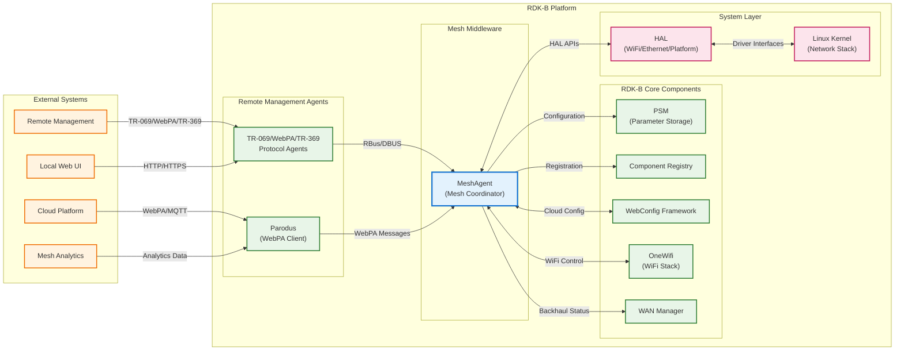
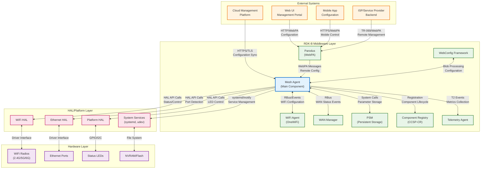
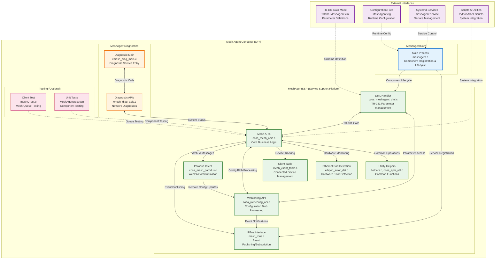
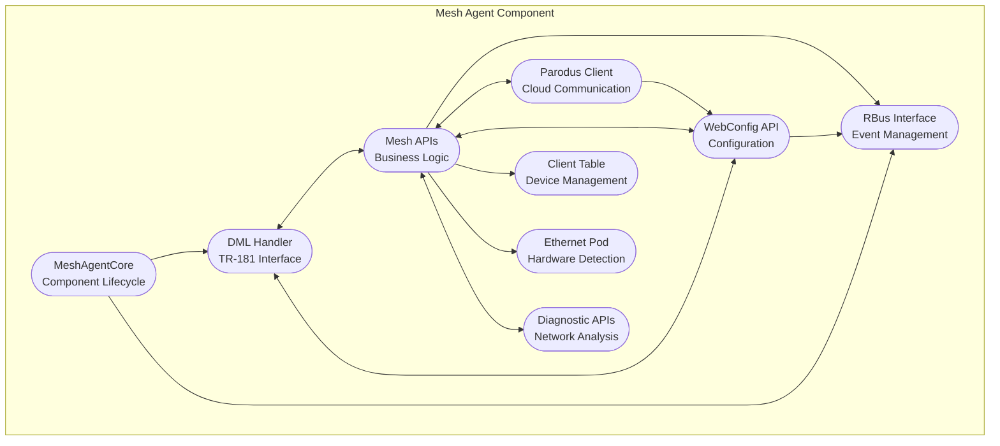
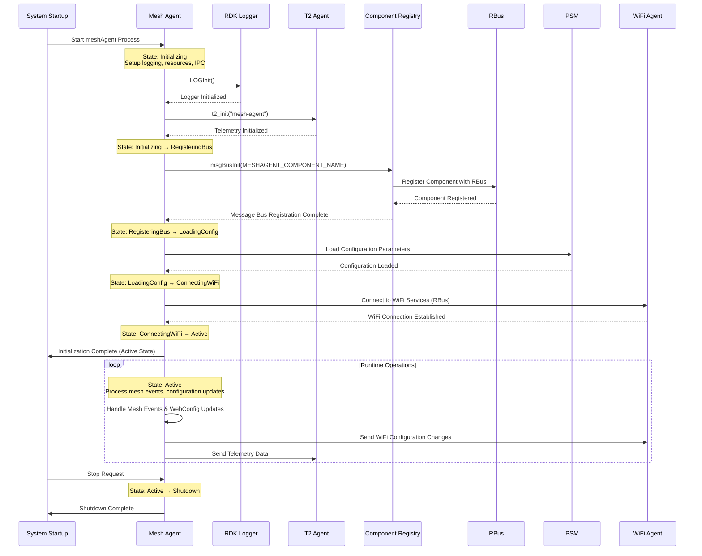
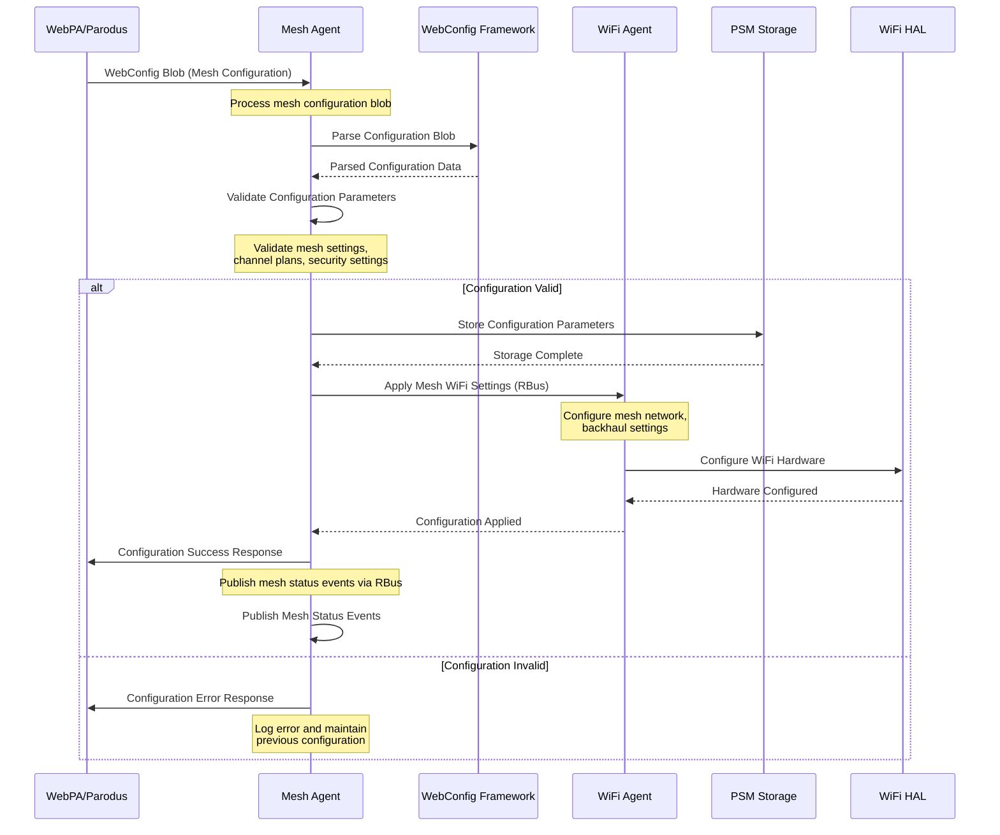
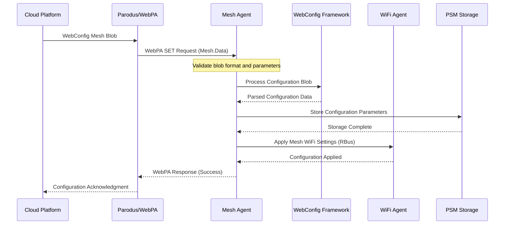
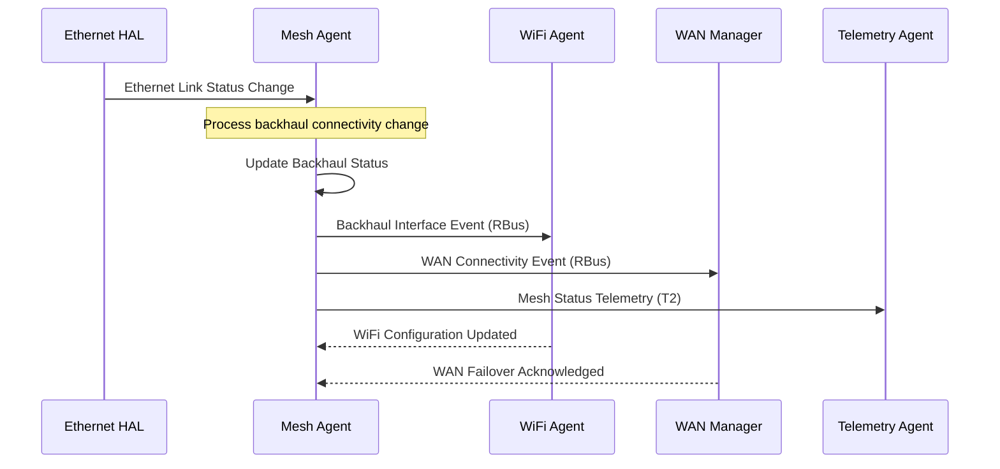

# Mesh Agent Documentation

The Mesh Agent is a critical RDK-B middleware component that provides comprehensive mesh networking capabilities for residential gateways and extender devices. This component orchestrates WiFi mesh network formation, management, and optimization by coordinating between the cloud management platform, WiFi subsystems, and connected devices to deliver seamless whole-home WiFi coverage.

The Mesh Agent serves as the central control plane for mesh networking operations within the RDK-B ecosystem. It manages mesh network topology, handles backhaul connectivity (both WiFi and Ethernet), coordinates with the cloud for configuration and optimization, and provides telemetry data for network analytics. The component integrates deeply with the WiFi Agent (OneWiFi), WebConfig framework, and various HAL layers to ensure optimal mesh performance and user experience.

At the module level, the Mesh Agent provides configuration management through TR-181 data model interfaces, real-time event processing via RBus, WebPA communication for remote management, diagnostic capabilities for network troubleshooting, and integration with system services for comprehensive mesh network lifecycle management.





**Key Features & Responsibilities**: 

- **Mesh Network Management**: Orchestrates WiFi mesh network formation, topology management, and automatic healing to ensure seamless whole-home coverage with optimal performance and device roaming capabilities
- **Backhaul Optimization**: Manages both WiFi and Ethernet backhaul connections with intelligent selection algorithms, failover mechanisms, and performance monitoring to maintain robust inter-node connectivity
- **Cloud Integration**: Provides secure communication channel with cloud management platforms for remote configuration, firmware updates, analytics collection, and centralized mesh network optimization
- **WebConfig Framework Integration**: Processes configuration blobs from the WebConfig framework enabling dynamic mesh parameter updates, feature enablement, and policy enforcement without service interruption
- **RBus Event Management**: Publishes and subscribes to real-time system events for mesh status updates, device connectivity changes, and performance metrics distribution across RDK-B components
- **TR-181 Data Model Support**: Implements comprehensive TR-181 parameter management for mesh configuration, status monitoring, and external system integration through standardized interfaces
- **Diagnostic Capabilities**: Provides network diagnostic tools, performance monitoring, error detection, and troubleshooting capabilities for mesh network health assessment and problem resolution
- **Device Client Management**: Maintains connected device tables, handles client steering decisions, monitors device performance, and optimizes client-to-access-point associations for improved user experience

## Design

The Mesh Agent follows a modular, event-driven architecture designed to handle complex mesh networking scenarios with high reliability and performance. The component is structured into distinct layers: a core engine for component lifecycle management, a service support platform (SSP) layer containing business logic modules, and a diagnostics subsystem for network health monitoring. This design ensures separation of concerns while enabling efficient inter-module communication and external system integration.

The architecture emphasizes scalability and maintainability by implementing clear interfaces between modules and utilizing standardized RDK-B patterns for component registration, parameter management, and event handling. The design supports multiple mesh networking standards and vendor-specific optimizations while maintaining compatibility with the broader RDK-B ecosystem. Configuration management is centralized through the WebConfig framework integration, allowing for dynamic updates and cloud-driven optimizations without requiring component restarts.

North-bound interactions with external systems are handled through secure WebPA communication via the Parodus agent, enabling remote management and cloud-based analytics. The component exposes a comprehensive TR-181 data model for standardized parameter access and integrates with the RBus messaging system for real-time event distribution. South-bound interactions with HAL layers utilize well-defined APIs for WiFi radio control, Ethernet port management, and platform-specific operations, ensuring hardware abstraction and portability across different device platforms.

IPC mechanisms are carefully selected based on performance requirements and data types. RBus is used for high-frequency event publishing and subscription, providing efficient pub-sub messaging for mesh status updates and configuration changes. System calls are utilized for PSM parameter storage and retrieval, ensuring persistent configuration across reboots. WebPA messaging handles secure communication with cloud services, while direct HAL API calls provide low-latency hardware control for time-sensitive mesh operations.

Data persistence is managed through the PSM (Persistent Storage Manager) for configuration parameters and device state information. Runtime data such as client tables and network topology is maintained in memory with periodic synchronization to persistent storage. The component utilizes NVRAM for critical mesh configuration files including channel plans and security settings, ensuring rapid recovery during system initialization and maintaining mesh network consistency across power cycles.





### Prerequisites and Dependencies

**Build-Time Flags and Configuration:**

| Configure Option | DISTRO Feature | Build Flag | Purpose | Default |
|------------------|----------------|------------|---------|---------|
| `--enable-gtestapp` | N/A | `GTEST_ENABLE` | Enable Google Test framework support for unit testing | Disabled |
| `--enable-wanfailover` | N/A | `WAN_FAILOVER_SUPPORTED` | Enable WAN failover functionality for mesh backhaul redundancy | Disabled |
| `--enable-dbus` | N/A | `DBUS_SUPPORT` | Enable D-Bus messaging instead of RBus for inter-component communication | Disabled |
| `--enable-onewifi` | N/A | `ONEWIFI` | Enable OneWiFi integration for unified WiFi stack management | Disabled |
| `--enable-gatewayfailoversupport` | N/A | `GATEWAY_FAILOVER_SUPPORTED` | Enable gateway failover support for mesh topology resilience | Disabled |
| `--enable-rdkb_extender` | N/A | `RDKB_EXTENDER_ENABLED` | Enable RDK-B extender functionality for mesh node operation | Disabled |
| `--enable-rdk_ledmanager` | N/A | `RDK_LED_MANAGER_EXIST` | Enable RDK LED Manager integration for status indication | Disabled |

<br>

**RDK-B Platform and Integration Requirements:**

* **RDK-B Components**: `CcspCommonLibrary`, `CcspCr`, `CcspPsm`, `OneWiFi`, `WanManager`, `ParodusComponent`, `TelemetryAgent`, `WebConfigFramework`
* **HAL Dependencies**: WiFi HAL APIs (minimum v3.0), Ethernet HAL interfaces for backhaul detection, Platform HAL for LED control and system integration
* **Systemd Services**: `CcspCrSsp.service`, `CcspPsmSsp.service`, `wifi.service` must be active before `meshAgent.service` starts
* **Message Bus**: RBus registration under `MeshAgent` component namespace for event publishing and parameter management
* **TR-181 Data Model**: `Device.DeviceInfo.X_RDKCENTRAL-COM_RFC.Feature.*` and `Device.DeviceInfo.X_RDKCENTRAL-COM_xOpsDeviceMgmt.Mesh.*` parameter hierarchies for mesh configuration management
* **Configuration Files**: `TR181-MeshAgent.xml` for parameter definitions; `MeshAgent.cfg`, `MeshAgentDM.cfg` for runtime configuration located in `/usr/ccsp/mesh/`
* **Startup Order**: Initialize after Component Registry and PSM services are active and network interfaces are available

<br>

**Threading Model**

The Mesh Agent implements a hybrid threading architecture combining event-driven main thread processing with specialized worker threads for specific high-latency operations. The main thread handles RBus message processing, TR-181 parameter operations, and component lifecycle management using an event loop pattern to ensure responsive handling of configuration requests and status updates. This single-threaded approach for core operations prevents race conditions and simplifies state management while maintaining low latency for critical mesh operations.

- **Threading Architecture**: Event-driven main thread with on-demand worker threads for blocking operations
- **Main Thread**: Handles RBus event processing, TR-181 parameter get/set operations, WebConfig blob processing, and component registration/lifecycle management
- **Worker Threads** (created dynamically):
  - **WebPA Communication Thread**: Manages Parodus client connection, processes WebPA messages, and handles cloud synchronization to prevent blocking main thread during network operations
  - **Diagnostic Thread**: Executes network diagnostic commands, performs mesh topology analysis, and generates performance reports for system health monitoring
  - **File Monitor Thread**: Uses inotify to monitor configuration file changes, processes mesh configuration updates, and triggers appropriate system events
- **Synchronization**: Mutex locks protect shared data structures (client tables, configuration state), condition variables coordinate thread communication, and atomic operations handle simple flag updates

### Component State Flow

**Initialization to Active State**

The Mesh Agent follows a carefully orchestrated initialization sequence to ensure proper integration with the RDK-B ecosystem and mesh network readiness. The component progresses through distinct states, each with specific validation checkpoints and dependency requirements. State transitions are logged and monitored to enable debugging and system health assessment.



**Runtime State Changes and Context Switching**

The Mesh Agent dynamically adapts its operational context based on mesh network conditions, configuration updates, and external system requirements. State changes are triggered by specific events and conditions, with each transition carefully managed to maintain service continuity and mesh network stability.

**State Change Triggers:**

- **Mesh Enable/Disable**: TR-181 parameter changes trigger transition between Active and Standby states, affecting mesh network formation and client association behavior
- **WebConfig Updates**: Configuration blob reception triggers temporary Configuration Processing state while validating and applying new mesh parameters and policies
- **WiFi Radio Events**: Radio availability changes cause context switching for backhaul selection and mesh topology recalculation to maintain optimal network performance
- **Backhaul Failover**: Ethernet/WiFi backhaul connectivity changes trigger Backhaul Recovery state for automatic failover and network healing operations
- **Cloud Connectivity**: WebPA connection status changes affect Remote Management state and cloud-based optimization capabilities

**Context Switching Scenarios:**

- **Gateway to Extender Mode**: Device role change based on uplink detection triggers comprehensive reconfiguration of mesh parameters, client handling, and backhaul settings
- **Performance Optimization Mode**: Mesh WiFi Optimization (MWO) feature activation switches component to enhanced monitoring and cloud-driven optimization context
- **Maintenance Mode**: Diagnostic operations and firmware updates trigger temporary maintenance context with reduced mesh functionality and client notification
- **Emergency Failover**: Critical network failures trigger emergency context with simplified operations focused on restoring basic connectivity and network healing

### Call Flow

**Initialization Call Flow:**


**Request Processing Call Flow:**

This sequence diagram illustrates the WebConfig blob processing flow, which represents the most critical configuration management operation supported by the Mesh Agent.



## TR‑181 Data Models

### Supported TR-181 Parameters

The Mesh Agent implements a comprehensive set of TR-181 parameters organized into logical groups for mesh networking configuration, feature control, and status monitoring. These parameters follow BBF specification guidelines and provide standardized interfaces for external management systems and RDK-B component integration. The parameter structure supports both RFC-based feature control and operational mesh configuration through dedicated object hierarchies.

### Object Hierarchy

```
Device.
└── DeviceInfo.
    ├── X_RDKCENTRAL-COM_RFC.
    │   └── Feature.
    │       ├── OVS.
    │       │   └── Enable (boolean, R/W)
    │       ├── SM_APP.
    │       │   └── Disable (boolean, R/W)
    │       ├── XleAdaptiveFh.
    │       │   └── Enable (boolean, R/W)
    │       ├── MeshRetryReduction.
    │       │   └── Enable (boolean, R/W)
    │       ├── MeshPrioritization.
    │       │   └── Enable (boolean, R/W)
    │       ├── Recorder.
    │       │   ├── Enable (boolean, R/W)
    │       │   └── Upload.
    │       │       └── Enable (boolean, R/W)
    │       ├── MeshWifiOptimization.
    │       │   ├── Mode (string, R/W)
    │       │   ├── MwoBroker (string, R/W)
    │       │   └── ReinitPeriod (unsignedInt, R/W)
    │       ├── HDRecommendation.
    │       │   └── Enable (boolean, R/W)
    │       ├── SecureBackhaul.
    │       │   └── Enable (boolean, R/W)
    │       ├── GRE_ACC.
    │       │   └── Enable (boolean, R/W)
    │       ├── MeshGREBackhaulCache.
    │       │   └── Enable (boolean, R/W)
    │       └── MeshSecuritySchemaLegacy.
    │           └── Enable (boolean, R/W)
    └── X_RDKCENTRAL-COM_xOpsDeviceMgmt.
        ├── Mesh.
        │   ├── Enable (boolean, R/W)
        │   ├── Data (string, R/W)
        │   ├── URL (string, R/W)
        │   ├── State (string, R/W)
        │   ├── Status (string, R)
        │   ├── X_RDKCENTRAL-COM_Connected-Client (string, R/W)
        │   ├── PodEthernetBackhaulEnable (boolean, R/W)
        │   ├── XleModeCloudCtrlEnable (boolean, R/W)
        │   ├── UseComodoCa (boolean, R/W)
        │   ├── Opensync (boolean, R/W)
        │   └── ChannelPlan.
        │       └── Data (string, R/W)
        └── MWO.
            ├── AugmentedInterference (string, R/W)
            ├── Configs (string, R/W)
            ├── SteeringProfileData (string, R/W)
            ├── ClientProfileData (string, R/W)
            └── WifiMotionSettings (string, R/W)
```

### Parameter Definitions

**Core Mesh Parameters:**

| Parameter Path | Data Type | Access | Default Value | Description | BBF Compliance |
|----------------|-----------|--------|---------------|-------------|----------------|
| `Device.DeviceInfo.X_RDKCENTRAL-COM_xOpsDeviceMgmt.Mesh.Enable` | boolean | R/W | `false` | Master enable/disable control for mesh networking functionality. When enabled, activates mesh network formation, client management, and optimization features. When disabled, device operates in standalone mode. | Custom Extension |
| `Device.DeviceInfo.X_RDKCENTRAL-COM_xOpsDeviceMgmt.Mesh.Status` | string | R | `"Off"` | Current mesh operational status with enumerated values: Off (mesh disabled), Init (initializing), Monitor (monitoring mode), Full (full mesh operation). Automatically updated based on mesh state and connectivity. | Custom Extension |
| `Device.DeviceInfo.X_RDKCENTRAL-COM_xOpsDeviceMgmt.Mesh.State` | string | R/W | `"Full"` | Desired mesh operational mode: Full (complete mesh functionality with optimization), Monitor (monitoring and telemetry only). Controls feature activation level and resource allocation. | Custom Extension |
| `Device.DeviceInfo.X_RDKCENTRAL-COM_xOpsDeviceMgmt.Mesh.Data` | string | R/W | `""` | Base64-encoded mesh configuration blob containing network topology, security keys, and operational parameters. Updated via WebConfig framework for centralized management. | Custom Extension |
| `Device.DeviceInfo.X_RDKCENTRAL-COM_xOpsDeviceMgmt.Mesh.URL` | string | R/W | `""` | Cloud management platform URL for mesh configuration retrieval and status reporting. Must be HTTPS endpoint with valid certificate for secure communication. Maximum 128 characters. | Custom Extension |
| `Device.DeviceInfo.X_RDKCENTRAL-COM_xOpsDeviceMgmt.Mesh.PodEthernetBackhaulEnable` | boolean | R/W | `true` | Enable Ethernet backhaul connectivity for mesh extender pods. When enabled, allows wired connection detection and automatic failover from WiFi to Ethernet backhaul for improved performance. | Custom Extension |
| `Device.DeviceInfo.X_RDKCENTRAL-COM_xOpsDeviceMgmt.Mesh.X_RDKCENTRAL-COM_Connected-Client` | string | R/W | `""` | JSON-formatted string containing connected client information including MAC addresses, connection types, signal strength, and association times for mesh optimization algorithms. | Custom Extension |

**Feature Control Parameters:**

| Parameter Path | Data Type | Access | Default Value | Description | BBF Compliance |
|----------------|-----------|--------|---------------|-------------|----------------|
| `Device.DeviceInfo.X_RDKCENTRAL-COM_RFC.Feature.MeshWifiOptimization.Mode` | string | R/W | `"Disable"` | Mesh WiFi Optimization operational mode: Disable (feature off), Monitor (data collection only), Enable (active optimization). Controls cloud-based mesh optimization feature activation. | Custom Extension |
| `Device.DeviceInfo.X_RDKCENTRAL-COM_RFC.Feature.MeshWifiOptimization.MwoBroker` | string | R/W | `""` | MQTT broker endpoint for Mesh WiFi Optimization data communication. Used for real-time telemetry upload and optimization command receipt. Maximum 128 characters. | Custom Extension |
| `Device.DeviceInfo.X_RDKCENTRAL-COM_RFC.Feature.MeshWifiOptimization.ReinitPeriod` | unsignedInt | R/W | `3600` | Reinitialization period in seconds for MWO service restart and configuration refresh. Valid range: 60-86400 seconds. Controls automatic service health maintenance. | Custom Extension |
| `Device.DeviceInfo.X_RDKCENTRAL-COM_RFC.Feature.SecureBackhaul.Enable` | boolean | R/W | `true` | Enable secure backhaul encryption for mesh inter-node communication. Activates WPA3/SAE security for backhaul links and encrypted data tunneling between mesh nodes. | Custom Extension |
| `Device.DeviceInfo.X_RDKCENTRAL-COM_RFC.Feature.Recorder.Enable` | boolean | R/W | `false` | Enable mesh network recording functionality for troubleshooting and analytics. Captures network events, performance metrics, and diagnostic data for support analysis. | Custom Extension |

**Channel Management Parameters:**

| Parameter Path | Data Type | Access | Default Value | Description | BBF Compliance |
|----------------|-----------|--------|---------------|-------------|----------------|
| `Device.DeviceInfo.X_RDKCENTRAL-COM_xOpsDeviceMgmt.Mesh.ChannelPlan.Data` | string | R/W | `""` | JSON-formatted channel plan configuration specifying permitted channels, power levels, and regulatory constraints for mesh network operation across different WiFi bands. | Custom Extension |
| `Device.DeviceInfo.X_RDKCENTRAL-COM_RFC.Feature.HDRecommendation.Enable` | boolean | R/W | `false` | Enable HD streaming optimization recommendations based on mesh network analysis. Provides channel and configuration suggestions for optimal high-definition content delivery. | Custom Extension |

### Parameter Registration and Access

- **Implemented Parameters**: The Mesh Agent implements 25+ TR‑181 parameters across mesh configuration, feature control, and operational status categories. Parameters support standard data types (boolean, string, unsignedInt) with appropriate validation rules and access controls.
- **Parameter Registration**: Parameters are registered during component initialization through the DML (Data Model Library) interface using COSA framework integration. Registration includes parameter metadata, access permissions, and callback function assignments.
- **Access Mechanism**: External components access parameters via RBus method calls to the MeshAgent component. The DML handler validates requests, applies access controls, and routes get/set operations to appropriate business logic modules.
- **Validation Rules**: String parameters enforce length limits and character set restrictions. Boolean parameters validate true/false values. Numeric parameters enforce range checking and type validation. Configuration blob parameters validate Base64 encoding and JSON structure.

## Internal Modules

The Mesh Agent's internal architecture is organized into specialized modules that handle distinct aspects of mesh networking functionality while maintaining clean interfaces and separation of concerns. Each module is designed with specific responsibilities and clear data flow patterns to ensure maintainable and scalable code organization.

| Module/Class | Description | Key Files |
|-------------|------------|-----------|
| **MeshAgentCore** | Core component initialization and lifecycle management including logging setup, telemetry initialization, and message bus registration. Provides main entry point and component health monitoring. | `meshagent.c` |
| **DML Handler** | TR-181 data model parameter management including get/set operations, parameter validation, and external interface compliance. Serves as primary interface for configuration management. | `cosa_meshagent_dml.c`, `cosa_meshagent_dml.h` |
| **Mesh APIs** | Core mesh networking business logic including network formation, topology management, client handling, and optimization algorithms. Implements primary mesh functionality and coordination. | `cosa_mesh_apis.c` |
| **WebConfig API** | Configuration blob processing from WebConfig framework including parsing, validation, and application of mesh configuration updates. Handles dynamic configuration management. | `cosa_webconfig_api.c`, `cosa_webconfig_api.h` |
| **Parodus Client** | WebPA communication interface for cloud connectivity including secure messaging, remote configuration, and status reporting. Manages cloud management integration. | `cosa_mesh_parodus.c`, `cosa_mesh_parodus.h` |
| **RBus Interface** | Event publishing and subscription management for real-time mesh status updates, configuration changes, and inter-component communication within RDK-B ecosystem. | `mesh_rbus.c`, `mesh_rbus.h` |
| **Client Table** | Connected device management including client tracking, association monitoring, performance metrics collection, and steering decision support for mesh optimization. | `mesh_client_table.c`, `mesh_client_table.h` |
| **Ethernet Pod Detection** | Hardware error detection and ethernet pod connectivity monitoring including port status detection, link quality assessment, and automatic failover coordination. | `ethpod_error_det.c`, `ethpod_error_det.h` |
| **Diagnostic APIs** | Network diagnostic capabilities including connectivity testing, performance analysis, mesh topology validation, and troubleshooting tool integration. | `xmesh_diag_apis.c`, `xmesh_diag.h`, `xmesh_diag_main.c` |

## Component Interactions

The Mesh Agent serves as a central orchestration point within the RDK-B ecosystem, coordinating mesh networking operations through multiple interaction patterns with external components, middleware services, and hardware abstraction layers. These interactions span configuration management, real-time event processing, cloud communication, and hardware control to deliver comprehensive mesh networking capabilities.

### Interaction Matrix

| Target Component/Layer | Interaction Purpose | Key APIs/Endpoints |
|------------------------|-------------------|------------------|
| **RDK-B Middleware Components** |
| WiFi Agent (OneWiFi) | Mesh network configuration coordination, WiFi radio management, client steering decisions, and backhaul optimization | RBus events: `Device.WiFi.Radio.`, `Device.WiFi.AccessPoint.`, Mesh configuration updates |
| WAN Manager | WAN connectivity status monitoring, backhaul failover coordination, and network topology awareness | RBus events: `Device.IP.Interface.`, WAN status notifications, failover triggers |
| PSM (Persistent Storage) | Configuration parameter persistence, device state storage, and mesh network configuration backup | PSM API: `PSM_Set_Record_Value2()`, `PSM_Get_Record_Value2()`, mesh configuration keys |
| Parodus (WebPA) | Remote cloud management communication, WebPA message processing, and secure cloud connectivity | WebPA methods: `SET`, `GET`, `GETATTRIBUTES`, cloud management notifications |
| Telemetry Agent (T2) | Performance metrics collection, mesh analytics reporting, and system health monitoring | T2 markers: `WIFI_INFO_mesh_status`, `WIFI_ERROR_mesh_backhaul`, telemetry event triggers |
| WebConfig Framework | Dynamic configuration blob processing, feature enablement, and centralized configuration management | Blob handlers: mesh blob, steering profile blob, MWO configuration blob |
| **System & HAL Layers** |
| WiFi HAL | WiFi radio control, mesh network formation, signal monitoring, and hardware configuration | `wifi_getRadioStatus()`, `wifi_setApSecurityModeEnabled()`, mesh-specific HAL extensions |
| Ethernet HAL | Ethernet port status detection, link quality monitoring, and wired backhaul management | `GWP_GetEthWanLinkStatus()`, port connectivity APIs, link state notifications |
| Platform HAL | LED status indication, system power management, and hardware-specific mesh features | `platform_hal_SetLed()`, system status APIs, hardware capability detection |
| System Services | Configuration file monitoring, service lifecycle management, and system integration | inotify file watchers, systemd service control, cron job management |

**Events Published by Mesh Agent:**

| Event Name | Event Topic/Path | Trigger Condition | Subscriber Components |
|------------|-----------------|-------------------|---------------------|
| Mesh Status Change | `Device.DeviceInfo.X_RDKCENTRAL-COM_xOpsDeviceMgmt.Mesh.Status` | Mesh enable/disable, connectivity changes, operational mode transitions | WiFi Agent, WAN Manager, Telemetry Agent, Web UI |
| MWO Configuration Update | `EVENT_MWO_TOS_CONFIGURATION` | Mesh WiFi Optimization configuration changes, QoS policy updates | WiFi Agent, QoS components, traffic management |
| Client Association Event | `EVENT_MWO_CLIENT_TO_PROFILE_MAP_EVENT` | Device association, steering decisions, client profile updates | WiFi Agent, client management, analytics |
| Backhaul Status Event | `EVENT_MESH_BACKHAUL_IFNAME`, `EVENT_MESH_ETHERNETBHAUL_UPLINK` | Backhaul interface changes, failover events, connectivity status | WAN Manager, WiFi Agent, network monitoring |
| Channel Plan Update | `EVENT_CHANNEL_KEEPOUT`, `EVENT_CHANNELPLAN_COMMIT` | Channel plan modifications, regulatory compliance updates | WiFi Agent, spectrum management, optimization |

### IPC Flow Patterns

**Primary IPC Flow - Mesh Configuration Update:**



**Event Notification Flow:**



## Implementation Details

### Major HAL APIs Integration

The Mesh Agent integrates with multiple HAL interfaces to provide comprehensive mesh networking functionality across different hardware platforms and vendor implementations. HAL API usage follows RDK-B patterns for hardware abstraction while enabling mesh-specific optimizations and features.

**Core HAL APIs:**

| HAL API | Purpose | Implementation File |
|---------|---------|-------------------|
| `wifi_getRadioStatus()` | Retrieve WiFi radio operational status, signal strength, and capability information for mesh network formation and optimization | `cosa_mesh_apis.c` |
| `wifi_setApSecurityModeEnabled()` | Configure mesh network security settings including WPA3-SAE for secure backhaul and client access control | `cosa_mesh_apis.c` |
| `wifi_getNeighboringWiFiDiagnosticResult2()` | Scan for neighboring WiFi networks to identify mesh topology, interference sources, and optimize channel selection | `xmesh_diag_apis.c` |
| `GWP_GetEthWanLinkStatus()` | Monitor Ethernet port connectivity for wired backhaul detection, automatic failover, and pod connectivity validation | `ethpod_error_det.c` |
| `platform_hal_SetLed()` | Control device LED indicators for mesh status visualization, connectivity indication, and user feedback | `cosa_mesh_apis.c` |
| `wifi_setChannelBandwidth()` | Configure mesh-optimized channel bandwidth settings for backhaul and client access to maximize throughput | `cosa_mesh_apis.c` |

### Key Implementation Logic

- **Mesh State Machine Engine**: The core state management is implemented in `cosa_mesh_apis.c` with centralized state tracking, transition validation, and event-driven updates. State machine handles mesh enable/disable, operational mode transitions (Off/Init/Monitor/Full), and error recovery scenarios. State persistence ensures consistent behavior across system reboots and component restarts.
     - Main implementation in `cosa_mesh_apis.c` - `Mesh_SetEnabled()`, `Mesh_GetStatus()` functions
     - State transition handlers in `cosa_meshagent_dml.c` - TR-181 parameter validation and state synchronization
  
- **WebConfig Event Processing**: Configuration blob processing follows asynchronous pattern with validation, application, and rollback capabilities. WebConfig integration handles mesh configuration, steering profiles, and MWO settings with atomic updates and error handling. Event processing includes timeout management and retry logic for cloud synchronization.
     - WebConfig blob parsing and validation in `cosa_webconfig_api.c`
     - Event notification and RBus publishing in `mesh_rbus.c`
     - Asynchronous processing with worker threads for non-blocking operation

- **Error Handling Strategy**: Comprehensive error detection includes HAL API failure handling, configuration validation errors, and network connectivity issues. Recovery mechanisms implement automatic retry with exponential backoff, configuration rollback for failed updates, and graceful degradation for partial functionality scenarios. Error propagation ensures proper logging and telemetry reporting.
     - HAL error code mapping and retry logic in utility functions
     - Configuration rollback mechanisms in WebConfig processing
     - Network error handling with automatic mesh healing and failover

- **Logging & Debugging**: Multi-level logging with RDK Logger integration provides detailed tracing for mesh operations, state transitions, and error conditions. Debug categories include mesh state changes, WebConfig processing, HAL interactions, and performance metrics. Runtime logging level control enables field debugging and support analysis.
     - Mesh-specific logging macros: `MeshError()`, `MeshInfo()`, `MeshWarning()`, `MeshDebug()`
     - HAL API call tracing with parameter and return value logging
     - Performance monitoring with timing measurements and resource usage tracking

### Key Configuration Files

| Configuration File | Purpose | Override Mechanisms |
|--------------------|---------|--------------------|
| `MeshAgent.cfg` | Main mesh agent configuration including feature flags, timing parameters, and operational modes | Environment variables: `MESH_ENABLED`, `MESH_URL`, PSM parameter override |
| `MeshAgentDM.cfg` | Data model configuration mapping TR-181 parameters to internal variables and default values | Compile-time configuration, PSM persistent storage override |
| `TR181-MeshAgent.xml` | TR-181 data model schema defining parameter structure, access permissions, and function mappings | Static configuration file, no runtime override |
| `/nvram/mesh/channelPlan/channelKeepOut.json` | Channel exclusion list for regulatory compliance and interference avoidance | WebConfig blob updates, cloud-driven configuration |
| `/nvram/mesh/channelPlan/hd_recommendation.json` | HD streaming optimization recommendations based on network analysis | Algorithm-generated, cloud analytics input |
| `meshAgent.service` | Systemd service configuration defining startup dependencies, environment, and execution parameters | Systemd override files: `/etc/systemd/system/meshAgent.service.d/*.conf` |
