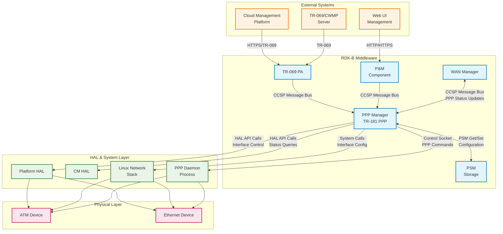
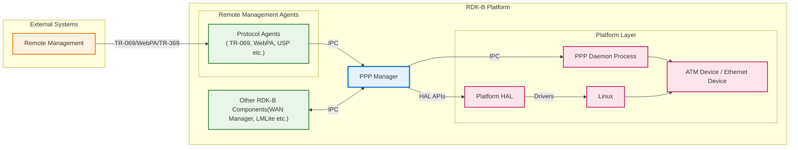
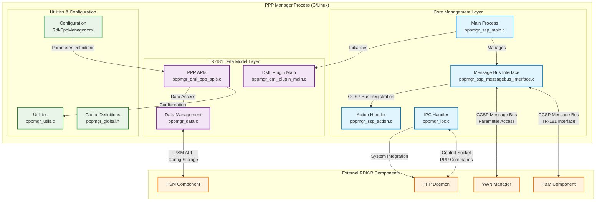
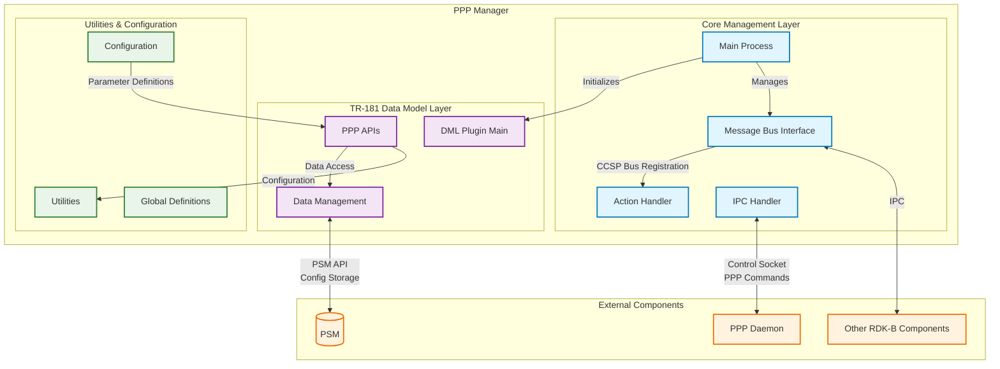
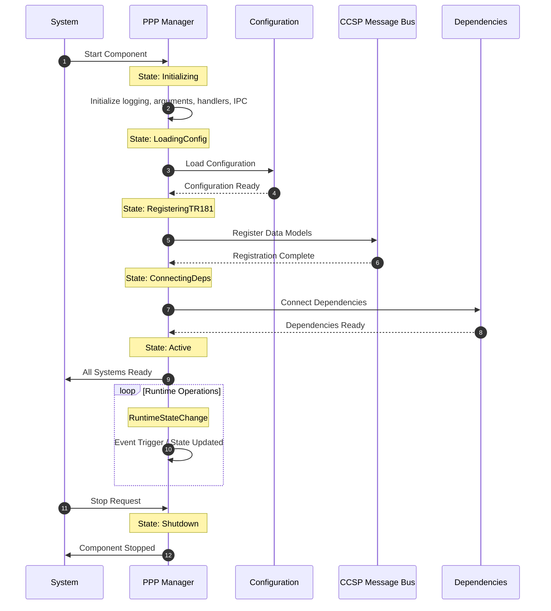
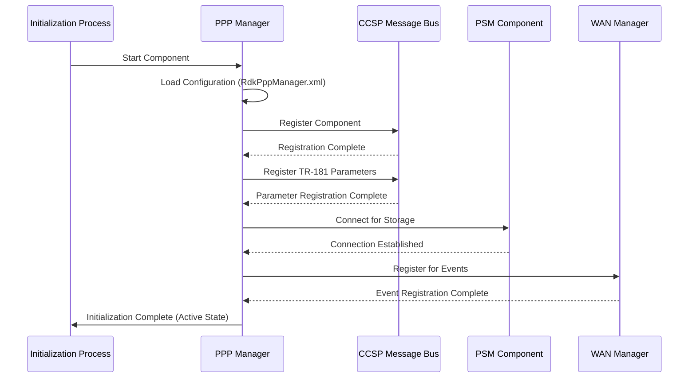
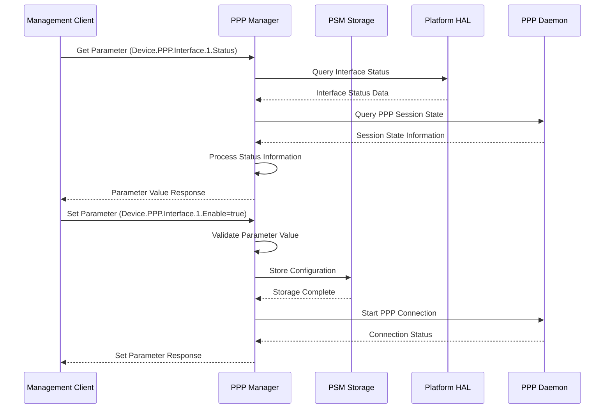
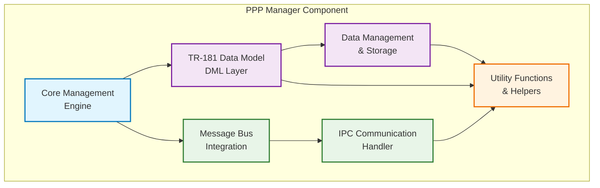
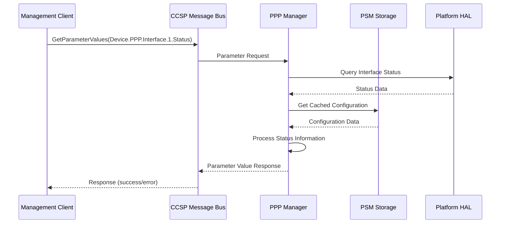
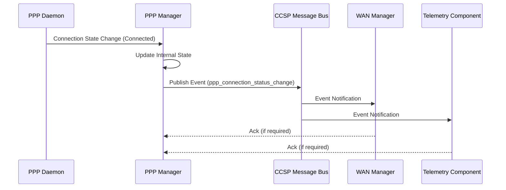

# PPP Manager Documentation

PPP Manager is the middleware component in the RDK-B stack responsible for managing Point-to-Point Protocol (PPP) connections, including PPPoE (PPP over Ethernet) and PPPoA (PPP over ATM) interfaces. This component serves as the central control point for establishing, monitoring, and managing PPP sessions on RDK-B devices, providing comprehensive TR-181 data model support for PPP interface configuration and status reporting. PPP Manager integrates deeply with the RDK-B ecosystem by interfacing with the WAN Manager for coordinated wide area network management, HAL layers for low-level hardware control, and the CCSP message bus infrastructure for inter-component communication. It maintains persistent configuration data through PSM (Persistent Storage Manager) and provides real-time status updates to other middleware components and external management systems.

At the module level, this component implements the Device.PPP data model as defined in the TR-181 specification, exposing comprehensive configuration parameters for PPP interfaces, their associated protocols (IPCP, IPv6CP, PPPoE), and statistical information. The component handles authentication protocols (PAP, CHAP, MS-CHAP), connection management, error recovery, and provides detailed connection status and diagnostic capabilities.

**old diagram**


<br>

**new diagram**





**Key Features & Responsibilities**: 

- **PPP Session Management**: Establishes, maintains, and terminates PPP connections including PPPoE and PPPoA protocols with comprehensive error handling and recovery mechanisms
- **TR-181 Data Model Implementation**: Provides complete Device.PPP.Interface data model support with real-time parameter access, configuration management, and event notifications
- **Authentication Protocol Support**: Implements PAP, CHAP, MS-CHAP, and AUTO authentication methods with secure credential management and protocol negotiation
- **Connection Status Monitoring**: Continuously monitors PPP session states (LCP, IPCP, IPv6CP) and provides detailed connection status, error reporting, and diagnostic information
- **WAN Manager Integration**: Coordinates with WAN Manager for unified wide area network management, including interface priority, failover scenarios, and connection policies
- **Statistical Data Collection**: Gathers comprehensive interface statistics including bytes/packets sent/received, error counts, and protocol-specific metrics for monitoring and troubleshooting

## Design

The PPP Manager follows a modular, event-driven design architecture that separates concerns between TR-181 data model management, PPP protocol handling, and system integration. The core design principle centers around maintaining a clear separation between the northbound TR-181 interface for management access and the southbound HAL/system interfaces for actual PPP connection control.

The component implements a state machine-based approach for PPP connection lifecycle management, handling transitions between Unconfigured, Connecting, Authenticating, Connected, and Disconnected states. This design ensures robust error handling and recovery while providing accurate status reporting to management systems. The architecture integrates both synchronous parameter access for immediate configuration changes and asynchronous event-driven processing for connection state changes and status updates.

Northbound interactions utilize the CCSP message bus infrastructure to expose TR-181 parameters to management components like P&M, TR-069 PA, and WAN Manager. The design implements proper parameter validation, access control, and notification mechanisms to ensure data integrity and system coordination. Configuration persistence is managed through PSM integration, allowing for reliable storage and retrieval of PPP interface settings across system reboots.

Southbound interactions leverage multiple integration points including HAL APIs for hardware-specific operations, direct system calls for network interface management, and control sockets for communication with the PPP daemon process. The design abstracts these different interaction methods through a unified internal API, simplifying the core logic while maintaining flexibility for different deployment scenarios.

The IPC architecture primarily uses the CCSP message bus for inter-component communication, supporting both synchronous request-response patterns for parameter operations and asynchronous publish-subscribe patterns for event notifications. This design choice ensures compatibility with the broader RDK-B ecosystem while providing efficient communication patterns for different use cases.

Data persistence and storage management follows the RDK-B standard approach using PSM for configuration data and runtime state information. The component maintains a hierarchical storage structure mirroring the TR-181 object model, enabling efficient parameter access and bulk operations while ensuring data consistency and atomic updates.

**old diagram**


<br>

**new diagram**





### Prerequisites and Dependencies

**RDK-B Platform and Integration Requirements:** 

- **Build Dependencies**: ccsp-common-library, dbus, rdk-logger, utopia, halinterface, libunpriv as specified in BitBake recipe
- **RDK-B Components**: CcspCommonLibrary for CCSP framework, PSM (Persistent Storage Manager) for configuration persistence, WAN Manager for coordinated network management
- **HAL Dependencies**: Platform HAL interface (halinterface) for hardware abstraction, CM HAL interface for cable modem operations 
- **Systemd Services**: ccsp-msg-bus.service, ccsp-psm.service must be active before PPP Manager starts for message bus and storage access
- **Message Bus**: CCSP message bus registration namespace "com.cisco.spvtg.ccsp.pppmanager" with parameter namespace "Device.PPP"
- **TR-181 Data Model**: Device.PPP object hierarchy implementation with Interface table support, statistics collection, and protocol-specific parameters
- **Configuration Files**: RdkPppManager.xml for TR-181 parameter definitions, /nvram/PSM storage for persistent configuration data
- **Startup Order**: Message bus service → PSM service → PPP Manager → WAN Manager (for coordinated startup sequence)
- **Resource Constraints**: Minimum 4MB RAM, 50MB storage for logging and configuration, CPU capability for PPP protocol processing

<br>

**Threading Model** 

PPP Manager implements a single-threaded, event-driven architecture that processes all operations within the main thread context to maintain simplicity and avoid synchronization complexities.

- **Threading Architecture**: Single-threaded with event-driven message processing using CCSP message bus event loop integration
- **Main Thread**: Handles all CCSP message bus operations, TR-181 parameter processing, HAL API calls, PSM storage operations, and PPP daemon communication
- **Synchronization**: No inter-thread synchronization required due to single-threaded design; thread safety provided by CCSP message bus serialization
- **Event Processing**: Asynchronous event handling through CCSP message bus callbacks, system signal handlers for PPP state changes, and timer-based polling for interface status

### Component State Flow

**Initialization to Active State**

The PPP Manager follows a structured initialization sequence to establish proper integration with the RDK-B ecosystem before transitioning to active operation. The component must successfully complete each phase to ensure reliable PPP connection management and TR-181 data model availability.



**Runtime State Changes and Context Switching**

During normal operation, the PPP Manager handles various runtime state changes triggered by external events, configuration updates, and system conditions. These state transitions ensure proper response to changing network conditions and management requests.

**State Change Triggers:**

- PPP interface enable/disable commands trigger connection establishment or termination sequences
- WAN Manager coordination events trigger interface priority changes and failover operations  
- Hardware events (link up/down) trigger PPP session state updates and error recovery procedures
- Configuration parameter changes trigger validation, storage updates, and protocol renegotiation

**Context Switching Scenarios:**

- Connection mode switching between PPPoE and PPPoA requires interface reconfiguration and protocol stack reinitialization
- Authentication method changes (PAP/CHAP/MS-CHAP) trigger credential validation and protocol parameter updates
- Failover scenarios require coordination with WAN Manager for interface priority management and traffic redirection

### Call Flow

**Initialization Call Flow:**



**Request Processing Call Flow:**

The most critical flow supported by the PPP Manager is TR-181 parameter access for PPP interface configuration and status retrieval, which involves coordination between multiple system components.



## TR‑181 Data Models

### Supported TR-181 Parameters

Following BBF TR-181 Issue 2 Amendment 15 specification, the PPP Manager implements the complete Device.PPP object hierarchy providing comprehensive Point-to-Point Protocol interface management capabilities. The implementation supports both PPPoE (PPP over Ethernet) and PPPoA (PPP over ATM) connection types with full protocol negotiation, authentication, and statistical reporting capabilities.

### Object Hierarchy

```
Device.
└── PPP.
    ├── SupportedNCPs (string, R)
    ├── InterfaceNumberOfEntries (unsignedInt, R)
    └── Interface.{i}.
        ├── Enable (boolean, R/W)
        ├── IPCPEnable (boolean, R/W)
        ├── IPv6CPEnable (boolean, R/W)
        ├── Status (string, R)
        ├── Alias (string, R/W)
        ├── Name (string, R)
        ├── LastChange (unsignedInt, R)
        ├── LowerLayers (string, R/W)
        ├── Reset (boolean, R/W)
        ├── ConnectionStatus (string, R)
        ├── LastConnectionError (string, R)
        ├── AutoDisconnectTime (unsignedInt, R/W)
        ├── IdleDisconnectTime (unsignedInt, R/W)
        ├── WarnDisconnectDelay (unsignedInt, R/W)
        ├── Username (string, R/W)
        ├── Password (string, R/W)
        ├── EncryptionProtocol (string, R)
        ├── CompressionProtocol (string, R)
        ├── AuthenticationProtocol (string, R/W)
        ├── MaxMRUSize (unsignedInt, R/W)
        ├── CurrentMRUSize (unsignedInt, R)
        ├── ConnectionTrigger (string, R/W)
        ├── X_RDK_LinkType (string, R/W)
        ├── LCPEcho (unsignedInt, R)
        ├── LCPEchoRetry (unsignedInt, R)
        ├── PPPoE.
        │   ├── SessionID (unsignedInt, R)
        │   ├── ACName (string, R/W)
        │   └── ServiceName (string, R/W)
        ├── IPCP.
        │   ├── LocalIPAddress (string, R)
        │   ├── RemoteIPAddress (string, R)
        │   ├── DNSServers (string, R)
        │   ├── PassthroughEnable (boolean, R/W)
        │   └── PassthroughDHCPPool (string, R/W)
        ├── IPv6CP.
        │   ├── LocalInterfaceIdentifier (string, R)
        │   └── RemoteInterfaceIdentifier (string, R)
        └── Stats.
            ├── BytesSent (unsignedInt, R)
            ├── BytesReceived (unsignedInt, R)
            ├── PacketsSent (unsignedInt, R)
            ├── PacketsReceived (unsignedInt, R)
            ├── ErrorsSent (unsignedInt, R)
            ├── ErrorsReceived (unsignedInt, R)
            ├── UnicastPacketsSent (unsignedInt, R)
            ├── UnicastPacketsReceived (unsignedInt, R)
            ├── DiscardPacketsSent (unsignedInt, R)
            ├── DiscardPacketsReceived (unsignedInt, R)
            ├── MulticastPacketsSent (unsignedInt, R)
            ├── MulticastPacketsReceived (unsignedInt, R)
            ├── BroadcastPacketsSent (unsignedInt, R)
            ├── BroadcastPacketsReceived (unsignedInt, R)
            └── UnknownProtoPacketsReceived (unsignedInt, R)
```

### Parameter Definitions

**Core Parameters:**

| Parameter Path | Data Type | Access | Default Value | Description | BBF Compliance |
|----------------|-----------|--------|---------------|-------------|----------------|
| `Device.PPP.SupportedNCPs` | string | R | `"IPCP,IPv6CP"` | Comma-separated list of supported Network Control Protocols. This parameter indicates which IP protocols can be negotiated over PPP connections, enabling both IPv4 (IPCP) and IPv6 (IPv6CP) support. | TR-181 Issue 2 |
| `Device.PPP.InterfaceNumberOfEntries` | unsignedInt | R | `0` | The number of entries in the Interface table. This read-only parameter reflects the current count of configured PPP interfaces and is automatically updated when interfaces are added or removed. | TR-181 Issue 2 |
| `Device.PPP.Interface.{i}.Enable` | boolean | R/W | `false` | Enables or disables the PPP interface. When set to true, the interface attempts to establish a PPP connection according to its configuration. When false, any existing connection is terminated and no new connections are attempted. | TR-181 Issue 2 |
| `Device.PPP.Interface.{i}.Status` | string | R | `"Down"` | Current operational status of the interface. Enumerated values: Up (interface is operational), Down (interface is not operational), Unknown (status cannot be determined), Dormant (interface is waiting for external actions), NotPresent (interface hardware is not present), LowerLayerDown (lower layer interface is down), Error (interface is in error state). | TR-181 Issue 2 |
| `Device.PPP.Interface.{i}.ConnectionStatus` | string | R | `"Unconfigured"` | Current connection status of the PPP session. Enumerated values: Unconfigured (not configured), Connecting (attempting to connect), Authenticating (performing authentication), Connected (successfully connected), PendingDisconnect (disconnect requested), Disconnecting (disconnection in progress), Disconnected (not connected). | TR-181 Issue 2 |
| `Device.PPP.Interface.{i}.AuthenticationProtocol` | string | R/W | `"AUTO"` | Authentication protocol used for PPP connection. Enumerated values: PAP (Password Authentication Protocol), CHAP (Challenge-Handshake Authentication Protocol), MS-CHAP (Microsoft CHAP), AUTO (automatically negotiate best available protocol). | TR-181 Issue 2 |
| `Device.PPP.Interface.{i}.MaxMRUSize` | unsignedInt | R/W | `1500` | Maximum Receive Unit size in bytes, range 1280-1500. Defines the largest packet size that can be received on this PPP interface. This value is negotiated during LCP (Link Control Protocol) establishment. | TR-181 Issue 2 |

### Parameter Registration and Access

- **Implemented Parameters**: Complete Device.PPP object hierarchy with 50+ parameters covering interface configuration, protocol settings, authentication, and comprehensive statistics collection for monitoring and diagnostics
- **Parameter Registration**: Parameters are registered with CCSP message bus during component initialization using RdkPppManager.xml definitions, enabling dynamic parameter discovery and validation
- **Access Mechanism**: Other components access parameters via CCSP message bus using standard GetParameterValues/SetParameterValues operations with proper authentication and access control
- **Validation Rules**: Parameter values undergo validation for data type constraints, enumeration limits, range checking (e.g., MRU size 1280-1500), and cross-parameter dependencies (e.g., authentication settings)

## Internal Modules

The PPP Manager component is structured into distinct functional modules that handle specific aspects of PPP management, TR-181 implementation, and system integration. The modular design ensures clear separation of concerns while maintaining efficient inter-module communication and data flow.

| Module/Class | Description | Key Files |
|-------------|------------|-----------|
| **TR-181 Data Model Layer** | Implements the complete Device.PPP TR-181 data model with parameter validation, access control, and notification mechanisms. Handles all northbound management interface operations. | `pppmgr_dml_plugin_main.c`, `pppmgr_dml_ppp_apis.c`, `pppmgr_dml.h` |
| **Core Management Engine** | Provides the main process lifecycle management, component initialization, and coordination between different subsystems. Manages overall component state and health monitoring. | `pppmgr_ssp_main.c`, `pppmgr_ssp_action.c` |
| **Message Bus Integration** | Handles all CCSP message bus communications including component registration, parameter operations, event publishing/subscribing, and inter-component messaging protocols. | `pppmgr_ssp_messagebus_interface.c` |
| **IPC Communication Handler** | Manages low-level communication with PPP daemon process, HAL interfaces, and system services through various IPC mechanisms including sockets, system calls, and API libraries. | `pppmgr_ipc.c` |
| **Data Management & Storage** | Provides abstraction layer for configuration data persistence through PSM integration, runtime state management, and data validation ensuring consistency across system reboots. | `pppmgr_data.c`, `pppmgr_data.h` |
| **Utility Functions** | Contains common utility functions for string processing, data conversion, error handling, logging operations, and platform-specific adaptations used across all modules. | `pppmgr_utils.c`, `pppmgr_global.h` |



## Component Interactions

The PPP Manager maintains extensive integration relationships with multiple RDK-B components, system services, and external entities to provide comprehensive PPP connection management. These interactions encompass TR-181 parameter operations, event notifications, status synchronization, and configuration coordination across the entire network management stack.

### Interaction Matrix

| Target Component/Layer | Interaction Purpose | Key APIs/Endpoints |
|------------------------|--------------------|--------------------|
| **RDK-B Middleware Components** |
| WAN Manager | PPP interface status synchronization, connection coordination, failover management | `Device.PPP.Interface.{i}.Status`, `ppp_connection_event` |
| P&M Component | Web UI configuration access, diagnostic operations, system integration | `GetParameterValues`, `SetParameterValues`, `GetParameterNames` |
| TR-069 PA | Remote management parameter access, ACS communication, configuration management | `Device.PPP.*` parameter tree access |
| PSM Storage | Configuration persistence, runtime state storage, parameter caching | `PSM_Get_Record_Value2`, `PSM_Set_Record_Value2` |
| Telemetry Component | Statistics reporting, connection metrics, diagnostic data collection | `ppp_stats_event`, `ppp_connection_metrics` |
| **System & HAL Layers** |
| Platform HAL | Hardware interface control, low-level configuration, device capabilities | `platform_hal_GetInterfaceStatus()`, `platform_hal_SetInterface()` |
| CM HAL | Cable modem operations, DSL interface management, physical layer status | `cm_hal_GetInterface()`, `cm_hal_GetConnectionStatus()` |
| PPP Daemon | PPP session control, authentication handling, protocol negotiation | `/var/run/ppp/control`, PPP control protocol |
| Network Stack | Interface configuration, routing table updates, network namespace management | `ioctl()`, `netlink sockets`, `/proc/net/dev` |


**Events Published by PPP Manager:**

| Event Name | Event Topic/Path | Trigger Condition | Subscriber Components |
|-------------|------------------|-------------------|-----------------------|
| `ppp_connection_status_change` | `Device.PPP.Interface.{i}.ConnectionStatus` | PPP connection state transitions (Connected/Disconnected/Error) | WAN Manager, Telemetry, TR-069 PA |
| `ppp_interface_stats_update` | `Device.PPP.Interface.{i}.Stats.*` | Statistics collection interval (every 30 seconds) | Telemetry Component, Monitoring Services |
| `ppp_authentication_event` | `Device.PPP.Interface.{i}.Authentication` | Authentication success/failure during PPP negotiation | Security Monitoring, Audit Log |


**Events Consumed by PPP Manager:**

| Event Source | Event Topic/Path | Purpose | Handler Function |
|---------------|------------------|----------|------------------|
| WAN Manager | `Device.X_RDK_WanManager.Interface.{i}.VirtualInterface.{i}.PPP.Enable` | React to WAN manager PPP interface enable/disable commands | `handle_wan_interface_enable()` |
| System Events | `network_interface_state_change` | Respond to lower layer interface status changes | `handle_lower_layer_state_change()` |
| PSM Component | `psm_parameter_change_notification` | Process configuration parameter updates from persistent storage | `handle_psm_config_change()` |


### IPC Flow Patterns

**Primary IPC Flow - Parameter Access Operation:**



**Event Notification Flow:**



## Implementation Details

### Major HAL APIs Integration

The PPP Manager integrates with multiple HAL interfaces to provide comprehensive hardware abstraction and ensure platform-independent PPP connection management across different RDK-B device types and network configurations.

**Core HAL APIs:**

| HAL API | Purpose | Parameters | Return Values | Implementation File |
|---------|---------|------------|---------------|-------------------|
| `platform_hal_GetInterfaceStatus` | Query current status of network interfaces including link state, operational status, and hardware capabilities | `interface_name (char*)`, `status_info (hal_interface_status_t*)` | RETURN_OK/RETURN_ERR, populated status structure | `pppmgr_ipc.c` |
| `platform_hal_SetInterfaceEnable` | Enable or disable network interfaces for PPP operation, controlling physical layer connectivity | `interface_name (char*)`, `enable (bool)` | RETURN_OK/RETURN_ERR with error codes | `pppmgr_dml_ppp_apis.c` |
| `cm_hal_GetInterface` | Retrieve cable modem interface information, DSL line status, and physical layer parameters for PPP over broadband | `interface_index (int)`, `interface_info (cm_interface_info_t*)` | RETURN_OK/RETURN_ERR, interface details | `pppmgr_dml_ppp_apis.c` |
| `platform_hal_GetHardwareVersion` | Obtain hardware platform information for PPP capability determination and feature support validation | `hw_version (char*, buffer_size)` | RETURN_OK/RETURN_ERR, hardware version string | `pppmgr_ssp_main.c` |

### Key Implementation Logic

- **State Machine Engine**: The core PPP connection state machine is implemented in `pppmgr_dml_ppp_apis.c` with comprehensive state transition handling for Unconfigured → Connecting → Authenticating → Connected states. The engine processes PPP daemon events, timeout conditions, and error scenarios while maintaining TR-181 parameter consistency and providing accurate status reporting to management systems.

  - Connection establishment logic in `Interface_SetParamBoolValue()` for Enable parameter processing
  - State transition handlers in `UpdateInterfaceStatus()` with comprehensive error handling and recovery mechanisms
  
- **Event Processing**: Hardware and protocol events are processed through an asynchronous event handling system that monitors PPP daemon status, lower layer interface changes, and authentication results. The system ensures rapid response to connection state changes while maintaining system stability through proper error handling and timeout management.

  - PPP daemon event monitoring through Unix domain socket communication in `pppmgr_ipc.c`
  - Lower layer status change detection via HAL callback registration and netlink socket monitoring  
  - Asynchronous event processing with proper queuing and priority handling mechanisms

- **Error Handling Strategy**: Comprehensive error detection and recovery mechanisms handle PPP negotiation failures, authentication errors, and hardware fault conditions. The system implements exponential backoff for connection retries, detailed error classification for diagnostic purposes, and automatic recovery procedures for transient failures.

  - Authentication failure handling with detailed error code mapping in `HandleAuthenticationError()`
  - Connection timeout management with configurable retry intervals and maximum attempt limits
  - Timeout handling and retry logic with exponential backoff and jitter for connection establishment

- **Logging & Debugging**: Multi-level logging system provides detailed diagnostic information for PPP connection troubleshooting, including protocol negotiation traces, authentication sequences, and error conditions. The logging framework integrates with RDK Logger for structured log output and supports runtime log level adjustment.

  - Structured logging with component-specific log categories in `pppmgr_global.h` 
  - Debug trace support for PPP protocol message analysis and connection state tracking
  - Debug hooks for troubleshooting connectivity issues including packet capture points and state inspection utilities

### Key Configuration Files

| Configuration File | Purpose | Override Mechanisms |
|--------------------|---------|-------------------|
| `config/RdkPppManager.xml` | TR-181 data model definition and parameter mappings | Component rebuild required for changes |
| `/nvram/PSM/config/pppmgr_*.cfg` | Persistent PPP interface configuration storage | PSM parameter override, factory reset, TR-181 parameter updates |
| `/tmp/ppp/options.ppp0` | PPP daemon runtime configuration files | Dynamic generation based on TR-181 parameters |
| `/etc/ppp/peers/provider` | PPP peer configuration templates | Runtime template processing with parameter substitution |