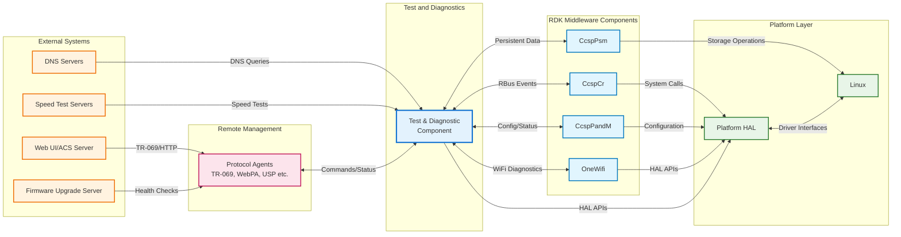
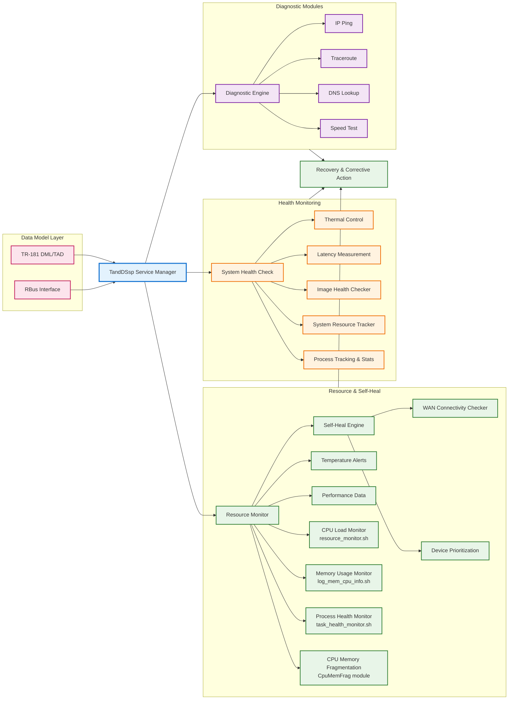
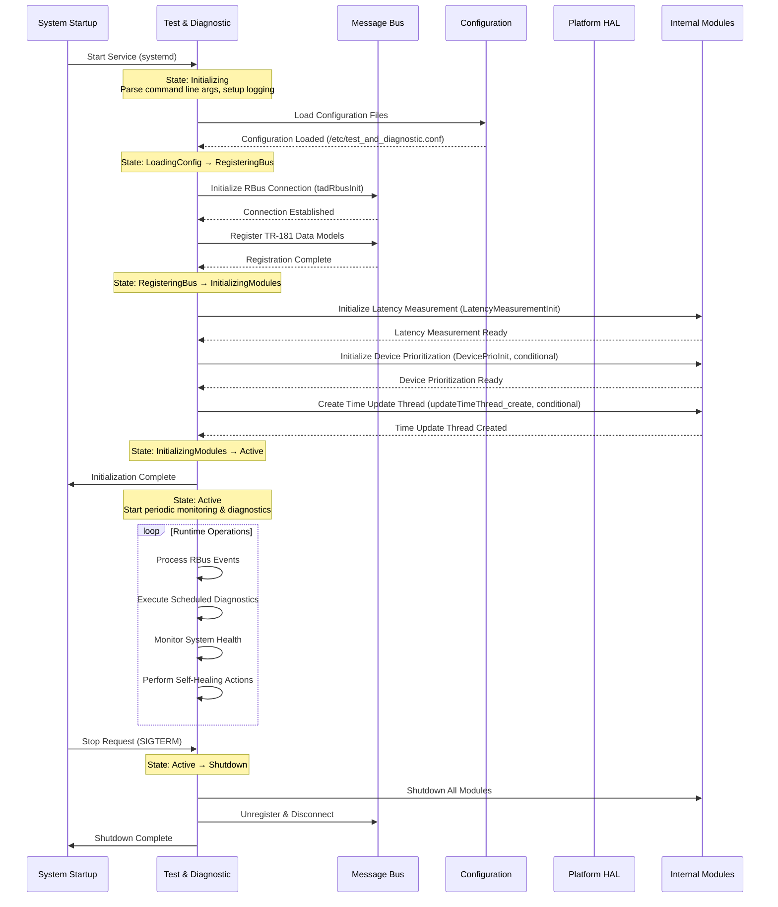
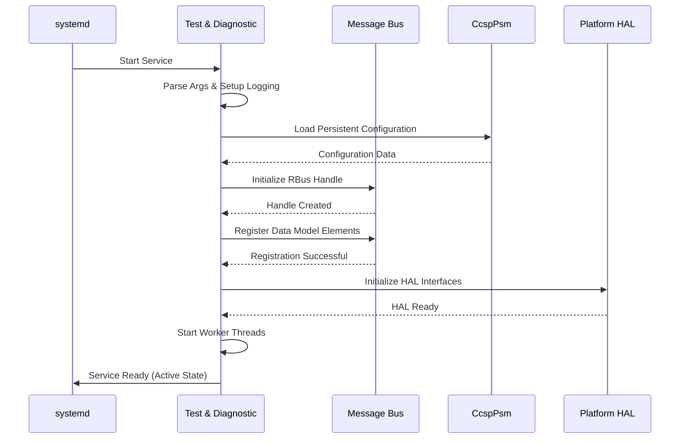
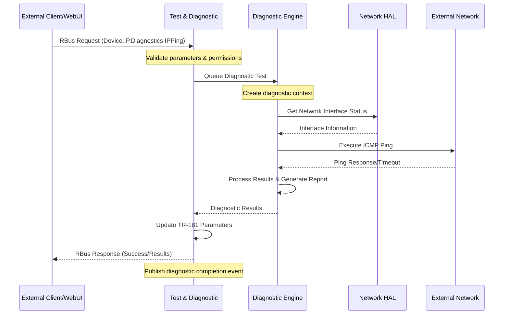
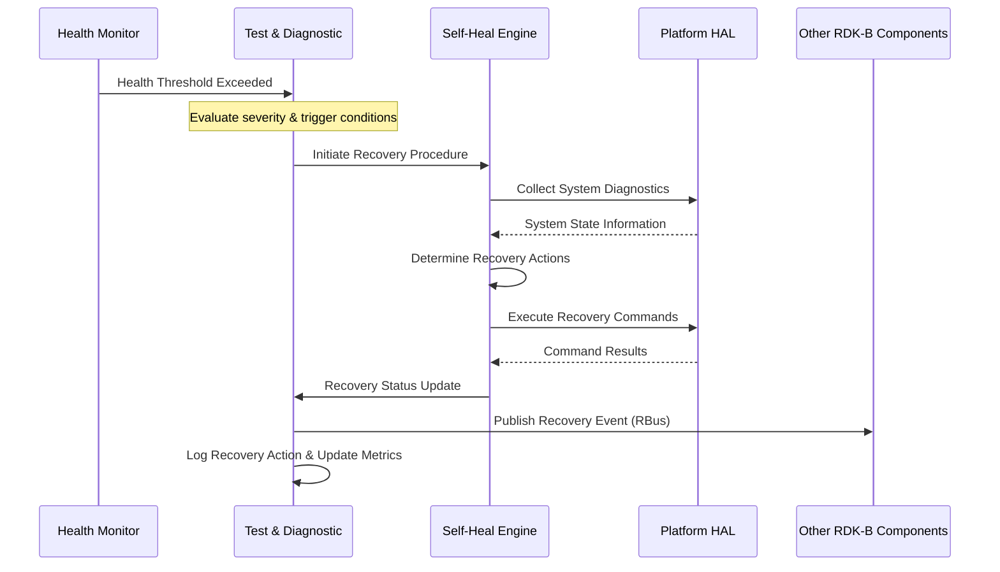
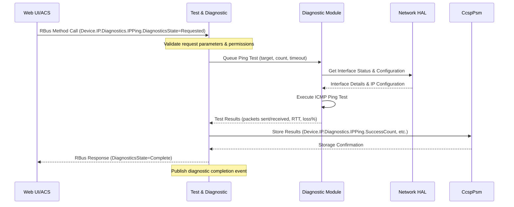
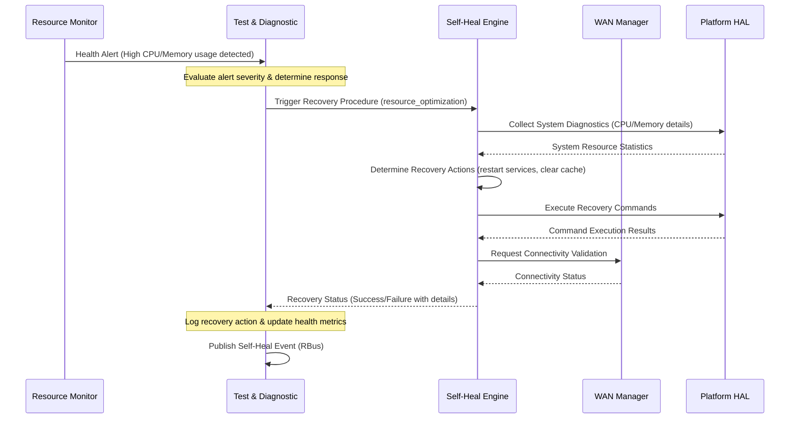
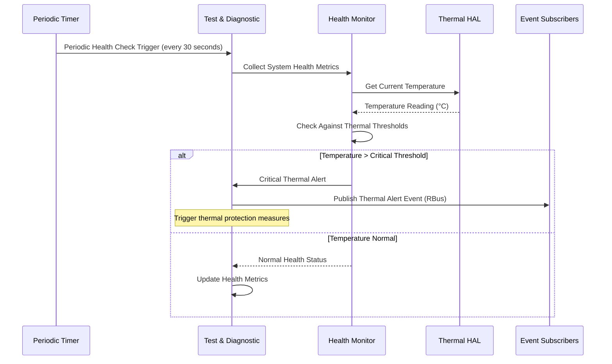

# Test And Diagnostic (TandD) Component Documentation

The Test and Diagnostic component is a comprehensive RDK-B middleware module that provides essential network connectivity testing, self-healing capabilities, system health monitoring, and diagnostic services for broadband gateway devices. This component serves as the central hub for proactive device health management, ensuring optimal network performance and automatic issue resolution.

The component operates as three distinct service layers: First, it provides network diagnostic capabilities including ping, traceroute, DNS lookup, upload/download testing, and WAN connectivity monitoring to validate network paths and performance. Second, it implements intelligent self-healing mechanisms that automatically detect and remediate common connectivity issues, memory leaks, and service failures without user intervention. Third, it offers comprehensive system health monitoring including CPU/memory usage tracking, thermal management, latency measurements, and device prioritization services.

At the module level, the component integrates deeply with the RDK-B ecosystem through RBus messaging for real-time event publishing, TR-181 data model compliance for standardized parameter access, HAL layer integration for hardware-specific operations, and persistent configuration management. It coordinates with other RDK-B components like CcspCr (Component Registry), CcspPandM (Provisioning and Management), and OneWifi for holistic device management while maintaining loose coupling through well-defined interfaces.

**Key Features & Responsibilities**:

- **Network Connectivity Diagnostics**: Provides comprehensive network testing tools including ICMP ping, UDP echo, traceroute, DNS lookup, and bandwidth testing to validate end-to-end connectivity and diagnose network issues
- **Self-Healing & Recovery Mechanisms**: Implements intelligent automatic recovery systems that detect and remediate connectivity failures, memory leaks, process crashes, and configuration corruption without manual intervention
- **System Health Monitoring**: Continuously monitors critical system metrics including CPU utilization, memory usage, thermal conditions, and device performance to ensure optimal operation and prevent system degradation
- **WAN Connectivity Validation**: Performs periodic WAN connectivity checks with configurable test intervals, failure thresholds, and automatic failover mechanisms to maintain reliable internet access
- **Latency Measurement & Analysis**: Measures network latency across different paths and protocols to optimize routing decisions and detect performance degradation
- **Image Health Verification**: Validates firmware integrity and performs health checks on system images to detect corruption and ensure system stability
- **Resource Monitoring & Alerting**: Tracks system resources, generates health reports, and publishes critical events to enable proactive maintenance and troubleshooting

## Design

The Test and Diagnostic component follows a modular, event-driven architecture designed for high reliability and scalability in broadband gateway environments. The design emphasizes separation of concerns with distinct modules handling diagnostics, self-healing, monitoring, and control functions while maintaining unified coordination through a central service manager. The architecture ensures minimal performance impact on the primary networking functions while providing comprehensive health monitoring and automatic remediation capabilities.

The component's design integrates seamlessly with the RDK-B middleware ecosystem through standardized interfaces and messaging protocols. It leverages the RBus messaging framework for real-time event propagation, enabling other components to subscribe to health and diagnostic events. The TR-181 data model compliance ensures consistent parameter access patterns and remote management capabilities through standard CWMP protocols. The modular design allows individual diagnostic and monitoring functions to operate independently, providing fault isolation and enabling selective feature activation based on device capabilities and configuration requirements.

The IPC mechanisms are strategically designed to minimize system overhead while ensuring reliable communication. The component uses RBus for high-frequency event publishing and parameter synchronization, POSIX message queues for inter-module communication within the component, and direct HAL API calls for hardware interactions. Data persistence is achieved through integration with CcspPsm for configuration parameters and local file-based storage for diagnostic logs and temporary data, ensuring data integrity across system reboots and component restarts.

### Prerequisites and Dependencies

**Build-Time Flags and Configuration:**

| Configure Option | DISTRO Feature | Build Flag | Purpose | Default |
|------------------|----------------|------------|---------|----------|
| `--enable-mta` | N/A | `ENABLE_MTA` | Enable Media Terminal Adapter (MTA) support for cable modem diagnostics | Enabled |
| `--enable-core_net_lib_feature_support` | `core-net-lib` | `CORE_NET_LIB_FEATURE_SUPPORT` | Enable advanced networking library support for enhanced diagnostics | Disabled |
| `--enable-rdk_scheduler` | `enable_rdkscheduler` | `RDK_SCHEDULER_ENABLED` | Enable RDK Scheduler integration for task management | Disabled |
| `--enable-device_prioritization` | `enable_device_prioritization` | `DEVICE_PRIORITIZATION_ENABLED` | Enable device prioritization and QoS management features | Disabled |
| `--enable-resourceoptimization` | N/A | `RESOURCE_OPTIMIZATION_ENABLED` | Enable resource optimization algorithms and memory management | Disabled |
| `--enable-warehousediagnostics` | N/A | `WAREHOUSE_DIAGNOSTICS_ENABLED` | Enable warehouse-specific diagnostic tests and validation procedures | Disabled |
| `--enable-unitTestDockerSupport` | N/A | `UNIT_TEST_DOCKER_SUPPORT` | Enable Docker-based unit testing framework integration | Disabled |

**RDK-B Platform and Integration Requirements (MUST):**

- **RDK-B Components**: CcspCommonLibrary (message bus), CcspCr (component registry), CcspPsm (persistent storage), CcspPandM (provisioning)
- **HAL Dependencies**: Platform HAL v2.0+, Network HAL, Thermal HAL (if thermal monitoring enabled)
- **Systemd Services**: ccsp-msg-bus.service, ccsp-cr.service, ccsp-psm.service must be active before test-and-diagnostic.service
- **Message Bus**: RBus registration for "Device.SelfHeal.", "Device.IP.Diagnostics.", "Device.DeviceInfo.X_RDKCENTRAL-COM_xOpsDeviceMgmt." namespaces
- **Configuration Files**: `/etc/ccsp_msg.cfg`, `/nvram/syscfg.db`, TR-181 data model XML configuration in `config/TestAndDiagnostic_arm.XML`
- **Startup Order**: Initialize after message bus and component registry, before user-facing services like WiFi and WAN components

**Threading Model**

The Test and Diagnostic component implements a multi-threaded architecture using POSIX pthreads for concurrent diagnostic operations, latency measurements, and system monitoring. The component creates multiple background threads to handle different aspects of network diagnostics and system health monitoring.

**Note**: The threading table lists the most important threads in the Test and Diagnostic component. Some threads are part of core functionality (Main, Ping Test, WAN connectivity threads, Diagnostic Task) while others are conditionally compiled based on build flags (Time Update thread for ethwan/extender mode, Monitor Service thread for latency measurement, RDK Test Monitor for RDK testing features). Additional auxiliary threads for latency measurement (like hash cleanup, subscription retry, sysevent handlers) are created as needed but are not listed as they are implementation details of the latency measurement subsystem.

| Thread & Function | Purpose | Cycle/Timeout | Synchronization |
|-------------------|---------|----------------|------------------|
| **Main Thread** `main()` / `ssp_main()` | Component initialization, RBus message processing, TR-181 parameter handling | Event-driven message loop, RBus callbacks, SSP lifecycle management | RBus async callbacks, pthread mutexes |
| **Ping Test Thread** `COSAIP_pingtest_ProcessThread()` | Network connectivity testing through ping operations | On-demand execution via TR-181 ping test requests | pthread_create(), result synchronization |
| **WAN Query Now Thread** `wancnctvty_chk_querynow_thread()` | WAN connectivity immediate query processing | On-demand execution for immediate connectivity validation | pthread_create() per query request |
| **WAN Passive Monitor Thread** `wancnctvty_chk_passive_thread()` | Passive WAN connectivity monitoring without active probing | Continuous monitoring with configurable intervals | pthread_create(), interface state monitoring |
| **WAN Active Monitor Thread** `wancnctvty_chk_active_thread()` | Active WAN connectivity monitoring with network probing | Periodic active connectivity tests and validation | pthread_create(), active probe synchronization |
| **Diagnostic Task Thread** `diag_task()` | Generic diagnostic task execution with timeout management | Per-diagnostic operation with configurable timeouts | pthread_mutex_t, pthread_timedjoin_np() for timeout handling |
| **Time Update Thread** `updateTimeThread()` | Continuous time synchronization for ethwan mode, build epoch validation | Periodic time updates with sleep intervals (conditional on ethwan/extender) | pthread_detach(), time state validation |
| **Monitor Service Thread** `LatencyMeasurement_MonitorService()` | Primary latency measurement service monitoring and coordination | Continuous monitoring loop with configurable intervals | pthread_mutex_t, pthread_cond_t synchronization |
| **RDK Test Monitor Thread** `monitor_thread()` | RDK test monitoring and result collection | Continuous monitoring during active RDK test operations | pthread synchronization with test execution |

### Component State Flow

**Initialization to Active State**

The Test and Diagnostic component follows a structured initialization sequence ensuring all dependencies are available and properly configured before entering active monitoring and diagnostic operations. The component validates its environment, establishes communication channels, and performs initial health checks before becoming fully operational.

**Runtime State Changes and Context Switching**

The component maintains several operational contexts that can dynamically change based on system conditions, configuration updates, and external triggers.

**State Change Triggers:**

- **Connectivity Loss Detection**: Transitions to enhanced monitoring mode when WAN connectivity failures are detected, increasing diagnostic frequency and activating aggressive self-healing procedures
- **Resource Threshold Breach**: Switches to resource conservation mode when CPU or memory usage exceeds configured thresholds, reducing diagnostic frequency and disabling non-critical features
- **Configuration Updates**: Dynamically reconfigures operational parameters when TR-181 configuration changes are received via RBus, without requiring service restart
- **Emergency Recovery Mode**: Activates when critical system failures are detected, prioritizing essential connectivity restoration over comprehensive diagnostics

**Context Switching Scenarios:**

- **Normal to Diagnostic Mode**: When scheduled or triggered diagnostic tests are initiated, the component allocates additional resources and temporarily increases logging verbosity
- **Failover Context**: During WAN connectivity failures, switches from passive monitoring to active recovery procedures including interface resets and alternative path validation
- **Maintenance Mode**: Enters low-impact operation during firmware updates or system maintenance, suspending non-critical diagnostics while maintaining essential monitoring functions

### Call Flow

**Initialization Call Flow:**

**Network Diagnostic Request Processing Call Flow:**

**Self-Healing Event Processing Call Flow:**

## Internal Modules

The Test and Diagnostic component is structured into specialized modules that handle distinct aspects of system health, network diagnostics, and automated recovery. Each module operates semi-independently while coordinating through the central service manager for unified operation and event correlation.

| Module/Class | Description | Key Files |
|-------------|------------|-----------|
| **TandDSsp** | Service Support Platform that manages component lifecycle, RBus registration, TR-181 data model implementation, and coordination between all internal modules | `ssp_main.c`, `ssp_messagebus_interface.c`, `ssp_action.c` |
| **Diagnostic Engine** | Core network diagnostic functionality including ping, traceroute, DNS lookup, speed testing, and upload/download validation with result processing and reporting | `bbhm_diag_lib.c`, `BbhmDiagIpPing/`, `BbhmDiagIpTraceroute/`, `BbhmDiagNSLookup/` |
| **DML/TAD Layer** | TR-181 Data Model Layer providing standardized parameter access for diagnostic results, self-heal configuration, and system health metrics with CWMP compliance | `cosa_diagnostic_apis.c`, `cosa_dns_dml.c`, `cosa_ip_dml.c` |
| **Self-Heal Engine** | Intelligent system recovery module that monitors connectivity, detects failures, and executes automated remediation procedures including interface resets and service recovery | `selfheal_bootup.sh`, `selfheal_aggressive.sh`, `self_heal_connectivity_test.sh` |
| **Health Monitor** | Comprehensive system health monitoring including CPU/memory usage, thermal conditions, resource availability, and performance metrics with threshold-based alerting | `resource_monitor.sh`, `task_health_monitor.sh`, `log_mem_cpu_info.sh` |
| **WAN Connectivity Checker** | Specialized module for WAN connectivity validation, failure detection, and automatic recovery coordination with configurable test parameters and thresholds | `cosa_wanconnectivity_apis.c`, `cosa_wanconnectivity_rbus_apis.c` |
| **Thermal Control** | Temperature monitoring and thermal management with fan control, performance throttling, and over-temperature protection for hardware preservation | `ThermalCtrl/` directory modules |
| **Latency Measurement** | Network latency analysis and measurement services for performance optimization and quality assessment with statistical analysis and reporting | `LatencyMeasurement/` directory modules |
| **Image Health Checker** | Firmware integrity validation and system image health verification to detect corruption and ensure system stability | `ImageHealthChecker/` directory modules |
| **Device Prioritization** | Bandwidth allocation and QoS management based on device priorities and traffic classification for optimal network resource utilization | `DevicePrioritization/` directory modules |

## Component Interactions

The Test and Diagnostic component maintains extensive interactions across the RDK-B ecosystem, serving as both a consumer of system health data and a provider of diagnostic services and automated recovery capabilities. These interactions span multiple layers from external management systems down to hardware abstraction layers.

### Interaction Matrix

| Target Component/Layer | Interaction Purpose | Key APIs/Endpoints |
|------------------------|-------------------|------------------|
| **RDK-B Middleware Components** |
| CcspCr (Component Registry) | Component registration, health reporting, event subscription | `registerComponent()`, `componentHealthEvent` |
| CcspPandM (Provisioning & Management) | Configuration synchronization, factory reset coordination | `Device.DeviceInfo.`, `Device.ManagementServer.` |
| OneWifi | WiFi interface diagnostics, connectivity validation | `Device.WiFi.`, `wifiHealthCheckTrigger` |
| CcspPsm | Persistent storage of diagnostic results, configuration | `PSM_Set_Record_Value()`, `PSM_Get_Record_Value()` |
| WAN Manager | WAN connectivity monitoring, interface status | `Device.X_RDK_WanManager.`, `wanConnectionStatus` |
| Ethernet Agent | Ethernet interface diagnostics, link status | `Device.Ethernet.Interface.`, `linkStatusChange` |
| **System & HAL Layers** |
| Platform HAL | System resource monitoring, hardware health | `platform_hal_GetMemoryStatus()`, `platform_hal_GetCPUTemperature()` |
| Network HAL | Network interface statistics, configuration | `nethal_getInterfaceStats()`, `nethal_configureInterface()` |
| Thermal HAL | Temperature monitoring, thermal management | `thermal_hal_getCurrentTemperature()`, `thermal_hal_setFanSpeed()` |
| System Services | Process monitoring, service control, log management | `systemctl status`, `/proc/meminfo`, `/sys/class/thermal/` |

**Events Published by Test & Diagnostic:**

| Event Name | Event Topic/Path | Trigger Condition | Subscriber Components |
|------------|-----------------|-------------------|---------------------|
| DeviceHealthEvent | `Device.DeviceInfo.X_RDKCENTRAL-COM_xOpsDeviceMgmt.Logging.xOpsDMUploadLogsNow` | Health threshold violations, critical failures | CcspPandM, Telemetry, WebUI |
| ConnectivityStatusEvent | `Device.SelfHeal.ConnectivityTest.X_RDKCENTRAL-COM_pingStatus` | WAN connectivity changes, ping test results | WAN Manager, CcspPandM |
| DiagnosticCompleteEvent | `Device.IP.Diagnostics.X_RDKCENTRAL-COM_DiagnosticsState` | Completion of diagnostic tests (ping, traceroute, etc.) | WebUI, ACS Server, NMS |
| SelfHealActionEvent | `Device.SelfHeal.ResourceMonitor.X_RDKCENTRAL-COM_UsageComputeWindow` | Self-heal actions triggered and completed | CcspPandM, Logging Services |
| ThermalAlertEvent | `Device.DeviceInfo.X_RDKCENTRAL-COM_ThermalProtection.Enable` | Temperature threshold breaches | All middleware components |

### IPC Flow Patterns

**Primary IPC Flow - Diagnostic Test Execution:**

**Self-Healing Event Flow:**

**Health Monitoring Event Flow:**

## Implementation Details

### Major HAL APIs Integration

The Test and Diagnostic component integrates with multiple HAL layers to access hardware-specific functionality and system resources. These integrations provide the foundation for accurate system monitoring and hardware-aware diagnostic capabilities.

**Core HAL APIs:**

| HAL API | Purpose | Implementation File |
|---------|---------|-------------------|
| `platform_hal_GetMemoryStatus()` | Retrieves system memory statistics including total, free, and usage percentages | `source/dmltad/cosa_deviceinfo_util_priv.c` |
| `platform_hal_GetCPUTemperature()` | Gets current CPU temperature for thermal monitoring and protection | `source/ThermalCtrl/thermal_monitor.c` |
| `nethal_getInterfaceStats()` | Collects network interface statistics for connectivity analysis | `source/dmltad/cosa_ip_dml.c` |
| `nethal_configureInterface()` | Configures network interfaces during recovery procedures | `source/dmltad/cosa_wanconnectivity_apis.c` |
| `thermal_hal_getCurrentTemperature()` | Monitors system thermal conditions across multiple sensors | `source/ThermalCtrl/thermal_control.c` |
| `thermal_hal_setFanSpeed()` | Controls thermal management through fan speed adjustment | `source/ThermalCtrl/thermal_control.c` |
| `platform_hal_getSystemUptime()` | Gets system uptime for health calculations and boot diagnostics | `source/dmltad/cosa_diagnostic_apis.c` |

### Key Implementation Logic

- **State Machine Engine**: The core diagnostic and self-healing state machine is implemented across multiple coordinated modules with centralized state management
     - Main implementation in `source/TandDSsp/ssp_main.c` for component lifecycle and coordination
     - State transition handlers in `source/dmltad/cosa_diagnostic_apis.c` for diagnostic test state management
     - Self-healing state logic in shell scripts under `scripts/selfheal_*.sh` for recovery procedures

- **Event Processing**: Hardware events and system alerts are processed through a multi-layered event handling system
     - Hardware interrupt handling via HAL callback registration for thermal and network events
     - Event queue management using RBus subscription model for inter-component communication
     - Asynchronous event processing with dedicated worker threads for non-blocking operation

- **Error Handling Strategy**: Comprehensive error detection and recovery with multiple escalation levels
     - HAL error code mapping with retry logic for transient hardware interface failures
     - Recovery mechanisms for failed diagnostic tests including parameter validation and timeout handling
     - Timeout handling and retry logic with exponential backoff for network operations and self-healing procedures

- **Logging & Debugging**: Multi-level logging system with configurable verbosity and specialized debugging tools
     - Diagnostic test logging with detailed parameter tracking and result correlation
     - HAL API call tracing with performance metrics and error rate monitoring
     - Debug hooks for troubleshooting connectivity issues including packet capture integration and network path analysis

### Key Configuration Files

| Configuration File | Purpose | Override Mechanisms |
|--------------------|---------|--------------------|
| `/nvram/syscfg.db` | Persistent system configuration managed by CcspPsm | `syscfg set/get` commands, factory reset procedures |
| `config/TestAndDiagnostic_arm.XML` | TR-181 data model definitions and parameter mappings | Component rebuild required for structural changes |
| `/tmp/selfheal.txt` | Runtime self-healing configuration and temporary state | Script-based updates, manual editing for debugging |
| `/etc/ccsp_msg.cfg` | Message bus configuration for RBus communication | Service restart required after modifications |