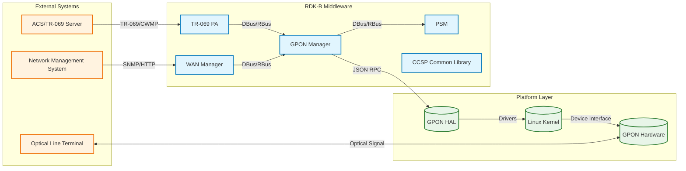
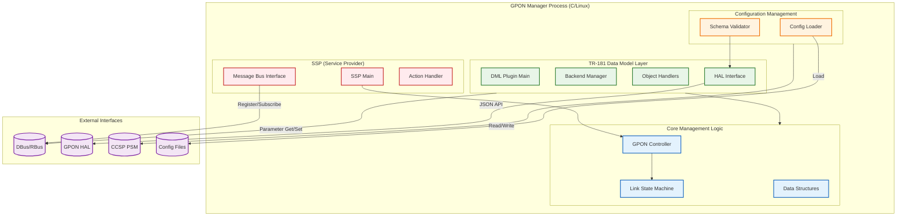
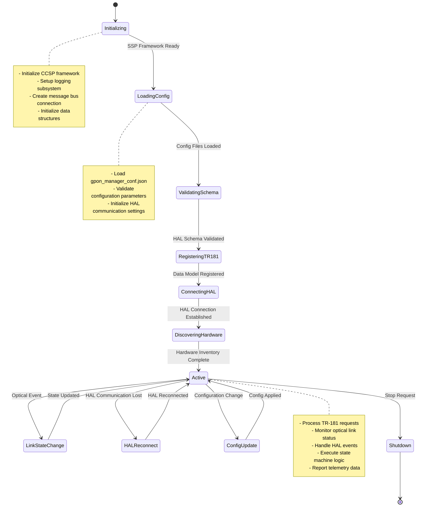
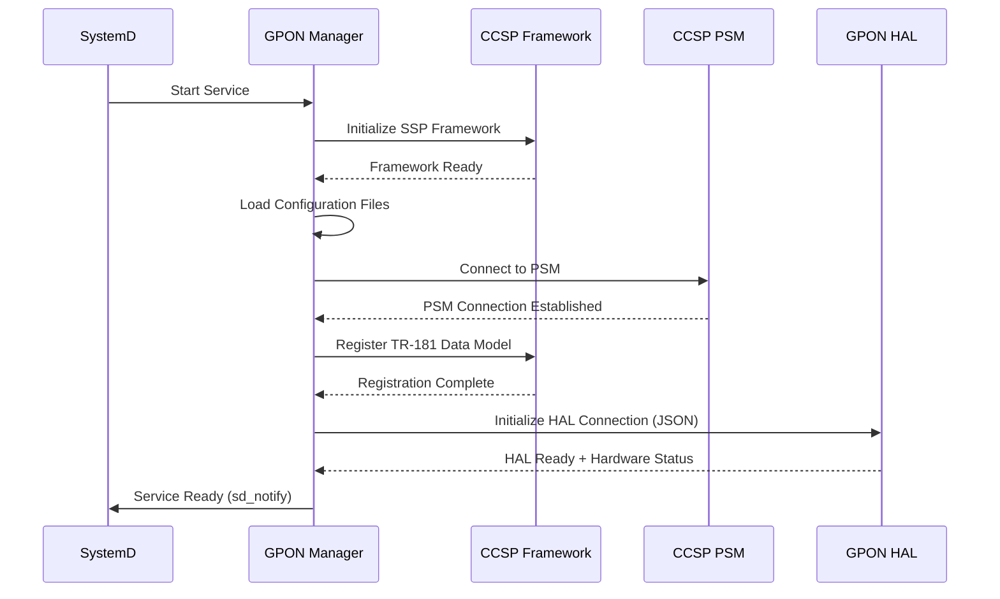
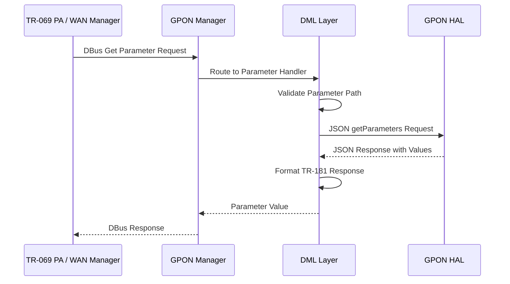
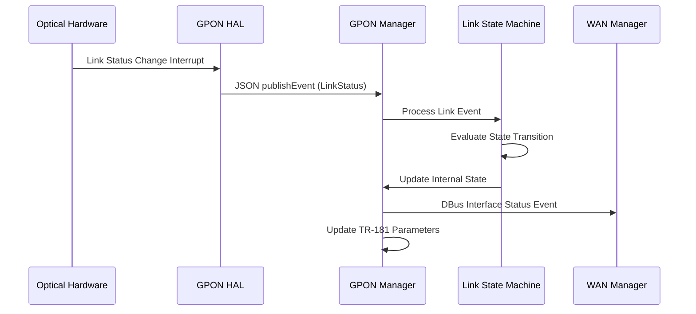
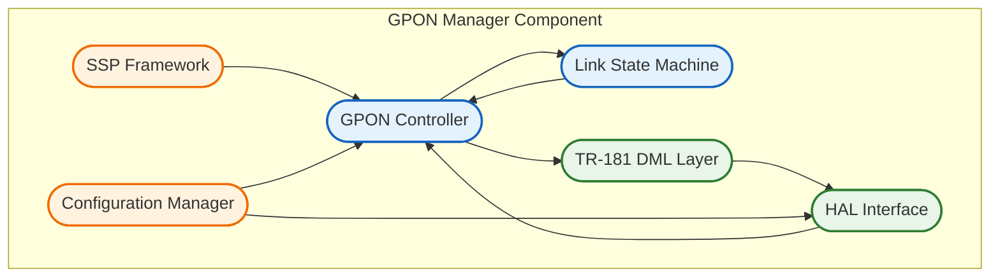
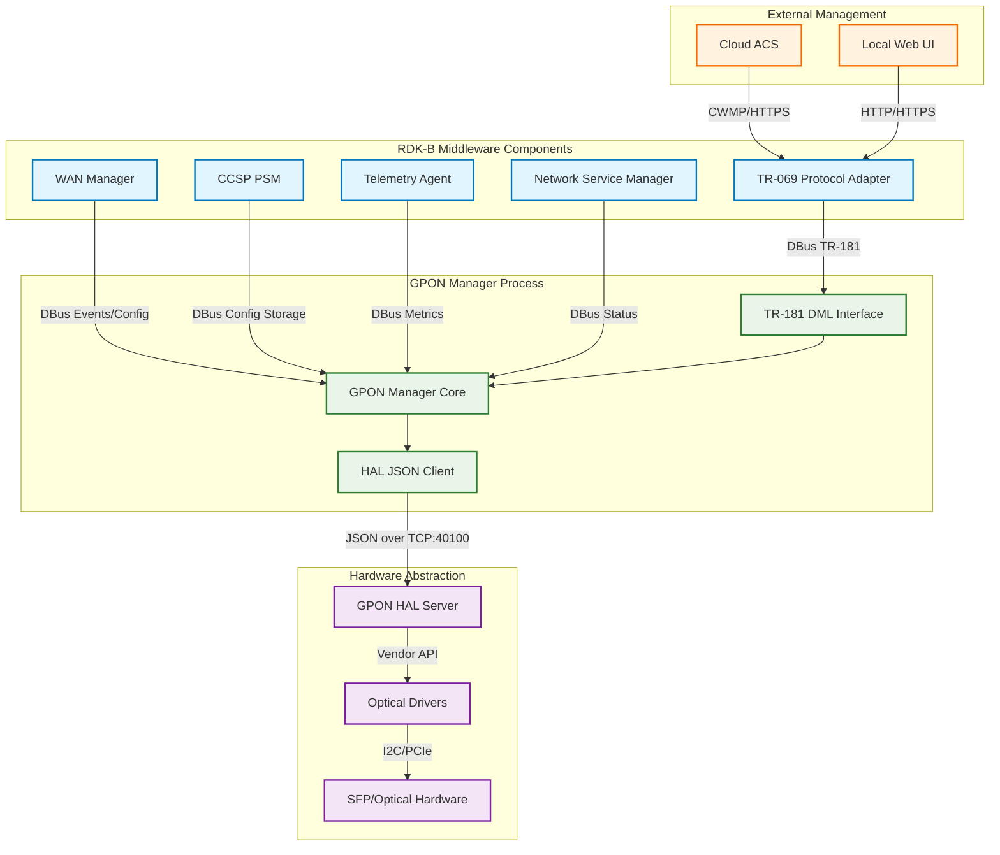
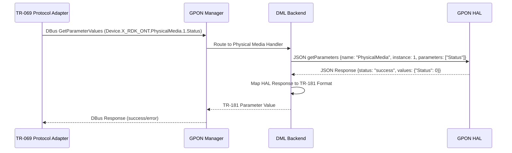
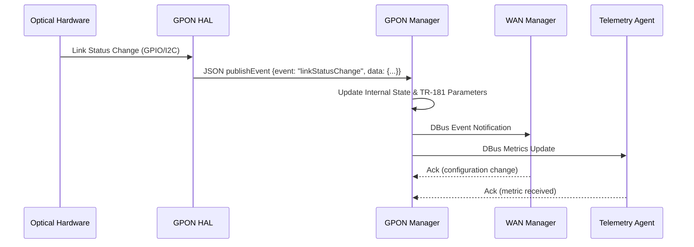

# GPON Manager Documentation

The GPON Manager (RdkGponManager) is a critical RDK-B middleware component responsible for managing Gigabit-capable Passive Optical Network (GPON) interfaces and optical transceivers in residential gateway devices. This component serves as the middleware layer between the RDK-B framework and the underlying GPON Hardware Abstraction Layer (HAL), providing standardized TR-181 data model access, link state management, and optical network configuration capabilities.

The component abstracts the complexity of GPON optical network management, enabling higher-level RDK-B components and external management systems to control and monitor GPON connections through well-defined interfaces. As fiber-optic broadband becomes increasingly prevalent, the GPON Manager ensures reliable and standardized management of high-speed optical network connections in RDK-B deployments.



**Key Features & Responsibilities**: 

- **GPON Interface Management**: Manages physical GPON interfaces including status monitoring, configuration, and operational state control for multiple PON technologies (GPON, XG-PON, NG-PON2, XGS-PON)
- **TR-181 Data Model Implementation**: Implements comprehensive TR-181 data models for X_RDK_ONT objects including PhysicalMedia, GTC, PLOAM, OMCI, GEM, and VEIP parameters with full read/write access control
- **HAL Abstraction & Integration**: Provides JSON-based HAL interface abstraction for vendor-specific GPON implementations, enabling standardized communication between middleware and hardware layers
- **State Machine Management**: Orchestrates GPON link state machines for connection establishment, maintenance, and recovery operations with event-driven state transitions
- **Performance Monitoring**: Collects and reports GPON performance metrics, optical power levels, and link quality statistics for network optimization and troubleshooting
- **Event-Driven Architecture**: Publishes real-time events for GPON state changes, alarms, and performance thresholds to enable responsive network management

## Design

The GPON Manager follows a layered architecture design with clear separation of concerns between TR-181 data model management, business logic control, and hardware abstraction. The component is designed as a single-threaded event-driven application that leverages the RDK-B Common Component Software Platform (CCSP) framework for inter-process communication and configuration management. The design emphasizes reliability and fault tolerance through comprehensive state machine implementation and robust error handling mechanisms.

The component's architecture integrates seamlessly with the broader RDK-B ecosystem through DBus/RBus messaging for northbound communications with other middleware components like WAN Manager and TR-069 Protocol Adapter. Southbound interactions with the GPON HAL are handled through a JSON-based protocol that provides vendor-agnostic hardware abstraction while maintaining high performance and low latency requirements essential for real-time optical network management.

Data persistence is managed through integration with CCSP PSM (Persistent Storage Manager) for configuration storage and retrieval, ensuring that GPON settings survive system reboots and firmware upgrades. The component also implements comprehensive logging and telemetry capabilities to support network operations and troubleshooting activities.



### Prerequisites and Dependencies

**RDK-B Platform Requirements (MUST):**

- **DISTRO Features**: DISTRO_FEATURES must include "rdkb-gpon" and "optical-networking" flags to enable GPON support and optical interface management
- **Build Dependencies**: meta-rdk-broadband layer, ccsp-common-library, ccsp-psm, and hal-gpon recipe dependencies must be present in the build environment
- **RDK-B Components**: CCSP PSM (Persistent Storage Manager), CCSP Common Library, and CCSP Message Bus components must be running and accessible
- **HAL Dependencies**: GPON HAL implementation conforming to RDK GPON HAL API specification version 1.0 or higher with JSON schema support
- **Systemd Services**: ccsp-psm.service and ccsp-msg-bus.service must be active before GPON Manager initialization
- **Hardware Requirements**: SFP/SFP+ optical transceiver slots, GPON optical interface hardware, and vendor-specific optical PHY drivers

**RDK-B Integration Requirements (MUST):**

- **Message Bus**: DBus registration with destination name "eRT.com.cisco.spvtg.ccsp.gponmanager" and RBus namespace "Device.X_RDK_ONT" reserved for TR-181 parameter access 
- **TR-181 Data Model**: PSM must support Device.X_RDK_ONT.* parameter persistence and WAN Manager must recognize GPON interface types in Device.X_RDK_WanManager configuration 
- **Configuration Files**: /etc/rdk/conf/gpon_manager_conf.json and /etc/rdk/schemas/gpon_hal_schema.json must be present with proper permissions and valid content 
- **Startup Order**: Must initialize after CCSP PSM and Message Bus but before WAN Manager and TR-069 Protocol Adapter to ensure proper dependency resolution 
- **Resource Constraints**: Minimum 8MB RAM allocation, 1MB persistent storage space, and low-latency access to optical hardware interfaces for real-time monitoring 

**Performance & Optimization (SHOULD):**

- **Enhanced Features**: DISTRO_FEATURES += "wan-manager-unification" enables enhanced integration with unified WAN management features 
- **Recommended Hardware**: Multi-port SFP+ modules and redundant optical transceivers improve reliability and performance monitoring capabilities 
- **Configuration Tuning**: hal_schema_path optimization and server_port configuration (default 40100) for optimal HAL communication performance 
- **Monitoring Integration**: Integration with RDKB Telemetry 2.0 for advanced optical performance metrics and proactive fault detection 

**RDK-B Design Limitations & Considerations:**

- **Known Limitations**: Currently supports maximum 128 physical media instances, single GPON controller per device, and synchronous HAL communication model 
- **Scalability Boundaries**: Maximum 4 optical transceivers per device, 1Gbps monitoring data throughput, and 100ms maximum response time for TR-181 parameter operations 
- **Platform Compatibility**: Supports RDK-B 2019.2 and later versions, ARM and x86_64 architectures, and requires Linux kernel 4.14+ for optimal optical driver support 
- **Resource Usage**: Typical memory footprint 4-6MB RSS, CPU usage <2% during normal operation, with peaks up to 10% during optical link state transitions 

**Dependent Components:**
- WAN Manager relies on GPON Manager for optical interface status and configuration when GPON is selected as the primary WAN technology 
- TR-069 Protocol Adapter depends on GPON Manager's TR-181 implementation for remote optical network management and diagnostic capabilities 
- Network Service Manager requires GPON link state information for proper network service activation and failover scenarios 

**Threading Model**

- **Threading Architecture**: Single-threaded event-driven application using the CCSP framework's main event loop for message processing and state management 
- **Main Thread**: Handles all TR-181 parameter operations, DBus message processing, HAL communication, state machine transitions, and configuration management operations 
- **Synchronization**: Uses CCSP framework's built-in synchronization mechanisms and atomic operations for shared data access, with mutex protection for critical sections during HAL  operations 

## Component State Flow

### Initialization to Active State

The GPON Manager follows a structured initialization sequence that ensures all dependencies are properly established before entering active service mode. The component progresses through distinct states with comprehensive validation at each step to guarantee reliable operation in production environments.



### Runtime State Changes and Context Switching

During normal operation, the GPON Manager continuously monitors optical link conditions and responds to various triggers that require state transitions or operational context changes. These runtime changes ensure optimal network performance and rapid recovery from fault conditions.

**State Change Triggers:**
- Optical link up/down events trigger immediate state machine evaluation and potential WAN interface status updates
- SFP module insertion/removal events cause hardware discovery re-initialization and TR-181 parameter updates
- HAL communication failures trigger automatic reconnection attempts and error reporting to dependent components
- Configuration parameter changes via TR-181 interface cause validation and application of new settings with rollback capability

**Context Switching Scenarios:**
- Redundancy switching between primary and standby optical interfaces when hardware failure is detected
- PON mode transitions (GPON to XG-PON) based on optical transceiver capabilities and operator configuration
- Power management mode changes for energy efficiency optimization during low-traffic periods

## Call Flow

### Primary Call Flows

**Initialization Call Flow:**



**TR-181 Parameter Get Request Processing:**



**Optical Link State Change Event Flow:**



## TR‑181 Data Models

### Supported TR-181 Parameters

The GPON Manager implements a comprehensive set of TR-181 parameters under the Device.X_RDK_ONT namespace, providing standardized access to GPON physical media properties, VEIP (Virtual Ethernet Interface Point) configuration, and optical performance metrics. The implementation follows BBF TR-181 specification principles while incorporating RDK-specific extensions for advanced optical network management.

#### Object Hierarchy

```
Device.
└── X_RDK_ONT.
    ├── PhysicalMedia.{i}.
    │   ├── Cage (uint32, R)
    │   ├── ModuleVendor (string, R)
    │   ├── ModuleName (string, R)
    │   ├── ModuleVersion (string, R)
    │   ├── ModuleFirmwareVersion (string, R)
    │   ├── PonMode (uint32, R)
    │   ├── Connector (uint32, R)
    │   ├── NominalBitRateDownstream (uint32, R)
    │   ├── NominalBitRateUpstream (uint32, R)
    │   ├── Enable (boolean, R/W)
    │   ├── Status (uint32, R)
    │   ├── RedundancyState (uint32, R)
    │   ├── PowerOpticalReceived (int, R)
    │   ├── PowerOpticalTransmitted (int, R)
    │   ├── PowerSupplyVoltage (uint32, R)
    │   ├── PowerSupplyCurrent (uint32, R)
    │   ├── PowerSupplyTemperature (int, R)
    │   └── Stats.
    │       ├── BytesSent (uint64, R)
    │       ├── BytesReceived (uint64, R)
    │       ├── PacketsSent (uint64, R)
    │       ├── PacketsReceived (uint64, R)
    │       ├── ErrorsSent (uint32, R)
    │       ├── ErrorsReceived (uint32, R)
    │       └── DiscardPacketsReceived (uint32, R)
    └── Veip.{i}.
        ├── Enable (boolean, R/W)
        ├── Status (uint32, R)
        ├── Name (string, R/W)
        ├── LowerLayers (string, R/W)
        ├── EthIdType (uint32, R/W)
        ├── EthIdValue (uint32, R/W)
        └── Stats.
            ├── BytesSent (uint64, R)
            ├── BytesReceived (uint64, R)
            ├── PacketsSent (uint64, R)
            ├── PacketsReceived (uint64, R)
            ├── MulticastPacketsSent (uint64, R)
            ├── MulticastPacketsReceived (uint64, R)
            ├── BroadcastPacketsSent (uint64, R)
            ├── BroadcastPacketsReceived (uint64, R)
            ├── ErrorsSent (uint32, R)
            ├── ErrorsReceived (uint32, R)
            ├── UnicastPacketsSent (uint64, R)
            ├── UnicastPacketsReceived (uint64, R)
            ├── DiscardPacketsSent (uint32, R)
            └── DiscardPacketsReceived (uint32, R)
```

#### Parameter Definitions

**Core Physical Media Parameters:**

| Parameter Path | Data Type | Access | Default Value | Description | BBF Compliance |
|----------------|-----------|--------|---------------|-------------|----------------|
| `Device.X_RDK_ONT.PhysicalMedia.{i}.Cage` | uint32 | R | `0` | Optical transceiver cage type where 0=BoB (Ball on Board), 1=SFP (Small Form-factor Pluggable). Indicates the physical form factor of the optical interface. | Custom Extension |
| `Device.X_RDK_ONT.PhysicalMedia.{i}.ModuleVendor` | string(256) | R | `""` | Vendor identification string retrieved from SFP EEPROM data, providing manufacturer information for the installed optical transceiver module. | Custom Extension |
| `Device.X_RDK_ONT.PhysicalMedia.{i}.PonMode` | uint32 | R | `0` | Current PON technology mode: 0=GPON (1.25G/2.5G), 1=XG-PON (10G/2.5G), 2=NG-PON2 (multiple wavelengths), 3=XGS-PON (10G symmetric). | Custom Extension |
| `Device.X_RDK_ONT.PhysicalMedia.{i}.Enable` | boolean | R/W | `true` | Administrative enable/disable control for the optical interface. When false, the interface is administratively disabled and no optical transmission occurs. | TR-181 Issue 2 |
| `Device.X_RDK_ONT.PhysicalMedia.{i}.Status` | uint32 | R | `1` | Operational status: 0=Up (operational), 1=Down (not operational), 2=Unknown, 3=Dormant, 4=NotPresent (no SFP), 5=LowerLayerDown, 6=Error (hardware fault). | TR-181 Issue 2 |
| `Device.X_RDK_ONT.PhysicalMedia.{i}.PowerOpticalReceived` | int | R | `-40000` | Received optical power in units of 0.1 dBm. Range typically -40.0 to +8.0 dBm. Negative values indicate power below 1mW reference level. | Custom Extension |

**VEIP Interface Parameters:**

| Parameter Path | Data Type | Access | Default Value | Description | BBF Compliance |
|----------------|-----------|--------|---------------|-------------|----------------|
| `Device.X_RDK_ONT.Veip.{i}.Enable` | boolean | R/W | `false` | Administrative enable state for Virtual Ethernet Interface Point. Controls whether the VEIP is available for service mapping and traffic forwarding. | TR-181 Issue 2 |
| `Device.X_RDK_ONT.Veip.{i}.Status` | uint32 | R | `1` | VEIP operational status using same enumeration as PhysicalMedia.Status. Reflects the current operational state of the virtual interface. | TR-181 Issue 2 |
| `Device.X_RDK_ONT.Veip.{i}.LowerLayers` | string | R/W | `""` | Comma-separated list of lower layer interface references. Typically references Device.X_RDK_ONT.PhysicalMedia instances that support this VEIP. | TR-181 Issue 2 |

**Custom Extensions:**

- **Optical Power Monitoring**: Real-time optical power level monitoring parameters (PowerOpticalReceived, PowerOpticalTransmitted) providing 0.1 dBm resolution for network diagnostics and link quality assessment
- **Environmental Sensors**: Temperature, voltage, and current monitoring parameters from SFP modules enabling proactive fault detection and thermal management
- **PON Mode Detection**: Automatic detection and reporting of installed optical transceiver capabilities and negotiated PON technology mode for optimal performance configuration

### Parameter Registration and Access

- **Implemented Parameters**: The component implements all Device.X_RDK_ONT.PhysicalMedia.{i}.* and Device.X_RDK_ONT.Veip.{i}.* parameters with full read access and selective write access for administrative control parameters.
- **Parameter Registration**: Parameters are registered with the CCSP Message Bus using DBus interface with destination "eRT.com.cisco.spvtg.ccsp.gponmanager" and object path hierarchy following TR-181 namespace conventions.
- **Access Mechanism**: Other RDK-B components access parameters via DBus GetParameterValues/SetParameterValues methods with parameter path resolution handled by the DML (Data Model Layer) backend.
- **Validation Rules**: Write operations validate parameter ranges, enumerated values, and dependency constraints. Enable parameters require hardware presence validation, and LowerLayers references are validated against existing interface instances.

## Internal Modules

The GPON Manager is architected with distinct modules that provide clear separation of concerns and maintainable code organization. Each module handles specific aspects of GPON management functionality while maintaining well-defined interfaces with other modules.

| Module/Class | Description | Key Files |
|-------------|------------|-----------|
| SSP (Service Provider) | Main application entry point and CCSP framework integration providing process lifecycle management and message bus registration | `ssp_main.c`, `ssp_global.h`, `ssp_messagebus_interface.c` |
| GPON Controller | Core business logic controller managing GPON operations, hardware discovery, and coordination between other modules | `gponmgr_controller.c`, `gponmgr_controller.h` |
| Link State Machine | Intelligent state management for optical link transitions, redundancy handling, and fault recovery scenarios | `gponmgr_link_state_machine.c`, `gponmgr_link_state_machine.h` |
| TR-181 DML Layer | Data Model Layer implementation providing TR-181 parameter access, validation, and HAL interaction abstraction | `gponmgr_dml_*.c`, `gpon_apis.h` |
| HAL Interface | JSON-based communication layer with vendor GPON HAL implementations including schema validation and error handling | `gponmgr_dml_hal.c`, `gponmgr_dml_hal_param.c` |
| Configuration Manager | Handles configuration file parsing, schema validation, and runtime configuration updates | Configuration loading integrated in SSP and Controller modules |



## Component Interactions & IPC Mechanisms

### System Architecture Overview

The GPON Manager integrates deeply with the RDK-B middleware ecosystem through multiple communication channels and interaction patterns. The component serves as a bridge between high-level network management functions and low-level optical hardware control, requiring robust and efficient inter-process communication mechanisms.



### Detailed Interaction Matrix

| Target Component/Layer | Interaction Purpose | IPC Mechanism | Message Format | Communication Pattern | Key APIs/Endpoints |
|------------------------|-------------------|---------------|----------------|---------------------|------------------|
| **RDK-B Middleware Components** |
| TR-069 Protocol Adapter | Remote parameter access for GPON configuration and monitoring | DBus | CCSP Message Format | Request-Response | `GetParameterValues`, `SetParameterValues`, `GetParameterNames` |
| WAN Manager | GPON interface status reporting and configuration coordination | DBus | JSON Events/Config | Event Notification/Request-Response | `Device.X_RDK_WanManager.CPEInterface`, WAN status events |
| CCSP PSM | Persistent configuration storage and retrieval for GPON settings | DBus | Key-Value Pairs | Request-Response | `PSM_Set_Record_Value2`, `PSM_Get_Record_Value2` |
| Telemetry Agent | Optical performance metrics and diagnostic data reporting | DBus | JSON Telemetry Reports | Asynchronous Push | Telemetry marker publishing, performance counters |
| **System & HAL Layers** |
| GPON HAL | Hardware control, status monitoring, and configuration management | TCP Sockets | JSON-RPC with Schema | Request-Response/Event Subscription | `getParameters`, `setParameters`, `subscribeEvent`, `publishEvent` |
| Configuration Files | Runtime configuration and schema definitions | File I/O | JSON/XML | Synchronous File Access | `/etc/rdk/conf/gpon_manager_conf.json`, `/etc/rdk/schemas/gpon_hal_schema.json` |
| SystemD | Process lifecycle management and service coordination | D-Bus System Bus | SystemD Messages | Service Control | `sd_notify()`, service start/stop/restart |
| **External Systems** |
| Remote Management | Cloud-based GPON configuration and monitoring through TR-069 protocol | HTTPS/CWMP | XML/SOAP over HTTPS | Request-Response via TR-069 PA | CWMP GetParameterValues/SetParameterValues for Device.X_RDK_ONT.* |

### Event Publishing & Subscription

**Events Published by GPON Manager:**

| Event Name | Event Topic/Path | Trigger Condition | Payload Format | Subscriber Components |
|------------|-----------------|-------------------|----------------|---------------------|
| GponLinkStatusChange | `Device.X_RDK_ONT.PhysicalMedia.{i}.Status` | Optical link up/down transition detected | JSON: `{interface_id, old_status, new_status, timestamp}` | WAN Manager, Network Service Manager, Telemetry Agent |
| GponModuleInserted | `Device.X_RDK_ONT.PhysicalMedia.{i}.ModulePresent` | SFP module insertion detected via I2C presence detection | JSON: `{interface_id, module_info, capabilities, timestamp}` | WAN Manager, Configuration Manager |
| GponPowerAlarm | `Device.X_RDK_ONT.PhysicalMedia.{i}.PowerAlarm` | Optical power level outside acceptable thresholds | JSON: `{interface_id, power_rx, power_tx, threshold_type, severity}` | Telemetry Agent, Network Operations Center |
| GponRedundancySwitch | `Device.X_RDK_ONT.PhysicalMedia.{i}.RedundancyState` | Primary/standby optical interface failover | JSON: `{primary_id, standby_id, switch_reason, timestamp}` | WAN Manager, Network Service Manager |

**Events Consumed by GPON Manager:**

| Event Source | Event Topic/Path | Purpose | Expected Payload | Handler Function |
|-------------|-----------------|---------|------------------|------------------|
| WAN Manager | `Device.X_RDK_WanManager.Interface.{i}.Enable` | React to WAN interface enable/disable commands | JSON: `{interface_name, enabled, operation_type}` | `GponMgr_HandleWanInterfaceChange()` |
| CCSP PSM | `Device.X_RDK_ONT.*.` | Process configuration changes from persistent storage | PSM Record: `{parameter_name, new_value, old_value}` | `GponMgr_HandleConfigurationChange()` |
| GPON HAL | `gponhal.event.linkStatusChange` | Hardware-initiated optical link state changes | JSON: `{port_id, link_status, optical_power, error_code}` | `GponMgr_ProcessHALEvent()` |

### IPC Flow Patterns

**Primary IPC Flow - TR-181 Parameter Access:**



**Event Notification Flow:**



## Implementation Details

### Major HAL APIs Integration

The GPON Manager integrates with the vendor GPON HAL through a JSON-based protocol that provides hardware abstraction while maintaining high performance for real-time optical network management. The HAL interface follows a standardized schema to ensure compatibility across different vendor implementations.

**Core HAL APIs:**

| HAL API | Purpose | Parameters | Return Values | Implementation File |
|---------|---------|------------|---------------|-------------------|
| `getParameters` | Retrieve current values of GPON hardware parameters including status, power levels, and configuration | `{name: "PhysicalMedia", instance: int, parameters: [string]}` | `{status: "success/error", values: {param: value}}` | `gponmgr_dml_hal.c` |
| `setParameters` | Configure GPON hardware settings such as enable/disable and power management modes | `{name: "PhysicalMedia", instance: int, parameters: {param: value}}` | `{status: "success/error", error_msg: string}` | `gponmgr_dml_hal.c` |
| `subscribeEvent` | Register for asynchronous notifications of hardware events like link changes and alarms | `{events: ["linkStatusChange", "powerAlarm"], callback_info: {...}}` | `{status: "success/error", subscription_id: string}` | `gponmgr_dml_hal.c` |
| `publishEvent` | Receive asynchronous event notifications from HAL about hardware state changes | `{event: string, timestamp: long, data: {...}}` | N/A (asynchronous callback) | `gponmgr_dml_hal.c` |
| `getSchema` | Retrieve HAL capability information and supported parameter schema | `{module: "gponhal", version: "1.0"}` | `{schema: {...}, capabilities: [...]}` | `gponmgr_dml_hal.c` |

### Key Implementation Logic

- **State Machine Engine**: The core state machine implementation resides in `gponmgr_link_state_machine.c` with the main state transition logic handling optical link up/down events, redundancy switching, and error recovery scenarios. State transition handlers are implemented in the same file with clear separation between state evaluation and action execution.
  
- **Event Processing**: Hardware events from the GPON HAL are processed asynchronously through JSON message parsing and validation in `gponmgr_dml_hal.c`. The event processing pipeline includes message deserialization, schema validation, and routing to appropriate state machine handlers with comprehensive error checking and logging.

- **Error Handling Strategy**: HAL error codes are mapped to standardized RDK-B error conditions with automatic retry logic for transient failures. Critical errors trigger component state transitions and notification to dependent services, while recoverable errors are logged and retried with exponential backoff. Timeout handling ensures that blocking HAL operations don't compromise system responsiveness.

- **Logging & Debugging**: State transition logging provides detailed audit trails for troubleshooting optical connectivity issues with configurable verbosity levels. Debug hooks include HAL message tracing, parameter access logging, and performance timing measurements. Special diagnostic modes can be enabled through configuration to support field troubleshooting and vendor HAL validation.

## Key Configuration Files

The GPON Manager relies on several configuration files that define operational parameters, HAL communication settings, and TR-181 data model structure. These files are essential for proper component initialization and runtime behavior.

| Configuration File | Purpose | Key Parameters | Default Values | Override Mechanisms |
|--------------------|---------|---------------|----------------|--------------------|
| `gpon_manager_conf.json` | Main runtime configuration | `hal_schema_path`, `server_port` | `/etc/rdk/schemas/gpon_hal_schema.json`, `40100` | Environment variables, command line parameters |
| `gpon_manager_wan_unify_conf.json` | WAN Manager integration config | WAN unification settings | N/A | Conditional compilation flags |
| `RdkGponManager.xml` | TR-181 data model definitions | Object hierarchy, parameter types, access permissions | See TR-181 specification | Not user-modifiable (code generation) |
| `gpon_hal_schema.json` | HAL interface schema validation | Supported HAL operations, parameter constraints, data types | Version 0.0.1 schema | HAL vendor customization |
| `systemd/gpon-manager.service` | SystemD service configuration | Service dependencies, restart policies, resource limits | After ccsp-psm.service | SystemD override files |

The main configuration file `/etc/rdk/conf/gpon_manager_conf.json` contains critical runtime parameters that affect HAL communication and component behavior. The `hal_schema_path` parameter specifies the location of the JSON schema file used for HAL message validation, while `server_port` defines the TCP port for HAL communication. These settings can be overridden through environment variables `GPON_HAL_SCHEMA_PATH` and `GPON_HAL_SERVER_PORT` respectively, providing flexibility for different deployment scenarios and vendor customizations.

<function_calls>
<invoke name="manage_todo_list">
<parameter name="operation">write
