# OneWifi Documentation

OneWifi is RDK-B's unified Wi-Fi management component that provides a modern, service-oriented architecture for wireless connectivity management. It serves as the central orchestrator for all Wi-Fi operations including access point management, station operations, mesh networking, EasyMesh protocol support, and advanced wireless features. OneWifi consolidates previously fragmented Wi-Fi functionality into a cohesive system that abstracts hardware complexity while providing robust 802.11 protocol implementation and integration with RDK-B middleware components.

OneWifi implements IEEE 802.11 protocols (802.11a/b/g/n/ac/ax/be) through direct WiFi HAL integration, manages hostapd for access point operations, provides EasyMesh controller/agent functionality with IEEE 1905 protocol support, and maintains a comprehensive WiFi database for persistent configuration and state management.

```mermaid
graph TD
    subgraph "External Users & Systems"
        HomeUsers[Home Users<br/>🏠 WiFi Clients]
        AdminUsers[Admin Users<br/>👨‍💼 Network Management]
        CloudServices[Cloud Services<br/>☁️ Remote Management]
        MeshNodes[EasyMesh Nodes<br/>🔗 Remote Agents]
    end

    subgraph "RDK-B Device Boundary"
        subgraph "Management Layer"
            WebUI[Web UI<br/>🌐 Local Management]
            TR069[TR-069 Agent<br/>📡 ACS Communication]
            SNMP[SNMP Agent<br/>📊 Network Monitoring]
        end

        OneWifi[OneWifi Component<br/>📶 WiFi Management System<br/>C++ Application]

        subgraph "RDK-B Middleware"
            PSM[PSM Database<br/>💾 Parameter Storage]
            Telemetry[Telemetry 2.0<br/>📈 Data Collection]
            WebConfig[WebConfig Framework<br/>⚙️ Bulk Configuration]
        end

        subgraph "Hardware & Protocol Layer"
            WiFiHAL[WiFi HAL<br/>📡 Hardware Abstraction]
            NetworkHAL[Network HAL<br/>🔌 Interface Management]
            Hostapd[hostapd<br/>🏢 Access Point Daemon]
        end

        subgraph "External Mesh System"
            UnifiedMesh[Unified-Mesh Controller<br/>🕸️ IEEE 1905 Protocol]
        end
    end

    %% User Interactions
    HomeUsers -->|WiFi Connection<br/>802.11 Protocols| OneWifi
    AdminUsers -->|Configuration<br/>Web Interface| WebUI
    AdminUsers -->|Remote Management<br/>TR-181/SNMP| TR069
    AdminUsers -->|Network Monitoring<br/>SNMP v2c/v3| SNMP

    %% External System Interactions  
    CloudServices -->|Remote Configuration<br/>TR-069/WebPA| TR069
    CloudServices -->|Bulk Updates<br/>JSON/MessagePack| WebConfig
    MeshNodes <-->|EasyMesh Protocol<br/>IEEE 1905.1| UnifiedMesh

    %% Internal RDK-B Interactions
    WebUI -->|Parameter Access<br/>RBus/DBus| OneWifi
    TR069 -->|TR-181 Parameters<br/>RBus Messages| OneWifi
    SNMP -->|MIB Access<br/>SNMP Protocol| OneWifi

    OneWifi <-->|Configuration Persistence<br/>Key-Value Store| PSM
    OneWifi -->|Statistics & Events<br/>Telemetry API| Telemetry
    OneWifi <-->|Bulk Configuration<br/>JSON Validation| WebConfig
    OneWifi <-->|EasyMesh Coordination<br/>Unix Sockets| UnifiedMesh

    %% Hardware Interactions
    OneWifi -->|Hardware Control<br/>C API Calls| WiFiHAL
    OneWifi -->|Interface Management<br/>Network APIs| NetworkHAL
    OneWifi <-->|AP Configuration<br/>Control Interface| Hostapd

    WiFiHAL -->|Driver Interface<br/>nl80211| OneWifi
    NetworkHAL -->|Interface Control<br/>netlink/ioctl| OneWifi
    Hostapd -->|802.11 Management<br/>Event Callbacks| OneWifi

    classDef user fill:#fff3e0,stroke:#ef6c00,stroke-width:2px;
    classDef component fill:#e1f5fe,stroke:#0277bd,stroke-width:3px;
    classDef middleware fill:#f3e5f5,stroke:#7b1fa2,stroke-width:2px;
    classDef hardware fill:#e8f5e8,stroke:#2e7d32,stroke-width:2px;
    classDef external fill:#fce4ec,stroke:#c2185b,stroke-width:2px;

    class HomeUsers,AdminUsers user;
    class OneWifi component;
    class WebUI,TR069,SNMP,PSM,Telemetry,WebConfig middleware;
    class WiFiHAL,NetworkHAL,Hostapd hardware;
    class CloudServices,MeshNodes,UnifiedMesh external;
```



**Key Features & Responsibilities**: 

- **Unified Wi-Fi Management**: Central orchestration of all wireless operations including radio management, VAP (Virtual Access Point) lifecycle, and client association handling across multiple frequency bands (2.4GHz, 5GHz, 6GHz)
- **Service-Oriented Architecture**: Modular design with independent service components for different Wi-Fi functionalities including private networks, public hotspots, mesh operations, and analytics
- **802.11 Protocol Implementation**: Direct implementation of IEEE 802.11 standards (a/b/g/n/ac/ax/be) through WiFi HAL abstraction with support for advanced features like MU-MIMO, OFDMA, and beamforming
- **Hostapd Integration**: Native hostapd daemon management for access point configuration, client authentication, and 802.11 frame processing with dynamic configuration updates
- **EasyMesh Support**: Complete IEEE 1905 Multi-AP protocol implementation with controller and agent capabilities, unified-mesh system integration, and automatic mesh topology management
- **WiFi Database Management**: Persistent storage system for configuration data, client information, statistics, and operational state with atomic transaction support
- **Advanced Analytics**: Real-time monitoring and analytics including client behavior analysis, performance metrics, security event detection, and network optimization
- **WebConfig Integration**: Dynamic configuration management through WebPA/WebConfig protocol with support for bulk configuration updates and rollback capabilities

## Design

OneWifi employs a layered service-oriented architecture that separates concerns while maintaining tight integration for optimal performance. The design prioritizes modularity through independent service components, each responsible for specific Wi-Fi functionality domains, while a central manager coordinates cross-service interactions and maintains global state consistency. The architecture directly interfaces with WiFi HAL for hardware abstraction and hostapd for 802.11 protocol compliance.

The northbound interfaces support RBus/DBus messaging for TR-181 parameter access, WebConfig for bulk configuration management, and EasyMesh APIs for mesh networking coordination. Southbound integration includes WiFi HAL for hardware control, hostapd for access point operations, and platform-specific networking services. The WiFi database provides persistent storage with ACID properties, enabling reliable state management across system reboots and configuration changes.

IPC mechanisms center around RBus for high-performance message passing between RDK-B components, with fallback DBus support for legacy compatibility. Event-driven architecture ensures responsive handling of hardware events, client state changes, and configuration updates. Data persistence utilizes a custom WiFi database implementation that maintains configuration integrity and supports atomic operations for complex multi-parameter updates.


### Prerequisites and Dependencies

**RDK-B Platform Requirements (MUST):**

- **DISTRO Features**: `DISTRO_FEATURES += "wifi", "rdk-onewifi"` for core OneWifi support; `DISTRO_FEATURES += "rdk-easymesh"` for mesh functionality 
- **Build Dependencies**: `meta-rdk-broadband`, `meta-openembedded`, WiFi HAL interface libraries, hostapd/wpa_supplicant packages 
- **RDK-B Components**: CcspCommonLibrary (bus framework), hal-wifi interface, rbus/dbus message infrastructure, webconfig-framework 
- **HAL Dependencies**: WiFi HAL v3.0+ with 802.11ax support, Network HAL for interface management, minimum driver support for nl80211 
- **Systemd Services**: `rbus.service`, `CcspWifiSsp.service` (if legacy integration), networking services must be active before OneWifi initialization 
- **Hardware Requirements**: Multi-radio WiFi chipsets with 802.11ac minimum, 802.11ax preferred for optimal performance 

**RDK-B Integration Requirements (MUST):**

- **Message Bus**: RBus namespace reservation for `Device.WiFi.*` parameters, DBus fallback support for legacy components 
- **TR-181 Data Model**: Complete WiFi data model implementation per TR-181 Issue 2 Amendment 15, custom RDK extensions for mesh and analytics 
- **Configuration Files**: `/nvram/wifi_defaults.json`, `/opt/onewifi/config/`, EasyMesh configuration in `/nvram/EasymeshCfg.json` 
- **Startup Order**: Network interfaces → HAL initialization → RBus/DBus → OneWifi → dependent applications 
- **Resource Constraints**: 64MB RAM minimum, 256MB for full analytics suite, 16MB persistent storage for WiFi database 

**Performance & Optimization (SHOULD):**

- **Enhanced Features**: `DISTRO_FEATURES += "rdk-analytics"` for advanced monitoring, `rdk-mesh-optimization` for performance tuning 
- **Recommended Hardware**: WiFi 6E/7 support for 6GHz operation, hardware-accelerated cryptography for WPA3, dedicated mesh backhaul radios 
- **Configuration Tuning**: Channel optimization algorithms, load balancing parameters, mesh topology configuration for optimal performance 
- **Monitoring Integration**: Telemetry 2.0 framework integration, SNMP v3 support, cloud analytics integration for network optimization 

**RDK-B Design Limitations & Considerations:**

- **Known Limitations**: Maximum 16 VAPs per radio, mesh network supports up to 32 nodes, hostapd restart required for some security changes 
- **Scalability Boundaries**: 128 concurrent clients per VAP, 512 clients total per device, EasyMesh supports maximum 4-hop topology 
- **Platform Compatibility**: Supports RDK-B 2023Q1+, requires Linux 4.19+ for WiFi 6E features, ARM/x86_64 architectures 
- **Resource Usage**: Base memory footprint 32MB, up to 128MB with all applications enabled, 2-4MB persistent storage typical usage 

**Dependent Components:**

- **CcspTr069Pa**: Depends on OneWifi TR-181 parameters for remote management capabilities, requires parameter synchronization 
- **Utopia**: Network configuration service dependency for bridge management and VLAN configuration in mesh scenarios 
- **RdkWanManager**: Coordination required for mesh backhaul interface management and WAN failover scenarios 
- **Telemetry Services**: Relies on OneWifi statistics and event data for network health monitoring and reporting 

**Threading Model**

OneWifi implements a hybrid threading architecture combining event-driven processing with dedicated worker threads for performance-critical operations:

- **Threading Architecture**: Multi-threaded with event-driven core and specialized worker pools 
- **Main Thread**: Event loop management, component lifecycle, IPC message handling, configuration processing 
- **Worker Threads**:
  - **HAL Event Thread**: Processes hardware interrupts, 802.11 frame events, radio state changes 
  - **Service Threads**: Individual threads per service (Private, Public, Mesh) for isolated VAP management 
  - **Application Threads**: Background processing for Analytics, Harvester, and other applications with configurable priorities 
  - **Database Thread**: Asynchronous database operations, transaction processing, periodic persistence 
  - **WebConfig Thread**: Configuration validation, bulk updates, rollback operations 
- **Synchronization**: pthread mutexes for shared data structures, RWlocks for read-heavy database access, condition variables for event signaling 

## Component State Flow

### Initialization to Active State

OneWifi follows a carefully orchestrated startup sequence ensuring proper dependency resolution and service activation. The initialization process validates hardware capabilities, establishes IPC connections, and progressively activates service components based on configuration requirements.


### Runtime State Changes and Context Switching

OneWifi manages multiple operational contexts that can trigger state transitions during normal operation. These context switches are designed to maintain service availability while adapting to network conditions and configuration changes.

**State Change Triggers:**
- **Hardware Events**: Radio failure detection, channel radar detection (DFS), thermal throttling events requiring adaptive responses
- **Network Topology Changes**: Mesh node addition/removal, backhaul link quality degradation, client roaming events between VAPs
- **Configuration Updates**: WebConfig bulk updates, TR-181 parameter changes, security policy modifications requiring service restarts
- **Service Health Events**: Application crashes with automatic recovery, database corruption with repair procedures, memory pressure adaptation

**Context Switching Scenarios:**

**Mesh Network Context Switch:**


**Radio Operating Mode Context Switch:**


## Call Flow

### Primary Call Flows

**Initialization Call Flow:**


**VAP Creation and Management Call Flow:**


**EasyMesh Controller/Agent Interaction Flow:**


## TR‑181 Data Models

### Supported TR-181 Parameters

OneWifi provides comprehensive TR-181 data model support with full compliance to TR-181 Issue 2 Amendment 15 specifications, extended with RDK-specific enhancements for advanced wireless features, mesh networking, and analytics capabilities.

#### Object Hierarchy

```
Device.
└── WiFi.
    ├── RadioNumberOfEntries (unsignedInt, R)
    ├── SSIDNumberOfEntries (unsignedInt, R)
    ├── AccessPointNumberOfEntries (unsignedInt, R)
    ├── X_RDK_MeshAgent.
    │   ├── Enable (boolean, R/W)
    │   ├── Status (string, R)
    │   └── URL (string, R/W)
    ├── Radio.{i}.
    │   ├── Enable (boolean, R/W)
    │   ├── Status (string, R)
    │   ├── Channel (unsignedInt, R/W)
    │   ├── OperatingFrequencyBand (string, R/W)
    │   ├── OperatingStandards (string, R/W)
    │   ├── TransmitPower (int, R/W)
    │   └── X_RDK_AutoChannelEnable (boolean, R/W)
    ├── SSID.{i}.
    │   ├── Enable (boolean, R/W)
    │   ├── Status (string, R)
    │   ├── Name (string, R/W)
    │   └── SSID (string, R/W)
    ├── AccessPoint.{i}.
    │   ├── Enable (boolean, R/W)
    │   ├── Status (string, R)
    │   ├── SSIDReference (string, R/W)
    │   ├── Security.
    │   │   ├── ModeEnabled (string, R/W)
    │   │   ├── KeyPassphrase (string, R/W)
    │   │   └── X_RDK_SAE_Enable (boolean, R/W)
    │   └── AssociatedDevice.{i}.
    │       ├── MACAddress (string, R)
    │       ├── SignalStrength (int, R)
    │       └── X_RDK_RSSI (int, R)
    └── X_RDK_EasyMesh.
        ├── Enable (boolean, R/W)
        ├── ControllerEnable (boolean, R/W)
        ├── AgentEnable (boolean, R/W)
        └── NetworkConfiguration (string, R/W)
```

#### Parameter Definitions

**Core Radio Management Parameters:**

| Parameter Path | Data Type | Access | Default Value | Description | BBF Compliance |
|----------------|-----------|--------|---------------|-------------|----------------|
| `Device.WiFi.Radio.{i}.Enable` | boolean | R/W | `true` | Enables or disables the radio. When false, all associated SSIDs are disabled and no wireless activity occurs on this radio interface. | TR-181 Issue 2 |
| `Device.WiFi.Radio.{i}.Status` | string | R | `"Up"` | Current operational status of the radio. Enumeration: Up, Down, Unknown, Dormant, NotPresent, LowerLayerDown, Error | TR-181 Issue 2 |
| `Device.WiFi.Radio.{i}.Channel` | unsignedInt | R/W | `6` (2.4GHz), `36` (5GHz) | Current operating channel number. Automatic channel selection when AutoChannelEnable is true. Range 1-14 for 2.4GHz, 36-165 for 5GHz, 1-233 for 6GHz | TR-181 Issue 2 |
| `Device.WiFi.Radio.{i}.OperatingFrequencyBand` | string | R/W | `"2.4GHz"` | Operating frequency band for the radio. Enumeration: 2.4GHz, 5GHz, 6GHz. Changes require radio restart for proper hardware configuration | TR-181 Issue 2 |
| `Device.WiFi.Radio.{i}.OperatingStandards` | string | R/W | `"n,ac,ax"` | Comma-separated list of 802.11 standards supported. Valid: a,b,g,n,ac,ax,be. Determines modulation schemes and feature availability | TR-181 Issue 2 |
| `Device.WiFi.Radio.{i}.TransmitPower` | int | R/W | `100` | Current transmit power as percentage of maximum capability. Range 1-100. Actual power limited by regulatory domain and thermal constraints | TR-181 Issue 2 |

**VAP and Security Parameters:**

| Parameter Path | Data Type | Access | Default Value | Description | BBF Compliance |
|----------------|-----------|--------|---------------|-------------|----------------|
| `Device.WiFi.SSID.{i}.Enable` | boolean | R/W | `false` | Enables or disables the SSID. When enabled, the virtual access point becomes operational and begins broadcasting | TR-181 Issue 2 |
| `Device.WiFi.SSID.{i}.Status` | string | R | `"Disabled"` | Current SSID operational status. Enumeration: Enabled, Disabled, Error, ErrorAuthenticationFailure, ErrorAssociationFailure | TR-181 Issue 2 |
| `Device.WiFi.SSID.{i}.Name` | string | R/W | `""` | Human-readable SSID identifier for management purposes. Does not affect over-the-air SSID broadcast name | TR-181 Issue 2 |
| `Device.WiFi.SSID.{i}.SSID` | string | R/W | `""` | Service Set Identifier broadcast over the air. Maximum 32 octets. UTF-8 encoding with proper validation for wireless compatibility | TR-181 Issue 2 |
| `Device.WiFi.AccessPoint.{i}.Security.ModeEnabled` | string | R/W | `"None"` | Security mode for the access point. Enumeration: None, WEP-64, WEP-128, WPA-Personal, WPA2-Personal, WPA-WPA2-Personal, WPA2-Enterprise, WPA3-Personal, WPA3-Enterprise, WPA2-WPA3-Personal | TR-181 Issue 2 |
| `Device.WiFi.AccessPoint.{i}.Security.KeyPassphrase` | string | R/W | `""` | WPA/WPA2/WPA3 pre-shared key passphrase. Length 8-63 ASCII characters or 64-character hexadecimal key. Stored encrypted in persistent database | TR-181 Issue 2 |

**Custom RDK Extensions:**

**EasyMesh Multi-AP Parameters:**

| Parameter Path | Data Type | Access | Default Value | Description | BBF Compliance |
|----------------|-----------|--------|---------------|-------------|----------------|
| `Device.WiFi.X_RDK_EasyMesh.Enable` | boolean | R/W | `false` | Master enable for EasyMesh Multi-AP functionality. Controls IEEE 1905 protocol stack and mesh networking capabilities | RDK Custom |
| `Device.WiFi.X_RDK_EasyMesh.ControllerEnable` | boolean | R/W | `false` | Enable EasyMesh controller functionality for mesh network management, topology optimization, and multi-AP coordination | RDK Custom |
| `Device.WiFi.X_RDK_EasyMesh.AgentEnable` | boolean | R/W | `false` | Enable EasyMesh agent functionality to participate in mesh network under controller management with automatic configuration | RDK Custom |
| `Device.WiFi.X_RDK_EasyMesh.NetworkConfiguration` | string | R/W | `""` | JSON-encoded EasyMesh network configuration including AL-MAC address, backhaul credentials, and mesh topology parameters | RDK Custom |

**Mesh and Analytics Extensions:**

- **Device.WiFi.X_RDK_MeshAgent.Enable**: Controls mesh agent daemon for unified-mesh system integration
- **Device.WiFi.Radio.{i}.X_RDK_AutoChannelEnable**: Enhanced automatic channel selection with DFS and interference avoidance  
- **Device.WiFi.AccessPoint.{i}.AssociatedDevice.{i}.X_RDK_RSSI**: Extended RSSI reporting with historical statistics
- **Device.WiFi.AccessPoint.{i}.Security.X_RDK_SAE_Enable**: WPA3 Simultaneous Authentication of Equals support

### Parameter Registration and Access

OneWifi registers TR-181 parameters through RBus message infrastructure with efficient parameter access patterns optimized for high-frequency operations. The registration process establishes parameter namespaces, access controls, and validation rules during component initialization.

## Internal Modules

OneWifi's modular architecture provides clear separation of concerns while enabling efficient inter-module communication and shared resource management.

| Module/Class | Description | Key Files |
|-------------|------------|-----------|
| **WiFi Manager** | Core orchestration engine managing component lifecycle, hardware abstraction, and global state coordination | `wifi_mgr.c`, `wifi_mgr.h` |
| **WiFi Controller** | Central event processing hub handling IPC messages, configuration updates, and service coordination | `wifi_ctrl.c`, `wifi_ctrl_rbus_handlers.c`, `wifi_ctrl_webconfig.c` |
| **Service Layer** | Modular service architecture with specialized handlers for different VAP types and network functions | `vap_svc_private.c`, `vap_svc_public.c`, `vap_svc_mesh_gw.c` |
| **WiFi Database** | ACID-compliant persistent storage system for configuration data, client information, and operational statistics | `wifi_db.c`, `wifi_db_apis.c` |
| **Application Framework** | Plugin-based application system for analytics, harvesting, monitoring, and advanced wireless features | `wifi_apps_mgr.c`, `analytics/`, `harvester/`, `blaster/` |
| **EasyMesh Integration** | IEEE 1905 Multi-AP protocol implementation with controller/agent capabilities and unified-mesh system coordination | `wifi_em.c`, `wifi_easymesh_translator.c` |
| **WebConfig Manager** | Bulk configuration management supporting JSON-based updates, validation, and atomic rollback operations | `wifi_webconfig.c`, `wifi_decoder.c`, `wifi_encoder.c` |
| **Protocol Handlers** | 802.11 frame processing, security protocol implementation, and advanced wireless feature support | `wifi_8021x.c`, `wifi_hal.h` integration |


## Component Interactions & IPC Mechanisms

### System Architecture Overview

OneWifi integrates with RDK-B middleware through standardized IPC mechanisms while maintaining direct hardware control through WiFi HAL and hostapd integration. The component serves as the authoritative source for all wireless configuration and operational data within the RDK-B ecosystem.


### Detailed Interaction Matrix

| Target Component/Layer | Interaction Purpose | IPC Mechanism | Message Format | Communication Pattern | Key APIs/Endpoints |
|------------------------|-------------------|---------------|----------------|---------------------|------------------|
| **RDK-B Middleware Components** |
| TR-069 Agent | Remote parameter management, firmware upgrades, diagnostics | RBus Events/Methods | JSON Parameter Sets | Request-Response/Event Notifications | `Device.WiFi.*` namespace, `rbus_method_table` |
| WebPA Agent | Cloud-based configuration, bulk parameter updates | WebConfig Framework | JSON/MessagePack | RESTful HTTP/WebSocket | `POST /api/v1/device/config`, WebSocket events |
| PSM Database | Parameter persistence, cross-component data sharing | DBus/RBus Messages | Key-Value Pairs | Synchronous Get/Set Operations | `PSM_Set()`, `PSM_Get()`, namespace `eRT.com.cisco.spvtg.ccsp.wifi` |
| Telemetry 2.0 | Statistics reporting, event data collection, performance metrics | RBus Telemetry API | Structured Event Data | Asynchronous Publishing | `t2_event_s()`, `t2_event_d()`, marker-based reporting |
| **System & HAL Layers** |
| WiFi HAL | Hardware control, 802.11 protocol implementation, radio management | Direct Function Calls | C Structure Pointers | Synchronous API Calls | `wifi_createVAP()`, `wifi_setRadioOperatingParameters()`, `wifi_hal_connect()` |
| Network HAL | Interface management, VLAN configuration, bridge operations | Direct Function Calls | C Structures | Synchronous Function Calls | `nethal_addInterface()`, `nethal_setBridgeConfig()` |
| hostapd Daemon | Access point configuration, client authentication, 802.11 frame processing | Unix Domain Sockets/DBus | hostapd Control Protocol | Request-Response/Event Callbacks | `/var/run/hostapd/wlan0`, `hostapd_ctrl_iface` |
| wpa_supplicant | Station mode operations, network scanning, connection management | Unix Domain Sockets/DBus | wpa_supplicant Control Protocol | Request-Response/Event Callbacks | `/var/run/wpa_supplicant/wlan0`, `wpa_ctrl_request()` |
| **External Systems** |
| Unified-Mesh System | EasyMesh controller coordination, IEEE 1905 protocol handling | Unix Domain Sockets | IEEE 1905 TLV Messages | Event-Driven Protocol Exchange | `/tmp/mesh_controller.sock`, Multi-AP protocol messages |
| Cloud Services | Configuration backup, analytics upload, remote diagnostics | HTTPS/WebSocket | JSON API Payloads | RESTful/Event Streaming | Cloud-specific endpoints, OAuth 2.0 authentication |

### Event Publishing & Subscription

**Events Published by OneWifi:**

| Event Name | Event Topic/Path | Trigger Condition | Payload Format | Subscriber Components |
|------------|-----------------|-------------------|----------------|---------------------|
| `wifi_radio_status_change` | `Device.WiFi.Radio.{i}.Status` | Radio state transitions (Up/Down/Error) | JSON: `{radio_index, old_status, new_status, timestamp, reason}` | TR-069, WebPA, Telemetry, Network Manager |
| `wifi_client_connect` | `Device.WiFi.AccessPoint.{i}.AssociatedDevice` | Client association completion | JSON: `{vap_index, mac_address, signal_strength, capabilities, timestamp}` | Analytics, Harvester, Parental Controls, QoS Manager |
| `wifi_mesh_topology_change` | `Device.WiFi.X_RDK_EasyMesh.Topology` | Mesh network topology updates | JSON: `{event_type, node_mac, link_quality, hop_count, timestamp}` | Unified-Mesh, Network Optimizer, Telemetry |
| `wifi_security_event` | `Device.WiFi.Security.Event` | Authentication failures, intrusion detection | JSON: `{event_type, severity, mac_address, details, timestamp}` | Security Manager, Logging Service, SNMP Agent |
| `wifi_performance_alert` | `Device.WiFi.Performance.Alert` | Threshold violations, degraded performance | JSON: `{metric_type, threshold, current_value, vap_index, timestamp}` | Performance Monitor, Auto-Optimization, Telemetry |

**Events Consumed by OneWifi:**

| Event Source | Event Topic/Path | Purpose | Expected Payload | Handler Function |
|-------------|-----------------|---------|------------------|------------------|
| WebConfig Framework | `webconfig.wifi.update` | Bulk configuration updates, factory reset preparation | JSON: `{subdoc_type, config_data, transaction_id}` | `webconfig_event_handler()` |
| Network Manager | `network.interface.status` | Interface state changes, VLAN updates, bridge modifications | JSON: `{interface_name, status, ip_config, bridge_info}` | `network_interface_event_handler()` |
| System Health Monitor | `system.thermal.alert` | Thermal throttling requirements, emergency shutdown triggers | JSON: `{temperature, threshold, action_required, severity}` | `thermal_management_handler()` |
| Time Service | `system.time.sync` | Time synchronization events for certificate validation | JSON: `{sync_status, ntp_server, accuracy, timestamp}` | `time_sync_event_handler()` |

### IPC Flow Patterns

**Primary Configuration Flow - WebConfig Bulk Update:**


**EasyMesh Coordination Flow:**


## Implementation Details

### Major HAL APIs Integration

OneWifi integrates comprehensively with WiFi HAL v3.0+ to provide complete 802.11 protocol implementation and hardware abstraction. The HAL integration supports advanced features including 802.11ax/be, MU-MIMO, OFDMA, and vendor-specific optimizations.

**Core WiFi HAL APIs:**

| HAL API | Purpose | Parameters | Return Values | Implementation File |
|---------|---------|------------|---------------|-------------------|
| `wifi_createVAP()` | Create virtual access point with specified configuration | `radio_index`, `vap_config_map`, `vap_info_map` | `WIFI_HAL_SUCCESS`/`WIFI_HAL_ERROR` | `wifi_ctrl_wifiapi_handlers.c` |
| `wifi_setRadioOperatingParameters()` | Configure radio operational parameters including channel, power, standards | `radio_index`, `operationParam`, `channelParam` | `WIFI_HAL_SUCCESS`/`WIFI_HAL_ERROR` | `wifi_mgr.c` |
| `wifi_hal_connect()` | Initiate station connection to external network with credentials | `ap_index`, `ssid`, `passphrase`, `key_mgmt`, `eap_config` | `WIFI_HAL_SUCCESS`/Connection Status | `wifi_ctrl_wifiapi_handlers.c` |
| `wifi_getRadioVapInfoMap()` | Retrieve current VAP configuration and operational status | `radio_index`, `vap_info_map` | Populated VAP structure/Error | `wifi_mgr.c` |
| `wifi_startNeighborScan()` | Initiate neighbor network scanning for mesh and roaming optimization | `vap_index`, `scan_mode`, `dwell_time`, `channel_list` | `WIFI_HAL_SUCCESS`/Scan ID | `wifi_apps/analytics/wifi_analytics.c` |
| `wifi_setApSecurity()` | Configure access point security parameters including WPA3 and enterprise settings | `ap_index`, `security_config` | `WIFI_HAL_SUCCESS`/`WIFI_HAL_ERROR` | `wifi_mgr.c` |
| `wifi_getApAssociatedDeviceDiagnosticResult3()` | Retrieve detailed client statistics and diagnostic information | `ap_index`, `associated_device_array`, `output_array_size` | Client count/Device statistics array | `wifi_stats.c` |

### hostapd Integration and Control

OneWifi manages hostapd through multiple control mechanisms ensuring robust access point operations with dynamic configuration updates and event handling:

**hostapd Control Architecture:**

- **Configuration Management**: Dynamic generation of hostapd.conf files with template-based parameter injection and atomic configuration updates 
- **Runtime Control**: hostapd_cli interface for real-time parameter changes, client management, and security policy updates without full daemon restart 
- **Event Monitoring**: Hostapd event callback registration for client association/disassociation, authentication events, and 802.11 management frame processing 
- **Security Integration**: WPA3 SAE configuration, Enterprise authentication with RADIUS integration, and advanced security features like Management Frame Protection (MFP) 

**Key hostapd Integration Points:**

| Operation | Control Method | Configuration Files | Event Callbacks |
|-----------|---------------|-------------------|-----------------|
| AP Initialization | `hostapd_ctrl_iface_init()` | `/tmp/hostapd-wlan0.conf` | `hostapd_event_new_sta()` |
| Security Updates | `hostapd_ctrl_command("SET")` | Dynamic parameter injection | `hostapd_event_eapol_rx()` |
| Client Management | `hostapd_ctrl_command("DISASSOCIATE")` | Runtime MAC filter updates | `hostapd_event_auth()` |
| 802.11k/v Features | Neighbor report configuration | BSS transition configuration | `hostapd_event_rrm_beacon_rep_received()` |

### EasyMesh Architecture and IEEE 1905 Integration

OneWifi provides comprehensive EasyMesh Multi-AP protocol support through integrated IEEE 1905 implementation and unified-mesh system coordination:

**EasyMesh Component Architecture:**


**EasyMesh API Endpoints and Communication:**

| Communication Type | Endpoint/API | Message Format | Purpose |
|-------------------|--------------|----------------|---------|
| **Controller ↔ OneWifi** | `/tmp/mesh_controller.sock` | IEEE 1905 TLV Messages | Multi-AP policy distribution, topology discovery, performance optimization |
| **Agent ↔ Unified-Mesh** | `webconfig_easymesh_decode()` / `webconfig_easymesh_encode()` | JSON Configuration Objects | Mesh configuration translation, status reporting |
| **IEEE 1905 Transport** | TCP Socket (Port 1905) | IEEE 1905.1 Protocol Frames | Inter-agent communication, topology maintenance, multi-hop message forwarding |
| **Policy Engine API** | `em_policy_req_type_t` structures | Binary Policy Objects | Network optimization policies, client steering decisions, load balancing |

**EasyMesh Configuration Flow:**


### WiFi Database Implementation

OneWifi implements a comprehensive database system providing ACID-compliant storage for configuration data, operational statistics, and network state information:

**Database Architecture:**
- **Storage Backend**: SQLite-based implementation with WAL (Write-Ahead Logging) for concurrent access and crash recovery
- **Schema Management**: Versioned schema with automatic migration support for backward compatibility across firmware upgrades  
- **Transaction Support**: Full ACID transactions with rollback capability for configuration updates and batch operations
- **Performance Optimization**: Prepared statements, connection pooling, and optimized indexing for high-frequency operations

**Key Database Tables and Data Models:**

| Table Name | Purpose | Key Fields | Access Pattern |
|------------|---------|------------|----------------|
| `radio_config` | Radio operational parameters and capabilities | `radio_index`, `band`, `channel`, `power`, `standards` | Read-heavy with periodic updates |
| `vap_config` | VAP configuration and security settings | `vap_index`, `ssid`, `security_mode`, `enabled`, `bridge_name` | Mixed read/write with atomic updates |
| `client_info` | Associated client information and statistics | `mac_address`, `vap_index`, `rssi`, `connect_time`, `data_rates` | High-frequency inserts/updates |
| `mesh_topology` | EasyMesh network topology and link metrics | `node_mac`, `parent_mac`, `link_quality`, `hop_count`, `last_seen` | Event-driven updates |
| `analytics_data` | Performance metrics and behavioral analytics | `timestamp`, `metric_type`, `vap_index`, `value`, `client_mac` | Time-series data with retention policies |
| `security_events` | Security-related events and intrusion detection | `timestamp`, `event_type`, `severity`, `source_mac`, `details` | Append-only with log rotation |

### Key Implementation Logic

- **Service Coordination Engine**: Central orchestration system in `wifi_mgr.c` that manages service lifecycle, coordinates resource allocation, and ensures proper sequencing of operations across multiple VAP services
  
- **Event Processing Pipeline**: Multi-threaded event handling system in `wifi_events.c` that processes hardware interrupts, protocol events, and configuration changes with priority-based queuing and deadlock prevention
  
- **Configuration Management**: Atomic configuration update system in `wifi_webconfig.c` supporting bulk updates, parameter validation, dependency resolution, and automatic rollback on failure with persistent transaction logging

- **Hardware Abstraction Layer**: Comprehensive WiFi HAL integration in `wifi_ctrl_wifiapi_handlers.c` providing unified interface to vendor-specific hardware capabilities while abstracting 802.11 protocol complexities

- **Database Transaction Manager**: ACID-compliant transaction processing in `wifi_db.c` with connection pooling, prepared statement optimization, and automatic schema migration for reliable data persistence

- **Security Framework**: Integrated security management combining WPA3/Enterprise authentication, certificate validation, intrusion detection, and policy enforcement with audit logging

## Key Configuration Files

OneWifi utilizes multiple configuration files and data sources to maintain operational parameters, default values, and runtime customization capabilities.

| Configuration File | Purpose | Key Parameters | Default Values | Override Mechanisms |
|--------------------|---------|---------------|----------------|--------------------|
| `/nvram/wifi_defaults.json` | System-wide WiFi defaults and hardware-specific parameters | `radio_capabilities`, `default_channels`, `power_limits`, `country_code` | Hardware-dependent | Environment variables, build-time flags |
| `/opt/onewifi/config/webconfig_schemas.json` | WebConfig schema validation and parameter constraints | `parameter_types`, `validation_rules`, `dependency_maps` | Per TR-181 specification | Runtime schema updates |
| `/nvram/EasymeshCfg.json` | EasyMesh network configuration and credentials | `AL_MAC_ADDR`, `Colocated_mode`, `Backhaul_SSID`, `Backhaul_KeyPassphrase` | Generated during mesh setup | Controller provisioning, DPP onboarding |
| `/tmp/hostapd-wlanX.conf` | Runtime hostapd configuration per VAP | `interface`, `ssid`, `wpa_passphrase`, `channel`, `ieee80211n` | Template-generated | OneWifi dynamic updates |
| `/opt/onewifi/tr181_defaults.xml` | TR-181 parameter default values and metadata | `parameter_paths`, `default_values`, `access_permissions`, `notifications` | TR-181 standard + RDK extensions | PSM database overrides |
| `/var/lib/onewifi/wifi.db` | Persistent WiFi database (SQLite) | Configuration state, client data, statistics, mesh topology | Schema-defined defaults | Database transactions, backup/restore |
| `/etc/onewifi/analytics.conf` | Analytics engine configuration and thresholds | `collection_intervals`, `alert_thresholds`, `data_retention`, `privacy_settings` | Conservative defaults | Runtime parameter updates |
