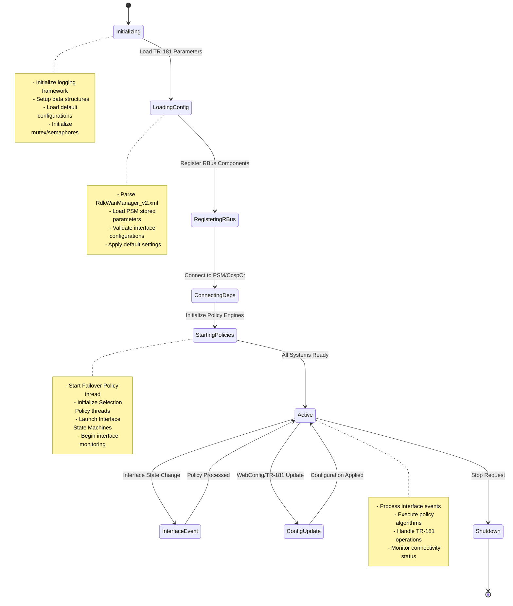
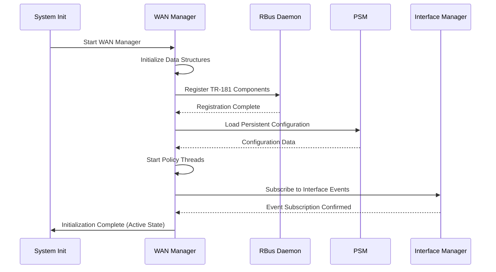
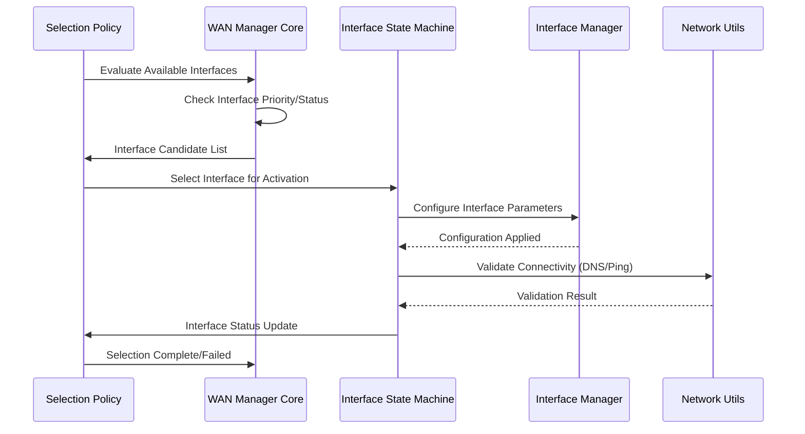
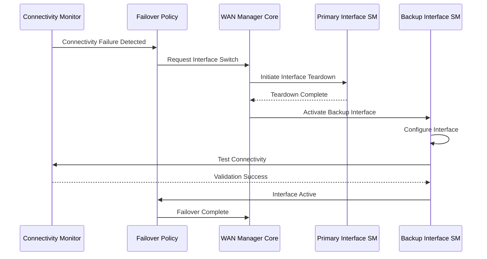
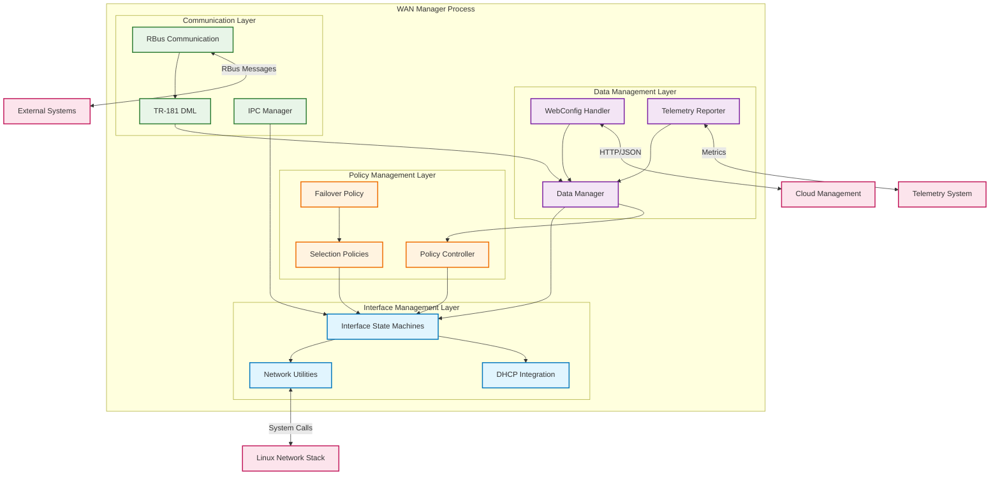
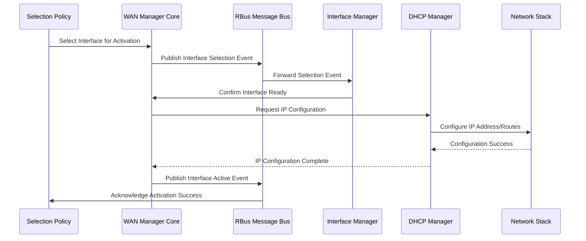
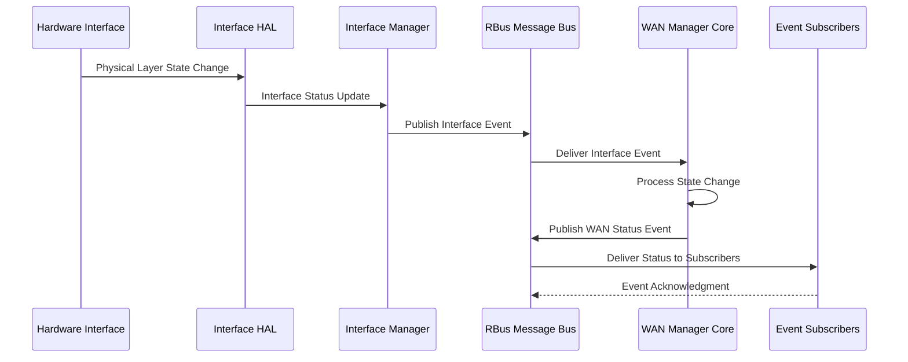

# RDK WAN Manager Documentation

RDK WAN Manager is a centralized WAN connectivity management component in the RDK-B middleware stack that orchestrates multiple WAN interface technologies and manages failover policies. It serves as the primary controller for all WAN-related operations, handling interface selection, configuration, monitoring, and automatic failover to ensure continuous internet connectivity across heterogeneous WAN technologies including Ethernet, DOCSIS, DSL, GPON, and Cellular modems.

```mermaid
flowchart TD
    subgraph "External Systems"
        Cloud[Cloud Management/HeadEnd]
        DNS[DNS Servers]
        WebUI[Web Management UI]
    end
    
    subgraph "RDK-B Gateway Device"
        subgraph "RDK-B Middleware"
            WanMgr[RDK WAN Manager]
            CcspCR[Component Registrar]
            PSM[Persistent Storage Manager]
            DM[Data Model Manager]
            VlanMgr[VLAN Manager]
            DHCPMgr[DHCP Manager]
        end
        
        subgraph "Interface Managers"
            EthMgr[Ethernet Manager]
            CellMgr[Cellular Manager]
            DocsisMgr[DOCSIS Manager]
            GPONMgr[GPON Manager]
        end
        
        subgraph "HAL Layer"
            EthHAL[Ethernet HAL]
            CellHAL[Cellular HAL]
            PlatformHAL[Platform HAL]
        end
        
        subgraph "Hardware"
            EthPort[Ethernet Ports]
            CellModem[Cellular Modem]
            CableModem[Cable Modem]
            ONT[Optical Network Terminal]
        end
    end

    %% External communications
    Cloud <-->|WebConfig/TR-069| WanMgr
    WebUI <-->|HTTP/HTTPS| WanMgr
    WanMgr <-->|DNS Queries| DNS

    %% RDK-B middleware communications
    WanMgr <-->|RBus/DBus| CcspCR
    WanMgr <-->|RBus| PSM
    WanMgr <-->|TR-181 DM| DM
    WanMgr <-->|VLAN Config| VlanMgr
    WanMgr <-->|DHCP Control| DHCPMgr

    %% Interface manager communications
    WanMgr <-->|RBus Events| EthMgr
    WanMgr <-->|RBus Events| CellMgr
    WanMgr <-->|RBus Events| DocsisMgr
    WanMgr <-->|RBus Events| GPONMgr

    %% HAL interactions
    EthMgr --> EthHAL
    CellMgr --> CellHAL
    WanMgr --> PlatformHAL

    %% Hardware connections
    EthHAL --> EthPort
    CellHAL --> CellModem
    DocsisMgr --> CableModem
    GPONMgr --> ONT

    classDef external fill:#e8f5e8,stroke:#2e7d32,stroke-width:2px;
    classDef wanmgr fill:#fff3e0,stroke:#ef6c00,stroke-width:3px;
    classDef rdkb fill:#e1f5fe,stroke:#0277bd,stroke-width:2px;
    classDef interface fill:#f3e5f5,stroke:#7b1fa2,stroke-width:2px;
    classDef hal fill:#fce4ec,stroke:#c2185b,stroke-width:2px;
    classDef hardware fill:#f1f8e9,stroke:#689f38,stroke-width:2px;

    class Cloud,DNS,WebUI external;
    class WanMgr wanmgr;
    class CcspCR,PSM,DM,VlanMgr,DHCPMgr rdkb;
    class EthMgr,CellMgr,DocsisMgr,GPONMgr interface;
    class EthHAL,CellHAL,PlatformHAL hal;
    class EthPort,CellModem,CableModem,ONT hardware;
```



**Key Features & Responsibilities**: 

- **WAN Interface Management**: Centralized management of multiple WAN interface types (Ethernet, Cellular, DOCSIS, GPON, DSL) with dynamic configuration and monitoring capabilities
- **Policy-Based Selection**: Implementation of configurable selection policies including AutoWAN, Parallel Scan, Fixed Mode, and Priority-based selection for intelligent interface selection
- **Automatic Failover**: Real-time monitoring and automatic failover between WAN interfaces based on connectivity validation and quality metrics
- **Virtual Interface Support**: Management of virtual WAN interfaces with VLAN, PPP, DHCP, and static IP configuration support
- **TR-181 Data Model**: Complete implementation of standardized TR-181 data model parameters for WAN management with RBus integration
- **WebConfig Integration**: Support for remote configuration management through WebConfig protocol for dynamic policy and interface updates
- **Connectivity Validation**: Built-in internet connectivity validation using DNS resolution and ping tests to ensure interface quality

## Design

The RDK WAN Manager employs a multi-layered architecture designed around policy-driven selection algorithms, state machine-based interface management, and event-driven coordination. The design abstracts WAN interface complexity through a unified management layer that handles diverse interface technologies while providing consistent behavior and failover capabilities. The architecture separates concerns between interface-specific operations (handled by dedicated Interface Managers) and cross-interface coordination (managed by WAN Manager policies).

The system integrates with RDK-B middleware through RBus message bus for real-time event communication and TR-181 data model compliance. Northbound interactions include WebConfig for remote management and TR-069 ACS integration, while southbound communications interface with HAL layers and platform-specific services. Data persistence is achieved through PSM (Persistent Storage Manager) integration, ensuring configuration and state information survives device reboots and maintains operational continuity.

The design implements a hierarchical policy framework where Failover Policy manages inter-group switching while Selection Policies operate within interface groups. Each WAN interface is managed by a dedicated state machine that handles the complete lifecycle from initialization through active operation to teardown, ensuring proper resource management and error recovery.

```mermaid
flowchart TD
    subgraph "RDK WAN Manager Container (Linux Process)"
        subgraph "Policy Engine"
            FP[Failover Policy Controller]
            SP1[Selection Policy - Group 1]
            SP2[Selection Policy - Group 2]
            SPn[Selection Policy - Group N]
        end
        
        subgraph "Interface State Machines"
            ISM1[Interface SM - Ethernet]
            ISM2[Interface SM - Cellular]
            ISM3[Interface SM - DOCSIS]
            ISM4[Interface SM - GPON]
        end
        
        subgraph "Core Modules"
            DC[Data Controller]
            WCC[WebConfig Client]
            TM[Telemetry Manager]
            NM[Network Utils]
        end
        
        subgraph "Communication Layer"
            RBH[RBus Handler]
            TR181[TR-181 DML APIs]
            IPC[IPC Manager]
        end
    end

    subgraph "External RDK-B Components"
        PSM[Persistent Storage Manager]
        CCR[Component Registrar]
        VLAN[VLAN Manager]
        DHCP[DHCP Manager]
        TELEMETRY[Telemetry 2.0]
    end

    subgraph "Interface Managers"
        ETH_MGR[Ethernet Manager]
        CELL_MGR[Cellular Manager]
        DOCSIS_MGR[DOCSIS Manager]
        GPON_MGR[GPON Manager]
    end

    %% Policy interactions
    FP --> SP1
    FP --> SP2
    FP --> SPn
    SP1 --> ISM1
    SP1 --> ISM2
    SP2 --> ISM3
    SP2 --> ISM4

    %% Core module interactions
    DC <--> ISM1
    DC <--> ISM2
    DC <--> ISM3
    DC <--> ISM4
    
    WCC <--> DC
    TM <--> TR181
    
    %% Communication layer
    RBH <--> TR181
    RBH <--> IPC
    TR181 <--> DC

    %% External communications
    RBH <-->|RBus| PSM
    RBH <-->|RBus| CCR
    IPC <-->|RBus Events| ETH_MGR
    IPC <-->|RBus Events| CELL_MGR
    IPC <-->|RBus Events| DOCSIS_MGR
    IPC <-->|RBus Events| GPON_MGR
    
    NM <-->|System Calls| VLAN
    NM <-->|System Calls| DHCP
    TM <-->|RBus| TELEMETRY

    classDef policy fill:#fff3e0,stroke:#ef6c00,stroke-width:2px;
    classDef statemachine fill:#e1f5fe,stroke:#0277bd,stroke-width:2px;
    classDef core fill:#f3e5f5,stroke:#7b1fa2,stroke-width:2px;
    classDef communication fill:#e8f5e8,stroke:#2e7d32,stroke-width:2px;
    classDef external fill:#fce4ec,stroke:#c2185b,stroke-width:2px;
    classDef interface fill:#f1f8e9,stroke:#689f38,stroke-width:2px;

    class FP,SP1,SP2,SPn policy;
    class ISM1,ISM2,ISM3,ISM4 statemachine;
    class DC,WCC,TM,NM core;
    class RBH,TR181,IPC communication;
    class PSM,CCR,VLAN,DHCP,TELEMETRY external;
    class ETH_MGR,CELL_MGR,DOCSIS_MGR,GPON_MGR interface;
```



### Prerequisites and Dependencies

**RDK-B Platform Requirements (MUST):**

- **DISTRO Features**: DISTRO_FEATURES += "rdk-b", "systemd", "rbus"
- **Build Dependencies**: meta-rdk-broadband layer, ccsp-common-library, rbus, halinterface
- **RDK-B Components**: CcspCr (Component Registrar), CcspPsm (Persistent Storage Manager), rbus daemon
- **HAL Dependencies**: Platform HAL interface for system operations, Ethernet HAL for interface management
- **Systemd Services**: rbus.service, CcspCr.service, CcspPsm.service must be active before WAN Manager starts
- **Hardware Requirements**: At least one WAN-capable interface (Ethernet, Cellular, DOCSIS, GPON, or DSL)

**RDK-B Integration Requirements (MUST):**

- **Message Bus**: RBus registration for Device.X_RDK_WanManager namespace and event subscriptions
- **TR-181 Data Model**: Support for Device.X_RDK_WanManager.* parameters and Interface management objects
- **Configuration Files**: RdkWanManager_v2.xml for TR-181 definitions, systemd service file for startup configuration
- **Startup Order**: Must start after rbus, CcspCr, CcspPsm, and before dependent applications requiring WAN connectivity
- **Resource Constraints**: Minimum 8MB RAM, persistent storage for configuration and state data

**Performance & Optimization (SHOULD):**

- **Enhanced Features**: DISTRO_FEATURES += "webconfig" for remote configuration support
- **Recommended Hardware**: Multiple WAN interfaces for failover capabilities, dedicated WAN processor for high-throughput environments
- **Configuration Tuning**: Optimized polling intervals, connectivity check timeouts based on network characteristics
- **Monitoring Integration**: Telemetry 2.0 integration for performance metrics and fault reporting

**RDK-B Design Limitations & Considerations:**

- **Known Limitations**: Maximum 16 interface groups supported, single active interface per group in most policies
- **Scalability Boundaries**: Up to 128 virtual interfaces, maximum 255 priority levels for interface selection
- **Platform Compatibility**: Supports RDK-B 2021.4+, ARM and x86 architectures, containerized and native deployments
- **Resource Usage**: Typical 4-8MB memory footprint, CPU usage varies with active interface count and policy complexity

**Dependent Components:**

- Ethernet Manager, Cellular Manager, DOCSIS Manager, GPON Manager depend on WAN Manager for interface coordination
- Applications requiring internet connectivity depend on WAN Manager for interface availability notifications
- Network configuration tools rely on WAN Manager for active interface information and routing table updates

**Threading Model**

- **Threading Architecture**: Multi-threaded with dedicated policy threads and shared data access synchronization
- **Main Thread**: Handles RBus message processing, TR-181 parameter operations, and system event coordination
- **Worker Threads**:
  - **Failover Policy Thread**: Manages inter-group interface selection and failover coordination
  - **Selection Policy Threads**: One thread per interface group handling intra-group interface selection (AutoWAN, Parallel Scan, Fixed Mode)
  - **Interface State Machine Threads**: Individual threads for each WAN interface managing state transitions and configuration
  - **WebConfig Thread**: Handles remote configuration processing and validation
  - **Telemetry Thread**: Manages periodic data collection and reporting to Telemetry 2.0 system
- **Synchronization**: Mutex-based protection for shared data structures, condition variables for thread coordination, atomic operations for state flags

## Component State Flow

### Initialization to Active State

The WAN Manager follows a structured initialization sequence that establishes system connectivity, registers with RDK-B middleware components, and activates policy-driven interface management. The component transitions through distinct phases ensuring all dependencies are met before beginning active WAN management operations.



### Runtime State Changes and Context Switching

The WAN Manager dynamically responds to network conditions, interface state changes, and configuration updates through event-driven state transitions. Policy engines continuously evaluate interface availability and quality to maintain optimal connectivity.

**State Change Triggers:**

- Interface physical layer state changes (up/down) from Interface Managers trigger policy re-evaluation
- Connectivity validation failures initiate automatic failover to backup interfaces
- TR-181 parameter updates or WebConfig changes cause policy reconfiguration and interface selection updates
- System events (network topology changes, DHCP lease renewals) prompt interface reassessment

**Context Switching Scenarios:**

- Policy context switches occur when interface groups change priority or availability, triggering inter-group failover
- Interface State Machine context switches handle transitions between configuration states (DHCP, Static, PPP modes)
- Configuration context switches process WebConfig updates or TR-181 parameter changes requiring interface reconfiguration

## Call Flow

### Primary Call Flows

**Initialization Call Flow:**



**Interface Selection Call Flow:**



**Failover Call Flow:**



## WAN Management Policy Types

WAN Manager implements multiple policy algorithms that control interface selection and failover behavior. Each policy type serves specific deployment scenarios and network requirements.

#### AutoWAN Policy (`wanmgr_policy_autowan_impl.c`)

**Purpose**: Sequential interface testing that automatically selects the first working interface from a prioritized list.

**Algorithm**: 
- Iterates through interfaces in priority order (highest priority first)
- Tests each interface for physical connectivity and internet validation
- Selects the first interface that passes all validation tests
- Maintains active interface until failure, then restarts selection process

**Use Cases**: Basic deployment scenarios where interface priority is predetermined and sequential selection is acceptable

**Configuration**: Interface priorities set via TR-181 parameters, validation timeout configurable

#### Parallel Scan Policy (`wanmgr_policy_parallel_scan_impl.c`)

**Purpose**: Simultaneous testing of all available interfaces to select the optimal connection based on quality metrics.

**Algorithm**:
- Initiates connectivity tests on all available interfaces simultaneously
- Evaluates interfaces based on configurable criteria (latency, throughput, reliability)
- Selects the best-performing interface from the test results
- Provides faster interface selection than sequential testing

**Use Cases**: Environments requiring optimal interface selection based on real-time performance metrics

**Configuration**: Quality thresholds, test duration, and scoring algorithms configurable through TR-181

#### Fixed Mode Policy (`wanmgr_policy_fm_impl.c`)

**Purpose**: Maintains a single designated interface as the active WAN connection without automatic switching.

**Algorithm**:
- Activates only the configured primary interface
- Monitors interface health but does not perform automatic failover
- Requires manual intervention or external control for interface changes
- Provides predictable, stable connectivity for controlled environments

**Use Cases**: Deployments requiring consistent interface usage, testing scenarios, or environments with external failover management

**Configuration**: Fixed interface selection via TR-181 parameter configuration

#### Priority Policy (`wanmgr_policy_pp_impl.c`)

**Purpose**: Maintains strict interface priority ordering with automatic failover and restoration capabilities.

**Algorithm**:
- Continuously monitors all interfaces in priority order
- Automatically fails over to the highest priority available interface
- Implements restoration logic to return to higher priority interfaces when they recover
- Provides deterministic failover behavior based on configured priorities

**Use Cases**: Enterprise deployments requiring predictable failover patterns with clear interface hierarchy

**Configuration**: Interface priorities, restoration delays, and validation parameters via TR-181

#### Priority with Override Bridge Policy (`wanmgr_policy_ppob_impl.c`)

**Purpose**: Extends Priority Policy with LAN bridge integration during interface transitions.

**Algorithm**:
- Implements Priority Policy interface selection logic
- Temporarily bridges interfaces to LAN during failover transitions to maintain connectivity
- Manages bridge configuration and removal after successful interface transitions
- Provides seamless connectivity during interface switching

**Use Cases**: Environments requiring uninterrupted LAN connectivity during WAN interface transitions

#### Fixed Mode with Override Bridge Policy (`wanmgr_policy_fmob_impl.c`)

**Purpose**: Combines Fixed Mode operation with LAN bridge integration for enhanced connectivity assurance.

**Algorithm**:
- Maintains fixed interface operation with bridge fallback capabilities
- Activates LAN bridge when primary fixed interface fails
- Provides connectivity preservation without automatic interface switching
- Supports manual intervention while maintaining service availability

**Use Cases**: Fixed interface deployments requiring emergency connectivity preservation

## TR‑181 Data Models

### Supported TR-181 Parameters

The WAN Manager implements a comprehensive TR-181 data model following BBF specifications with custom RDK extensions for advanced WAN management capabilities. The implementation supports both standard TR-181 objects and RDK-specific extensions for enhanced functionality.

#### Object Hierarchy

```
Device.
└── X_RDK_WanManager.
    ├── Enable (boolean, R/W)
    ├── Version (string, R)
    ├── Data (string, R/W)
    ├── AllowRemoteInterfaces (boolean, R/W)
    ├── ResetDefaultConfig (boolean, R/W)
    ├── RestorationDelay (uint32, R/W)
    ├── WanFailoverData (string, R/W)
    ├── DnsConnectivityCheck.
    │   └── Enable (boolean, R/W)
    ├── CPEInterface.{i}.
    │   ├── Enable (boolean, R/W)
    │   ├── Name (string, R/W)
    │   ├── Type (string, R/W)
    │   ├── DisplayName (string, R/W)
    │   ├── Group (uint32, R/W)
    │   ├── Priority (uint32, R/W)
    │   ├── Selection (boolean, R/W)
    │   ├── Status (string, R)
    │   ├── MonitorOperStatus (boolean, R/W)
    │   ├── BaseInterface (string, R/W)
    │   ├── Marking.
    │   │   ├── SKBPort (int32, R/W)
    │   │   └── DSCPMark (int32, R/W)
    │   └── VirtualInterface.{i}.
    │       ├── Enable (boolean, R/W)
    │       ├── Name (string, R/W)
    │       ├── Alias (string, R/W)
    │       ├── Status (string, R)
    │       ├── EnableMAPT (boolean, R/W)
    │       ├── EnableDSLite (boolean, R/W)
    │       ├── EnableIPoEHealthCheck (boolean, R/W)
    │       ├── Timeout (uint32, R/W)
    │       ├── Reset (boolean, R/W)
    │       ├── IP.
    │       │   ├── Mode (string, R/W)
    │       │   ├── PreferredMode (string, R/W)
    │       │   ├── IPv4Source (string, R/W)
    │       │   ├── IPv6Source (string, R/W)
    │       │   ├── IPv4Status (string, R)
    │       │   ├── IPv6Status (string, R)
    │       │   └── Interface (string, R/W)
    │       ├── PPP.
    │       │   ├── Enable (boolean, R/W)
    │       │   ├── Username (string, R/W)
    │       │   ├── Password (string, R/W)
    │       │   └── AuthenticationProtocol (string, R/W)
    │       └── VLAN.
    │           ├── Enable (boolean, R/W)
    │           ├── VLANID (int32, R/W)
    │           ├── Priority (int32, R/W)
    │           └── Alias (string, R/W)
```

#### Parameter Definitions

**Core Parameters:**

| Parameter Path | Data Type | Access | Default Value | Description | BBF Compliance |
|----------------|-----------|--------|---------------|-------------|----------------|
| `Device.X_RDK_WanManager.Enable` | boolean | R/W | `true` | Master enable/disable control for WAN Manager functionality. When false, all WAN management operations are suspended and interfaces remain in their current state. | RDK Extension |
| `Device.X_RDK_WanManager.Version` | string | R | `"2.0"` | Version string identifying the WAN Manager implementation and supported feature set. Read-only parameter for capability detection. | RDK Extension |
| `Device.X_RDK_WanManager.Data` | string | R/W | `""` | JSON-formatted configuration data for advanced WAN Manager settings including policy parameters, validation thresholds, and custom behavioral configurations. | RDK Extension |
| `Device.X_RDK_WanManager.AllowRemoteInterfaces` | boolean | R/W | `false` | Controls whether WAN Manager accepts interface management requests from remote systems. When enabled, allows external controllers to influence interface selection decisions. | RDK Extension |
| `Device.X_RDK_WanManager.RestorationDelay` | uint32 | R/W | `30` | Time delay in seconds before attempting to restore a higher priority interface after it becomes available. Prevents flapping in unstable network conditions. | RDK Extension |
| `Device.X_RDK_WanManager.CPEInterface.{i}.Enable` | boolean | R/W | `true` | Per-interface enable control allowing individual interfaces to be excluded from WAN Manager control while maintaining configuration persistence. | RDK Extension |
| `Device.X_RDK_WanManager.CPEInterface.{i}.Type` | string | R/W | `"REMOTE_INTERFACE"` | Interface technology type identifier. Enumerated values: REMOTE_INTERFACE, ETHERNET_INTERFACE, CELLULAR_INTERFACE, DOCSIS_INTERFACE. Used for policy-specific handling. | RDK Extension |
| `Device.X_RDK_WanManager.CPEInterface.{i}.Priority` | uint32 | R/W | `1` | Interface selection priority value (1-255, where 1 is highest priority). Used by priority-based selection policies to determine interface preference order. | RDK Extension |

**Virtual Interface Parameters:**

| Parameter Path | Data Type | Access | Default Value | Description | BBF Compliance |
|----------------|-----------|--------|---------------|-------------|----------------|
| `Device.X_RDK_WanManager.CPEInterface.{i}.VirtualInterface.{i}.IP.Mode` | string | R/W | `"Dual Stack"` | IP configuration mode for the virtual interface. Enumerated values: "IPv4 Only", "IPv6 Only", "Dual Stack", "No IP". Determines IP stack configuration behavior. | RDK Extension |
| `Device.X_RDK_WanManager.CPEInterface.{i}.VirtualInterface.{i}.IP.IPv4Source` | string | R/W | `"DHCP"` | IPv4 address assignment method. Enumerated values: "Static", "DHCP", "PPP". Controls how IPv4 addressing is configured on the interface. | RDK Extension |
| `Device.X_RDK_WanManager.CPEInterface.{i}.VirtualInterface.{i}.EnableMAPT` | boolean | R/W | `false` | Enable MAP-T (Mapping of Address and Port with Translation) for IPv4-over-IPv6 connectivity. Requires IPv6 transport and MAP-T domain configuration. | RDK Extension |
| `Device.X_RDK_WanManager.CPEInterface.{i}.VirtualInterface.{i}.VLAN.VLANID` | int32 | R/W | `-1` | VLAN identifier for tagged traffic (1-4094). Value -1 indicates untagged operation. Used for VLAN-aware interface configuration. | RDK Extension |

**Custom Extensions:**

- **Failover Data Management**: Custom JSON-based failover configuration allowing complex policy definitions beyond standard TR-181 capabilities
- **DNS Connectivity Validation**: Enhanced connectivity testing using DNS resolution validation in addition to standard reachability tests
- **Interface Marking Support**: Custom packet marking capabilities for QoS and traffic engineering applications
- **Remote Interface Control**: Extension allowing external systems to participate in interface selection decisions through standardized APIs

### Parameter Registration and Access

- **Implemented Parameters**: WAN Manager implements 150+ TR-181 parameters covering interface configuration, policy settings, status reporting, and advanced features including IPv6 transition technologies and VLAN support
- **Parameter Registration**: Parameters are registered via RBus message bus using the Device.X_RDK_WanManager namespace with automatic data model validation and type checking
- **Access Mechanism**: Other RDK-B components access parameters through RBus method calls with JSON-formatted data exchange and event-based notifications for parameter changes
- **Validation Rules**: Comprehensive validation including range checking for numeric parameters, enumeration validation for string parameters, dependency validation between related parameters, and consistency checking across interface configurations

## Internal Modules

The WAN Manager architecture is organized into specialized modules that handle distinct aspects of WAN connectivity management, from policy execution to low-level interface configuration.

| Module/Class | Description | Key Files |
|-------------|------------|-----------|
| **Policy Controller** | Implements policy-specific algorithms for interface selection including AutoWAN, Parallel Scan, Fixed Mode, and Priority-based selection | `wanmgr_policy_*.c`, `wanmgr_controller.h` |
| **Interface State Machine** | Manages complete interface lifecycle from initialization through configuration to teardown with support for multiple IP configuration modes | `wanmgr_interface_sm.c`, `wanmgr_interface_sm.h` |
| **Data Manager** | Provides centralized data access, configuration management, and persistent storage integration with thread-safe data structures | `wanmgr_data.c`, `wanmgr_data.h` |
| **RBus Communication** | Handles all RBus message processing, event subscriptions, and TR-181 parameter operations with automatic data validation | `wanmgr_ssp_messagebus_interface.c`, `wanmgr_dml_*.c` |
| **Network Utilities** | Implements low-level network operations including interface configuration, routing table management, and connectivity validation | `wanmgr_net_utils.c`, `wanmgr_net_utils.h` |
| **WebConfig Handler** | Processes remote configuration updates from cloud management systems with validation and rollback capabilities | `wanmgr_webconfig.c`, `wanmgr_webconfig_apis.c` |
| **Telemetry Reporter** | Collects and reports operational metrics, interface statistics, and performance data to Telemetry 2.0 system | `wanmgr_telemetry.c`, `wanmgr_t2_telemetry.c` |
| **DHCP Integration** | Manages DHCP client operations for IPv4 and IPv6 including lease management and renewal handling | `wanmgr_dhcpv4_*.c`, `wanmgr_dhcpv6_*.c` |



## Component Interactions & IPC Mechanisms

### System Architecture Overview

WAN Manager operates as a central coordinator in the RDK-B ecosystem, interfacing with multiple middleware components through RBus messaging for configuration management, with Interface Managers for physical layer control, and with system services for network configuration. The component publishes interface status events, processes configuration updates from WebConfig, and coordinates with VLAN and DHCP managers for complete network stack management.

```mermaid
flowchart TD
    subgraph "Cloud/Remote Systems"
        ACS[TR-069 ACS]
        CloudMgmt[Cloud Management Platform]
        WebUI[Management Web Interface]
    end
    
    subgraph "RDK-B WAN Manager"
        WanCore[WAN Manager Core]
        Policies[Policy Engines]
        StateMachines[Interface State Machines]
    end
    
    subgraph "RDK-B Middleware"
        PSM[Persistent Storage Manager]
        CcspCr[Component Registrar]
        VlanMgr[VLAN Manager] 
        DHCPMgr[DHCP Manager]
        Telemetry[Telemetry 2.0]
    end
    
    subgraph "Interface Management"
        EthMgr[Ethernet Manager]
        CellMgr[Cellular Manager]
        DocsisMgr[DOCSIS Manager]
        GPONMgr[GPON Manager]
    end
    
    subgraph "System Services"
        SysEvent[System Event Daemon]
        NetworkStack[Linux Network Stack]
        DHCPClient[DHCP Clients]
    end

    %% Remote system interactions
    ACS <-->|TR-069/CWMP| WanCore
    CloudMgmt <-->|WebConfig/HTTPS| WanCore
    WebUI <-->|HTTP/REST| WanCore

    %% RDK-B middleware interactions  
    WanCore <-->|RBus/JSON| PSM
    WanCore <-->|RBus/Registration| CcspCr
    WanCore <-->|RBus/Config| VlanMgr
    WanCore <-->|RBus/Control| DHCPMgr
    WanCore <-->|RBus/Metrics| Telemetry

    %% Interface manager interactions
    WanCore <-->|RBus/Events| EthMgr
    WanCore <-->|RBus/Events| CellMgr
    WanCore <-->|RBus/Events| DocsisMgr
    WanCore <-->|RBus/Events| GPONMgr

    %% System service interactions
    WanCore <-->|SysEvents| SysEvent
    StateMachines <-->|Netlink/ioctl| NetworkStack
    StateMachines <-->|IPC/Signals| DHCPClient

    classDef remote fill:#e8f5e8,stroke:#2e7d32,stroke-width:2px;
    classDef wanmgr fill:#fff3e0,stroke:#ef6c00,stroke-width:3px;
    classDef middleware fill:#e1f5fe,stroke:#0277bd,stroke-width:2px;
    classDef interface fill:#f3e5f5,stroke:#7b1fa2,stroke-width:2px;
    classDef system fill:#fce4ec,stroke:#c2185b,stroke-width:2px;

    class ACS,CloudMgmt,WebUI remote;
    class WanCore,Policies,StateMachines wanmgr;
    class PSM,CcspCr,VlanMgr,DHCPMgr,Telemetry middleware;
    class EthMgr,CellMgr,DocsisMgr,GPONMgr interface;
    class SysEvent,NetworkStack,DHCPClient system;
```



### Detailed Interaction Matrix

| Target Component/Layer | Interaction Purpose | IPC Mechanism | Message Format | Communication Pattern | Key APIs/Endpoints |
|------------------------|-------------------|---------------|----------------|---------------------|------------------|
| **RDK-B Middleware Components** |
| CcspCr (Component Registrar) | Component registration and discovery, namespace management | RBus Method Calls | JSON-RPC | Request-Response | `registerComponent()`, `discoverComponent()` |
| CcspPsm (Persistent Storage) | Configuration persistence, parameter storage, system state | RBus Method Calls | JSON Key-Value | Request-Response | `PSM_Get_Record_Value2()`, `PSM_Set_Record_Value2()` |
| VLAN Manager | VLAN configuration, tagged interface creation, bridge management | RBus Method Calls | JSON Config Objects | Request-Response | `Device.Ethernet.VLANTermination.{i}.*` |
| DHCP Manager | DHCP client lifecycle, lease management, IP address assignment | RBus Events + Method Calls | JSON Configuration | Pub-Sub + RPC | `Device.DHCPv4.Client.{i}.*`, `dhcpv4c_get_ert_lease()` |
| Telemetry 2.0 | Performance metrics reporting, fault telemetry, usage statistics | RBus Events | T2 Event Format | Pub-Sub | `WAN_INTERFACE_ACTIVE`, `WAN_FAILOVER_EVENT` |
| **System & HAL Layers** |
| Linux Network Stack | Interface configuration, routing table updates, network namespace management | Netlink Sockets + ioctl | Binary Netlink Messages | Asynchronous | `RTM_NEWADDR`, `RTM_NEWROUTE`, `SIOCGIFFLAGS` |
| System Event Daemon | System-wide event coordination, service state changes | Named Pipes + Shared Memory | Text-based Events | Pub-Sub | `sysevent_set()`, `sysevent_get()`, `wan-status` |
| Platform HAL | Hardware abstraction for platform-specific operations | Direct Function Calls | C Structures | Synchronous | `platform_hal_GetFactoryResetCount()`, `platform_hal_SetLED()` |
| **Interface Management Layer** |
| Ethernet Manager | Physical interface state monitoring, cable detection, link status | RBus Events | JSON Status Objects | Event-driven | `Device.Ethernet.Interface.{i}.Status`, `eth_hal_getAssociatedDevice()` |
| Cellular Manager | Cellular modem control, signal quality monitoring, PDP context management | RBus Events + Method Calls | JSON + Binary Data | Hybrid | `Device.Cellular.Interface.{i}.*`, `cellular_hal_get_signal_info()` |
| DOCSIS Manager | Cable modem status, downstream/upstream channel monitoring | RBus Events | JSON Status Reports | Event-driven | `Device.X_CISCO_COM_CableModem.*` |
| GPON Manager | Optical network terminal status, ONT registration state | RBus Events | JSON Status Objects | Event-driven | `Device.Optical.Interface.{i}.*` |
| **External Systems** |
| TR-069 ACS | Remote device management, parameter configuration, firmware updates | HTTP/HTTPS SOAP | XML CWMP Messages | Request-Response | `GetParameterValues`, `SetParameterValues`, `AddObject` |
| WebConfig Cloud Service | Bulk configuration updates, policy deployment | HTTPS REST | JSON Configuration Blobs | Pull-based Polling | `GET /api/v1/device/{mac}/config`, `POST /api/v1/device/config` |
| Management Web UI | Real-time status monitoring, manual configuration | HTTP/HTTPS REST | JSON API Responses | Request-Response | `GET /api/wan/status`, `PUT /api/wan/interface/{id}/config` |

### Event Publishing & Subscription

**Events Published by WAN Manager:**

| Event Name | Event Topic/Path | Trigger Condition | Payload Format | Subscriber Components |
|------------|-----------------|-------------------|----------------|---------------------|
| `WAN_INTERFACE_ACTIVE` | `Device.X_RDK_WanManager.InterfaceActiveEvent` | Interface becomes active and passes connectivity validation | JSON: `{interface_name, type, ip_address, timestamp, validation_method}` | Applications requiring internet connectivity, Telemetry system, Management UI |
| `WAN_INTERFACE_DOWN` | `Device.X_RDK_WanManager.InterfaceDownEvent` | Active interface loses connectivity or becomes unavailable | JSON: `{interface_name, reason, timestamp, backup_available}` | Dependent applications, Monitoring systems, Cloud management |
| `WAN_FAILOVER_EVENT` | `Device.X_RDK_WanManager.FailoverEvent` | Automatic failover between interfaces occurs | JSON: `{from_interface, to_interface, reason, policy_type, timestamp}` | Network monitoring, Telemetry 2.0, Management systems |
| `WAN_CONFIG_CHANGED` | `Device.X_RDK_WanManager.ConfigChangeEvent` | WAN Manager configuration parameters are modified | JSON: `{parameter_name, old_value, new_value, source, timestamp}` | Configuration management, Audit systems |

**Events Consumed by WAN Manager:**

| Event Source | Event Topic/Path | Purpose | Expected Payload | Handler Function |
|-------------|-----------------|---------|------------------|------------------|
| Interface Managers | `Device.{Technology}.Interface.{i}.StatusChange` | React to physical interface state changes | JSON: `{interface_id, status, link_speed, duplex_mode}` | `WanMgr_HandleInterfaceStatusChange()` |
| DHCP Manager | `Device.DHCPv4.Client.{i}.LeaseEvent` | Process DHCP lease acquisition or renewal | JSON: `{client_id, ip_address, lease_time, gateway, dns_servers}` | `WanMgr_HandleDHCPLeaseEvent()` |
| WebConfig Service | `Device.X_RDK_WebConfig.ConfigUpdate` | Apply remote configuration changes | JSON: `{config_version, parameters, validation_token}` | `WanMgr_ProcessWebConfigUpdate()` |
| System Event Daemon | `wan-restart` | Handle system-initiated WAN restart requests | Text: `restart_reason` | `WanMgr_HandleSystemRestartEvent()` |

### IPC Flow Patterns

**Primary IPC Flow - Interface Activation:**



**Event Notification Flow:**



## Implementation Details

### Major HAL APIs Integration

WAN Manager integrates with multiple HAL interfaces to manage diverse WAN technologies and perform platform-specific operations. The HAL integration provides hardware abstraction while enabling technology-specific optimizations.

**Core HAL APIs:**

| HAL API | Purpose | Parameters | Return Values | Implementation File |
|---------|---------|------------|---------------|-------------------|
| `platform_hal_GetFactoryResetCount` | Retrieve system factory reset counter for configuration validation | `pulValue` (output counter) | `RETURN_OK/RETURN_ERR` | `wanmgr_platform_events.h` |
| `platform_hal_SetLED` | Control platform LED indicators for interface status display | `LedColor`, `State`, `Interval` | `RETURN_OK/RETURN_ERR` | `wanmgr_controller.c` |
| `ethernet_hal_getAssociatedDevice` | Query ethernet interface association and capability information | `interface_name`, `device_info` (output) | `RETURN_OK/RETURN_ERR` | `wanmgr_net_utils.c` |
| `cellular_hal_get_signal_info` | Retrieve cellular signal strength and quality metrics | `interface_id`, `signal_data` (output) | `RETURN_OK/RETURN_ERR` | Policy validation logic |
| `docsis_hal_GetDOCSISInfo` | Access cable modem operational parameters and channel information | `docsis_info` (output structure) | `RETURN_OK/RETURN_ERR` | Interface validation |

### Key Implementation Logic

- **State Machine Engine**: Core state machine implementation in `wanmgr_interface_sm.c` manages interface lifecycle with states including DISABLED, STANDBY, CONFIGURING, VALIDATING, and ACTIVE. State transition handlers in `wanmgr_interface_sm.h` define valid transitions and trigger appropriate configuration actions based on interface type and policy requirements.
  
- **Event Processing**: Hardware events are processed through RBus message handlers that map physical layer notifications to state machine inputs. The event processing pipeline includes event filtering, validation, and routing to appropriate policy engines or interface state machines based on interface group configuration.

- **Error Handling Strategy**: Multi-level error handling includes HAL error code mapping to standardized WAN Manager error states, automatic retry logic with exponential backoff for transient failures, timeout handling for configuration operations, and comprehensive logging with error correlation for troubleshooting support.

- **Logging & Debugging**: State transition logging captures all interface state changes with timestamps and triggering conditions. Debug logging includes policy decision rationale, connectivity validation details, and performance metrics. Integration with RDK Logger provides configurable verbosity levels and category-based filtering for focused debugging.

## Key Configuration Files

WAN Manager utilizes multiple configuration files for TR-181 data model definitions, runtime parameters, and integration with the RDK-B system. These files define the component's operational parameters and integration points.

| Configuration File | Purpose | Key Parameters | Default Values | Override Mechanisms |
|--------------------|---------|---------------|----------------|--------------------|
| `RdkWanManager_v2.xml` | TR-181 data model definitions and DML API mappings | Object hierarchy, parameter types, access permissions, function mappings | Per-parameter defaults defined in XML schema | WebConfig updates, TR-069 parameter operations |
| `wanmanager.service` | Systemd service configuration for WAN Manager daemon | Service dependencies, startup ordering, resource limits | `After=rbus.service CcspCr.service`, `Type=forking` | Systemd override files, runtime service modifications |
| `rdkwanmanager.conf` | Runtime configuration parameters and policy settings | Interface priorities, validation timeouts, policy selection | `INTERFACE_TIMEOUT=30`, `CONNECTIVITY_CHECK=DNS` | Environment variables, command-line arguments |
| `wanmanager_webconfig.json` | WebConfig parameter mappings and validation rules | Parameter validation schemas, transformation rules | Vendor-specific parameter mappings | Remote WebConfig updates from cloud management |
| `wanmanager_telemetry.conf` | Telemetry 2.0 marker definitions and reporting configuration | T2 event markers, reporting intervals, metric thresholds | Standard RDK-B T2 markers for WAN events | T2 configuration updates, runtime marker registration |

The configuration system supports hierarchical parameter resolution with precedence order: WebConfig remote updates > Local file overrides > Compiled defaults. All configuration changes trigger validation and may require service restart for certain parameters to take effect.
