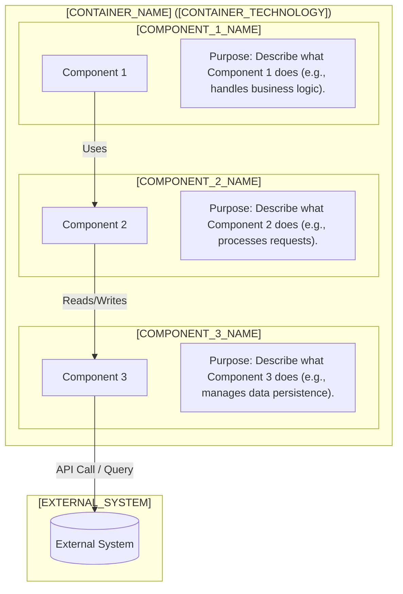
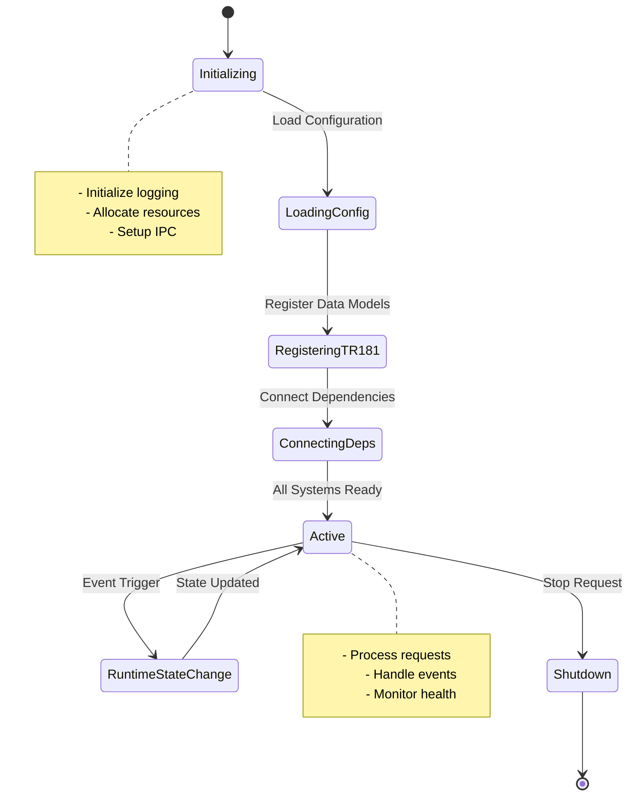
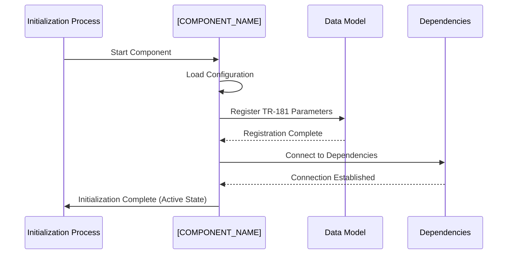
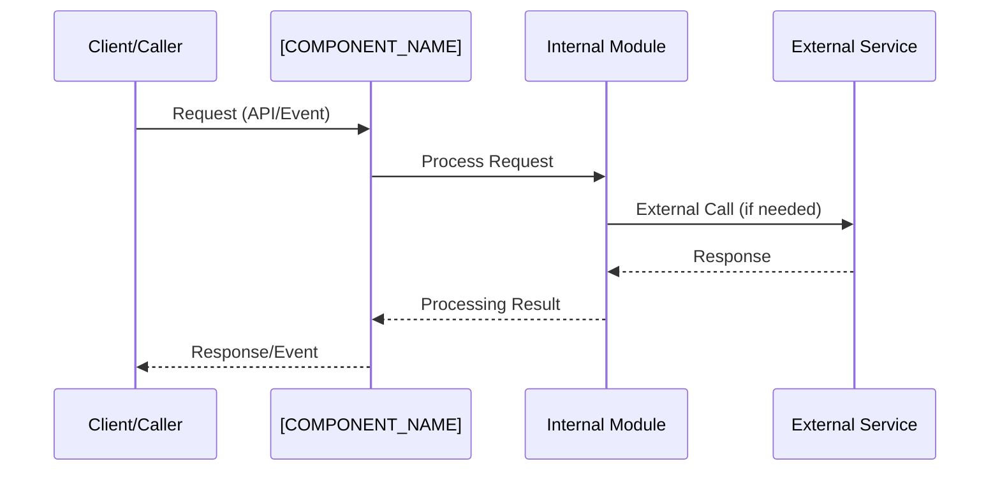
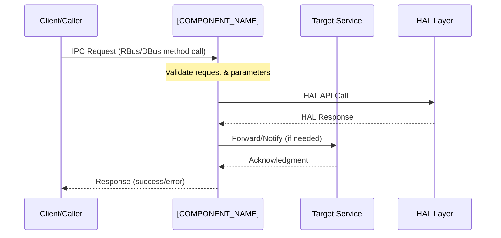
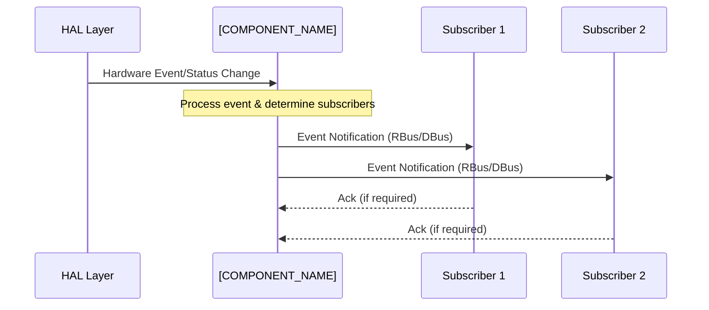

# [COMPONENT_NAME] Documentation

[Describe in detail of the functionality served by this component in RDK middleware. This information can be split into 3 different sections. The first section can provide an overview on this component, the second section can tell on the services it provides to the end product/stack as a device, and the last section can explain the services provided by this module in a module level]

[Add a C4 System Context Diagram to explain the position of this component in the whole RDK-B architecture. Explain the components in high level especially the software systems . Possible components are External systems(which might be a remote management component or web ui or a firmware upgrade server etc. ), this component, other RDK-B components in RDK-B middleware, HAL/physical layer/OS layer ].

**Key Features & Responsibilities**: 

[List major functions, services provided, and responsibilities. Keep it as a bullet point list. Keep the main point as BOLD text formatting and then explain in a sentence or maximum two on what that point is about]

- **[FEATURE_1]**: [Brief description of what this feature provides and why it's important] 
- **[FEATURE_2]**: [Brief description of what this feature provides and why it's important] 
- **[FEATURE_3]**: [Brief description of what this feature provides and why it's important] 


## Design

[Explain the design principles of the component in a detailed way. This can be in two sections. The first section can have an overview of design principles in a paragraph of 5-6 sentences. After that, deep dive into  how the design of the system meets the requirements/features in an optimal way.] 
[Explain how the interactions with other layers - the north bound and south bound - are taken care in the design]
[Explain how the IPC mechanisms are integrated in the design - possible rbus or dbus.]
[Explain the data persistance, storage management etc, achieved for this component - either within itself or via other designated RDK-B or system components]

[Add a C4 Component Diagram with a text like - A Component diagram showing the component's internal structure and dependencies is given below:. The starting point of this diagram will be the context diagram created above, with the part of this specific component being expanded. The main components will have to cover the message bus registration(rbus or dbus or both), telemetry, persistant data set/get, get/set data from/to HAL, as well as various other components as the case may be]



### Prerequisites and Dependencies

[Explore the files in this workspace - for e.g. systemd service file, yocto recipes, build scripts - to identify component dependencies and requirements]

**RDK-B Platform Requirements (MUST):** 

- **DISTRO Features**: [List required DISTRO flags that must be enabled, e.g., DISTRO_FEATURES += "rdk-b", "cellular"] 
- **Build Dependencies**: [Required yocto layers, recipes, and build-time dependencies] 
- **RDK-B Components**: [Mandatory RDK-B middleware components that must be present and running] 
- **HAL Dependencies**: [Required HAL interfaces and minimum versions] 
- **Systemd Services**: [systemd services that must be active before this component starts] 
- **Hardware Requirements**: [Specific hardware capabilities or interfaces required] 

**RDK-B Integration Requirements (MUST):** 

- **Message Bus**: [RBus/DBus registration requirements and namespace reservations] 
- **TR-181 Data Model**: [Required TR-181 objects and parameter support from other components] 
- **Configuration Files**: [Mandatory configuration files and their expected locations] 
- **Startup Order**: [Components that must initialize before this component can start] 
- **Resource Constraints**: [Memory, CPU, or storage minimum requirements] 

**Performance & Optimization (SHOULD):** 

- **Enhanced Features**: [Optional DISTRO features for improved performance] 
- **Recommended Hardware**: [Hardware capabilities that improve performance] 
- **Configuration Tuning**: [Recommended configuration parameters for optimal performance] 
- **Monitoring Integration**: [Optional telemetry and logging enhancements] 

**RDK-B Design Limitations & Considerations:** 

- **Known Limitations**: [Current design limitations or constraints] 
- **Scalability Boundaries**: [Maximum supported connections, devices, or throughput] 
- **Platform Compatibility**: [Supported RDK-B versions, architectures, or device types] 
- **Resource Usage**: [Expected memory footprint, CPU usage patterns] 

**Dependent Components:** 

- [List RDK-B components that depend on this component] 
- [Explain the nature of dependency and what would break without this component] 
- [Include startup sequence implications if this component fails] 

**Threading Model** 

[Provide details only if applicable to this component.]
[Explain this section with both paragraph and bulleted points with category wherever required as per the concept]

- [Explain how concurrency is handled, including thread pools, event loops, or asynchronous paradigms. If it is a single threaded model, mention it is a single threaded application. If worker threads are created and closed on demand, call out that separately. If it is multi threaded model, mention what each threads does in a bullet pointed list] 
- **Threading Architecture**: [Single-threaded/Multi-threaded/Event-driven] 
- **Main Thread**: [Describe main thread responsibilities] 
- **Worker Threads** (if applicable): 
  - [Thread 1]: [Purpose and responsibilities]   
  - [Thread 2]: [Purpose and responsibilities] 
- **Synchronization**: [Describe synchronization mechanisms used] 

### Component State Flow

** Initialization to Active State **

[Describe the component's lifecycle from initialization to active state. Include key milestones, state transitions, and critical initialization steps.]



** Runtime State Changes and Context Switching **

[Explain any runtime state changes or context switching that happens during normal operation. Include triggers, conditions, and impact on functionality.]

**State Change Triggers:**
- [List events or conditions that trigger state changes]
- [Explain the impact of each state change]
- [Describe recovery mechanisms if applicable]

**Context Switching Scenarios:**
- [Describe scenarios where the component switches operational context]
- [Include failover, configuration updates, or mode changes]

### Call Flow

**Initialization Call Flow:**


**Request Processing Call Flow:**

[Describe the most critical flow supported by the component with mermaid-based sequence diagrams]



## TR‑181 Data Models

### Supported TR-181 Parameters

[Following BBF specification style, describe the TR-181 parameters supported by this component. Include object hierarchy, parameter definitions, and compliance notes following how BBF spec explains the TR-181 parameters.]

### Object Hierarchy

```
Device.
└── [COMPONENT_NAMESPACE].
    ├── Enable (boolean, R/W)
    ├── Status (string, R)
    ├── [OBJECT_1].{i}.
    │   ├── Param1 (datatype, access)
    │   └── Param2 (datatype, access)
    └── [OBJECT_2].
        ├── ParamA (datatype, access)
        └── ParamB (datatype, access)
```

### Parameter Definitions

**Core Parameters:**

[Include all the parameters that are part of the 'Implemented Parameters' section with BBF-style descriptions]

| Parameter Path | Data Type | Access | Default Value | Description | BBF Compliance |
|----------------|-----------|--------|---------------|-------------|----------------|
| `Device.[NAMESPACE].Enable` | boolean | R/W | `true` | [Detailed description as per BBF style including valid values, constraints, and behavior] | TR-181 Issue 2 |
| `Device.[NAMESPACE].Status` | string | R | `"Disabled"` | [Detailed description with enumerated values: Disabled, Enabled, Error] | TR-181 Issue 2 |
| `Device.[NAMESPACE].[OBJECT].{i}.Param1` | [type] | [R/W] | `[default]` | [BBF-style parameter description with validation rules] | [Standard/Custom] |

**Custom Extensions:**

[Detail any custom TR‑181 objects or parameters not defined in BBF specifications. Give one sentence each on what is the custom extension about]

- **[Custom Parameter 1]**: [One sentence explanation of the custom extension and its purpose]
- **[Custom Parameter 2]**: [One sentence explanation of the custom extension and its purpose]

### Parameter Registration and Access

- **Implemented Parameters**: [List TR‑181 parameters implemented by this component. Include descriptions and default values.]
- **Parameter Registration**: [Explain how parameters are registered and accessed. Use RBus where it's supported/accepted by the component and platform. Use DBus for components that don't support RBus yet.]
- **Access Mechanism**: [Describe how other components access these parameters via the chosen IPC mechanism]
- **Validation Rules**: [Explain any validation or constraints applied to parameter values]


## Internal Modules

[Explain what each module within the component is expected to do. If any of those modules are receiveing data from outside, call that out separately]

| Module/Class | Description | Key Files |
|-------------|------------|-----------|
| [MODULE_1] | [Description of module’s role in a few sentences] | `[file1.c]`, `[file2.h]` |
| [MODULE_2] | [Description of module’s role in a few sentences] | `[file3.cpp]` |

[Create a simple  mermaid based module breakdown diagram explaining the different sub modules in this component]
```mermaid
flowchart TD
    subgraph [COMPONENT_NAME]
        Mod1([MODULE_1])
        Mod2([MODULE_2])
        Mod3([MODULE_3])
    end
    Mod1 --> Mod2
    Mod2 --> Mod3
```

## Component Interactions

[Explain the interactions this component has with external modules, including data model calls, telemetry event postings, HAL interactions, and external service communications.]

```mermaid
flowchart TD
    subgraph "External Services"
        Ext1[External Service 1]
        Ext2[External Service 2]
    end
    
    subgraph "Middleware Layer"
        [COMPONENT_NAME]
        RDKB1[RDKB_COMPONENT_1]
        RDKB2[RDKB_COMPONENT_2]
    end
    
    subgraph "HAL/Platform Layer"
        HAL[(HAL Layer)]
        Platform[(Platform Services)]
    end

    [COMPONENT_NAME] -->|DBus/RBus| RDKB1
    [COMPONENT_NAME] -->|HTTP POST /upload| RDKB2
    [COMPONENT_NAME] -->|API Calls| HAL
    [COMPONENT_NAME] -->|Sockets| Platform
    [COMPONENT_NAME] -->|Protocol| Ext1
```

### Interaction Matrix

[This consolidated table should provide component interactions with their IPC mechanisms, message formats, and purposes to eliminate redundancy]

| Target Component/Layer | Interaction Purpose | IPC Mechanism | Message Format | Communication Pattern | Key APIs/Endpoints |
|------------------------|-------------------|---------------|----------------|---------------------|------------------|
| **RDK-B Middleware Components** |
| [RDKB_COMPONENT_1] | [Purpose: e.g., Configuration management, event notifications] | RBus/DBus | JSON/Binary | Request-Response/Pub-Sub | `[method_name]`, `[event_topic]` |
| [RDKB_COMPONENT_2] | [Purpose: e.g., Data synchronization, status reporting] | Unix Sockets/Shared Memory | Custom Binary/JSON | Asynchronous/Streaming | `[socket_path]`, `[shared_mem_key]` |
| **System & HAL Layers** |
| HAL Layer | [Purpose: e.g., Hardware control, status monitoring] | Direct API Calls | C Structures | Synchronous Function Calls | `[hal_function_1]()`, `[hal_function_2]()` |
| Platform Services | [Purpose: e.g., System integration, resource management] | System Calls/Files | Configuration Files/Proc | File I/O/ioctl | `[config_path]`, `[proc_interface]` |
| **External Systems** |
| Cloud/HeadEnd/BackOffice | [Purpose: e.g., Remote management, data upload] | HTTP/HTTPS/Protocol | JSON/XML/Binary | RESTful/Custom Protocol | `POST /api/v1/[endpoint]` |

**Events Published by [COMPONENT_NAME]:**

| Event Name | Event Topic/Path | Trigger Condition | Payload Format | Subscriber Components |
|------------|-----------------|-------------------|----------------|---------------------|
| [Event_1] | `[topic/path]` | [Condition: e.g., initialization complete] | JSON: `{status, timestamp, data}` | [List of subscriber components] |
| [Event_2] | `[topic/path]` | [Condition: e.g., error detected] | JSON: `{error_code, message, context}` | [List of subscriber components] |

**Events Consumed by [COMPONENT_NAME]:**

| Event Source | Event Topic/Path | Purpose | Expected Payload | Handler Function |
|-------------|-----------------|---------|------------------|------------------|
| [Source_Component] | `[topic/path]` | [Purpose: e.g., react to configuration changes] | JSON: `{config_key, new_value}` | `[handler_function_name]()` |

### IPC Flow Patterns

**Primary IPC Flow - [Main Use Case]:**



**Event Notification Flow:**



## Implementation Details

### Major HAL APIs Integration

[Describe the key HAL APIs used by this component and their purpose. Include the main HAL interfaces and how they are utilized.]

**Core HAL APIs:**

| HAL API | Purpose | Parameters | Return Values | Implementation File |
|---------|---------|------------|---------------|-------------------|
| `[HAL_API_1]` | [Brief description of API function] | [Input parameters] | [Success/Error codes] | `[source_file.c]` |
| `[HAL_API_2]` | [Brief description of API function] | [Input parameters] | [Success/Error codes] | `[source_file.c]` |
| `[HAL_API_3]` | [Brief description of API function] | [Input parameters] | [Success/Error codes] | `[source_file.c]` |

### Key Implementation Logic

- **State Machine Engine**: [Describe the core state machine implementation and the main files where this logic resides] 

  - Main implementation in [mention the file name where state machine main implementation logic is present] 
  - State transition handlers in [mention the file name where state transition handlers logic is present] 
  
- **Event Processing**: [Explain how hardware events are processed and mapped to state changes] 

  - Hardware interrupt handling 
  - Event queue management 
  - Asynchronous event processing 

- **Error Handling Strategy**: [Explain how errors are detected, logged, and propagated during state transitions] 

  - HAL error code mapping 
  - Recovery mechanisms for failed transitions 
  - Timeout handling and retry logic 

- **Logging & Debugging**: [Describe logging categories, verbosity levels, and debug tools specific to state transitions] 

  - State transition logging 
  - HAL API call tracing 
  - Debug hooks for troubleshooting connectivity issues 

### Key Configuration Files

[Describe the key configuration files and their respective data]

| Configuration File | Purpose | Key Parameters | Default Values | Override Mechanisms |
|--------------------|---------|---------------|----------------|--------------------|
| `config.ini`       | Main config | `Param1`, `Param2` | `true`, `10` | Environment variables |
| `tr181.xml`        | TR‑181 definitions | `...` | N/A | N/A |
