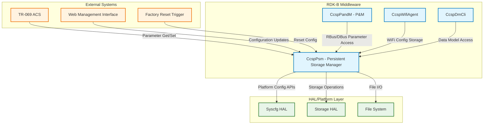
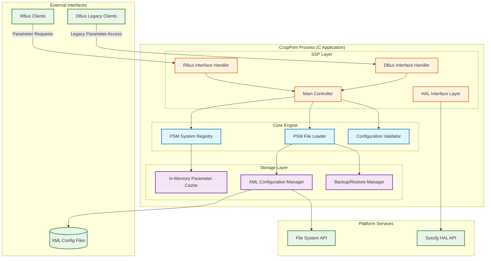
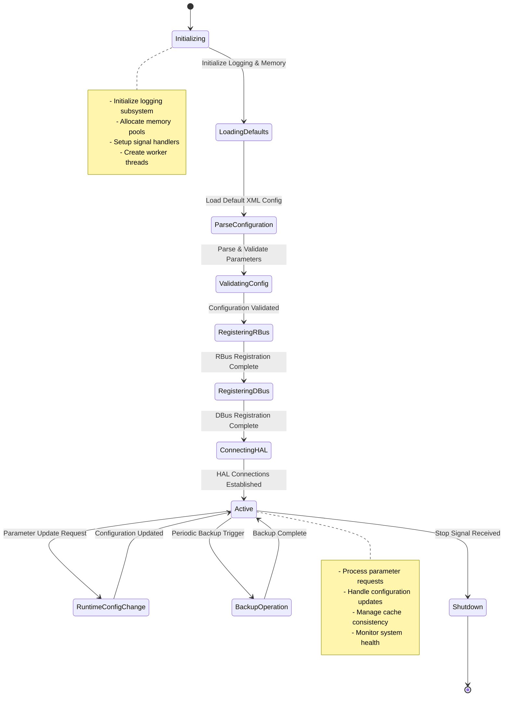
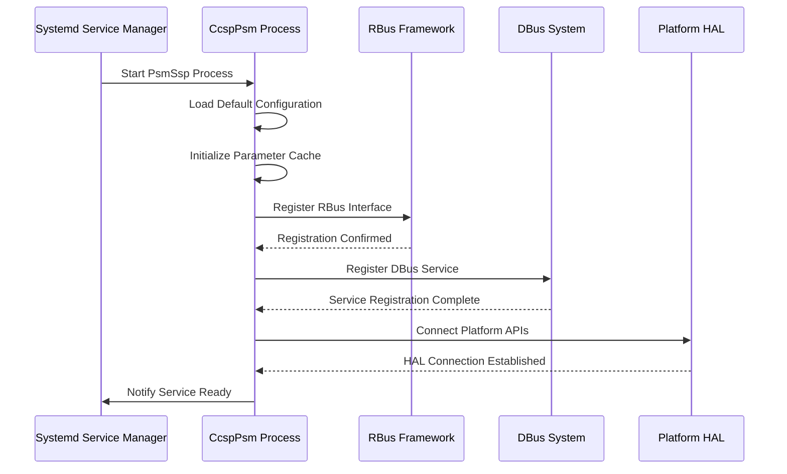
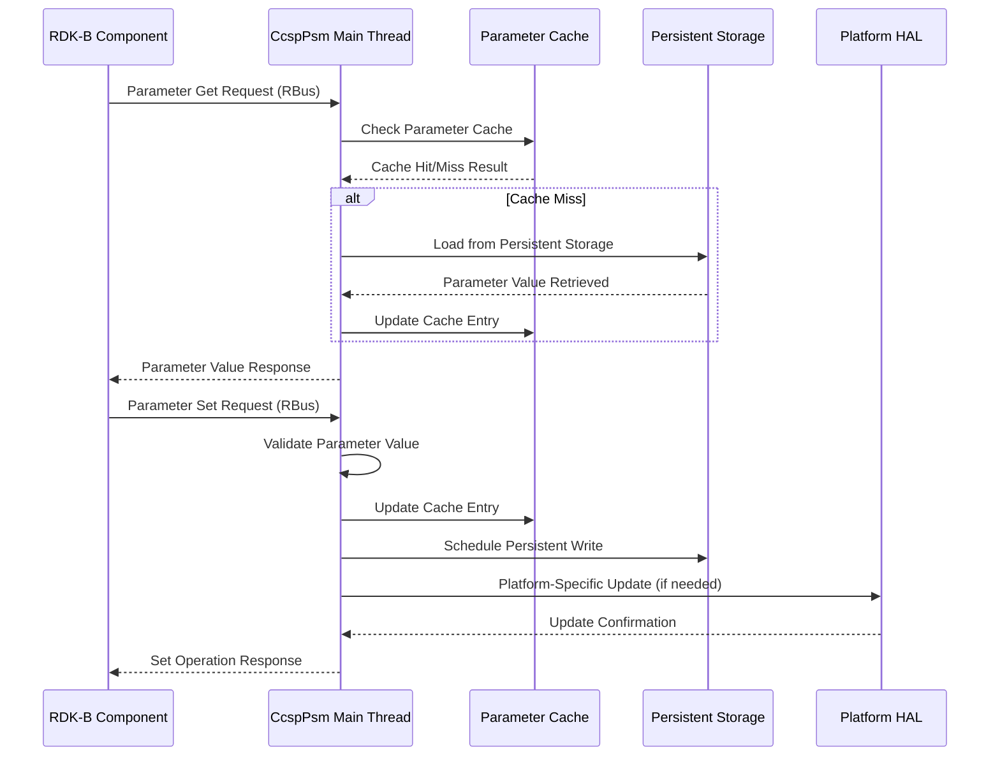
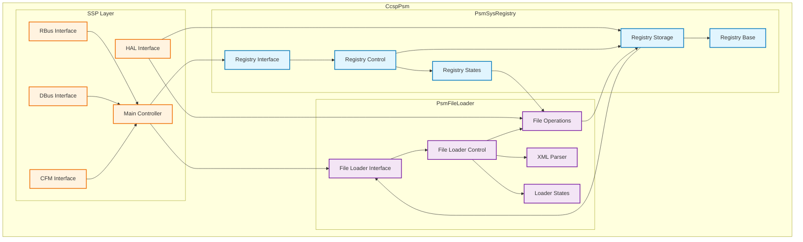
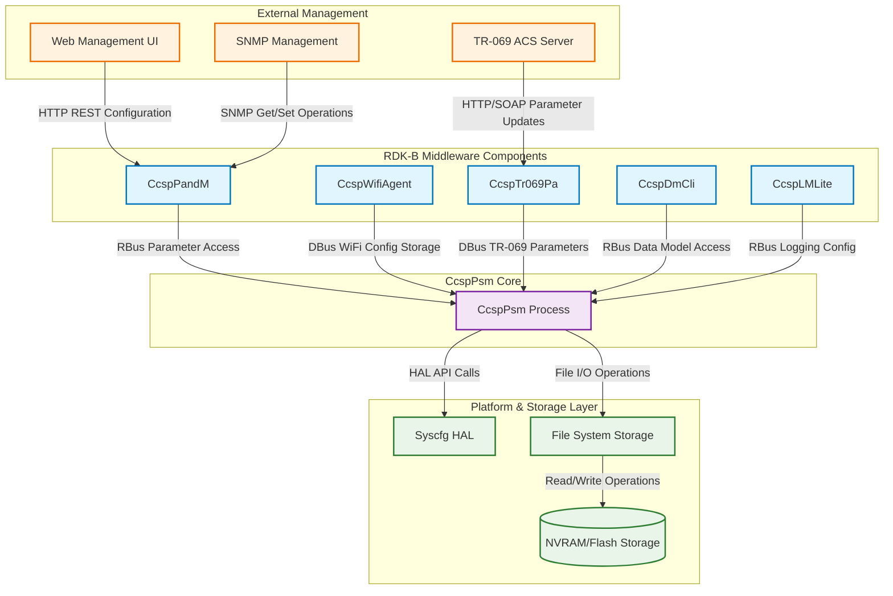
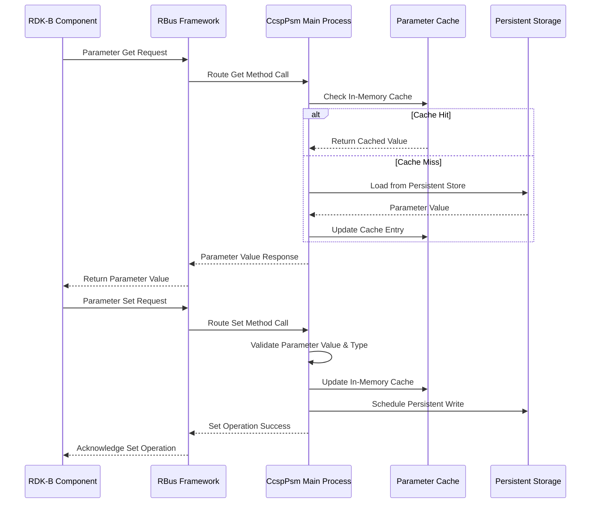
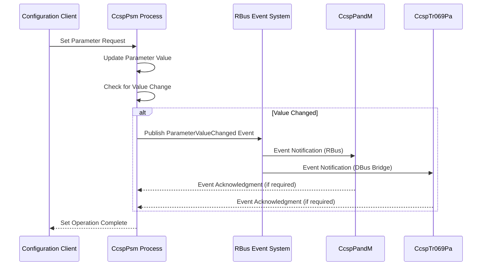

# CcspPsm Documentation

The CcspPsm component serves as the Persistent Storage Manager (PSM) in the RDK-B middleware stack. It provides centralized persistent configuration storage and retrieval services for all RDK-B components, ensuring data persistence across device reboots and factory resets. The component acts as a configuration repository that maintains system settings, user preferences, and runtime parameters in a hierarchical namespace structure.

CcspPsm serves the RDK-B ecosystem by offering standardized persistent storage APIs that abstract underlying storage mechanisms from other middleware components. It provides configuration validation, backup/restore capabilities, and transactional operations to ensure data integrity. The component supports both XML-based configuration files and runtime parameter management through well-defined interfaces.

At the module level, CcspPsm provides parameter get/set operations, configuration file loading/parsing, system registry management, and HAL integration for platform-specific storage requirements. It integrates with both RBus and DBus messaging systems to serve configuration requests from other RDK-B components and external management systems.

**Key Features & Responsibilities**: 

- **Persistent Configuration Storage**: Manages hierarchical parameter storage with support for different data types (string, integer, boolean, datetime, binary) and ensures data persistence across reboots and power cycles
- **Configuration File Management**: Handles XML-based configuration file parsing, loading, validation, and storage with support for default configurations, current settings, and backup files
- **Transaction Support**: Provides atomic operations for configuration updates with rollback capabilities to ensure data consistency during complex configuration changes
- **Factory Reset Support**: Implements factory reset functionality with the ability to restore default configurations while preserving critical system parameters
- **Multi-Protocol IPC Support**: Offers both RBus and DBus interfaces for parameter access, enabling integration with legacy CCSP components and modern RBus-based services
- **HAL Integration**: Provides platform-specific storage abstraction through HAL APIs, allowing adaptation to different hardware platforms and storage mechanisms
- **Configuration Validation**: Validates parameter values, types, and constraints before persistence to ensure system stability and prevent invalid configurations
- **Backup and Restore**: Supports configuration backup creation and restoration capabilities for system recovery and migration scenarios

## Design

The CcspPsm component follows a layered architecture design that separates concerns between configuration management, storage abstraction, and inter-process communication. The design centers around three core modules: PsmSysRegistry for runtime parameter management, PsmFileLoader for configuration file handling, and the SSP (Sub-System Process) layer for IPC integration. This modular approach enables independent evolution of storage mechanisms, communication protocols, and configuration formats while maintaining stable interfaces.

The architecture implements a dual-storage strategy where runtime parameters are managed in-memory through the SysRegistry module with periodic flushes to persistent storage, while configuration files are handled through the FileLoader module that parses, validates, and manages XML-based configuration data. The design incorporates robust error handling, transaction support, and rollback mechanisms to ensure data integrity during configuration updates. The component employs both synchronous and asynchronous operations, with critical configuration changes handled synchronously to prevent data loss.

North-bound interactions with other RDK-B components are managed through standardized RBus and DBus interfaces that provide parameter get/set operations, event notifications, and bulk configuration operations. The design abstracts the underlying storage complexity from clients, presenting a unified hierarchical namespace for all configuration parameters. South-bound interactions with the HAL layer are handled through well-defined APIs that abstract platform-specific storage mechanisms, enabling portability across different hardware platforms while maintaining consistent behavior.

The IPC mechanisms are integrated through a dual-protocol approach where RBus provides modern, high-performance messaging for new components, while DBus support ensures backward compatibility with existing CCSP components. The design includes message queuing, event notification, and subscription mechanisms to support real-time configuration updates and system monitoring. Data persistence is achieved through a combination of immediate writes for critical parameters and batched writes for performance optimization, with configurable flush intervals and emergency write triggers.

### Prerequisites and Dependencies

**RDK-B Platform and Integration Requirements (MUST):** 

- **DISTRO Features**: DISTRO_FEATURES += "rdk-b", "ccsp-common", "systemd" for core RDK-B middleware support and systemd integration
- **Build Dependencies**: meta-rdk-broadband layer, ccsp-common-library, rbus library, dbus development packages, libxml2, zlib for configuration compression
- **RDK-B Components**: CcspCommonLibrary (libccsp_common), RBus framework, systemd for service management, syscfg utility for platform configuration
- **HAL Dependencies**: Platform Storage HAL, Syscfg HAL for platform-specific configuration access, minimum HAL version supporting persistent storage APIs
- **Systemd Services**: dbus.service must be active before PSM startup, filesystem mount points for /nvram and /tmp must be available
- **Hardware Requirements**: Non-volatile storage (NVRAM/eMMC/Flash) with minimum 512KB for configuration storage, read/write filesystem support
- **Message Bus**: RBus namespace registration for "Device.X_CISCO_COM_PSM." prefix, DBus service registration as "com.cisco.spvtg.ccsp.psm"
- **Configuration Files**: /etc/ccsp/psm_cfg.xml for default configurations, /nvram/psm/ directory structure for persistent storage
- **Startup Order**: Must initialize after dbus and filesystem services, before other CCSP components that depend on configuration data

**Performance & Optimization (SHOULD):** 

- **Enhanced Features**: DISTRO_FEATURES += "psm-optimization" for performance tuning, memory-mapped file support for large configurations
- **Recommended Hardware**: SSD/eMMC storage for improved I/O performance, minimum 8MB RAM for optimal caching
- **Configuration Tuning**: PSM_FLUSH_INTERVAL=10000ms for balanced performance/persistence, PSM_CACHE_SIZE=1MB for optimal memory usage
- **Monitoring Integration**: Integration with telemetry framework for configuration change tracking and performance metrics

**Dependent Components:** 

- All CCSP components (CcspPandM, CcspTr069Pa, CcspWifiAgent, etc.) depend on PSM for configuration storage
- TR-069 ACS management relies on PSM for parameter persistence and factory reset functionality
- Web management interfaces require PSM for configuration validation and storage
- System startup sequence failure occurs if PSM fails to initialize properly

**Threading Model** 

CcspPsm implements a hybrid threading model combining single-threaded main processing with worker threads for I/O operations and periodic maintenance tasks. The main thread handles all IPC message processing, parameter validation, and configuration updates to ensure thread safety and avoid race conditions in critical configuration operations.

- **Threading Architecture**: Single-threaded main event loop with dedicated worker threads for file I/O and backup operations
- **Main Thread**: Handles RBus/DBus message processing, parameter validation, configuration updates, and maintains the in-memory parameter cache
- **Worker Threads**: 
  - **File I/O Thread**: Manages XML configuration file reading, writing, and compression operations
  - **Backup Thread**: Handles periodic configuration backups and cleanup of temporary files
  - **Flush Thread**: Performs periodic cache flushes to persistent storage at configurable intervals
- **Synchronization**: Uses mutex locks for cache access, semaphores for worker thread coordination, and atomic operations for critical flags

### Component State Flow

**Initialization to Active State**

The CcspPsm component follows a structured initialization sequence that establishes all necessary subsystems before entering the active operational state. The process begins with basic system setup, progresses through configuration loading and validation, establishes IPC connections, and finally registers with the message bus systems. Each initialization phase includes error handling and rollback mechanisms to ensure system stability.

**Runtime State Changes and Context Switching**

During normal operation, CcspPsm handles various runtime state changes triggered by external events, configuration updates, and maintenance operations. The component maintains internal state consistency while supporting concurrent operations from multiple clients.

**State Change Triggers:**

- Parameter update requests from RBus/DBus clients trigger cache updates and persistence operations
- Factory reset commands transition the system to configuration restoration state with default value loading
- Backup timer expiration triggers background backup operations without affecting normal parameter access
- Storage errors initiate error recovery procedures with automatic retry and fallback mechanisms

**Context Switching Scenarios:**

- Configuration file updates require temporary service suspension during atomic file replacement operations
- Factory reset operations switch to restricted mode where only essential parameters remain accessible
- Storage fault detection triggers failover to backup storage locations with automatic recovery attempts

### Call Flow

**Initialization Call Flow:**

**Request Processing Call Flow:**

## Internal Modules

The CcspPsm component is structured into three primary modules that handle different aspects of persistent storage management. The PsmSysRegistry module manages the runtime parameter registry and in-memory caching, providing high-performance parameter access and validation. The PsmFileLoader module handles XML configuration file operations including parsing, validation, and file management for default, current, and backup configurations. The SSP (Sub-System Process) module provides the interface layer for RBus and DBus communications, HAL integration, and system service management.

| Module/Class | Description | Key Files |
|-------------|------------|-----------|
| PsmSysRegistry | Manages runtime parameter registry, in-memory cache operations, parameter validation, and provides atomic transaction support for configuration updates | `psm_sysro_interface.c`, `psm_sysro_control.c`, `psm_sysro_storage.c`, `psm_sysro_base.c` |
| PsmFileLoader | Handles XML configuration file parsing, validation, loading of default configurations, and manages backup/restore operations with compression support | `psm_flo_interface.c`, `psm_flo_parse.c`, `psm_flo_operation.c`, `psm_flo_control.c` |
| SSP Layer | Provides RBus and DBus interface implementations, HAL integration layer, main process control, and system service management including signal handling | `ssp_main.c`, `ssp_rbus.c`, `ssp_dbus.c`, `ssp_cfmif.c`, `psm_hal_apis.c` |

## Component Interactions

CcspPsm serves as the central configuration repository for the RDK-B middleware ecosystem, interfacing with numerous components through standardized IPC mechanisms. The component provides both RBus and DBus interfaces to accommodate modern RBus-based services and legacy CCSP components. It integrates with platform HAL layers for hardware-specific storage operations and communicates with external management systems through TR-069 and web interfaces.

### Interaction Matrix

| Target Component/Layer | Interaction Purpose | IPC Mechanism | Message Format | Communication Pattern | Key APIs/Endpoints |
|------------------------|-------------------|---------------|----------------|---------------------|------------------|
| **RDK-B Middleware Components** |
| CcspPandM | Configuration parameter management, system status reporting, factory reset coordination | RBus | JSON Parameter Objects | Request-Response/Event Subscription | `Device.X_CISCO_COM_PSM.Get()`, `Device.X_CISCO_COM_PSM.Set()` |
| CcspTr069Pa | TR-069 parameter persistence, ACS configuration storage, device provisioning data | DBus | CCSP Parameter Structures | Synchronous Method Calls | `getParameterValues()`, `setParameterValues()`, `addObject()` |
| CcspWifiAgent | WiFi configuration persistence, radio settings, access point parameters | DBus/RBus | WiFi Parameter Structures | Request-Response | `Device.WiFi.` namespace parameters, WiFi credential storage |
| CcspDmCli | Command-line data model access, diagnostic parameter retrieval, testing interface | RBus | CLI Command Structures | Interactive Request-Response | RBus method calls for parameter tree navigation |
| **System & HAL Layers** |
| Syscfg HAL | Platform-specific configuration parameter access, hardware-dependent settings | Direct API Calls | C Parameter Structures | Synchronous Function Calls | `syscfg_get()`, `syscfg_set()`, `syscfg_commit()` |
| File System | Configuration file storage, backup operations, temporary file management | File I/O System Calls | XML Files/Binary Data | File Operations | `/nvram/psm_cfg.xml`, `/tmp/psm_backup.xml` |
| Platform Services | System integration, service lifecycle management, resource monitoring | Systemd/Init Scripts | Service Control Messages | Service Management | Systemd unit file control, process monitoring |
| **External Systems** |
| TR-069 ACS/HeadEnd | Remote configuration management, firmware updates, diagnostic data collection | HTTP/SOAP via TR069PA | TR-069 Protocol Messages | Client-Server Protocol | TR-069 RPC methods via CcspTr069Pa proxy |

**Events Published by CcspPsm:**

| Event Name | Event Topic/Path | Trigger Condition | Payload Format | Subscriber Components |
|------------|-----------------|-------------------|----------------|---------------------|
| ParameterValueChanged | `Device.X_CISCO_COM_PSM.ParameterChanged` | Parameter value modification via Set operation | JSON: `{parameterName, oldValue, newValue, timestamp}` | CcspPandM, CcspTr069Pa, Telemetry components |
| ConfigurationBackupComplete | `Device.X_CISCO_COM_PSM.BackupStatus` | Successful completion of configuration backup operation | JSON: `{backupPath, timestamp, parameterCount}` | System monitoring, CcspPandM |
| FactoryResetInitiated | `Device.X_CISCO_COM_PSM.FactoryReset` | Factory reset operation triggered | JSON: `{resetType, timestamp, initiator}` | All RDK-B components for cleanup operations |

**Events Consumed by CcspPsm:**

| Event Source | Event Topic/Path | Purpose | Expected Payload | Handler Function |
|-------------|-----------------|---------|------------------|------------------|
| CcspPandM | `Device.X_CISCO_COM_PandM.SystemReadyForCommit` | Trigger configuration commit/flush operation | JSON: `{commitType, priority}` | `handleSystemCommitRequest()` |
| System Manager | `Device.X_CISCO_COM_SystemManager.FactoryReset` | Initiate factory reset with default configuration restoration | JSON: `{resetLevel, preserveList}` | `handleFactoryResetEvent()` |

### IPC Flow Patterns

**Primary IPC Flow - Parameter Get/Set Operations:**

**Event Notification Flow:**

## Implementation Details

### Major HAL APIs Integration

CcspPsm integrates with several HAL APIs to provide platform-specific storage and configuration management. The primary integration focuses on the Syscfg HAL for persistent parameter storage and platform-specific configuration access.

**Core HAL APIs:**

| HAL API | Purpose | Parameters | Return Values | Implementation File |
|---------|---------|------------|---------------|-------------------|
| `syscfg_get()` | Retrieve platform-specific configuration parameters from persistent storage | `char* name, char* value, size_t size` | `0` on success, `-1` on error | `psm_hal_apis.c` |
| `syscfg_set()` | Store platform-specific configuration parameters to persistent storage | `char* name, char* value` | `0` on success, `-1` on error | `psm_hal_apis.c` |
| `syscfg_commit()` | Commit pending configuration changes to persistent storage | `void` | `0` on success, `-1` on error | `psm_hal_apis.c` |
| `PsmHal_GetHwParams()` | Retrieve hardware-specific default parameters for initial configuration | `PsmHalParam_t** params, int* count` | Parameter count or `-1` on error | `psm_hal_apis.c` |

### Key Implementation Logic

- **Parameter Registry Engine**: Core parameter management logic implemented in `psm_sysro_interface.c` with hash-based parameter lookup, type validation, and atomic update operations. Main registry implementation in `psm_sysro_base.c` with parameter tree management and namespace handling. State transition handlers in `psm_sysro_states.c` for parameter lifecycle management and event processing.
  
- **Configuration File Processing**: XML configuration file parsing and validation handled through libxml2 integration with custom schema validation. Configuration parsing engine in `psm_flo_parse.c` with XML schema validation and parameter extraction. File operation management in `psm_flo_operation.c` with atomic file updates and backup creation. Configuration loading state machine in `psm_flo_states.c` for startup and runtime configuration management.
  
- **Error Handling Strategy**: Comprehensive error detection and recovery mechanisms for storage failures, parsing errors, and IPC communication issues. HAL error code mapping with automatic retry mechanisms for transient failures. Configuration validation with rollback support for invalid parameter updates. Graceful degradation with emergency read-only mode when persistent storage fails.
  
- **Logging & Debugging**: Multi-level logging system with component-specific categories and runtime verbosity control. Parameter operation logging with value change tracking and audit trail. File operation tracing with performance metrics and error diagnostics. RBus/DBus message tracing for IPC debugging and performance analysis.

### Key Configuration Files

| Configuration File | Purpose | Key Parameters | Default Values | Override Mechanisms |
|--------------------|---------|---------------|----------------|--------------------|
| `bbhm_def_cfg_qemu.xml` | Default system configuration parameters | Device model, WiFi settings, TR-069 URLs | Platform-specific defaults | Factory reset, HAL parameter override |
| `/etc/ccsp/psm_cfg.xml` | PSM runtime configuration | Cache size, flush intervals, backup settings | `CacheSize=1MB`, `FlushInterval=10s` | Environment variables, command-line args |
| `/nvram/psm_cur_cfg.xml` | Current active configuration | All runtime parameters | Loaded from default config | Parameter Set operations, configuration import |
| `/nvram/psm_bak_cfg.xml` | Backup configuration | Previous stable configuration | Previous current config | Automatic backup on major changes |