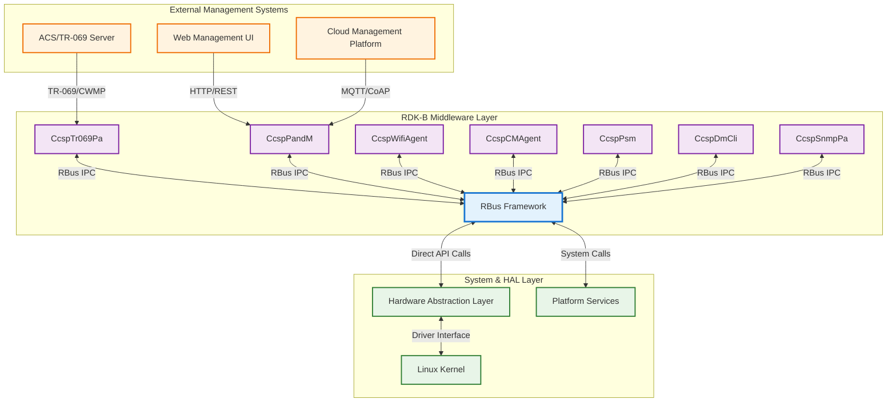
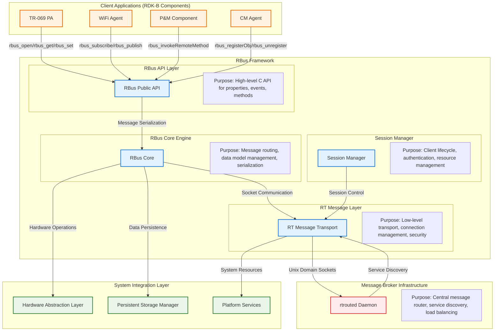
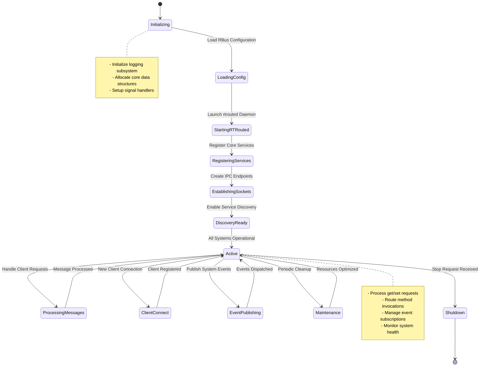
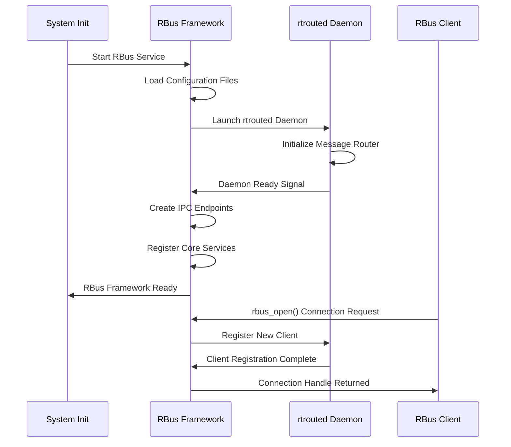
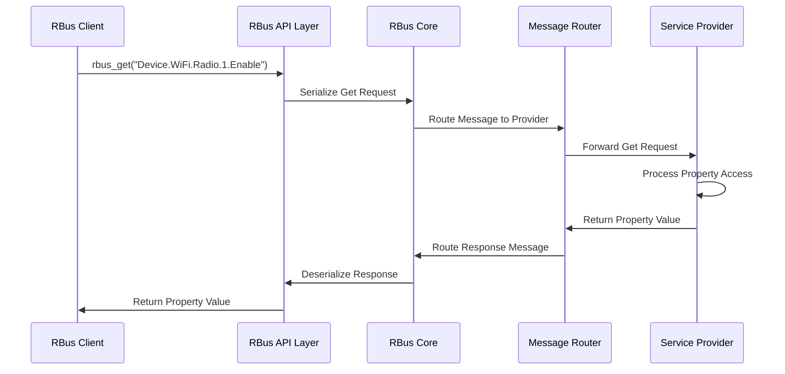
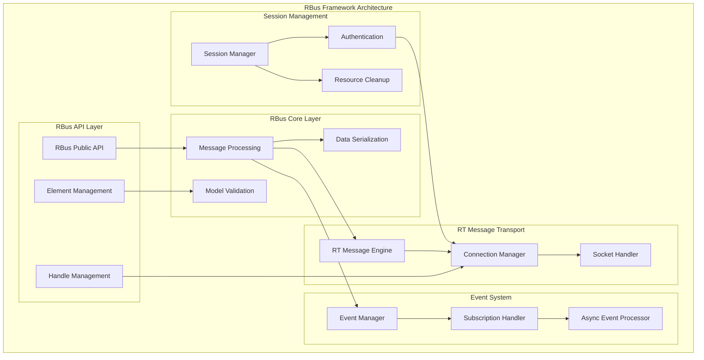
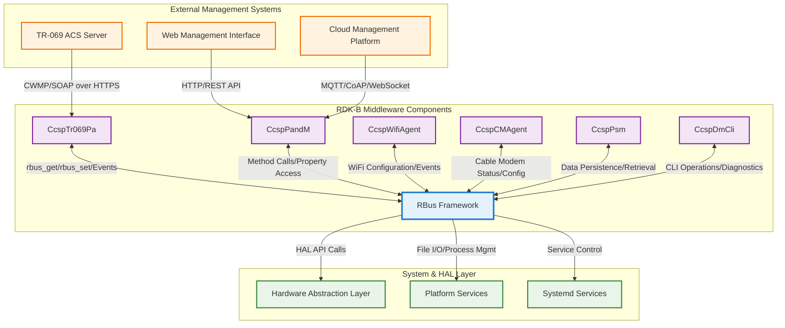
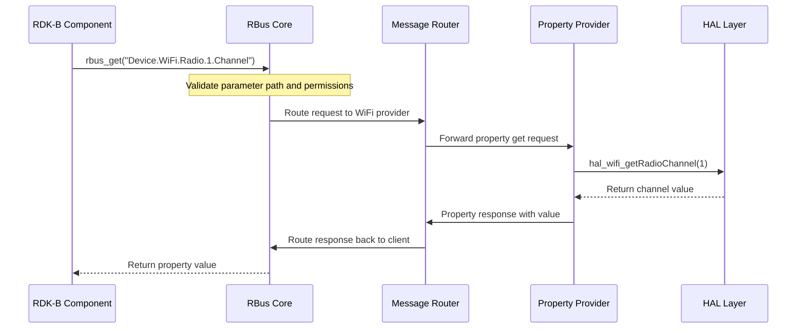
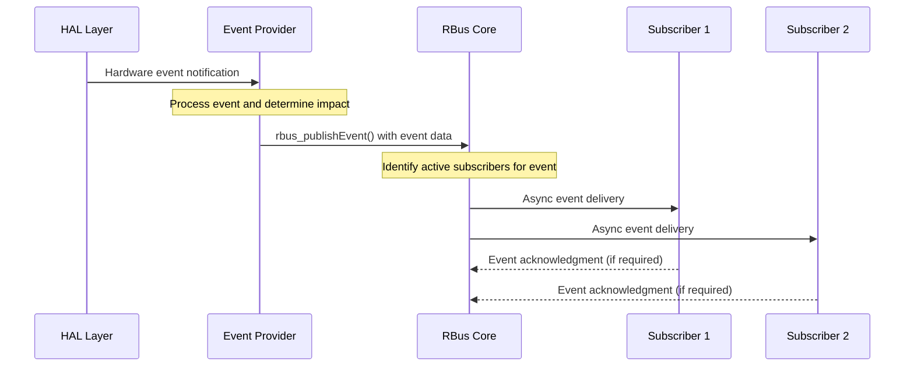

# RBus Documentation

RBus is the foundational Inter-Process Communication (IPC) framework that enables all RDK-B middleware components to communicate efficiently and reliably. As the central message bus system, RBus provides a lightweight, fast messaging infrastructure that supports remote procedure calls (RPC), event publishing/subscribing, and hierarchical data model management across the entire RDK-B ecosystem. 

RBus serves as the communication backbone that connects all RDK-B components, from high-level applications down to Hardware Abstraction Layer (HAL) interfaces. It implements a provider-consumer model where components can both publish services and consume services from other components, creating a flexible and scalable middleware architecture. The system supports TR-069/TR-181 compliant data models with hierarchical naming conventions, making it ideal for device management and configuration in broadband gateway devices.

At the architectural level, RBus eliminates the need for direct component-to-component communication by providing a centralized message routing daemon (rtrouted) that handles all inter-process messaging. This design ensures loose coupling between components, improves system reliability through fault isolation, and provides a consistent API for all IPC operations regardless of the underlying transport mechanism.

**Key Features & Responsibilities**: 

- **Inter-Process Communication**: Provides reliable, fast message routing between all RDK-B middleware components using Unix domain sockets and shared memory for optimal performance
- **Data Model Management**: Implements hierarchical data models with TR-069/TR-181 compliant naming conventions, supporting get/set operations, object creation/deletion, and parameter validation
- **Event System**: Enables publish-subscribe messaging patterns for real-time notifications, value change events, and system status updates across all components
- **Remote Method Invocation**: Supports synchronous and asynchronous remote procedure calls with parameter marshalling, error handling, and timeout management
- **Message Routing**: Central rtrouted daemon provides intelligent message routing, load balancing, and fault tolerance for all IPC operations
- **Security & Authentication**: Implements access control mechanisms, message encryption capabilities, and component authentication for secure inter-process communication

## Design

RBus is architected as a multi-layered IPC framework that provides both high-level abstract APIs and low-level messaging primitives. The design follows a hub-and-spoke model where the rtrouted daemon serves as the central message broker, eliminating direct peer-to-peer connections between components and providing centralized routing intelligence. This architecture ensures scalability, fault isolation, and consistent performance characteristics across the entire RDK-B middleware stack.

The framework's design prioritizes performance through efficient message serialization using MessagePack, zero-copy memory operations where possible, and optimized Unix domain socket transport. The system supports both request-response patterns for synchronous operations and publish-subscribe patterns for asynchronous event handling, providing flexibility for different communication requirements across RDK-B components.

The northbound interface provides a comprehensive C API that abstracts the underlying transport complexity, offering simple function calls for property access, method invocation, and event subscription. The southbound interface integrates directly with the rtMessage transport layer and can optionally interface with HAL components for hardware-specific operations. The design includes sophisticated error handling, automatic retry mechanisms, and graceful degradation capabilities to ensure system reliability.

RBus integrates RBus-native messaging for high-performance internal communication while maintaining compatibility with legacy D-Bus interfaces where required. The data persistence layer leverages the PSM (Persistent Storage Manager) component for configuration storage and retrieval, ensuring data consistency across system reboots and component restarts.

### Prerequisites and Dependencies

**RDK-B Platform and Integration Requirements (MUST):** 

- **DISTRO Features**: DISTRO_FEATURES += "rbus", "systemd" for proper RBus integration and service management
- **Build Dependencies**: meta-rdk layer, libcjson-dev, libmsgpack-dev, libcurl4-openssl-dev for messaging and serialization
- **RDK-B Components**: rtrouted daemon must be running before any RBus-enabled components start
- **HAL Dependencies**: No specific HAL requirements - RBus provides HAL abstraction interfaces
- **Systemd Services**: rbus.service, rtrouted must be active and socket activation configured
- **Hardware Requirements**: Unix domain socket support, shared memory capabilities, sufficient RAM for message queues
- **Message Bus**: RBus native transport with automatic rtrouted daemon discovery and registration
- **Configuration Files**: /etc/rbus/rbus.conf for routing configuration, component-specific .conf files for service definitions
- **Startup Order**: rtrouted daemon must start before all RDK-B middleware components that use RBus

**Performance & Optimization (SHOULD):** 

- **Enhanced Features**: DISTRO_FEATURES += "rbus-telemetry" for enhanced monitoring and performance metrics
- **Recommended Hardware**: Multi-core CPU for concurrent message processing, SSD storage for reduced I/O latency
- **Configuration Tuning**: Increased socket buffer sizes, optimized message queue depths, connection pooling parameters
- **Monitoring Integration**: Integration with RDK telemetry systems, logging configuration for performance analysis

**Dependent Components:** 

- All RDK-B middleware components (CcspTr069Pa, CcspPandM, CcspWifiAgent, etc.) depend on RBus for IPC
- Component Manager (CM) depends on RBus for component lifecycle management and health monitoring
- Telemetry and logging systems depend on RBus events for system-wide monitoring and diagnostics
- If RBus fails, the entire RDK-B middleware stack becomes non-functional, requiring system restart

**Threading Model** 

RBus implements a hybrid threading architecture optimized for both high-throughput message processing and low-latency event handling. The framework uses a combination of dedicated service threads, worker thread pools, and event-driven processing to efficiently manage concurrent operations across multiple client connections.

- **Threading Architecture**: Multi-threaded with dedicated threads for different operational aspects
- **Main Thread**: Handles component initialization, client registration/deregistration, and API entry points for synchronous operations
- **Worker Threads**: 
  - **Message Router Thread**: Processes incoming messages, performs routing decisions, and manages message queues
  - **Event Publisher Thread**: Handles asynchronous event publishing and subscriber notification management
  - **Socket Handler Threads**: One per active client connection for dedicated I/O processing and connection state management
  - **Cleanup Thread**: Performs periodic maintenance, connection health checks, and resource garbage collection
- **Synchronization**: Uses mutex locks for critical sections, condition variables for thread coordination, and atomic operations for performance-critical counters

### Component State Flow

**Initialization to Active State**

RBus follows a structured initialization sequence that ensures proper service registration, dependency resolution, and runtime readiness before accepting client connections. The initialization process includes rtrouted daemon startup, socket establishment, service discovery registration, and health check validation.

**Runtime State Changes and Context Switching**

RBus maintains operational state context during runtime to handle different operational modes, error conditions, and performance optimization scenarios. The system supports graceful degradation, load balancing, and failover mechanisms.

**State Change Triggers:**

- Client connection/disconnection events trigger service availability updates and resource reallocation
- Network or socket errors trigger connection retry mechanisms and alternative routing path discovery
- High message load triggers performance optimization modes including message batching and priority queuing
- Configuration updates trigger service re-registration and capability advertisement updates

**Context Switching Scenarios:**

- Performance mode switching between low-latency and high-throughput processing based on message volume
- Error recovery mode activation when client connections fail, including automatic retry and graceful degradation
- Maintenance mode entry for system updates, configuration reloads, and resource optimization operations

### Call Flow

**Initialization Call Flow:**

**Request Processing Call Flow:**

## Internal Modules

RBus is structured as a modular framework with distinct layers handling different aspects of inter-process communication. The Core module manages the high-level API and data model operations, while the RTMessage layer provides low-level transport and routing capabilities. The Session Manager handles client lifecycle and authentication, ensuring secure and reliable connections between components.

| Module/Class | Description | Key Files |
|-------------|------------|-----------|
| **RBus API Layer** | High-level C API providing property access, method invocation, event subscription, and data model management interfaces for RDK-B components | `rbus.c`, `rbus.h`, `rbus_element.c` |
| **RBus Core Engine** | Core message processing engine handling serialization, deserialization, routing logic, and data model validation with MessagePack encoding | `rbuscore.c`, `rbuscore.h`, `rbuscore_message.c` |
| **RT Message Transport** | Low-level messaging transport layer providing Unix domain socket communication, connection management, and message routing infrastructure | `rtConnection.c`, `rtMessage.c`, `rtSocket.c` |
| **Session Manager** | Client session lifecycle management, authentication, resource tracking, and cleanup operations for maintaining system stability | `session_manager/` directory files |
| **Event System** | Publish-subscribe event management including subscription handling, event filtering, value change detection, and asynchronous delivery | `rbus_asyncsubscribe.c`, `rbus_subscriptions.c` |
| **Value Management** | Data type handling, serialization, validation, and conversion for all supported RBus data types including strings, integers, booleans, and complex objects | `rbus_value.c`, `rbus_property.c`, `rbus_object.c` |

## Component Interactions

RBus serves as the central communication hub that enables seamless interaction between all RDK-B middleware components, external management systems, and hardware abstraction layers. The framework provides both synchronous request-response patterns and asynchronous event-driven communication, supporting diverse integration requirements across the RDK-B ecosystem.

### Interaction Matrix

| Target Component/Layer | Interaction Purpose | IPC Mechanism | Message Format | Communication Pattern | Key APIs/Endpoints |
|------------------------|-------------------|---------------|----------------|---------------------|------------------|
| **RDK-B Middleware Components** |
| CcspTr069Pa | TR-069 parameter access, event notifications, remote method execution for ACS communication | RBus Native | MessagePack Binary | Request-Response/Pub-Sub | `rbus_get()`, `rbus_set()`, `Device.ManagementServer.*` |
| CcspPandM | Device configuration management, system status reporting, policy enforcement | RBus Native | MessagePack Binary | Request-Response/Events | `rbus_registerObj()`, `rbus_invokeRemoteMethod()`, `Device.*` |
| CcspWifiAgent | WiFi configuration, status monitoring, client association events, performance metrics | RBus Native | MessagePack Binary | Async Events/Polling | `rbus_subscribe()`, `Device.WiFi.*`, `WiFi.AccessPoint.*` |
| CcspCMAgent | Cable modem status, signal quality monitoring, provisioning state management | RBus Native | MessagePack Binary | Event-Driven/Polling | `rbus_publishEvent()`, `Device.X_CISCO_COM_CableModem.*` |
| CcspPsm | Persistent configuration storage, parameter validation, backup/restore operations | RBus Native | MessagePack Binary | Synchronous Calls | `rbus_get()`, `rbus_set()`, `dmsb.device.deviceinfo.*` |
| CcspDmCli | Diagnostic operations, CLI command execution, system troubleshooting | RBus Native | MessagePack Binary | Command-Response | `rbus_invokeRemoteMethod()`, `dmcli.*` commands |
| **System & HAL Layers** |
| Hardware Abstraction Layer | Hardware control interfaces, driver communication, platform-specific operations | Direct Function Calls | C Structures | Synchronous API Calls | `hal_*()` functions per HAL module |
| Platform Services | System resource management, process control, file system operations | System Calls/D-Bus | Binary/Text Config | File I/O/Process Control | `/proc`, `/sys`, systemd D-Bus interface |
| Systemd Services | Service lifecycle management, dependency resolution, system state control | D-Bus System Bus | D-Bus Messages | Method Calls/Signals | `org.freedesktop.systemd1.Manager` |
| **External Systems** |
| Cloud/ACS Management | Remote device management, configuration updates, firmware deployment | HTTPS/MQTT/CoAP | JSON/XML/Binary | RESTful/Message Queue | `POST /api/v1/devices/{id}/config` |

**Events Published by RBus:**

| Event Name | Event Topic/Path | Trigger Condition | Payload Format | Subscriber Components |
|------------|-----------------|-------------------|----------------|---------------------|
| ComponentReady | `rbus.component.{name}.ready` | Component registration complete | JSON: `{component, status, timestamp, capabilities}` | All dependent middleware components |
| ParameterValueChange | `{object_path}.{parameter}!` | Parameter value modification | MessagePack: `{oldValue, newValue, source, timestamp}` | TR-069 PA, monitoring systems |
| SystemStatusUpdate | `rbus.system.status` | System health/performance changes | JSON: `{cpu_usage, memory, connections, errors}` | Management interfaces, telemetry |
| ClientConnectionEvent | `rbus.client.{action}` | Client connect/disconnect/timeout | MessagePack: `{client_id, action, timestamp, details}` | Session manager, monitoring systems |

**Events Consumed by RBus:**

| Event Source | Event Topic/Path | Purpose | Expected Payload | Handler Function |
|-------------|-----------------|---------|------------------|------------------|
| Systemd | `org.freedesktop.systemd1.JobRemoved` | Service lifecycle state changes | D-Bus struct: `{job_id, job, unit, result}` | `systemd_job_handler()` |
| System Monitor | `system.resource.threshold` | Resource usage threshold violations | JSON: `{resource, current, threshold, action}` | `resource_threshold_handler()` |
| HAL Events | `hal.{subsystem}.event` | Hardware state changes and notifications | Binary: hardware-specific structures | `hal_event_processor()` |

### IPC Flow Patterns

**Primary IPC Flow - Property Access:**

**Event Notification Flow:**

## Implementation Details

### Major HAL APIs Integration

RBus provides a flexible abstraction layer that allows RDK-B components to interact with Hardware Abstraction Layer (HAL) modules without direct coupling. The framework supports both direct HAL API calls and HAL event integration for hardware status monitoring and control operations.

**Core HAL APIs:**

| HAL API | Purpose | Parameters | Return Values | Implementation File |
|---------|---------|------------|---------------|-------------------|
| `hal_platform_init()` | Initialize platform-specific HAL subsystems | `platform_config_t *config` | `0=success, <0=error` | `rbuscore.c` |
| `hal_wifi_*()` functions | WiFi hardware control and status monitoring | Device index, configuration structures | HAL status codes | WiFi Agent integration |
| `hal_cm_*()` functions | Cable modem hardware interface operations | Modem index, parameter structures | Status/error codes | CM Agent integration |
| `hal_ethernet_*()` functions | Ethernet interface management and statistics | Port index, configuration data | Interface status | P&M Component integration |

### Key Implementation Logic

- **Message Processing Engine**: Core message handling implemented in `rbuscore.c` with high-performance message queue management, priority-based routing, and load balancing capabilities across multiple client connections. Main implementation in `rbuscore.c` with message serialization, validation, and routing logic. Connection state management in `rtConnection.c` handling client lifecycle and resource cleanup.
  
- **Event Processing**: Hardware and software events processed through publish-subscribe mechanism with filtering, transformation, and reliable delivery guarantees. Event subscription management with topic-based filtering and wildcard support. Asynchronous event delivery with retry mechanisms and failure handling. Value change detection with configurable thresholds and debouncing logic.

- **Error Handling Strategy**: Comprehensive error detection, logging, and recovery mechanisms ensure system stability during component failures and network issues. HAL error code mapping with automatic retry logic for transient failures. Connection failure recovery with exponential backoff and alternative routing. Message timeout handling with configurable retry counts and escalation procedures.

- **Logging & Debugging**: Multi-level logging system with performance monitoring, debug tracing, and system health metrics for troubleshooting and optimization. Message flow tracing with unique transaction IDs for end-to-end debugging. Performance metrics collection including latency, throughput, and error rates. Debug hooks for real-time system state inspection and configuration validation.

### Key Configuration Files

| Configuration File | Purpose | Key Parameters | Default Values | Override Mechanisms |
|--------------------|---------|---------------|----------------|--------------------|
| `/etc/rbus/rbus.conf` | Main RBus configuration | `MaxConnections`, `MessageTimeout`, `LogLevel` | `200`, `30000ms`, `INFO` | Environment variables, command line |
| `/usr/lib/systemd/system/rbus.service` | Systemd service definition | `ExecStart`, `Restart`, `Dependencies` | rtrouted daemon | Systemd overrides |
| `/tmp/rtrouted.conf` | Runtime router configuration | `SocketPath`, `MaxMessageSize`, `ClientTimeout` | `/tmp/rtroute`, `10MB`, `60s` | Runtime generation |
| Component-specific `.conf` files | Individual component settings | Service names, object registrations, capabilities | Component-dependent | Component initialization |
