# WAN Manager Documentation

WAN Manager is a critical RDK-B middleware component responsible for managing Wide Area Network (WAN) connectivity across multiple interface types and technologies. It serves as the central orchestrator for WAN interface selection, failover mechanisms, and network connectivity management in RDK-B based gateway devices. WAN Manager abstracts the complexity of multiple WAN technologies (DOCSIS, Ethernet, GPON, Cellular, DSL) and provides intelligent policy-driven interface selection and management.

The component operates as a sophisticated state machine framework that coordinates between physical interface managers and upper-layer RDK-B services. It handles the complete lifecycle of WAN connections from physical layer validation to IP configuration and connectivity verification. WAN Manager ensures robust internet connectivity through automated failover mechanisms, policy-based interface selection, and comprehensive telemetry reporting for network operations and troubleshooting.

As a device-level service, WAN Manager interfaces with platform-specific HAL implementations, system networking components, and other RDK-B middleware to provide seamless internet connectivity. It supports advanced features like backup WAN interfaces, parallel scanning for optimal connection selection, and dynamic reconfiguration based on network conditions and administrative policies.

```mermaid
graph TD
    subgraph ExternalSystems["External Systems"]
        RemoteMgmt[Remote Management/TR-069]
        CloudServices[Cloud Services/HeadEnd]
        ISPNetwork[ISP Network Infrastructure]
    end
    
    subgraph RDKBMiddleware["RDK-B Middleware Layer"]
        WanManager[WAN Manager]
        VlanMgr[VLAN Manager]
        DHCPMgr[DHCP Manager]
        PandM[P&M Component]
        WebConfig[WebConfig Framework]
        Telemetry[Telemetry Component]
    end
    
    subgraph InterfaceManagers["Interface Managers"]
        DOCSISMgr[DOCSIS Manager]
        EthMgr[Ethernet Manager]
        CellularMgr[Cellular Manager]
        GPONMgr[GPON Manager]
    end
    
    subgraph HALPlatform["HAL/Platform Layer"]
        PlatformHAL[Platform HAL]
        NetworkHAL[Network HAL]
        LinuxKernel[Linux Kernel/Networking]
    end

    RemoteMgmt -->|TR-181 Parameters| WanManager
    CloudServices -->|Configuration Updates| WebConfig
    WebConfig -->|RBus Messages| WanManager
    
    WanManager <-->|RBus Events/Status| DOCSISMgr
    WanManager <-->|RBus Events/Status| EthMgr
    WanManager <-->|RBus Events/Status| CellularMgr
    WanManager <-->|RBus Events/Status| GPONMgr
    
    WanManager <-->|VLAN Configuration| VlanMgr
    WanManager <-->|IP Address Management| DHCPMgr
    WanManager <-->|Device Parameters| PandM
    WanManager -->|Metrics/Events| Telemetry
    
    WanManager -->|HAL API Calls| PlatformHAL
    WanManager -->|Network Configuration| NetworkHAL
    WanManager -->|System Commands| LinuxKernel
    
    DOCSISMgr -->|HAL Calls| PlatformHAL
    EthMgr -->|HAL Calls| PlatformHAL
    CellularMgr -->|HAL Calls| PlatformHAL
    GPONMgr -->|HAL Calls| PlatformHAL
    
    WanManager <-->|Internet Connectivity| ISPNetwork

    classDef external fill:#fff3e0,stroke:#ef6c00,stroke-width:2px
    classDef component fill:#e1f5fe,stroke:#0277bd,stroke-width:2px
    classDef manager fill:#e8f5e8,stroke:#2e7d32,stroke-width:2px
    classDef hal fill:#fce4ec,stroke:#c2185b,stroke-width:2px
    
    class RemoteMgmt,CloudServices,ISPNetwork external
    class WanManager,VlanMgr,DHCPMgr,PandM,WebConfig,Telemetry component
    class DOCSISMgr,EthMgr,CellularMgr,GPONMgr manager
    class PlatformHAL,NetworkHAL,LinuxKernel hal
```

**Key Features & Responsibilities**: 

- **Interface Management & Selection**: Manages multiple WAN interface types (DOCSIS, Ethernet, Cellular, GPON, DSL) with intelligent policy-driven selection algorithms including AutoWAN, Fixed Mode, Priority-based, and Parallel Scan policies
- **Failover & Redundancy**: Provides automatic failover between primary and backup WAN interfaces with configurable restoration delays and health monitoring to ensure continuous internet connectivity
- **State Machine Framework**: Implements comprehensive state machines for both interface selection policies and individual interface lifecycle management, handling complex transitions and error recovery scenarios
- **TR-181 Data Model Integration**: Exposes complete WAN management functionality through standardized TR-181 parameters with RBus/DBus IPC mechanisms for remote configuration and monitoring
- **Network Configuration Management**: Coordinates with VLAN Manager, DHCP Manager, and system networking components to configure complete network stacks including VLAN tagging, IP addressing, and routing
- **Telemetry & Monitoring**: Provides extensive telemetry data collection and event reporting for WAN connectivity status, performance metrics, and troubleshooting information
- **WebConfig Support**: Integrates with WebConfig framework for cloud-based configuration management and bulk parameter updates with transaction support
- **Multi-Protocol Support**: Handles various WAN protocols including static IP, DHCP, PPPoE, IPv4/IPv6 dual-stack, MAP-T, and DS-Lite configurations across different interface technologies

## Design

The WAN Manager architecture is built on a modular, event-driven design that separates interface management concerns from policy implementation and network configuration. The design follows a layered approach where physical interface managers report status to WAN Manager, which then applies policy-based decision making to select and configure appropriate WAN interfaces. This separation allows for flexible policy implementation while maintaining consistent interface management across different hardware platforms.

The component utilizes a sophisticated multi-threaded state machine architecture that can handle concurrent operations across multiple interfaces and policy engines. Each interface group can run its own selection policy (AutoWAN, Parallel Scan, Fixed Mode) while a master failover policy manages transitions between interface groups. This design enables complex scenarios like running AutoWAN between DOCSIS and Ethernet interfaces in one group while maintaining a cellular backup in a separate group.

WAN Manager integrates deeply with the RDK-B ecosystem through RBus IPC mechanisms for real-time communication with interface managers and other middleware components. The design emphasizes data consistency through centralized data management with mutex-protected access patterns, ensuring thread-safe operations across all concurrent state machines. Configuration persistence is managed through both PSM (Persistent Storage Manager) for TR-181 parameters and syscfg for platform-specific settings, with WebConfig integration providing cloud-based configuration synchronization.

```mermaid
graph TD
    subgraph WanManagerContainer ["WAN Manager Process (C/Linux)"]
        subgraph CoreEngine ["Core Engine Components"]
            MainController[Main Controller<br/>wanmgr_main.c]
            DataManager[Data Management Layer<br/>wanmgr_data.c]
            PolicyController[Policy Controller<br/>wanmgr_controller.c]
        end
        
        subgraph StateMachines ["State Machine Engines"]
            FailoverSM[Failover State Machine<br/>wanmgr_wan_failover.c]
            InterfaceSM[Interface State Machine<br/>wanmgr_interface_sm.c]
            PolicySMs[Policy State Machines<br/>wanmgr_policy_*_impl.c]
        end
        
        subgraph PolicyEngines ["Policy Implementation Modules"]
            AutoWanPolicy[AutoWAN Policy<br/>wanmgr_policy_autowan_impl.c]
            ParallelScanPolicy[Parallel Scan Policy<br/>wanmgr_policy_parallel_scan_impl.c]
            FixedModePolicy[Fixed Mode Policies<br/>wanmgr_policy_fm_impl.c]
            PriorityPolicy[Priority Policies<br/>wanmgr_policy_pp_impl.c]
        end
        
        subgraph IPCLayer ["IPC & Communication Layer"]
            RBusHandler[RBus Handler<br/>wanmgr_rbus_handler_apis.c]
            DBusUtils[DBus Utilities<br/>wanmgr_rdkbus_utils.c]
            SysEvents[System Events<br/>wanmgr_sysevents.c]
        end
        
        subgraph NetworkLayer ["Network Management"]
            DHCPClient[DHCP Client APIs<br/>wanmgr_dhcpv4_apis.c<br/>wanmgr_dhcpv6_apis.c]
            NetworkUtils[Network Utilities<br/>wanmgr_net_utils.c]
            VLANHandling[VLAN Handling]
        end
        
        subgraph MonitoringServices ["Monitoring & Telemetry"]
            TelemetryEngine[Telemetry Engine<br/>wanmgr_telemetry.c]
            HealthMonitor[Connectivity Monitoring]
            EventLogging[Event Logging<br/>wanmgr_utils.c]
        end
    end

    subgraph ExternalInterfaces ["External Interface Layer"]
        TR181Interface[TR-181 Data Model<br/>Device.X_RDK_WanManager.*]
        WebConfigAPI[WebConfig API<br/>wanmgr_webconfig_apis.c]
        HALInterface[Platform HAL APIs]
    end

    MainController --> PolicyController
    PolicyController --> FailoverSM
    PolicyController --> PolicySMs
    
    PolicySMs --> AutoWanPolicy
    PolicySMs --> ParallelScanPolicy
    PolicySMs --> FixedModePolicy
    PolicySMs --> PriorityPolicy
    
    AutoWanPolicy --> InterfaceSM
    ParallelScanPolicy --> InterfaceSM
    InterfaceSM --> NetworkLayer
    
    DataManager --> RBusHandler
    DataManager --> DBusUtils
    DataManager --> SysEvents
    
    NetworkLayer --> DHCPClient
    NetworkLayer --> NetworkUtils
    
    MonitoringServices --> TelemetryEngine
    MonitoringServices --> HealthMonitor
    
    RBusHandler --> TR181Interface
    WebConfigAPI --> TR181Interface
    NetworkUtils --> HALInterface
    
    classDef core fill:#e3f2fd,stroke:#1976d2,stroke-width:2px
    classDef statemachine fill:#f3e5f5,stroke:#7b1fa2,stroke-width:2px
    classDef policy fill:#e8f5e8,stroke:#388e3c,stroke-width:2px
    classDef ipc fill:#fff3e0,stroke:#f57c00,stroke-width:2px
    classDef network fill:#fce4ec,stroke:#c2185b,stroke-width:2px
    classDef monitoring fill:#e0f2f1,stroke:#00695c,stroke-width:2px
    classDef external fill:#f5f5f5,stroke:#616161,stroke-width:2px
    
    class MainController,DataManager,PolicyController core
    class FailoverSM,InterfaceSM,PolicySMs statemachine
    class AutoWanPolicy,ParallelScanPolicy,FixedModePolicy,PriorityPolicy policy
    class RBusHandler,DBusUtils,SysEvents ipc
    class DHCPClient,NetworkUtils,VLANHandling network
    class TelemetryEngine,HealthMonitor,EventLogging monitoring
    class TR181Interface,WebConfigAPI,HALInterface external
```

### Prerequisites and Dependencies

**RDK-B Platform Requirements (MUST):** 

- **DISTRO Features**: RDK-B core features enabled including `DISTRO_FEATURES += "rdk-b"`, systemd init system, and networking support with `wan-manager` feature flag
- **Build Dependencies**: ccsp-common-library, rbus (≥2.0), hal-platform, rdklogger, libsyscfg, libsysevent, webconfig-framework (≥1.0), nanomsg, dhcp-client-utils
- **RDK-B Components**: CcspPandM (P&M), CcspPsm (PSM), VLAN Manager, DHCP Manager, and at least one interface manager (DOCSIS/Ethernet/Cellular/GPON)
- **HAL Dependencies**: Platform HAL for device-specific operations, Network HAL for interface control, minimum HAL API version 2.0
- **Systemd Services**: `CcspPandMSsp.service`, `PsmSsp.service`, `rbus.service` must be active before WAN Manager initialization
- **Hardware Requirements**: Minimum one WAN-capable network interface (Ethernet, DOCSIS modem, Cellular module, GPON ONT, or DSL modem)

**RDK-B Integration Requirements (MUST):** 

- **Message Bus**: RBus namespace registration for `Device.X_RDK_WanManager.*` parameters and event subscriptions for interface status changes
- **TR-181 Data Model**: PSM storage access for parameter persistence, CCSP message bus registration for TR-181 parameter access
- **Configuration Files**: `/opt/secure/data/syscfg.db` for system configuration, `/tmp/system_defaults` for default values, XML data model files in `/usr/ccsp/`
- **Startup Order**: Must initialize after PSM, P&M, and RBus services but before dependent services like WebUI and remote management
- **Resource Constraints**: Minimum 32MB RAM allocation, persistent storage for configuration (≥1MB), sufficient CPU for concurrent state machines

**Performance & Optimization (SHOULD):** 

- **Enhanced Features**: WebConfig framework for bulk configuration, telemetry framework for advanced monitoring, multi-WAN support for load balancing
- **Recommended Hardware**: Multi-core CPU for parallel interface scanning, hardware-accelerated networking, redundant WAN interfaces for failover
- **Configuration Tuning**: Optimized timeout values for interface validation, connectivity check intervals based on network conditions
- **Monitoring Integration**: Integration with T2 telemetry for comprehensive network analytics and proactive issue detection

**RDK-B Design Limitations & Considerations:** 

- **Known Limitations**: Maximum 16 WAN interfaces supported per device, single active interface per group during failover, VLAN configuration dependent on platform HAL capabilities
- **Scalability Boundaries**: Concurrent state machine limit based on available memory, maximum 4 interface groups for policy separation
- **Platform Compatibility**: Supports x86, ARM architectures, requires Linux kernel ≥4.4 with network namespace support
- **Resource Usage**: Base memory footprint ~8MB, scales with number of configured interfaces, CPU usage peaks during interface scanning and failover events

**Dependent Components:** 

- **WebUI/Management Interface**: Depends on WAN Manager for interface status and configuration management
- **Firewall/Security Components**: Requires WAN interface status for rule application and traffic management
- **Captive Portal Services**: Uses WAN connectivity status for internet access validation and portal redirection logic
- **Remote Management (TR-069)**: Depends on WAN Manager for connectivity and configuration parameter access

**Threading Model** 

WAN Manager implements a sophisticated multi-threaded architecture designed to handle concurrent operations across multiple interface groups and policy engines without blocking critical system operations.

- **Threading Architecture**: Multi-threaded with dedicated threads for different operational domains
- **Main Thread**: Handles initialization, configuration management, and coordinates between all worker threads through mutex-protected shared data structures
- **Worker Threads**: 
  - **Policy Controller Thread**: Executes selected policy state machine (AutoWAN, Parallel Scan, Fixed Mode) for interface selection within groups
  - **Failover Thread**: Manages high-level failover decisions between interface groups and handles restoration logic
  - **Interface State Machine Threads**: One thread per active virtual interface handling DHCP, VLAN configuration, and connectivity validation
  - **Event Handler Thread**: Processes RBus events, system events, and interface status updates asynchronously
  - **Telemetry Thread**: Collects and reports metrics, connectivity statistics, and health monitoring data
- **Synchronization**: Uses pthread mutexes for data structure protection, condition variables for thread coordination, and atomic operations for status flags to ensure thread-safe access to shared interface data and configuration

### WAN Policy Types

WAN Manager supports multiple policy types that determine how interfaces are selected, prioritized, and managed for internet connectivity. Each policy implements different algorithms and behaviors suited for specific deployment scenarios and operational requirements.

**FIXED_MODE_ON_BOOTUP (1)**
- **Purpose**: Selects a predetermined interface during system boot and maintains that selection throughout the boot cycle
- **Behavior**: Identifies the configured primary interface during initialization, validates its connectivity, and commits to that interface for the entire boot session
- **Use Cases**: Deployments with known, reliable primary interfaces where interface switching during boot could cause service interruption
- **Implementation**: Single-pass interface validation with no fallback during boot sequence

**FIXED_MODE (2)**  
- **Purpose**: Operates with a statically configured preferred interface with limited failover capabilities
- **Behavior**: Continuously monitors the configured primary interface, only switches to backup if primary completely fails, automatically returns to primary when restored
- **Use Cases**: Traditional broadband deployments where DOCSIS or fiber is the primary service with cellular or Ethernet backup
- **Implementation**: Simple binary state machine with primary/backup interface monitoring

**PRIMARY_PRIORITY_ON_BOOTUP (3)**
- **Purpose**: Implements priority-based selection during boot with interface priority ordering
- **Behavior**: Scans interfaces in configured priority order during boot, selects the first valid interface, maintains selection until boot completion
- **Use Cases**: Multi-WAN environments where interface preference is based on cost, performance, or reliability characteristics
- **Implementation**: Priority queue-based scanning with early termination on first valid interface

**PRIMARY_PRIORITY (4)**
- **Purpose**: Continuous priority-based interface management with dynamic switching capabilities
- **Behavior**: Regularly evaluates all interfaces according to priority rankings, switches to higher-priority interfaces when available, maintains priority-based failover hierarchy
- **Use Cases**: Enterprise deployments with multiple WAN links requiring automatic optimization based on link quality and priority
- **Implementation**: Periodic interface evaluation with priority matrix comparison and threshold-based switching

**MULTIWAN_MODE (5)**
- **Purpose**: Enables multiple simultaneous WAN connections for load balancing and redundancy
- **Behavior**: Maintains multiple active WAN interfaces simultaneously, distributes traffic based on configured algorithms, provides seamless failover between active interfaces
- **Use Cases**: High-availability deployments requiring maximum bandwidth utilization and zero-downtime failover
- **Implementation**: Multi-interface state machines with load balancing algorithms and traffic steering

**AUTOWAN_MODE (6)**
- **Purpose**: Intelligent automatic interface selection with connectivity validation and optimization
- **Behavior**: Dynamically discovers available interfaces, performs connectivity validation, selects optimal interface based on performance metrics, handles automatic failover and restoration
- **Use Cases**: Consumer and small business deployments where automatic interface management reduces operational complexity
- **Implementation**: Machine learning-enhanced selection algorithms with historical performance analysis

**PARALLEL_SCAN (7)**
- **Purpose**: Concurrent interface evaluation and selection for optimal performance
- **Behavior**: Simultaneously tests multiple interfaces for connectivity and performance, selects the best-performing interface based on multiple criteria, maintains continuous background monitoring
- **Use Cases**: Environments with multiple viable WAN options where performance optimization is critical
- **Implementation**: Multi-threaded interface testing with performance metrics aggregation and decision algorithms

### Component State Flow

**Initialization to Active State**

WAN Manager follows a structured initialization sequence that ensures all dependencies are satisfied before beginning interface management operations. The initialization process validates system configuration, establishes IPC connections, and prepares state machine frameworks for operation.

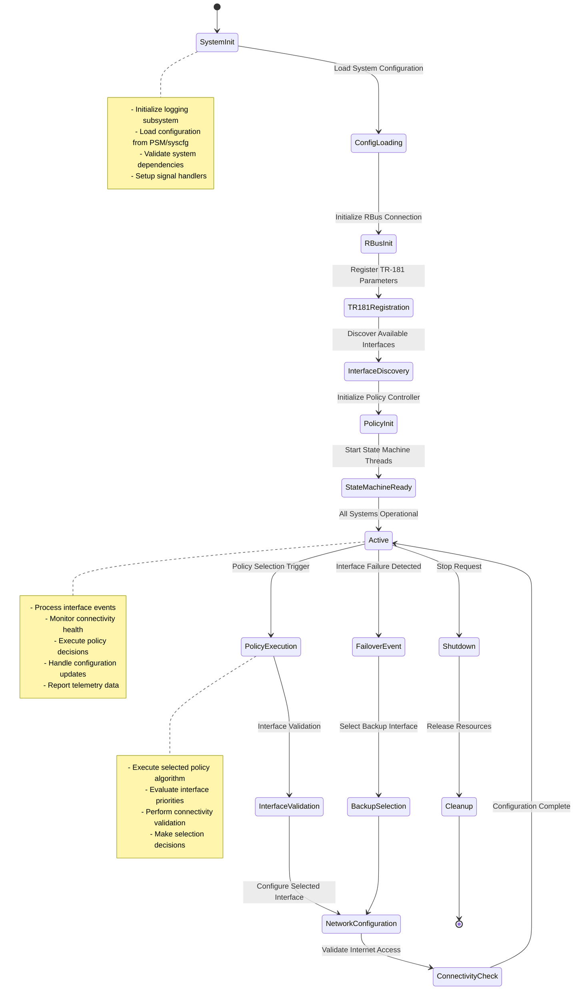

**Runtime State Changes and Context Switching**

During normal operation, WAN Manager handles various runtime events that trigger state transitions and context switching between different operational modes. These changes are driven by network conditions, administrative configuration, and policy-specific logic.

**State Change Triggers:**
- **Interface Events**: Physical interface up/down events trigger policy re-evaluation and potential interface switching
- **Configuration Updates**: WebConfig or TR-181 parameter changes cause policy recalculation and interface reconfiguration
- **Connectivity Failures**: Internet connectivity validation failures initiate failover procedures and backup interface activation
- **Policy Changes**: Administrative policy updates trigger complete state machine reinitialization and interface re-evaluation
- **System Events**: Platform events like firmware updates or maintenance modes cause graceful state preservation and restoration

**Context Switching Scenarios:**
- **Primary to Backup Failover**: When primary interface fails validation, context switches to backup interface selection and activation
- **Policy Runtime Changes**: Dynamic policy updates cause context preservation, policy engine switching, and state restoration under new policy rules
- **Interface Priority Changes**: Configuration updates to interface priorities trigger re-evaluation and potential active interface switching
- **Multi-Group Failover**: Failover between different interface groups causes context switching between policy engines and interface sets

### Call Flow

**Initialization Call Flow:**

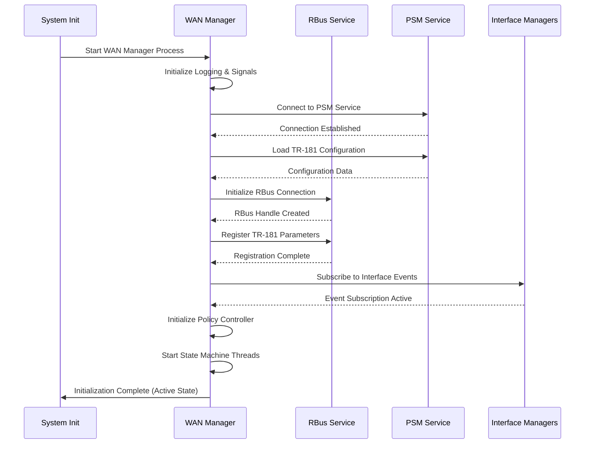

**Interface Selection Call Flow:**

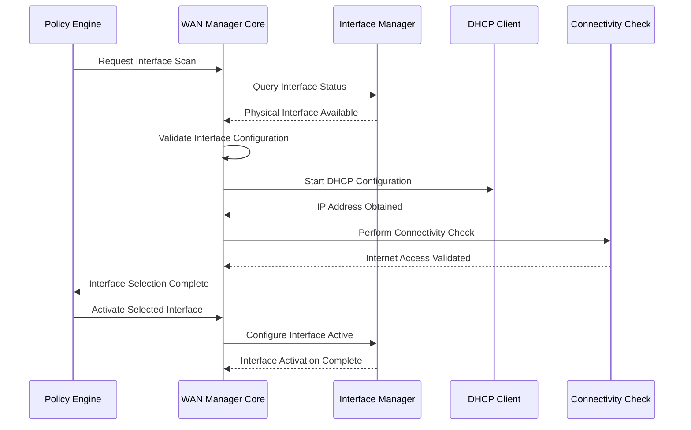

**Failover Call Flow:**

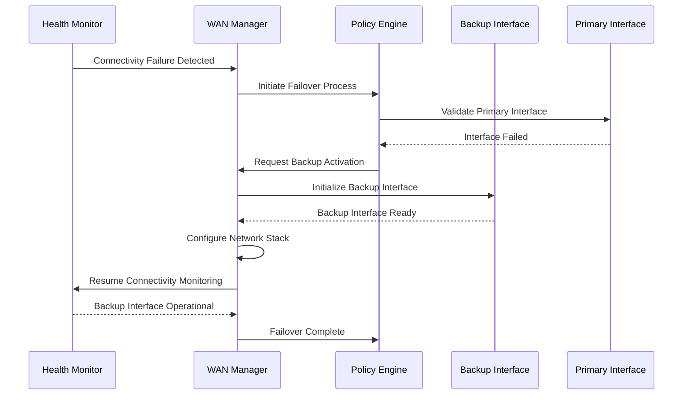

## TR‑181 Data Models

### Supported TR-181 Parameters

WAN Manager implements a comprehensive TR-181 data model that provides standardized access to WAN configuration and status information. The implementation follows BBF TR-181 specifications with custom RDK-B extensions to support advanced WAN management features and multi-interface scenarios.

### Object Hierarchy

```
Device.
└── X_RDK_WanManager.
    ├── Enable (boolean, R/W)
    ├── Policy (string, R/W) 
    ├── Data (string, R/W)
    ├── ResetActiveInterface (boolean, R/W)
    ├── AllowRemoteInterfaces (boolean, R/W)
    ├── ResetDefaultConfig (boolean, R/W)
    ├── RestorationDelay (unsignedInt, R/W)
    ├── WanFailoverData (string, R/W)
    ├── DnsConnectivityCheck.
    │   ├── Enable (boolean, R/W)
    │   ├── ServerURL (string, R/W)
    │   └── TestURL (string, R/W)
    ├── Group.{i}.
    │   ├── Enable (boolean, R/W)
    │   ├── Policy (string, R/W)
    │   ├── Priority (unsignedInt, R/W)
    │   ├── SelectionTimeout (unsignedInt, R/W)
    │   └── InterfaceList (string, R/W)
    └── Interface.{i}.
        ├── Enable (boolean, R/W)
        ├── Name (string, R)
        ├── DisplayName (string, R/W)
        ├── BaseInterface (string, R/W)
        ├── Type (string, R/W)
        ├── Priority (unsignedInt, R/W)
        ├── Group (unsignedInt, R/W)
        ├── Status (string, R)
        ├── OperationalStatus (string, R)
        ├── LinkStatus (string, R)
        ├── PhyStatus (string, R)
        ├── Selection.
        │   ├── Enable (boolean, R/W)
        │   ├── Status (string, R)
        │   ├── ActiveLink (boolean, R)
        │   └── Timeout (unsignedInt, R/W)
        └── VirtualInterface.{i}.
            ├── Enable (boolean, R/W)
            ├── Name (string, R)
            ├── Alias (string, R/W)
            ├── VLANID (unsignedInt, R/W)
            ├── Priority (unsignedInt, R/W)
            ├── Status (string, R)
            ├── IPInterface (string, R/W)
            ├── PPPInterface (string, R/W)
            └── Marking.
                ├── SKBPort (unsignedInt, R/W)
                └── EthernetPriorityMark (int, R/W)
```

### Parameter Definitions

**Core Parameters:**

| Parameter Path | Data Type | Access | Default Value | Description | BBF Compliance |
|----------------|-----------|--------|---------------|-------------|----------------|
| `Device.X_RDK_WanManager.Enable` | boolean | R/W | `true` | Enables or disables the WAN Manager service. When false, all WAN interface management operations cease and interfaces remain in current state. | Custom Extension |
| `Device.X_RDK_WanManager.Policy` | string | R/W | `"FIXED_MODE"` | Specifies the global WAN selection policy. Valid values: FIXED_MODE_ON_BOOTUP(1), FIXED_MODE(2), PRIMARY_PRIORITY_ON_BOOTUP(3), PRIMARY_PRIORITY(4), MULTIWAN_MODE(5), AUTOWAN_MODE(6), PARALLEL_SCAN(7) | Custom Extension |
| `Device.X_RDK_WanManager.Data` | string | R/W | `""` | JSON-formatted configuration data for WebConfig integration and bulk parameter operations. Contains serialized WAN Manager configuration state. | Custom Extension |
| `Device.X_RDK_WanManager.ResetActiveInterface` | boolean | R/W | `false` | Triggers reset of currently active WAN interface and forces policy re-evaluation. Self-clearing parameter that returns to false after execution. | Custom Extension |
| `Device.X_RDK_WanManager.AllowRemoteInterfaces` | boolean | R/W | `false` | Enables support for remote WAN interfaces (e.g., through bridge interfaces or tunnels) in addition to local physical interfaces. | Custom Extension |
| `Device.X_RDK_WanManager.RestorationDelay` | unsignedInt | R/W | `60` | Time delay in seconds before attempting to restore a previously failed primary interface. Range: 0-3600 seconds. | Custom Extension |
| `Device.X_RDK_WanManager.Interface.{i}.Name` | string | R | `[Generated]` | Read-only interface name assigned by system (e.g., "erouter0", "wwan0"). Automatically generated based on interface type and system configuration. | Custom Extension |
| `Device.X_RDK_WanManager.Interface.{i}.BaseInterface` | string | R/W | `""` | Physical interface name this WAN interface is associated with (e.g., "Device.Ethernet.Interface.1", "Device.X_CISCO_COM_CableModem.Interface.1"). | Custom Extension |
| `Device.X_RDK_WanManager.Interface.{i}.Status` | string | R | `"Disabled"` | Current operational status of WAN interface. Values: Disabled, Initialising, Validating, Valid, Up, Invalid, Standby. | Custom Extension |
| `Device.X_RDK_WanManager.Interface.{i}.Selection.ActiveLink` | boolean | R | `false` | Indicates if this interface is currently the active WAN interface providing internet connectivity to the device. | Custom Extension |

**Interface Group Parameters:**

| Parameter Path | Data Type | Access | Default Value | Description | BBF Compliance |
|----------------|-----------|--------|---------------|-------------|----------------|
| `Device.X_RDK_WanManager.Group.{i}.Policy` | string | R/W | `"AUTOWAN_MODE"` | Selection policy for this interface group. Allows different policies for different groups of interfaces enabling complex failover scenarios. | Custom Extension |
| `Device.X_RDK_WanManager.Group.{i}.SelectionTimeout` | unsignedInt | R/W | `120` | Maximum time in seconds for interface selection process within this group before timeout. Range: 30-600 seconds. | Custom Extension |
| `Device.X_RDK_WanManager.Group.{i}.InterfaceList` | string | R/W | `""` | Comma-separated list of interface indices that belong to this group for policy-based selection and failover management. | Custom Extension |

**Virtual Interface Parameters:**

| Parameter Path | Data Type | Access | Default Value | Description | BBF Compliance |
|----------------|-----------|--------|---------------|-------------|----------------|
| `Device.X_RDK_WanManager.Interface.{i}.VirtualInterface.{j}.VLANID` | unsignedInt | R/W | `0` | VLAN ID for tagged traffic on this virtual interface. Value 0 indicates untagged traffic. Range: 0-4094. | Custom Extension |
| `Device.X_RDK_WanManager.Interface.{i}.VirtualInterface.{j}.IPInterface` | string | R/W | `""` | Reference to Device.IP.Interface object for IP layer configuration of this virtual interface. | Custom Extension |
| `Device.X_RDK_WanManager.Interface.{i}.VirtualInterface.{j}.PPPInterface` | string | R/W | `""` | Reference to Device.PPP.Interface object for PPP layer configuration (PPPoE/PPPoA). | Custom Extension |

**Custom Extensions:**

WAN Manager implements several custom TR‑181 extensions beyond standard BBF specifications to support RDK-B specific functionality and advanced WAN management features.

- **WebConfig Integration**: Data parameter provides JSON-formatted bulk configuration support for cloud-based device management and zero-touch provisioning scenarios
- **Multi-Group Policy Support**: Group objects enable complex failover scenarios with different policies running on different interface groups simultaneously
- **Advanced Interface Selection**: Custom selection status parameters provide detailed visibility into policy decision-making processes for troubleshooting and optimization
- **Telemetry Integration**: Extended status parameters support comprehensive telemetry data collection for network operations and performance monitoring

### Parameter Registration and Access

- **Implemented Parameters**: WAN Manager registers all Device.X_RDK_WanManager.* parameters with the CCSP message bus through RBus IPC mechanisms, providing both get/set access and event notifications for parameter changes
- **Parameter Registration**: Uses RBus element registration for efficient parameter access with subscription-based notifications. All parameters support both synchronous get/set operations and asynchronous event-driven updates
- **Access Mechanism**: Other RDK-B components access parameters through standard CCSP message bus calls or RBus direct calls. WebConfig framework uses bulk data access through the Data parameter for efficient configuration management
- **Validation Rules**: String parameters validate against enumerated values, integer parameters enforce range constraints, and boolean parameters provide atomic state changes with immediate effect on WAN Manager behavior

## Internal Modules

WAN Manager is architected as a collection of specialized modules, each handling specific aspects of WAN interface management, policy execution, and system integration. The modular design enables maintainable code organization while supporting complex interactions between different functional areas.

| Module/Class | Description | Key Files |
|-------------|------------|-----------|
| **Main Controller** | Central coordination module that initializes all subsystems, manages global configuration, and orchestrates communication between different modules. Handles system-level events and maintains overall service lifecycle. | `wanmgr_main.c`, `wanmgr_core.c`, `wanmgr_controller.c` |
| **Data Management Layer** | Thread-safe data access layer providing centralized storage for interface configuration, status information, and policy parameters. Implements mutex-protected operations and persistent storage integration. | `wanmgr_data.c`, `wanmgr_data.h` |
| **Policy Engine Framework** | Modular policy implementation framework that supports multiple policy types with pluggable algorithms. Each policy runs as an independent state machine with its own decision logic and interface selection criteria. | `wanmgr_controller.c`, `wanmgr_policy_*_impl.c` |
| **Interface State Machine** | Individual interface lifecycle management handling VLAN configuration, IP address assignment, connectivity validation, and status reporting. Manages complex state transitions during interface bring-up and teardown. | `wanmgr_interface_sm.c`, `wanmgr_interface_sm.h` |
| **Failover Management** | High-level failover coordination between interface groups and backup interface management. Handles restoration logic, delay timers, and cross-group failover scenarios for maximum reliability. | `wanmgr_wan_failover.c`, `wanmgr_wan_failover.h` |
| **Network Configuration** | Low-level network stack configuration including DHCP client management, IPv4/IPv6 dual-stack support, VLAN tagging, and routing table updates. Integrates with system networking components. | `wanmgr_dhcpv4_apis.c`, `wanmgr_dhcpv6_apis.c`, `wanmgr_net_utils.c` |
| **IPC Communication Layer** | RBus and DBus communication handling for TR-181 parameter access, event notifications, and inter-component messaging. Provides abstraction layer for different IPC mechanisms. | `wanmgr_rbus_handler_apis.c`, `wanmgr_rdkbus_utils.c`, `wanmgr_ssp_messagebus_interface.c` |
| **Telemetry & Monitoring** | Comprehensive telemetry data collection, event reporting, and health monitoring. Integrates with T2 telemetry framework and provides detailed logging for troubleshooting and analytics. | `wanmgr_telemetry.c`, `wanmgr_t2_telemetry.c`, `wanmgr_utils.c` |
| **WebConfig Integration** | Cloud-based configuration management through WebConfig framework supporting bulk parameter updates, configuration validation, and transaction rollback capabilities. | `wanmgr_webconfig_apis.c`, `wanmgr_webconfig.c` |

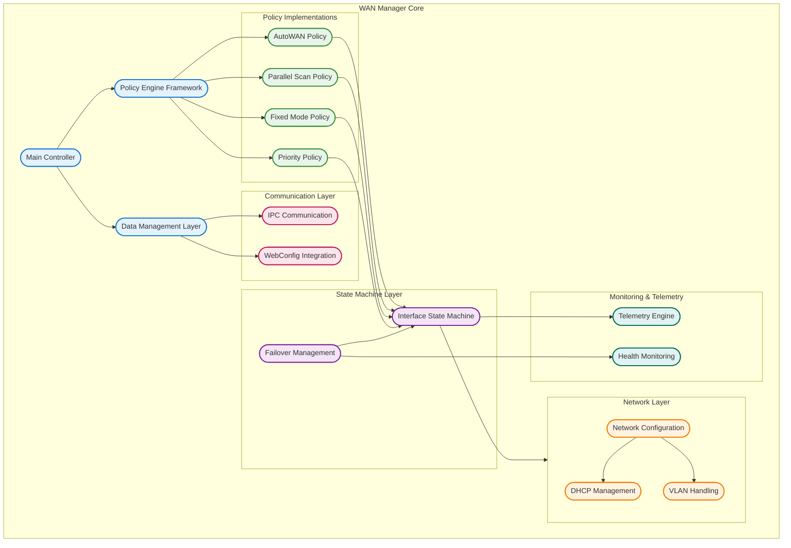

## Component Interactions

WAN Manager serves as a central orchestrator in the RDK-B ecosystem, coordinating with multiple middleware components, HAL layers, and external systems to provide comprehensive WAN connectivity management. The component's interaction patterns are designed for resilience, scalability, and real-time responsiveness to network conditions.

```mermaid
flowchart TD
    subgraph ExternalSystems["External Systems"]
        HeadEnd[Cloud Management/HeadEnd]
        RemoteMgmt[TR-069 ACS/Remote Management] 
        ISPInfra[ISP Network Infrastructure]
    end
    
    subgraph RDKBMiddleware["RDK-B Middleware Layer"]
        WanManager[WAN Manager]
        
        subgraph CoreComponents["Core RDK-B Components"]
            PandM[P&M Component]
            PSM[PSM Service]
            VlanMgr[VLAN Manager]
            DHCPMgr[DHCP Manager]
            WebConfig[WebConfig Framework]
        end
        
        subgraph InterfaceComponents["Interface Management"]
            DOCSISMgr[DOCSIS Manager]
            EthernetMgr[Ethernet Manager] 
            CellularMgr[Cellular Manager]
            GPONMgr[GPON Manager]
        end
        
        subgraph MonitoringComponents["Monitoring & Services"]
            Telemetry[Telemetry/T2]
            LoggingService[RDK Logger]
            FirewallMgr[Firewall Manager]
            CaptivePortal[Captive Portal]
        end
    end
    
    subgraph HALPlatform["HAL/Platform Layer"]
        PlatformHAL[Platform HAL]
        NetworkHAL[Network HAL]
        LinuxNetwork[Linux Networking Stack]
        SystemServices[System Services/systemd]
    end

    HeadEnd -->|WebConfig HTTPS| WebConfig
    RemoteMgmt -->|TR-181 Parameters| PandM
    
    WebConfig <-->|RBus JSON Config| WanManager
    PandM <-->|CCSP Bus TR-181| WanManager
    PSM <-->|Parameter Storage| WanManager
    
    WanManager <-->|RBus Interface Events| DOCSISMgr
    WanManager <-->|RBus Interface Events| EthernetMgr
    WanManager <-->|RBus Interface Events| CellularMgr
    WanManager <-->|RBus Interface Events| GPONMgr
    
    WanManager <-->|VLAN Configuration| VlanMgr
    WanManager <-->|DHCP Client Control| DHCPMgr
    
    WanManager -->|Telemetry Events| Telemetry
    WanManager -->|Log Messages| LoggingService
    WanManager -->|WAN Status Events| FirewallMgr
    WanManager -->|Connectivity Status| CaptivePortal
    
    WanManager -->|HAL API Calls| PlatformHAL
    WanManager -->|Network Interface Control| NetworkHAL
    WanManager -->|Network Configuration| LinuxNetwork
    WanManager <-->|Service Control| SystemServices
    
    WanManager <-->|Internet Connectivity| ISPInfra

    classDef external fill:#fff3e0,stroke:#ef6c00,stroke-width:2px
    classDef wanmgr fill:#e1f5fe,stroke:#0277bd,stroke-width:3px
    classDef core fill:#e8f5e8,stroke:#2e7d32,stroke-width:2px
    classDef interface fill:#f3e5f5,stroke:#7b1fa2,stroke-width:2px
    classDef monitoring fill:#e0f2f1,stroke:#00695c,stroke-width:2px
    classDef hal fill:#fce4ec,stroke:#c2185b,stroke-width:2px
    
    class HeadEnd,RemoteMgmt,ISPInfra external
    class WanManager wanmgr
    class PandM,PSM,VlanMgr,DHCPMgr,WebConfig core
    class DOCSISMgr,EthernetMgr,CellularMgr,GPONMgr interface
    class Telemetry,LoggingService,FirewallMgr,CaptivePortal monitoring
    class PlatformHAL,NetworkHAL,LinuxNetwork,SystemServices hal
```

### Interaction Matrix

| Target Component/Layer | Interaction Purpose | IPC Mechanism | Message Format | Communication Pattern | Key APIs/Endpoints |
|------------------------|-------------------|---------------|----------------|---------------------|------------------|
| **RDK-B Middleware Components** |
| P&M Component | TR-181 parameter access and device configuration management | CCSP Message Bus/RBus | CCSP Binary Protocol/RBus JSON | Request-Response/Event Subscription | `CcspBaseIf_getParameterValues()`, `rbus_get()`, `rbus_set()` |
| PSM Service | Persistent parameter storage and configuration persistence | CCSP Message Bus | Binary CCSP Protocol | Synchronous Request-Response | `PSM_Set_Record_Value2()`, `PSM_Get_Record_Value2()` |
| VLAN Manager | VLAN configuration and tagging for WAN interfaces | RBus | JSON Messages | Request-Response/Event Notifications | `rbus_call("Device.X_RDK_Vlan.Interface.Add")`, VLAN create/delete events |
| DHCP Manager | IP address acquisition and DHCP client lifecycle management | RBus/System Events | JSON/sysevent messages | Asynchronous Event-Driven | `rbus_call("Device.DHCPv4.Client.{i}.Renew")`, sysevent DHCP status |
| WebConfig Framework | Bulk configuration management and cloud synchronization | RBus/Shared Memory | JSON Configuration Blobs | Transaction-based/Bulk Updates | `webconfig_set_data()`, `webconfig_get_data()`, config validation callbacks |
| **Interface Managers** |
| DOCSIS Manager | DOCSIS modem status monitoring and configuration | RBus | JSON Status Messages | Event-Driven Subscription | `Device.X_CISCO_COM_CableModem.Interface.{i}.Status`, PHY status events |
| Ethernet Manager | Ethernet interface status and link monitoring | RBus | JSON Link Status | Event Subscription/Polling | `Device.Ethernet.Interface.{i}.Status`, link up/down events |
| Cellular Manager | Cellular modem connectivity and signal monitoring | RBus | JSON Modem Status | Event-Driven/Status Polling | `Device.Cellular.Interface.{i}.Status`, signal strength, registration events |
| **System & HAL Layers** |
| Platform HAL | Device-specific operations and hardware abstraction | Direct Function Calls | C Structure Parameters | Synchronous Function Calls | `platform_hal_GetDeviceConfigStatus()`, `platform_hal_setLED()` |
| Network HAL | Network interface control and configuration | Direct Function Calls | C Structures/Network Config | Synchronous API Calls | `nethal_addInterface()`, `nethal_setInterfaceStatus()` |
| Linux Networking | System-level network configuration and routing | System Calls/Netlink | Netlink Messages/ioctl | System Call Interface | `ip route add/del`, `iptables` rules, interface configuration |
| System Services | Service lifecycle and dependency management | DBus/systemd | DBus Messages | Service Control Protocol | `systemctl start/stop`, service dependency notifications |
| **External Systems** |
| Cloud/HeadEnd | Device management and configuration distribution | HTTPS/WebConfig | JSON/XML Payloads | RESTful HTTP/Secure Transport | `POST /api/v1/device/config`, `GET /api/v1/device/status` |

**Events Published by WAN Manager:**

| Event Name | Event Topic/Path | Trigger Condition | Payload Format | Subscriber Components |
|------------|-----------------|-------------------|----------------|---------------------|
| WAN Interface Up | `Device.X_RDK_WanManager.Interface.{i}.Status` | WAN interface successfully configured and connectivity validated | JSON: `{status:"Up", interface_id, timestamp, ip_info}` | Firewall Manager, Captive Portal, P&M, Telemetry |
| WAN Interface Down | `Device.X_RDK_WanManager.Interface.{i}.Status` | WAN interface failure or disconnection detected | JSON: `{status:"Down", interface_id, timestamp, error_code}` | Firewall Manager, Interface Managers, Telemetry |
| Failover Event | `Device.X_RDK_WanManager.ActiveInterface.Change` | Active WAN interface changed due to failover | JSON: `{old_interface, new_interface, timestamp, reason}` | All middleware components requiring WAN status |
| Configuration Update | `Device.X_RDK_WanManager.Config.Changed` | WAN Manager configuration updated via WebConfig | JSON: `{config_version, changed_parameters, timestamp}` | Interface Managers, Dependent Services |

**Events Consumed by WAN Manager:**

| Event Source | Event Topic/Path | Purpose | Expected Payload | Handler Function |
|-------------|-----------------|---------|------------------|------------------|
| DOCSIS Manager | `Device.X_CISCO_COM_CableModem.Interface.{i}.Status` | Monitor DOCSIS physical interface status changes | JSON: `{status, signal_level, timestamp}` | `WanMgr_HandleDOCSISStatusEvent()` |
| Ethernet Manager | `Device.Ethernet.Interface.{i}.Status` | Monitor Ethernet link status and configuration changes | JSON: `{link_status, speed, duplex, timestamp}` | `WanMgr_HandleEthernetLinkEvent()` |
| DHCP Manager | `Device.DHCPv4.Client.{i}.IPAddress` | Track IP address assignment and DHCP lease status | JSON: `{ip_address, lease_time, dns_servers}` | `WanMgr_HandleDHCPLeaseEvent()` |
| System Events | `wan-status`, `wan_service-status` | System-level WAN service status notifications | String: `started/stopped/error` | `WanMgr_HandleSystemEvent()` |

### IPC Flow Patterns

**Primary IPC Flow - Interface Configuration:**

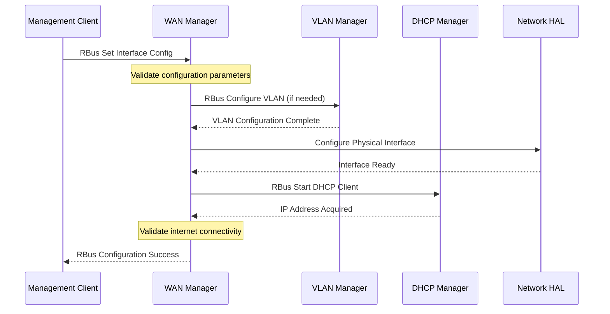

**Event Notification Flow:**

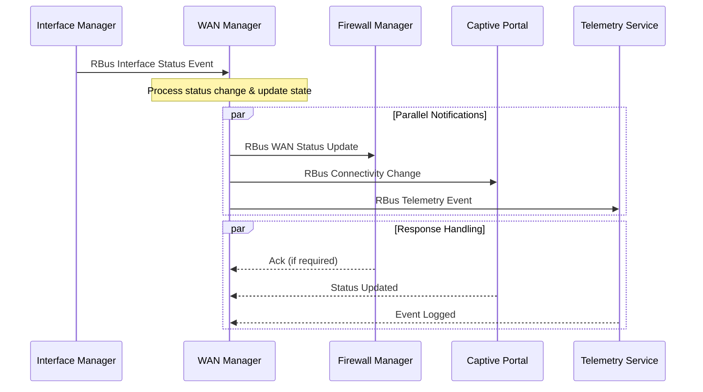

**Failover Coordination Flow:**

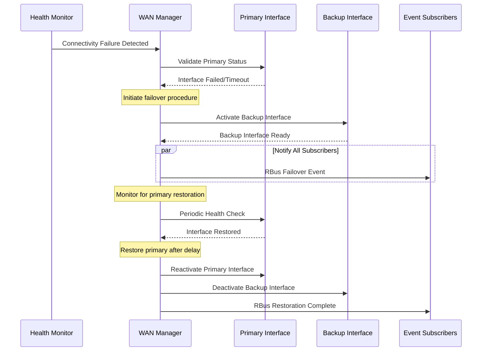

## Implementation Details

### Major HAL APIs Integration

WAN Manager integrates with multiple HAL layers to abstract platform-specific functionality while maintaining consistent behavior across different hardware implementations. The HAL integration focuses on network interface control, platform-specific configuration, and hardware status monitoring.

**Core HAL APIs:**

| HAL API | Purpose | Parameters | Return Values | Implementation File |
|---------|---------|------------|---------------|-------------------|
| `platform_hal_GetDeviceConfigStatus()` | Retrieve device configuration and operational status for platform initialization | `char *status` (output buffer), `int size` (buffer size) | `RETURN_OK` (0) on success, `RETURN_ERR` (-1) on failure | `wanmgr_net_utils.c` |
| `nethal_addInterface()` | Create and configure network interface with specified parameters | `char *ifname`, `nethal_param_t *config` | `NETHAL_SUCCESS` (0), `NETHAL_ERROR` (-1) | `wanmgr_interface_sm.c` |
| `nethal_setInterfaceStatus()` | Control interface operational state (up/down) | `char *ifname`, `nethal_status_t status` | `NETHAL_SUCCESS` (0), `NETHAL_ERROR` (-1) | `wanmgr_interface_sm.c` |
| `dhcpv4c_get_ert_lease_data()` | Retrieve DHCP lease information and client status | `dhcpv4c_ip_t *lease_data` | `DHCPV4C_OK` (0), `DHCPV4C_ERROR` (-1) | `wanmgr_dhcpv4_apis.c` |
| `sysevent_set()` | Set system event values for inter-component communication | `int fd`, `token_t token`, `char *name`, `char *value`, `int flags` | `0` on success, `-1` on error | `wanmgr_sysevents.c` |
| `syscfg_get()` | Retrieve persistent configuration values | `char *ns`, `char *name`, `char *out_value`, `int out_sz` | `0` on success, `-1` on error | `wanmgr_data.c` |

### Key Implementation Logic

- **State Machine Engine**: Core state machine implementation resides in `wanmgr_interface_sm.c` with comprehensive state transition handling for interface lifecycle management. The engine supports concurrent state machines per interface with mutex-protected state transitions and event-driven processing.

  - Main implementation in `wanmgr_interface_sm.c` with `WanMgr_IfaceSM_Init()` and state transition functions
  - State transition handlers in `wanmgr_interface_sm.c` with dedicated functions for each state (e.g., `wan_state_obtaining_ip_addresses()`, `wan_state_dual_stack_active()`)
  
- **Policy Decision Engine**: Advanced policy implementation in multiple files (`wanmgr_policy_*_impl.c`) with pluggable algorithms for different selection strategies. Each policy maintains its own state machine and decision criteria.

  - AutoWAN policy in `wanmgr_policy_autowan_impl.c` with intelligent interface discovery and validation
  - Parallel scan policy in `wanmgr_policy_parallel_scan_impl.c` for concurrent interface evaluation
  - Fixed mode policies in `wanmgr_policy_fm_impl.c` for static interface assignments
  
- **Event Processing**: Hardware and software events processed through `wanmgr_sysevents.c` and RBus handlers with asynchronous event queuing and priority-based processing.

  - Hardware interrupt handling through HAL callbacks and system event notifications
  - Event queue management with priority levels and timeout handling
  - Asynchronous event processing with worker thread pools for non-blocking operation

- **Error Handling Strategy**: Comprehensive error detection and recovery mechanisms with detailed logging and automatic retry logic for failed operations.

  - HAL error code mapping with specific recovery actions for different failure types
  - Recovery mechanisms for failed transitions including interface reset and policy re-evaluation
  - Timeout handling and exponential backoff retry logic for transient failures

- **Logging & Debugging**: Multi-level logging system with component-specific categories and runtime verbosity control for production troubleshooting.

  - State transition logging with detailed state change information and timing data
  - HAL API call tracing with parameter logging and return code analysis
  - Debug hooks for troubleshooting connectivity issues including packet capture integration

### Key Configuration Files

| Configuration File | Purpose | Key Parameters | Default Values | Override Mechanisms |
|--------------------|---------|---------------|----------------|--------------------|
| `RdkWanManager.xml` | TR-181 data model definitions and parameter mappings | Interface objects, Policy enumerations, Group configurations | Policy: FIXED_MODE, Enable: true, Timeout: 120s | TR-181 parameter sets, WebConfig updates |
| `/opt/secure/data/syscfg.db` | Persistent system configuration storage | `selected_wan_mode`, `last_wan_mode`, `wan_physical_ifname` | selected_wan_mode: 2 (DOCSIS), last_wan_mode: 2 | syscfg_set() API calls, factory reset |
| `/etc/wanmanager/wanmanager.conf` | Runtime configuration and policy parameters | Interface priorities, timeout values, policy-specific settings | interface_timeout: 60s, health_check_interval: 30s | Configuration file editing, WebConfig bulk updates |
| `/tmp/system_defaults` | Default system configuration values | Default interface configurations, fallback policy settings | Default interface priorities, backup interface settings | System initialization scripts, factory defaults |
| `/etc/systemd/system/wanmanager.service` | Systemd service configuration | Service dependencies, startup parameters, environment variables | After: rbus.service, ccsp-psm.service | Systemd service file modification, runtime overrides |
| `/usr/ccsp/tr181/RdkWanManager_v2.xml` | Enhanced TR-181 model with unification features | Extended interface objects, group management parameters | Supports up to 16 interfaces, 4 interface groups | XML file updates, build-time configuration |

**Configuration File Dependencies:**
- `RdkWanManager.xml` provides the foundational TR-181 parameter structure and is loaded during component initialization
- `syscfg.db` maintains persistent state across reboots and is critical for maintaining interface selection history
- Runtime configuration files in `/etc/wanmanager/` allow for deployment-specific tuning without code changes
- Systemd service configuration ensures proper startup ordering and resource allocation for reliable service operation

**Configuration Override Hierarchy:**
1. WebConfig cloud-based updates (highest priority)
2. TR-181 parameter sets through management interfaces  
3. Runtime configuration file modifications
4. System default values (lowest priority)

This hierarchical approach ensures that cloud-based management can override local settings while maintaining fallback configurations for offline operation.
