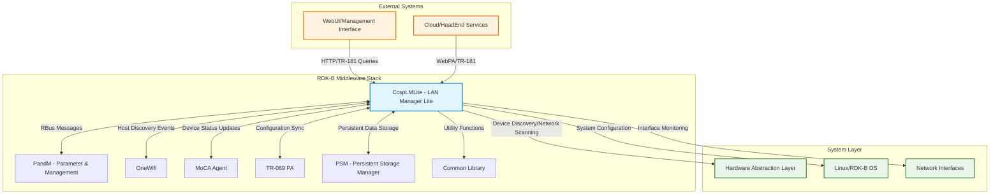
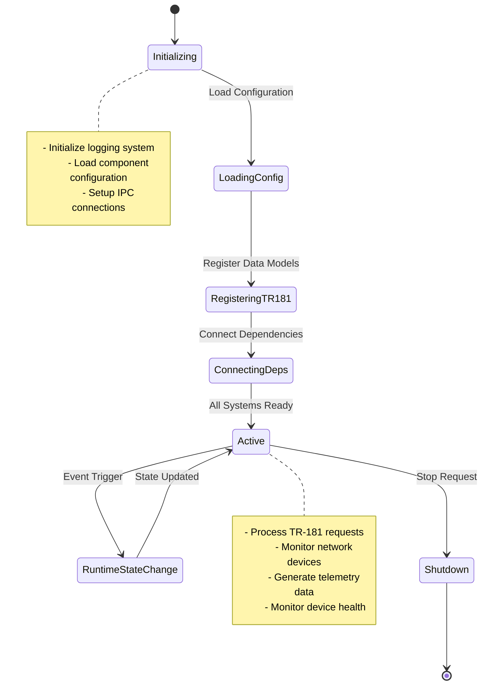
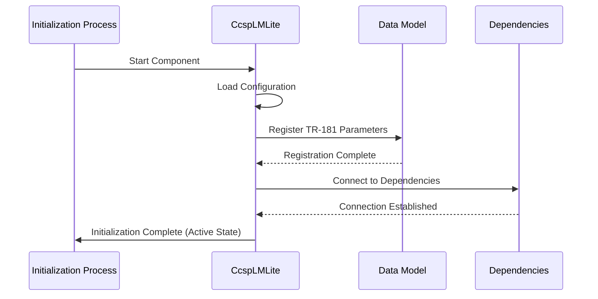
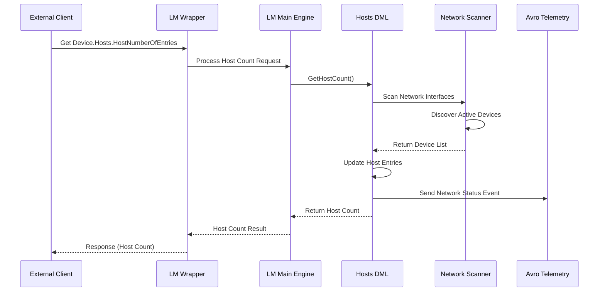
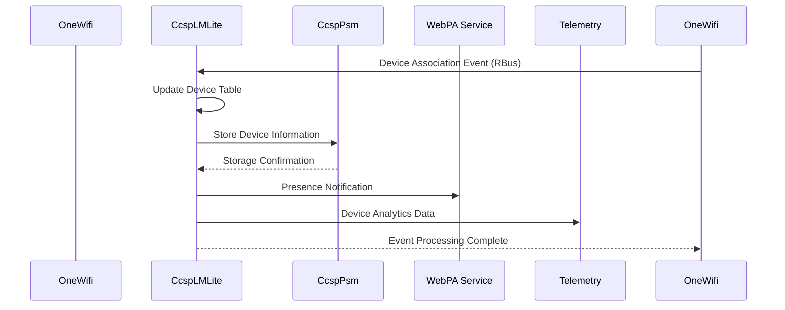
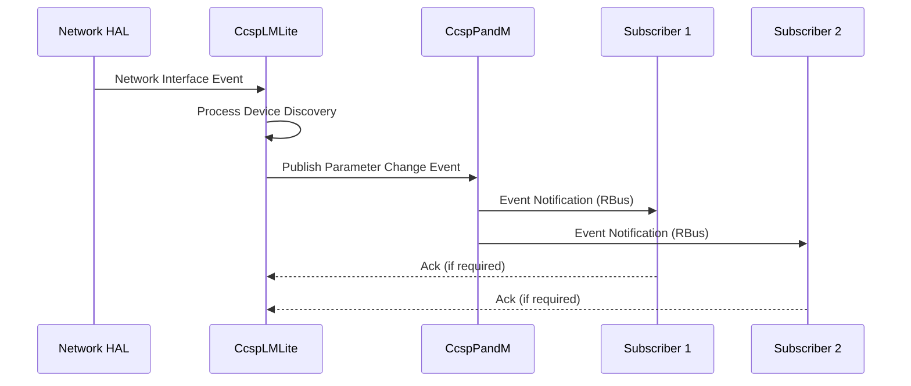

# CcspLMLite Documentation

CcspLMLite (LAN Manager Lite) is the RDK-B component responsible for managing and monitoring LAN-side network devices and hosts connected to the gateway. This component serves as the primary interface for discovering, tracking, and reporting network connectivity status, device information, and traffic analytics for connected devices across WiFi, Ethernet, and MoCA interfaces.
The component provides comprehensive host management capabilities including device discovery, presence detection, network traffic monitoring, and telemetry reporting. It implements TR-181 data model parameters for hosts management and integrates with WebPA for cloud-based management and monitoring. CcspLMLite acts as a centralized hub for collecting network device information from various sources and presenting a unified view through standardized TR-181 interfaces.

As a core RDK-B service, CcspLMLite enables advanced features like parental controls, device management, network analytics, and presence-based automation by maintaining real-time awareness of all connected devices and their network activity patterns.



**Key Features & Responsibilities**: 

- **Host Discovery & Management**: Automatically discovers and tracks all devices connected to LAN interfaces including WiFi, Ethernet, and MoCA with real-time status monitoring and device profiling capabilities
- **Network Traffic Analytics**: Collects and reports detailed network traffic statistics per device including bandwidth usage, connection patterns, and performance metrics for capacity planning and troubleshooting
- **Device Presence Detection**: Implements intelligent presence detection algorithms using multiple detection methods to determine device online/offline status with configurable sensitivity and notification capabilities  
- **TR-181 Data Model Implementation**: Provides comprehensive TR-181 compliant interface for Device.Hosts object hierarchy enabling standardized access to host information through BBF-specified parameters
- **WebPA Integration**: Seamlessly integrates with WebPA cloud management protocol for remote device monitoring, configuration updates, and telemetry data upload to headend management systems
- **Cross-Interface Synchronization**: Coordinates device information across multiple network interfaces ensuring consistent device tracking and preventing duplicate entries across WiFi, MoCA, and Ethernet connections


## Design

CcspLMLite follows a modular, event-driven architecture designed to efficiently manage network device discovery, monitoring, and reporting across heterogeneous network interfaces. The design emphasizes scalability, real-time responsiveness, and data consistency while maintaining minimal system resource utilization. The architecture separates concerns between device discovery, data model management, telemetry reporting, and external communications through well-defined interfaces and standardized protocols.

The component operates as a central aggregation point for network device information, collecting data from multiple sources including WiFi association events, DHCP lease notifications, ARP table monitoring, and interface-specific discovery mechanisms. The design implements intelligent caching and synchronization strategies to maintain accurate device state information while minimizing network scanning overhead. Event-driven updates ensure real-time responsiveness to network changes while batch processing optimizes telemetry data transmission and reduces system load.

The northbound interface provides TR-181 compliant access through RBus messaging, enabling seamless integration with other RDK-B components and external management systems. The southbound interface abstracts network interface interactions through HAL APIs and system-level networking calls. Data persistence is achieved through integration with the Persistent Storage Manager (PSM) ensuring device information survives system reboots. WebPA integration enables cloud-based management and telemetry reporting following industry-standard protocols and data formats including Avro serialization for efficient data transmission.

```mermaid
graph TD
    subgraph CcspLMLiteContainer ["CcspLMLite Container"]
        subgraph LMCore ["LM Core Module"]
            LMMain[lm_main.c - Main Host Manager]
            LMUtil[lm_util.c - Utility Functions]
            LMWrapper[lm_wrapper.c - API Wrapper]
            LMApi[lm_api.c - Public API Interface]
        end
        
        subgraph HostsModule ["Hosts Data Model"]
            HostsDML[cosa_hosts_dml.c - Hosts TR-181 Implementation]
            XHostsDML[cosa_xhosts_dml.c - Extended Hosts]
        end
        
        subgraph ManagementModule ["Management Server Module"]
            MgmtDML[cosa_managementserver_dml.c]
            MgmtAPIs[cosa_managementserver_apis.c]
        end
        
        subgraph ReportsModule ["Network Reports & Analytics"]
            ReportsInternal[cosa_reports_internal.c]
            NDStatus[network_devices_status.c]
            NDTraffic[network_devices_traffic.c]
            WANTraffic[cosa_wantraffic_api.c]
        end
        
        subgraph WebPAModule ["WebPA Interface"]
            WebPAInterface[webpa_interface.c]
            WebPAPD[webpa_pd_with_seshat.c]
            PresenceDetection[device_presence_detection.c]
        end
        
        subgraph RBusModule ["RBus Communication"]
            RBusAPIs[wtc_rbus_apis.c]
            RBusHandler[wtc_rbus_handler_apis.c]
        end
        
        subgraph SSP ["Service Support Platform"]
            SSPMain[ssp_main.c - Process Entry Point]
        end
    end
    
    subgraph ExternalDependencies ["External Dependencies"]
        RBusMessageBus[RBus Message Bus]
        PersistentStorage[(PSM - Persistent Storage)]
        AvroTelemetry[(Avro Telemetry System)]
        ConfigFiles[(Configuration Files)]
    end
    
    SSPMain --> LMMain
    RBusAPIs <--> RBusMessageBus
    
    LMMain --> HostsDML
    LMMain --> MgmtDML
    LMMain --> ReportsInternal
    LMMain --> WebPAInterface
    
    HostsDML --> LMUtil
    WebPAInterface --> PresenceDetection
    ReportsInternal --> NDStatus
    ReportsInternal --> NDTraffic
    
    NDStatus --> AvroTelemetry
    NDTraffic --> AvroTelemetry
    WANTraffic --> AvroTelemetry
    
    LMWrapper --> PersistentStorage
    SSPMain --> ConfigFiles
    
    classDef core fill:#e1f5fe,stroke:#0277bd,stroke-width:2px;
    classDef datamodel fill:#f3e5f5,stroke:#7b1fa2,stroke-width:2px;
    classDef reports fill:#fff3e0,stroke:#ef6c00,stroke-width:2px;
    classDef webpa fill:#e8f5e8,stroke:#2e7d32,stroke-width:2px;
    classDef external fill:#ffebee,stroke:#d32f2f,stroke-width:2px;
    
    class LMMain,LMUtil,LMWrapper,LMApi,SSPMain,SSPMessageBus,SSPAction core;
    class HostsDML,XHostsDML,MgmtDML,MgmtAPIs datamodel;
    class ReportsInternal,NDStatus,NDTraffic,WANTraffic reports;
    class WebPAInterface,WebPAPD,PresenceDetection webpa;
    class RBusMessageBus,PersistentStorage,AvroTelemetry,ConfigFiles external;
```



### Prerequisites and Dependencies

**RDK-B Platform and Integration Requirements (MUST):** 

- **Core DISTRO Features**: DISTRO_FEATURES += "rdk-b", "ccsp-lmlite", "webpa", "telemetry"
- **Build Dependencies**: ccsp-common-library, rbus (optional), avro-c, libsyswrapper, hal-wifi, hal-moca
- **RDK-B Components**: CcspPandMSsp (mandatory), CcspPsm (persistent storage), CcspCommonLibrary (utilities)
- **HAL Dependencies**: WiFi HAL APIs (minimum version 2.0), MoCA HAL APIs, Ethernet HAL interfaces  
- **Systemd Services**: CcspCrSsp.service, CcspPsmSsp.service must be active before CcspLMLite starts
- **Hardware Requirements**: Network interfaces (WiFi, Ethernet, MoCA), sufficient memory for device tracking tables
- **Message Bus**: RBus registration under com.cisco.spvtg.ccsp.lmlite namespace for enhanced performance
- **TR-181 Data Model**: Device.Hosts object hierarchy, Device.ManagementServer.ManageableDevice support
- **Configuration Files**: LMLite.XML for TR-181 parameter definitions, component configuration in /usr/ccsp/lmlite/
- **Startup Order**: Must initialize after network interfaces are available and PSM is running

**Build-Time Flags and Configuration:**

| Configure Option | DISTRO Feature | Build Flag | Purpose | Default |
|------------------|----------------|------------|---------|---------|
| `--enable-seshat` | `seshat` | `ENABLE_SESHAT` | Enable Seshat service discovery for WebPA/Parodus integration | Disabled |
| `--enable-wan-traffic-count-support` | N/A | `WAN_TRAFFIC_COUNT_SUPPORT` | Enable WAN traffic counting and monitoring capabilities | Disabled |
| `--enable-resourceoptimization` | N/A | `FEATURE_RESOURCE_OPTIMIZATION` | Optimize for memory-constrained environments by excluding non-essential features | Disabled |
| `--enable-unitTestDockerSupport` | N/A | `UNIT_TEST_DOCKER_SUPPORT` | Enable Docker-based unit testing framework | Disabled |
| `--enable-core-net-lib-feature-support` | N/A | `CORE_NET_LIB_FEATURE_SUPPORT` | Enable advanced networking library support | Disabled |

**Compile-Time Macros and Features:**

| Macro/Flag | DISTRO Feature | Purpose | Default | Impact |
|------------|----------------|---------|---------|--------|
| `MLT_ENABLED` | `mlt` | Memory Leak Tracking and debugging support | Disabled | Adds memory monitoring capabilities |
| `USE_SYSRES_MLT=1` | `mlt` | System resource monitoring with MLT | Disabled | Enhanced resource tracking |
| `FEATURE_SUPPORT_RDKLOG` | `rdklog` | RDK centralized logging framework integration | Enabled | Structured logging support |
| `FEATURE_SUPPORT_ONBOARD_LOGGING` | `onboard-logging` | On-device log collection and analysis | Disabled | Local diagnostics capability |
| `DEVICE_GATEWAY_ASSOCIATION_FEATURE` | N/A | Enable ManageableDevice TR-181 object support | Disabled | Remote device management |
| `NO_MOCA_FEATURE_SUPPORT` | `no-moca` | Disable MoCA interface support entirely | Disabled | Excludes MoCA discovery code |
| `RDKB_EXTENDER_ENABLED` | `extender` | Enable WiFi extender device discovery | Disabled | Mesh network support |
| `FEATURE_SUPPORT_MESH` | `mesh` | Enable mesh networking capabilities | Disabled | Advanced WiFi topology |
| `USE_NOTIFY_COMPONENT` | N/A | Enable external notification component integration | Disabled | Event subscription system |
| `VENDOR_CLASS_ID` | N/A | Enable vendor-specific device classification | Disabled | Enhanced device profiling |
| `UTC_ENABLE` | `utc` | Enable UTC timezone support for telemetry | Disabled | Timestamp standardization |
| `INCLUDE_BREAKPAD` | `breakpad` | Enable Google Breakpad crash reporting | Disabled | Advanced crash analysis |
| `WAN_FAILOVER_SUPPORTED` | `wan-failover` | Enable WAN failover detection and reporting | Disabled | Network redundancy support |

**Runtime Configuration Parameters:**

| Parameter | Configuration Source | Purpose | Default Value | Override Method |
|-----------|---------------------|---------|---------------|-----------------|
| `PresenceDetectEnabled` | syscfg | Enable/disable device presence detection | `false` | TR-181, syscfg CLI |
| `notify_presence_webpa` | syscfg | Send presence notifications to WebPA | `false` | TR-181, syscfg CLI |
| `ConfiguredMacListIsSet` | syscfg | Use configured MAC address whitelist | `false` | TR-181, syscfg CLI |
| `lan_ifname` | syscfg | Primary LAN interface name | `brlan0` | syscfg CLI |
| `lan_ipaddr` | syscfg | LAN network IP address | Auto-detected | syscfg CLI |
| `eth_wan_enabled` | syscfg | Enable Ethernet WAN detection | `false` | syscfg CLI |
| Host Discovery Period | Component config | Device scanning interval (seconds) | `30` | TR-181 parameters |
| Telemetry Reporting Period | Component config | Analytics upload interval (seconds) | `300` | TR-181 parameters |

**Platform-Specific Build Flags:**

| Platform | Build Flags | Purpose |
|----------|-------------|---------|
| HUB4 | `_HUB4_PRODUCT_REQ_` | HUB4-specific network interface handling |
| SR300 | `_SR300_PRODUCT_REQ_` | SR300 gateway-specific WAN detection |
| RDKB Global | `_RDKB_GLOBAL_PRODUCT_REQ_` | Generic RDKB platform optimizations |
| CBR2 | `_CBR2_PRODUCT_REQ_` | CBR2 cable modem specific features |
| Intel Puma7 | `INTEL_PUMA7` | Intel Puma7 chipset optimizations |
| Android Build | `_BUILD_ANDROID` | Android target compilation adjustments |
| EPON Support | `_ENABLE_EPON_SUPPORT_` | Ethernet Passive Optical Network support |

**Performance & Optimization (SHOULD):** 

- **Enhanced Features**: DISTRO_FEATURES += "mlt", "rdklog", "mesh", "extender"  
- **Recommended Hardware**: Multi-core processor for concurrent interface monitoring, SSD storage for improved I/O performance
- **Configuration Tuning**: Adjustable scanning intervals, configurable device timeout periods, optimized cache sizes
- **Monitoring Integration**: Integration with RDK telemetry framework, support for Avro-based data serialization

**Dependent Components:** 

- **OneWifi**: Relies on CcspLMLite for host association events and device presence information
- **CcspPandM**: Depends on Device.Hosts parameters for device management and parental control functionality  
- **Telemetry Services**: Network analytics and reporting systems consume device statistics from CcspLMLite
- **WebPA Services**: Remote management capabilities depend on device inventory and status from CcspLMLite

**Threading Model** 

CcspLMLite implements a multi-threaded architecture designed to handle concurrent network monitoring, data processing, and external communications without blocking critical operations.

- **Threading Architecture**: Multi-threaded with main event loop and specialized worker threads for different operational domains
- **Main Thread**: Handles TR-181 parameter requests, RBus message processing, and component lifecycle management
- **Worker Threads**: 
  - **Network Scanner Thread**: Performs periodic network interface scanning and device discovery operations
  - **Presence Detection Thread**: Monitors device connectivity status and triggers presence change notifications
  - **Telemetry Thread**: Processes and transmits network analytics data to cloud services and local collectors
  - **WebPA Event Thread**: Handles WebPA notifications and cloud communication events
- **Synchronization**: Uses mutex locks for shared data structures, condition variables for thread communication, and atomic operations for counters

### Component State Flow

**Initialization to Active State**

CcspLMLite follows a structured initialization sequence ensuring all dependencies are properly established before entering active monitoring mode. The component performs configuration loading, TR-181 parameter registration, network interface discovery, and external service connections in a predetermined order to guarantee system stability and data consistency.



**Runtime State Changes and Context Switching**

During normal operation, CcspLMLite responds to various network events and configuration changes that may affect its operational context and device tracking behavior.

**State Change Triggers:**

- Network interface up/down events causing rescan of device discovery mechanisms
- Configuration parameter changes affecting scanning intervals, presence detection sensitivity, or telemetry settings  
- External service availability changes (PSM reconnection, WebPA service restart) requiring connection re-establishment
- Resource constraint conditions triggering degraded mode operation with reduced scanning frequency

**Context Switching Scenarios:**

- Interface priority changes when primary network interface fails, switching to backup scanning methods
- Discovery mode transitions between active scanning and passive monitoring based on network load conditions
- Telemetry reporting context switches between real-time and batch modes based on cloud connectivity status

### Call Flow

**Initialization Call Flow:**



**Request Processing Call Flow:**



## TR‑181 Data Models

### Supported TR-181 Parameters

CcspLMLite implements comprehensive TR-181 data model support for device and host management following BBF TR-181 Issue 2 specifications. The component provides both standard BBF-defined parameters and vendor-specific extensions to support advanced RDK-B features including presence detection, network analytics, and cross-interface device correlation.

### Object Hierarchy

```
Device.
└── Hosts.
    ├── HostNumberOfEntries (unsignedInt, R)
    ├── X_CISCO_COM_ConnectedDeviceNumber (unsignedInt, R)
    ├── X_CISCO_COM_ConnectedWiFiNumber (unsignedInt, R)
    ├── X_RDKCENTRAL-COM_HostVersionId (unsignedInt, R)
    ├── X_RDKCENTRAL-COM_HostCountPeriod (unsignedInt, R/W)
    ├── X_RDKCENTRAL-COM_LMHost_Sync (unsignedInt, R/W)
    ├── X_RDKCENTRAL-COM_LMHost_Sync_From_MoCA (string, R/W)
    ├── X_RDKCENTRAL-COM_LMHost_Sync_From_WiFi (string, R/W)
    ├── X_RDKCENTRAL-COM_EthHost_Sync (string, R/W)
    ├── X_RDK_PresenceDetectEnable (boolean, R/W)
    ├── X_RDKCENTRAL-COM_WebPA_PresenceNotificationEnable (boolean, R/W)
    └── Host.{i}.
        ├── Alias (string, R/W)
        ├── PhysAddress (string, R)
        ├── IPAddress (string, R) 
        ├── DHCPClient (string, R)
        ├── AssociatedDevice (string, R)
        ├── Layer1Interface (string, R)
        ├── Layer3Interface (string, R)
        ├── HostName (string, R)
        ├── Active (boolean, R)
        ├── X_CISCO_COM_LastChange (dateTime, R)
        ├── X_CISCO_COM_RSSILevel (int, R)
        ├── X_RDKCENTRAL-COM_DeviceType (string, R)
        ├── X_RDKCENTRAL-COM_NetworkInterface (string, R)
        ├── X_RDKCENTRAL-COM_ConnectionStatus (string, R)
        ├── X_RDKCENTRAL-COM_OSType (string, R)
        └── X_RDKCENTRAL-COM_Parent (string, R)

Device.
└── ManagementServer.
    └── ManageableDevice.{i}.
        ├── Alias (string, R/W)
        ├── ManufacturerOUI (string, R)
        ├── SerialNumber (string, R)
        ├── ProductClass (string, R)
        └── Host (string, R)
```


## Internal Modules

CcspLMLite is organized into specialized modules responsible for different aspects of network device management, data model implementation, and external communications. Each module encapsulates specific functionality while maintaining clear interfaces for inter-module communication and data sharing.

| Module/Class | Description | Key Files |
|-------------|------------|-----------|
| **LM Core Engine** | Main orchestration engine managing device discovery, host tracking, and component lifecycle with centralized state management and event coordination | `lm_main.c`, `lm_main.h`, `lm_util.c`, `lm_wrapper.c` |
| **Hosts Data Model** | TR-181 Device.Hosts object implementation providing standardized interface for device information access with parameter validation and change notifications | `cosa_hosts_dml.c`, `cosa_hosts_dml.h`, `cosa_xhosts_dml.c` |
| **Network Analytics** | Traffic monitoring and device behavior analysis module collecting bandwidth statistics, connection patterns, and performance metrics for telemetry reporting | `network_devices_traffic.c`, `network_devices_status.c`, `cosa_reports_internal.c` |
| **WebPA Integration** | Cloud management interface handling WebPA protocol communications, device presence notifications, and telemetry data transmission to headend services | `webpa_interface.c`, `webpa_pd_with_seshat.c`, `device_presence_detection.c` |
| **Management Server** | ManageableDevice TR-181 object implementation tracking devices eligible for remote management with capability discovery and configuration synchronization | `cosa_managementserver_dml.c`, `cosa_managementserver_apis.c` |
| **RBus Communication** | High-performance message bus interface providing enhanced IPC capabilities with reduced latency and improved scalability for parameter access | `wtc_rbus_apis.c`, `wtc_rbus_handler_apis.c` |
| **Service Support Platform** | Process lifecycle management and message bus initialization providing component entry point, configuration loading, and system integration services | `ssp_main.c`, `ssp_messagebus_interface.c`, `ssp_action.c` |

```mermaid
flowchart TD
    subgraph CcspLMLite ["CcspLMLite Component"]
        SSPMain[SSP Main Process<br/>Component Entry Point]
        
        subgraph CoreEngine ["LM Core Engine"]
            LMMain[LM Main<br/>Device Discovery & Management]
            LMUtil[LM Utilities<br/>Helper Functions]
            LMWrapper[LM Wrapper<br/>API Abstraction]
        end
        
        subgraph DataModel ["TR-181 Data Models"]
            HostsDML[Hosts DML<br/>Device.Hosts Implementation]
            MgmtDML[Management DML<br/>ManageableDevice Objects]
        end
        
        subgraph Analytics ["Network Analytics"]
            NetworkStatus[Network Status<br/>Device State Tracking]
            TrafficMonitor[Traffic Monitor<br/>Bandwidth Analytics]
            Reports[Reports Engine<br/>Data Aggregation]
        end
        
        subgraph WebPAInteg ["WebPA Integration"]
            WebPAInterface[WebPA Interface<br/>Cloud Communications]
            PresenceDetect[Presence Detection<br/>Device Monitoring]
        end
    end
    
    SSPMain --> CoreEngine
    CoreEngine --> DataModel
    CoreEngine --> Analytics  
    CoreEngine --> WebPAInteg
    
    DataModel --> Analytics
    Analytics --> WebPAInteg
    
    classDef core fill:#e1f5fe,stroke:#0277bd,stroke-width:2px;
    classDef datamodel fill:#f3e5f5,stroke:#7b1fa2,stroke-width:2px;
    classDef analytics fill:#fff3e0,stroke:#ef6c00,stroke-width:2px;
    classDef webpa fill:#e8f5e8,stroke:#2e7d32,stroke-width:2px;
    
    class SSPMain,CoreEngine core;
    class DataModel datamodel;
    class Analytics analytics;
    class WebPAInteg webpa;
```




## Component Interactions

CcspLMLite maintains extensive interactions with RDK-B middleware components, system services, and external management systems to provide comprehensive network device management and monitoring capabilities. These interactions span multiple protocols and communication patterns including synchronous API calls, asynchronous event notifications, and data synchronization mechanisms.

```mermaid
flowchart TD
    subgraph "External Services"
        Cloud[Cloud/HeadEnd Services<br/>WebPA Protocol]
        WebUI[Local Web Interface<br/>HTTP/TR-181]
        Telemetry[Telemetry Collection<br/>Avro/JSON]
    end
    
    subgraph "RDK-B Middleware"
        LMLite[CcspLMLite<br/>Host Management]
        PandM[CcspPandM<br/>Parameter Management]
        WiFi[OneWifi<br/>Wireless Management]
        MoCA[CcspMoCA<br/>MoCA Interface]
        PSM[CcspPsm<br/>Persistent Storage]
        TR069[CcspTR069<br/>Remote Management]
    end
    
    subgraph "System Layer"
        HAL[Network HAL<br/>Hardware Abstraction]
        NetworkStack[Linux Network Stack<br/>Interface Management]
        FileSystem[Configuration Files<br/>/usr/ccsp/lmlite/]
    end
    
    Cloud -->|WebPA GET/SET| LMLite
    WebUI -->|TR-181 Queries| LMLite
    LMLite -->|Device Analytics| Telemetry
    
    LMLite <-->|TR-181 Parameters| PandM
    LMLite <-->|Association Events| WiFi
    LMLite <-->|Device Discovery| MoCA
    LMLite <-->|Data Persistence| PSM
    LMLite <-->|Remote Sync| TR069
    
    LMLite -->|Device Enumeration| HAL
    LMLite -->|Interface Monitoring| NetworkStack
    LMLite <-->|Configuration Data| FileSystem
    
    classDef external fill:#fff3e0,stroke:#ef6c00,stroke-width:2px;
    classDef component fill:#e1f5fe,stroke:#0277bd,stroke-width:2px;
    classDef system fill:#e8f5e8,stroke:#2e7d32,stroke-width:2px;
    
    class Cloud,WebUI,Telemetry external;
    class LMLite component;
    class PandM,WiFi,MoCA,PSM,TR069,HAL,NetworkStack,FileSystem system;
```



### Interaction Matrix

| Target Component/Layer | Interaction Purpose | IPC Mechanism | Message Format | Communication Pattern | Key APIs/Endpoints |
|------------------------|-------------------|---------------|----------------|---------------------|------------------|
| **RDK-B Middleware Components** |
| CcspPandM | TR-181 parameter registration and access control, configuration management | RBus | CCSP Message Protocol/JSON | Request-Response/Event Subscription | `registerCapabilities`, `getParameterValues`, `setParameterValues` |
| OneWifi | WiFi device association/disassociation events, wireless client enumeration | IPC Methods/Direct API | CCSP Events/JSON | Event-Driven/Periodic Polling | `Device.WiFi.AccessPoint.{i}.AssociatedDevice.{i}.*`, WiFi HAL callbacks |
| CcspMoCAAgent | MoCA network topology changes, node status updates, device discovery | IPC Methods | CCSP Parameters | Event Subscription/Polling | `Device.MoCA.Interface.{i}.AssociatedDevice.{i}.*` |
| CcspPsm | Persistent device information storage, configuration parameter backup | Direct API Calls | PSM Record Format | Synchronous API Calls | `PSM_Set_Record_Value2()`, `PSM_Get_Record_Value2()` |
| **System & HAL Layers** |
| Network HAL | Network interface enumeration, device discovery, link status monitoring | Direct Function Calls | C Structures/Binary | Synchronous Function Calls | `hal_get_dhcp_clients()`, `hal_get_arp_table()`, interface status APIs |
| Linux Network Stack | ARP table monitoring, network interface status, routing table access | System Calls/Netlink | Netlink Messages/ioctl | System Call Interface | `/proc/net/arp`, `ioctl(SIOCGARP)`, netlink sockets |
| **External Systems** |
| Cloud/HeadEnd Services | Device inventory reporting, presence notifications, telemetry data upload | HTTPS/WebPA Protocol | JSON/Avro Binary | RESTful/WebSocket | `POST /api/v1/device`, WebPA notification endpoints |

**Events Published by CcspLMLite:**

| Event Name | Event Topic/Path | Trigger Condition | Payload Format | Subscriber Components |
|------------|-----------------|-------------------|----------------|---------------------|
| Device_Discovery | `Device.Hosts.HostNumberOfEntriesChange` | New device detected on network | JSON: `{mac, ip, interface, timestamp}` | CcspPandM, WebPA, Telemetry Services |
| Device_Presence | `Device.Hosts.Host.{i}.ActiveChange` | Device online/offline status change | JSON: `{mac, active, last_seen, confidence}` | Parental Control, OneWifi, WebPA |
| Network_Analytics | `LMLite.NetworkDeviceTraffic` | Periodic traffic statistics collection | Avro Binary: Network traffic schema | Telemetry Collection, Analytics Services |
| Configuration_Change | `LMLite.ConfigurationUpdate` | Runtime configuration parameter modification | JSON: `{parameter, old_value, new_value, source}` | Configuration Management, Logging Services |

**Events Consumed by CcspLMLite:**

| Event Source | Event Topic/Path | Purpose | Expected Payload | Handler Function |
|-------------|-----------------|---------|------------------|------------------|
| OneWifi | `Device.WiFi.AccessPoint.AssociatedDeviceNumberChange` | WiFi client association/disassociation detection | JSON: `{interface, mac, associated, signal_strength}` | `wifi_device_event_handler()` |
| CcspMoCAAgent | `Device.MoCA.Interface.AssociatedDeviceNumberChange` | MoCA network topology change detection | JSON: `{node_id, mac, preferred_nc, tx_rate}` | `moca_device_event_handler()` |
| SystemD Network | `NetworkManager.DeviceAdded/Removed` | Network interface up/down events | IPC: Interface properties | `network_interface_event_handler()` |

### IPC Flow Patterns

**Primary IPC Flow - Device Discovery and Status Update:**



**Event Notification Flow:**



## Implementation Details

### Major HAL APIs Integration

CcspLMLite integrates with multiple HAL interfaces to collect comprehensive network device information across different interface types. The component abstracts hardware-specific implementations through standardized HAL APIs while maintaining flexibility for platform-specific optimizations.

**Core HAL APIs:**

| HAL API | Purpose | Parameters | Return Values | Implementation File |
|---------|---------|------------|---------------|-------------------|
| `wifi_getAssociatedDeviceDetail()` | Retrieve detailed information about WiFi-connected devices including signal strength, capabilities, and connection statistics | `apIndex, mac_addr, output_struct` | `WIFI_HAL_SUCCESS/WIFI_HAL_ERROR` | `lm_main.c`, network interface handlers |
| `moca_GetAssociatedDevices()` | Enumerate MoCA network nodes and retrieve topology information including preferred network coordinator and transmission rates | `ifIndex, device_array, array_size` | `ANSC_STATUS_SUCCESS/ANSC_STATUS_FAILURE` | `lm_main.c`, MoCA discovery functions |
| `dhcp_get_client_info()` | Access DHCP server lease table for IP address assignments, hostname information, and lease duration data | `client_mac, client_info_struct` | Client information structure or NULL | `lm_util.c`, DHCP client enumeration |
| `ethernet_hal_get_param()` | Query Ethernet interface status, link speed, duplex mode, and physical connection state | `param_name, param_value, value_size` | `RETURN_OK/RETURN_ERR` | `network_devices_interface.c` |

### Key Implementation Logic

- **Device Discovery Engine**: Multi-threaded scanning system combining active probing, passive monitoring, and event-driven updates with intelligent caching to minimize network overhead while maintaining real-time device tracking accuracy
  - Periodic ARP table scanning with configurable intervals (15-300 seconds)
  - DHCP lease monitoring through file system watchers and HAL callbacks  
  - Interface-specific discovery protocols (WiFi association events, MoCA topology changes)
  - State transition handlers implementing device lifecycle management with timeout-based cleanup
  
- **Event Processing**: Asynchronous event handling system managing device state changes, network topology updates, and external service communications with guaranteed delivery and retry mechanisms  
  - Event queue management with priority-based processing for critical network changes
  - Rate limiting and deduplication for high-frequency events (WiFi roaming, signal fluctuations)
  - Asynchronous telemetry data transmission with batching and compression optimization
  
- **Error Handling Strategy**: Comprehensive error detection and recovery mechanisms ensuring system stability during network disruptions, HAL failures, and resource constraints
  - Automatic retry logic with exponential backoff for transient network errors
  - Graceful degradation during resource exhaustion with priority-based service reduction  
  - Health monitoring and self-recovery capabilities including automatic component restart
  - Timeout handling and retry logic with configurable parameters for different operation types
  
- **Logging & Debugging**: Multi-level logging system with runtime verbosity control and specialized debugging tools for network device tracking and performance analysis
  - Structured logging with JSON formatting for automated log analysis and monitoring
  - Real-time debugging interfaces for troubleshooting device discovery issues and network connectivity problems
  - Debug hooks providing detailed trace information for device state transitions, HAL interactions, and IPC communications
  - Performance monitoring with metrics collection for response times, memory usage, and network scanning efficiency

### Key Configuration Files

| Configuration File | Purpose | Key Parameters | Default Values | Override Mechanisms |
|--------------------|---------|---------------|----------------|--------------------|
| `LMLite.XML`       | TR-181 parameter definitions and DML function mappings | Object hierarchy, parameter types, access permissions | Standard TR-181 definitions | Component compilation flags, runtime XML updates |
| `lmlite.conf`      | Runtime configuration parameters and operational settings | `host_count_period=30`, `presence_detect_enable=false` | Conservative defaults | Environment variables, systemd overrides |
| `telemetry_profile.json` | Network analytics and telemetry reporting configuration | Reporting intervals, data schemas, endpoint URLs | 300-second intervals | Cloud management, local web interface |
| `presence_detection.ini` | Advanced presence detection algorithm parameters | Detection thresholds, timeout values, notification settings | 30-second timeout | TR-181 parameter interface, configuration API |
