# CcspPandM (P&M) Documentation

CcspPandM (Platform and Management) is the RDK-B middleware component that serves as the central provisioning and management engine for broadband residential gateway devices. It acts as the primary TR-181 data model provider, exposing device information, network configuration, firewall settings, and system management capabilities. The component implements the Device.DeviceInfo, Device.Time, Device.UserInterface, Device.Bridging, Device.Ethernet, Device.IP, Device.DNS, Device.Firewall, and other core TR-181 objects required for remote management via TR-069 and other protocols.

P&M functions as the backbone of device management operations, handling configuration persistence through PSM (Persistent Storage Manager), managing system-wide parameters, and providing northbound APIs for remote management systems. It integrates with various RDK-B middleware components to maintain device state, enforce security policies, and coordinate network operations across the broadband stack.

The component operates as a critical system service that must be initialized early in the boot sequence to provide essential TR-181 parameters to other middleware components, TR-069 agents, and external management systems. It serves as the authoritative source for device identity, capabilities, network configuration, and operational status information required for proper device operation and remote management.


**Key Features & Responsibilities**: 

- **TR-181 Data Model Provider**: Implements and exposes core TR-181 objects including Device.DeviceInfo, Device.Time, Device.UserInterface, Device.Bridging, Device.Ethernet, Device.IP, Device.DNS, and Device.Firewall for remote management and configuration
- **Device Identity Management**: Manages critical device information including manufacturer details, model information, serial numbers, hardware/software versions, and device capabilities required for provisioning and support
- **Network Configuration Management**: Provides centralized management of network interfaces, bridging configurations, DHCP settings, DNS configurations, and routing parameters across the broadband stack
- **Security and Firewall Control**: Implements firewall configuration management, security policies, and access control mechanisms to protect the device and home network from threats
- **System Configuration Persistence**: Interfaces with PSM and SysCfg to ensure configuration persistence across reboots and firmware upgrades, maintaining device state consistency
- **Time and NTP Management**: Manages system time synchronization, NTP server configurations, and timezone settings required for accurate logging and scheduled operations
- **User Interface Configuration**: Controls web UI access parameters, authentication settings, and remote access capabilities for device management
- **Status Monitoring and Reporting**: Provides real-time device status, performance metrics, and diagnostic information to management systems and other middleware components
- **Component Lifecycle Management**: Coordinates initialization, configuration updates, and shutdown procedures with other RDK-B middleware components through event notifications and state management

## Design

The CcspPandM component follows a modular, service-oriented architecture designed to serve as the central TR-181 data model provider and configuration management hub in the RDK-B middleware stack. The design emphasizes high availability, configuration persistence, and seamless integration with both northbound management protocols (TR-069, USP, WebPA) and southbound system interfaces (HAL, kernel, device drivers). The component operates as a critical system service with early initialization requirements to ensure other middleware components can access essential device parameters during boot.

The architecture implements a multi-layered approach with clear separation between the TR-181 parameter handling layer, internal business logic modules, configuration persistence layer, and hardware abstraction interfaces. This design enables scalable parameter management, efficient configuration updates, and reliable state synchronization across distributed RDK-B components. The component integrates RBus-based IPC mechanisms for high-performance inter-component communication while maintaining backward compatibility with legacy D-Bus interfaces where required.

The design incorporates robust error handling, configuration validation, and rollback mechanisms to ensure system stability during configuration changes. Event-driven notifications are used to propagate configuration updates to dependent components, while lazy initialization patterns optimize boot performance. The modular design allows for platform-specific customizations through well-defined HAL interfaces and configuration files, enabling deployment across diverse hardware platforms while maintaining consistent TR-181 compliance.

Data persistence is achieved through integration with PSM (Persistent Storage Manager) for TR-181 parameters and SysCfg for system-level configurations. The design includes comprehensive logging, telemetry integration, and diagnostic capabilities to support field troubleshooting and performance monitoring. Thread-safe parameter access patterns and atomic configuration updates ensure data consistency in multi-threaded environments typical of RDK-B deployments.


### Prerequisites and Dependencies

**Build-Time Flags and Configuration:**

| Configure Option | DISTRO Feature | Build Flag | Purpose | Default |
|------------------|----------------|------------|---------|---------|
| `--enable-notify` | `systemd` | `ENABLE_SD_NOTIFY` | Enable systemd service notification for proper service startup ordering | Enabled |
| `--enable-unitTestDockerSupport` | N/A | `UNIT_TEST_DOCKER_SUPPORT` | Enable Docker-based unit testing framework and test harness | Disabled |
| `--enable-maptsupport` | N/A | `FEATURE_SUPPORT_MAPT_NAT46` | Enable MAP-T (Mapping of Address and Port with Translation) IPv6 transition | Disabled |
| `--enable-maptunificationsupport` | N/A | `MAPT_UNIFICATION_ENABLED` | Enable unified MAP-T configuration management across components | Disabled |
| `--enable-wifimanagesupport` | N/A | `FEATURE_SUPPORT_MANAGE_WIFI` | Enable managed WiFi configuration and TR-181 parameter support | Disabled |
| `--enable-mountutils` | N/A | `LIBRDKCONFIG_BUILD` | Enable librdkconfig-based mount utilities replacement | Disabled |
| `--enable-speedboost` | N/A | `FEATURE_SUPPORT_SPEED_BOOST` | Enable SpeedBoost QoS feature for prioritized traffic management | Disabled |
| `--enable-resourceoptimization` | N/A | `FEATURE_RESOURCE_OPTIMIZATION` | Optimize for memory-constrained environments by excluding non-essential features | Disabled |
| `--enable-core_net_lib_feature_support` | N/A | `CORE_NET_LIB_FEATURE_SUPPORT` | Enable advanced core networking library support | Disabled |
| `--enable-hotspotsupport` | N/A | `FEATURE_HOTSPOT_SUPPORT` | Enable WiFi hotspot and GRE tunnel configuration support | Disabled |

**Compile-Time Macros and Features:**

| Macro/Flag | DISTRO Feature | Purpose | Default | Impact |
|------------|----------------|---------|---------|--------|
| `CONFIG_VENDOR_CUSTOMER_COMCAST` | N/A | Comcast-specific vendor customizations and TR-181 extensions | Enabled | Comcast platform adaptations |
| `CONFIG_INTERNET2P0` | N/A | Internet 2.0 initiative features and connectivity options | Enabled | Enhanced internet connectivity |
| `SAFEC_DUMMY_API` | `!safec` | Use dummy SafeC API implementations when SafeC library unavailable | Auto | Memory safety fallback |
| `WEBCFG_TEST_SIM` | `wbCfgTestApp` | Enable WebConfig test simulation and mock interfaces | Disabled | WebConfig testing support |
| `ETH_STATS_ENABLED` | `ethstats` | Enable Ethernet statistics collection and reporting | Disabled | Network analytics capability |
| `_BCI_FEATURE_REQ` | `bci` | Enable Business Customer Infrastructure feature set | Disabled | Commercial-grade features |
| `ENABLE_FEATURE_MESHWIFI` | `meshwifi` | Enable mesh WiFi topology management and configuration | Disabled | Mesh networking support |
| `DSLITE_FEATURE_SUPPORT` | `dslite` | Enable DS-Lite (Dual-Stack Lite) IPv6 transition mechanism | Disabled | IPv6 transition technology |
| `WBCFG_MULTI_COMP_SUPPORT` | N/A | Enable multi-component WebConfig framework support | Enabled | Advanced configuration management |
| `FEATURE_SUPPORT_RDKLOG` | `rdklog` | Enable RDK centralized logging framework integration | Enabled | Structured logging support |
| `USE_PCD_API_EXCEPTION_HANDLING` | N/A | Enable Platform Configuration Database exception handling | Disabled | Configuration error recovery |
| `FEATURE_COGNITIVE_WIFIMOTION` | N/A | Enable cognitive WiFi motion detection and analytics | Disabled | WiFi motion sensing |

**Runtime Configuration Parameters:**

| Parameter | Configuration Source | Purpose | Default Value | Override Method |
|-----------|---------------------|---------|---------------|-----------------|
| `EnableTR69Binary` | syscfg | Enable TR-069 binary protocol instead of XML | `false` | syscfg CLI, TR-181 |
| `wifimotion_enabled` | syscfg | Enable WiFi motion detection capabilities | `false` | syscfg CLI |
| `X_RDKCENTRAL-COM_AkerEnable` | syscfg | Enable AKER (Advanced Kernel Event Reporting) | `false` | TR-181, syscfg CLI |
| `X_RDKCENTRAL-COM_LastRebootReason` | syscfg | Store last device reboot reason for diagnostics | `""` | TR-181, system events |
| `TelemetryEndpointEnabled` | syscfg | Enable telemetry data collection and reporting | `false` | TR-181, syscfg CLI |
| `TelemetryEndpointURL` | syscfg | Telemetry server endpoint URL for data upload | `""` | TR-181, syscfg CLI |
| `xMemEnable` | syscfg | Enable extended memory monitoring and reporting | `false` | TR-181, syscfg CLI |
| `xMemArgs` | syscfg | Extended memory monitoring command arguments | `""` | TR-181, syscfg CLI |
| `AccountID` | syscfg | Device account identifier for provisioning | `""` | TR-181, syscfg CLI |
| `MAPT_Enable` | syscfg | Enable MAP-T IPv6 transition functionality | `false` | TR-181, syscfg CLI |
| `redirection_url` | syscfg | Captive portal redirection URL configuration | `""` | TR-181, syscfg CLI |
| `CloudPersonalizationURL` | syscfg | Cloud-based device personalization service URL | `""` | TR-181, syscfg CLI |
| `ems_server_url` | syscfg | Element Management System server endpoint | `""` | TR-181, syscfg CLI |
| `router_name` | syscfg | Device-specific router name identifier | `""` | TR-181, syscfg CLI |
| `RemotedebuggerWebCfgData` | syscfg | Remote debugger WebConfig data payload | `""` | RBus, syscfg CLI |

**RDK-B Platform and Integration Requirements (MUST):**

- **RDK-B Components**: CcspCommonLibrary (mandatory), CcspPsm (persistent storage), CcspLMLite (host management), systemd services for proper ordering
- **HAL Dependencies**: Platform HAL APIs (minimum version 2.0), WiFi HAL, Ethernet HAL, MoCA HAL, DHCP HAL interfaces
- **Systemd Services**: CcspCrSsp.service, CcspPsmSsp.service, and platform HAL services must be active before CcspPandM
- **Hardware Requirements**: Network interfaces (WiFi, Ethernet, MoCA), hardware clock/RTC, minimum 64MB RAM, persistent storage
- **Message Bus**: RBus daemon with component registration under "com.cisco.spvtg.ccsp.pam" namespace
- **TR-181 Data Model**: Core TR-181 Issue 2 compliance with Device.DeviceInfo, Device.Time, Device.Bridging, Device.Ethernet object hierarchies
- **Configuration Files**: CcspPam.cfg, CcspDmLib.cfg, TR181-USGv2.XML data model definitions in /usr/ccsp/pam/
- **Startup Order**: PSM → SysCfg → HAL services → CcspPandM → dependent CCSP components

**Dependent Components:**

- **OneWiFi**: Requires Device.Time parameters for certificate validation and scheduled operations
- **WAN Manager**: Depends on Device.IP, Device.Bridging parameters when `rdkb_wan_manager` feature enabled
- **Firewall Manager**: Requires Device.Firewall parameters and security policy configurations

<br>

**Threading Model:** 

CcspPandM implements a hybrid threading model combining event-driven message processing with dedicated worker threads for specific subsystem management. The component operates with a main event loop thread for RBus message handling and parameter requests, complemented by specialized threads for time synchronization, configuration persistence, and status monitoring operations.

- **Threading Architecture**: Multi-threaded with event-driven message processing and dedicated worker threads for subsystem management
- **Main Thread**: Handles RBus registration, message bus event processing, TR-181 parameter get/set operations, and component lifecycle management 
- **Worker Threads**: 
    - **Time Sync Thread**: Manages NTP synchronization, system clock updates, and timezone configuration changes   
    - **Config Persistence Thread**: Handles PSM/SysCfg write operations, configuration backup, and atomic parameter updates
    - **Status Monitor Thread**: Performs periodic status collection, health monitoring, and telemetry data gathering
    - **Event Publisher Thread**: Manages asynchronous event publishing to subscriber components and external systems
- **Synchronization**: Uses mutex locks for parameter access protection, atomic operations for configuration updates, and event queues for thread-safe communication

### Component State Flow

**Initialization to Active State**

CcspPandM follows a structured initialization sequence from system startup through active operational state, with careful dependency management and configuration validation to ensure reliable service provision to other RDK-B components.

```mermaid
sequenceDiagram
    autonumber
    participant Systemd
    participant PandM
    participant ConfigLoader
    participant PSM
    participant RBus
    participant TR181
    participant HAL

    Systemd->>PandM: Start Service → Initializing
    Note right of PandM: Initialize logging system<br/>Setup signal handlers<br/>Create component context<br/>Initialize memory pools

    PandM->>ConfigLoader: Load Configuration Files → LoadingConfig
    Note right of ConfigLoader: Load ccsp_msg.cfg<br/>Parse TR-181 XML definitions<br/>Read component configuration<br/>Validate configuration syntax

    ConfigLoader->>PSM: PSM Connection → ConnectingPSM
    PSM-->>PandM: PSM Connection Established

    PandM->>RBus: RBus Registration → RegisteringRBus
    RBus-->>PandM: RBus Registration Success

    PandM->>TR181: Load TR-181 Data Model → LoadingTR181
    TR181-->>PandM: TR-181 Data Model Loaded

    PandM->>HAL: Initialize HAL Interfaces → InitializingHAL
    HAL-->>PandM: HAL Interfaces Initialized

    PandM->>PandM: Validate Parameters → ValidatingConfig
    PandM->>PandM: Publish Ready Events → PublishingEvents
    PandM->>Systemd: All Systems Ready → Active

    Note right of PandM: Process TR-181 requests<br/>Handle configuration updates<br/>Monitor system status<br/>Publish telemetry events

    Systemd->>PandM: Parameter Change → ConfigUpdate
    PandM->>Systemd: Update Complete → Active

    Systemd->>PandM: Status Request → StatusUpdate
    PandM->>Systemd: Status Provided → Active

    Systemd->>PandM: Stop Request → Shutdown
    PandM->>Systemd: Shutdown Complete
```




**Runtime State Changes and Context Switching**

CcspPandM handles several runtime state transitions during normal operation, including configuration updates from management systems, system events requiring parameter refresh, and failover scenarios for configuration persistence.

**State Change Triggers:**

- TR-181 parameter set operations from management protocols trigger configuration validation and persistence workflows
- System time changes trigger NTP synchronization state updates and dependent parameter refresh operations
- Network interface status changes trigger Device.Ethernet and Device.IP parameter updates and event notifications
- PSM service availability changes trigger configuration persistence mode switching between active and cached operations
- HAL interface errors trigger fallback mechanisms and error state reporting to dependent components

**Context Switching Scenarios:**

- Configuration update mode switches the component from normal operation to atomic update processing with transaction rollback capability
- Time synchronization context switching occurs during NTP server changes, requiring temporary suspension of time-dependent operations
- Emergency configuration mode activates during PSM unavailability, using local caching and deferred persistence mechanisms
- Diagnostic mode switching enables enhanced logging and parameter tracing for troubleshooting without affecting normal operations

### Call Flow

**Initialization Call Flow:**


**Request Processing Call Flow:**


## TR‑181 Data Models

### Supported TR-181 Parameters

CcspPandM serves as the primary implementation provider for core TR-181 data model objects essential for device management, network configuration, and system administration in RDK-B broadband gateways. The component implements standard BBF TR-181 Issue 2 parameters along with RDK-specific extensions for enhanced functionality and platform integration.

### Object Hierarchy

```
Device.
├── DeviceInfo.
│   ├── Manufacturer (string, R)
│   ├── ManufacturerOUI (string, R)
│   ├── ModelName (string, R)
│   ├── Description (string, R)
│   ├── ProductClass (string, R)
│   ├── SerialNumber (string, R)
│   ├── HardwareVersion (string, R)
│   ├── SoftwareVersion (string, R)
│   ├── UpTime (unsignedInt, R)
│   ├── FirstUseDate (dateTime, R)
│   ├── FactoryResetCount (unsignedInt, R)
│   ├── MemoryStatus.
│   │   ├── Total (unsignedInt, R)
│   │   ├── Used (unsignedInt, R)
│   │   └── Free (unsignedInt, R)
│   └── X_RDKCENTRAL-COM_RFC.
│       └── Feature.{i}.
├── Time.
│   ├── Enable (boolean, R/W)
│   ├── Status (string, R)
│   ├── NTPServer1 (string, R/W)
│   ├── NTPServer2 (string, R/W)
│   ├── NTPServer3 (string, R/W)
│   ├── NTPServer4 (string, R/W)
│   ├── NTPServer5 (string, R/W)
│   ├── CurrentLocalTime (dateTime, R)
│   ├── LocalTimeZone (string, R/W)
│   └── TimeOffset (string, R/W)
├── UserInterface.
│   ├── PasswordReset (boolean, R/W)
│   ├── PasswordLockoutEnable (boolean, R/W)
│   ├── PasswordLockoutAttempts (unsignedInt, R/W)
│   ├── PasswordLockoutTime (unsignedInt, R/W)
│   └── X_CISCO_COM_RemoteAccess.
│       ├── HttpEnable (boolean, R/W)
│       ├── HttpPort (unsignedInt, R/W)
│       ├── HttpsEnable (boolean, R/W)
│       └── HttpsPort (unsignedInt, R/W)
├── Bridging.
│   ├── MaxBridgeEntries (unsignedInt, R)
│   ├── BridgeNumberOfEntries (unsignedInt, R)
│   └── Bridge.{i}.
│       ├── Enable (boolean, R/W)
│       ├── Status (string, R)
│       ├── Name (string, R/W)
│       ├── Standard (string, R/W)
│       └── Port.{i}.
├── Ethernet.
│   ├── InterfaceNumberOfEntries (unsignedInt, R)
│   ├── LinkNumberOfEntries (unsignedInt, R)
│   ├── Interface.{i}.
│   │   ├── Enable (boolean, R/W)
│   │   ├── Status (string, R)
│   │   ├── Name (string, R)
│   │   ├── MACAddress (string, R)
│   │   └── Stats.
└── DNS.
    └── Client.
        ├── Enable (boolean, R/W)
        ├── Status (string, R)
        ├── ServerNumberOfEntries (unsignedInt, R)
        └── Server.{i}.
            ├── Enable (boolean, R/W)
            ├── DNSServer (string, R/W)
            └── Interface (string, R/W)
```

### Parameter Definitions

**Core Parameters:**

| Parameter Path | Data Type | Access | Default Value | Description | BBF Compliance |
|----------------|-----------|--------|---------------|-------------|----------------|
| `Device.DeviceInfo.Manufacturer` | string | R | `"RDK Management"` | Device manufacturer name as configured during manufacturing process | TR-181 Issue 2 |
| `Device.DeviceInfo.ManufacturerOUI` | string | R | `"001234"` | Organizationally Unique Identifier assigned to manufacturer by IEEE Registration Authority | TR-181 Issue 2 |
| `Device.DeviceInfo.ModelName` | string | R | `"RDK Reference"` | Model designation assigned by manufacturer to identify specific product variant and capabilities | TR-181 Issue 2 |
| `Device.DeviceInfo.SerialNumber` | string | R | `"000000000000"` | Unique identifier assigned by manufacturer for device identification and support operations | TR-181 Issue 2 |
| `Device.DeviceInfo.HardwareVersion` | string | R | `"1.0"` | Hardware revision identifier indicating major and minor hardware design changes affecting functionality | TR-181 Issue 2 |
| `Device.DeviceInfo.SoftwareVersion` | string | R | `"RDKB-1.0"` | Software version string identifying current firmware release including major, minor, and patch levels | TR-181 Issue 2 |
| `Device.DeviceInfo.UpTime` | unsignedInt | R | `0` | Time in seconds since device last reboot, reset automatically upon system restart | TR-181 Issue 2 |
| `Device.Time.Enable` | boolean | R/W | `true` | Enable or disable NTP time synchronization functionality with configurable server endpoints | TR-181 Issue 2 |
| `Device.Time.Status` | string | R | `"Disabled"` | Current time synchronization status: Disabled, Unsynchronized, Synchronized, Error_FailedToSynchronize | TR-181 Issue 2 |
| `Device.Time.NTPServer1` | string | R/W | `"pool.ntp.org"` | Primary NTP server hostname or IP address for time synchronization with fallback support | TR-181 Issue 2 |
| `Device.Bridging.Bridge.{i}.Enable` | boolean | R/W | `true` | Enable or disable bridge instance with automatic port configuration and VLAN support | TR-181 Issue 2 |
| `Device.Ethernet.Interface.{i}.Enable` | boolean | R/W | `true` | Enable or disable Ethernet interface with automatic link detection and speed negotiation | TR-181 Issue 2 |
| `Device.DNS.Client.Server.{i}.DNSServer` | string | R/W | `"8.8.8.8"` | DNS server IP address with automatic validation and reachability testing | TR-181 Issue 2 |

**Custom Extensions:**

- **Device.DeviceInfo.X_RDKCENTRAL-COM_RFC**: RDK-specific Remote Feature Control parameters for dynamic feature enablement and configuration management
- **Device.DeviceInfo.X_COMCAST-COM Extensions**: MSO-specific parameters for service provider customization and branding support
- **Device.UserInterface.X_CISCO_COM_RemoteAccess**: Enhanced remote access configuration with security and port management capabilities
- **Device.Time.UTC_Enable**: Custom parameter for UTC time display and logging configuration in multi-timezone deployments

### Parameter Registration and Access

- **Implemented Parameters**: CcspPandM implements over 500 TR-181 parameters across Device.DeviceInfo, Device.Time, Device.UserInterface, Device.Bridging, Device.Ethernet, Device.IP, Device.DNS, Device.Firewall, and Device.GatewayInfo objects with full read/write capability and validation
- **Parameter Registration**: Parameters are registered with RBus message bus using namespace "com.cisco.spvtg.ccsp.pam" with automatic discovery and capability advertisement to management protocols
- **Access Mechanism**: Other RDK-B components access parameters via RBus IPC using standard get/set operations with transaction support and atomic updates for related parameter groups
- **Validation Rules**: Comprehensive parameter validation including data type checking, range validation, dependency verification, and cross-parameter consistency enforcement with rollback capability

## Internal Modules

CcspPandM is structured around several key internal modules that handle specific aspects of device management and TR-181 parameter implementation. Each module is responsible for a defined set of functionality and interfaces with other modules through well-defined APIs.

| Module/Class | Description | Key Files |
|-------------|------------|-----------|
| SSP Main | System Service Provider main module handling component initialization, RBus registration, and lifecycle management | `ssp_main.c`, `ssp_global.h`, `ssp_internal.h` |
| TR-181 APIs | Implementation of TR-181 parameter handlers for all supported objects including get/set operations and validation | `cosa_deviceinfo_apis.h`, `cosa_time_apis.h`, `cosa_ethernet_apis.h` |
| Device Info Module | Manages Device.DeviceInfo parameters including hardware identification, system status, and capability reporting | `cosa_deviceinfo_apis.h`, device info implementation files |
| Network Management | Handles Device.Ethernet, Device.Bridging, Device.IP, and Device.DNS parameter implementation and network configuration | `cosa_ethernet_apis.h`, `cosa_bridging_apis.h`, `cosa_ip_apis.h` |
| Time Management | Implements Device.Time parameters, NTP synchronization, and timezone management functionality | `cosa_time_apis.h`, time management implementation files |
| Security Management | Manages Device.Firewall parameters, Device.UserInterface security settings, and access control policies | `cosa_firewall_apis.h`, `cosa_userinterface_apis.h` |
| Configuration Persistence | Interfaces with PSM and SysCfg for parameter persistence, backup, and restore operations | PSM client interfaces, SysCfg integration modules |


## Component Interactions

CcspPandM serves as a central hub for TR-181 parameter management, interacting with numerous RDK-B middleware components, system services, and external management systems. The component provides essential device information and configuration services required by other middleware components while consuming services from system-level components for hardware access and configuration persistence.


### Interaction Matrix

| Target Component/Layer | Interaction Purpose | IPC Mechanism | Message Format | Communication Pattern | Key APIs/Endpoints |
|------------------------|-------------------|---------------|----------------|---------------------|------------------|
| **RDK-B Middleware Components** |
| TR-069 PA | TR-181 parameter access for CWMP operations, device info reporting | RBus | JSON/Binary | Request-Response/Pub-Sub | `Device.DeviceInfo.*`, `Device.Time.*`, `Device.ManagementServer.*` |
| USP PA | TR-181 parameter access for USP protocol operations and device management | RBus | JSON/Binary | Request-Response/Event | `Device.LocalAgent.*`, `Device.DeviceInfo.*`, capability notifications |
| WebPA Agent | Configuration parameter access for cloud management and local API services | RBus | JSON | Request-Response/Async | `Device.*` parameter hierarchy, bulk operations |
| PSM Service | Configuration persistence for TR-181 parameters and system settings | RBus/IPC | Binary/Custom | Synchronous/Transactional | `PSM_Set()`, `PSM_Get()`, transaction APIs |
| OneWiFi | Device.Time parameters for certificate validation, status reporting for Device.DeviceInfo | RBus | JSON/Events | Pub-Sub/Request-Response | `Device.Time.CurrentLocalTime`, status events |
| **System & HAL Layers** |
| HAL Layer | Hardware information retrieval, ethernet interface control, time synchronization | Direct API Calls | C Structures | Synchronous Function Calls | `hal_get_device_info()`, `hal_ethernet_get_status()`, `hal_time_set()` |
| PSM Storage | Parameter persistence, backup/restore operations, atomic configuration updates | File I/O/IPC | Database Records | Synchronous/Atomic | `/nvram/bbhm_cur_cfg.xml`, PSM database operations |
| SysCfg Service | System-level configuration management, network settings, service control | System Calls/Files | Configuration Files | File I/O/Event | `/etc/utopia/service.d/`, syscfg commit operations |
| **External Systems** |
| NTP Servers | Time synchronization, server reachability validation, failover management | UDP/NTP | NTP Protocol | Client-Server/Periodic | NTP packet exchange, server rotation logic |
| Management Systems | Remote device management, configuration updates, status reporting | HTTP/HTTPS/CWMP | XML/JSON | RESTful/SOAP | TR-069 CWMP endpoints, USP message exchange |

**Events Published by CcspPandM:**

| Event Name | Event Topic/Path | Trigger Condition | Payload Format | Subscriber Components |
|------------|-----------------|-------------------|----------------|---------------------|
| Device.DeviceInfo.UpTime | `Device.DeviceInfo.UpTime` | System uptime updates every 60 seconds | JSON: `{uptime, timestamp, units}` | TR-069 PA, Telemetry, Status Monitor |
| Device.Time.Status | `Device.Time.Status` | NTP synchronization status changes | JSON: `{status, last_sync, server_used}` | OneWiFi, Certificate Manager, Log Manager |
| Device.Ethernet.Interface.Status | `Device.Ethernet.Interface.{i}.Status` | Ethernet interface state changes | JSON: `{interface, status, speed, duplex}` | Bridge Manager, DHCP Manager, Network Monitor |
| Device.DeviceInfo.MemoryStatus | `Device.DeviceInfo.MemoryStatus.*` | Memory usage threshold exceeded | JSON: `{total, used, free, threshold_exceeded}` | Self-Heal, Performance Monitor, Telemetry |
| Device.Bridging.Bridge.Status | `Device.Bridging.Bridge.{i}.Status` | Bridge interface operational status changes | JSON: `{bridge_id, status, port_count, vlan_config}` | Network Services, QoS Manager, VLAN Manager |

**Events Consumed by CcspPandM:**

| Event Source | Event Topic/Path | Purpose | Expected Payload | Handler Function |
|-------------|-----------------|---------|------------------|------------------|
| System Startup | `system.boot.complete` | Initialize device parameters after boot | JSON: `{boot_time, boot_reason, previous_state}` | `handle_system_boot()` |
| HAL Layer | `hal.ethernet.link_status` | Update Device.Ethernet interface status | JSON: `{interface, link_status, speed, duplex}` | `handle_ethernet_status_change()` |
| NTP Daemon | `ntpd.sync.status` | Update Device.Time synchronization status | JSON: `{sync_status, server, offset, stratum}` | `handle_ntp_status_update()` |
| PSM Service | `psm.parameter.changed` | Reload changed configuration parameters | JSON: `{parameter_name, new_value, change_source}` | `handle_psm_parameter_change()` |

### IPC Flow Patterns

**Primary IPC Flow - TR-181 Parameter Get Operation:**


**Configuration Update Flow:**


## Implementation Details

### Major HAL APIs Integration

CcspPandM integrates with multiple HAL interfaces to provide hardware abstraction and platform-specific functionality for TR-181 parameter implementation. The component relies on standardized HAL APIs for device information, network interface management, and time synchronization services.

**Core HAL APIs:**

| HAL API | Purpose | Parameters | Return Values | Implementation File |
|---------|---------|------------|---------------|-------------------|
| `hal_get_device_info()` | Retrieve hardware device information for Device.DeviceInfo parameters | `device_info_t *info` | `HAL_SUCCESS`, `HAL_ERROR` | `cosa_deviceinfo_apis.c` |
| `hal_ethernet_get_interface_info()` | Get Ethernet interface status and configuration for Device.Ethernet | `int interface_id, ethernet_info_t *info` | `HAL_SUCCESS`, `HAL_ERROR` | `cosa_ethernet_apis.c` |
| `hal_time_set_ntp_config()` | Configure NTP servers and time synchronization settings | `ntp_config_t *config` | `HAL_SUCCESS`, `HAL_ERROR` | `cosa_time_apis.c` |
| `hal_firewall_get_config()` | Retrieve firewall configuration and security settings | `firewall_config_t *config` | `HAL_SUCCESS`, `HAL_ERROR` | `cosa_firewall_apis.c` |
| `hal_bridge_get_status()` | Get bridge interface status and port information | `int bridge_id, bridge_status_t *status` | `HAL_SUCCESS`, `HAL_ERROR` | `cosa_bridging_apis.c` |

### Key Implementation Logic

- **Parameter Request Router**: Central request routing engine that dispatches TR-181 parameter get/set operations to appropriate internal modules based on parameter namespace and access permissions. Multi-threaded request processing with priority queues for management protocol requests. Parameter validation engine with data type checking, range validation, and dependency verification. Request routing logic in `ssp_messagebus_interface.c` with namespace-based module dispatch

- **Configuration State Machine**: Comprehensive state management for configuration updates with validation, rollback, and consistency checking across related parameter groups. Atomic transaction support for multi-parameter updates with automatic rollback on validation failures. Configuration validation with cross-parameter dependency checking and constraint enforcement. State persistence and recovery mechanisms for configuration consistency across reboots

- **Event Processing**: Asynchronous event processing system for hardware status changes, configuration updates, and system notifications with reliable delivery guarantees. Hardware event monitoring with automatic parameter refresh and status synchronization. Configuration change event propagation to subscriber components with guaranteed delivery. Asynchronous event processing with queuing and retry mechanisms for reliability

- **Error Handling Strategy**: Comprehensive error detection, logging, and recovery mechanisms for robust operation in production environments. HAL interface error handling with automatic retry and fallback mechanisms for hardware communication failures. Configuration validation errors with detailed error reporting and automatic rollback to last known good state. Parameter access error handling with graceful degradation and alternative data source utilization.

- **Logging & Debugging**: Advanced logging framework with configurable verbosity levels and diagnostic capabilities for field troubleshooting. Structured logging with component identification, severity levels, and contextual information for operational monitoring. Parameter access tracing with request/response logging and performance metrics collection. Debug hooks for runtime parameter inspection and configuration state analysis.

### Key Configuration Files

| Configuration File | Purpose | Override Mechanisms |
|--------------------|---------|-------------------|
| `CcspPam.cfg` | Component registration and RBus configuration | Environment variables, command line args |
| `TR181-USGv2.XML` | TR-181 data model definitions and parameter mappings | Platform-specific XML overlays |
| `ccsp_msg.cfg` | Message bus configuration and component discovery | Runtime configuration updates |
| `/etc/ccsp/ccsp_tr181.cfg` | TR-181 parameter default values and constraints | PSM parameter overrides |
| `/etc/utopia/service.d/pam.conf` | System service configuration and dependencies | Systemd service overrides |
