# OneWifi Documentation

OneWifi is a unified software architecture for managing Wi-Fi parameters, statistics, telemetry, steering, and optimization capabilities in RDK-B middleware. It provides comprehensive Wi-Fi management services capable of running on both Gateways and Extenders, integrating Wi-Fi HAL abstraction, 802.11 protocol implementation, hostapd integration, mesh networking, and EasyMesh controller/agent functionality into a cohesive service-oriented framework.

OneWifi serves as the central Wi-Fi management component in the RDK-B stack, providing unified control over all Wi-Fi operations including access point management, station management, mesh networking, security configurations, and performance optimization. It abstracts the complexity of underlying Wi-Fi hardware and protocols while providing standardized interfaces for other RDK-B components and external systems.

The component implements a sophisticated service-oriented architecture where each major Wi-Fi functionality is encapsulated as a distinct service module that can operate independently while coordinating through the central manager. This design enables flexible deployment scenarios, supports both controller and agent roles in mesh networks, and provides seamless integration with legacy and modern Wi-Fi technologies.

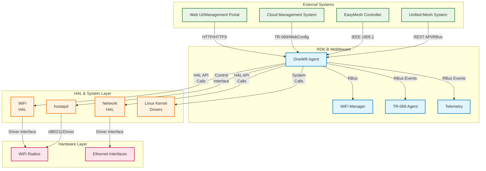

**Key Features & Responsibilities**: 

- **Service-Oriented Wi-Fi Management**: Provides modular service architecture with distinct services for private Wi-Fi, public Wi-Fi, mesh networking, dynamic provisioning, and managed services that operate independently while coordinating through a central manager
- **EasyMesh Integration**: Implements IEEE 1905.1 Multi-AP specification for wireless mesh networking with controller and agent capabilities, supporting both collocated and remote agent deployments
- **802.11 Protocol Implementation**: Incorporates comprehensive 802.11 protocol stack including WPA3, Wi-Fi 6/6E features, band steering, client steering, and advanced security mechanisms
- **hostapd Integration**: Seamlessly integrates with hostapd authenticator for advanced WPA/WPA2/WPA3 security, enterprise authentication, and 802.1X support
- **WiFi Database (WiFi DB)**: Maintains persistent storage for Wi-Fi configurations, client associations, statistics, and operational state with OVSDB backend for real-time data management
- **TR-181 Data Model**: Implements comprehensive TR-181 WiFi data model with custom extensions for RDK-B specific features, providing standardized parameter access via RBus
- **Telemetry and Analytics**: Collects and reports comprehensive Wi-Fi metrics, client statistics, performance data, and operational telemetry for monitoring and optimization


## Design

The OneWifi architecture follows a service-oriented design philosophy that modularizes Wi-Fi functionality into distinct, interoperable services. The design centers around a central services manager that orchestrates multiple specialized service modules, each responsible for specific Wi-Fi operational domains. This architectural approach enables flexible deployment scenarios, supports diverse use cases from simple access points to complex mesh networks, and provides clean separation of concerns between different Wi-Fi functionalities.

The core design principle emphasizes abstraction and modularity. The WiFi HAL abstraction layer provides a unified interface to diverse hardware platforms, while the 802.11 protocol implementation ensures standards compliance across different radio technologies. The hostapd integration provides enterprise-grade security capabilities, and the EasyMesh implementation enables sophisticated mesh networking topologies. The WiFi Database serves as the persistent storage backbone, maintaining configuration state and operational data across system restarts.

The design integrates multiple IPC mechanisms to support different interaction patterns. RBus provides the primary event-driven communication channel for real-time coordination with other RDK-B components. Additional IPC methods ensure compatibility with legacy components, while direct HAL API calls provide low-latency hardware control. The WebConfig protocol enables dynamic configuration updates from cloud management systems, and IEEE 1905.1 messaging supports standardized mesh network communications.

Data persistence and storage management is handled through the WiFi Database (WiFi DB) component, which utilizes OVSDB as the backend storage engine. This provides atomic operations, transaction support, and real-time change notifications. Configuration data, client association records, statistics, and operational state are maintained with strong consistency guarantees, enabling reliable operation across system failures and restarts.

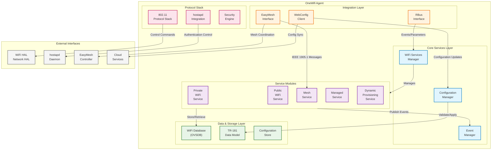

### Prerequisites and Dependencies

**Build-Time Flags and Configuration:**

| Configure Option | DISTRO Feature | Build Flag | Purpose | Default |
|------------------|----------------|------------|---------|---------|
| `--enable-libwebconfig` | N/A | `LIBWEBCONFIG` | Enable libwebconfig for dynamic configuration management | Disabled |
| `--enable-easymesh` | `easymesh` | `EASYMESH` | Enable IEEE 1905.1 Multi-AP EasyMesh support | Disabled |
| `--enable-sm-app` | N/A | `SM_APP` | Enable statistics manager application for telemetry | Disabled |
| `--enable-em-app` | N/A | `EM_APP` | Enable EasyMesh application for mesh controller/agent | Disabled |
| `--enable-journalctl` | N/A | `JOURNALCTL_SUPPORT` | Enable journalctl logging support for systemd | Disabled |
| `--enable-easyconnect` | `EasyConnect` | `EASYCONNECT_SUPPORT` | Enable WiFi Easy Connect (DPP) protocol support | Disabled |
| `--enable-rdk-wifi-libhostap` | N/A | `CCSP_HOSTAP_AUTH` | Enable hostapd authenticator integration | Disabled |
| `--enable-notify` | `systemd` | `ENABLE_SD_NOTIFY` | Enable systemd service notification support | Disabled |

**Compile-Time Macros and Features:**

| Macro/Flag | DISTRO Feature | Purpose | Default | Impact |
|------------|----------------|---------|---------|--------|
| `ENABLE_FEATURE_MESHWIFI` | `meshwifi` | Enable mesh WiFi capabilities and mesh-specific scripts | Disabled | Mesh network support |
| `WIFI_CAPTIVE_PORTAL` | N/A | Enable captive portal functionality for guest networks | Enabled | Guest access control |
| `WIFI_HAL_VERSION_3` | `halVersion3` | Enable WiFi HAL version 3.0 APIs and enhanced features | Disabled | Advanced HAL capabilities |
| `NEWPLATFORM_PORT` | `onewifi_integration` | Enable new platform integration with updated APIs | Disabled | Platform compatibility |
| `ONEWIFI_CAC_APP_SUPPORT` | `cac` | Enable Client Association Control application support | Disabled | Advanced client management |
| `FEATURE_SUPPORT_WPS` | `wps_support` | Enable WiFi Protected Setup (WPS) functionality | Disabled | WPS configuration |
| `ONEWIFI_DBUS_SUPPORT` | `dbus_support` | Enable D-Bus IPC support for legacy component integration | Disabled | D-Bus communication |
| `ALWAYS_ENABLE_AX_2G` | `always_enable_ax_2g` | Force enable 802.11ax on 2.4GHz radio | Disabled | WiFi 6 on 2.4GHz |
| `HAL_IPC` | `hal-ipc` | Enable HAL Inter-Process Communication mechanisms | Disabled | Enhanced HAL integration |
| `NL80211_ACL` | `disable_nl80211_acl` | Enable nl80211-based Access Control Lists (inverted logic) | Enabled | ACL implementation |
| `SAFEC_DUMMY_API` | `safec` | Enable dummy SafeC APIs when SafeC library not available (inverted logic) | Enabled | Memory safety |

**Runtime Configuration Parameters:**

| Parameter | Configuration Source | Purpose | Default Value | Override Method |
|-----------|---------------------|---------|---------------|-----------------|
| `ONEWIFI_CAC_APP_SUPPORT` | Configure flag | Enable/disable CAC application at runtime | `false` | Build-time configuration |
| `ONEWIFI_DBUS_SUPPORT` | Configure flag | Enable/disable D-Bus support at runtime | `false` | Build-time configuration |
| `HAL_IPC` | Configure flag | Enable/disable HAL IPC mechanisms | `false` | Build-time configuration |
| `WIFI_CAPTIVE_PORTAL` | Compile-time flag | Captive portal functionality enablement | `true` | Compile-time only |
| `JOURNALCTL_SUPPORT` | Configure flag | Enable journalctl logging backend | `false` | Build-time configuration |
| `EASYCONNECT_SUPPORT` | Configure flag | Enable WiFi Easy Connect (DPP) support | `false` | Build-time configuration |


**RDK-B Platform and Integration Requirements:**

- **RDK-B Components**: CcspCommonLibrary (for base RDK framework), RBus (for IPC), WiFi HAL (for hardware abstraction), ccsp-psm (for parameter storage)
- **HAL Dependencies**: WiFi HAL v3.0+, Network HAL v1.0+, platform-specific radio drivers with nl80211 support
- **Systemd Services**: `rbus.service`, `psm.service`, `wifi-hal.service` must be active before OneWifi starts
- **Hardware Requirements**: 802.11 wireless radios, Ethernet interface for backhaul, sufficient memory for OVSDB and service modules (minimum 64MB)
- **Message Bus**: RBus registration for "Device.WiFi" namespace, event subscriptions for configuration changes
- **TR-181 Data Model**: Complete WiFi object hierarchy support, custom parameter extensions for mesh and telemetry features
- **Configuration Files**: `/etc/onewifi/config.ini`, TR-181 XML definitions, EasyMesh configuration JSON
- **Startup Order**: HAL services → PSM → RBus → OneWifi → dependent applications


**Dependent Components:** 

- **CcspLMLite**: Depends on OneWifi for host association events and device presence information
- **Telemetry Services**: Requires WiFi metrics and analytics data from OneWifi
- **EasyMesh Controller/Agent**: External mesh components depend on OneWifi EasyMesh interface

<br>

**Threading Model:** 

OneWifi implements a multi-threaded architecture designed for high performance and responsive Wi-Fi operations while maintaining clear separation of concerns between different functional domains.

- **Threading Architecture**: Multi-threaded with dedicated threads for different service domains and a main event processing thread
- **Main Thread**: Handles RBus message processing, configuration updates, service coordination, and high-priority system events
- **Worker Threads**: 
    - **WiFi DB Thread**: Manages OVSDB operations, database transactions, and persistent storage operations
    - **HAL Interface Thread**: Processes HAL callbacks, hardware events, and low-latency radio control operations  
    - **Mesh Service Thread**: Handles IEEE 1905.1 message processing, mesh topology management, and EasyMesh operations
    - **Telemetry Thread**: Collects statistics, processes performance metrics, and manages data reporting
    - **WebConfig Thread**: Processes configuration updates from cloud services and validates configuration changes
- **Synchronization**: Uses pthread mutexes for shared data structures, condition variables for thread coordination, and RBus async callbacks for inter-component communication

### Component State Flow

**Initialization to Active State**

OneWifi follows a structured initialization sequence that ensures proper dependency resolution and service activation. The component transitions through several well-defined states from startup to full operational capability.

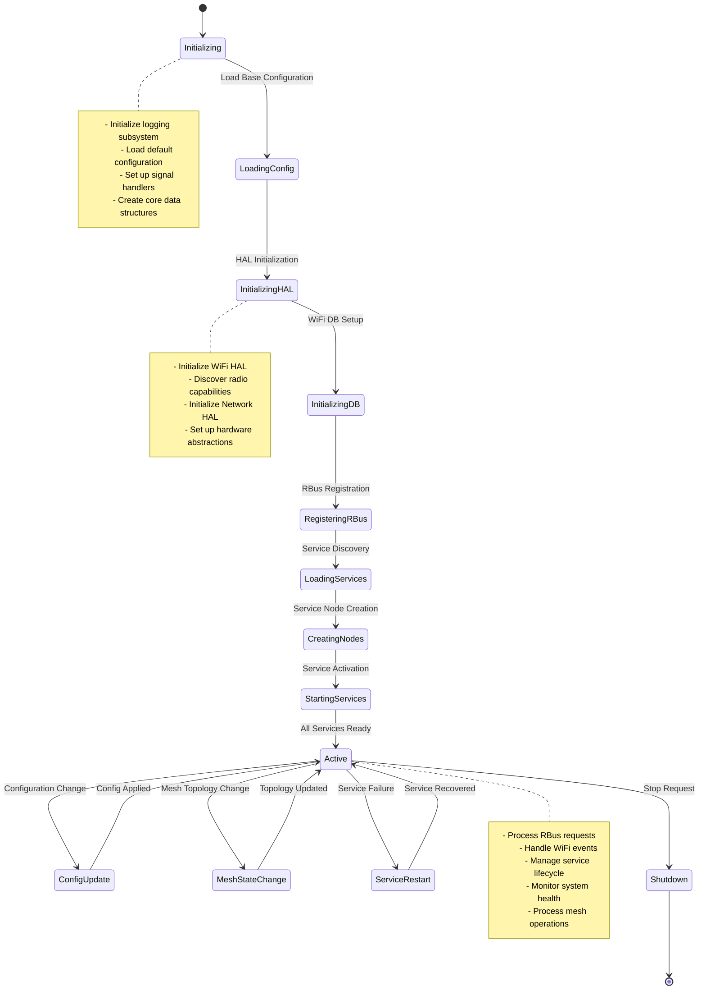

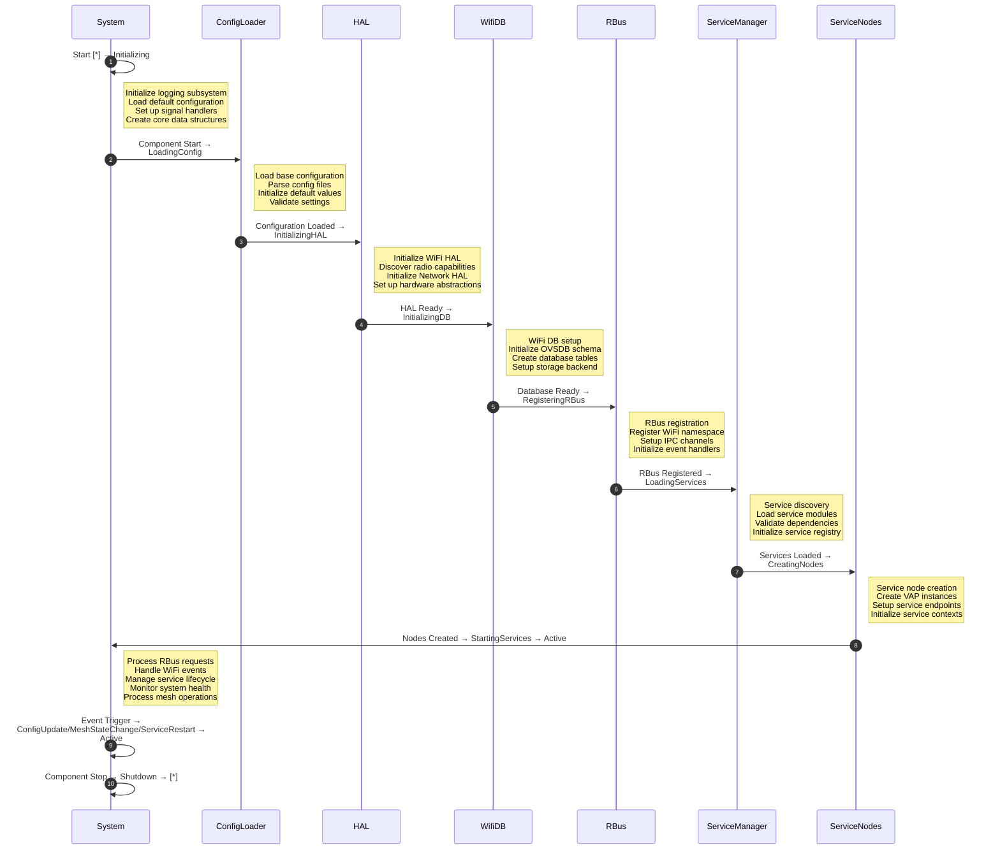

**Runtime State Changes and Context Switching**

OneWifi supports dynamic runtime state changes to adapt to varying operational conditions, configuration updates, and network topology changes without requiring full system restart.

**State Change Triggers:**

- **Configuration Updates**: TR-181 parameter changes, WebConfig updates, or manual configuration modifications trigger service reconfiguration
- **Mesh Topology Changes**: Node join/leave events, link quality changes, or controller failover scenarios trigger mesh service state transitions
- **Hardware Events**: Radio failures, interface state changes, or driver reload events trigger HAL reinitialization sequences
- **Service Failures**: Individual service crashes or unresponsive modules trigger automatic service restart and recovery procedures

**Context Switching Scenarios:**

- **Mesh Role Switching**: Transition between EasyMesh controller and agent roles based on network conditions and configuration
- **Service Mode Changes**: Dynamic switching between private, public, and mesh service modes based on operational requirements
- **Radio Channel Changes**: Coordinated channel switching across mesh nodes with minimal service interruption
- **Security Context Updates**: Dynamic security profile changes for enterprise authentication or mesh security updates

### Call Flow

**Initialization Call Flow:**

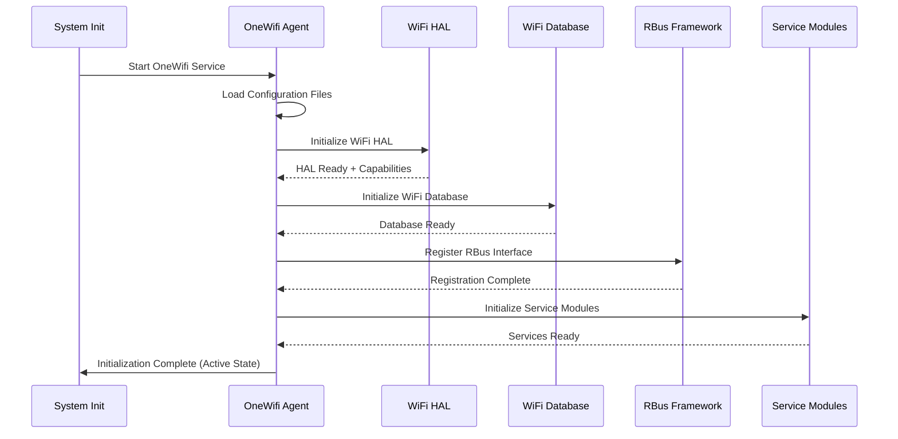

**EasyMesh Integration Call Flow:**

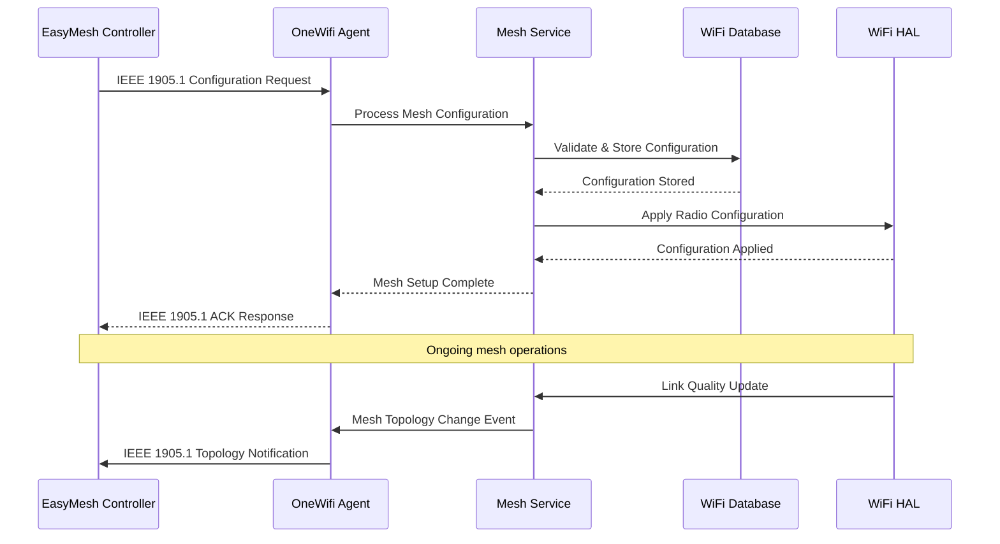

## TR‑181 Data Models

### Supported TR-181 Parameters

OneWifi implements the complete TR-181 WiFi data model as defined in TR-181 Issue 2 Amendment 15, along with RDK-specific extensions for advanced mesh networking, telemetry, and optimization features. The implementation follows BBF specification conventions for parameter definitions, access controls, and behavioral semantics.

### Object Hierarchy

```
Device.
└── WiFi.
    ├── RadioNumberOfEntries (unsignedInt, R)
    ├── SSIDNumberOfEntries (unsignedInt, R) 
    ├── AccessPointNumberOfEntries (unsignedInt, R)
    ├── EndPointNumberOfEntries (unsignedInt, R)
    ├── ApplyRadioSettings (boolean, R/W)
    ├── ApplyAccessPointSettings (boolean, R/W)
    ├── X_RDKCENTRAL-COM_PreferPrivateConnection (boolean, R/W)
    ├── X_RDKCENTRAL-COM_EnableHostapdAuthenticator (boolean, R/W)
    ├── Radio.{i}.
    │   ├── Enable (boolean, R/W)
    │   ├── Status (string, R)
    │   ├── Name (string, R)
    │   ├── LastChange (unsignedInt, R)
    │   ├── LowerLayers (string, R/W)
    │   ├── Upstream (boolean, R)
    │   ├── MaxBitRate (unsignedInt, R)
    │   ├── SupportedFrequencyBands (string, R)
    │   ├── OperatingFrequencyBand (string, R/W)
    │   ├── SupportedStandards (string, R)
    │   ├── OperatingStandards (string, R/W)
    │   ├── Channel (unsignedInt, R/W)
    │   ├── AutoChannelEnable (boolean, R/W)
    │   ├── TransmitPower (int, R/W)
    │   ├── X_RDKCENTRAL-COM_DfsEnable (boolean, R/W)
    │   └── Stats.
    │       ├── BytesSent (unsignedLong, R)
    │       ├── BytesReceived (unsignedLong, R)
    │       ├── PacketsSent (unsignedLong, R)
    │       └── PacketsReceived (unsignedLong, R)
    ├── SSID.{i}.
    │   ├── Enable (boolean, R/W)
    │   ├── Status (string, R)
    │   ├── Name (string, R/W) 
    │   ├── BSSID (string, R)
    │   ├── MACAddress (string, R)
    │   ├── SSID (string, R/W)
    │   └── Stats.
    │       ├── BytesSent (unsignedLong, R)
    │       ├── BytesReceived (unsignedLong, R)
    │       └── AssociatedDeviceNumberOfEntries (unsignedInt, R)
    ├── AccessPoint.{i}.
    │   ├── Enable (boolean, R/W)
    │   ├── Status (string, R) 
    │   ├── SSIDReference (string, R/W)
    │   ├── SSIDAdvertisementEnabled (boolean, R/W)
    │   ├── RetryLimit (unsignedInt, R/W)
    │   ├── WMMCapability (boolean, R)
    │   ├── UAPSDCapability (boolean, R)
    │   ├── WMMEnable (boolean, R/W)
    │   ├── UAPSDEnable (boolean, R/W)
    │   ├── AssociatedDeviceNumberOfEntries (unsignedInt, R)
    │   ├── MaxAssociatedDevices (unsignedInt, R/W)
    │   ├── IsolationEnable (boolean, R/W)
    │   ├── MaxAllowedAssociations (unsignedInt, R/W)
    │   ├── X_RDKCENTRAL-COM_BssHotSpot (boolean, R/W)
    │   ├── X_RDKCENTRAL-COM_KickAssocDevices (boolean, W)
    │   ├── Security.
    │   │   ├── ModesSupported (string, R)
    │   │   ├── ModeEnabled (string, R/W)
    │   │   ├── WEPKey (string, W)
    │   │   ├── PreSharedKey (string, W)
    │   │   ├── KeyPassphrase (string, W)
    │   │   ├── SAEPassphrase (string, W)
    │   │   ├── RekeyingInterval (unsignedInt, R/W)
    │   │   └── X_RDKCENTRAL-COM_TransitionDisable (unsignedInt, R/W)
    │   ├── WPS.
    │   │   ├── Enable (boolean, R/W)
    │   │   ├── ConfigMethodsSupported (string, R)
    │   │   └── ConfigMethodsEnabled (string, R/W)
    │   └── AssociatedDevice.{i}.
    │       ├── MACAddress (string, R)
    │       ├── AuthenticationState (boolean, R)
    │       ├── LastDataDownlinkRate (unsignedInt, R)
    │       ├── LastDataUplinkRate (unsignedInt, R)
    │       ├── SignalStrength (int, R)
    │       ├── Retransmissions (unsignedInt, R)
    │       └── Active (boolean, R)
    └── X_RDKCENTRAL-COM_EasyMesh.
        ├── Enable (boolean, R/W)
        ├── ControllerEnable (boolean, R/W)
        ├── AgentEnable (boolean, R/W)
        └── Stats.
            ├── MessagesTransmitted (unsignedLong, R)
            └── MessagesReceived (unsignedLong, R)
```

### Parameter Definitions

**Core Parameters:**

| Parameter Path | Data Type | Access | Default Value | Description | BBF Compliance |
|----------------|-----------|--------|---------------|-------------|----------------|
| `Device.WiFi.RadioNumberOfEntries` | unsignedInt | R | `0` | The number of WiFi radio entries in the Radio table. Automatically updated when radios are detected during initialization. | TR-181 Issue 2 |
| `Device.WiFi.ApplyRadioSettings` | boolean | R/W | `false` | When set to true, triggers immediate application of all pending radio configuration changes across all radio instances. | TR-181 Issue 2 |
| `Device.WiFi.X_RDKCENTRAL-COM_EnableHostapdAuthenticator` | boolean | R/W | `true` | Controls integration with hostapd authenticator for enterprise-grade WPA/WPA2/WPA3 authentication and 802.1X support. | RDK Custom |
| `Device.WiFi.Radio.{i}.Enable` | boolean | R/W | `false` | Enables or disables the radio. When disabled, all associated SSIDs and AccessPoints become inactive. | TR-181 Issue 2 |
| `Device.WiFi.Radio.{i}.OperatingFrequencyBand` | string | R/W | `"2.4GHz"` | Operating frequency band. Enumerated values: "2.4GHz", "5GHz", "6GHz", "60GHz". Changes trigger channel reconfiguration. | TR-181 Issue 2 |
| `Device.WiFi.Radio.{i}.X_RDKCENTRAL-COM_DfsEnable` | boolean | R/W | `true` | Enables Dynamic Frequency Selection for 5GHz radios to avoid radar interference on DFS channels. | RDK Custom |
| `Device.WiFi.AccessPoint.{i}.Security.ModeEnabled` | string | R/W | `"WPA2-Personal"` | Security mode enumeration: "None", "WEP-64", "WEP-128", "WPA-Personal", "WPA2-Personal", "WPA-WPA2-Personal", "WPA-Enterprise", "WPA2-Enterprise", "WPA3-Personal", "WPA3-Enterprise" | TR-181 Issue 2 |

**Custom Extensions:**

- **EasyMesh Parameters**: Complete IEEE 1905.1 Multi-AP parameter set for mesh controller/agent functionality and mesh network topology management
- **Advanced Security Extensions**: WPA3 transition disable modes, SAE authentication parameters, and enterprise authentication enhancements  
- **Telemetry Extensions**: Enhanced statistics collection, client association metrics, and performance monitoring parameters
- **Dynamic Provisioning**: Support for WebConfig-driven configuration updates and cloud-managed parameter synchronization

### Parameter Registration and Access

- **Implemented Parameters**: OneWifi implements over 400 TR-181 parameters covering the complete WiFi object hierarchy, radio management, security configurations, access point settings, client associations, and statistics collection with full read/write access control enforcement.
- **Parameter Registration**: Parameters are registered via RBus interface using structured callbacks for get/set operations. The registration process validates parameter paths against the TR-181 schema and establishes proper access control mechanisms.
- **Access Mechanism**: Other RDK-B components access parameters through RBus method calls with automatic parameter validation, type checking, and change notification events. Legacy components can access parameters via standard IPC methods.
- **Validation Rules**: All parameter modifications undergo strict validation including range checking for numeric values, enumeration validation for string parameters, dependency checking for related parameters, and security validation for sensitive parameters like passwords and keys.

## Internal Modules

OneWifi's modular architecture consists of several specialized modules, each handling distinct aspects of Wi-Fi management while maintaining clear interfaces and responsibilities.

| Module/Class | Description | Key Files |
|-------------|------------|-----------|
| **WiFi Services Manager** | Central orchestration engine that manages lifecycle, coordination, and communication between all service modules. Handles service registration, state management, and inter-service messaging. | `wifi_services_mgr.c`, `wifi_services_mgr.h`, `services.c` |
| **Private WiFi Service** | Manages traditional home/private WiFi networks including access point configuration, client authentication, security policy enforcement, and bandwidth management for residential use cases. | `wifi_service_private.c`, `wifi_service_private.h` |
| **Public WiFi Service** | Handles public hotspot operations including captive portal integration, guest network isolation, bandwidth throttling, and commercial WiFi service provider integrations. | `wifi_service_public.c`, `wifi_service_public.h` |
| **Mesh Service** | Implements IEEE 1905.1 Multi-AP mesh networking capabilities including topology discovery, link quality monitoring, steering decisions, and coordinated channel management across mesh nodes. | `wifi_service_mesh.c`, `wifi_service_mesh.h` |
| **WiFi Database** | Persistent storage engine built on OVSDB that maintains configuration state, client associations, statistics, and operational data with atomic transactions and real-time change notifications. | `wifi_db.c`, `wifi_db.h`, `wifi_db_apis.c` |
| **TR-181 Data Model** | Implements complete BBF TR-181 WiFi data model with RDK extensions, providing standardized parameter access, validation, and change notification mechanisms via RBus interfaces. | `cosa_wifi_dml.c`, `cosa_wifi_apis.c`, TR-181 XML files |
| **EasyMesh Interface** | Handles IEEE 1905.1 protocol implementation for Multi-AP mesh networks, managing controller/agent communication, configuration distribution, and mesh network orchestration. | `webconfig_external_proto_easymesh.h`, `wifi_easymesh_translator.c` |
| **hostapd Integration** | Provides seamless integration with hostapd daemon for advanced authentication, enterprise security, WPA3 support, and 802.1X authentication services. | `wifi_hostapd_glue.c`, hostapd configuration management |

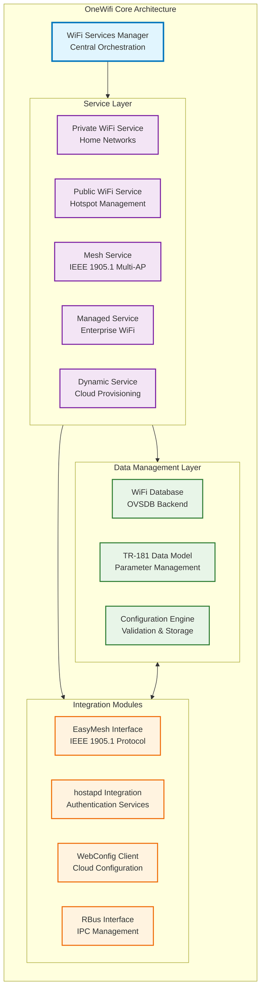

## Component Interactions

OneWifi integrates with multiple layers of the RDK-B stack and external systems through well-defined interfaces and protocols. The component serves as the central hub for all Wi-Fi operations while maintaining clear separation of concerns and standardized communication patterns.

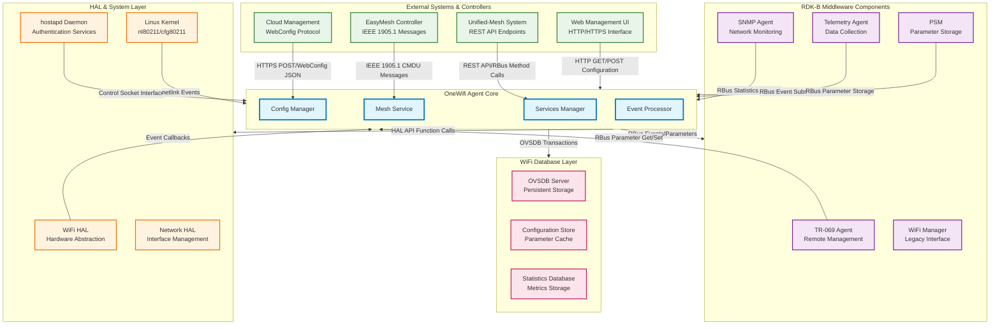

### Interaction Matrix

| Target Component/Layer | Interaction Purpose | IPC Mechanism | Message Format | Communication Pattern | Key APIs/Endpoints |
|------------------------|-------------------|---------------|----------------|---------------------|------------------|
| **RDK-B Middleware Components** |
| TR-069 Agent | Parameter synchronization and remote management support | RBus | JSON-RPC 2.0 | Request-Response/Event Notifications | `Device.WiFi.` parameter tree, `rbus_getExt()`, `rbus_setExt()` |
| Telemetry Agent | Performance metrics and operational telemetry | RBus | JSON Events | Publisher-Subscriber | `wifi.telemetryEvent`, `wifi.clientAssociationEvent` |
| PSM Component | Persistent parameter storage and configuration management | RBus | Key-Value Pairs | Synchronous Get/Set | `PSM_Get()`, `PSM_Set()`, configuration validation |
| **System & HAL Layers** |
| WiFi HAL | Hardware control, radio configuration, client management | Direct C API | C Structures | Synchronous Function Calls | `wifi_setRadioEnable()`, `wifi_getClientInfo()`, `wifi_pushBridgeInfo()` |
| Network HAL | Interface management and network configuration | Direct C API | C Structures | Synchronous Function Calls | `nethal_getInterfaceInfo()`, `nethal_setInterfaceState()` |
| hostapd Daemon | WPA/WPA2/WPA3 authentication and enterprise security | Unix Domain Socket | Control Protocol | Command-Response | Control socket interface, authentication callbacks |
| **External Systems** |
| EasyMesh Controller | Multi-AP mesh network coordination and management | IEEE 1905.1/LLDP | CMDU Messages | Message-Based Protocol | IEEE 1905.1 CMDU types, mesh topology messages |
| Unified-Mesh System | Mesh network orchestration and optimization | REST API/RBus | JSON/HTTP | RESTful API/Event-Driven | `POST /mesh/config`, `GET /mesh/topology`, RBus method calls |
| Cloud Management | Configuration synchronization and remote updates | HTTPS/WebConfig | JSON Documents | RESTful/Event-Driven | WebConfig subdocument processing, configuration validation |

**Events Published by OneWifi:**

| Event Name | Event Topic/Path | Trigger Condition | Payload Format | Subscriber Components |
|------------|-----------------|-------------------|----------------|---------------------|
| WiFi.ClientAssociation | `Device.WiFi.AccessPoint.{i}.AssociatedDevice` | Client association/disassociation events | JSON: `{mac, bssid, event_type, timestamp, signal_strength}` | Telemetry Agent, SNMP Agent, TR-069 Agent |
| WiFi.RadioStateChange | `Device.WiFi.Radio.{i}.Status` | Radio enable/disable or channel changes | JSON: `{radio_index, status, channel, frequency_band}` | WiFi Manager, Network Manager, Telemetry Agent |
| WiFi.MeshTopologyChange | `Device.WiFi.X_RDKCENTRAL-COM_EasyMesh` | Mesh node join/leave or link quality changes | JSON: `{topology_change_type, affected_nodes, link_metrics}` | EasyMesh Controller, Unified-Mesh System |
| WiFi.SecurityEvent | `Device.WiFi.AccessPoint.{i}.Security` | Authentication failures or security policy violations | JSON: `{event_type, client_mac, failure_reason, action_taken}` | Security Manager, SNMP Agent, Log Aggregator |

**Events Consumed by OneWifi:**

| Event Source | Event Topic/Path | Purpose | Expected Payload | Handler Function |
|-------------|-----------------|---------|------------------|------------------|
| PSM Component | `Device.WiFi.*` parameter changes | React to persistent configuration changes | JSON: `{parameter_path, old_value, new_value, change_source}` | `wifi_config_change_handler()` |
| EasyMesh Controller | IEEE 1905.1 mesh configuration | Process mesh network configuration updates | CMDU: Multi-AP configuration messages | `easymesh_config_handler()` |
| Cloud Services | WebConfig document updates | Apply cloud-managed configuration changes | JSON: WebConfig subdocument structure | `webconfig_apply_handler()` |

### IPC Flow Patterns

**Primary IPC Flow - Configuration Management:**

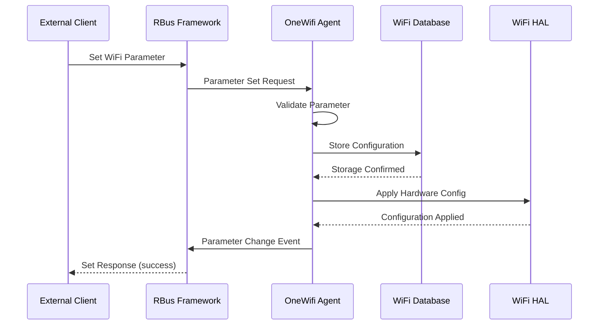

**EasyMesh Coordination Flow:**

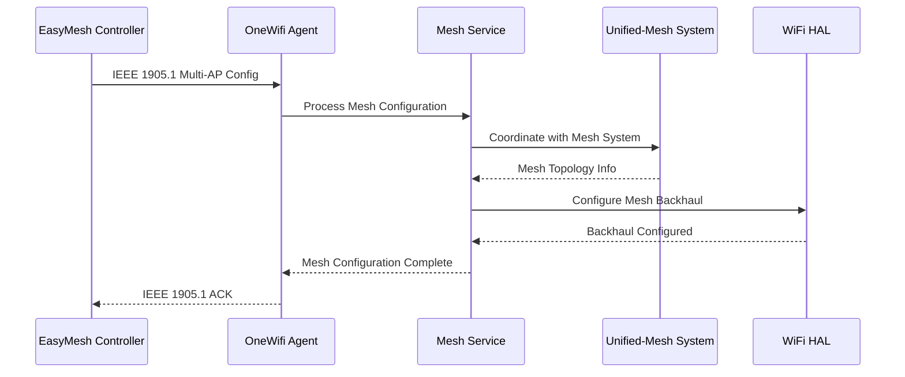

## Implementation Details

### Major HAL APIs Integration

OneWifi integrates with multiple HAL interfaces to provide comprehensive hardware abstraction and protocol implementation. The integration encompasses WiFi HAL for radio control, Network HAL for interface management, and direct hostapd integration for advanced authentication services.

**Core HAL APIs:**

| HAL API | Purpose | Parameters | Return Values | Implementation File |
|---------|---------|------------|---------------|-------------------|
| `wifi_setRadioEnable()` | Enable/disable radio operation and configure basic radio parameters | `radio_index`, `enable_flag` | `WIFI_HAL_SUCCESS`/`WIFI_HAL_ERROR` | `wifi_services_mgr.c`, radio service modules |
| `wifi_getRadioCapabilities()` | Retrieve radio hardware capabilities including supported bands, channels, and features | `radio_index`, `capabilities_struct*` | Capability structure with feature flags | `wifi_hal_interface.c` |
| `wifi_setApSecurityModeEnabled()` | Configure WPA/WPA2/WPA3 security modes and authentication parameters | `ap_index`, `security_mode_string` | `WIFI_HAL_SUCCESS`/`WIFI_HAL_INVALID_PARAM` | `wifi_service_private.c`, security management |
| `wifi_getAssociatedDeviceDetail()` | Retrieve detailed client association information including signal strength and data rates | `ap_index`, `device_mac`, `device_detail_struct*` | Client information structure | `cosa_wifi_apis.c`, client management |
| `wifi_pushBridgeInfo()` | Configure bridge interfaces for VLAN and mesh backhaul operations | `bridge_config_struct*` | `WIFI_HAL_SUCCESS`/network configuration status | `wifi_service_mesh.c`, network configuration |
| `nethal_getInterfaceInfo()` | Retrieve network interface status and configuration for coordination with WiFi operations | `interface_name`, `interface_info_struct*` | Interface status and configuration data | Network HAL integration modules |

### Key Implementation Logic

- **Service-Oriented Architecture Engine**: The core architecture is built around a sophisticated services manager that maintains service registries, handles lifecycle management, and coordinates inter-service communications. Each service (Private, Public, Mesh, Managed, Dynamic) operates as an independent module with standardized interfaces for initialization, configuration, event handling, and shutdown. The services manager provides service discovery, dependency resolution, and failure recovery mechanisms.

  Implementation files: `wifi_services_mgr.c` for core service orchestration, individual service modules in `source/services/` subdirectories
  Service lifecycle management with automated restart and recovery capabilities
  Inter-service messaging and event distribution framework

- **EasyMesh Integration Engine**: Implements complete IEEE 1905.1 Multi-AP specification including CMDU message processing, mesh topology management, and coordinated multi-radio operations. The implementation supports both controller and agent roles with dynamic role switching, mesh network discovery, link quality monitoring, and intelligent client steering across mesh nodes.

  Implementation files: `wifi_easymesh_translator.c` for protocol translation, EasyMesh interface definitions in `webconfig_external_proto_easymesh.h`
  IEEE 1905.1 message processing and topology management
  Multi-radio coordination and client steering algorithms

- **WiFi Database Integration**: Utilizes OVSDB as the backend storage engine providing ACID transactions, real-time change notifications, and schema-based data validation. The database maintains configuration state, client association records, statistics, and operational data with automatic schema migration and backup/restore capabilities.

  Implementation files: `wifi_db.c` for database operations, `wifi_db_apis.c` for external API interfaces
  OVSDB schema management and transaction processing
  Real-time change notifications and data consistency enforcement

- **hostapd Integration Framework**: Provides seamless integration with hostapd daemon for enterprise-grade authentication services. The integration includes WPA3 support, 802.1X authentication, enterprise RADIUS integration, and advanced security policy enforcement with dynamic security profile updates.

  Implementation files: `wifi_hostapd_glue.c` for hostapd interface, authentication callback handlers
  Enterprise authentication and security policy enforcement
  Dynamic security profile updates and certificate management

- **802.11 Protocol Stack Implementation**: Incorporates comprehensive 802.11 protocol support including Wi-Fi 6/6E features, DFS channel management, band steering algorithms, and advanced QoS mechanisms. The implementation provides vendor-neutral protocol abstraction while supporting platform-specific optimizations.

  Implementation distributed across service modules and HAL interface layers
  Protocol-specific feature implementation and optimization
  Vendor-neutral abstraction with platform-specific extensions

### Key Configuration Files

| Configuration File | Purpose | Override Mechanisms |
|--------------------|---------|---------------------|
| `/etc/onewifi/CcspWifi.cfg` | Main OneWifi configuration | Environment variables, command line args |
| `/etc/onewifi/TR181-WiFi-USGv2.XML` | TR-181 parameter definitions | Custom XML overlays |
| `/nvram/EasymeshCfg.json` | EasyMesh configuration | WebConfig updates, manual configuration |
| `/etc/onewifi/rdkb-wifi.ovsschema` | OVSDB schema definition | Schema migration scripts |
| `/tmp/wifi_db.db` | Runtime database file | Automatic population from HAL |

## Service-Oriented Architecture Examples

The OneWifi architecture implements a sophisticated service-oriented design where each major Wi-Fi functionality is encapsulated as a distinct service module. These services operate independently while coordinating through the central WiFi Services Manager, enabling flexible deployment scenarios and modular feature activation.

### Private WiFi Service

**Purpose**: Manages traditional home/residential WiFi networks with focus on family-friendly features, parental controls, and home network optimization.

**API Examples**:

- `private_service_create_nodes()` - Creates VAP instances for home networks with family profiles
- `private_service_apply_parental_controls()` - Applies time-based access restrictions and content filtering
- `private_service_optimize_performance()` - Implements band steering and load balancing for home devices

**Use Case**: A home gateway serving a family network with automatic band steering for smart devices, parental controls for children's devices, and guest network isolation.

### Public WiFi Service

**Purpose**: Handles commercial hotspot operations including captive portal integration, bandwidth management, and service provider billing integration.

**API Examples**:

- `public_service_configure_captive_portal()` - Sets up splash pages and authentication workflows
- `public_service_apply_bandwidth_limits()` - Enforces per-user or per-session bandwidth quotas
- `public_service_generate_billing_records()` - Creates usage records for service provider billing

**Use Case**: A coffee shop providing free WiFi with captive portal authentication, time-limited sessions, and bandwidth throttling for fair usage.

### Mesh Service

**Purpose**: Implements IEEE 1905.1 Multi-AP mesh networking with intelligent topology management, coordinated channel selection, and seamless client roaming.

**API Examples**:

- `mesh_service_discover_topology()` - Performs mesh network discovery and neighbor analysis
- `mesh_service_coordinate_channels()` - Implements coordinated channel selection across mesh nodes
- `mesh_service_steer_client()` - Executes intelligent client steering decisions based on signal strength and load

**Use Case**: A whole-home mesh system with automatic topology optimization, coordinated interference mitigation, and seamless device roaming between nodes.

### Managed Service

**Purpose**: Provides enterprise-grade WiFi management with centralized policy enforcement, advanced security, and integration with network management systems.

**API Examples**:

- `managed_service_apply_enterprise_policy()` - Enforces corporate WiFi policies and access controls  
- `managed_service_integrate_radius()` - Manages RADIUS authentication and certificate validation
- `managed_service_generate_compliance_reports()` - Creates security and usage reports for enterprise compliance

**Use Case**: A corporate office network with 802.1X authentication, role-based access controls, and integration with Active Directory for user management.

### Dynamic Provisioning Service

**Purpose**: Handles cloud-managed configuration updates, zero-touch provisioning, and dynamic service activation based on deployment context.

**API Examples**:

- `dynamic_service_process_webconfig()` - Processes cloud configuration updates via WebConfig protocol
- `dynamic_service_auto_provision()` - Performs automatic service activation based on detected hardware capabilities
- `dynamic_service_validate_configuration()` - Validates configuration changes against platform capabilities and security policies

**Use Case**: A service provider deployment where devices automatically configure themselves based on location, customer profile, and available services without manual intervention.

## EasyMesh Integration Architecture

OneWifi implements comprehensive IEEE 1905.1 Multi-AP EasyMesh integration supporting both controller and agent roles. The integration enables sophisticated mesh network orchestration with the unified-mesh system and external EasyMesh controllers.

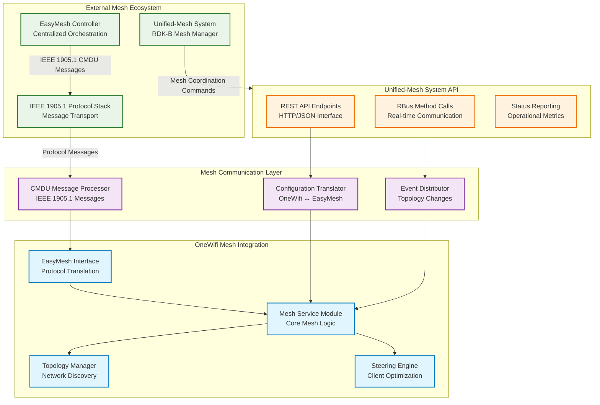

### EasyMesh Controller Integration

**IEEE 1905.1 CMDU Message Processing**:

- **AP Autoconfiguration**: Processes Multi-AP configuration messages for automated VAP setup and security provisioning
- **Topology Discovery**: Handles neighbor discovery messages and maintains real-time mesh topology database
- **Client Steering Commands**: Executes centralized client steering decisions from EasyMesh controller
- **Channel Selection Coordination**: Participates in coordinated channel selection across mesh network

**Message Types Supported**:

- `0x8001`: AP Autoconfiguration Search
- `0x8002`: AP Autoconfiguration Response  
- `0x8003`: AP Autoconfiguration WSC
- `0x8004`: AP Autoconfiguration Renew
- `0x8007`: Multi-AP Policy Config Request
- `0x8008`: Channel Preference Query/Response
- `0x8009`: Channel Selection Request/Response
- `0x800A`: Operating Channel Report

### Unified-Mesh System API Integration

**REST API Endpoints for Mesh Coordination**:

| Endpoint | Method | Purpose | Request Format | Response Format |
|----------|--------|---------|----------------|-----------------|
| `/mesh/topology` | GET | Retrieve current mesh topology | N/A | JSON topology structure with node info, link metrics |
| `/mesh/config` | POST | Apply mesh configuration | JSON config document | Status response with validation results |  
| `/mesh/steer` | POST | Execute client steering | JSON: `{client_mac, target_bssid, reason}` | Steering result and client response |
| `/mesh/optimize` | PUT | Trigger network optimization | JSON optimization parameters | Optimization results and actions taken |

**RBus Method Integration**:

- `mesh.getTopology()` - Real-time topology queries for mesh visualization
- `mesh.configureNode()` - Dynamic node configuration updates
- `mesh.reportMetrics()` - Performance and link quality reporting
- `mesh.handleFailover()` - Automatic failover coordination during node failures

### Mesh Network State Management

The EasyMesh integration maintains comprehensive state information about mesh network topology, client associations, and link quality metrics. This enables intelligent decision-making for client steering, channel coordination, and network optimization.

**State Information Maintained**:

- **Node Inventory**: Active mesh nodes, capabilities, roles (controller/agent), and operational status
- **Link Metrics**: Signal strength, throughput, latency, and packet loss between mesh nodes  
- **Client Database**: Connected clients, association history, roaming patterns, and performance metrics
- **Channel Usage**: Spectrum utilization, interference levels, and coordination requirements across mesh nodes

**Configuration Synchronization**:

OneWifi synchronizes configuration with both EasyMesh controllers and the unified-mesh system to maintain consistency across the mesh network. Configuration changes are validated against mesh policies and propagated to affected nodes with proper rollback capabilities in case of failures.
