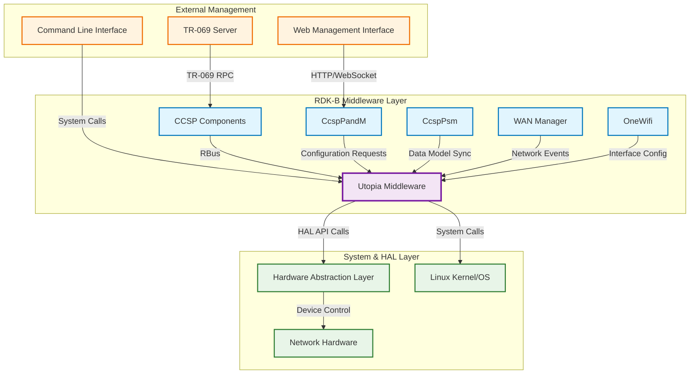
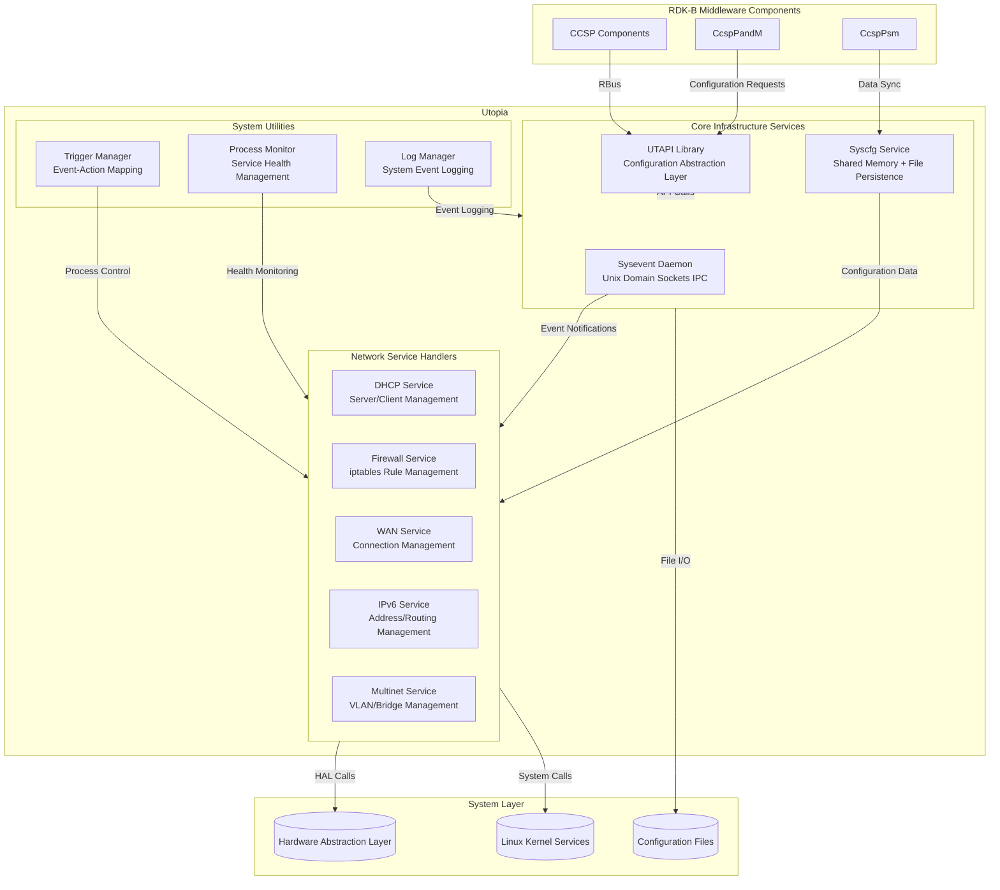
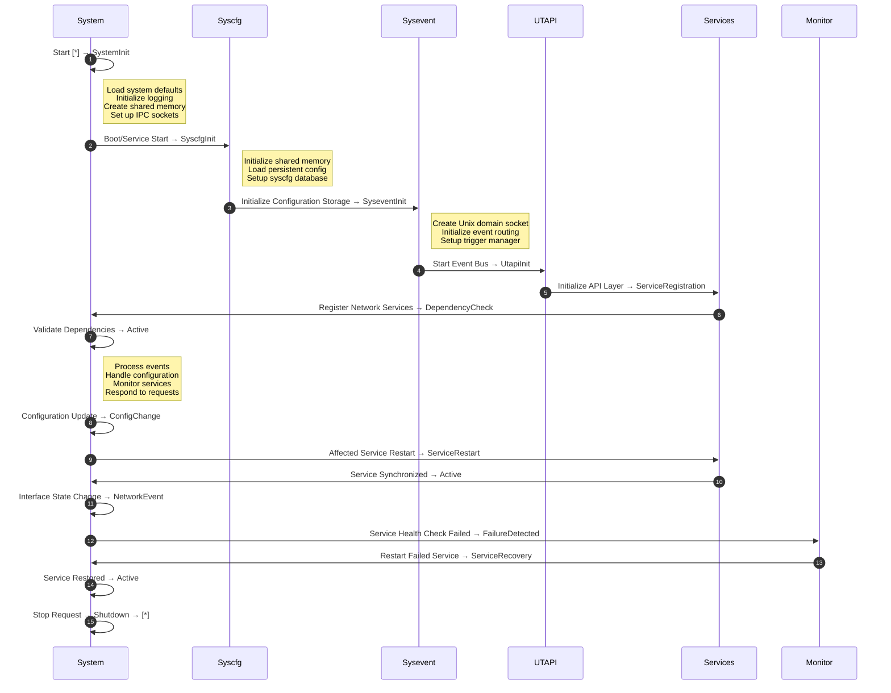
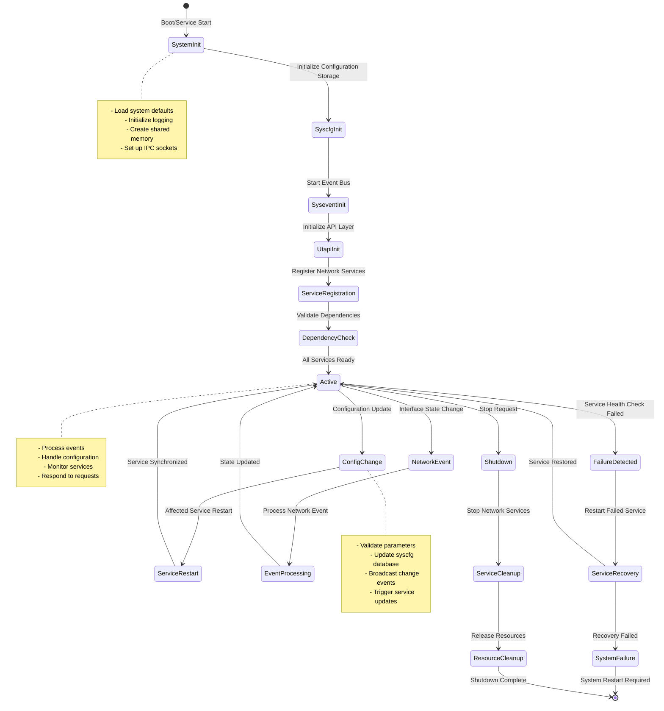
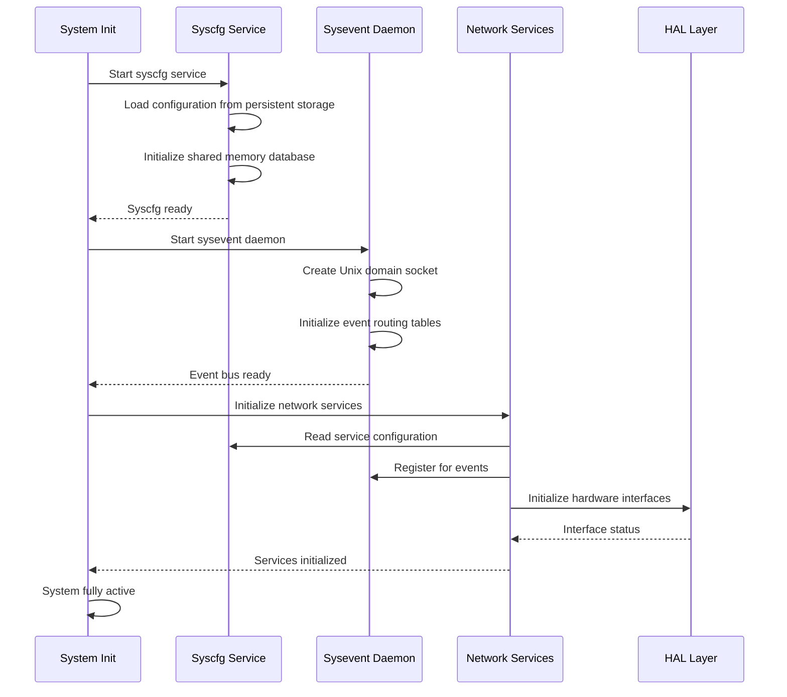
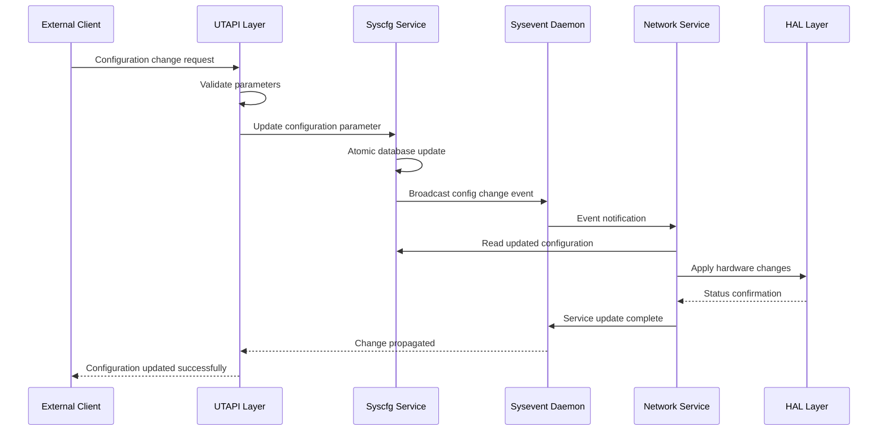
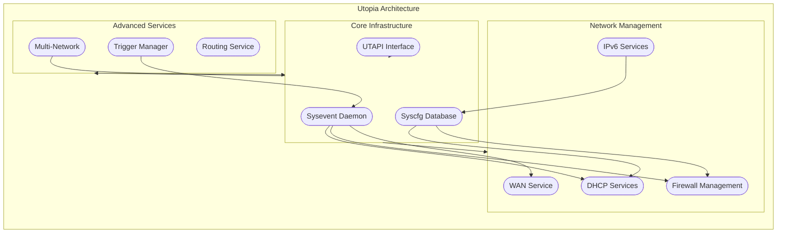
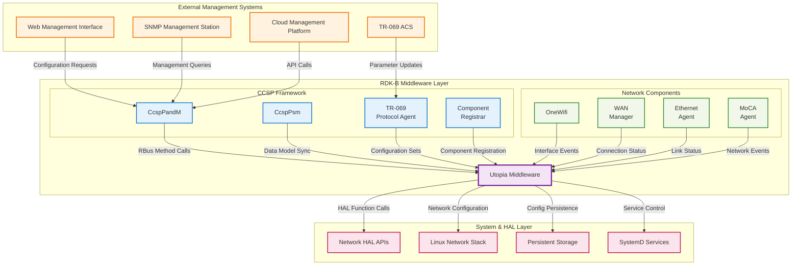
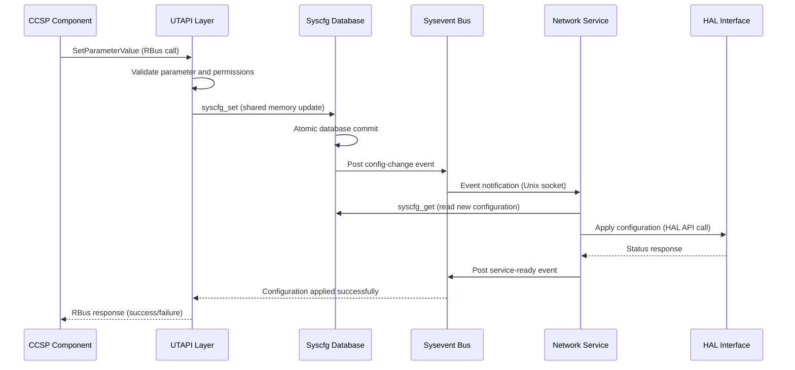
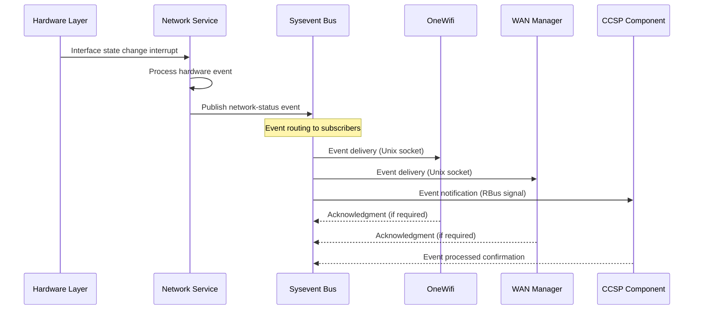

# Utopia Documentation

Utopia serves as the foundational system infrastructure component for RDK-B middleware, providing comprehensive system initialization, configuration management, event bus services, and network service orchestration. This component acts as the backbone that enables inter-process communication, persistent configuration storage, and coordinated startup/shutdown sequences across all RDK-B middleware components.

Utopia provides three critical service layers to the RDK-B stack: **System Infrastructure Services** that handle system initialization, configuration persistence (syscfg), and inter-component messaging (sysevent); **Network Service Management** that orchestrates networking services including DHCP, firewall, routing, and WAN connectivity; and **API Layer Services** that expose standardized interfaces (UTAPI) for configuration management and system control to other RDK-B components and external management systems.

The component integrates deeply with the Linux system layer through direct HAL interactions, manages persistent data through filesystem-based storage mechanisms, and coordinates with other RDK-B components via RBus messaging protocol. Utopia's modular architecture supports platform-specific customizations while maintaining consistent service interfaces across different RDK-B device implementations.

**Key Features & Responsibilities**: 

- **System Infrastructure Management**: Provides core system initialization services including process startup coordination, dependency management, and system-wide configuration bootstrapping essential for RDK-B middleware operation 
- **Configuration Persistence (syscfg)**: Implements a high-performance shared memory-based configuration database with filesystem backing that enables atomic configuration updates and fast parameter retrieval across all system components 
- **Inter-Process Event Bus (sysevent)**: Operates a publish-subscribe event messaging system using Unix domain sockets that facilitates real-time communication and state synchronization between RDK-B middleware components 
- **Network Service Orchestration**: Manages and coordinates networking services including DHCP server/client operations, firewall rule management, routing table updates, and WAN interface configuration through integrated service handlers 
- **Unified API Layer (UTAPI)**: Exposes standardized C APIs and command-line interfaces for system configuration, network management, and status monitoring that abstract platform-specific implementations from higher-level components 
- **Multi-Network Management**: Provides advanced networking capabilities including VLAN management, bridge configuration, multi-WAN support, and service-specific network isolation through the service_multinet framework 

## Design

Utopia's architectural design follows a layered service-oriented approach that separates system infrastructure concerns from application-specific networking logic. The core design principle centers around three foundational services: syscfg for configuration persistence, sysevent for inter-process communication, and UTAPI for external interface abstraction. These services operate as independent but coordinated daemons that provide reliable, high-performance infrastructure for the entire RDK-B middleware stack.

The design emphasizes scalability and maintainability through modular service decomposition, where each networking function (DHCP, firewall, routing) operates as an independent service process that communicates through standardized IPC mechanisms. Configuration changes propagate through the sysevent bus, triggering coordinated updates across dependent services without requiring direct inter-service dependencies. The shared memory-based syscfg implementation ensures configuration consistency while providing sub-millisecond access times critical for real-time networking operations.

Integration with external systems occurs through well-defined interface boundaries: northbound interactions with CCSP components use RBus messaging protcol, while southbound interactions with HAL and kernel services use direct API calls and system interfaces. The UTAPI layer provides configuration abstraction that enables platform-specific implementations while maintaining API compatibility across different hardware platforms. Event-driven service activation ensures efficient resource utilization and rapid response to network state changes.

Data persistence operates through a hybrid approach combining in-memory performance with filesystem reliability, where syscfg maintains active configuration in shared memory while asynchronously committing changes to persistent storage. The sysevent system supports both persistent and transient event states, enabling appropriate handling of both configuration changes and runtime status updates. Service startup orchestration follows dependency chains defined through sysevent triggers, ensuring proper initialization ordering without hard-coded dependencies.

### Prerequisites and Dependencies

**Build-Time Flags and Configuration:**

| Configure Option | DISTRO Feature | Build Flag | Purpose | Default |
|------------------|----------------|------------|---------|---------|
| `--enable-dslite_feature_support` | `dslite` | `DSLITE_FEATURE_SUPPORT` | Enable DS-Lite dual-stack lite tunneling support | Enabled |
| `--enable-core_net_lib_feature_support` | `core-net-lib` | `CORE_NET_LIB_FEATURE_SUPPORT` | Enable advanced core networking library support | Disabled |
| `--enable-extender` | `extender` | `FEATURE_RDKB_EXTENDER` | Enable WiFi extender/mesh device support | Disabled |
| `--enable-ddns_binary_client_support` | N/A | `DDNS_BINARY_CLIENT_SUPPORT` | Enable Dynamic DNS binary client support | Disabled |
| `--enable-potd` | N/A | `ENABLE_POTD_SERVICE` | Enable Password of the Day (PotD) service | Enabled |
| `--enable-hotspot` | N/A | `ENABLE_HOTSPOT_SERVICE` | Enable HotSpot captive portal functionality | Enabled |
| `--enable-lanmgr_enabled` | `pm_lan_mgr` | N/A | Enable LAN manager integration | Disabled |
| `--with-ccsp-platform` | N/A | `CCSP_PLATFORM` | Specify target platform (intel_usg, pc, bcm, intel_puma7) | bcm |

**Compile-Time Macros and Features:**

| Macro/Flag | DISTRO Feature | Purpose | Default | Impact |
|------------|----------------|---------|---------|--------|
| `DSLITE_FEATURE_SUPPORT` | `dslite` | DS-Lite tunneling and IPv4-over-IPv6 encapsulation | Enabled | Adds DS-Lite service handlers |
| `CORE_NET_LIB` | `core-net-lib` | Advanced networking library with enhanced HAL integration | Disabled | Core networking optimizations |
| `ENABLE_FEATURE_MESHWIFI` | `meshwifi` | Mesh WiFi network topology support | Disabled | WiFi mesh coordination |
| `FEATURE_COGNITIVE_WIFIMOTION` | `wifimotion` | Cognitive WiFi motion detection features | Disabled | Advanced WiFi analytics |
| `RDKB_EXTENDER_ENABLED` | `extender` | WiFi range extender and mesh node capabilities | Disabled | Extender-specific services |
| `SAFEC_DUMMY_API` | N/A (inverse of `safec`) | Dummy implementation when SafeC library unavailable | Enabled | Memory safety stubs |
| `CONFIG_BUILD_TRIGGER` | N/A | Build-time trigger system enabling | Enabled | Event trigger mechanisms |
| `WAN_FAILOVER_SUPPORTED` | `wan-failover` | WAN connection failover and redundancy | Disabled | Multi-WAN support |
| `MULTILAN_FEATURE` | N/A | Multiple LAN segment management | Platform-dependent | Advanced LAN topologies |

**Runtime Configuration Parameters:**

| Parameter | Configuration Source | Purpose | Default Value | Override Method |
|-----------|---------------------|---------|---------------|-----------------|
| `dhcp_server_enabled` | syscfg | Enable/disable DHCP server functionality | `1` | syscfg CLI, TR-181 |
| `lan_ifname` | syscfg | Primary LAN bridge interface name | `brlan0` | syscfg CLI |
| `wan_ifname` | sysevent | Current WAN interface name | Platform-dependent | sysevent CLI |
| `current_wan_ifname` | sysevent | Active WAN interface for routing | Auto-detected | sysevent CLI |
| `firewall_enabled` | syscfg | Enable/disable iptables firewall service | `1` | syscfg CLI, TR-181 |
| `router_password` | syscfg | Administrative password for router access | Auto-generated | WebUI, TR-181 |
| `ConnectivityCheckType` | syscfg | Network connectivity check method | `ping` | syscfg CLI |
| `redirection_flag` | syscfg | Enable captive portal redirection | `0` | syscfg CLI |
| `CaptivePortal_Enable` | syscfg | Enable captive portal functionality | `0` | syscfg CLI, TR-181 |
| `wlan_ssid_*` | syscfg | WiFi SSID configuration per radio | Platform-dependent | syscfg CLI, TR-181 |
| `bridge_mode` | syscfg | Enable bridge mode operation | `0` | syscfg CLI |
| `last_erouter_mode` | syscfg | Last known router operational mode | `1` | syscfg CLI |

**RDK-B Platform and Integration Requirements:** 

- **RDK-B Components**: CcspCommonLibrary, RBus messaging , persistent storage manager
- **HAL Dependencies**: Network HAL interfaces (WiFi, Ethernet, MoCA, DOCSIS)
- **Systemd Services**: Basic Linux systemd environment, Unix domain socket support, cron service integration
- **Hardware Requirements**: Network interfaces, persistent storage (64MB+ for syscfg), sufficient RAM for shared memory (128MB+)
- **Message Bus**: RBus infrastructure for enhanced IPC performance (optional, falls back to direct calls)
- **Configuration Files**: `/etc/utopia/system_defaults`, `/nvram/syscfg.db`, `/etc/utopia/service.d/` service scripts
- **Startup Order**: Must initialize before CCSP components (PAM, PSM, TR-069 PA) that depend on configuration services

**Dependent Components:** 

- **All CCSP Components**: CcspPandM, CcspPsm, CcspTr069Pa, CcspWifiAgent depend on Utopia for configuration and events
- **Network Management**: WAN Manager, OneWifi require Utopia network services for interface coordination and status updates
- **System Services**: Telemetry, logging, and monitoring services depend on Utopia event bus for notifications
- **Critical Failure Impact**: If Utopia fails, entire RDK-B middleware stack becomes non-functional, requiring system restart 

**Threading Model:** 

Utopia employs a hybrid threading architecture that combines single-threaded event processing with multi-threaded I/O operations to ensure data consistency while maintaining responsiveness. The core sysevent daemon operates as a single-threaded event loop that processes all IPC messages sequentially, preventing race conditions in event ordering and state management. Network service handlers typically run as separate single-threaded processes that respond to sysevent triggers, enabling isolated failure domains and simplified debugging.

- **Threading Architecture**: Hybrid - Single-threaded for event processing, Multi-threaded for I/O operations 
- **Main Thread**: Sysevent daemon main thread handles Unix domain socket connections, event routing, and client management using select()-based I/O multiplexing 
- **Worker Threads** (if applicable): 
    - **I/O Worker Threads**: Handle file system operations for syscfg persistence, preventing blocking on main event processing thread   
    - **Network Service Threads**: Separate processes for DHCP, firewall, and routing services, each with dedicated single-threaded event handlers 
- **Synchronization**: Shared memory access uses POSIX semaphores and memory barriers, sysevent uses Unix domain socket message queuing for thread-safe communication 

### Component State Flow

**Initialization to Active State**

Utopia follows a carefully orchestrated multi-phase initialization sequence that establishes core infrastructure services before activating network-specific services. The initialization process ensures dependency satisfaction and proper resource allocation while providing failure recovery mechanisms at each phase.

**Runtime State Changes and Context Switching**

Utopia dynamically adapts to runtime conditions through event-driven state transitions that handle network topology changes, service failures, and configuration updates. The system maintains consistency through atomic state transitions and rollback mechanisms.

**State Change Triggers:**

- Network interface up/down events trigger service reconfiguration and routing table updates
- Configuration parameter changes propagate through sysevent bus causing coordinated service updates
- HAL device status changes trigger hardware-specific service adaptations
- External management requests (TR-069, WebUI) initiate controlled configuration transactions

**Context Switching Scenarios:**

- WAN failover scenarios where primary connection failure triggers automatic secondary interface activation
- DHCP lease renewal cycles that may require firewall rule updates and routing changes
- IPv6 address assignment changes that trigger neighbor discovery and routing protocol updates
- Bridge/VLAN reconfiguration events that require coordinated interface state management

### Call Flow

**Initialization Call Flow:**

**Configuration Change Request Processing Call Flow:**

## Internal Modules

Utopia is organized into distinct functional modules that provide specific infrastructure and networking services. Each module operates with clear responsibilities and well-defined interfaces, enabling modular development and platform-specific customization while maintaining system-wide coordination through the core event bus and configuration management systems.

| Module/Class | Description | Key Files |
|-------------|------------|-----------|
| **Sysevent System** | Core inter-process communication daemon providing publish-subscribe event messaging using Unix domain sockets with support for persistent and transient event states | `syseventd_main.c`, `clientsMgr.c`, `triggerMgr.c`, `dataMgr.c` |
| **Syscfg Database** | High-performance configuration persistence service using shared memory with filesystem backing, supporting atomic updates and namespace-based parameter organization | `syscfg_lib.c`, `syscfg.h`, `syscfg/cmd/syscfg.c` |
| **UTAPI Interface** | Unified API layer providing standardized C interfaces and command-line tools for system configuration, network management, and status monitoring | `utapi.c`, `utapi.h`, `utapi_util.h`, `utapi_wlan.h` |
| **DHCP Services** | Comprehensive DHCP server and client management including lease database management, option configuration, and multi-interface support | `service_dhcp.c`, `dhcp_server_functions.c`, `lan_handler.c`, `service_udhcpc.c` |
| **Firewall Management** | Advanced iptables-based firewall service with rule generation, NAT configuration, port triggering, and QoS integration | `firewall.c`, `firewall_interface.c`, `nfq_handler.c` |
| **WAN Service Handler** | WAN interface management supporting multiple connection types (DHCP, PPPoE, static), connection monitoring, and failover capabilities | `service_wan/`, `service_routed.c` |
| **IPv6 Services** | IPv6 address management, routing, and neighbor discovery with support for stateless autoconfiguration and DHCPv6 | `service_ipv6.c`, `service_dhcpv6_client.c` |
| **Multi-Network Management** | VLAN and bridge management service enabling network isolation, service-specific networking, and complex topology support | `service_multinet/`, `service_multinet_swfab.c` |

## Component Interactions

Utopia maintains extensive integration points across the RDK-B middleware stack, providing foundational services that enable coordinated operation of networking, management, and platform services. The component serves as both a service provider and orchestration layer, managing complex interactions between system components while maintaining clean separation of concerns through well-defined interface boundaries.

### Interaction Matrix

| Target Component/Layer | Interaction Purpose | IPC Mechanism | Message Format | Communication Pattern | Key APIs/Endpoints |
|------------------------|-------------------|---------------|----------------|---------------------|------------------|
| **RDK-B CCSP Components** |
| CcspPandM | Configuration parameter management | RBus Method Calls | RBus JSON Messages | Synchronous Request-Response | `GetParameterValues()`, `SetParameterValues()`, `AddObject()` |
| CcspPsm | Persistent storage manager integration for cross-component data sharing | RBus/Shared Memory | Binary/XML Structures | Asynchronous Updates | `PsmSet()`, `PsmGet()`, `PsmGetRecordKeys()` |
| TR-069 Protocol Agent | Remote management parameter synchronization and firmware management | RBus | JSON/XML Payloads | Event-Driven | `DeviceInfo.`, `Device.Ethernet.`, `Device.WiFi.` |
| Component Registrar | Service discovery and component lifecycle management | RBus Service Bus | RBus Service Messages | Service Registration | `RegisterComponent()`, `UnregisterComponent()` |
| **Network Management Components** |
| OneWifi | WiFi interface configuration, status monitoring, and event coordination | Sysevent Bus | Key-Value Events | Publish-Subscribe | `wifi-status`, `wifi-restart`, `wlan-configuration` |
| WAN Manager | WAN connection management, failover coordination, and interface binding | Sysevent + Direct API | Event Messages + Function Calls | Hybrid Sync/Async | `wan-status`, `wan-restart`, `UTAPI_WanConnect()` |
| Ethernet Agent | Ethernet interface management and link status monitoring | Sysevent Events | Status Messages | Event Notifications | `ethernet-status`, `link-up`, `link-down` |
| **System & HAL Layers** |
| Network HAL | Hardware network interface control and status monitoring | Direct Function Calls | C Structure Parameters | Synchronous API Calls | `wifi_hal_init()`, `ethernet_hal_getConfig()`, `docsis_hal_*` |
| Linux Network Stack | Network interface configuration, routing, and firewall rule management | System Calls/Netlink | Binary Netlink Messages | System Interface | `ioctl()`, `netlink_socket()`, `/proc/net/*`, `/sys/class/net/*` |
| Persistent Storage | Configuration data persistence and system defaults management | File I/O Operations | Binary Database/Text Files | Synchronous File Operations | `/nvram/syscfg.db`, `/etc/utopia/system_defaults` |
| SystemD Services | Process lifecycle management and service coordination | System Bus | SystemD Unit Control | Service Management | `systemctl start/stop/restart`, service dependency management |

**Events Published by Utopia:**

| Event Name | Event Topic/Path | Trigger Condition | Payload Format | Subscriber Components |
|------------|-----------------|-------------------|----------------|---------------------|
| `system-ready` | `/system/ready` | Complete system initialization finished | JSON: `{status: "ready", timestamp: epoch, services: []}` | All CCSP components, Network Agents |
| `config-changed` | `/config/changed/{parameter}` | Configuration parameter modified via syscfg | JSON: `{parameter: "name", old_value: "x", new_value: "y", namespace: ""}` | Affected service handlers |
| `network-restart` | `/network/restart/{service}` | Network service restart required | JSON: `{service: "dhcp/firewall/wan", reason: "config-change", timestamp: epoch}` | Network management components |
| `wan-status` | `/wan/status` | WAN connection state change detected | JSON: `{interface: "eth0", status: "up/down", ip_address: "", gateway: ""}` | WAN Manager, Routing services, CCSP components |

**Events Consumed by Utopia:**

| Event Source | Event Topic/Path | Purpose | Expected Payload | Handler Function |
|-------------|-----------------|---------|------------------|------------------|
| HAL Layer | `/hal/interface/status` | React to hardware interface state changes | JSON: `{interface: "eth0", status: "up/down", speed: 1000}` | `interface_status_handler()` |
| CCSP Components | `/ccsp/parameter/set` | Process external configuration changes | JSON: `{parameter: "Device.X", value: "new_value", source: "tr069"}` | `ccsp_parameter_handler()` |
| Network Agents | `/network/event/{type}` | Coordinate network service state | JSON: `{type: "wifi/ethernet", action: "restart", interface: "wlan0"}` | `network_event_handler()` |

### IPC Flow Patterns

**Primary IPC Flow - Configuration Management:**

**Event Notification Flow:**

## Implementation Details

### Major HAL APIs Integration

Utopia integrates with multiple HAL interface categories to provide comprehensive network device management and monitoring capabilities. The HAL integration layer abstracts platform-specific hardware differences while providing consistent interfaces to upper-layer network services.

**Core HAL APIs:**

| HAL API | Purpose | Parameters | Return Values | Implementation File |
|---------|---------|------------|---------------|-------------------|
| `wifi_hal_init()` | Initialize WiFi hardware subsystem and establish device communication | `void` | `RETURN_OK/RETURN_ERR` | `service_dhcp.c`, WiFi service handlers |
| `wifi_hal_getSSIDName()` | Retrieve current SSID configuration for specified radio index | `INT radioIndex, CHAR *output_string` | `RETURN_OK/RETURN_ERR` | `utapi_wlan.c`, wireless configuration modules |
| `ethernet_hal_getEthWanLinkStatus()` | Check physical link status of WAN ethernet interface | `INT *output_flag` | `RETURN_OK/RETURN_ERR` | `service_wan/wan_service.c` |
| `docsis_hal_GetDhcpInfo()` | Retrieve DHCP lease information from DOCSIS cable modem | `dhcp_info_t *info` | `RETURN_OK/RETURN_ERR` | `service_dhcp_server.c` |
| `platform_hal_GetDeviceConfigStatus()` | Query overall device configuration and operational status | `CHAR *output_string, INT size` | `RETURN_OK/RETURN_ERR` | `utapi.c`, system status functions |
| `firewall_hal_setFirewallRule()` | Configure hardware firewall rules when hardware acceleration available | `firewall_rule_t *rule` | `RETURN_OK/RETURN_ERR` | `firewall.c`, `firewall_interface.c` |

### Key Implementation Logic

- **Event Bus Architecture**: The sysevent system implements a high-performance Unix domain socket server with multi-client support, event queuing, and trigger-based action execution located in `syseventd_main.c` with client management logic in `clientsMgr.c` and event routing in `triggerMgr.c`. Main implementation in `syseventd_main.c` handles socket server, connection management, and event processing loop. Event routing and subscription management in `triggerMgr.c` provides publish-subscribe functionality with wildcard support. Client connection lifecycle managed in `clientsMgr.c` with authentication and resource tracking. 
  
- **Configuration Database Engine**: Syscfg implements a shared memory-based configuration database optimized for frequent reads and atomic writes, with automatic persistence and namespace support. Primary database engine in `syscfg_lib.c` providing thread-safe shared memory operations. Atomic transaction support with rollback capability for configuration consistency. Namespace isolation enabling multi-tenant configuration management 

- **Network Service Orchestration**: Service handlers coordinate complex networking operations through event-driven state machines that respond to configuration changes and hardware events. DHCP service coordination between server/client modes with lease management. Firewall rule generation from high-level policies to iptables implementation. WAN service state machines for connection establishment and failover management. 

- **Error Handling Strategy**: Comprehensive error detection includes HAL error code mapping, service health monitoring, and automatic recovery mechanisms for transient failures. HAL error code standardization and logging with detailed context information. Service watchdog functionality with automatic restart for failed network services. Configuration validation and rollback on invalid parameter detection. 

- **Logging & Debugging**: Multi-level logging system with category-based filtering, performance metrics, and debugging interfaces for troubleshooting complex network configurations. Structured logging with configurable verbosity levels and category filtering. Performance instrumentation for syscfg operations and event processing latency. Debug hooks enabling runtime inspection of configuration state and event flow. 

### Key Configuration Files

| Configuration File | Purpose | Override Mechanisms |
|--------------------|---------|-------------------|
| `/etc/utopia/system_defaults` | System-wide default configuration template loaded during initialization | Product-specific files, factory reset procedures |
| `/tmp/sysevent_current` | Current sysevent state snapshot for debugging and monitoring | Not user-configurable, debugging interface only |
| `/etc/utopia/service.d/service_*/` | Service-specific configuration and script directories | Yocto recipe customization, platform overlays |