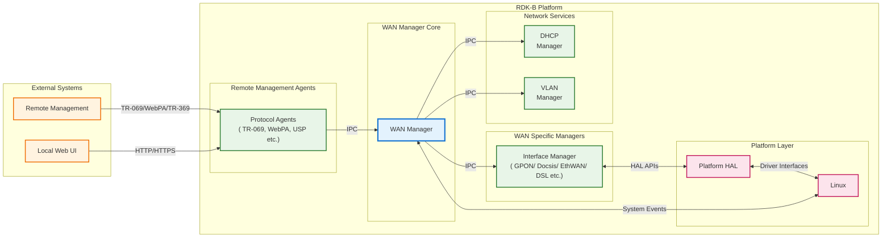
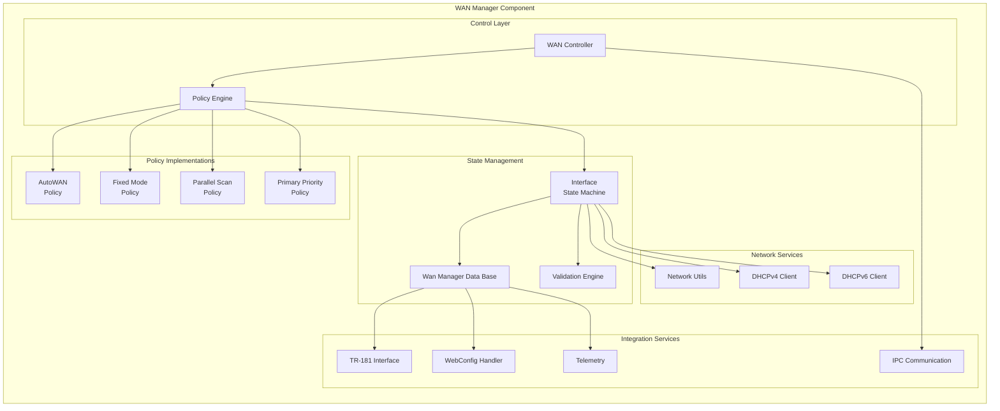
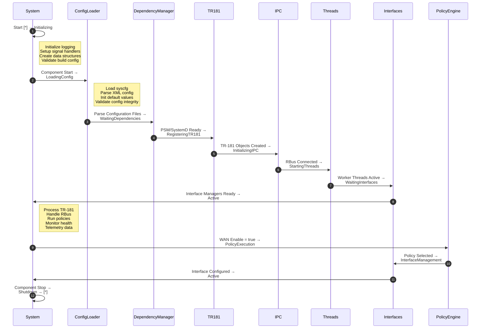
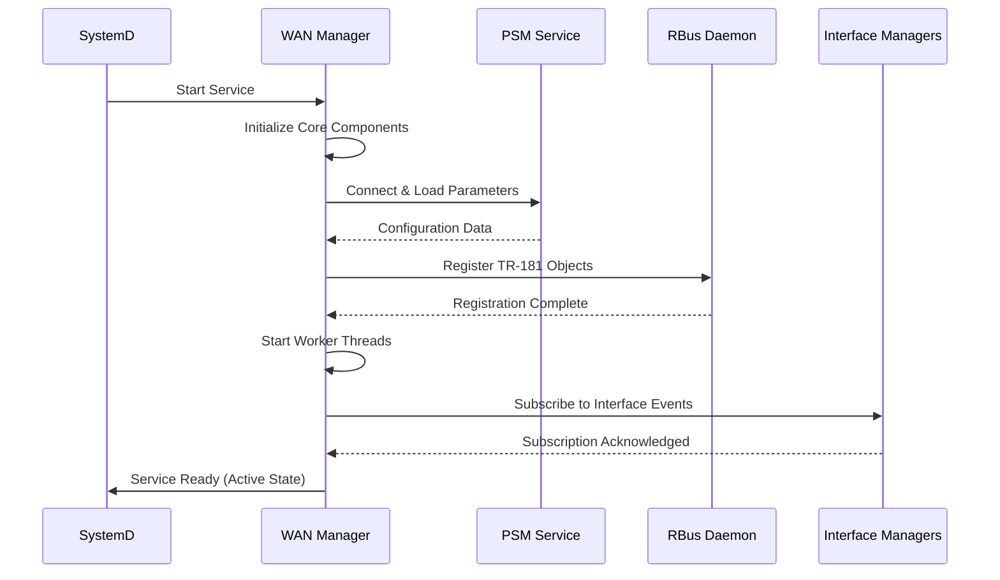
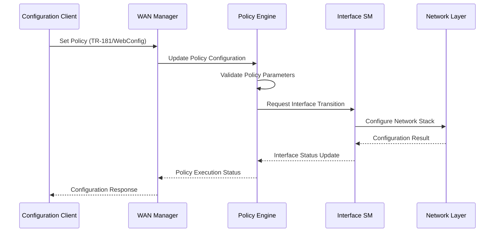
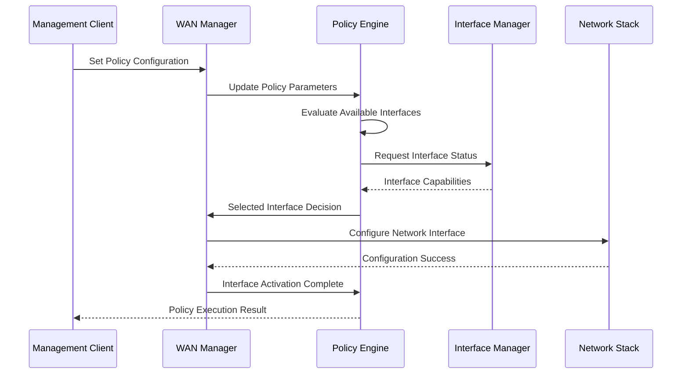
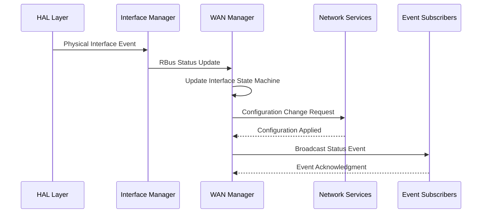

# WAN Manager Documentation

WAN Manager is the RDK-B middleware component that manages WAN connectivity across various network interfaces, including DOCSIS, Ethernet, Cellular, DSL, and PON. It coordinates interface selection, configuration, and failover to maintain reliable internet connectivity for CPE devices. Acting as a centralized control plane, WAN Manager interacts with multiple Interface Managers (DOCSIS, Cellular, Ethernet, etc.) to manage link and IP layer configurations using policy-based selection algorithms. It provides unified WAN management that abstracts the complexity of diverse WAN technologies from upper-layer applications and services. It integrates with the RDK-B TR-181 data model to offer standardized configuration and monitoring interfaces and supports modern RBus communication paradigms.

At the module level, WAN Manager delivers key services such as WAN interface state management, policy-based selection, DHCP client coordination, network validation, telemetry reporting, and integration with other RDK-B components through defined IPC mechanisms.




**Key Features & Responsibilities**: 

- **Multi-Interface WAN Management**: Manages multiple WAN interface types (DOCSIS, Cellular, Ethernet, DSL, PON) through unified policy-based selection algorithms ensuring optimal connectivity based on availability, priority, and validation status
- **Policy-Based Interface Selection**: Implements seven distinct selection policies (Fixed Mode, Primary Priority, AutoWAN, Parallel Scan, and their variants) providing flexible interface selection strategies based on deployment requirements and network conditions
- **Intelligent Failover and Redundancy**: Provides automatic WAN interface failover with configurable restoration delays, backup interface support, and seamless switching between interface groups to maintain continuous connectivity
- **Comprehensive State Machine Management**: Orchestrates WAN interface lifecycle through sophisticated state machines handling VLAN configuration, PPP setup, IP address acquisition, validation, and teardown processes with proper error handling
- **Network Validation and Health Monitoring**: Performs DNS connectivity checks, internet validation, and continuous health monitoring of active WAN connections with configurable validation parameters and retry mechanisms
- **TR-181 Data Model Integration**: Exposes comprehensive TR-181 parameter tree for WAN management configuration, status monitoring, and statistics reporting with both standard and custom extensions for advanced features
- **Multi-Protocol IP Support**: Handles IPv4, IPv6, and dual-stack configurations with automatic protocol selection, DHCPv4/DHCPv6 client management, and support for advanced features like MAPT and 464XLAT tunneling

## Design

WAN Manager's architecture is built around a modular, event-driven design that separates functionality between interface management, policy implementation, and state machine control. The core design principle emphasizes centralized WAN management while maintaining communications  with Interface Managers through well-defined IPC boundaries. The component employs a layered architecture where the Policy Controller manages high-level interface selection decisions, the Interface State Machine handles low-level configuration details, and the Data Management layer provides thread-safe access to configuration and runtime state. The design handles the complexity of multiple WAN technologies by abstracting interface-specific details into dedicated Interface Managers while centralizing common networking logic within WAN Manager itself. This separation allows Interface Managers to focus on physical layer bring-up and technology-specific configuration while WAN Manager orchestrates link layer setup, IP configuration, routing, and validation. The component's state-driven approach ensures predictable behavior during interface transitions, failures, and recovery scenarios.

The north-bound interface design integrates seamlessly with RDK-B's configuration management ecosystem through TR-181 parameter exposure, and RBus messaging. The south-bound interface leverages both HAL abstraction for hardware interaction and direct Linux system calls for network configuration, providing flexibility while maintaining portability. The design incorporates comprehensive error handling, logging, and telemetry capabilities to support troubleshooting and performance monitoring in production environments.

IPC mechanisms are carefully designed around RBus, with message-based communication ensuring loose coupling between WAN Manager and Interface Managers. The design supports both synchronous and asynchronous communication patterns, enabling responsive interface management while preventing blocking operations that could impact overall system performance.

Data persistence and configuration management are handled through a combination of PSM (Persistent Storage Manager) integration for TR-181 parameters, syscfg for device-specific settings, and sysevent for real-time system state communication. This multi-tiered approach ensures configuration persistence across reboots while providing efficient runtime state management.




### Prerequisites and Dependencies

**Build-Time DISTRO Features and Flags:**

| DISTRO Feature | Purpose | Impact | Recipe Usage |
|----------------|---------|---------|--------------|
| `ipoe_health_check` | IPoE health monitoring | Adds `FEATURE_IPOE_HEALTH_CHECK` compile flag | IPoE connection health validation |
| `feature_mapt` or `unified_mapt` | MAP-T tunneling support | Adds `FEATURE_MAPT`, `FEATURE_MAPT_DEBUG`, `NAT46_KERNEL_SUPPORT` flags | IPv4/IPv6 transition technology |
| `dhcp_manager` | DHCP Manager integration | Adds `FEATURE_RDKB_DHCP_MANAGER` XML define and configure flag | Enhanced DHCP management |


**XML Configuration Files (Runtime Selection):**

| Configuration File | Selection Logic | Purpose |
|--------------------|-----------------|---------|
| `RdkWanManager.xml` | Used when WAN unification is disabled | Standard WAN Manager TR-181 data model |
| `RdkWanManager_v2.xml` | Used when `WanManagerUnificationEnable` DISTRO feature is enabled | Unified WAN Manager TR-181 data model |

**RDK-B Platform and Integration Requirements:**

- **RDK-B Components**: PSM (Persistent Storage Manager), SystemD service manager, DHCP Manager, Network Monitor
- **HAL Dependencies**: Platform HAL, WiFi HAL (for interface status monitoring)
- **Systemd Services**: `rbus.service`, `psm.service`, `systemd-networkd.service` must be active before WAN Manager starts
- **Message Bus**: RBus registration under `Device.X_RDK_WanManager.*` namespace
- **TR-181 Data Model**: `Device.X_RDK_WanManager.*` parameter tree implementation, Interface Manager TR-181 objects for status reporting
- **Configuration Files**: `PSM DB files`, `syscfg.db` for persistent configuration storage
- **Startup Order**: Interface Managers → WAN Manager → Network Services → Upper Layer Applications initialization sequence

<br>

**Threading Model:** 

WAN Manager employs a multi-threaded architecture designed to handle concurrent WAN interface management, policy execution, and system integration without blocking operations. The threading model separates control plane operations from data plane configuration to ensure responsive system behavior during interface transitions and network events.

- **Threading Architecture**: Multi-threaded with specialized worker threads for different functional areas
- **Main Thread**: Handles component initialization, TR-181 parameter registration, RBus message processing, and coordinates overall component lifecycle
- **Worker Threads**: 
    - **Policy Controller Thread**: Executes WAN selection policies, manages interface priority, and coordinates failover decisions with 500ms iteration cycles
    - **Interface State Machine Threads**: One thread per WAN interface handling VLAN configuration, PPP setup, DHCP client management, and validation processes with 50ms state machine intervals
    - **Validation Thread**: Performs DNS connectivity checks, internet validation, and network health monitoring without blocking interface operations
- **Synchronization**: Thread-safe data access using mutex locks around shared data structures, condition variables for thread coordination, and lock-free queues for high-frequency event processing

### Component State Flow

**Initialization to Active State**

WAN Manager follows a structured initialization sequence that ensures all dependencies are satisfied before beginning WAN interface management operations. The component waits for critical RDK-B services to become available, registers its TR-181 data model, establishes IPC connections, and initializes policy engines before transitioning to active operation.



**Runtime State Changes and Context Switching**

During normal operation, WAN Manager responds to various runtime events including interface status changes, policy configuration updates, validation failures, and external control signals. The component maintains operational context across these state changes while ensuring consistent interface management behavior.

**State Change Triggers:**

- **Interface Events**: Physical layer up/down notifications from Interface Managers triggering policy re-evaluation and interface state machine transitions
- **Configuration Updates**: TR-181 parameter changes, WebConfig updates, or policy modifications requiring active interface reconfiguration or policy switching
- **Validation Failures**: DNS connectivity failures, internet validation timeouts, or network health degradation triggering automatic failover or interface reset procedures
- **System Events**: Network topology changes, DHCP lease events, or routing table updates affecting active WAN interface configuration and traffic flow

**Context Switching Scenarios:**

- **Policy Changes**: Runtime switching between FIXED_MODE, AUTOWAN_MODE, PARALLEL_SCAN, or other policies requiring graceful interface transitions and state preservation
- **Interface Failover**: Automatic switching from primary to backup interfaces while maintaining network sessions and preserving configuration state for restoration
- **Configuration Refresh**: Hot-reload of configuration parameters without service interruption, requiring coordination between policy engines and active state machines

### Call Flow

**Initialization Call Flow:**



**Request Processing Call Flow:**



## TR‑181 Data Models

### Supported TR-181 Parameters

WAN Manager implements a comprehensive TR-181 data model under the `Device.X_RDK_WanManager.*` namespace, providing complete control and monitoring capabilities for WAN interface management. The implementation follows BBF TR-181 Issue 2 Amendment 15 specifications while incorporating RDK-specific extensions for advanced WAN management features.

### Object Hierarchy

```
Device.
└── X_RDK_WanManager.
    ├── Enable (boolean, R/W)
    ├── Policy (string, R/W) 
    ├── Data (string, R/W)
    ├── ResetActiveInterface (boolean, R/W)
    ├── AllowRemoteInterfaces (boolean, R/W)
    ├── ResetDefaultConfig (boolean, R/W)
    ├── RestorationDelay (unsignedInt, R/W)
    ├── WanFailoverData (string, R/W)
    ├── DnsConnectivityCheck.
    │   └── Enable (boolean, R/W)
    └── CPEInterface.{i}.
        ├── EnableOperStatusMonitor (boolean, R/W)
        ├── ConfigureWanEnable (boolean, R/W)
        ├── EnableCustomConfig (boolean, R/W)
        ├── CustomConfigPath (string, R/W)
        ├── Name (string, R/W)
        ├── DisplayName (string, R/W)
        ├── Phy.
        │   ├── Path (string, R/W)
        │   └── Status (string, R/W)
        ├── Wan.
        │   ├── Enable (boolean, R/W)
        │   ├── Status (string, R)
        │   ├── Type (string, R/W)
        │   ├── Priority (unsignedInt, R/W)
        │   └── Group (unsignedInt, R/W)
        ├── VirtualInterface.{i}.
        │   ├── Enable (boolean, R/W)
        │   ├── Status (string, R)
        │   ├── Name (string, R/W)
        │   ├── Alias (string, R/W)
        │   ├── VLAN.
        │   │   ├── Enable (boolean, R/W)
        │   │   ├── VLANId (unsignedInt, R/W)
        │   │   └── TPId (unsignedInt, R/W)
        │   ├── PPP.
        │   │   ├── Enable (boolean, R/W)
        │   │   ├── Status (string, R)
        │   │   ├── Username (string, R/W)
        │   │   └── Password (string, R/W)
        │   ├── IP.
        │   │   ├── Mode (string, R/W)
        │   │   ├── IPv4Status (string, R)
        │   │   ├── IPv6Status (string, R)
        │   │   └── Dhcpv4.
        │   │       ├── Enable (boolean, R/W)
        │   │       ├── Status (string, R)
        │   │       └── RequestOptions (string, R/W)
        │   └── Dhcpv6.
        │       ├── Enable (boolean, R/W)
        │       ├── Status (string, R)
        │       └── RequestOptions (string, R/W)
```

### Parameter Definitions

**Core Parameters:**

| Parameter Path | Data Type | Access | Default Value | Description | BBF Compliance |
|----------------|-----------|--------|---------------|-------------|----------------|
| `Device.X_RDK_WanManager.Enable` | boolean | R/W | `true` | Master enable/disable control for WAN Manager component. When disabled, all WAN interface management operations are suspended and existing connections are maintained in current state. | Custom Extension |
| `Device.X_RDK_WanManager.Policy` | string | R/W | `"AUTOWAN_MODE"` | WAN interface selection policy defining algorithm used for interface selection. Enumerated values: FIXED_MODE_ON_BOOTUP, FIXED_MODE, PRIMARY_PRIORITY_ON_BOOTUP, PRIMARY_PRIORITY, MULTIWAN_MODE, AUTOWAN_MODE, PARALLEL_SCAN. | Custom Extension |
| `Device.X_RDK_WanManager.Data` | string | R/W | `""` | JSON-encoded configuration data for advanced policy parameters, interface priorities, and custom validation settings. Used for WebConfig integration and bulk configuration updates. | Custom Extension |
| `Device.X_RDK_WanManager.RestorationDelay` | unsignedInt | R/W | `60` | Time in seconds to wait before attempting to restore primary interface after failover event. Prevents rapid interface flapping during unstable network conditions. | Custom Extension |
| `Device.X_RDK_WanManager.CPEInterface.{i}.Name` | string | R/W | `"erouter0"` | Logical interface name used for WAN interface identification within RDK-B middleware. Must be unique across all WAN interfaces in the system. | Custom Extension |
| `Device.X_RDK_WanManager.CPEInterface.{i}.Phy.Status` | string | R/W | `"Down"` | Physical interface status reported by Interface Manager. Enumerated values: Down, Initializing, Up. Reflects actual hardware interface state. | Custom Extension |
| `Device.X_RDK_WanManager.CPEInterface.{i}.Wan.Type` | string | R/W | `"DOCSIS"` | WAN technology type for interface classification. Enumerated values: DOCSIS, ETHERNET, CELLULAR, DSL, PON, REMOTE. Used for policy selection and interface prioritization. | Custom Extension |
| `Device.X_RDK_WanManager.CPEInterface.{i}.Wan.Priority` | unsignedInt | R/W | `1` | Interface selection priority within policy group. Lower numerical values indicate higher priority. Range 1-255 where 1 is highest priority. | Custom Extension |
| `Device.X_RDK_WanManager.CPEInterface.{i}.VirtualInterface.{i}.IP.Mode` | string | R/W | `"DHCP"` | IP address assignment method for virtual interface. Enumerated values: DHCP, Static, None. Determines IPv4/IPv6 configuration strategy. | TR-181 Derived |

### Parameter Registration and Access

- **Implemented Parameters**: All parameters listed above are implemented with validation, persistence, and event notification support through WAN Manager's TR-181 handler
- **Parameter Registration**: Parameters are registered during component initialization through RBus data model provider interface with automatic PSM persistence and sysevent notification integration
- **Access Mechanism**: External components access parameters via RBus method calls using standard TR-181 get/set operations with full parameter validation and change notification support
- **Validation Rules**: Parameter values are validated against enumerated value sets, range constraints, and interdependency rules. Invalid configurations are rejected with appropriate error codes returned to calling applications

## WAN Selection Policies

WAN Manager implements seven distinct policy types that provide flexible interface selection strategies based on deployment requirements, network conditions, and operational preferences. Each policy implements specific algorithms for interface evaluation, selection, and failover management while maintaining consistent behavior patterns across different WAN technologies.

### Policy Type Descriptions

**FIXED_MODE_ON_BOOTUP (1)**
Selects the first available WAN interface during system initialization and maintains that selection throughout the operational session. This policy provides predictable interface selection for deployments requiring consistent WAN interface usage without automatic switching. The policy evaluates interfaces in configuration order during boot and locks selection until manual intervention or system restart.

**FIXED_MODE (2)**  
Similar to Fixed Mode on Bootup but allows runtime reconfiguration of the fixed interface selection. This policy maintains interface persistence but responds to administrative commands for interface changes. Useful for managed deployments where interface selection should remain stable but allow for operational flexibility through management intervention.

**PRIMARY_PRIORITY_ON_BOOTUP (3)**
Implements priority-based interface selection during system initialization, selecting the highest priority available interface and maintaining that selection. Priority assignment is based on configured interface priority values with failover to next priority interface only upon complete failure of selected interface. Provides predictable startup behavior with deterministic fallback sequences.

**PRIMARY_PRIORITY (4)**
Extends Primary Priority on Bootup with runtime priority evaluation and automatic restoration to higher priority interfaces when they become available. This policy continuously monitors interface availability and automatically switches back to higher priority interfaces after configured restoration delays, ensuring optimal interface utilization based on administrative priorities.

**MULTIWAN_MODE (5)**
Enables simultaneous utilization of multiple WAN interfaces for load balancing, redundancy, or service separation. This policy manages multiple active WAN connections with traffic distribution algorithms, automatic failover between active interfaces, and support for interface-specific routing policies. Requires advanced networking capabilities and careful traffic management configuration.

**AUTOWAN_MODE (6)**
Implements intelligent interface selection using validation-based algorithms that test each interface for internet connectivity before selection. The policy attempts interfaces in priority order, performing DNS resolution tests, HTTP connectivity validation, and network health checks before committing to interface selection. Provides interface selection for environments with unreliable WAN connections.

**PARALLEL_SCAN (7)**
Simultaneously evaluates all available WAN interfaces in parallel, selecting the interface that achieves validation fastest or meets optimal performance criteria. This policy reduces interface selection time in multi-interface deployments and provides rapid failover capabilities by maintaining ready-state validation on backup interfaces. Optimal for time-sensitive applications requiring minimal WAN transition delays.

### Policy Selection Matrix

| Policy Type | Boot Behavior | Runtime Switching | Validation Required | Multi-Interface | Use Case |
|------------|---------------|-------------------|-------------------|-----------------|----------|
| FIXED_MODE_ON_BOOTUP | First Available | None | No | No | Simple deployments |
| FIXED_MODE | Configured | Manual Only | No | No | Managed networks, predictable routing |
| PRIMARY_PRIORITY_ON_BOOTUP | Highest Priority | Failover Only | No | Sequential | Reliable primary/backup scenarios |
| PRIMARY_PRIORITY | Highest Priority | Auto-Restoration | No | Sequential | Dynamic priority-based selection |
| MULTIWAN_MODE | All Available | Load Balance | Optional | Yes | High availability, load distribution |
| AUTOWAN_MODE | First Validated | Validation-Based | Yes | Sequential | Unreliable WAN environments |
| PARALLEL_SCAN | Fastest Validated | Performance-Based | Yes | Concurrent | Low-latency requirements |

## Internal Modules

WAN Manager's modular architecture separates functional responsibilities across specialized modules, each handling specific aspects of WAN interface management while maintaining clear interfaces and dependencies between components.

| Module/Class | Description | Key Files |
|-------------|------------|-----------|
| **WAN Controller** | Main orchestration engine coordinating policy execution, interface state machine management, and system integration. Implements the primary control loop and event dispatch mechanisms. | `wanmgr_controller.c`, `wanmgr_controller.h` |
| **Policy Implementations** | Seven distinct policy algorithm implementations providing different interface selection strategies. Each policy operates as an independent state machine with specific selection logic. | `wanmgr_policy_*.c` (autowan, fm, fmob, parallel_scan, pp, ppob, auto) |
| **Interface State Machine** | Per-interface state machine managing VLAN configuration, PPP setup, IP address acquisition, validation, and teardown processes. Handles complete interface lifecycle management. | `wanmgr_interface_sm.c`, `wanmgr_interface_sm.h` |
| **Data Manager** | Thread-safe data access layer providing centralized configuration and runtime state management with mutex protection and change notification mechanisms. | `wanmgr_data.c`, `wanmgr_data.h` |
| **TR-181 Interface Layer** | Complete TR-181 data model implementation with parameter validation, persistence integration, and change notification support for external component integration. | `wanmgr_dml_*.c`, `wanmgr_apis.h` |
| **Network Utilities** | Low-level networking operations including route management, interface configuration, DNS validation, and system integration functions for Linux networking stack. | `wanmgr_net_utils.c`, `wanmgr_net_utils.h` |
| **DHCP Client Management** | DHCPv4 and DHCPv6 client coordination including lease management, option handling, and integration with WAN interface state machines for IP configuration. | `wanmgr_dhcpv4_*.c`, `wanmgr_dhcpv6_*.c` |
| **IPC Communication** | RBus integration handling message routing, event subscription, and communication with Interface Managers and other RDK-B components. | `wanmgr_ssp_messagebus_interface.c`, `wanmgr_ipc.c` |
| **Telemetry Integration** | T2 telemetry framework integration providing metrics collection, performance monitoring, and diagnostic data reporting for operational visibility. | `wanmgr_telemetry.c`, `wanmgr_t2_telemetry.c` |


## Component Interactions

WAN Manager serves as a central coordination point within the RDK-B architecture, interfacing with Interface Managers for physical layer status, Network Services for configuration management, System Services for network stack integration, and Management Components for remote configuration and monitoring capabilities.

### Interaction Matrix

| Target Component/Layer | Interaction Purpose | Key APIs/Endpoints |
|------------------------|---------------------|--------------------|
| **RDK-B Middleware Components** |
| DOCSIS Manager | DOCSIS interface status monitoring, configuration coordination | `Device.X_RDKCENTRAL-COM_DOCSIS.`, `wanmgr.interface.status` |
| Cellular Manager | Cellular interface control, signal quality monitoring | `Device.Cellular.Interface.`, `wanmgr.cellular.events` |
| Ethernet Manager | Ethernet port management, link status monitoring | `Device.Ethernet.Interface.`, `wanmgr.ethernet.status` |
| DHCP Manager | IP lease coordination, DHCP option configuration | `/var/lib/dhcp/dhclient.leases`, `udhcpc` process control |
| VLAN Manager | VLAN interface creation, VLAN ID management | `Device.Ethernet.VLANTermination.`, `ip link` commands |
| RBus Daemon | Real-time event publication and component discovery | `rbus_open()`, `rbusEvent_Publish()`, `rbusMethod_InvokeAsync()` |
| **System & HAL Layers** |
| PSM Service | TR-181 parameter persistence, configuration storage | `getRecordNames()`, `setRecordValue()`, `getRecordValue()` |
| System Events | Real-time system state communication | `sysevent_set()`, `sysevent_get()`, event subscriptions |
| Network Stack | Interface configuration, routing, DNS setup | `ioctl()`, `netlink`, `/proc/net/route`, `resolv.conf` |

<br>

**Events Published by WAN Manager:**

| Event Name | Event Topic/Path | Trigger Condition | Subscriber Components |
|-------------|------------------|-------------------|-----------------------|
| `wan_interface_active` | `wanmgr.interface.active` | WAN interface successfully validated and activated | Firewall Manager, Bridge Manager, Network Monitor |
| `wan_interface_down` | `wanmgr.interface.down` | WAN interface failure or administrative shutdown | DHCP Manager, DNS Resolver |
| `wan_policy_change` | `wanmgr.policy.change` | WAN selection policy modification or update | Management Agents, Telemetry Service |
| `wan_failover_event` | `wanmgr.failover.event` | Automatic failover between WAN interfaces | Network Monitor, Telemetry Service, Management Systems |


**Events Consumed by WAN Manager:**

| Event Source | Event Topic/Path | Purpose | Handler Function |
|---------------|------------------|----------|------------------|
| Interface Managers | `interface.status.change` | React to physical interface state changes | `WanMgr_Interface_EventHandler()` |
| DHCP Clients | `dhcp.lease.acquired` | Process IP address lease information | `WanMgr_DHCP_LeaseHandler()` |
| System Events | `network.topology.change` | Respond to network topology modifications | `WanMgr_SysEvent_Handler()` |
| WebConfig Service | `webconfig.wan.update` | Apply bulk configuration changes | `WanMgr_WebConfig_Handler()` |


### IPC Flow Patterns

**Primary IPC Flow - Interface Selection and Activation:**



**Event Notification Flow - Interface Status Changes:**



## Implementation Details

### Major HAL APIs

WAN Manager integrates with Platform HAL primarily through Interface Manager components but also directly accesses certain HAL APIs for system-level network operations and hardware status monitoring.

**Core HAL APIs:**

| HAL API | Purpose | Implementation File |
|----------|----------|---------------------|
| `platform_hal_GetHardware_MemUsed` | Memory usage monitoring for resource management | `wanmgr_utils.c` |
| `platform_hal_GetDeviceProperties` | Hardware capability detection for interface support | `wanmgr_core.c` |
| `platform_hal_SetSNMPEnable` | SNMP service coordination during interface changes | `wanmgr_interface_sm.c` |
| `platform_hal_GetFanSpeed` | System thermal monitoring during high network load | `wanmgr_telemetry.c` |


### Key Implementation Logic

- **State Machine Engine**: Core state machine implementation centered in `wanmgr_interface_sm.c` with individual interface state machines running in dedicated threads. Each state machine handles complete interface lifecycle from VLAN configuration through IP acquisition to validation and teardown. State transitions are driven by events from Interface Managers, DHCP clients, and validation engines with comprehensive error handling and recovery mechanisms. State transition handlers implemented in interface state machine with 50ms iteration cycles for responsive interface management

  State machine progression: STANDBY → VLAN_CONFIGURING → PPP_CONFIGURING → OBTAINING_IP_ADDRESSES → VALIDATING_WAN → [IPV4_LEASED/IPV6_LEASED/DUAL_STACK_ACTIVE] → REFRESHING_WAN → DECONFIGURING_WAN → EXIT

- **Event Processing**: Hardware and network events processed through multi-threaded event handling system with separate threads for Interface Manager events, DHCP client notifications, and system events. Event processing includes filtering, queuing, and prioritization to ensure critical interface events receive immediate attention while maintaining system responsiveness. RBus event subscriptions for Interface Manager status updates, DHCP lease notifications, and system configuration changes. Asynchronous event processing prevents blocking operations that could delay interface state transitions

- **Error Handling Strategy**: Comprehensive error detection through interface validation, network connectivity testing, and HAL operation result checking. Errors trigger appropriate recovery actions including interface reset, policy re-evaluation, or component restart. Error classification system differentiates between recoverable failures and permanent conditions requiring administrative intervention. Multi-level retry logic with exponential backoff for transient failures are present. Timeout handling & retry logic implemented for DHCP operations, DNS validation, and interface configuration with configurable parameters

- **Logging & Debugging**: Structured logging using CCSP trace framework with categorized log levels (INFO, WARN, ERROR, DEBUG) and component-specific prefixes. Logging includes interface state transitions, policy decisions, validation results, and system integration events to support troubleshooting and performance analysis.  Debug logging for policy execution decisions, interface state machine transitions, and network validation processes and debug hooks for troubleshooting connectivity issues including packet capture integration and detailed validation logging are available

### Key Configuration Files

| Configuration File | Purpose |Override Mechanisms |
|--------------------|---------|--------------------|
| `/etc/utopia/system_defaults` | System-wide default configuration | Environment variables, syscfg overrides |
| `/nvram/syscfg.db` | Persistent device configuration | TR-181 parameter updates, factory reset |
