# CcspCommonLibrary Documentation

## 1. Overview

- **Purpose in RDK‑B Stack**: CcspCommonLibrary serves as the foundational shared infrastructure and support framework for the entire RDK‑B CCSP (Common Component Software Platform) ecosystem. It provides centralized runtime services, configuration templates, service orchestration scripts, and common utility libraries that enable consistent deployment, management, and inter-component communication across all CCSP agents and RDK‑B middleware components.

- **Key Features & Responsibilities**: CcspCommonLibrary delivers common runtime support code for CCSP component initialization and lifecycle management, standardized message bus configuration templates for both legacy CCSP and modern RBUS communication, comprehensive service orchestration scripts supporting multiple hardware architectures (ARM, Atom, MIPS, PC), extensive systemd service unit definitions for unified RDK‑B component deployment, shared utility APIs for configuration parsing and inter-component coordination, debug and diagnostic infrastructure for system-wide troubleshooting, data model packing utilities for TR-181 parameter serialization, and controlled migration tools for system upgrades and configuration evolution.

- **Role in Broadband Router Architecture**: Architecturally, CcspCommonLibrary operates as the horizontal infrastructure substrate beneath all functional CCSP agents and RDK‑B components. It eliminates code duplication by providing shared services for component bootstrapping, configuration management, message bus integration, and service lifecycle control. The library enables consistent deployment patterns, standardized logging mechanisms, and unified restart/recovery procedures across the entire platform, ensuring that diverse functional components (WiFi, Ethernet, Telemetry, TR-069, etc.) operate within a cohesive and manageable framework.

## 2. Architecture / Design

### 2.1 High‑Level Design Principles

The architecture embodies principles of centralized infrastructure provision through shared libraries and configuration templates, modular separation with distinct source directories for different functional concerns (ccsp/, cosa/, util_api/, debug_api/, dm_pack/), deployment standardization via comprehensive systemd unit definitions and architecture-specific scripts, configuration abstraction enabling tunneled vs direct operation modes through paired config files, controlled evolution through version tracking and migration tooling, and operational consistency through standardized service lifecycle management and restart procedures. The design emphasizes reducing duplication across CCSP components while maintaining flexibility for platform-specific customization and deployment variations.

### 2.2 Component Boundaries & Responsibilities

**CCSP Core Infrastructure**: Provides fundamental CCSP framework support through the `source/ccsp/` directory, including component registration, identity management, and baseline service patterns that enable consistent CCSP agent behavior across the platform.

**COSA Abstraction Layer**: Implements Component Object Service Abstraction patterns via `source/cosa/` modules, providing object-oriented interfaces and wrapper utilities that simplify data model implementation and parameter management for CCSP agents.

**Utility API Layer**: Delivers reusable utility functions through `source/util_api/` for configuration parsing, string manipulation, time management, and other common operations required across multiple CCSP components.

**Debug and Diagnostic Infrastructure**: Supplies debugging and diagnostic capabilities via `source/debug_api/` with structured logging frameworks, conditional trace mechanisms, and diagnostic hooks that enable systematic troubleshooting across the platform.

**Data Model Packing Services**: Provides TR-181 data model serialization and marshalling utilities through `source/dm_pack/` that enable consistent parameter handling and inter-component data exchange.

**Service Orchestration Framework**: Manages component lifecycle through comprehensive scripts in `scripts/` directory, supporting multi-architecture deployment, controlled startup/shutdown sequences, and restart coordination across CCSP agents.

**Configuration Management**: Centralizes configuration templates in `config/` directory with support for operational mode variations (tunneled vs direct) and message bus parameter standardization across deployment scenarios.

### 2.3 Threading Model (if applicable)

CcspCommonLibrary itself does not implement a specific threading model, as it primarily provides infrastructure libraries and configuration templates. However, it supplies thread-safe utility functions and synchronization primitives that consuming CCSP components can utilize. The service orchestration scripts operate in single-threaded shell environments, while the shared libraries provide thread-safe APIs that support multi-threaded CCSP agent implementations.

### 2.4 C4 System Context Diagram

```mermaid
graph TD
    subgraph "RDK‑B Platform"
        Operators[👤 System Operators<br/>Configuration & Management]
        CCSPAgents[🔧 CCSP Agents<br/>WiFi, Ethernet, Telemetry, TR-069]
    end
    
    subgraph "External Systems"
        Management[🌐 Management Systems<br/>ACS, Cloud Services]
        Hardware[⚙️ Hardware Platform<br/>Network Interfaces, Storage]
    end
    
    Operators -->|Configuration Scripts| CcspCommonLibrary
    CCSPAgents -->|Shared Libraries & APIs| CcspCommonLibrary
    Management -->|Remote Configuration| CcspCommonLibrary
    
    subgraph "CcspCommonLibrary Container"
        Infrastructure[🏗️ Common Infrastructure<br/>Libraries, Scripts, Configuration Templates]
        Infrastructure -.->|"Service Orchestration, Config Management, Utility APIs"| Infrastructure
    end
    
    CcspCommonLibrary -->|Service Control| SystemD[🔧 systemd Service Manager]
    CcspCommonLibrary -->|Message Bus Config| MessageBus[📡 DBus/RBUS Infrastructure]
    CcspCommonLibrary -->|Platform Integration| Hardware

    classDef user fill:#fff3e0,stroke:#ef6c00,stroke-width:2px;
    classDef component fill:#e1f5fe,stroke:#0277bd,stroke-width:2px;
    classDef external fill:#e8f5e8,stroke:#2e7d32,stroke-width:2px;
    
    class Operators,CCSPAgents user;
    class CcspCommonLibrary,Infrastructure component;
    class Management,Hardware,SystemD,MessageBus external;
```

### 2.5 C4 Container Diagram

### 2.6 Design Explanation & Request Flow

**Library Integration Flow**: CCSP components link against shared libraries during build-time, incorporating common utility functions, CCSP framework support, and data model packing capabilities. Runtime initialization utilizes configuration templates and service scripts to establish consistent component behavior and message bus connectivity.

**Service Orchestration Flow**: System deployment begins with systemd service unit installation, followed by architecture-specific script execution that initializes components with appropriate configuration templates. The restart and termination handlers provide coordinated lifecycle management across all CCSP agents.

**Configuration Management Flow**: Deployment scenarios select between standard and tunneled configuration variants, enabling operational mode flexibility without code changes. Message bus configuration templates ensure consistent communication parameters across all components.

**Technology Stack**: C programming language for shared libraries, Bash scripting for service orchestration, systemd for service management, DBus and RBUS for inter-component communication, GNU Autotools for build system, XML for configuration templates.

## 3. Internal Modules

The internal structure of CcspCommonLibrary reflects a comprehensive infrastructure approach with clear functional separation across distinct source directories. Each module provides specialized services that eliminate code duplication across CCSP components while maintaining clear boundaries and responsibilities.

| Module/Class | Description | Key Files |
|-------------|------------|-----------|
| **CCSP Core Framework** | Fundamental CCSP component support and framework utilities | `source/ccsp/*` (directory structure) |
| **COSA Abstraction** | Component Object Service Abstraction layer and wrapper utilities | `source/cosa/*` (directory structure) |
| **Utility API Library** | Common utility functions for configuration, string handling, time management | `source/util_api/*` |
| **Debug API Framework** | Structured logging, diagnostic hooks, conditional tracing infrastructure | `source/debug_api/*` |
| **Data Model Packing** | TR-181 parameter serialization and marshalling utilities | `source/dm_pack/*` |
| **Test Framework** | Unit testing infrastructure and validation frameworks | `source/test/*` |
| **Service Orchestration Scripts** | Multi-architecture service lifecycle management scripts | `scripts/ccsp_restart.sh`, `scripts/cosa_start_*.sh` |
| **Architecture-Specific Launchers** | Platform-specific component initialization scripts | `scripts/cli_start_arm.sh`, `scripts/cli_start_atom.sh`, etc. |
| **RBUS Integration Scripts** | RBUS flag synchronization and termination handling | `scripts/rbusFlagSync.sh`, `scripts/rbus_termination_handler.sh` |
| **Configuration Templates** | Message bus and service configuration templates | `config/basic.conf`, `config/ccsp_msg.cfg` |
| **Tunneled Config Variants** | Alternative configuration for tunneled operation modes | `config/basic_tunneled.conf`, `config/ccsp_msg_tunneled.cfg` |
| **SystemD Service Definitions** | Comprehensive service unit definitions for all CCSP components | `systemd_units/*.service`, `systemd_units/*.conf` |
| **SystemD Timer Units** | Timer-based service scheduling and monitoring | `systemd_units/*.timer`, `systemd_units/*.path` |
| **Platform Config Files** | Hardware-specific configuration templates | `systemd_units/docsis.conf`, `systemd_units/epon.conf` |

### 3.1 Module Breakdown Diagram

## 4. Interaction with Other Middleware Components

CcspCommonLibrary serves as the foundational infrastructure layer that enables and coordinates interactions among all RDK‑B middleware components. Rather than direct peer-to-peer communication, the library provides the common substrate that facilitates standardized component behavior, consistent configuration management, and unified service lifecycle control across the entire CCSP ecosystem.

| Component | Purpose of Interaction | Protocols/Mechanisms |
|-----------|-----------------------|----------------------|
| **All CCSP Agents** | Link-time library integration and runtime framework support | Static/dynamic linking, shared header inclusion |
| **CcspLMLite** | Service definition and lifecycle management | systemd service units, orchestration scripts |
| **CcspPsm** | Configuration template provision and service control | systemd units, configuration files |
| **CcspTr069PaSsp** | Message bus configuration and service orchestration | DBus/RBUS config templates, service scripts |
| **CcspWifiAgent** | Framework utilities and diagnostic infrastructure | Shared libraries, debug API integration |
| **CcspTelemetry** | Data model packing and service management | dm_pack utilities, systemd service definitions |
| **CcspWebUI** | Service coordination and configuration templates | systemd dependencies, config file templates |
| **Harvester** | Service definition and orchestration support | systemd service units, startup scripts |
| **systemd Manager** | Service unit provisioning and lifecycle coordination | Service unit files, timer definitions, path monitoring |
| **DBus/RBUS Infrastructure** | Configuration template provision and parameter standardization | Configuration files, message bus templates |

### 4.1 Middleware Interaction Diagram

```mermaid
flowchart TD
    subgraph "CCSP Agent Layer"
        LMLite[📊 CcspLMLite<br/>Network Monitoring]
        PSM[💾 CcspPsm<br/>Parameter Storage]
        TR069[🔧 CcspTr069PaSsp<br/>Remote Management]
        WiFi[📡 CcspWifiAgent<br/>WiFi Management]
        Telemetry[📈 CcspTelemetry<br/>Data Collection]
        WebUI[🖥️ CcspWebUI<br/>Web Interface]
        Harvester[📊 Harvester<br/>Data Harvesting]
    end
    
    subgraph "CcspCommonLibrary Infrastructure"
        CommonLib[🏗️ CcspCommonLibrary<br/>Shared Infrastructure]
    end
    
    subgraph "System Infrastructure"
        SystemD[⚙️ systemd Manager<br/>Service Control]
        MessageBus[📡 DBus/RBUS<br/>Message Bus]
        FileSystem[💾 Configuration Storage<br/>Templates & Scripts]
    end
    
    LMLite -.->|Links Libraries & Uses Config| CommonLib
    PSM -.->|Links Libraries & Uses Config| CommonLib
    TR069 -.->|Links Libraries & Uses Config| CommonLib
    WiFi -.->|Links Libraries & Uses Config| CommonLib
    Telemetry -.->|Links Libraries & Uses Config| CommonLib
    WebUI -.->|Links Libraries & Uses Config| CommonLib
    Harvester -.->|Links Libraries & Uses Config| CommonLib
    
    CommonLib -->|Provides Service Units| SystemD
    CommonLib -->|Provides Config Templates| MessageBus
    CommonLib -->|Stores Scripts & Configs| FileSystem
    
    SystemD -->|Controls Services| LMLite
    SystemD -->|Controls Services| PSM
    SystemD -->|Controls Services| TR069
    SystemD -->|Controls Services| WiFi
    SystemD -->|Controls Services| Telemetry
    SystemD -->|Controls Services| WebUI
    SystemD -->|Controls Services| Harvester
    
    classDef agents fill:#e1f5fe,stroke:#0277bd,stroke-width:2px;
    classDef common fill:#f3e5f5,stroke:#7b1fa2,stroke-width:2px;
    classDef system fill:#e8f5e8,stroke:#2e7d32,stroke-width:2px;
    
    class LMLite,PSM,TR069,WiFi,Telemetry,WebUI,Harvester agents;
    class CommonLib common;
    class SystemD,MessageBus,FileSystem system;
```

## 5. Interaction with Other Layers

CcspCommonLibrary operates as a critical bridging layer between CCSP application components and the underlying Linux/RDK‑B system infrastructure. The library abstracts platform-specific details while providing standardized interfaces for component initialization, configuration management, and service lifecycle control. Upward interactions focus on providing consistent APIs and configuration templates to CCSP agents, while downward interactions involve direct integration with systemd for service management, filesystem operations for configuration template deployment, and message bus infrastructure for inter-component communication coordination.

| Layer/Service | Interaction Description | Mechanism |
|---------------|-------------------------|----------|
| **Linux systemd** | Service unit provisioning, lifecycle management, dependency coordination | Service unit files, timer definitions, path monitoring units |
| **File System** | Configuration template storage, script deployment, log file management | Standard file I/O, directory structures, script execution |
| **Message Bus (DBus/RBUS)** | Configuration template provision, parameter standardization | Configuration files, template deployment |
| **Build System** | Library compilation, header distribution, package creation | GNU Autotools, Makefile integration, static/dynamic linking |
| **Hardware Abstraction** | Platform-specific script variants, architecture adaptation | Architecture-specific scripts, conditional compilation |
| **Process Management** | Service startup coordination, restart handling, termination control | Shell script execution, signal handling, process supervision |

### 5.1 Layered Architecture View

```mermaid
graph TD
    subgraph "Application Layer"
        CCSPAgents[CCSP Functional Agents<br/>LMLite, PSM, TR-069, WiFi, Telemetry]
        Management[Management Applications<br/>Web UI, ACS Integration, Diagnostics]
    end
    
    subgraph "Middleware Infrastructure Layer"
        CommonLibrary[🏗️ CcspCommonLibrary<br/>Shared Infrastructure & Templates]
        MessageBus[📡 Message Bus Infrastructure<br/>DBus/RBUS Configuration]
    end
    
    subgraph "System Services Layer"
        SystemD[⚙️ systemd Service Manager<br/>Lifecycle Control]
        FileSystem[💾 File System<br/>Configuration Storage]
        ProcessMgmt[🔧 Process Management<br/>Script Execution]
    end
    
    subgraph "Operating System Layer"
        LinuxKernel[🐧 Linux Kernel<br/>System Calls, IPC Primitives]
        Hardware[⚙️ Hardware Platform<br/>Network, Storage, CPU Architecture]
    end
    
    CCSPAgents --> CommonLibrary
    Management --> CommonLibrary
    CommonLibrary --> MessageBus
    CommonLibrary --> SystemD
    CommonLibrary --> FileSystem
    CommonLibrary --> ProcessMgmt
    SystemD --> LinuxKernel
    FileSystem --> LinuxKernel
    ProcessMgmt --> LinuxKernel
    MessageBus --> LinuxKernel
    LinuxKernel --> Hardware
    
    classDef app fill:#fff3e0,stroke:#ef6c00,stroke-width:2px;
    classDef middleware fill:#e1f5fe,stroke:#0277bd,stroke-width:2px;
    classDef system fill:#f3e5f5,stroke:#7b1fa2,stroke-width:2px;
    classDef os fill:#e8f5e8,stroke:#2e7d32,stroke-width:2px;
    
    class CCSPAgents,Management app;
    class CommonLibrary,MessageBus middleware;
    class SystemD,FileSystem,ProcessMgmt system;
    class LinuxKernel,Hardware os;
```

## 6. IPC Mechanism

CcspCommonLibrary does not implement IPC mechanisms directly but provides the configuration templates and infrastructure support that enable consistent IPC operation across all CCSP components. The library supplies configuration templates for both DBus and RBUS message bus operations, ensuring standardized communication parameters and connection handling across the platform.

- **Type of IPC Support**: Configuration template provision for DBus (legacy CCSP communication) and RBUS (modern high-performance messaging) with support for both standard and tunneled operation modes through paired configuration files.

- **Message Format Configuration**: Templates define message bus parameters, endpoint configurations, connection timeouts, and authentication settings. Configuration variants support different deployment scenarios (tunneled vs direct) without requiring code changes in consuming components.

- **Flow Support**: Templates enable both synchronous request/response patterns and asynchronous event publication across CCSP components. RBUS flag synchronization scripts coordinate transition between legacy and modern message bus implementations.

### 6.1 IPC Configuration Flow Diagram

## 7. TR‑181 Data Models

CcspCommonLibrary does not implement specific TR‑181 data models but provides the infrastructure and utilities that enable consistent TR‑181 parameter handling across all CCSP components. The library's data model packing utilities (dm_pack) provide serialization and marshalling capabilities that CCSP agents use to implement their respective TR‑181 object hierarchies.

- **Infrastructure Support**: The dm_pack module provides generic TR‑181 parameter serialization, marshalling utilities for inter-component parameter exchange, and validation frameworks that ensure consistent parameter handling across all CCSP agents.

- **Component Integration**: CCSP agents utilize the shared data model packing utilities to implement their specific TR‑181 objects while maintaining consistent serialization formats and validation procedures.

- **Configuration Template Support**: The library provides configuration templates that enable consistent TR‑181 parameter access patterns across components, supporting both DBus CCSP parameter interfaces and RBUS property-based access mechanisms.

### 7.1 TR‑181 Infrastructure Support Table

| Infrastructure Component | Purpose | Implementation | Notes |
|-------------------------|---------|----------------|-------|
| **dm_pack Utilities** | TR‑181 parameter serialization and marshalling | `source/dm_pack/*` | Generic utilities for all CCSP components |
| **COSA Framework** | Object-oriented TR‑181 implementation support | `source/cosa/*` | Abstraction layer for data model objects |
| **Configuration Templates** | Standardized parameter access configuration | `config/*.cfg` | Message bus parameter access templates |
| **Debug Infrastructure** | TR‑181 parameter debugging and validation | `source/debug_api/*` | Diagnostic hooks for parameter operations |

## 8. Implementation Details

The implementation of CcspCommonLibrary emphasizes infrastructure provision and code reuse through carefully designed shared libraries and configuration templates. The modular architecture enables independent evolution of different infrastructure concerns while maintaining consistent integration patterns across all consuming CCSP components.

- **Key Infrastructure Patterns**: 
  - **Shared Library Architecture**: Common utilities compiled into shared libraries that CCSP components link against, eliminating code duplication while enabling centralized maintenance and updates
  - **Configuration Template System**: Paired configuration files (standard vs tunneled) enabling operational mode selection without code changes, supporting flexible deployment scenarios
  - **Multi-Architecture Script Framework**: Architecture-specific startup scripts (ARM, Atom, MIPS, PC) providing consistent component initialization across diverse hardware platforms
  - **SystemD Integration Pattern**: Comprehensive service unit definitions enabling unified lifecycle management, dependency coordination, and restart procedures across all CCSP components

- **Error Handling Strategy**: 
  - **Centralized Logging Framework**: Debug API provides consistent logging infrastructure with configurable verbosity levels and component-specific prefixes for systematic troubleshooting
  - **Script Error Propagation**: Service orchestration scripts implement robust error checking with clear exit codes and diagnostic output for deployment troubleshooting
  - **Configuration Validation**: Template deployment includes validation mechanisms to ensure configuration consistency and detect deployment errors early
  - **Service Recovery Coordination**: Restart scripts provide coordinated recovery procedures that maintain system consistency during component failures

- **Operational Support**:
  - **Version Control Integration**: Version.txt and ChangeLog provide controlled evolution tracking with semantic versioning and migration support
  - **Testing Infrastructure**: Comprehensive test framework in source/test/ validates shared library functionality and configuration template correctness
  - **Migration Support**: Upgrade procedures coordinate configuration template updates and service restart sequences during platform evolution
  - **Diagnostic Integration**: Debug API provides systematic diagnostic hooks and structured logging that enables effective troubleshooting across component boundaries

## 9. Key Configuration Files

CcspCommonLibrary's configuration architecture centers on providing flexible template-based configuration that supports multiple deployment scenarios without requiring code modifications. The paired configuration approach enables operational mode selection while maintaining consistent parameter definitions across all CCSP components.

| Configuration File | Purpose | Key Parameters | Default Values | Override Mechanisms |
|--------------------|---------|---------------|----------------|--------------------|
| `config/basic.conf` | Standard operation mode configuration template | Service parameters, timeout values, logging levels | Platform-specific defaults | Environment variables, deployment scripts |
| `config/basic_tunneled.conf` | Tunneled operation mode configuration template | Modified endpoints, tunnel parameters, security settings | Tunneled-specific defaults | Deployment mode selection scripts |
| `config/ccsp_msg.cfg` | Standard message bus configuration template | Bus endpoints, connection parameters, timeout values | Standard DBus/RBUS defaults | Runtime parameter updates |
| `config/ccsp_msg_tunneled.cfg` | Tunneled message bus configuration template | Tunnel endpoints, encryption parameters, routing config | Tunneled communication defaults | Deployment-time template selection |

### 9.1 SystemD Service Configuration

The extensive systemd service unit collection provides comprehensive service definitions for the entire RDK‑B component ecosystem:

| Service Category | Examples | Purpose | Configuration Parameters |
|------------------|----------|---------|-------------------------|
| **CCSP Core Services** | `CcspLMLite.service`, `PsmSsp.service`, `CcspTr069PaSsp.service` | Core CCSP component service definitions | Dependencies, restart policies, environment variables |
| **Network Services** | `CcspWanAgent.service`, `ccspwifiagent.service`, `CcspMoca.service` | Network interface management services | Interface dependencies, startup ordering |
| **Management Services** | `CcspWebUI.service`, `CcspTelemetry.service`, `harvester.service` | System management and monitoring services | Resource limits, security contexts |
| **Timer Services** | `nvram-monitor.timer`, `rdkntp.path` | Scheduled and event-triggered services | Timer intervals, path monitoring |
| **Platform Services** | `RdkWanManager.service`, `RdkLedManager.service` | Hardware-specific platform services | Platform dependencies, hardware requirements |

### 9.2 Configuration Management Strategy

- **Template Selection**: Deployment scripts select appropriate configuration templates based on operational requirements (standard vs tunneled mode)
- **Parameter Override**: Environment variables and deployment-specific settings can override template defaults without modifying base configuration files
- **Version Coordination**: Configuration template updates are coordinated with component version requirements to ensure compatibility
- **Validation Integration**: Configuration deployment includes validation procedures to verify template consistency and parameter correctness

## 10. API Endpoints (if applicable)

CcspCommonLibrary provides shared library APIs rather than network endpoints. Key programming interfaces include:

| API Category | Library Module | Description | Key Functions | Integration Method |
|-------------|----------------|-------------|---------------|-------------------|
| **CCSP Framework APIs** | `source/ccsp/` | Component registration and framework integration | Component initialization, message bus registration | Link-time library integration |
| **COSA Object APIs** | `source/cosa/` | Object-oriented data model support | Object creation, property management, validation | Header inclusion and linking |
| **Utility APIs** | `source/util_api/` | Common utility functions | String handling, configuration parsing, time management | Static library linking |
| **Debug APIs** | `source/debug_api/` | Diagnostic and logging infrastructure | Log level control, trace hooks, diagnostic output | Compile-time integration |
| **Data Model APIs** | `source/dm_pack/` | TR‑181 parameter serialization utilities | Parameter packing, marshalling, validation | Library linking and header inclusion |

## 11. Deployment & Runtime Environment

- **Integration Method**: Compile-time and link-time integration into CCSP component builds, with runtime script and configuration deployment
- **Orchestration**: systemd service management with comprehensive dependency ordering and coordinated restart procedures
- **Resource Requirements**: 
  - Disk Storage: ~50MB for complete library, script, and configuration deployment
  - Memory: Minimal baseline overhead, scales with number of active CCSP components
  - CPU: Negligible baseline usage, brief activity during service orchestration and restart operations
- **Supported Platforms**: Multi-architecture support (ARM, Atom, MIPS, PC) with platform-specific deployment scripts and configuration variants
- **Deployment Parameters**: Architecture selection, operational mode (standard/tunneled), systemd service unit installation, configuration template deployment

## 12. Monitoring & Security

- **Infrastructure Monitoring**: Component health tracking through systemd service status, script execution monitoring, configuration template validation
- **Logging Coordination**: Centralized logging framework integration across all CCSP components with consistent log formats and diagnostic capabilities
- **Security Configuration**: Template-based security parameter deployment, tunneled communication mode support, configuration validation and integrity checking
- **Operational Auditing**: Service lifecycle event logging, configuration change tracking, restart and recovery procedure auditing

## 13. Validation & Review Checklist

- [x] **Deployment Accuracy**: Service units and scripts reflect actual RDK‑B component deployment patterns and dependencies
- [x] **Infrastructure Completeness**: All shared libraries, configuration templates, and orchestration scripts documented with accurate file references
- [x] **Integration Patterns**: Link-time and runtime integration mechanisms properly explained with specific API and configuration details
- [x] **Multi-Architecture Support**: Platform-specific scripts and configuration variants accurately represented
- [x] **Service Coordination**: systemd integration and service dependency management properly documented
- [x] **Configuration Management**: Template-based configuration approach and operational mode variants clearly explained
- [x] **Shared Resource Management**: Library APIs and utility functions documented with integration procedures and usage patterns
- [x] **Version Control**: Evolution management and migration procedures properly addressed

## 14. Conclusion & Next Steps

CcspCommonLibrary serves as the essential infrastructure foundation for the entire RDK‑B CCSP ecosystem, providing the shared libraries, configuration templates, and service orchestration capabilities that enable consistent and manageable deployment of broadband router middleware components. Its comprehensive approach to infrastructure provision eliminates code duplication while maintaining flexibility for platform-specific adaptation and operational mode variations.

The library's design successfully abstracts common infrastructure concerns while providing the necessary hooks and extension points for component-specific customization. Future enhancements may include expanded debugging and diagnostic capabilities, enhanced configuration template management, and improved multi-platform deployment automation.

**Related Resources**:
- Source Repository: CcspCommonLibrary component codebase with complete library and script collections
- Build System: GNU Autotools integration with multi-architecture compilation support
- SystemD Integration: Comprehensive service unit definitions and dependency management
- Configuration Templates: Flexible template system supporting multiple operational modes and deployment scenarios

---

*This documentation provides comprehensive technical detail for developers, system architects, and operators working with CcspCommonLibrary within the RDK‑B platform. It serves as the authoritative reference for infrastructure integration, component development, and platform deployment procedures.*