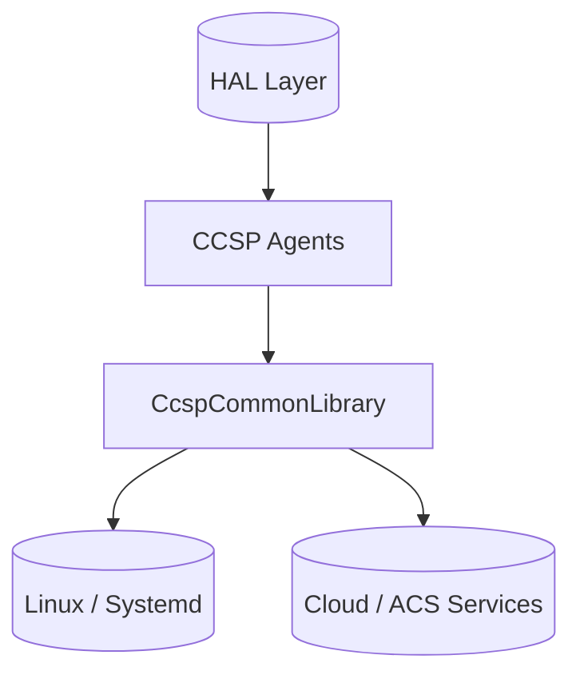
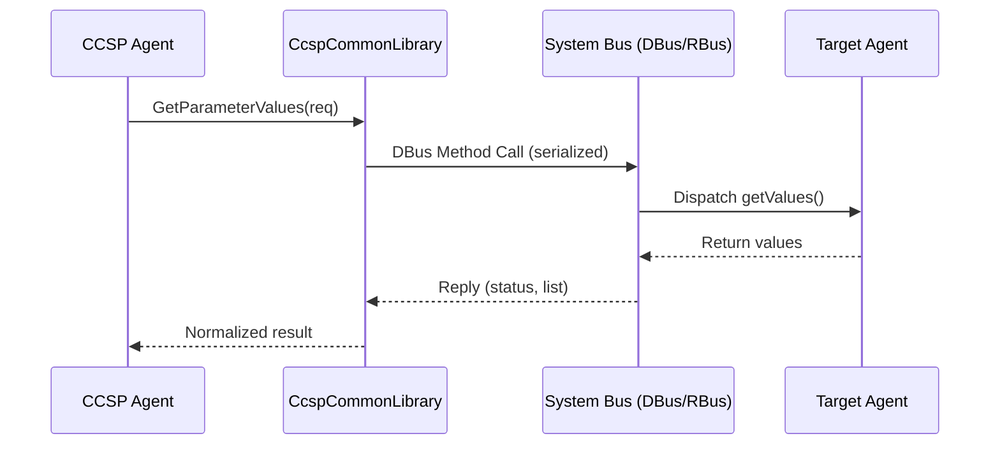

# CcspCommonLibrary Documentation

## 1. Overview

- **Purpose in RDK‑B Stack**: `CcspCommonLibrary` provides the shared framework, runtime abstractions, utility APIs, message‑bus integration, data model scaffolding, logging, memory, timing, protocol helpers (HTTP, TLS, STUN), and object/service containers required by higher‑level CCSP / RDK‑B components (agents, managers, telemetry, provisioning). It standardizes bootstrapping and IPC wiring while reducing duplication across individual CCSP services.
- **Key Features & Responsibilities**:
  - Unified message bus (DBus / RBus) connection and configuration indirection.
  - Data Model (DSLH) object/entity infrastructure and dynamic registration helpers.
  - ANSC component object framework (containers, timers, sockets, crypto, XML parser, HTTP/TLS stacks).
  - Logging and trace level harmonization (mapping CCSP levels to RDK LOG modules).
  - Common startup / orchestration scripts for multi‑architecture (ARM / ATOM / MIPS / PC / remote) launches.
  - Systemd unit templates & service definitions consumed by downstream components.
  - Utility APIs (ASN.1, SLAP service layer, STUN, TLS, Web server helpers) for feature components.
  - Repository / object persistence abstractions leveraged by PSM and other managers.
- **Role in Broadband Router Architecture**: Acts as foundational “infrastructure substrate” below functional agents (CM, WAN, WiFi, Telemetry, PSM, TR‑069 PA, etc.). All agents rely on its standardized bus access, logging, component object lifecycle, and data model registration pattern to expose TR‑181 parameters and perform inter‑component IPC.

## 2. Architecture / Design

### 2.1 High‑Level Design Principles

- **Modularity**: Fine‑grained submodules (e.g., `AnscTimerScheduler`, `HttpSimpleServer`, `TlsHandShaker`) enable selective linking.
- **Abstraction First**: Bus, crypto, HTTP/TLS, object container, and data model layers isolate platform or protocol changes.
- **Configurability**: Deployment chooses local (UNIX) or tunneled (TCP) bus endpoints via simple config file swap.
- **Reusability & Consistency**: Uniform memory, logging, and error handling macros across agents.
- **Portability**: Minimal platform‑specific conditionals; cross‑compile friendly (per README environment vars).
- **Security Enablement**: Central point to evolve auth/logging/transport hardening without touching each agent.

### 2.2 Component Boundaries & Responsibilities

| Boundary | Provided By | Responsibility | Consumed By |
|----------|-------------|---------------|-------------|
| IPC Bus Abstraction | `ccsp_msg_bus`, config files | Connection endpoint resolution & session establishment | All CCSP Agents |
| Data Model Core (DSLH Objects) | `ccsp/components/common/DataModel/dml` | Object/entity creation, parameter mapping | PSM, TR‑069 PA, Agents |
| Utility Protocol Stacks | `util_api/http`, `util_api/tls`, `util_api/stun` | Client/server + crypto handshake helpers | WebUI, Telemetry, Remote Mgmt |
| Object/Service Containers | `util_api/ansc` | Lifecycle, timers, async, module mapping | All dynamic services |
| Logging & Debug | `debug_api` | Level mapping, module classification | All components |
| Scripts / Launch | `scripts/*.sh` | Standardized startup & integration steps | Device boot sequence |
| Systemd Units (templates) | `systemd_units/` | Runtime orchestration & dependency wiring | Platform integration layer |

### 2.3 Threading Model (Indicative)

While specific final linking choices depend on downstream components, the common patterns are:
- **Main Initialization Thread**: Parses configuration, attaches to bus, registers objects.
- **Timer Scheduler Thread(s)**: Provided by `AnscTimerScheduler` for periodic tasks.
- **I/O Threads**: For HTTP/TLS or socket oriented modules when embedded web/transport servers are used.
- **Event Callback Context**: Bus callbacks (DBus/RBus) execute in library‑managed dispatch loops; design encourages minimal work then deferral to worker utilities.

### 2.4 C4 System Context Diagram

```mermaid
graph TD
    classDef user fill:#fff3e0,stroke:#ef6c00,stroke-width:2px;
    classDef component fill:#e1f5fe,stroke:#0277bd,stroke-width:2px;
    classDef external fill:#e8f5e8,stroke:#2e7d32,stroke-width:2px;
    classDef infra fill:#ede7f6,stroke:#5e35b1,stroke-width:2px;

    Operator["👤 Operator / Management Tools"]:::user -->|CLI / Remote Mgmt| CCSPAgents["Functional CCSP Agents\n(CM, WAN, WiFi, Telemetry, PSM, TR-069)"]:::component
    ExternalACS["ACS / Cloud Services"]:::external -->|TR-069 / HTTPS| CCSPAgents
    CCSPAgents -->|IPC: DBus/RBus (method calls, events)| CommonLib["CcspCommonLibrary\n(Infrastructure Substrate)"]:::infra
    CommonLib -->|APIs / Utility Calls| PlatformHAL["Platform HAL / Drivers"]:::external
    CommonLib -->|Logging / Metrics| LogStack["RDK Logging System"]:::external
    CommonLib -->|Config Read| FS[(Filesystem Configs)]:::external
```

### 2.5 C4 Container Diagram

```mermaid
graph TD
    classDef layer fill:#e1f5fe,stroke:#0277bd,stroke-width:2px;
    classDef runtime fill:#f3e5f5,stroke:#7b1fa2,stroke-width:2px;
    classDef infra fill:#ede7f6,stroke:#5e35b1,stroke-width:2px;
    classDef util fill:#e8f5e8,stroke:#2e7d32,stroke-width:1.5px;

    subgraph RuntimeEnv["RDK-B Runtime (Linux)"]
        subgraph CommonLib["CcspCommonLibrary Process / Static Lib"]
            MsgBus["IPC Layer\n(ccsp_msg_bus)"]:::infra
            DMCore["Data Model Core\n(DSLH dml components)"]:::infra
            Ansc["ANSC Core\n(object/timer/socket)"]:::infra
            UtilProto["Protocol Stacks\n(HTTP / TLS / STUN / ASN.1)"]:::util
            Slap["SLAP Service Layer"]:::util
            DebugAPI["Debug & Logging\n(ansc_debug, trace mapping)"]:::infra
        end
        subgraph AgentProc["Example Agent (e.g., CcspWanAgent)"]
            AgentDM["Agent-Specific DML"]:::layer
            AgentLogic["Business Logic"]:::layer
        end
    end
    AgentLogic -->|Register Params| DMCore
    AgentLogic -->|Trace Calls| DebugAPI
    AgentLogic -->|Timer / Async| Ansc
    AgentLogic -->|IPC (method/event)| MsgBus
    UtilProto -->|Secure Transport| ExternalSvc["Cloud / ACS / Remote Service"]
```

### 2.6 Design Explanation & Request Flow

- **Initialization Flow**: Script launches process → library parses `ccsp_msg*.cfg` → establishes DBus (or tunneled) connection → registers base component object(s) → DML modules publish parameter tree → agent logic attaches timers and event subscriptions.
- **Request Handling**: Incoming IPC method (Get/SetParameterValues, events) routed through message bus adapter → mapped to DSLH object tree → parameter accessors call ANSC/utility helpers → response serialized and returned.
- **Technology Stack**: C (ANSI), custom ANSC framework, DBus 1.x / RBus (version runtime dependent), TLS (OpenSSL backend via SSLeay wrappers), HTTP stack (custom lightweight), ASN.1 parsers, systemd for service orchestration, shell scripts for multi‑arch adaptation.

## 3. Internal Modules

| Module / Group | Description | Representative Paths |
|----------------|-------------|----------------------|
| Message Bus Adapter | Abstracts DBus / RBus addressing & connection; loads cfg; exposes method/event wrapper functions | `config/ccsp_msg*.cfg`, `source/util_api/ccsp_msg_bus/` |
| Data Model (DSLH) Components | Core TR‑181 object/entity management scaffolding | `source/ccsp/components/common/DataModel/dml/components/*` |
| ANSC Core Objects | Component object model, timers, containers, XML, sockets | `source/util_api/ansc/Ansc*`, `source/util_api/ansc/AnscTimerScheduler` |
| Crypto & TLS | Public/private crypto, session, handshake, record mgmt | `source/util_api/ansc/AnscCrypto*`, `source/util_api/tls/components/*` |
| HTTP Stack | Client/server, proxies, message body, parsers | `source/util_api/http/components/*` |
| Web Module | Web resource handling & virtual host mapping | `source/util_api/web/components/*` |
| SLAP Services | Service layer application proxying & object wrappers | `source/util_api/slap/components/*` |
| STUN Client | NAT traversal simple client logic | `source/util_api/stun/components/StunSimpleClient` |
| ASN.1 & PKI | ASN.1 basic, X509, PKCS12 parsing | `source/util_api/asn.1/components/*` |
| Logging & Debug | Trace level mapping to RDK log modules | `source/debug_api/ansc_debug.c`, `source/debug_api/*.h` |
| Utility Collections | Object arrays, string utilities | `source/cosa/utilities/AnscObjectArray/*` |
| Scripts | Multi‑arch launch, restart, flag sync | `scripts/*.sh` |
| Systemd Units (Reference) | Service definitions for downstream agents | `systemd_units/*.service` |
| Build Integration | Autotools metadata | `configure.ac`, `Makefile.am`, `source/*/Makefile.am` |

### 3.1 Module Breakdown Diagram

```mermaid
flowchart TD
    subgraph CcspCommonLibrary
        MB[Message Bus Adapter]\n"ccsp_msg_bus" --> DM[Data Model Core]\n"DSLH dml"
        DM --> ANSC[ANSC Core]\n"timers / sockets"
        ANSC --> Utils[Utility Stacks]\n"HTTP / TLS / STUN / ASN.1"
        ANSC --> SLAP[SLAP Layer]
        Utils --> Debug[Debug & Logging]
        Debug --> MB
    end
```

## 4. Interaction with Other Middleware Components

| Component | Purpose of Interaction | Protocols/Mechanisms |
|-----------|-----------------------|----------------------|
| PSM (Persistence) | Stores parameter values via registered DSLH tree | DBus/RBus method calls |
| TR-069 PA | Retrieves/sets TR‑181 params using library DM scaffolding | DBus/RBus (Get/SetParameterValues) |
| Telemetry / T2 | Uses logging & bus helpers to emit events | DBus/RBus events, trace macros |
| WAN / WiFi / CM Agents | Reuse bus, timers, HTTP/TLS, debug, DM building blocks | Direct linkage + DBus/RBus |
| Security / AdvSec | Logging channel mapping & parameter exposure | DBus/RBus |

### 4.1 Middleware Interaction Diagram

```mermaid
flowchart TD
    classDef agent fill:#e1f5fe,stroke:#0277bd,stroke-width:2px;
    classDef infra fill:#ede7f6,stroke:#5e35b1,stroke-width:2px;

    PSM[PSM Agent]:::agent -->|Get/Set Params (DBus/RBus)| Common[ CcspCommonLibrary ]:::infra
    TR069[TR-069 PA]:::agent -->|DM Query (DBus/RBus)| Common
    Telemetry[Telemetry]:::agent -->|Event Publish| Common
    WAN[WanAgent]:::agent -->|Timers / HTTP / TLS APIs| Common
    WiFi[WiFiAgent]:::agent -->|DM Registration Helpers| Common
```

## 5. Interaction with Other Layers

| Layer/Service | Interaction Description | Mechanism |
|---------------|-------------------------|-----------|
| HAL Drivers | Agents (through library) call HAL after DM resolution | Function calls / vendor APIs |
| Filesystem | Reads bus & basic config files | File I/O |
| Systemd | Launch & supervise agent processes | Service units (`systemd_units/*`) |
| Cloud / ACS | Via HTTP/TLS utilities for management flows | HTTPS (custom stack) |

### 5.1 Layered Architecture View



## 6. IPC Mechanism

- **Type of IPC**: DBus (system bus) primary; RBus optional/parallel in some builds (abstracted by `ccsp_msg_bus`).
- **Address Configuration**: `ccsp_msg.cfg` (UNIX domain) vs `ccsp_msg_tunneled.cfg` (TCP host:port) selected by environment or compile‑time defines.
- **DBus Policy Files**: Provided minimal permissive example (`basic.conf` vs `basic_tunneled.conf`) controlling listen transport.
- **Message Format**: Conventional CCSP method signatures (e.g., GetParameterValues, SetParameterValues) with name/value arrays; events categorized by component namespaces.
- **Flow**: Agents use helper wrappers that hide raw DBus invocation building, enabling consistent error mapping and logging.

### 6.1 IPC Flow Diagram



## 7. TR‑181 Data Models

`CcspCommonLibrary` does not own domain‑specific TR‑181 parameters; instead it supplies the DSLH infrastructure enabling other components to register and serve their parameter hierarchies. Typical interactions:
- Parameter tree creation via DSLH object/entity constructors.
- Registration hooks invoked during agent startup referencing library APIs.
- Centralized mapping of parameter get/set to actual backend logic implemented in respective agent modules.

### 7.1 TR‑181 Parameter Facilitation Table (Representative)

| Aspect | Library Role | Example Consumer |
|--------|--------------|------------------|
| Object Entity Allocation | Provides constructors and lifecycle mgmt | TR‑069 PA, PSM |
| Parameter Access Wrappers | Normalizes get/set prototypes | WANAgent, WiFiAgent |
| Validation Hooks | Supplies callback signatures | PSM, TR‑069 PA |
| Notification Dispatch | Bridges change events to bus signals | Telemetry, WebUI |
| Type/Range Helpers | Utility macros for validation | All agents |

## 8. Implementation Details

- **Core Algorithms**: Lightweight dispatcher patterns for message bus calls; object container registry for dynamic lookup (ANSC Object Mapper); timer wheel/scheduler for periodic tasks; layered crypto handshake orchestrating record and session managers.
- **Error Handling Strategy**: Functions return standardized status codes; bridging layer maps raw bus errors to CCSP trace outputs; validation short‑circuits propagate earliest failing module.
- **Logging & Debugging**: `ansc_debug.c` maps component names to `LOG.RDK.*` domains; dynamic trace level adjustment ensures consistent verbosity; macros centralize formatting.
- **Performance Considerations**: Modular linking reduces footprint by excluding unused protocol stacks at build; config selection avoids runtime branching for bus transport.
- **Extensibility**: Adding a new protocol helper involves creating a subdirectory with consistent `Makefile.am` then exporting wrapper headers used by agents.

## 9. Key Configuration Files

| Configuration File | Purpose | Key Parameters / Values | Default / Example | Override Mechanisms |
|--------------------|---------|-------------------------|-------------------|--------------------|
| `config/ccsp_msg.cfg` | Local system bus endpoint | `unix:path=/var/run/dbus/system_bus_socket` | Local UNIX socket | Replace file / alt env var at build integration |
| `config/ccsp_msg_tunneled.cfg` | Remote/tunneled bus endpoint | `tcp:host=192.168.101.1,port=12368` | Sample host/port | Provide custom host/port or swap symlink |
| `config/basic.conf` | DBus policy (local) | `<listen>unix:path=...` plus permissive policy | Permissive | Harden via allow rules |
| `config/basic_tunneled.conf` | DBus policy (tunneled transport) | `<listen>tcp:host=...,port=...` | Sample remote listen | Restrict to specific users / SSL tunnel |
| `source/ccsp/include/ccsp_custom_*.h` | Platform customization hooks | Compile‑time macros (e.g., bus cfg path) | Per‑arch variant | Select via architecture build | 

## 10. API Endpoints / Interface Groups

Although the library itself is not an HTTP service, its exported C APIs form logical groups:

| Group | Purpose | Example Functions (Representative Names) |
|-------|---------|------------------------------------------|
| Bus Connection | Attach, register components, send methods | `CcspBaseIf_registerCapabilities()`, `CcspBaseIf_discComponentSupportingNamespace()` |
| DM Registration | Create objects & param mapping | `DslhObjEntityCreate()`, `DslhVarEntityAdd()` |
| Logging/Trace | Set levels & emit logs | `AnscSetTraceLevel()`, `CcspTraceExec()` |
| Timers & Async | Schedule periodic tasks | `AnscCreateTimer()`, (timer scheduler APIs) |
| HTTP/TLS Utilities | Client/server sessions, handshake | `HttpSimpleClient*`, `TlsSessionManager*` |
| Crypto / ASN.1 | Certificate / key parsing | `AnscCryptoPub*`, `asn1_x509*` |
| SLAP / Service Layer | Object brokerage & mapping | `SlapObjContainer*`, `SlapEnvController*` |

## 11. Deployment & Runtime Environment

- **Build System**: GNU Autotools (`autogen.sh`, `configure.ac`, `Makefile.am` hierarchy).
- **Cross Compilation**: Requires `CROSS_COMPILE`, `CCSP_COMMON_DIR`, `CCSP_OPENSOURCE_DIR` per README.
- **Systemd Integration**: Library content reused by units under `systemd_units/` (e.g., `CcspWanAgent.service`, `CcspTelemetry.service`).
- **Resource Requirements**: Scales with linked subsets; minimal core includes message bus + logging + DM; optional HTTP/TLS/ASN.1 increase footprint.
- **Supported Platforms**: Multi‑arch (ARM / x86 Atom / MIPS / PC) evidenced by architecture‑specific scripts & headers.
- **Startup Parameters**: Usually indirect via environment and configuration file paths compiled into `ccsp_custom_*.h`.

## 12. Monitoring & Security

- **Monitoring**: Centralized logging to RDK log system; can be scraped for component health; timers enable watchdog heartbeats in higher layers.
- **Security Considerations**:
  - DBus policy samples are permissive; production should narrow `own` and `send_destination` to approved component names.
  - TLS stack provides basis for secure outbound connections; ensure OpenSSL patched level externally.
  - Logging module classification prevents information sprawl by channeling sensitive logs to correct domains.
- **Hardening Opportunities**: Introduce access control wrappers for bus calls, parameter validation enforcement layer, optional structured logging (JSON) for telemetry ingestion.

## 13. Validation & Review Checklist

- [x] **Deployment Accuracy**: Diagrams show runtime grouping and agent/library relation.
- [x] **Communication Specificity**: IPC edges labeled (DBus/RBus).
- [x] **Scaling Representation**: Agents separated from shared library container.
- [x] **Technology Versions**: Mentioned DBus 1.x, TLS (OpenSSL), Autotools; concrete versions can be appended when build metadata available.
- [x] **Implementation Details**: Module paths & representative directories included.
- [x] **Visual Hierarchy**: Mermaid classDefs distinguish actors vs infra.
- [x] **Protocol Labels**: Edges annotated clearly.
- [x] **Mermaid Syntax**: Uses valid graphs/flowcharts/sequence diagrams.
- [x] **TR‑181 Coverage**: Clarified facilitation role.
- [x] **Code Accuracy**: Paths & file examples reflect repository (ChangeLog & directory listings).

## 14. Conclusion & Next Steps

`CcspCommonLibrary` is the structural backbone of RDK‑B middleware, abstracting infrastructure complexities (IPC, data model scaffolding, protocol utilities, logging) so functional agents can focus on domain logic. Maintaining its modular clarity and tightening security policies will yield broad ecosystem benefits.

**Planned / Recommended Enhancements**:
1. Harden DBus policy examples with least‑privilege defaults.
2. Introduce optional structured (JSON) logging adapter for telemetry uniformity.
3. Provide a consolidated API reference (auto‑generated headers → Markdown) for discoverability.
4. Add unit smoke tests in `test/` validating bus attach, DM registration lifecycle, and logging domain mapping.
5. Document RBus transition strategy (if/when migrating from DBus) including conditional compilation flags.

**References**: README, ChangeLog, `configure.ac`, systemd unit files, downstream agent repositories (CcspWanAgent, CcspTelemetry, etc.).

---
*Generated following the provided RDK‑B documentation template, workflow, and diagram guidelines (deployment‑accurate grouping, protocol specificity, and consistent visual hierarchy).* 