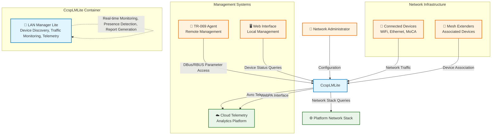
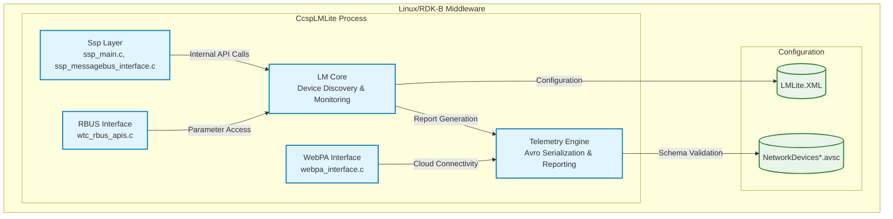
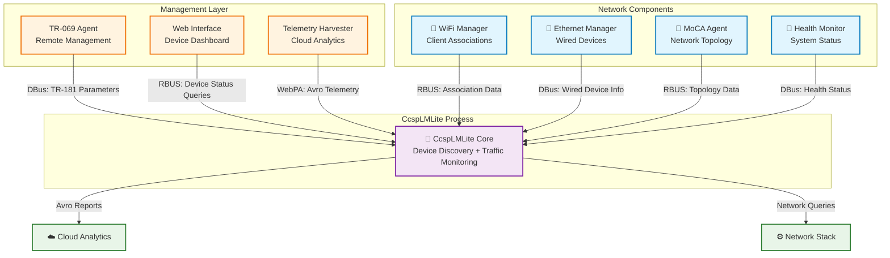
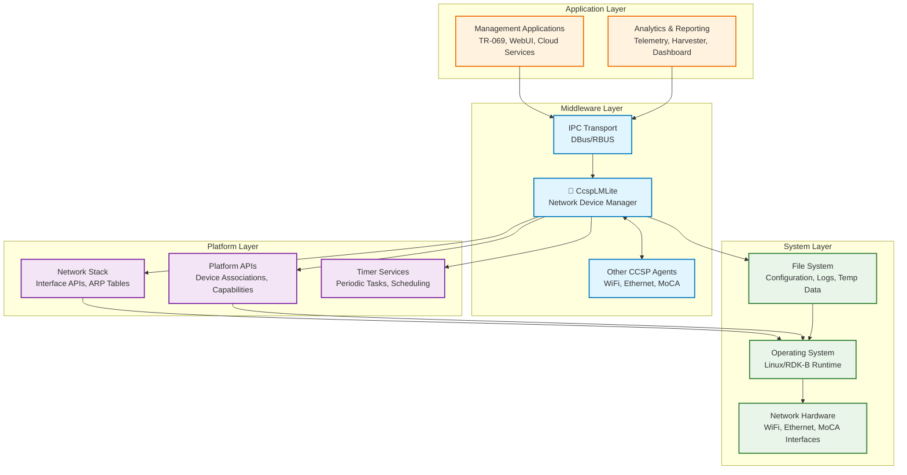
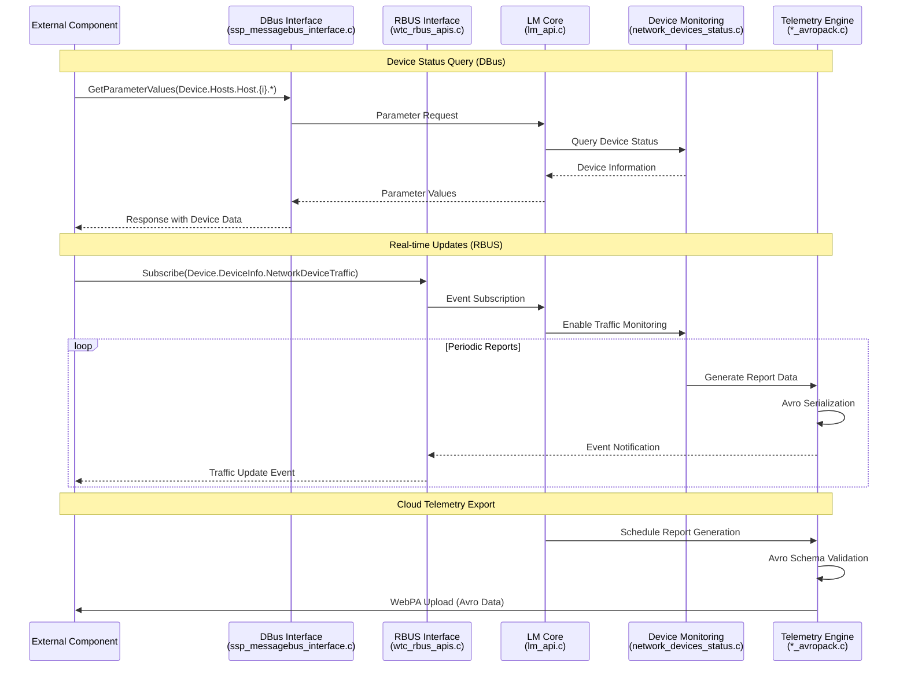

# CcspLMLite Documentation

## 1. Overview

- **Purpose in RDK‑B Stack**: CcspLMLite (LAN Manager Lite) serves as the network device discovery, monitoring, and telemetry collection service within the RDK‑B middleware stack. It provides comprehensive visibility into connected network devices, traffic patterns, presence detection, and reporting capabilities for both local management and cloud telemetry systems. The component acts as the central hub for collecting, processing, and reporting network device information across the broadband gateway platform.

- **Key Features & Responsibilities**: CcspLMLite delivers device discovery and enumeration for connected hosts, network traffic monitoring and reporting, device presence detection with configurable intervals, TR‑181 parameter management for network device data models, Avro‑based telemetry data serialization and transmission, WebPA integration for cloud connectivity, RBUS and DBus IPC support for middleware communication, extender device association tracking, and comprehensive reporting infrastructure for network analytics. The component mediates between low‑level network stack information and higher‑level management and telemetry systems.

- **Role in Broadband Router Architecture**: Architecturally, CcspLMLite operates as a middleware service layer between the network stack and management applications. It consumes network interface statistics, ARP tables, and device association data from the platform while providing structured device information to TR‑069 agents, telemetry services, and cloud management systems. The component bridges local network visibility with remote monitoring capabilities, enabling both real‑time device management and historical analytics.

## 2. Architecture / Design

### 2.1 High‑Level Design Principles

The architecture manifests principles of modular separation through distinct LM (LAN Manager) and Ssp (Service Shell Provider) subsystems, telemetry‑first design with comprehensive Avro schema support for structured data serialization, event‑driven reporting with configurable intervals and thresholds, abstracted platform interfaces through wrapper APIs, standardized TR‑181 parameter modeling for device and traffic data, dual IPC transport support (DBus/RBUS) for flexible integration, plugin‑based extensibility for custom reporting modules, and comprehensive test coverage ensuring reliability across network monitoring scenarios. The design emphasizes real‑time data collection balanced with efficient resource utilization.

### 2.2 Component Boundaries & Responsibilities

**LM (LAN Manager) Subsystem**: Responsible for core network device discovery and monitoring logic, TR‑181 data model implementation for hosts and network devices, traffic monitoring and statistics collection, device presence detection algorithms, Avro‑based telemetry data packaging, WebPA interface implementation for cloud connectivity, RBUS API handlers for external communication, and report generation with configurable scheduling.

**Ssp Service Shell**: Acts as the service entry point handling process initialization, DBus message bus integration, internal action dispatching, and service lifecycle management. It provides the standardized CCSP service framework while delegating functional operations to the LM subsystem.

**Telemetry Infrastructure**: Manages Avro schema‑based data serialization for network device status and traffic reports, provides structured data export for cloud telemetry systems, and supports multiple reporting formats and destinations.

### 2.3 Threading Model (if applicable)

The component employs an event‑driven single‑threaded model with periodic timer‑based reporting cycles. Network device scanning, presence detection, and traffic monitoring operate through scheduled callbacks and event handlers rather than dedicated threads. The RBUS and DBus integration layers handle asynchronous message processing while maintaining thread safety through the underlying transport mechanisms.

### 2.4 C4 System Context Diagram

### 2.5 C4 Container Diagram

### 2.6 Design Explanation & Request Flow

**Initialization Sequence:** Service startup begins in `ssp_main.c`, which initializes the DBus message bus interface through `ssp_messagebus_interface.c`, loads configuration from `LMLite.XML`, and initializes the LM subsystem with device discovery and monitoring capabilities. The plugin system loads through `plugin_main.c`, establishing TR‑181 parameter handlers and report generation infrastructure.

**Device Discovery Flow:** Network device enumeration operates through periodic scans that query platform network interfaces, ARP tables, and association databases. Discovered devices are processed through `cosa_hosts_dml.c` for TR‑181 modeling and `network_devices_status.c` for telemetry reporting.

**Traffic Monitoring Flow:** Network traffic collection utilizes `cosa_wantraffic_api.c` and related utilities to gather interface statistics, process bandwidth metrics, and generate traffic reports through the Avro‑based telemetry infrastructure.

**Technology Stack:** C programming language, DBus and RBUS for IPC, Avro for data serialization, XML for configuration, TR‑181 data modeling, WebPA for cloud connectivity, GNU build system (autotools), Google Test framework for unit testing.

## 3. Internal Modules

| Module/Class | Description | Key Files |
|-------------|------------|-----------|
| **LM Main** | Core LAN Manager initialization and coordination | `lm_main.c`, `lm_main.h` |
| **LM API** | Public API interface for device and traffic management | `lm_api.c`, `lm_api.h` |
| **LM Wrapper** | Platform abstraction and utility functions | `lm_wrapper.c`, `lm_wrapper.h`, `lm_wrapper_priv.c` |
| **LM Utilities** | Common utility functions and helper routines | `lm_util.c`, `lm_util.h` |
| **Device Hosts DML** | TR‑181 Hosts data model implementation | `cosa_hosts_dml.c`, `cosa_hosts_dml.h` |
| **Extended Hosts DML** | Extended device information and capabilities | `cosa_xhosts_dml.c`, `cosa_xhosts_dml.h` |
| **Network Device Status DML** | Device status monitoring data model | `cosa_ndstatus_dml.c`, `cosa_ndstatus_dml.h` |
| **Network Device Traffic DML** | Traffic monitoring data model | `cosa_ndtraffic_dml.c`, `cosa_ndtraffic_dml.h` |
| **Management Server DML** | TR‑181 ManagementServer implementation | `cosa_managementserver_dml.c`, `cosa_managementserver_apis.c` |
| **Network Device Status** | Device status monitoring and reporting engine | `network_devices_status.c`, `network_devices_status.h` |
| **Network Device Traffic** | Traffic monitoring and bandwidth analysis engine | `network_devices_traffic.c`, `network_devices_traffic.h` |
| **WAN Traffic API** | WAN interface traffic collection and utilities | `cosa_wantraffic_api.c`, `cosa_wantraffic_utils.c` |
| **Device Presence Detection** | Configurable device presence monitoring algorithms | `device_presence_detection.c`, `device_presence_detection.h` |
| **Status Avro Serialization** | Device status telemetry Avro serialization | `network_devices_status_avropack.c`, `network_devices_status_avropack.h` |
| **Traffic Avro Serialization** | Traffic telemetry Avro serialization | `network_devices_traffic_avropack.c`, `network_devices_traffic_avropack.h` |
| **Extender Avro Serialization** | Extender device telemetry Avro serialization | `extender_associated_devices_avropack.c`, `extender_associated_devices.c` |
| **WebPA Interface** | Cloud connectivity and remote management interface | `webpa_interface.c`, `webpa_interface.h` |
| **WebPA Presence Detection** | WebPA‑integrated presence detection variants | `webpa_pd_with_seshat.c`, `webpa_pd_without_seshat.c`, `webpa_pd.h` |
| **RBUS APIs** | RBUS transport implementation and management | `wtc_rbus_apis.c`, `wtc_rbus_apis.h` |
| **RBUS Handler APIs** | RBUS event and parameter handler implementation | `wtc_rbus_handler_apis.c`, `wtc_rbus_handler_apis.h` |
| **Network Devices Interface** | Generic network device interface abstraction | `network_devices_interface.c`, `network_devices_interface.h` |
| **Reports Infrastructure** | Common reporting framework and utilities | `cosa_reports_internal.c`, `cosa_reports_internal.h`, `report_common.h` |
| **Ssp Main** | Service shell process entry and initialization | `ssp_main.c` |
| **Ssp Message Bus** | DBus integration and message handling | `ssp_messagebus_interface.c`, `ssp_messagebus_interface.h` |
| **Ssp Action** | Internal action dispatching and coordination | `ssp_action.c` |
| **Plugin Main** | Plugin system initialization and TR‑181 registration | `plugin_main.c`, `plugin_main.h` |

### 3.1 Module Breakdown Diagram

The module breakdown diagram illustrates the layered architecture and functional groupings within CcspLMLite. The Ssp layer provides process infrastructure and DBus integration, the LM Core manages fundamental device discovery and platform abstraction, TR‑181 Data Models implement standardized parameter interfaces, Device Monitoring engines provide real‑time network visibility, Telemetry infrastructure handles structured data export, External Interfaces enable cloud and RBUS connectivity, and the Plugin System provides extensible TR‑181 registration. Configuration files and Avro schemas serve as external inputs that define operational behavior and telemetry structure.

```mermaid
flowchart TD
    subgraph Ssp["Ssp Service Shell"]
        SspMain[ssp_main.c<br/>Process Entry]
        SspDBus[ssp_messagebus_interface.c<br/>DBus Integration]
        SspAction[ssp_action.c<br/>Action Dispatcher]
    end
    
    subgraph LMCore["LM Core Services"]
        LMMain[lm_main.c<br/>Core Initialization]
        LMAPI[lm_api.c<br/>Public Interface]
        LMWrapper[lm_wrapper.c<br/>Platform Abstraction]
        LMUtil[lm_util.c<br/>Utilities]
    end
    
    subgraph DataModels["TR‑181 Data Models"]
        HostsDML[cosa_hosts_dml.c<br/>Hosts Model]
        XHostsDML[cosa_xhosts_dml.c<br/>Extended Hosts]
        NDStatusDML[cosa_ndstatus_dml.c<br/>Device Status]
        NDTrafficDML[cosa_ndtraffic_dml.c<br/>Traffic Model]
        MgmtDML[cosa_managementserver_dml.c<br/>Management Server]
    end
    
    subgraph Monitoring["Device Monitoring"]
        DeviceStatus[network_devices_status.c<br/>Status Monitoring]
        DeviceTraffic[network_devices_traffic.c<br/>Traffic Analysis]
        PresenceDetect[device_presence_detection.c<br/>Presence Detection]
        WANTraffic[cosa_wantraffic_api.c<br/>WAN Statistics]
    end
    
    subgraph Telemetry["Telemetry & Reporting"]
        StatusAvro[network_devices_status_avropack.c<br/>Status Serialization]
        TrafficAvro[network_devices_traffic_avropack.c<br/>Traffic Serialization]
        ExtenderAvro[extender_associated_devices_avropack.c<br/>Extender Data]
        ReportsCommon[cosa_reports_internal.c<br/>Report Framework]
    end
    
    subgraph Interfaces["External Interfaces"]
        WebPAIf[webpa_interface.c<br/>Cloud Interface]
        WebPAPD[webpa_pd_with_seshat.c<br/>WebPA Presence Detection]
        RBUSApi[wtc_rbus_apis.c<br/>RBUS Transport]
        RBUSHandler[wtc_rbus_handler_apis.c<br/>RBUS Handlers]
        NetworkIf[network_devices_interface.c<br/>Network Interface]
    end
    
    subgraph Plugin["Plugin System"]
        PluginMain[plugin_main.c<br/>Plugin Loader]
    end
    
    ConfigXML[config/LMLite.XML<br/>Configuration]
    AvroSchemas[config/*.avsc<br/>Avro Schemas]
    
    Ssp -->|Initialize| LMCore
    LMCore -->|Register| DataModels
    DataModels -->|Query| Monitoring
    Monitoring -->|Generate| Telemetry
    Telemetry -->|Export| Interfaces
    Plugin -->|Load| DataModels
    LMCore -->|Configure| ConfigXML
    Telemetry -->|Validate| AvroSchemas
    
    classDef ssp fill:#fff3e0,stroke:#ef6c00,stroke-width:2px;
    classDef core fill:#e1f5fe,stroke:#0277bd,stroke-width:2px;
    classDef datamodel fill:#f3e5f5,stroke:#7b1fa2,stroke-width:2px;
    classDef monitoring fill:#e8f5e8,stroke:#2e7d32,stroke-width:2px;
    classDef telemetry fill:#fce4ec,stroke:#c2185b,stroke-width:2px;
    classDef interface fill:#fff8e1,stroke:#f57c00,stroke-width:2px;
    classDef plugin fill:#f1f8e9,stroke:#689f38,stroke-width:2px;
    
    class SspMain,SspDBus,SspAction ssp;
    class LMMain,LMAPI,LMWrapper,LMUtil core;
    class HostsDML,XHostsDML,NDStatusDML,NDTrafficDML,MgmtDML datamodel;
    class DeviceStatus,DeviceTraffic,PresenceDetect,WANTraffic monitoring;
    class StatusAvro,TrafficAvro,ExtenderAvro,ReportsCommon telemetry;
    class WebPAIf,WebPAPD,RBUSApi,RBUSHandler,NetworkIf interface;
    class PluginMain plugin;
```

## 4. Interaction with Other Middleware Components

CcspLMLite operates as a central network intelligence hub within the RDK‑B middleware ecosystem, providing comprehensive device discovery, monitoring, and telemetry services to a diverse array of functional components. The component's architecture emphasizes passive data collection and active reporting, interfacing with network management agents to gather association and capability information while simultaneously providing structured device and traffic data to telemetry, management, and user interface systems. Rather than maintaining direct peer‑to‑peer connections, all interactions are mediated through standardized DBus and RBUS IPC mechanisms that ensure consistent access patterns, reliable data delivery, and comprehensive error handling across component boundaries. The telemetry infrastructure with Avro‑based serialization enables structured data export to cloud analytics platforms, while the TR‑181 parameter implementation provides standardized access for both local management applications and remote TR‑069 operations. This architectural approach promotes loose coupling between components while enabling comprehensive network visibility and coordinated management workflows.

| Component | Purpose of Interaction | Protocols/Mechanisms |
|-----------|-----------------------|----------------------|
| **TR‑069 Agent (CcspTr069Pa)** | Provides TR‑181 parameter access for remote device management and bulk operations | DBus parameter get/set operations, CCSP parameter interface |
| **WiFi Manager (CcspWifiAgent)** | Retrieves WiFi client association information, signal strength, and connection statistics | RBUS property access, DBus method calls, event subscriptions |
| **Ethernet Manager** | Collects wired device information, link status, and port statistics | DBus parameter queries, interface status notifications |
| **MoCA Agent (CcspMoCAAgent)** | Gathers MoCA network device data, topology information, and performance metrics | RBUS/DBus parameter access, association table queries |
| **Telemetry Agent (Harvester)** | Receives Avro‑serialized device and traffic reports for cloud analytics | WebPA interface, structured data export, periodic uploads |
| **Web UI (CcspWebUI)** | Provides real‑time device status and network information for user dashboard | RBUS parameter access, real‑time queries, event notifications |
| **System Health Monitor** | Reports component health, operational status, and performance metrics | DBus health check interfaces, status reporting |
| **PAM (CcspPandM)** | Coordinates with network configuration management and device provisioning | DBus parameter coordination, configuration validation |
| **CM Agent (CcspCMAgent)** | Integrates with cable modem status and WAN connectivity information | DBus interface queries, connection status updates |
| **DHCP Agent** | Correlates DHCP lease information with discovered network devices | Parameter queries, lease table integration |

### 4.1 Middleware Interaction Diagram

## 5. Interaction with Other Layers

CcspLMLite interfaces upward with CCSP middleware components through standardized DBus and RBUS IPC mechanisms, ensuring consistent access to network device information and telemetry data. The component abstracts platform‑specific network stack interactions through wrapper APIs and utility functions, enabling portability across different RDK‑B hardware platforms. Downward interactions include direct network interface queries for device discovery, ARP table access for MAC address resolution, platform‑specific association databases for WiFi and MoCA devices, and filesystem access for configuration and temporary data storage. The layered design promotes modularity while maintaining efficient access to low‑level network information required for comprehensive device monitoring and reporting.

| Layer/Service | Interaction Description | Mechanism |
|---------------|-------------------------|----------|
| **Network Stack** | Device enumeration via ARP tables, interface statistics collection, routing table queries | System calls, /proc filesystem, netlink sockets, ioctl operations |
| **Platform APIs** | Hardware‑specific device association queries, WiFi client tables, MoCA topology | Wrapper functions via `lm_wrapper.c`, platform‑specific HAL calls |
| **System Services** | Timer management for periodic scanning, presence detection scheduling | Timer callbacks, event loops, cron‑like scheduling |
| **File System** | Configuration file loading, temporary data storage, log file management | Standard file I/O operations, XML parsing, directory monitoring |
| **Memory Management** | Device registry caching, telemetry data buffering, configuration storage | Dynamic allocation, structured data caching, memory pool management |
| **Process Management** | Service lifecycle, component health monitoring, restart coordination | Systemd integration, process signaling, dependency management |

### 5.1 Layered Architecture View

The layered architecture diagram illustrates CcspLMLite's strategic position within the RDK‑B technology stack, showing how it serves as a horizontal service that spans multiple abstraction layers while maintaining clear boundaries and responsibilities. The component provides upward abstraction for network device information while efficiently accessing downward platform capabilities through well‑defined interfaces.

## 6. IPC Mechanism

CcspLMLite utilizes dual IPC transport mechanisms to support both legacy DBus integration and modern RBUS communication patterns within the RDK‑B ecosystem. The DBus interface provides backward compatibility with existing CCSP components and TR‑069 agents, while the RBUS implementation enables high‑performance parameter access and event‑driven communication with newer middleware components. All external communication follows well‑defined message formats with structured parameter names, typed values, and comprehensive error reporting to ensure reliable integration across the platform.

- **Type of IPC**: Dual transport architecture with DBus (via `ssp_messagebus_interface.c`) for CCSP compatibility and TR‑069 integration, RBUS (via `wtc_rbus_apis.c`) for enhanced performance and modern middleware communication, plus WebPA interfaces for cloud telemetry export and remote management connectivity.

- **Message Format**: DBus messages follow CCSP TR‑181 parameter conventions with hierarchical naming (e.g., `Device.Hosts.Host.{i}.PhysAddress`, `Device.DeviceInfo.NetworkDeviceTraffic.Enable`), strongly typed values (string, boolean, integer, unsigned integer, datetime), and standardized CCSP method signatures for GetParameterValues, SetParameterValues, and GetParameterNames operations. RBUS messages utilize property‑based access with subscription support for real‑time device status and traffic threshold events. Avro serialization provides structured telemetry data export with schema validation for NetworkDevicesStatus and NetworkDevicesTraffic reports.

- **Flow**: Synchronous request/response patterns for parameter access operations with immediate response for cached device information, asynchronous event publication for device discovery, association changes, and traffic threshold notifications, periodic telemetry report generation with configurable intervals for different data types, and WebPA‑based cloud communication for structured Avro data transmission with retry mechanisms and delivery confirmation.

### 6.1 IPC Flow Diagram

The following sequence diagram illustrates the complete interaction flow for device discovery, parameter access, real‑time monitoring, and telemetry export operations. The diagram shows how different IPC mechanisms are utilized for various operational patterns, from immediate parameter queries to long‑term telemetry data collection and cloud reporting.

## 7. TR‑181 Data Models

CcspLMLite implements comprehensive TR‑181 data models focused on network device management, traffic monitoring, and presence detection capabilities. The component provides both standard TR‑181 objects for device information and extended custom parameters for enhanced network visibility and telemetry collection. All parameters support both read access for monitoring applications and write access for configuration management, with appropriate validation and persistence mechanisms.

- **Implemented Parameters**: CcspLMLite implements TR‑181 Device.Hosts for network device enumeration, Device.DeviceInfo.NetworkDeviceStatus for device monitoring configuration, Device.DeviceInfo.NetworkDeviceTraffic for traffic analysis settings, Device.ManagementServer for TR‑069 integration, and comprehensive RDK‑Central custom extensions for enhanced network visibility and telemetry collection capabilities.

- **Parameter Registration**: Parameters are registered through the plugin system (`plugin_main.c`) during component initialization, with TR‑181 object handlers distributed across specialized DML modules (`cosa_hosts_dml.c`, `cosa_ndstatus_dml.c`, `cosa_ndtraffic_dml.c`). External components access parameters via both DBus CCSP parameter interfaces for legacy compatibility and RBUS property mechanisms for modern high‑performance access patterns.

- **Custom Extensions**: RDK‑Central extensions include advanced device presence detection with configurable algorithms and intervals, traffic monitoring with bandwidth thresholds and alerting capabilities, Avro‑based telemetry export configuration, extender device association tracking, and enhanced device capability reporting beyond standard TR‑181 specifications.

### 7.1 TR‑181 Parameter Table

| Parameter                                         | Description                                 | Access (R/W) | Default   | Notes                                 |
|---------------------------------------------------|---------------------------------------------|--------------|-----------|---------------------------------------|
| `Device.Hosts.HostNumberOfEntries`                | Number of connected host devices            | R            | `0`       | Dynamic count                         |
| `Device.Hosts.Host.{i}.PhysAddress`               | MAC address of connected device             | R            | `""`      | Discovered via ARP                    |
| `Device.Hosts.Host.{i}.IPAddress`                 | IP address of connected device              | R            | `""`      | Current network assignment            |
| `Device.Hosts.Host.{i}.AssociatedDevice`          | WiFi association path reference             | R            | `""`      | WiFi devices only                     |
| `Device.Hosts.Host.{i}.Layer3Interface`           | Layer 3 interface reference                 | R            | `""`      | Network interface path                |
| `Device.Hosts.Host.{i}.Active`                    | Device active status                        | R            | `false`   | Presence detection result             |
| `Device.DeviceInfo.NetworkDeviceStatus.Enable`    | Network device status reporting             | R/W          | `false`   | Enable/disable monitoring             |
| `Device.DeviceInfo.NetworkDeviceStatus.ReportingInterval` | Status reporting interval (seconds) | R/W          | `300`     | Configurable period                   |
| `Device.DeviceInfo.NetworkDeviceTraffic.Enable`   | Traffic monitoring enable                   | R/W          | `false`   | Enable/disable traffic reports        |
| `Device.DeviceInfo.NetworkDeviceTraffic.ReportingInterval` | Traffic reporting interval (seconds) | R/W          | `3600`    | Configurable period                   |
| `Device.ManagementServer.URL`                     | Management server endpoint                  | R/W          | `""`      | TR‑069 ACS URL                        |
| `Device.X_RDKCENTRAL‑COM_Hosts.PresenceDetection.Enable` | Device presence detection           | R/W          | `true`    | Custom extension                      |
| `Device.X_RDKCENTRAL‑COM_Hosts.PresenceDetection.Interval` | Presence check interval (seconds)  | R/W          | `60`      | Custom parameter                      |

## 8. Implementation Details

The implementation architecture emphasizes modular design with clear separation between data collection, processing, and reporting functions. Core algorithms include periodic network scanning using ARP table enumeration and platform‑specific device association queries, presence detection through configurable ping‑based and traffic‑based algorithms, traffic analysis using interface statistics with bandwidth calculation and threshold monitoring, and Avro‑based data serialization ensuring structured telemetry export with schema validation. The design balances real‑time responsiveness with resource efficiency through intelligent caching, lazy evaluation, and configurable reporting intervals.

- **Key Algorithms or Logic**: Periodic network device discovery through ARP table scanning and platform association queries, presence detection using configurable ping and traffic analysis algorithms, traffic monitoring with bandwidth calculation and threshold‑based alerting, Avro schema‑based telemetry serialization for structured cloud reporting, and device capability detection through platform‑specific wrapper APIs.

- **Error Handling Strategy**: Hierarchical error propagation with component‑specific error codes, graceful degradation when platform APIs are unavailable, comprehensive logging with configurable verbosity levels, automatic retry mechanisms for transient network failures, and validation error reporting for configuration and parameter access operations.

- **Logging & Debugging**: Structured logging integrated throughout all modules with component‑specific prefixes and configurable log levels. Device discovery, traffic monitoring, and telemetry generation provide detailed trace information for troubleshooting. Unit tests validate both success and failure paths across all major functional areas with mock frameworks enabling isolated component testing.

## 9. Key Configuration Files

| Configuration File                | Purpose                                   | Key Parameters                                  | Default Values           | Override Mechanisms                      |
|-----------------------------------|-------------------------------------------|-------------------------------------------------|-------------------------|------------------------------------------|
| `config/LMLite.XML`               | Main component configuration              | Reporting intervals, feature enables, device limits | Various defaults        | Environment variables, runtime parameter changes |
| `config/NetworkDevicesStatus.avsc`| Avro schema for device status telemetry   | Schema structure, field definitions              | N/A                    | Schema versioning and compatibility      |
| `config/NetworkDevicesTraffic.avsc`| Avro schema for traffic telemetry         | Schema structure, traffic metrics                | N/A                    | Schema versioning and compatibility      |

### 9.1 Configuration File Details

- **LMLite.XML**: Controls device discovery, reporting intervals, presence detection, traffic monitoring, and telemetry export settings.
- **NetworkDevicesStatus.avsc**: Defines the Avro schema for device status telemetry, ensuring structured and validated data for analytics.
- **NetworkDevicesTraffic.avsc**: Defines the Avro schema for traffic telemetry, specifying the structure for bandwidth and traffic metrics.

Configuration parameters can be overridden at runtime via TR‑181 parameter updates, RBUS property sets, or environment variables, supporting flexible deployment and operational tuning.