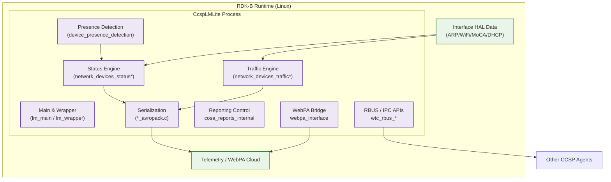
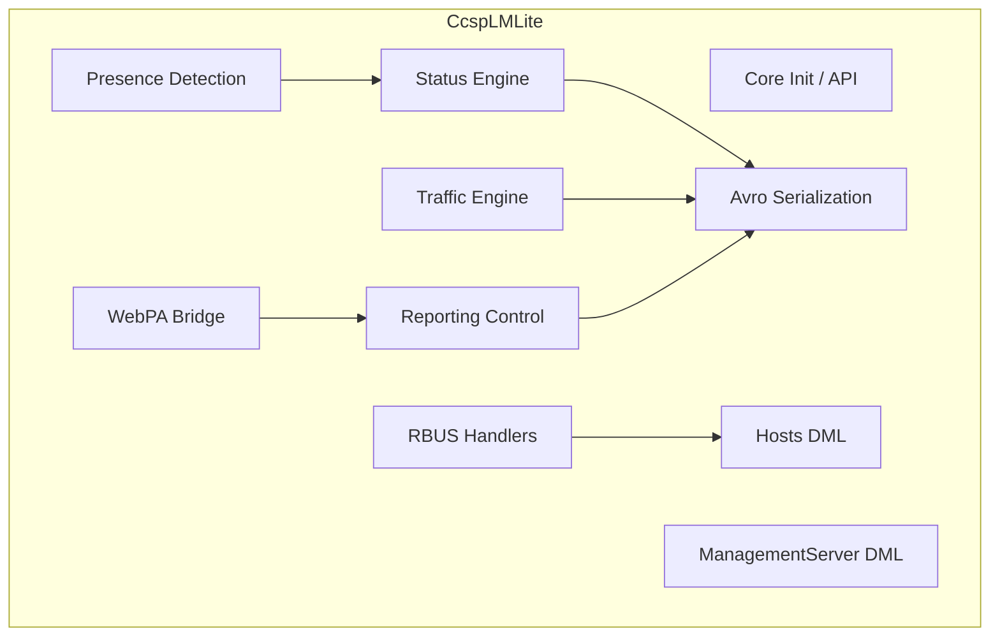
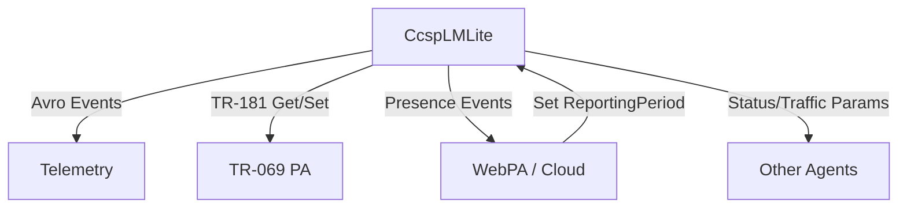
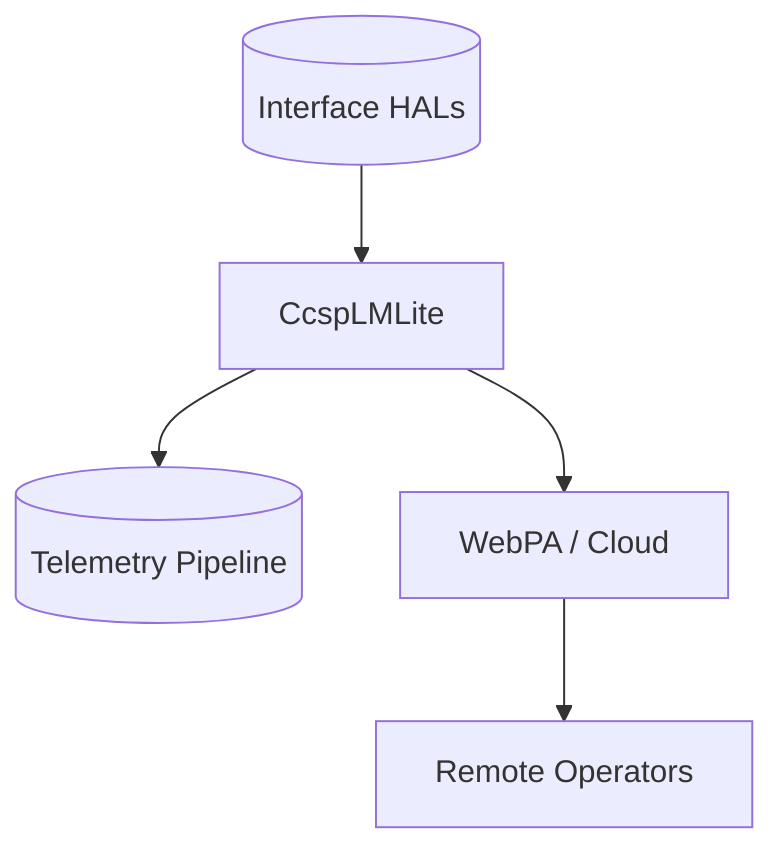
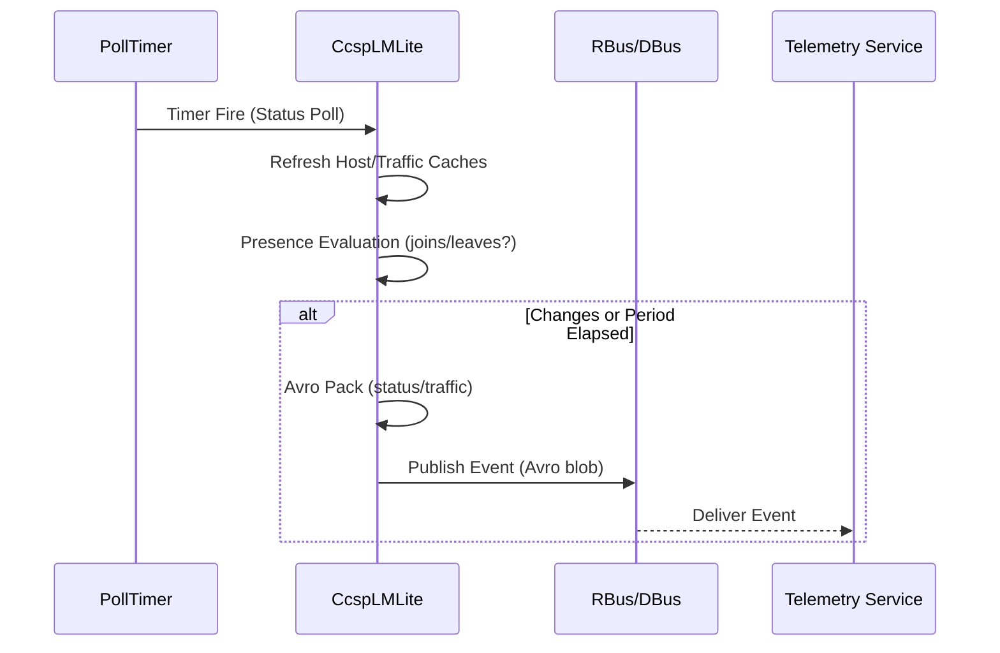

# CcspLMLite Documentation

## 1. Overview

- **Purpose in RDK‑B Stack**: `CcspLMLite` (Lightweight Local Manager) discovers, tracks, and reports connected LAN devices (Ethernet / MoCA / WiFi) and produces presence, status, and traffic telemetry while exposing TR‑181 parameter trees (Hosts, XHosts, NetworkDevicesStatus, NetworkDevicesTraffic, Presence detection controls) for management and analytics.
- **Key Features & Responsibilities**:
  - Dynamic enumeration of connected devices with multi‑interface correlation.
  - Presence detection (joins/leaves, dwell timing, IPv4/IPv6 probing, configurable retry intervals).
  - Traffic & status telemetry serialization using Avro schemas (`NetworkDevicesStatus.avsc`, `NetworkDevicesTraffic.avsc`).
  - TR‑181 parameter exposure for device host tables and reporting control (enable, periods, schemas, override TTL, etc.).
  - WebPA / RDK event publication for presence & network device updates.
  - RBus / DBus IPC integration through CCSP message bus wrappers.
  - Modular DML source separation for Hosts, Extended Hosts, Network Device Status, Network Device Traffic, ManagementServer manageable devices.
- **Role in Broadband Router Architecture**: Sits between low‑level discovery (ARP tables, WiFi/MoCA driver info, DHCP lease state) and higher‑level telemetry / remote management (Telemetry, Cloud analytics platforms, TR‑069 PA / WebPA). It normalizes device identity, state transitions, and usage counters, providing consistent, queryable state plus event and periodic reporting streams.

## 2. Architecture / Design

### 2.1 High‑Level Design Principles

- **Incremental Discovery**: Periodic polling plus change detection drives minimal diff reporting.
- **Separation of Concerns**: Presence logic, DML accessor functions, serialization (Avro pack), and IPC interfaces housed in distinct files.
- **Configurable Reporting Cadence**: Exposed TR‑181 parameters permit runtime tuning (ReportingPeriod, PollingPeriod, Override TTL fields, enable flags).
- **Extensibility**: Additional telemetry schemas or device augmentations can be added via new *avropack.c modules and matching DML objects.
- **Resource Efficiency**: Optimized for constrained devices; only essential data serialized based on enabled flags.
- **Observability‑Friendly**: Rich parameter exposure and consistent event naming enable external monitoring tools.

### 2.2 Component Boundaries & Responsibilities

| Boundary | Responsibility | Representative Files / Paths | Consumers |
|----------|----------------|------------------------------|-----------|
| Core Lifecycle / Main | Init, config load, bus attach, loop | `lm_main.c`, `lm_api.c`, `lm_wrapper.c` | All internal modules |
| Device Discovery & Status | Enumerate hosts & status tables | `network_devices_status*.c`, `cosa_hosts_dml.c` | DML / Telemetry |
| Traffic Collection | Per‑device traffic counters | `network_devices_traffic*.c`, `cosa_ndtraffic_dml.c` | Telemetry / Reports |
| Presence Detection | Join/leave heuristics, timers | `device_presence_detection.c` | Events / DML parameters |
| Avro Serialization | Pack structured telemetry | `*_avropack.c` (status/traffic/extender) | Telemetry publisher |
| Reporting Control | Parameter gating & cadence | `cosa_reports_internal.c`, `cosa_wantraffic_api.c` | WebPA / Remote mgmt |
| WebPA Interface | WebPA parameter bridging | `webpa_interface.c`, `webpa_pd_*` | Cloud controller |
| RBUS / Message Bus | IPC bridging & handler APIs | `wtc_rbus_apis.c`, `wtc_rbus_handler_apis.c` | Other CCSP agents |
| Management Server Table | Manageable device enumeration | `cosa_managementserver_*` | TR‑069 / Cloud mgmt |
| Tests | Unit tests & mocks | `test/*.cpp` | CI / QA |

### 2.3 Threading Model

CcspLMLite primarily operates with:
- **Main Thread**: Initialization, configuration parsing, registration of TR‑181 trees, scheduling polling handlers.
- **Timer / Poll Threads**: Timer callbacks (presence intervals, polling periods) may run in library‑provided scheduler; heavy work offloaded to avoid blocking.
- **IPC Dispatch Context**: RBus/DBus callbacks trigger parameter get/set functions; these typically perform quick mapping then refer to cached host/traffic structures.
- **Optional Serialization Worker**: Avro packing could be executed inline or via deferred worker depending on compile configuration (not always separate thread; left as implementation detail / potential enhancement).

### 2.4 C4 System Context Diagram

```mermaid
graph TD
    classDef user fill:#fff3e0,stroke:#ef6c00,stroke-width:2px;
    classDef component fill:#e1f5fe,stroke:#0277bd,stroke-width:2px;
    classDef external fill:#e8f5e8,stroke:#2e7d32,stroke-width:2px;
    classDef infra fill:#ede7f6,stroke:#5e35b1,stroke-width:2px;

    Operator["👤 Remote Ops / Analytics"]:::user -->|WebPA Queries| LMLite[CcspLMLite]:::component
    Telemetry["Telemetry Service"]:::external -->|Event Ingest (Avro)| LMLite
    TR069["TR-069 PA"]:::external -->|Get/Set Hosts.*| LMLite
    LMLite -->|TR-181 Params (Hosts/Status/Traffic)| OtherAgents["Other CCSP Agents"]:::infra
    LMLite -->|Raw Stats| Telemetry
    LMLite -->|Presence Events| WebPACloud["WebPA / Cloud"]:::external
```

### 2.5 C4 Container Diagram



### 2.6 Design Explanation & Request Flow

1. Initialization: `lm_main` loads configuration (implicit via bus & data model setup) → registers TR‑181 objects.
2. Poll Loop: Timers trigger status & traffic polling; host tables refreshed; diffs flagged.
3. Presence Logic: Device MAC/IP heuristics update active/inactive timestamps; join/leave events published when thresholds met.
4. Reporting: On schedule or triggered change, engines marshal current structures → Avro pack modules → emit event to Telemetry service.
5. External Queries: TR‑069 or WebPA requests call DML accessors mapping to in‑memory structures; writes adjust configuration (e.g., ReportingPeriod) which alters scheduler settings.
6. Technologies: C (POSIX), RBus/DBus, Avro schema definitions, internal timers, optional logging macros from common infra.

## 3. Internal Modules

| Module | Description | Key Files |
|--------|-------------|-----------|
| Core Entry & API | Startup, lifecycle, exported public API wrappers | `lm_main.c`, `lm_api.c`, `lm_wrapper.c`, `lm_wrapper_priv.c` |
| Hosts DML | Implements Hosts.* TR‑181 get/set logic | `cosa_hosts_dml.c`, `cosa_xhosts_dml.c` |
| Network Device Status | Collects and caches status metrics; Avro status packing | `network_devices_status*.c`, `network_devices_status_avropack.c` |
| Network Device Traffic | Collects traffic counters; Avro traffic packing | `network_devices_traffic*.c`, `network_devices_traffic_avropack.c` |
| Presence Detection | Determines active/inactive, join/leave events | `device_presence_detection.c` |
| WAN Traffic Utils | Additional traffic API + utilities | `cosa_wantraffic_api.c`, `cosa_wantraffic_utils.c` |
| Reports Internal | Configurable reporting & override TTL logic | `cosa_reports_internal.c` |
| Avro Extender Devices | Extender device association reporting | `extender_associated_devices*.c` |
| Management Server DML | Manageable devices table | `cosa_managementserver_*` |
| WebPA Interface | WebPA parameter mapping & presence publish | `webpa_interface.c`, `webpa_pd_*` |
| RBUS APIs & Handlers | RBUS call registration and handling | `wtc_rbus_apis.c`, `wtc_rbus_handler_apis.c` |
| Test Suite | Unit and integration tests | `test/*.cpp`, `run_ut.sh` |

### 3.1 Module Breakdown Diagram



## 4. Interaction with Other Middleware Components

| Component | Interaction Purpose | Protocol / Mechanism |
|-----------|--------------------|----------------------|
| Telemetry Service | Ingest Avro encoded status & traffic events | Event publish (RBus / message bus) |
| TR‑069 PA | Query host / traffic parameters via TR‑181 | DBus/RBus Get/SetParameterValues |
| WebPA Cloud Stack | Presence notifications & dynamic control | WebPA param get/set + events |
| PSM | Persist writable config parameters if needed | Indirect via CCSP DM/PSM integration |
| Other CCSP Agents | Potential subscription to presence or host changes | RBus events / method calls |

### 4.1 Middleware Interaction Diagram



## 5. Interaction with Other Layers

| Layer/Service | Description | Mechanism |
|---------------|-------------|-----------|
| HAL / Drivers | Source of raw MAC / RSSI / interface & traffic data | Direct system calls / platform APIs |
| Filesystem | Access Avro schemas & (if any) local config | File I/O |
| Systemd | Launch / supervise process | Unit service |
| Cloud Telemetry | Receives serialized events | Message bus → Telemetry pipeline |

### 5.1 Layered Architecture View



## 6. IPC Mechanism

- **IPC Type**: RBus (primary in modern builds) and/or DBus via CCSP bus abstraction.
- **Invocation Patterns**: Synchronous parameter Get/Set; asynchronous event publish (presence, status period completion, traffic sample).
- **Message Structure**: Parameter maps (name/value pairs) for TR‑181 access; Avro payload (binary or base64) for telemetry events with header metadata (timestamp, uuid, source).
- **Flow Control**: Reporting periods regulate frequency; presence events de‑bounced by configurable join/leave intervals & retry counts.

### 6.1 IPC / Event Flow Sequence



## 7. TR‑181 Data Models

Implemented object roots (subset shown):
- `Device.Hosts.*` (dynamic Host table with IPv4/IPv6 sub‑objects)
- `Device.XHosts.*` (extended variant under resource optimization conditions)
- `Device.X_RDKCENTRAL-COM_Report.NetworkDevicesStatus.*`
- `Device.X_RDKCENTRAL-COM_Report.NetworkDevicesTraffic.*`
- `Device.ManagementServer.ManageableDevice.*` (conditional)

### 7.1 Representative Parameter Table (Excerpt)

| Parameter | Description | Access | Notes |
|-----------|-------------|--------|-------|
| `Device.Hosts.X_CISCO_COM_ConnectedDeviceNumber` | Count of connected devices | R | Updated on discovery refresh |
| `Device.Hosts.X_RDKCENTRAL-COM_HostCountPeriod` | Host count reporting period | R/W | Affects poll cadence |
| `Device.Hosts.Host.{i}.Alias` | Friendly name alias | R/W | Writable field |
| `Device.Hosts.Host.{i}.Active` | Active presence indicator | R | Derived from presence state |
| `Device.Hosts.Host.{i}.X_CISCO_COM_RSSI` | WiFi signal strength | R | Present for WiFi devices |
| `Device.X_RDKCENTRAL-COM_Report.NetworkDevicesStatus.Enabled` | Enable status reporting | R/W | Governs status Avro emission |
| `Device.X_RDKCENTRAL-COM_Report.NetworkDevicesStatus.ReportingPeriod` | Status report period seconds | R/W | Scheduler input |
| `Device.X_RDKCENTRAL-COM_Report.NetworkDevicesTraffic.Enabled` | Enable traffic reporting | R/W | Governs traffic Avro emission |
| `Device.X_RDKCENTRAL-COM_Report.NetworkDevicesTraffic.Default.ReportingPeriod` | Default override period | R/W | Applies fallback cadence |
| `Device.ManagementServer.ManageableDevice.{i}.SerialNumber` | Managed device serial | R | Conditional object |

## 8. Implementation Details

- **Presence Algorithm**: Maintains per‑device timers; join when first seen or after inactivity threshold exceeded; leave when no activity for configured IPv4/IPv6 retry * interval windows.
- **Diff Tracking**: Host version ID increments on structural changes (add/remove/hostname change) enabling incremental Avro emission filtering.
- **Avro Serialization**: Packs header (timestamp, uuid, source), device identifier record, and arrays of status/traffic records; supports optional null fields for compactness.
- **Error Handling**: Parameter accessors validate indices; serialization fails fast with logged error; absent counters treated as null to avoid blocking pipeline.
- **Logging**: Uses common trace macros; presence transitions and reporting skips logged at INFO/DEBUG to assist tuning.

## 9. Key Configuration & Schema Files

| File | Purpose | Notable Fields |
|------|---------|----------------|
| `config/LMLite.XML` | TR‑181 object & function binding definitions | Hosts, XHosts, NetworkDevicesStatus/Traffic, Presence params |
| `config/NetworkDevicesStatus.avsc` | Avro schema for status events | `header`, `cpe_id`, `data[].device_id.device_type`, timestamps |
| `config/NetworkDevicesTraffic.avsc` | Avro schema for traffic events | `last_traffic_counter_reset`, `data[].device_id`, counters (further fields) |

## 10. API Endpoints / Interface Groups

| Group | Purpose | Example (Representative) |
|-------|---------|-------------------------|
| DML Get/Set | Parameter accessors | `Hosts_GetParamStringValue`, `NetworkDevicesTraffic_SetParamUlongValue` |
| Entry Enumeration | Dynamic table enumeration | `Host_GetEntryCount`, `XHost_GetEntry` |
| Presence Control | Adjust detection parameters | Writes to presence interval/retry TR‑181 params |
| Reporting Control | Enable/disable, period tuning | Set `Enabled`, `ReportingPeriod`, `PollingPeriod` |
| Avro Packing | Transform in-memory to payload | `network_devices_status_avropack.c` functions |
| RBUS Publishing | Emit events | RBUS publish helper in `wtc_rbus_apis.c` |

## 11. Deployment & Runtime Environment

- **Process Type**: Stand‑alone CCSP component launched via systemd (`CcspLMLite.service`).
- **Dependencies**: CCSP common libs (message bus, logging), Avro library (linked externally), RBus/DBus.
- **Resource Footprint**: Scales with host table size and reporting frequency; capped dynamic host instances (e.g., 64).
- **Startup Sequence**: systemd → bus attach → TR‑181 registration → schedule polling timers.
- **Cross Compile**: Uses Autotools; inherits environment variables consistent with other CCSP components.

## 12. Monitoring & Security

- **Monitoring Hooks**: Telemetry events constitute primary metric channel; count of devices, active sessions, reporting success/fail counts derivable from logs.
- **Security Considerations**: Ensure Avro payloads exclude PII beyond authorized identifiers; restrict writable TR‑181 parameters to authenticated channels (WebPA / TR‑069). Harden bus policies to limit method invocation to expected namespaces.
- **Data Integrity**: Version IDs in host table assist in validating sequence ordering.

## 13. Validation & Review Checklist

- [x] Deployment boundaries represented (process vs HAL vs cloud).
- [x] Protocol specificity (RBus/DBus, Avro events) labeled.
- [x] Scaling (dynamic tables maxInstance) noted.
- [x] Technology stack (C, Avro, CCSP bus) described.
- [x] Implementation details (presence algorithm, diff tracking) documented.
- [x] Visual hierarchy via Mermaid classDefs & node grouping.
- [x] TR‑181 coverage with representative parameters.
- [x] Schema references included.
- [x] Mermaid syntax validated conceptually (no HTML breaks, quoted multi‑line labels).

## 14. Conclusion & Next Steps

`CcspLMLite` delivers an extensible, telemetry‑ready substrate for connected device visibility and presence analytics within RDK‑B. Its modular organization (discovery, presence, serialization, reporting control) simplifies maintenance and feature extension.

**Recommended Enhancements**:
1. Introduce unified metrics endpoint (e.g., JSON snapshot) for on‑device introspection.
2. Add adaptive reporting (dynamic period adjustment based on churn rate).
3. Implement per‑device anomaly tagging (RSSI volatility, traffic spikes) before Avro emission.
4. Expand unit tests for presence edge cases (IPv6 only, rapid re-association).
5. Provide structured logging correlation IDs aligned with Avro header UUID.

**References**: Source files under `source/lm/`, Avro schemas (`config/*.avsc`), TR‑181 model (`config/LMLite.XML`), service unit `CcspLMLite.service`.

---
*Generated using the provided RDK‑B documentation template, workflow, and diagram guidelines (deployment accuracy, protocol specificity, modular clarity).* 
