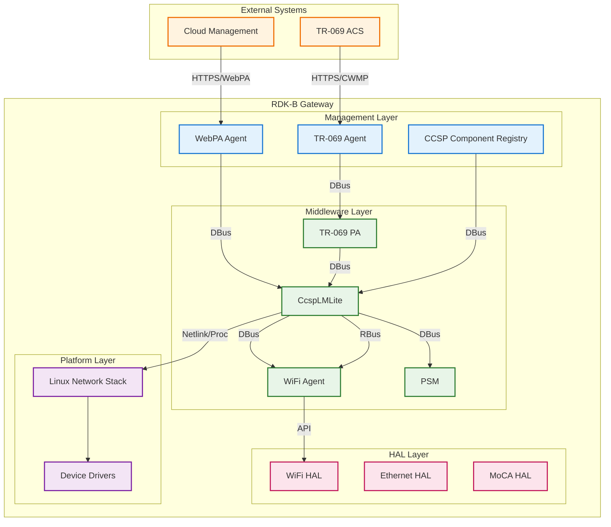
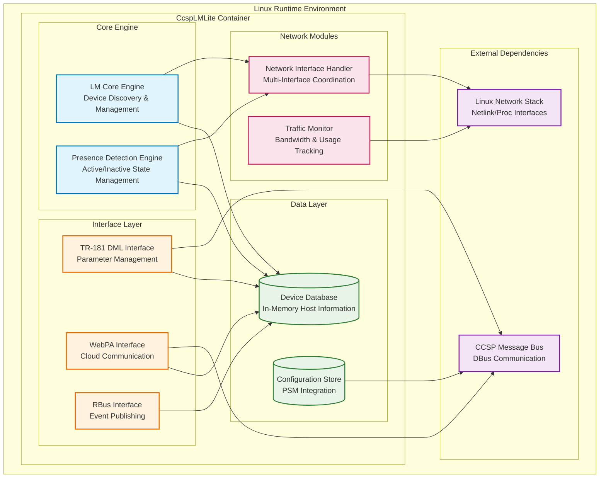
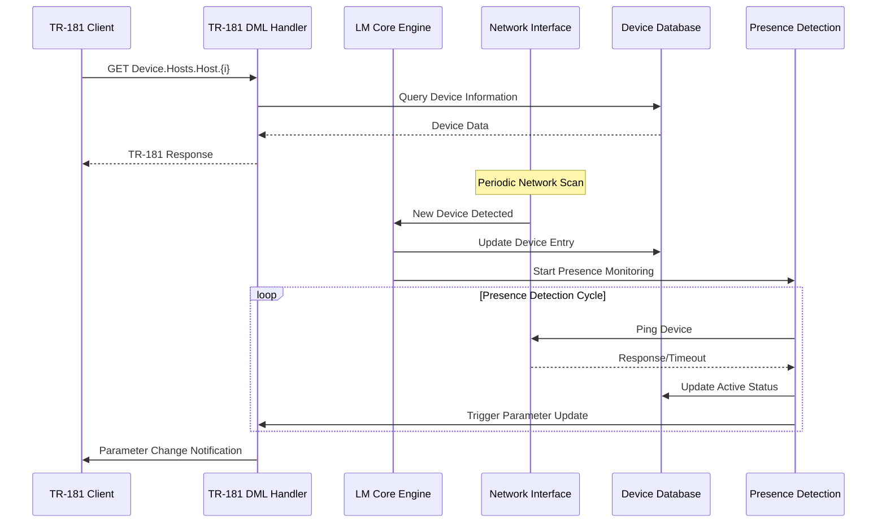
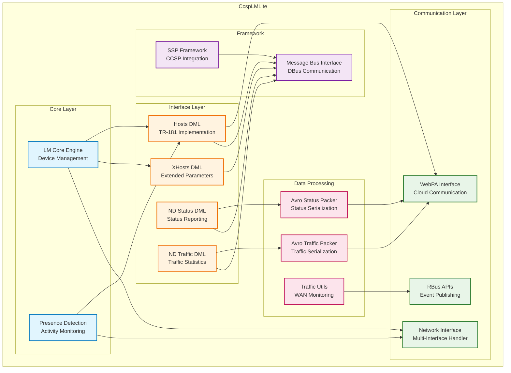
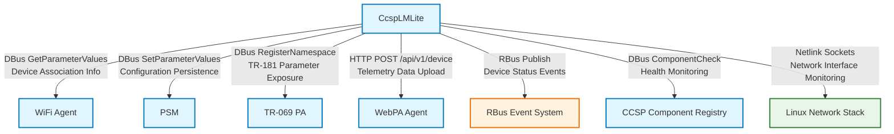
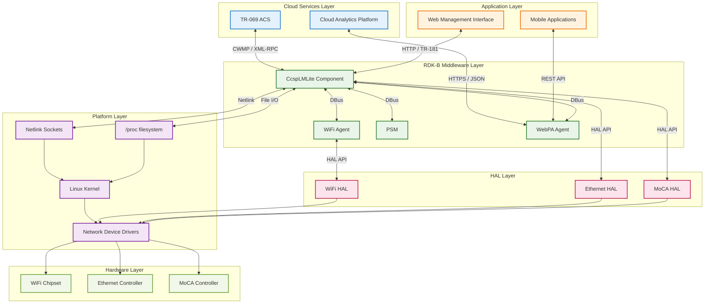
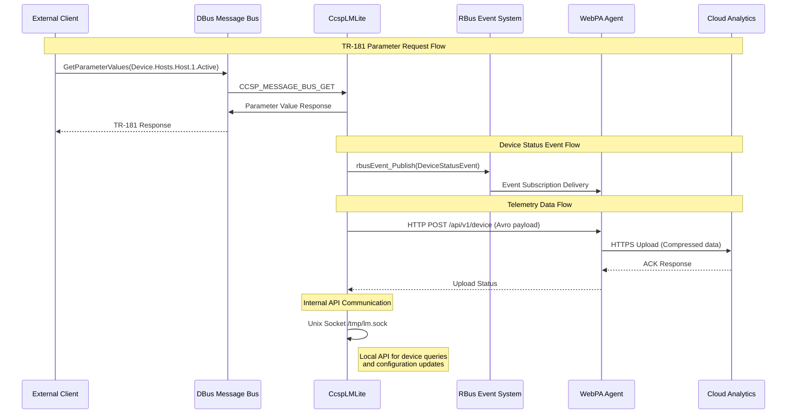

# CcspLMLite Documentation

CcspLMLite (LAN Management Lite) is a core RDK-B middleware component responsible for managing connected devices, host discovery, presence detection, and network traffic monitoring within the local area network. It serves as the central hub for tracking network device information, providing TR-181 data model implementation for device management, and facilitating telemetry data collection. The component bridges low-level network discovery mechanisms with high-level management services, integrating with CCSP framework, WebPA for cloud communication, and RBus for inter-component messaging.

- **Key Features & Responsibilities**:
  - **Host Discovery & Management**: Discovers, tracks, and manages connected devices across WiFi, Ethernet, and MoCA interfaces, maintaining comprehensive device information including MAC addresses, IP assignments, device types, and connection status
  - **Presence Detection**: Implements advanced presence detection algorithms using IPv4/IPv6 pings and network activity monitoring to determine device active/inactive states with configurable polling intervals and retry mechanisms
  - **TR-181 Data Model Implementation**: Provides complete TR-181 Hosts data model implementation with read/write parameter support, device enumeration, and vendor-specific extensions for RDK-specific functionality
  - **Network Traffic Monitoring**: Collects and reports WAN traffic statistics, device-specific traffic patterns, and network utilization metrics for bandwidth management and analytics
  - **Telemetry Data Collection**: Generates network device status reports, traffic statistics, and presence notifications in Avro format for upstream cloud analytics and monitoring systems
  - **Cross-Interface Integration**: Coordinates with multiple network interfaces (WiFi, Ethernet, MoCA) to provide unified device visibility and consistent device identification across different connection types

## Design

### High‑Level Design Principles

CcspLMLite follows a modular, event-driven architecture that emphasizes separation of concerns and loose coupling between functional components. The design prioritizes real-time responsiveness for presence detection while maintaining data consistency across multiple network interfaces. Scalability is achieved through efficient data structures and periodic harvesting mechanisms that can handle up to 256 concurrent devices. Reliability is ensured through robust error handling, graceful degradation during interface failures, and persistent state management via PSM integration. Security considerations include MAC address validation, IP address verification, and controlled access to sensitive network information through TR-181 parameter permissions.

The component implements clear boundaries between data collection (host discovery), data processing (presence detection algorithms), data storage (device state management), and data presentation (TR-181 interface). Interface management responsibilities are distributed across specialized modules: network interface abstraction handles multi-interface coordination, DML modules manage TR-181 parameter operations, and telemetry modules handle data serialization and reporting. The design supports both polling-based and event-driven data collection modes to optimize performance based on network conditions and device requirements.

### C4 Container Diagram

### Design Explanation & Request Flow

- **Request Flow Sequence**: The most critical flow is the device discovery and presence detection sequence, which involves continuous monitoring of network interfaces, device state updates, and TR-181 parameter synchronization.

### Threading Model

CcspLMLite implements a multi-threaded architecture with dedicated worker threads for different functional areas. The main application thread handles initialization, CCSP message bus communication, and TR-181 parameter requests. A dedicated device discovery thread continuously monitors network interfaces and processes new device connections. The presence detection engine runs in its own thread with configurable polling intervals (default 10 seconds) to check device active/inactive states. Traffic monitoring operates in a separate background thread to collect bandwidth statistics without impacting real-time operations. Event processing threads handle WebPA message publishing and RBus event notifications. Thread synchronization is managed through mutex locks and condition variables to ensure data consistency across concurrent operations while maintaining responsive user interface interactions.

## Internal Modules

The CcspLMLite component consists of several specialized modules that work together to provide comprehensive network device management functionality. The core LM (LAN Management) module orchestrates device discovery and maintains the central device database. DML modules provide TR-181 parameter interface implementations for different functional areas. Network interface handlers abstract platform-specific networking operations, while telemetry modules handle data serialization and cloud communication.

| Module/Class | Description | Key Files |
|-------------|------------|-----------|
| LM Core Engine | Central device discovery and management engine that coordinates host tracking, device enumeration, and state synchronization | `lm_main.c`, `lm_main.h`, `lm_api.c`, `lm_api.h` |
| TR-181 Hosts DML | Implements Device.Hosts.Host.{i} TR-181 data model with parameter get/set operations and device table management | `cosa_hosts_dml.c`, `cosa_hosts_dml.h` |
| Presence Detection | Advanced device presence detection using ping mechanisms, activity monitoring, and configurable timeout/retry logic | `device_presence_detection.c`, `device_presence_detection.h` |
| Network Device Status | Harvests and reports network device status information with Avro serialization for telemetry data collection | `network_devices_status.c`, `network_devices_status.h`, `network_devices_status_avropack.c` |
| Traffic Monitoring | WAN traffic counting and bandwidth monitoring with per-device statistics and RBus API integration | `cosa_wantraffic_api.c`, `cosa_wantraffic_utils.c`, `wtc_rbus_apis.c` |
| WebPA Interface | Cloud communication interface for device management commands, notifications, and telemetry data upstream delivery | `webpa_interface.c`, `webpa_interface.h`, `webpa_pd_with_seshat.c` |
| Network Interface Handler | Multi-interface coordination for WiFi, Ethernet, and MoCA connections with unified device identification | `network_devices_interface.c`, `network_devices_interface.h` |
| SSP Framework | System Service Provider framework integration with CCSP message bus, component registration, and lifecycle management | `ssp_main.c`, `ssp_messagebus_interface.c`, `ssp_action.c` |

## Interaction with Other Middleware Components

CcspLMLite integrates extensively with other RDK-B middleware components to provide comprehensive network management functionality. It communicates with WiFi Agent to retrieve wireless device information and association status, coordinating device discovery across multiple interfaces. The component interfaces with PSM (Persistent Storage Manager) for configuration parameter persistence and system state management. Integration with TR-069 PA enables remote management capabilities through TR-181 parameter exposure. WebPA Agent coordination facilitates cloud-based device management and telemetry data delivery for analytics platforms.

| Component | Purpose of Interaction | Protocols/Mechanisms |
|-----------|-----------------------|----------------------|
| WiFi Agent | Retrieve wireless device association status, RSSI values, and interface-specific device information for unified device tracking | DBus GetParameterValues, Event Notifications |
| PSM | Persist configuration parameters like polling intervals, presence detection settings, and harvesting configurations across system reboots | DBus SetParameterValues, GetParameterValues |
| TR-069 PA | Expose TR-181 Device.Hosts.Host.{i} parameters for remote management and configuration through TR-069 protocol | DBus RegisterNamespace, Parameter Notifications |
| WebPA Agent | Upload telemetry data including device status reports, traffic statistics, and presence notifications to cloud analytics platforms | HTTP POST JSON/Avro, Message Queue |
| CCSP Component Registry | Register component capabilities, health status reporting, and inter-component discovery for system orchestration | DBus ComponentRegistration, Health Checks |
| RBus Event System | Publish device presence events, traffic threshold notifications, and real-time device status changes for system-wide notifications | RBus Event Publishing, Subscriptions |

The component publishes several events to notify other system components about network device state changes and significant events that may require system-wide coordination or external reporting.

| Event | Purpose of Event | Reason for trigger |
|-----------|-----------------------|----------------------|
| Device.Hosts.Host.{i}.Active | Device presence state change notification indicating when devices join or leave the network | Triggered when presence detection algorithms determine device active/inactive state changes based on ping responses and network activity |
| Device.X_RDK_NetworkDeviceStatus | Comprehensive device status report containing device counts, interface statistics, and connection details | Triggered periodically based on harvesting schedule or on-demand when significant network topology changes are detected |
| Device.X_RDK_NetworkTrafficCount | WAN traffic statistics and per-device bandwidth utilization reports for network monitoring and analytics | Triggered at configured reporting intervals or when traffic thresholds are exceeded for bandwidth management |
| Device.Hosts.PresenceNotification | Real-time presence notifications for specific monitored devices with configurable MAC address filtering | Triggered immediately when monitored devices (configured via presence notification list) change presence status |

## Interaction with Other Layers

CcspLMLite interacts with multiple layers of the RDK-B software stack to provide comprehensive network device management. At the HAL layer, it interfaces with WiFi HAL for wireless device information and MoCA HAL for coax network devices. Platform-specific interactions include direct Linux network stack integration through netlink sockets and proc filesystem monitoring. External service integration encompasses cloud analytics platforms through WebPA and TR-069 ACS communication for remote management capabilities.

| Layer/Service | Interaction Description | Mechanism |
|---------------|-------------------------|----------|
| WiFi HAL | Retrieves wireless client association information, RSSI measurements, and interface status for WiFi-connected devices | HAL API calls, callback registrations |
| MoCA HAL | Obtains MoCA network topology, device association status, and coax interface statistics for unified device visibility | HAL API calls, status polling |
| Linux Network Stack | Monitors network interface changes, ARP table updates, and routing information for device discovery and IP tracking | Netlink sockets, /proc filesystem |
| WebPA Cloud Service | Uploads telemetry data, receives device management commands, and provides cloud-based analytics integration | HTTPS REST API, JSON/Avro payload |
| TR-069 ACS | Exposes device management parameters for remote configuration and monitoring through standardized TR-181 data model | CWMP protocol, XML-RPC |
| System Logging | Records component events, error conditions, and debug information for system monitoring and troubleshooting | Syslog, structured logging |

## IPC Mechanism

| Type of IPC | Message Format | Mechanism |
|---------------|-------------------------|----------|
| DBus Inter-Component Communication | XML-based parameter structure with CCSP-specific headers including component name, method calls, and parameter arrays | DBus method calls with CCSP message bus integration for TR-181 parameter operations |
| RBus Event Publishing | Binary serialized event data with topic-based routing containing device status, traffic statistics, and presence notifications | RBus publish/subscribe pattern with structured data types and filtering |
| WebPA Message Queue | JSON and Avro binary formats for telemetry data including device status reports, traffic counters, and network topology information | HTTP POST to WebPA agent with message queuing for reliable cloud delivery |
| Unix Domain Sockets | Custom binary protocol for local LM API communication including device queries, configuration updates, and status requests | Unix socket server (/tmp/lm.sock) with request/response pattern |

## TR‑181 Data Models

- **Implemented Parameters**: CcspLMLite implements the Device.Hosts object hierarchy including Host table entries, device enumeration parameters, presence detection controls, and RDK-specific extensions for enhanced network management functionality. Parameters include device identification, network interface associations, traffic statistics, and vendor-specific device classification.
- **Parameter Registration**: Parameters are registered through CCSP message bus integration using XML-based data model definitions from LMLite.XML configuration file. Access control is managed through TR-181 parameter permissions with read-only and read-write designations based on security requirements.
- **Custom Extensions**: X_CISCO_COM device type classification for enhanced device identification, X_RDKCENTRAL-COM presence detection controls for configurable monitoring, X_RDK presence notification system for real-time alerts, and traffic counting extensions for bandwidth management and analytics.

| Parameter | Description | Access (R/W) | Default | Notes |
|-----------|-------------|-------------|---------|-------|
| `Device.Hosts.HostNumberOfEntries` | Total number of discovered devices | R | `0` | Dynamic count |
| `Device.Hosts.Host.{i}.PhysAddress` | Device MAC address | R | `""` | Unique identifier |
| `Device.Hosts.Host.{i}.IPAddress` | Current IP address assignment | R | `""` | DHCP or static |
| `Device.Hosts.Host.{i}.Active` | Device presence status | R | `false` | Presence detection |
| `Device.Hosts.Host.{i}.DHCPClient` | DHCP client identifier | R | `""` | DHCP integration |
| `Device.Hosts.Host.{i}.AssociatedDevice` | Associated interface reference | R | `""` | Interface mapping |
| `Device.Hosts.Host.{i}.Layer1Interface` | Physical interface reference | R | `""` | Layer 1 association |
| `Device.Hosts.Host.{i}.Layer3Interface` | Network interface reference | R | `""` | Layer 3 association |
| `Device.Hosts.Host.{i}.HostName` | Device hostname | R | `""` | DNS/DHCP name |
| `Device.Hosts.Host.{i}.X_CISCO_COM_DeviceType` | Device classification | R | `1` | Custom device type |
| `Device.Hosts.Host.{i}.X_CISCO_COM_NetworkInterface` | Network interface type | R | `""` | WiFi/Ethernet/MoCA |
| `Device.Hosts.Host.{i}.X_CISCO_COM_ConnectionStatus` | Connection status details | R | `""` | Extended status |
| `Device.Hosts.Host.{i}.X_CISCO_COM_ActiveTime` | Active connection duration | R | `0` | Time tracking |
| `Device.Hosts.Host.{i}.X_CISCO_COM_InactiveTime` | Inactive duration | R | `0` | Presence monitoring |
| `Device.Hosts.Host.{i}.X_CISCO_COM_RSSI` | WiFi signal strength | R | `0` | WiFi devices only |
| `Device.Hosts.X_CISCO_COM_ConnectedDeviceNumber` | Total connected devices | R | `0` | Device count |
| `Device.Hosts.X_CISCO_COM_ConnectedWiFiNumber` | WiFi device count | R | `0` | WiFi-specific count |
| `Device.Hosts.X_RDKCENTRAL-COM_HostVersionId` | Host table version | R | `0` | Change tracking |
| `Device.Hosts.X_RDKCENTRAL-COM_HostCountPeriod` | Polling interval | R/W | `10` | Seconds |
| `Device.Hosts.X_RDK_PresenceDetectEnable` | Presence detection enable | R/W | `true` | Feature control |
| `Device.Hosts.X_RDKCENTRAL-COM_WebPA_PresenceNotificationEnable` | WebPA notifications | R/W | `false` | Cloud notifications |
| `Device.Hosts.X_RDKCENTRAL-COM_AddPresenceNotificationMac` | Add MAC to monitoring | W | `""` | Notification list |
| `Device.Hosts.X_RDKCENTRAL-COM_DeletePresenceNotificationMac` | Remove MAC from monitoring | W | `""` | Notification list |
| `Device.X_RDK_NetworkDevicesStatus.ReportingPeriod` | Status reporting interval | R/W | `900` | Telemetry timing |
| `Device.X_RDK_NetworkDevicesStatus.Enabled` | Status harvesting enable | R/W | `false` | Feature control |
| `Device.X_RDK_NetworkDevicesTraffic.ReportingPeriod` | Traffic reporting interval | R/W | `900` | Telemetry timing |
| `Device.X_RDK_NetworkDevicesTraffic.Enabled` | Traffic harvesting enable | R/W | `false` | Feature control |

## Implementation Details

- **Key Algorithms or Logic**: Device discovery uses ARP table monitoring combined with network interface scanning to detect new device connections (`lm_wrapper.c`, `network_devices_interface.c`). Presence detection implements a dual-mode algorithm using IPv4/IPv6 ping with configurable retry counts and timeout intervals (`device_presence_detection.c`). Traffic monitoring utilizes netlink socket integration to capture per-device bandwidth statistics with aggregation logic for WAN interface monitoring (`cosa_wantraffic_utils.c`). State machine management for device lifecycle transitions between connected/disconnected/active/inactive states with hysteresis to prevent flapping (`lm_main.c`).

- **Error Handling Strategy**: Comprehensive error detection includes network interface failure recovery, CCSP message bus reconnection logic, and graceful degradation when HAL components are unavailable. Errors are categorized by severity with different response strategies: critical errors trigger component restart, warning conditions enable fallback modes, and informational errors continue with limited functionality. All error conditions are logged with structured information including error codes, component context, and recovery actions taken.

- **Logging & Debugging**: Multi-level logging system with categories for device discovery (LM), presence detection (PD), traffic monitoring (TM), and telemetry (TEL). Verbosity levels include ERROR, WARN, INFO, and DEBUG with runtime configuration through TR-181 parameters. Debug tools include device table dumps, presence detection state visualization, traffic statistics reporting, and message bus transaction logging. Performance metrics tracking for polling intervals, response times, and memory utilization with configurable thresholds for system monitoring.

## Key Configuration Files

CcspLMLite relies on several configuration files to define its behavior, TR-181 parameter structure, and telemetry data schemas. These configuration files control everything from data model definitions to serialization formats for cloud analytics.

| Configuration File | Purpose | Key Parameters | Default Values | Override Mechanisms |
|--------------------|---------|---------------|----------------|--------------------|
| `config/LMLite.XML` | TR-181 data model definition | Object hierarchy, parameter types, access permissions, DML function mappings | Device.Hosts.* parameters, read/write permissions | Environment variables, build-time configuration |
| `config/NetworkDevicesStatus.avsc` | Avro schema for device status telemetry | Device status fields, data types, serialization structure | Device count, interface statistics, presence data | Schema versioning, runtime validation |
| `config/NetworkDevicesTraffic.avsc` | Avro schema for traffic telemetry | Traffic counters, bandwidth metrics, per-device statistics | TX/RX bytes, packet counts, interface mapping | Schema versioning, cloud compatibility |
| `/etc/ccsp/lm.cfg` | Runtime configuration parameters | Polling intervals, presence detection timeouts, device limits | 10s polling, 3 retries, 256 max devices | TR-181 parameter override, CLI configuration |
| `/tmp/lm.sock` | Unix domain socket configuration | Socket permissions, buffer sizes, connection limits | 755 permissions, 4KB buffer, unlimited connections | System configuration, security policies |