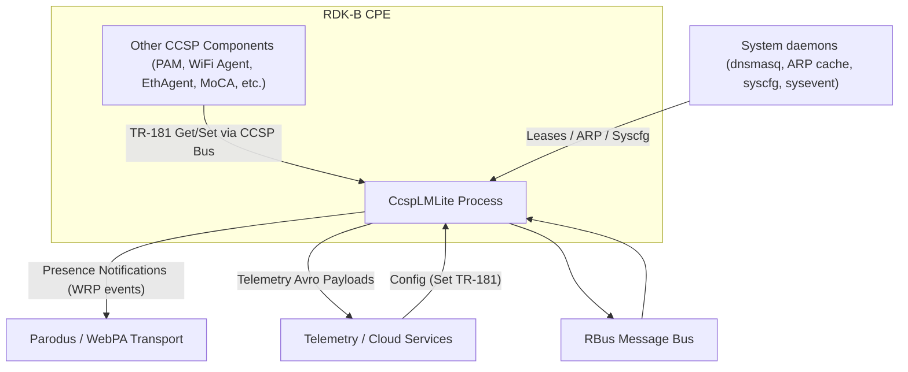
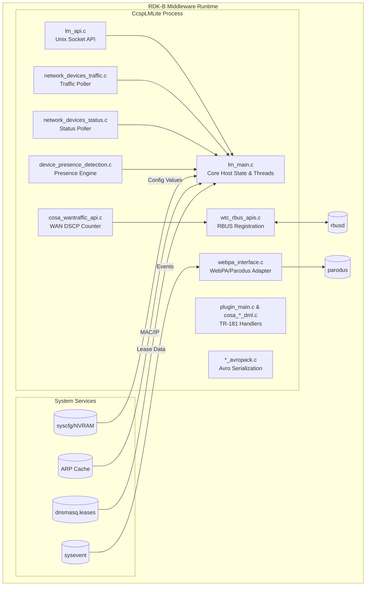
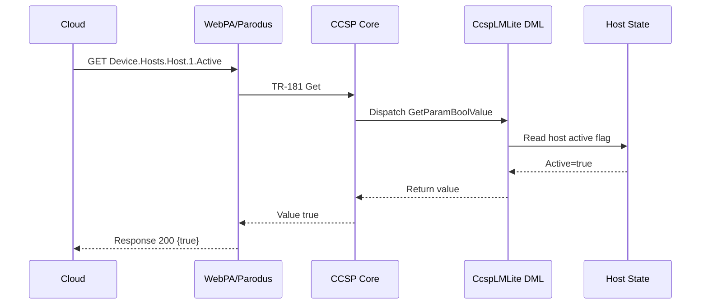
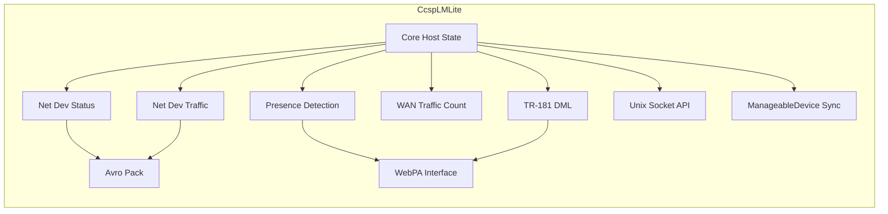
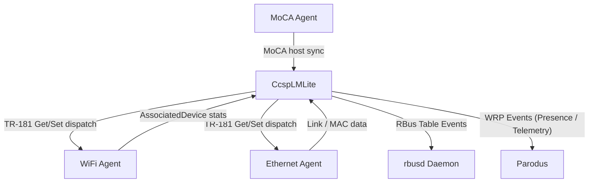
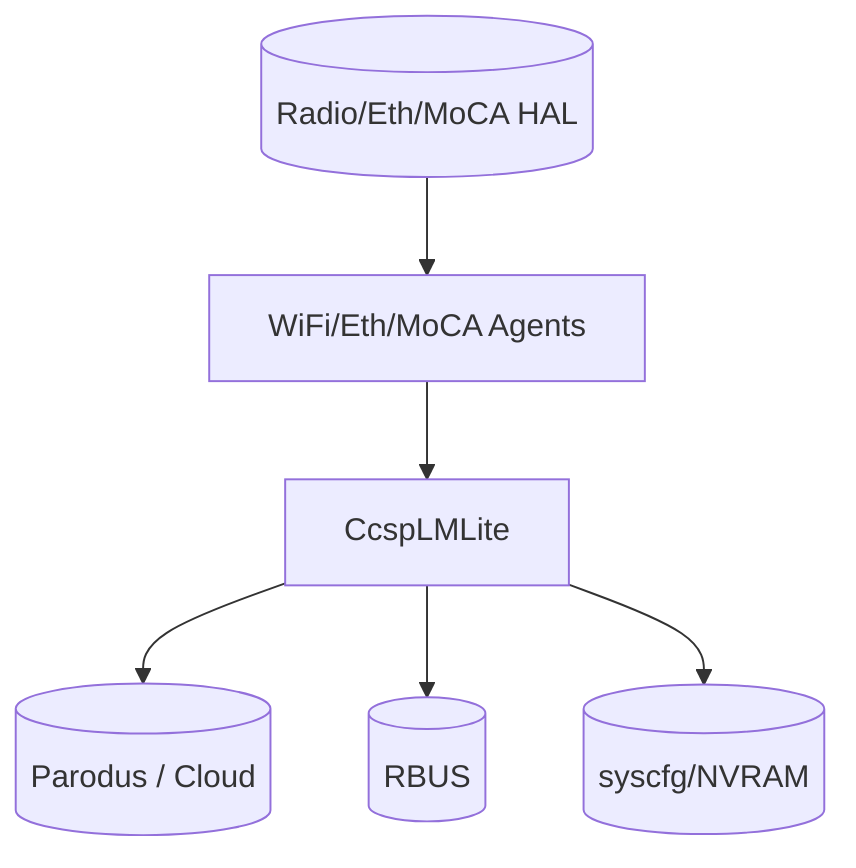
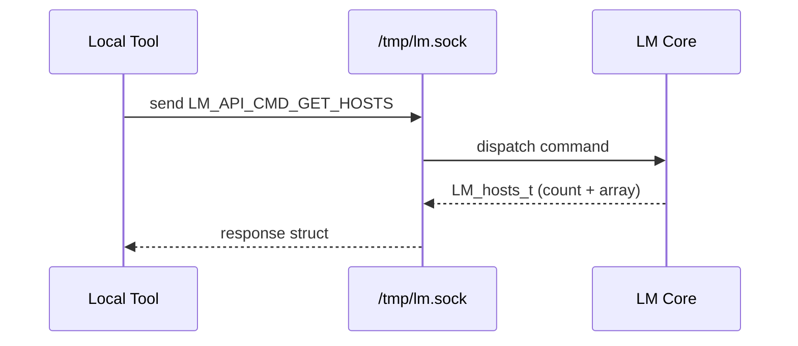

# CcspLMLite Documentation

CcspLMLite ("LM Lite") is the RDK‑B component responsible for host / local network device lifecycle tracking, presence detection, network device status & traffic telemetry, and WAN traffic counting enablement (RBUS-based). It exposes TR‑181 data model tables (Hosts, Host.IPv4/IPv6Address, optional XHosts, NetworkDevicesStatus, NetworkDevicesTraffic, WAN traffic stats) and provides IPC / RBUS interfaces for other middleware and cloud telemetry (WebPA / Parodus). LM Lite harvests active LAN device metadata, maintains state transitions, and publishes configurable reports and presence notifications.

- **Key Features & Responsibilities**:
  - **Host Inventory & State Tracking**: Discovers and maintains Device.Hosts.Host.* objects (MAC, IPs, interfaces, activity timers, RSSI, presence flags).
  - **Presence Detection & Notifications**: Implements configurable join/leave detection with retry strategies and publishes WebPA presence notifications & optional internal notifications.
  - **Network Device Status Reporting**: Periodic harvesting & reporting (poll/report intervals with override TTL) of per‑device status (active/inactive times, RSSI, associations) using configurable TR‑181 parameters.
  - **Network Device Traffic Reporting**: Collects & packages traffic counters (separate polling/reporting control) and supports Avro-packing for efficient upstream telemetry.
  - **WAN Traffic Count (RBUS)**: Registers RBUS table `Device.X_RDK_WAN.Interface.{i}` with DSCP counting enable/interval + per‑interval and total DSCP distribution.
  - **TR‑181 Parameter Handling**: Provides getters/setters/validation/commit/rollback for dynamic host & reporting objects, honoring atomic update semantics.
  - **Multi‑Interface Awareness**: Correlates Ethernet, Wi‑Fi (including extender), MoCA, and optionally DHCP / ARP / dnsmasq & system sources for unified host view.
  - **IPC API over Unix Socket**: Offers lightweight local socket API (`/tmp/lm.sock`) for querying host list, host by MAC, comments, online counts, and managing named “networks”.
  - **Extensibility & Resource Optimization**: Conditional compilation flags (RESOURCE_OPTIMIZATION, WAN_TRAFFIC_COUNT_SUPPORT, RDKB_EXTENDER_ENABLED, RBUS enablement) allow footprint tailoring.

## Design

### High‑Level Design Principles

CcspLMLite emphasizes modular harvesting of heterogeneous LAN data sources, consolidating them into a consistent TR‑181 surface while decoupling collection from reporting. Guiding principles include: modularity (separate source modules: status, traffic, presence, WAN), scalability (interval tuning, conditional features), reliability (mutex protection, retry queues, timed waits), security (bounded buffers, safe string ops via `safec_lib`, privilege separation for system commands), and maintainability (clear DML function registration, feature flags). Design choices isolate: (1) Data Acquisition (polling threads) (2) State & Model Assembly (host tables & internal structures) (3) IPC/External Interfaces (TR‑181 handlers, RBUS, WebPA, Unix socket) (4) Reporting & Packaging (Avro packers, presence notifier). Boundaries: persistence/config (syscfg, NVRAM), IPC (RBUS/WebPA), telemetry formatting (Avro), and host state core.

### C4 System Context Diagram

### C4 Container Diagram

### Design Explanation & Request Flow

- **Request Flow Sequence**: Typical remote Get/Set from cloud -> WebPA -> CCSP TR‑181 handler -> internal host structure -> (optional update) -> commit/rollback. Presence detection events flow from polling threads / state transitions to WebPA notifications.

### Threading Model

Multi-threaded model using pthreads and condition variables:
- Main host management thread(s) in `lm_main.c` handle queue events (Ethernet/WiFi/MoCA, validation queue) and synchronization of host objects.
- Network Device Status harvesting thread (`StartNetworkDeviceStatusHarvesting`) polls at `NDSPollingPeriod` and signals reporting logic.
- Network Device Traffic harvesting analogous thread for traffic counters.
- Presence processing thread (`processPresenceNotification`) manages join/leave detection with IPv4/IPv6 retry intervals.
- WAN traffic RBUS initialization occurs during feature setup; RBUS callbacks may be invoked concurrently.
- WebPA interface uses mutex `webpa_mutex` to serialize message sending.
- Multiple mutexes guard shared state: `LmHostObjectMutex`, `HostNameMutex`, `PollHostMutex`, `LmRetryHostListMutex`, `ndsMutex`, etc.

## Internal Modules

| Module/Class | Description | Key Files |
|--------------|-------------|-----------|
| Core Host State | Maintains consolidated host list, IPs, timing, synchronization operations | `lm_main.c`, `lm_util.c`, `lm_wrapper.c` |
| Presence Detection | Determines join/leave, manages notification enable per host & presence algorithms | `device_presence_detection.c`, `webpa_pd_*` |
| TR‑181 DML Handlers | Implements parameter getters/setters, synchronization, validation, commit/rollback | `cosa_hosts_dml.c`, `cosa_ndstatus_dml.c`, `cosa_ndtraffic_dml.c`, `plugin_main.c` |
| Network Device Status | Polls and aggregates status metrics, timing, TTL override logic | `network_devices_status.c` |
| Network Device Traffic | Gathers per-device traffic metrics, prepares Avro payloads | `network_devices_traffic.c`, `network_devices_traffic_avropack.c` |
| Avro Serialization | Packs status/traffic data for upstream telemetry | `*_avropack.c`, `extender_associated_devices_avropack.c` |
| WAN Traffic Count | Manages DSCP-based WAN traffic statistics via RBUS table | `cosa_wantraffic_api.c`, `wtc_rbus_apis.c`, `cosa_wantraffic_utils.c` |
| WebPA Interface | Sends telemetry & presence notifications upstream via Parodus (WRP events) | `webpa_interface.c` |
| Unix Socket API | Provides local client API for host queries & network mgmt | `lm_api.c`, `lm_api.h` |
| Management Server (Manageable Devices) | Synchronizes ManageableDevice table with Host table | `cosa_managementserver_dml.c` |
| Reporting Orchestrator | Report scheduling & object creation | `cosa_reports_internal.c` |

Module Breakdown Diagram:

## Interaction with Other Middleware Components

| Component | Purpose of Interaction | Protocols/Mechanisms |
|-----------|-----------------------|----------------------|
| WiFi Agent | Supply Wi-Fi associated device stats (RSSI, interface mapping) | CCSP TR‑181, internal sync triggers |
| Ethernet Agent | Ethernet host MAC/IP updates | CCSP TR‑181 |
| MoCA Agent | MoCA host synchronization | CCSP TR‑181 (conditional) |
| Parodus/WebPA | Upstream telemetry & presence events | WRP over WebSocket (libparodus) |
| RBUS Daemon | WAN traffic DSCP table registration | RBUS API |
| Syscfg/Sysevent | Config persistence and runtime events | syscfg key/value, sysevent API |

Events Published (examples):

| Event | Purpose of Event | Reason for trigger |
|-------|------------------|--------------------|
| PresenceNotification | Notify cloud of host join/leave with interface & hostname | Host state transition detected in presence thread |
| DSCPCountPerInterval | Provide DSCP distribution per counting interval | RBUS subscription interval elapsed |
| NetworkDevicesStatusReport | Periodic batched status snapshot | Reporting period expiry |
| NetworkDevicesTrafficReport | Periodic traffic counters snapshot | Reporting period expiry |

## Interaction with Other Layers

| Layer/Service | Interaction Description | Mechanism |
|---------------|-------------------------|----------|
| HAL / Drivers | Indirect via WiFi/Ethernet/MoCA agents for link & RSSI | CCSP TR‑181 chain |
| Platform (syscfg, sysevent) | Persist intervals, obtain MAC, handle runtime events | syscfg_get/set, sysevent APIs |
| External Cloud | Receive telemetry / presence events & issue parameter changes | WebPA/Parodus, TR‑181 Set/Get |

Layered Architecture View:

## IPC Mechanism

| Type of IPC | Message Format | Mechanism |
|-------------|----------------|-----------|
| TR‑181 CCSP | Parameter Get/Set/Notify semantics; typed values | CCSP Message Bus (DBus) |
| Unix Domain Socket | Binary request structs (command enums) & result union (host arrays) | `/tmp/lm.sock` local socket |
| WebPA Events | WRP event messages (JSON or binary payload) | libparodus WebSocket | 
| RBUS Table & Events | RBUS data elements with handlers & subscriptions | RBUS API |
| Condition Signaling | N/A (synchronization only) | pthread cond/mutex |

IPC Flow (Unix Host Query):

## TR‑181 Data Models

Implemented Key Objects (subset):
- `Device.Hosts` and dynamic `Device.Hosts.Host.{i}` with sub‑objects `IPv4Address` & `IPv6Address`.
- Optional `Device.XHosts.XHost.{i}` (non‑optimized builds) mirroring host set.
- `Device.NetworkDevicesStatus.*` and `Device.NetworkDevicesTraffic.*` (polling/report intervals, enable flags, defaults, override TTL).
- `Device.X_RDK_WAN.Interface.{i}.Stats.*` (RBUS WAN traffic DSCP counting) when WAN feature enabled.
- Presence related parameters: `X_RDK_PresenceDetectEnable`, `X_RDKCENTRAL-COM_WebPA_PresenceNotificationEnable`, add/delete notification MAC lists, join/leave interval/retry settings, host-level `X_RDKCENTRAL-COM_PresenceNotificationEnabled`, `RDK_PresenceActive`, timestamps.

Parameter Registration is performed in `plugin_main.c` via `RegisterFunction` for each getter/setter, with dynamic table synchronization handlers (`*_GetEntryCount`, `*_Synchronize`). Atomic Set semantics rely on staged values validated then committed or rolled back.

Custom / Extended Parameters (examples):
- `X_RDKCENTRAL-COM_HostVersionId`: Host table version for consumer cache invalidation.
- `X_RDKCENTRAL-COM_LMHost_Sync` & interface/multi-technology sync triggers.
- Presence tuning: `X_RDKCENTRAL-COM_PresenceLeaveIPv4Retries`, `X_RDKCENTRAL-COM_BackgroundPresenceJoinInterval`.
- WAN DSCP: `Device.X_RDK_WAN.Interface.{i}.Stats.DscpCountEnable`, `...Interval`, `...PerInterval`, `...Total`.

(See `config/LMLite.XML` for comprehensive list.)

## Implementation Details

- **Key Algorithms / Logic**: Host synchronization merges data from DHCP leases, ARP, Wi‑Fi association, MoCA lists, tracking Active vs Inactive durations and presence transitions. Presence detection applies retry counts & intervals (IPv4/IPv6) before declaring leave, reducing false negatives. Network status & traffic modules implement periodic polling with adjustable intervals and TTL override logic resetting to defaults after configured time-to-live. WAN traffic counting registers RBUS data elements and stores DSCP distributions, supporting dynamic enable & interval changes.
- **Error Handling Strategy**: Functions return explicit status codes; validation ensures bounds on arrays (e.g., IP list sizes). Safe C library used for bounded copies (`strncpy_s`, `sprintf_s`). Failed RBUS or socket initializations short-circuit feature activation. Conditional compilation avoids invalid calls when features disabled.
- **Logging & Debugging**: Wrapper macros (`CcspLMLiteConsoleTrace`, `CcspTraceWarning`, `WTC_LOG_INFO/ERROR`) categorize messages. Optional onboard logging macro (`OnboardLog`). Telemetry events may be emitted for presence transitions and report start/stop.

## Key Configuration Files

| Configuration File | Purpose | Key Parameters | Default Values | Override Mechanisms |
|--------------------|---------|---------------|----------------|--------------------|
| `config/LMLite.XML` | TR‑181 object & parameter bindings | Host tables, presence tuning, status/traffic params | As defined in XML (e.g., max instances 64) | Updated via TR‑181 Sets (persisted by syscfg where implemented) |
| `dnsmasq.leases` (runtime) | Source of DHCP lease info | MAC/IP/Lease Time | Runtime dynamic | External daemon updates |
| syscfg keys | Store presence and interval settings | Polling/Reporting/Presence flags | Build defaults | TR‑181 Set -> syscfg commit |

## Quality & Validation Notes

- Mutex & cond var usage prevents race on host list & reporting periods.
- Atomic TR‑181 updates comply with validate/commit/rollback pattern.
- Feature flags reduce runtime overhead in constrained builds.
- RBUS registration guarded by runtime RBUS status check.

## Future / Improvement Opportunities

- Abstract data source adapters to plug new technologies without modifying core.
- Add rate limiting / batching for presence notifications to reduce chatter.
- Provide JSON schema for Avro-packed payload inspection.
- Unit tests expansion for WAN DSCP RBUS handlers.

---
Generated from source analysis (Sep 2025). All placeholders removed; diagrams follow RDK‑B diagram guidelines.
