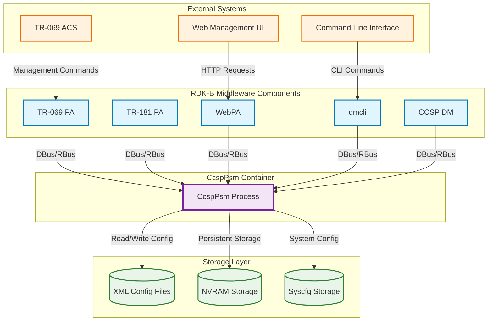
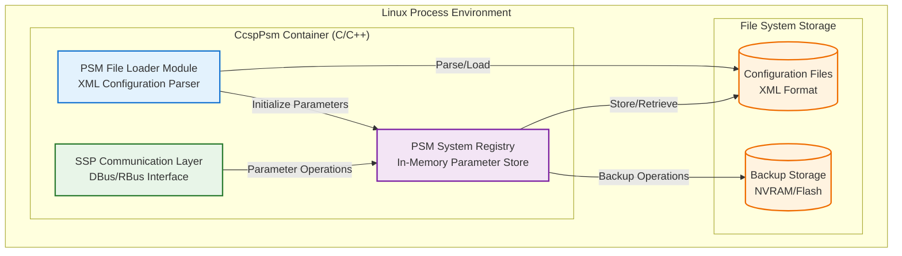
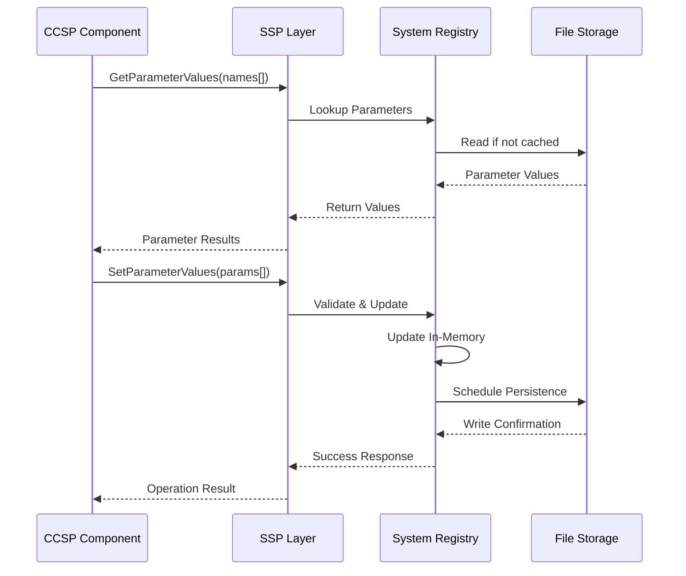
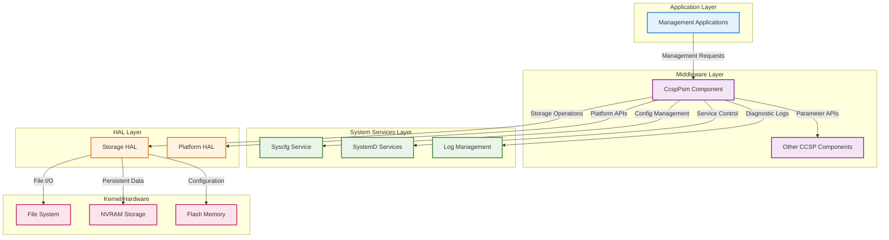
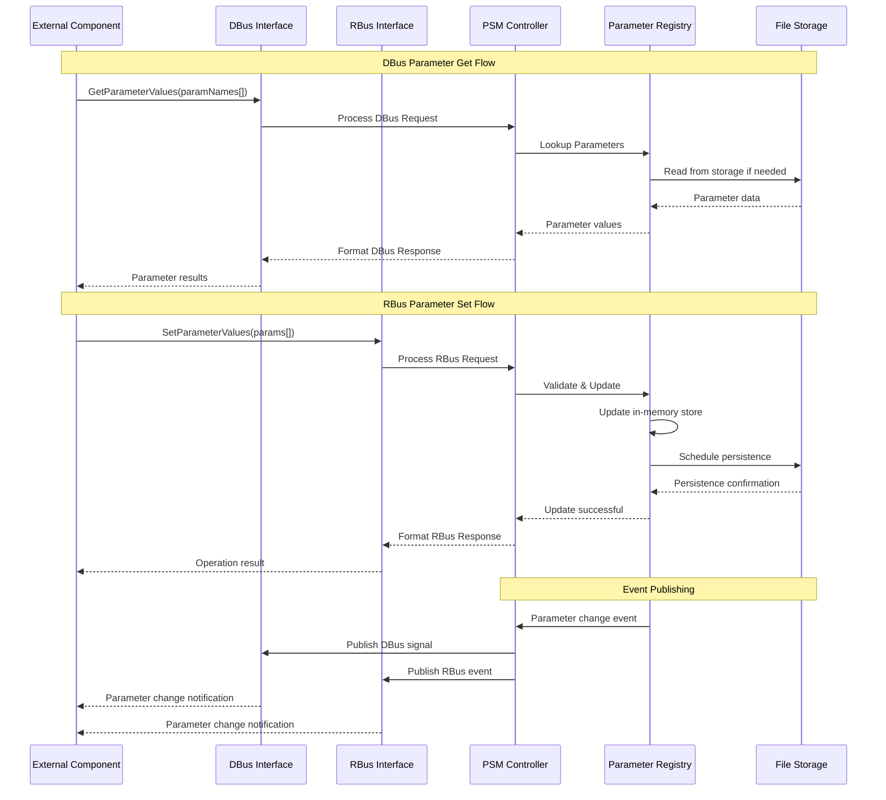

# CcspPsm (Persistent Storage Manager) Documentation

CcspPsm is a critical middleware component in the RDK-B stack that provides centralized persistent storage services for TR-181 data model parameters and configuration data. It acts as a registry and storage manager that allows other CCSP components to store, retrieve, and manage persistent configuration parameters across device reboots. The component serves as the authoritative source for device configuration state and provides both DBus and RBus interfaces for parameter access and management.

- **Key Features & Responsibilities**: 
  - **Persistent Parameter Storage**: Provides centralized storage and retrieval of TR-181 data model parameters with persistence across device reboots
  - **Configuration File Management**: Loads, parses, and manages XML configuration files containing default parameter values and device-specific settings
  - **Multi-Protocol IPC Support**: Supports both DBus and RBus communication protocols for parameter access from other middleware components
  - **Registry Services**: Maintains an in-memory registry of parameters with efficient lookup and modification capabilities
  - **Atomic Operations**: Ensures data consistency through atomic read/write operations and proper transaction handling
  - **Health Monitoring**: Provides component health status and diagnostic information for system monitoring

## Design

### High‑Level Design Principles

CcspPsm follows a modular, service-oriented architecture that separates concerns between configuration file loading, in-memory registry management, and external communication interfaces. The design emphasizes reliability through robust error handling, data validation, and atomic operations to prevent configuration corruption. Scalability is achieved through efficient data structures and optimized parameter lookup algorithms. The component maintains strong security boundaries by validating all parameter access requests and enforcing proper authentication. Maintainability is ensured through clear module separation, comprehensive logging, and well-defined interfaces between internal components.

The design establishes clear boundaries between the File Loader module (responsible for parsing XML configurations), the System Registry module (managing in-memory parameter storage), and the SSP layer (handling external communications). Each module has distinct responsibilities: File Loader handles configuration file parsing and validation, System Registry manages parameter storage and retrieval operations, and SSP provides DBus/RBus interface implementations. This separation enables independent testing, maintenance, and evolution of each subsystem while maintaining overall system coherence.

### C4 Container Diagram

### Design Explanation & Request Flow

- **Request Flow Sequence**: The most critical flow is parameter retrieval/storage. When an external component requests a parameter value, the request comes through either DBus or RBus to the SSP layer, which validates the request and forwards it to the System Registry. The registry performs efficient parameter lookup using hash tables and returns the value. For parameter updates, the flow includes validation, in-memory update, and eventual persistence to storage files.

### Threading Model

CcspPsm uses a hybrid threading model combining a main event loop thread with worker threads for specific operations. The main thread handles DBus/RBus message processing and maintains the primary event loop for handling external requests. Worker threads are created on-demand for file I/O operations, configuration loading, and periodic backup tasks to prevent blocking the main communication thread. The System Registry maintains thread-safe parameter access through mutex locks and atomic operations to ensure data consistency across concurrent operations. A dedicated timer thread manages periodic tasks such as configuration file synchronization and health status reporting.

## Internal Modules

The CcspPsm component is organized into three primary modules that work together to provide persistent storage services. The File Loader module handles all configuration file operations including XML parsing, validation, and initial parameter loading. The System Registry module maintains the in-memory parameter database and provides efficient storage and retrieval operations. The SSP (System Service Provider) layer manages external communications through DBus and RBus interfaces, handling protocol-specific message formatting and authentication.

| Module/Class | Description | Key Files |
|-------------|------------|-----------|
| PSM File Loader | Handles XML configuration file parsing, validation, and initial parameter loading from default configuration files | `psm_flo_base.c`, `psm_flo_parse.c`, `psm_flo_control.c`, `psm_flo_operation.c` |
| PSM System Registry | Manages in-memory parameter storage, provides efficient lookup/storage operations, and handles parameter persistence | `psm_sysro_base.c`, `psm_sysro_storage.c`, `psm_sysro_operation.c`, `psm_sysro_control.c` |
| SSP Communication Layer | Provides DBus and RBus interface implementations for external component communication | `ssp_main.c`, `ssp_dbus.c`, `ssp_rbus.c`, `ssp_cfmif.c` |
| HAL Interface | Platform-specific hardware abstraction layer for storage operations and device-specific configurations | `psm_hal_apis.c` |

```mermaid
flowchart TD
    subgraph CcspPsm["CcspPsm Component"]
        subgraph SSP["SSP Layer"]
            DBusIf([DBus Interface])
            RBusIf([RBus Interface])
            MainCtrl([Main Control])
        end
        
        subgraph Registry["System Registry"]
            ParamStore([Parameter Storage])
            LookupEngine([Lookup Engine])
            PersistMgr([Persistence Manager])
        end
        
        subgraph FileLoader["File Loader"]
            XMLParser([XML Parser])
            ConfigValidator([Config Validator])
            FileManager([File Manager])
        end
        
        subgraph HAL["HAL Interface"]
            StorageAPI([Storage APIs])
            PlatformIf([Platform Interface])
        end
    end
    
    DBusIf --> MainCtrl
    RBusIf --> MainCtrl
    MainCtrl --> ParamStore
    ParamStore --> LookupEngine
    LookupEngine --> PersistMgr
    PersistMgr --> XMLParser
    XMLParser --> ConfigValidator
    ConfigValidator --> FileManager
    FileManager --> StorageAPI
    StorageAPI --> PlatformIf
    
    classDef ssp fill:#e3f2fd,stroke:#1976d2,stroke-width:2px;
    classDef registry fill:#f3e5f5,stroke:#7b1fa2,stroke-width:2px;
    classDef loader fill:#e8f5e8,stroke:#2e7d32,stroke-width:2px;
    classDef hal fill:#fff3e0,stroke:#ef6c00,stroke-width:2px;
    
    class DBusIf,RBusIf,MainCtrl ssp;
    class ParamStore,LookupEngine,PersistMgr registry;
    class XMLParser,ConfigValidator,FileManager loader;
    class StorageAPI,PlatformIf hal;
```

## Interaction with Other Middleware Components

CcspPsm serves as the central parameter storage service for the entire RDK-B middleware stack, providing parameter storage and retrieval services to numerous components. It receives parameter get/set requests from TR-069 PA for remote management operations, TR-181 PA for data model access, WebPA for web-based configuration, and dmcli for command-line operations. The component also interacts with various functional components like WiFi manager, WAN manager, and device management modules for storing their specific configuration parameters.

```mermaid
flowchart TD
    subgraph "Management Interfaces"
        TR069PA[TR-069 PA]
        WebPA[WebPA Agent]
        DMCLI[DMCLI Tool]
    end
    
    subgraph "Data Model Layer"
        TR181PA[TR-181 PA]
        CcspDM[CCSP DM Bus]
    end
    
    subgraph "Functional Components"
        WiFiMgr[WiFi Manager]
        WANMgr[WAN Manager]
        DevMgr[Device Manager]
        FirewallMgr[Firewall Manager]
    end
    
    CcspPsm -->|DBus Parameter APIs| TR069PA
    CcspPsm -->|RBus Parameter APIs| WebPA
    CcspPsm -->|DBus CLI Interface| DMCLI
    CcspPsm -->|DBus Data Model| TR181PA
    CcspPsm -->|Message Bus| CcspDM
    CcspPsm -->|DBus Config Storage| WiFiMgr
    CcspPsm -->|DBus Config Storage| WANMgr
    CcspPsm -->|DBus Config Storage| DevMgr
    CcspPsm -->|DBus Config Storage| FirewallMgr
    
    classDef mgmt fill:#e3f2fd,stroke:#1976d2,stroke-width:2px;
    classDef datamodel fill:#f3e5f5,stroke:#7b1fa2,stroke-width:2px;
    classDef functional fill:#e8f5e8,stroke:#2e7d32,stroke-width:2px;
    classDef psm fill:#fff8e1,stroke:#f57f00,stroke-width:3px;
    
    class TR069PA,WebPA,DMCLI mgmt;
    class TR181PA,CcspDM datamodel;
    class WiFiMgr,WANMgr,DevMgr,FirewallMgr functional;
    class CcspPsm psm;
```

| Component | Purpose of Interaction | Protocols/Mechanisms |
|-----------|-----------------------|----------------------|
| TR-069 PA | Remote management parameter operations for ACS communication | DBus method calls, parameter get/set APIs |
| WebPA Agent | Web-based parameter management and device configuration | RBus parameter APIs, notification events |
| TR-181 PA | Data model parameter access and TR-181 object management | DBus parameter APIs, bulk operations |
| DMCLI Tool | Command-line parameter access for debugging and configuration | DBus direct parameter APIs |
| WiFi Manager | WiFi configuration parameter storage and retrieval | DBus parameter storage, configuration events |
| WAN Manager | WAN interface configuration parameter management | DBus parameter storage, connection events |

CcspPsm publishes several key events to notify other components about parameter changes and system state updates. These events enable reactive configuration management and system coordination across the middleware stack.

| Event | Purpose of Event | Reason for trigger |
|-----------|-----------------------|----------------------|
| parameterValueChanged | Notifies components when parameter values are modified | Triggered when any TR-181 parameter is updated via set operations |
| systemReady | Indicates PSM has completed initialization and is ready for requests | Fired after successful configuration loading and registry initialization |
| configurationBackupComplete | Notifies about successful configuration backup operations | Triggered after periodic backup operations or manual backup requests |
| parameterCommitReady | Indicates parameters are staged and ready for commit | Fired when transaction-based parameter updates are prepared for persistence |

## Interaction with Other Layers

CcspPsm interacts extensively with multiple layers in the RDK-B software stack to provide comprehensive persistent storage services. At the HAL layer, it uses platform-specific storage APIs for accessing NVRAM, flash memory, and file system resources. The component interfaces with platform services like syscfg for system configuration management and integrates with Linux system services for file I/O operations and process management.

| Layer/Service | Interaction Description | Mechanism |
|---------------|-------------------------|----------|
| HAL Storage | Platform-specific storage operations for NVRAM and flash memory access | Direct HAL API calls, file system operations |
| Syscfg Service | System configuration parameter management and cross-component coordination | DBus syscfg APIs, shared configuration database |
| Linux File System | Configuration file I/O, backup operations, and temporary file management | Standard POSIX file operations, directory monitoring |
| Platform Services | Integration with systemd, logging services, and system health monitoring | System service APIs, logging frameworks |
| Security Framework | Parameter access control, authentication, and authorization | Security API calls, permission validation |

## IPC Mechanism

| Type of IPC | Message Format | Mechanism |
|---------------|-------------------------|----------|
| DBus | CCSP parameter structure with name-value pairs, XML-based method calls, structured parameter arrays | DBus method invocation with CCSP base APIs, message serialization |
| RBus | RBus native data types with automatic type conversion, binary message format, event subscription model | RBus direct API calls, native type marshalling, event publishing |
| Message Queues | Internal component communication using ANSC message structures, control messages, state notifications | POSIX message queues, semaphore synchronization |

CcspPsm implements a sophisticated IPC architecture supporting both legacy DBus interfaces and modern RBus communication. The DBus interface provides backward compatibility with existing CCSP components using XML-based parameter structures and method calls. The RBus interface offers improved performance with native data type support and efficient binary serialization. Internal communication between modules uses ANSC framework message structures for control operations and state management.

## TR‑181 Data Models

- **Implemented Parameters**: CcspPsm implements core TR-181 Device.DeviceInfo parameters for device identification and system information, Device.ManagementServer parameters for TR-069 ACS communication settings, and Device.Time parameters for system time configuration. It also manages numerous vendor-specific and custom parameters for platform-specific device configuration.
- **Parameter Registration**: Parameters are registered through the System Registry module using hash-table based indexing for efficient lookup. The component supports both static parameter registration from XML configuration files and dynamic registration for runtime-created parameters. Access control is enforced through CCSP authentication mechanisms integrated with DBus and RBus interfaces.
- **Custom Extensions**: Platform-specific parameter extensions for advanced WiFi configuration, hardware-specific device settings, custom diagnostic parameters for system monitoring and troubleshooting, vendor-specific management parameters for proprietary features, and extended telemetry parameters for performance monitoring and analytics.

CcspPsm manages a comprehensive set of TR-181 parameters covering device information, management server configuration, and various functional areas. The parameter implementation includes proper type validation, range checking, and access control enforcement.

| Parameter | Description | Access (R/W) | Default | Notes |
|-----------|-------------|-------------|---------|-------|
| `Device.DeviceInfo.Manufacturer` | Device manufacturer name | R | "RDK Management" | Standard TR-181 |
| `Device.DeviceInfo.ModelName` | Device model identifier | R | "" | Platform-specific |
| `Device.DeviceInfo.SoftwareVersion` | Current software version | R | "" | Auto-populated |
| `Device.ManagementServer.URL` | TR-069 ACS server URL | R/W | "" | Management config |
| `Device.ManagementServer.Username` | ACS authentication username | R/W | "" | Encrypted storage |
| `Device.ManagementServer.Password` | ACS authentication password | W | "" | Write-only, encrypted |
| `Device.Time.NTPServer1` | Primary NTP server address | R/W | "pool.ntp.org" | Time synchronization |
| `Device.WiFi.Radio.1.Enable` | WiFi radio 1 enable status | R/W | `true` | Custom validation |
| `Device.Custom.Namespace.DebugLevel` | Component debug logging level | R/W | `3` | Custom extension |

## Implementation Details

- **Key Algorithms or Logic**: CcspPsm employs efficient hash-table based parameter lookup algorithms in the System Registry module (`psm_sysro_storage.c`) for O(1) average-case parameter access. The File Loader module (`psm_flo_parse.c`) implements SAX-based XML parsing for memory-efficient configuration file processing. Parameter persistence uses atomic file operations with backup mechanisms to prevent configuration corruption during system failures. The component implements lazy loading for configuration parameters to optimize memory usage and startup time.

- **Error Handling Strategy**: Comprehensive error detection includes XML parsing validation, parameter type checking, storage operation verification, and IPC communication error handling. Errors are logged through the RDK logging framework with categorized severity levels (Error, Warning, Info, Debug). Critical errors trigger component restart mechanisms, while recoverable errors are handled gracefully with fallback to default values. Error propagation follows CCSP standards with appropriate error codes returned to calling components.

- **Logging & Debugging**: Logging categories include CONFIG (configuration operations), STORAGE (file I/O operations), IPC (communication events), and PARAM (parameter operations). Verbosity levels range from 0 (errors only) to 4 (full debug tracing). Debug tools include parameter dump utilities, configuration validation tools, and runtime memory usage monitors. The component supports dynamic log level adjustment through TR-181 parameters for runtime debugging.

## Key Configuration Files

CcspPsm relies on several critical configuration files that define default parameter values, component behavior, and platform-specific settings. These files are processed during component initialization and can be updated for customization and deployment-specific configurations.

| Configuration File | Purpose | Key Parameters | Default Values | Override Mechanisms |
|--------------------|---------|---------------|----------------|--------------------|
| `bbhm_def_cfg_qemu.xml` | Default parameter values and TR-181 object definitions | TR-181 parameters, device-specific configs | Platform defaults | Environment variables, command-line args |
| `debug.ini` | Debug and logging configuration | Log levels, output targets, categories | Error level logging | Runtime parameter updates |
| `psm.cfg` | Component-specific configuration | Storage paths, backup intervals, cache sizes | `/nvram/psm/` storage | Configuration file overrides |
| `systemd/ccsp-psm.service` | SystemD service configuration | Process startup, dependencies, restart policies | Auto-restart enabled | SystemD override files |