# RDK-B WAN Manager Documentation

## 1. Overview

- **Purpose in RDK-B Stack**: The WAN Manager is a core RDK-B middleware component responsible for managing WAN connectivity across multiple interface types (DOCSIS, Ethernet, DSL, GPON, Cellular). It abstracts physical interface management from upper-layer routing and provides intelligent failover and selection policies for optimal WAN connectivity.

- **Key Features & Responsibilities**:
  - **Interface Management**: Coordinates with Interface Managers (XDSL, Eth, DOCSIS, GPON, Cellular) for physical layer status
  - **Policy Engine**: Implements multiple WAN selection policies (AutoWAN, Fixed Mode, Primary Priority, Parallel Scan)
  - **IP Configuration**: Manages DHCP, IPv6, VLAN, and static IP configuration across WAN interfaces
  - **Failover & Load Balancing**: Provides intelligent switching between WAN connections based on availability and policy
  - **TR-181 Integration**: Exposes comprehensive TR-181 data model for remote management and configuration
  - **IPC Coordination**: Interfaces with DHCP Manager, VLAN Manager, and other RDK-B components via RBus/DBus

- **Role in Broadband Router Architecture**: Acts as the central WAN orchestrator, sitting between the HAL layer (interface managers) and upper middleware layers (routing, firewall). It ensures Internet connectivity through policy-driven interface selection and automatic failover mechanisms.

## 2. Architecture / Design

### 2.1 High-Level Design Principles

- **Modularity**: Clean separation between policy engines, interface state machines, and data management
- **Scalability**: Support for up to 32 WAN interfaces with configurable grouping and priorities
- **Reliability**: Robust failover mechanisms with validation and health checking
- **Policy-Driven**: Configurable selection algorithms (AutoWAN, Fixed, Priority-based, Parallel Scan)
- **Event-Driven Architecture**: Reactive system based on interface status changes and validation events

### 2.2 Component Boundaries & Responsibilities

- **Policy Controller**: Manages interface selection logic and failover decisions
- **Interface State Machine**: Handles individual interface lifecycle (configuration, validation, teardown)
- **Data Layer**: Thread-safe access to WAN configuration and interface status
- **IPC Layer**: Communication with Interface Managers and other RDK-B components
- **TR-181 Interface**: Exposes management interface for remote configuration

### 2.3 Threading Model (Detailed)

The WAN Manager spawns a bounded set of long‑lived pthreads plus transient helper threads. Each thread category, creation locus, and core responsibility is enumerated below.

| Thread | Creation Site (File:Line indicative) | Cardinality | Purpose / Responsibilities | Key Synchronization | Exit Conditions |
|--------|--------------------------------------|-------------|----------------------------|---------------------|-----------------|
| Main / Bootstrap | `wanmgr_main.c` (process entry) | 1 | Initialization (data init, RBUS/DBus registration), launches policy & ISM threads | Global config mutex (ConfigData), registration ordering barriers | Process shutdown/systemd stop |
| Policy Group Thread | `wanmgr_controller.c` / policy impl (group loop) | ≤ #Groups (config, typically 1–4) | Evaluate selection policy (AutoWAN / Priority / Fixed / Parallel Scan) and orchestrate interface activation/deactivation | Protected access to `WANMGR_IFACE_GROUP` (group mutex) and interface structs; timers via monotonic clock | Policy switch, fatal error, shutdown |
| Failover Controller Thread | `wanmgr_wan_failover.c` (selection & restoration timers) | 0–1 (only if failover enabled) | Monitors active group, initiates restoration after backoff, triggers telemetry | Group + failover controller mutex; timespec deadline checks | Shutdown or failover disabled |
| Interface State Machine (ISM) | `wanmgr_interface_sm.c` (`WanMgr_StartInterfaceStateMachine`) | One per active virtual/base interface (typ. matching physical set) | Executes lifecycle: VLAN/PPP → IP acquisition (DHCPv4/v6) → Validation → (Dual-stack/Map-T) Active → Refresh/Deconfig | Per‑interface lock inside `WanMgr_Iface_Data_t`; uses atomic status flags; periodic loop (50ms) | Interface disable, teardown, policy relinquish |
| Sysevent Listener | `wanmgr_sysevents.c` (thread around `sysevent` fd) | 1 | Subscribes to system sysevents (link, route, DNS, WAN LED state), translates into internal events | Event dispatch guarded by data API locks | Shutdown |
| IPC / RBUS Server | `wanmgr_ipc.c` (pthread_create for IPC server) | 1 | Handles RBUS subscriptions, publishes interface and policy events | RBUS internal thread safety + external data locks | Shutdown |
| IP Monitor / Net Utils | `wanmgr_net_utils.c` (IPv4/IPv6 status monitor) | 1 | Monitors addresses/leases, restarts DHCP clients on anomalies | Shared interface vector lock | Shutdown |
| Backup / Parallel Scan Worker | `wanmgr_policy_autowan_impl.c` (backup scanning thread) | 0–1 transient | Parallel candidate scanning (signal strength / link readiness) during Auto/Parallel policies | Group lock + candidate interface locks | Scan complete / aborted |
| DHCPv4 Client Supervisor | `wanmgr_dhcpv4_apis.c` (spawned per start? usually integrated) | Transient | Launch/stop external client processes, parse events | Process status checks, no dedicated mutex (delegates to net utils) | DHCP session end |
| DHCPv6 Lease / RA Parser | `wanmgr_dhcpv6_apis.c` & msg handler submodule | Transient / event-driven | Parse DHCPv6 messages (PD, IA_NA), trigger state transitions | Uses shared virtual iface lock when updating | On message completion |
| Telemetry Trigger | Implicit (timer-driven within failover or T2 callbacks) | Integrated | Emit T2 events upon state changes / failover | Telemetry enumerations table | Component stop |

Synchronization Strategy (Overview):
* Data Access Layer exposes lock-coupled getters returning pointers requiring explicit release (e.g., `WanMgr_GetIfaceData_locked` + release). This reduces lock hold time and centralizes ownership.
* Interface vs. Group Lock Order: Always acquire Group lock before Interface lock to avoid deadlocks during selection and activation ordering.
* Timers use `clock_gettime(CLOCK_MONOTONIC, ...)` to avoid wall clock skew in restoration and selection timeouts.
* Minimal condition variables: Loop-based polling with micro-sleeps (50ms) in ISM avoids complex wait graph but trades some CPU (kept low with short logic sections).
* Atomic / flag style booleans (`ConfigChanged`, `ResetSelectedInterface`) enable out-of-band signaling between policy and ISM threads.

### 2.4 C4 System Context Diagram

```mermaid
graph TD
    subgraph "External Systems"
        Cloud[☁️ Cloud Management] 
        ACS[📡 ACS/TR-069]
        WebUI[🌐 Web UI]
    end

    subgraph "RDK-B Platform"
        WM[🔧 WAN Manager]
        IM1[📶 DOCSIS Manager]
        IM2[🔌 Ethernet Manager] 
        IM3[📞 Cellular Manager]
        DHCP[⚡ DHCP Manager]
        VLAN[🏷️ VLAN Manager]
        RouteM[🛤️ Route Manager]
    end

    subgraph "Hardware Layer"
        DOCSIS[(DOCSIS Interface)]
        ETH[(Ethernet Interface)]
        LTE[(LTE Interface)]
    end

    Cloud -->|WebConfig/REST| WM
    ACS -->|TR-181| WM
    WebUI -->|HTTP/REST| WM
    
    WM <-->|RBus Events| IM1
    WM <-->|RBus Events| IM2  
    WM <-->|RBus Events| IM3
    WM -->|DBus/IPC| DHCP
    WM -->|DBus/IPC| VLAN
    WM -->|DBus/IPC| RouteM
    
    IM1 <--> DOCSIS
    IM2 <--> ETH
    IM3 <--> LTE

    classDef external fill:#fff3e0,stroke:#ef6c00,stroke-width:2px;
    classDef component fill:#e1f5fe,stroke:#0277bd,stroke-width:2px;
    classDef hardware fill:#e8f5e8,stroke:#2e7d32,stroke-width:2px;
    
    class Cloud,ACS,WebUI external;
    class WM,IM1,IM2,IM3,DHCP,VLAN,RouteM component;
    class DOCSIS,ETH,LTE hardware;
```



### 2.5 C4 Container Diagram

```mermaid
graph TD
    subgraph "Linux Container (RDK-B v2023.1)"
        subgraph "WAN Manager Process"
            Core[🔧 Core Engine]
            PC[📋 Policy Controllers]
            ISM[⚙️ Interface State Machines]
            DM[💾 Data Manager]
            TR181[📊 TR-181 Handler]
            IPC[🔄 IPC Manager]
        end
        
        subgraph "System Services"
            RBus[(RBus v1.2)]
            DBus[(DBus v1.13)]
            SysEvents[(SysEvents)]
        end
        
        subgraph "Configuration Storage"
            PSM[(PSM Database)]
            SysCfg[(SysCfg)]
        end
    end

    Core --> PC
    Core --> ISM  
    Core --> DM
    PC --> ISM
    ISM --> IPC
    TR181 --> DM
    IPC --> RBus
    IPC --> DBus
    IPC --> SysEvents
    DM --> PSM
    DM --> SysCfg

    classDef wanmgr fill:#e1f5fe,stroke:#0277bd,stroke-width:2px;
    classDef system fill:#f3e5f5,stroke:#7b1fa2,stroke-width:2px;
    classDef storage fill:#e8f5e8,stroke:#2e7d32,stroke-width:2px;
    
    class Core,PC,ISM,DM,TR181,IPC wanmgr;
    class RBus,DBus,SysEvents system;
    class PSM,SysCfg storage;
```



### 2.6 Design Explanation & Request Flow

- **Request Flow Sequence**: 
  1. Interface Manager reports PHY status change via RBus
  2. WAN Manager Policy Controller evaluates interface selection
  3. Interface State Machine configures IP stack (DHCP, VLAN, routes)
  4. Validation performs connectivity checks
  5. Active interface status updated and propagated via TR-181

- **Technology Stack**: 
  - **Languages**: C99, with some C++ test components
  - **IPC Framework**: RBus v1.2 (primary), DBus v1.13 (legacy)
  - **Data Storage**: PSM (Parameter Storage Manager), SysCfg
  - **Build System**: GNU Autotools, Make
  - **Threading**: POSIX threads with mutex-based synchronization

## 3. Internal Modules

| Module/Class | Description | Key Files |
|-------------|------------|-----------|
| **Core Engine** | Component initialization, main event loop, lifecycle management | `wanmgr_main.c`, `wanmgr_core.c` |
| **Policy Controllers** | WAN interface selection algorithms and failover logic | `wanmgr_policy_*.c`, `wanmgr_controller.c` |
| **Interface State Machine** | Individual interface configuration and validation | `wanmgr_interface_sm.c`, `wanmgr_interface_sm.h` |
| **Data Manager** | Thread-safe data access, configuration persistence | `wanmgr_data.c`, `wanmgr_data.h` |
| **TR-181 DML** | Data model layer, parameter access functions | `wanmgr_dml_*.c`, `wanmgr_dml.h` |
| **DHCP Integration** | DHCP client management and event handling | `wanmgr_dhcp*.c`, `wanmgr_dhcp*.h` |
| **Network Utils** | Low-level network configuration utilities | `wanmgr_net_utils.c`, `wanmgr_net_utils.h` |
| **IPC Manager** | RBus/DBus communication and event handling | `wanmgr_ipc.c`, `wanmgr_rbus_*.c` |
| **WebConfig API** | WebConfig framework integration | `wanmgr_webconfig*.c` |
| **Telemetry** | Metrics collection and T2 integration | `wanmgr_telemetry.c`, `wanmgr_t2_telemetry.c` |

### 3.1 Module Breakdown Diagram


## 4. Interaction with Other Middleware Components

| Component | Purpose of Interaction | Protocols/Mechanisms |
|-----------|-----------------------|----------------------|
| **DHCP Manager** | IPv4/IPv6 address acquisition and renewal | DBus method calls, SysEvents |
| **VLAN Manager** | VLAN tagging and interface configuration | DBus IPC, direct system calls |
| **Route Manager** | Default route and routing table management | SysEvents, direct route manipulation |
| **Interface Managers** | Physical interface status and configuration | RBus events and method calls |
| **PAM (Platform & Application Manager)** | Interface enumeration and device information | DBus parameter queries |
| **PSM (Parameter Storage Manager)** | Configuration persistence and retrieval | DBus parameter get/set operations |
| **Telemetry 2.0** | Metrics and event reporting | T2 message bus integration |
| **WebConfig Framework** | Remote configuration management | HTTP REST API, JSON payload |

### 4.1 Middleware Interaction Diagram


## 5. Interaction with Other Layers

The WAN Manager integrates across multiple architectural layers:

| Layer/Service | Interaction Description | Mechanism |
|---------------|-------------------------|----------|
| **HAL Layer** | Interface Managers provide hardware abstraction for DOCSIS, Ethernet, Cellular, DSL | RBus events for status changes, parameter queries |
| **Linux Network Stack** | Direct manipulation of network interfaces, routes, iptables | System calls, netlink sockets, shell commands |
| **RDK-B Middleware** | Integration with DHCP, VLAN, routing, and telemetry services | DBus IPC, RBus messaging, SysEvents |
| **Management Layer** | TR-181 parameter exposure for ACS and WebUI management | DBus parameter bus, HTTP REST APIs |
| **Application Layer** | WebConfig for cloud-based configuration management | HTTP/HTTPS, JSON payload processing |

### 5.1 Layered Architecture View


## 6. IPC Mechanism

- **Type of IPC**: 
  - **Primary**: RBus v1.2 for real-time interface events and status updates
  - **Secondary**: DBus v1.13 for parameter access and legacy component integration
  - **Tertiary**: SysEvents for system-wide notifications and routing updates

- **Message Format**: 
  - **RBus**: Structured events with typed parameters (status changes, interface metrics)
  - **DBus**: Parameter-based get/set operations with string/numeric values
  - **SysEvents**: Name-value pairs for system state notifications

- **Flow**: 
  - **Asynchronous Events**: Interface status changes, DHCP lease updates
  - **Synchronous Calls**: Parameter queries, configuration validation
  - **Publish/Subscribe**: Interface state notifications to subscribers

### 6.1 IPC Flow Diagram


## 7. TR-181 Data Models

- **Implemented Parameters**: The WAN Manager implements the `Device.X_RDK_WanManager.` namespace with comprehensive interface and policy management
- **Parameter Registration**: Parameters are registered via DBus parameter bus and exposed through the CCSP framework
- **Custom Extensions**: RDK-specific extensions for multi-WAN policies, interface grouping, and failover configuration

### 7.1 TR-181 Parameter Table

| Parameter | Description | Access (R/W) | Default | Notes |
|-----------|-------------|-------------|---------|-------|
| `Device.X_RDK_WanManager.Enable` | Global WAN Manager enable/disable | R/W | `true` | Master switch |
| `Device.X_RDK_WanManager.Policy` | WAN selection policy type | R/W | `AUTOWAN_MODE` | Enum: FIXED_MODE, AUTOWAN_MODE, etc. |
| `Device.X_RDK_WanManager.Interface.{i}.Enable` | Per-interface enable flag | R/W | `true` | Interface-specific control |
| `Device.X_RDK_WanManager.Interface.{i}.Selection.Status` | Current selection status | R | `WAN_IFACE_NOT_SELECTED` | Runtime status |
| `Device.X_RDK_WanManager.Interface.{i}.Selection.Priority` | Interface priority (1-255) | R/W | `1` | Lower number = higher priority |
| `Device.X_RDK_WanManager.Interface.{i}.Selection.Group` | Interface group assignment | R/W | `1` | Grouping for policies |
| `Device.X_RDK_WanManager.Interface.{i}.BaseInterfaceStatus` | Physical layer status | R | `WAN_IFACE_PHY_STATUS_DOWN` | PHY status from Interface Manager |
| `Device.X_RDK_WanManager.Interface.{i}.VirtualInterface.{i}.Status` | Virtual interface status | R | `WAN_IFACE_STATUS_DISABLED` | IP layer status |
| `Device.X_RDK_WanManager.Interface.{i}.VirtualInterface.{i}.IP.Mode` | IP addressing mode | R/W | `DHCP` | DHCP, Static, PPPoE |
| `Device.X_RDK_WanManager.CPEInterface.{i}.Wan.CurrentActiveInterface` | Currently active WAN interface | R | `""` | Active interface name |

### 7.2 TR-181 Parameter Mapping Diagram

```mermaid
flowchart TD
    subgraph "TR-181 Namespace"
        Root[Device.X_RDK_WanManager]
        Global[Global Parameters<br/>Enable, Policy, etc.]
        Iface[Interface.{i}<br/>Per-Interface Config]
        VirtIf[VirtualInterface.{i}<br/>IP Layer Config]
        CPE[CPEInterface.{i}<br/>Active Status]
    end
    
    subgraph "Internal Data Structures"
        Config[WanMgr_Config_Data_t]
        IfaceData[WanMgr_Iface_Data_t]
        VirtData[DML_VIRTUAL_IFACE]
        StatusData[Runtime Status]
    end
    
    subgraph "Policy Engine"
        PolicyCtrl[Policy Controller]
        ISM[Interface State Machine]
    end

    Root --> Global
    Root --> Iface
    Iface --> VirtIf
    Root --> CPE
    
    Global <--> Config
    Iface <--> IfaceData
    VirtIf <--> VirtData
    CPE <--> StatusData
    
    Config --> PolicyCtrl
    IfaceData --> PolicyCtrl
    PolicyCtrl --> ISM
    ISM --> StatusData

    classDef tr181 fill:#fff3e0,stroke:#ef6c00,stroke-width:2px;
    classDef data fill:#e1f5fe,stroke:#0277bd,stroke-width:2px;
    classDef policy fill:#f3e5f5,stroke:#7b1fa2,stroke-width:2px;
    
    class Root,Global,Iface,VirtIf,CPE tr181;
    class Config,IfaceData,VirtData,StatusData data;
    class PolicyCtrl,ISM policy;
```

## 8. Implementation Details

- **Key Algorithms or Logic**: 
  - **AutoWAN Policy**: Sequential interface scanning with connectivity validation
  - **Priority Policy**: Weight-based selection with primary/secondary failover
  - **Interface State Machine**: Multi-stage configuration (Link→IP→Validation→Active)
  - **Connectivity Validation**: DNS resolution and gateway reachability tests

- **Error Handling Strategy**: 
  - **Graceful Degradation**: Continue operation with available interfaces on partial failures
  - **State Recovery**: Persistent state storage with recovery on restart
  - **Error Propagation**: Structured error codes with detailed logging
  - **Timeout Management**: Configurable timeouts for all blocking operations

- **Logging & Debugging**: 
  - **CcspTrace Framework**: Configurable log levels (Error, Warning, Info, Debug)
  - **Module-Specific Logging**: Per-module log categories for targeted debugging
  - **Telemetry Integration**: Key metrics exported via T2 framework
  - **Debug Interfaces**: Runtime parameter dumping and state inspection

## 9. Key Configuration Files

| Configuration File | Purpose | Key Parameters | Default Values | Override Mechanisms |
|--------------------|---------|---------------|----------------|--------------------|
| `RdkWanManager.xml` | TR-181 data model definition | Parameter mappings, types, access rights | N/A | Build-time configuration |
| `/nvram/syscfg.db` | Persistent configuration storage | Interface priorities, policy settings | Policy=6 (AutoWAN) | TR-181 parameter sets |
| `/etc/utopia/service_wan/wan.sh` | WAN startup script | Interface initialization order | DOCSIS first | Platform-specific overrides |
| `/tmp/wanmgr_restart_config` | Runtime configuration flags | Interface reset flags, policy changes | Empty | WebConfig, TR-181 |
| `/etc/wanmanager/` | Policy-specific configurations | Timeout values, validation URLs | 20s timeout | Environment variables |

## 10. API Endpoints (if applicable)

The WAN Manager exposes management interfaces through multiple protocols:

| Method | Endpoint | Description | Auth | Returns |
|--------|----------|-------------|------|---------|
| DBus | `Device.X_RDK_WanManager.Interface.{i}.Selection.Status` | Get interface selection status | None | Enum string |
| DBus | `Device.X_RDK_WanManager.Policy` | Set/Get WAN selection policy | None | Policy enum |
| RBus | `Device.WanManager.Interface.{i}.PhyStatus` | Subscribe to interface events | None | Event stream |
| HTTP | `/api/v1/wan/status` | Get overall WAN status (WebConfig) | Token | JSON status |
| HTTP | `/api/v1/wan/config` | Update WAN configuration (WebConfig) | Token | JSON response |

## 11. Deployment & Runtime Environment

- **Container Runtime**: Runs as a native systemd service in RDK-B Linux container
- **Orchestration**: Managed by systemd with dependency ordering on network services
- **Resource Requirements**: 
  - **CPU**: 2-5% average, 10-15% during failover events
  - **Memory**: 8-12MB RSS, 16-20MB VSZ
  - **Disk**: 1-2MB configuration storage
- **Supported Platforms**: RDKB-compatible broadband gateways (ARM, x86_64)
- **Startup Parameters**: 
  - `-subsys eRT.com.cisco.spvtg.ccsp.wanmanager`
  - Environment: `CCSP_LOG_LEVEL`, `WAN_MANAGER_DEBUG`

## 12. Monitoring & Security

- **Monitoring**: 
  - **Telemetry 2.0**: Interface status, failover events, policy changes
  - **System Logs**: CcspTrace integration with configurable verbosity
  - **Health Metrics**: Interface validation success rates, DHCP lease times
  - **Performance**: Policy execution times, state machine transitions

- **Authentication & Authorization**: 
  - **TR-181 Access**: CCSP framework role-based access control
  - **WebConfig**: Token-based authentication with signature validation
  - **Local IPC**: Unix domain socket permissions for component isolation

- **Auditing & Compliance**: 
  - **Configuration Changes**: All parameter modifications logged with timestamps
  - **Access Logging**: TR-181 access attempts and sources recorded
  - **Failover Events**: Complete audit trail for WAN switching decisions

## 13. WAN Manager Policy State Machines

### 13.1 Policy & Failover State Enumerations

AutoWAN / Generic Policy States (observed in `wanmgr_policy_autowan_impl.c`):
* STATE_AUTO_WAN_INTERFACE_SELECTING
* STATE_AUTO_WAN_INTERFACE_WAITING
* STATE_AUTO_WAN_INTERFACE_SCANNING
* STATE_AUTO_WAN_INTERFACE_TEARDOWN
* STATE_AUTO_WAN_INTERFACE_RECONFIGURATION
* STATE_AUTO_WAN_INTERFACE_REBOOT_PLATFORM
* STATE_AUTO_WAN_INTERFACE_ACTIVE
* STATE_AUTO_WAN_INTERFACE_DOWN
* STATE_AUTO_WAN_INTERFACE_ERROR
* STATE_AUTO_WAN_INTERFACE_TEARING_DOWN
* STATE_AUTO_WAN_SM_EXIT

Failover Controller States (`wanmgr_wan_failover.h`):
* STATE_FAILOVER_SCANNING_GROUP – iterating groups for viable interface
* STATE_FAILOVER_GROUP_ACTIVE – a group is active and monitored
* STATE_FAILOVER_RESTORATION_WAIT – waiting RestorationDelay to prefer higher tier
* STATE_FAILOVER_DEACTIVATE_GROUP – tearing down current group before switch
* STATE_FAILOVER_EXIT – normal termination
* STATE_FAILOVER_ERROR – unrecoverable failure path

Interface State Machine States (`wanmgr_dml.h` eWanState_t):
* WAN_STATE_VLAN_CONFIGURING
* WAN_STATE_PPP_CONFIGURING
* WAN_STATE_VALIDATING_WAN
* WAN_STATE_OBTAINING_IP_ADDRESSES
* WAN_STATE_IPV4_LEASED
* WAN_STATE_IPV6_LEASED
* WAN_STATE_DUAL_STACK_ACTIVE
* WAN_STATE_MAPT_ACTIVE
* WAN_STATE_REFRESHING_WAN
* WAN_STATE_DECONFIGURING_WAN
* WAN_STATE_STANDBY
* WAN_STATE_EXIT

Telemetry Events (Failover):
* WAN_FAILOVER_SUCCESS
* WAN_FAILOVER_FAIL
* WAN_RESTORE_SUCCESS
* WAN_RESTORE_FAIL

### 13.2 AutoWAN Policy State Machine


AutoWAN Transition Notes:
* SELECTING_INTERFACE → WAITING_FOR_INTERFACE: After candidate enumeration; timer started.
* WAITING_FOR_INTERFACE → SCANNING_INTERFACE: Physical link up event (RBus / sysevent).
* SCANNING_INTERFACE → VALIDATING_INTERFACE: ISM reports IP layer ready (IPv4 or IPv6 lease acquired).
* VALIDATING_INTERFACE → INTERFACE_ACTIVE: Connectivity checks (DNS + gateway reachability) pass.
* VALIDATING_INTERFACE → TEARDOWN: Validation failure (retries exhausted) triggers cleanup.
* INTERFACE_ACTIVE → TEARDOWN: Link loss, policy override, or health check failure.
* TEARDOWN → SELECTING_INTERFACE: Resources released; next candidate (or loop) chosen.

Timeout / Backoff Parameters (typical):
* Selection Timeout (min): 20s (`SELECTION_TIMEOUT_DEFAULT_MIN`).
* Interface Validation Loop Interval: 50ms (ISM loop tick) with aggregate validation windows (seconds scale) based on DHCP/RA events.
* RestorationDelay (failover): Platform-configurable; defines grace period before switching back to preferred group.

### 13.3 Interface State Machine Flow


Interface State Notes:
* VLAN_CONFIGURING vs PPP_CONFIGURING: Mutually exclusive early paths; PPP path may shortcut VLAN if not required.
* OBTAINING_IP_ADDRESSES loops until DHCPv4 lease and/or DHCPv6/RA acquired; partial (single stack) states escalate to dual-stack when second protocol succeeds.
* REFRESHING_WAN invoked for lease renewal / connectivity degradation (proactive revalidation) without full teardown.
* MAPT_ACTIVE reachable only if MAP-T feature enabled and provisioning data applied.

### 13.4 Failover State Machine


Failover Timing:
* Two timers: GroupSelectionTimer (scanning cadence) & FailOverTimer (restoration delay window).
* Telemetry fired upon success/fail transitions to aid fleet analytics.

### 13.5 Telemetry & Observability Hooks

Key Emission Points:
* Policy transitions (selection start, candidate chosen, validation success/failure).
* Failover events (success/failure + restoration outcome).
* Interface SM transitions to/from ACTIVE / MAPT_ACTIVE / DUAL_STACK_ACTIVE.
* DHCP anomalies (rapid renewals, lease failure) flagged via net utils & logged at INFO/WARN.

KPIs Suggested (not yet all implemented in codebase):
* Mean Time To Failover (MTTF): Detection → New Active.
* Validation Success Rate: successes / attempts per interface type.
* Lease Stability: renewals per hour vs expected.
* Dual Stack Attainment Ratio: % sessions achieving dual stack within threshold.

### 13.6 Extended TR-181 Parameter Coverage

Additional (selected) parameters observed/expected from `RdkWanManager.xml` and DML layer:
| Parameter | Purpose | Notes |
|-----------|---------|-------|
| `Device.X_RDK_WanManager.Interface.{i}.BaseInterfaceStatus` | Physical link status | Mirrors `DML_WAN_IFACE_PHY_STATUS_*` enum |
| `Device.X_RDK_WanManager.Interface.{i}.WanStatus` | Aggregated WAN oper state | Derived from eWanState_t reductions |
| `Device.X_RDK_WanManager.Interface.{i}.VirtualInterface.{i}.IPv6.Enable` | Enable v6 on virtual iface | Affects DHCPv6 client spawn |
| `Device.X_RDK_WanManager.Interface.{i}.VirtualInterface.{i}.MAPT.Status` | MAP-T operational status | Transitions to MAPT_ACTIVE when ready |
| `Device.X_RDK_WanManager.InterfaceGroup.{i}.Policy` | Group-level policy enum | Drives per-group thread behavior |
| `Device.X_RDK_WanManager.InterfaceGroup.{i}.SelectionTimeOut` | Selection timeout (s) | Minimum enforced (>=20) |
| `Device.X_RDK_WanManager.InterfaceGroup.{i}.PersistSelectedIface` | Preserve selection across reboot | Influences initial scan path |
| `Device.X_RDK_WanManager.Failover.RestorationDelay` | Backoff before pref restore | Governs RESTORATION_WAIT length |
| `Device.X_RDK_WanManager.Failover.AllowRemoteInterfaces` | Enable remote CPE WAN use | Impacts remote interface configuration path |
| `Device.X_RDK_WanManager.Diagnostics.LastFailoverEvent` | Last telemetry event code | Mirrors TelemetryEvent_t |

Mapping Principles:
* eWanState_t values compressed into user-friendly strings for `WanStatus` (e.g., ACTIVE, STANDBY, CONFIGURING).
* Group-level parameters centralize policy tuning, limiting per-interface writes during strategy changes.
* Write-validation ensures timeouts not set below compiled minimum to prevent rapid churn loops.

### 13.7 Concurrency & Data Integrity Considerations
* Always pair `*_locked()` getters with release to avoid holding global mutexes across blocking I/O (DHCP, RBUS calls).
* Avoid nested interface acquisitions inside policy iteration loops—fetch snapshot then release for scalability.
* Use monotonic timestamps for selection/failover to prevent NTP leap issues invalidating timers.
* When extending telemetry, prefer batching updates to reduce bus chatter (aggregate counters per 30s window).

### 13.8 Extension Guidance
When adding a new WAN policy:
1. Define policy enum & config exposure in TR-181 XML.
2. Implement isolated state machine (file `wanmgr_policy_<name>_impl.c`).
3. Reuse group thread harness; ensure transitions set `ConfigChanged` when switching interfaces.
4. Provide determinism: document transition table + failure fallbacks.
5. Hook telemetry at key decision edges (candidate reject, validation fail).

## 14. Validation & Review Checklist

- [x] **Deployment Accuracy**: Diagrams reflect systemd service deployment with RDK-B container structure
- [x] **Communication Specificity**: RBus, DBus, and SysEvents protocols clearly labeled with message types
- [x] **Scaling Representation**: Shows per-interface state machines and policy threads scaling independently
- [x] **Technology Versions**: RBus v1.2, DBus v1.13, Linux kernel networking documented
- [x] **Implementation Details**: Source files, data structures, and configuration mechanisms included
- [x] **Visual Hierarchy**: Different component types clearly distinguished with consistent color coding
- [x] **Protocol Labels**: Connection labels specify exact IPC mechanisms and data flows
- [x] **Mermaid Syntax**: All diagrams validated for proper rendering without syntax errors
- [x] **TR-181 Coverage**: Complete parameter namespace documented with access patterns
- [x] **Code Accuracy**: Function names, file paths, and module boundaries verified against source

## 15. Conclusion & Next Steps

The WAN Manager serves as the central orchestrator for WAN connectivity in RDK-B platforms, providing intelligent policy-based interface selection, robust failover mechanisms, and comprehensive TR-181 management capabilities. Its modular architecture supports multiple WAN technologies while maintaining clean separation between physical interface management and IP-layer configuration.

**Key Strengths**:
- Policy-driven interface selection with multiple algorithms
- Thread-safe data management with robust IPC mechanisms  
- Comprehensive TR-181 integration for remote management
- Scalable architecture supporting up to 32 WAN interfaces

**Planned Enhancements**:
- Enhanced telemetry and analytics for WAN performance optimization
- Machine learning-based interface selection policies
- Improved WebConfig integration for cloud-native management
- Extended support for 5G and fiber optic interface types

**Related Documentation**:
- [RDK-B Architecture Guide](https://wiki.rdkcentral.com/display/RDK/RDK-B+Architecture)
- [TR-181 Data Model Specification](https://www.broadband-forum.org/technical/download/TR-181.pdf)
- [RBus Communication Framework](https://github.com/rdkcentral/rbus)
- [WAN Manager Source Repository](https://github.com/rdkcentral/RdkWanManager)

---

*This documentation provides comprehensive technical details for RDK-B WAN Manager development, maintenance, and integration. It serves as the authoritative reference for developers, system architects, and DevOps engineers working with WAN connectivity in RDK-B deployments.*
