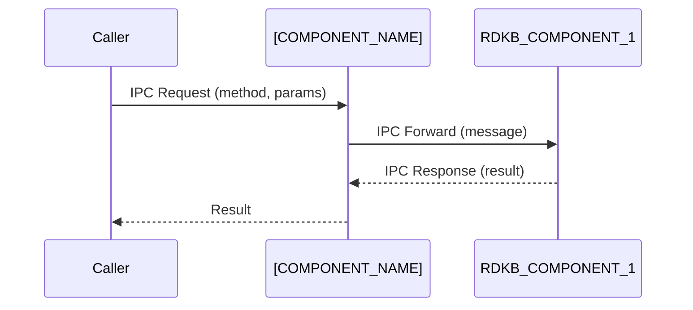

# [COMPONENT_NAME] Documentation

[Describe what the component does and why it exists in RDK-B stack in no more than 5-6 sentences. Explain how it fits into the overall RDK‑B platform, including upstream/downstream interactions. Add a C4 System Context Diagram to explain how this fits into whole system architecture architecture]

- **Key Features & Responsibilities**: [List major functions, services provided, and responsibilities. Keep it as a bullet point list. Keep the main point as BOLD text formatting and then explain in a sentence or maximum two on what that point is about]

## Design

### High‑Level Design Principles

- [Explain the high level design principles in a paragrpah of 5-6 sentences. After that, describe guiding principles such as modularity, scalability, reliability, security, and maintainability as applicable. Add two sentences at max for each of these]
- [Discuss how design choices support these principles.]
- [Define clear boundaries between this component and others.]
- [Identify responsibilities for each boundary (e.g., data persistence, interface management, IPC).]

### C4 Container Diagram

```mermaid
graph TD
    subgraph Runtime ["[CONTAINER_RUNTIME] [VERSION]"]
        subgraph [COMPONENT_NAME]Container ["[COMPONENT_NAME] Container"]
            ModuleA[Module A]
"Purpose"
            ModuleB[Module B]
"Purpose"
        end
        subgraph Database ["[DATABASE_TYPE] [VERSION]"]
            DB[(Database)]
        end
    end
    ModuleA -->|API Call| ModuleB
    ModuleB -->|Read/Write| DB
```

### Design Explanation & Request Flow

- **Request Flow Sequence**: [Describe the most critical flow supported by the component. Use sequence diagrams if helpful.]

### Threading Model (if applicable)

- [Explain how concurrency is handled, including thread pools, event loops, or asynchronous paradigms. If it is a single threaded model, mention it is a single threaded application. If worker threads are created and closed on demand, call out that separately. If it is multi threaded model, mention what each threads does in a bullet pointed list]

## Internal Modules

[Explain in simple terms what each module within the component is expected to do. If any of those modules are receiveing data from outside, call that out separately]

| Module/Class | Description | Key Files |
|-------------|------------|-----------|
| [MODULE_1] | [Brief description of module’s role] | `[file1.c]`, `[file2.h]` |
| [MODULE_2] | [Brief description of module’s role] | `[file3.cpp]` |

[Create a simple  mermaid based module breakdown diagram explaining the different sub modules in this component]

```mermaid
flowchart TD
    subgraph [COMPONENT_NAME]
        Mod1([MODULE_1])
        Mod2([MODULE_2])
        Mod3([MODULE_3])
    end
    Mod1 --> Mod2
    Mod2 --> Mod3
```

## Interaction with Other Middleware Components

[Explain in simple terms what is the interaction with each external module expected to do, for e.g. like data model calls or telemetry event postings]

```mermaid
flowchart TD
    [COMPONENT_NAME] -->|DBus| [RDKB_COMPONENT_1]
    [COMPONENT_NAME] -->|HTTP POST /upload| [RDKB_COMPONENT_2]
```

| Component | Purpose of Interaction | Protocols/Mechanisms |
|-----------|-----------------------|----------------------|
| [RDKB_COMPONENT_1] | [Reason for communication] | [e.g., DBus, HTTP, gRPC] |
| [RDKB_COMPONENT_2] | [Reason for communication] | [e.g., Sockets, Shared Memory] |

[Explain in simple terms what are the events posted or broadcasted or published by this component and a possible description on what is the event and when is it published]

| Event | Purpose of Event | Reason for trigger |
|-----------|-----------------------|----------------------|
| [Event_1] | [Reason for trigger] | [Reason for trigger e.g. completed initialization, detected new wifi device connected] |
| [Event_2] | [Reason for trigger] | [Reason for trigger e.g. completed initialization, detected new wifi device connected] |

## Interaction with Other Layers

[Describe how the component interacts with HAL, platform‑specific layers, or external services. Mention abstraction and layering.]

| Layer/Service | Interaction Description | Mechanism |
|---------------|-------------------------|----------|
| HAL          | [Description]           | [DBus, API call] |
| Platform     | [Description]           | [Sockets, shared memory] |
| External     | [Description]           | [Protocol] |

[Create a detailed layered architecture view that will help to show where this component belongs to in its layer, as well as how it interacts with other layers in software stack]

```mermaid
graph TD
    HAL[(HAL Layer)] --> [COMPONENT_NAME]
    [COMPONENT_NAME] --> Platform[(Platform Layer)]
    Platform --> External[(External Service)]
```

## IPC Mechanism

| Type of IPC | Message Format | Mechanism |
|---------------|-------------------------|----------|
| [e.g., DBus, message queues, Unix sockets, shared memory]          | [Describe the structure, encoding (JSON, Protobuf, custom binary), and key fields]         | [e.g.,DBus, API call,Sockets, shared memory,Protocol] |
|      |            |  |

[Create a detailed IPC Flow Diagram that will help to show how the interaction between components]



## TR‑181 Data Models

- **Implemented Parameters**: [List TR‑181 parameters implemented by this component. Include descriptions and default values.]
- **Parameter Registration**: [Explain how parameters are registered and accessed (e.g., via RBus, DBus).]
- **Custom Extensions**: [Detail in a bullet pointed list on any custom TR‑181 objects or parameters.Give one sentence each on what is the custom extension about]

[Include all the parameters that are part of the 'Implemented Parameters' section given above]

| Parameter | Description | Access (R/W) | Default | Notes |
|-----------|-------------|-------------|---------|-------|
| `Device.DeviceInfo.Manufacturer` | Manufacturer name | R | "" | Standard |
| `Device.Custom.Namespace.Param` | Custom parameter | R/W | `0` | Custom |

## Implementation Details

- **Key Algorithms or Logic**: [Describe core algorithms, scheduling logic, state machines, or data transformations, and mention the main file/ files where the logic resides.]
- **Error Handling Strategy**: [Explain how errors are detected, logged, and propagated.]
- **Logging & Debugging**: [Describe logging categories, verbosity levels, and debug tools or hooks.]

## Key Configuration Files

[Describe the key configuration files and their respective data]

| Configuration File | Purpose | Key Parameters | Default Values | Override Mechanisms |
|--------------------|---------|---------------|----------------|--------------------|
| `config.ini`       | Main config | `Param1`, `Param2` | `true`, `10` | Environment variables |
| `tr181.xml`        | TR‑181 definitions | `...` | N/A | N/A |