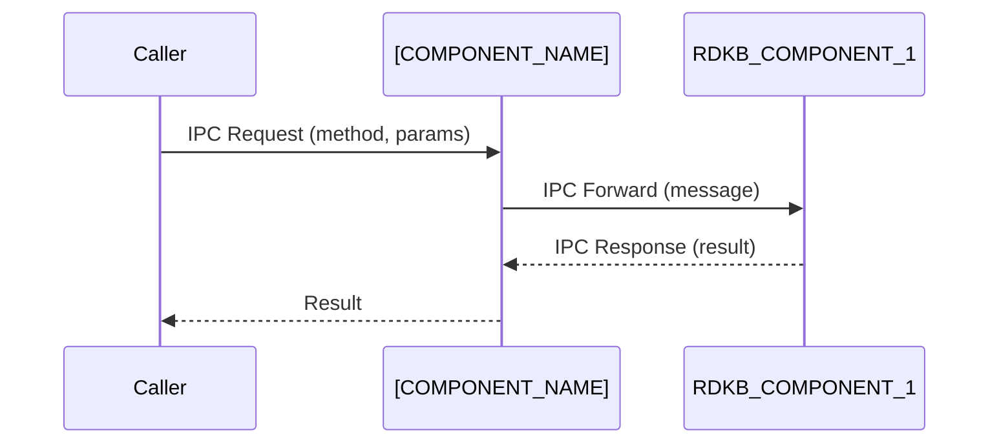

# [COMPONENT_NAME] Documentation

## 1. Overview

- **Purpose in RDK‑B Stack**: [Describe what the component does and why it exists.]
- **Key Features & Responsibilities**: [List major functions, services provided, and responsibilities.]
- **Role in Broadband Router Architecture**: [Explain how it fits into the overall RDK‑B platform, including upstream/downstream interactions.]

## 2. Architecture / Design

### 2.1 High‑Level Design Principles

- [Describe guiding principles such as modularity, scalability, reliability, security, and maintainability.]
- [Discuss how design choices support these principles.]

### 2.2 Component Boundaries & Responsibilities

- [Define clear boundaries between this component and others.]
- [Identify responsibilities for each boundary (e.g., data persistence, interface management, IPC).]

### 2.3 Threading Model (if applicable)

- [Explain how concurrency is handled, including thread pools, event loops, or asynchronous paradigms.]

### 2.4 C4 System Context Diagram

```mermaid
graph TD
    %% Replace the nodes below with actual actors and systems
    User[👤 User] -->|Protocol| [COMPONENT_NAME]
    [COMPONENT_NAME] -->|Protocol| ExternalService[📡 External Service]
    subgraph "[COMPONENT_NAME]"
        ComponentCore[🔧 Core Functions]
[[RESPONSIBILITY_1], [RESPONSIBILITY_2]]
    end
```

### 2.5 C4 Container Diagram

```mermaid
graph TD
    subgraph Runtime ["[CONTAINER_RUNTIME] [VERSION]"]
        subgraph [COMPONENT_NAME]Container ["[COMPONENT_NAME] Container"]
            ModuleA[Module A]
"Purpose"
            ModuleB[Module B]
"Purpose"
        end
        subgraph Database ["[DATABASE_TYPE] [VERSION]"]
            DB[(Database)]
        end
    end
    ModuleA -->|API Call| ModuleB
    ModuleB -->|Read/Write| DB
```

### 2.6 Design Explanation & Request Flow

- **Request Flow Sequence**: [Describe the most critical flow supported by the component. Use sequence diagrams if helpful.]
- **Technology Stack**: List languages, frameworks, databases, cache, message queues, and other tools with versions.


## 3. Internal Modules

| Module/Class | Description | Key Files |
|-------------|------------|-----------|
| [MODULE_1] | [Brief description of module’s role] | `[file1.c]`, `[file2.h]` |
| [MODULE_2] | [Brief description of module’s role] | `[file3.cpp]` |

### 3.1 Module Breakdown Diagram

```mermaid
flowchart TD
    subgraph [COMPONENT_NAME]
        Mod1([MODULE_1])
        Mod2([MODULE_2])
        Mod3([MODULE_3])
    end
    Mod1 --> Mod2
    Mod2 --> Mod3
```

## 4. Interaction with Other Middleware Components

| Component | Purpose of Interaction | Protocols/Mechanisms |
|-----------|-----------------------|----------------------|
| [RDKB_COMPONENT_1] | [Reason for communication] | [e.g., DBus, HTTP, gRPC] |
| [RDKB_COMPONENT_2] | [Reason for communication] | [e.g., Sockets, Shared Memory] |

### 4.1 Middleware Interaction Diagram

```mermaid
flowchart TD
    [COMPONENT_NAME] -->|DBus| [RDKB_COMPONENT_1]
    [COMPONENT_NAME] -->|HTTP POST /upload| [RDKB_COMPONENT_2]
```

## 5. Interaction with Other Layers

Describe how the component interacts with HAL, platform‑specific layers, or external services. Mention abstraction and layering.

| Layer/Service | Interaction Description | Mechanism |
|---------------|-------------------------|----------|
| HAL          | [Description]           | [DBus, API call] |
| Platform     | [Description]           | [Sockets, shared memory] |
| External     | [Description]           | [Protocol] |

### 5.1 Layered Architecture View

```mermaid
graph TD
    HAL[(HAL Layer)] --> [COMPONENT_NAME]
    [COMPONENT_NAME] --> Platform[(Platform Layer)]
    Platform --> External[(External Service)]
```

## 6. IPC Mechanism

- **Type of IPC**: [e.g., DBus, message queues, Unix sockets, shared memory]
- **Message Format**: [Describe the structure, encoding (JSON, Protobuf, custom binary), and key fields]
- **Flow**: [Describe message flow directions: synchronous vs asynchronous, request/response vs publish/subscribe]

### 6.1 IPC Flow Diagram



## 7. TR‑181 Data Models

- **Implemented Parameters**: [List TR‑181 parameters implemented by this component. Include descriptions and default values.]
- **Parameter Registration**: [Explain how parameters are registered and accessed (e.g., via RBus, DBus).]
- **Custom Extensions**: [Detail any custom TR‑181 objects or parameters.]

### 7.1 TR‑181 Parameter Table

| Parameter | Description | Access (R/W) | Default | Notes |
|-----------|-------------|-------------|---------|-------|
| `Device.DeviceInfo.Manufacturer` | Manufacturer name | R | "" | Standard |
| `Device.Custom.Namespace.Param` | Custom parameter | R/W | `0` | Custom |

## 8. Implementation Details

- **Key Algorithms or Logic**: [Describe core algorithms, scheduling logic, state machines, or data transformations.]
- **Error Handling Strategy**: [Explain how errors are detected, logged, and propagated.]
- **Logging & Debugging**: [Describe logging categories, verbosity levels, and debug tools or hooks.]

## 9. Key Configuration Files

| Configuration File | Purpose | Key Parameters | Default Values | Override Mechanisms |
|--------------------|---------|---------------|----------------|--------------------|
| `config.ini`       | Main config | `Param1`, `Param2` | `true`, `10` | Environment variables |
| `tr181.xml`        | TR‑181 definitions | `...` | N/A | N/A |

## 10. API Endpoints (if applicable)

| Method | Endpoint | Description | Auth | Returns |
|--------|----------|-------------|------|---------|
| GET | `/status` | Returns health and status | None | JSON |
| POST | `/config` | Updates configuration | Token | Success/failure |

## 11. Deployment & Runtime Environment

- **Container Runtime**: [Docker, Podman, etc.]
- **Orchestration**: [Systemd, Kubernetes, etc.]
- **Resource Requirements**: [CPU, memory, disk storage]
- **Supported Platforms**: [Hardware or firmware versions]
- **Startup Parameters**: [Command‑line arguments, environment variables]

## 12. Monitoring & Security

- **Monitoring**: [Metrics collected, logging targets, alert thresholds]
- **Authentication & Authorization**: [Mechanisms used, supported encryption, key management]
- **Auditing & Compliance**: [Any compliance requirements like GDPR, HIPAA]

## 13. Validation & Review Checklist

- [ ] **Deployment Accuracy**: Diagrams match actual container/process deployment.
- [ ] **Communication Specificity**: Protocols and directions are correctly labeled.
- [ ] **Scaling Representation**: Diagrams show what scales together vs independently.
- [ ] **Technology Versions**: Actual versions are documented.
- [ ] **Implementation Details**: Filenames, data formats, and logic are included.
- [ ] **Visual Hierarchy**: Colors and shapes consistently represent component types.
- [ ] **Protocol Labels**: Connection labels are descriptive and free of line breaks.
- [ ] **Mermaid Syntax**: Diagrams render without errors (use proper identifiers and quoting).
- [ ] **TR‑181 Coverage**: All relevant TR‑181 parameters are documented.
- [ ] **Code Accuracy**: Configuration keys, module names, and function calls are correct.

## 14. Conclusion & Next Steps

Summarize the component’s role and its importance within RDK‑B. Describe any planned changes or future enhancements. Provide references to related documents, code repositories, and support channels.

---

*This template combines high‑level architectural context with deep technical details for RDK‑B components. It serves as a single source of truth for developers, architects, operators, and business stakeholders alike.*
