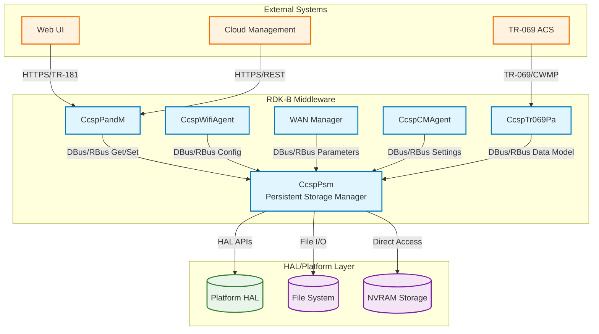
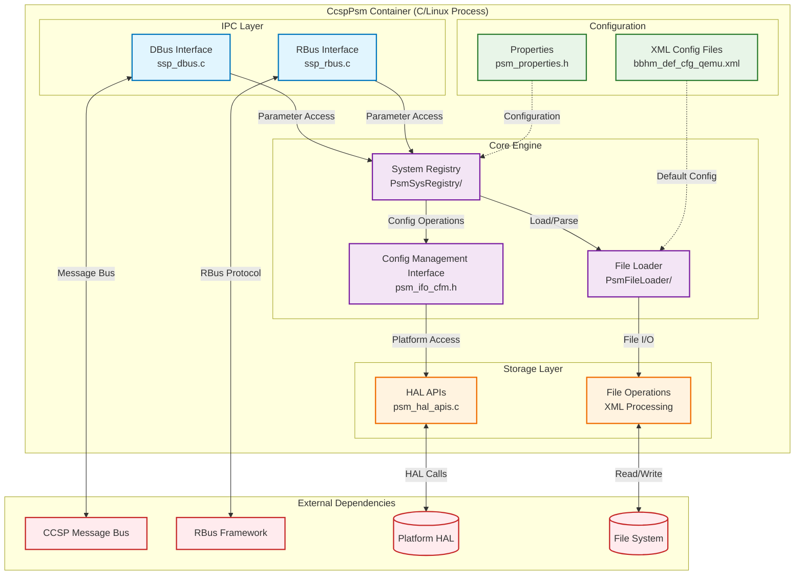
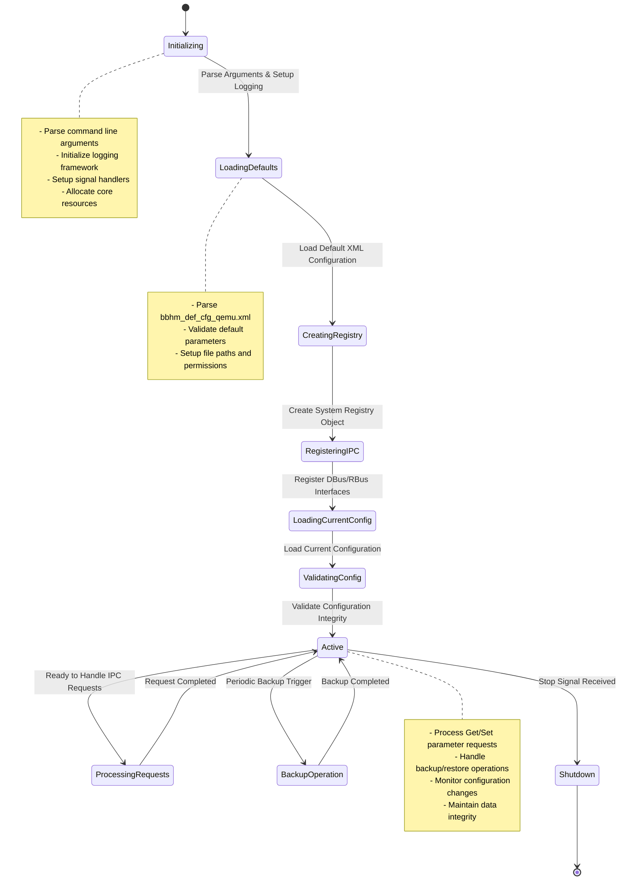
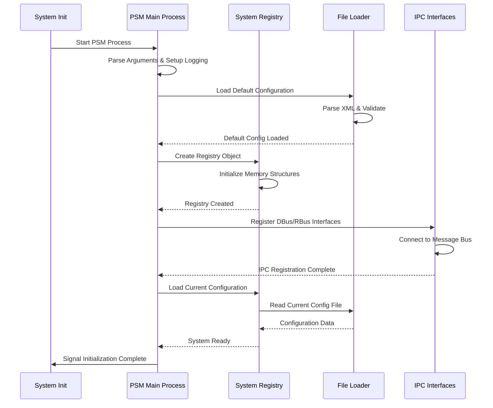
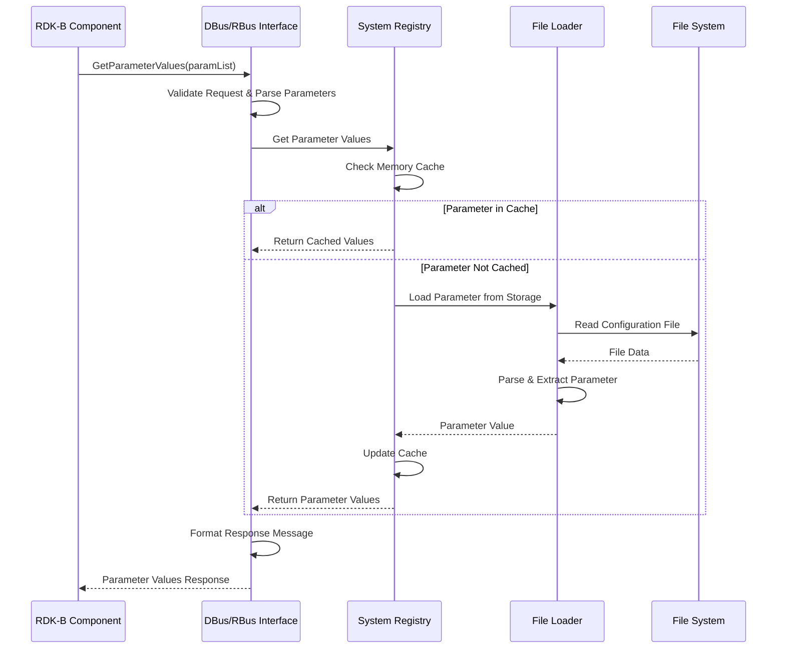
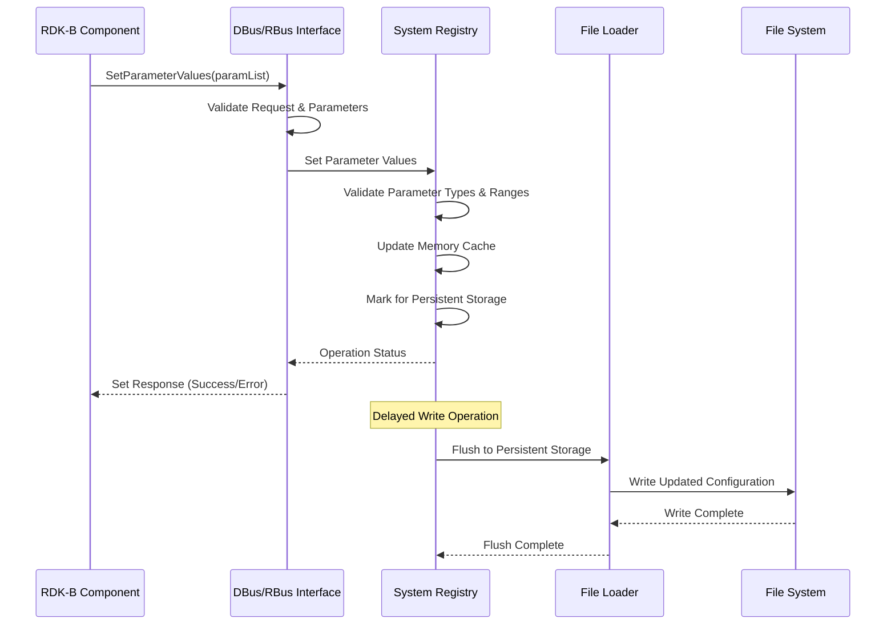
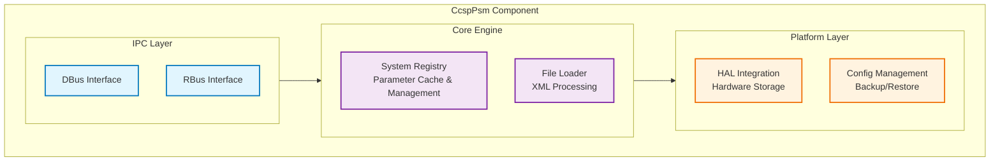
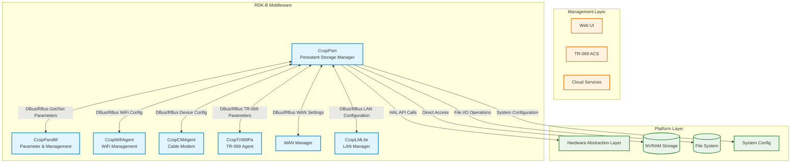
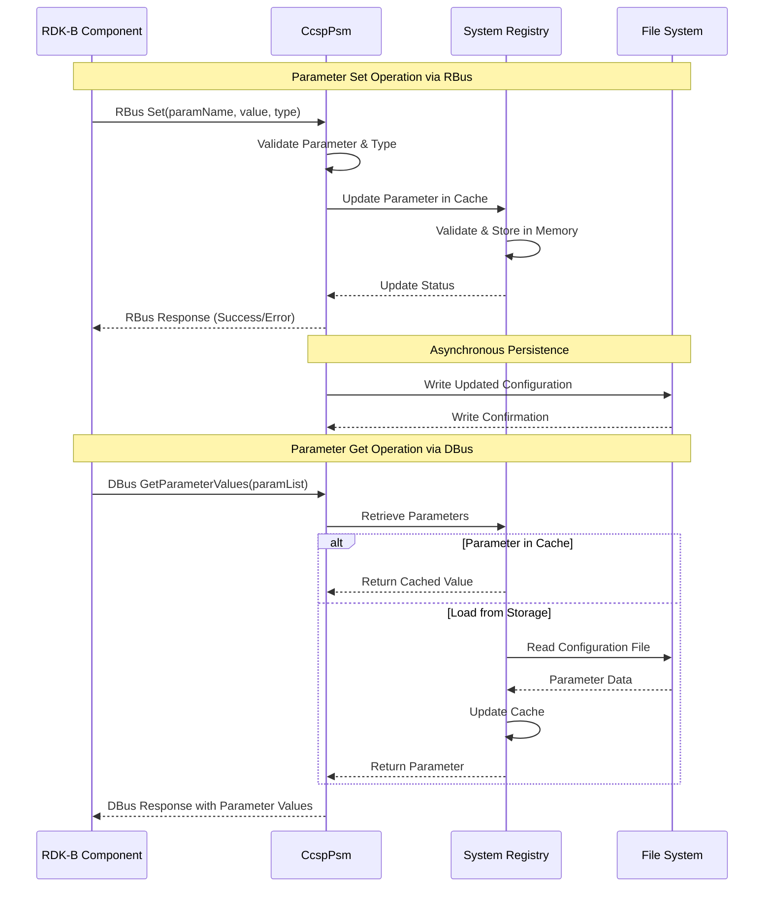

# CcspPsm (Persistent Storage Manager) Documentation

CcspPsm is the RDK-B middleware component that provides persistent configuration storage and retrieval services for the entire CCSP  ecosystem. As the central repository for device configuration data, it ensures configuration persistence across device reboots and provides structured access to configuration parameters through both DBus and RBus interfaces. The component serves as the backbone for configuration management, enabling other RDK-B components to store, retrieve, and manage persistent settings in a centralized, reliable manner.

The Persistent Storage Manager acts as a bridge between volatile runtime configurations and non-volatile storage, implementing sophisticated backup and recovery mechanisms to ensure data integrity. It supports XML-based configuration files with compression, provides real-time configuration access through standardized IPC mechanisms, and maintains compatibility with TR-181 data model specifications.



**Key Features & Responsibilities**: 

- **Configuration Persistence**: Provides reliable storage and retrieval of device configuration parameters with atomic write operations and data integrity validation
- **Multi-format Support**: Handles various data types including strings, integers, booleans, base64, and complex nested structures with automatic type conversion
- **Backup & Recovery**: Implements sophisticated backup mechanisms with multiple configuration file versions (default, current, backup, temporary) and rollback capabilities
- **IPC Integration**: Exposes configuration services through both DBus and RBus interfaces enabling seamless integration with other RDK-B middleware components
- **XML Processing**: Manages XML-based configuration files with compression support and efficient parsing for large configuration datasets
- **Platform Abstraction**: Provides hardware abstraction layer integration for platform-specific persistent storage access and NVRAM operations

## Design

The CcspPsm component implements a layered architecture designed around reliability, performance, and extensibility principles. The core design follows a modular approach with clear separation between file operations, system registry management, and IPC communication layers. The architecture ensures data consistency through atomic operations, maintains backward compatibility with legacy CCSP interfaces, and provides robust error handling with automatic recovery mechanisms.

The component's design emphasizes fail-safe operations where configuration integrity is paramount. Multiple configuration file versions are maintained simultaneously, enabling instant rollback capabilities during failed updates. The system registry acts as an in-memory cache with lazy loading and intelligent flushing strategies to optimize performance while ensuring data persistence. The dual IPC support (DBus and RBus) ensures compatibility across different RDK-B deployments and migration scenarios.

Configuration data flows through a carefully orchestrated pipeline: incoming requests are validated, cached in the system registry, batched for efficiency, and periodically flushed to persistent storage. The design incorporates platform-specific HAL integration for low-level storage operations while maintaining a consistent high-level API. Error detection, logging, and recovery mechanisms are integrated at every layer to ensure system resilience and debugging capabilities.



### Prerequisites and Dependencies

**MUST Requirements:**
- **CCSP Common Library**: Required for base CCSP framework functionality, message bus integration, and common utility functions
- **DBus Message Bus**: Essential for inter-component communication with other RDK-B middleware components
- **RBus Framework**: Required for modern RBus-based IPC communication and event handling
- **File System Access**: Writable persistent storage for configuration files (typically `/nvram/` or `/opt/`)
- **libxml2**: XML parsing and generation library for configuration file processing
- **zlib**: Compression library for XML configuration file compression/decompression

**SHOULD Requirements:**
- **systemd Integration**: For proper service lifecycle management and dependency ordering
- **Platform HAL**: Enhanced platform-specific storage access and NVRAM operations
- **Security Libraries**: SafeC and secure_wrapper for memory-safe operations
- **Logging Framework**: RDK Logger integration for centralized logging and debugging

**Dependent Components:**
- **CcspPandM**: Depends on PSM for TR-181 parameter storage and device configuration management
- **CcspWifiAgent**: Requires PSM for WiFi configuration persistence across reboots
- **CcspTr069Pa**: Uses PSM for TR-069 parameter storage and ACS configuration data
- **CcspCMAgent**: Depends on PSM for cable modem configuration and statistics persistence
- **WAN Manager**: Relies on PSM for WAN interface configuration and connection profiles

**Threading Model**

- **Threading Architecture**: Single-threaded with event-driven architecture
- **Main Thread**: Handles all IPC requests, file operations, and configuration management through an event loop mechanism. The single-threaded design eliminates synchronization complexity while ensuring atomic configuration operations
- **Synchronization**: Uses semaphores for process initialization synchronization and file locking mechanisms for concurrent access protection
- **Event Processing**: Asynchronous event handling for DBus/RBus messages with queued request processing to maintain responsiveness

The single-threaded design is intentional to avoid race conditions in configuration management and ensure data consistency. All operations are processed sequentially through the main event loop, with blocking operations handled efficiently through non-blocking I/O patterns where possible.

## Component State Flow

### Initialization to Active State

The CcspPsm component follows a carefully orchestrated initialization sequence designed to ensure system stability and data integrity. The process begins with basic resource allocation, progresses through configuration loading and validation, establishes IPC connections, and finally enters an active state ready to serve configuration requests. Each phase includes comprehensive error checking and rollback capabilities to handle initialization failures gracefully.



### Runtime State Changes and Context Switching

During normal operation, CcspPsm handles various runtime state transitions triggered by external events, configuration changes, and system maintenance operations. The component maintains configuration consistency while supporting dynamic updates, backup operations, and error recovery scenarios.

**State Change Triggers:**
- **Configuration Updates**: Parameter set operations trigger immediate in-memory updates with delayed persistent storage to optimize performance
- **Backup Operations**: Timer-based automatic backups and explicit backup requests maintain multiple configuration file versions
- **Error Recovery**: File corruption detection triggers automatic rollback to previous valid configuration versions
- **IPC Connection Changes**: DBus/RBus connection events trigger interface re-registration and service availability updates

**Context Switching Scenarios:**
- **Configuration Validation**: Switch between permissive and strict validation modes based on parameter criticality and system state
- **Storage Backend Selection**: Dynamic selection between file system and NVRAM storage based on parameter persistence requirements
- **IPC Protocol Selection**: Automatic fallback between RBus and DBus based on component compatibility and availability

## Call Flow

### Primary Call Flows

**Initialization Call Flow:**



**Parameter Get Operation Call Flow:**



**Parameter Set Operation Call Flow:**



## TR‑181 Data Models

### Supported TR-181 Parameters

CcspPsm acts as the storage backend for TR-181 parameters rather than implementing specific data model objects directly. It provides the persistent storage infrastructure that other RDK-B components use to store their TR-181 parameter values. The component supports the complete range of TR-181 data types and maintains parameter metadata including validation rules, default values, and access permissions.

#### Object Hierarchy

```
Device.
└── [All TR-181 Objects Stored by Other Components]
    ├── WiFi.*                    (Stored by CcspWifiAgent)
    ├── DeviceInfo.*              (Stored by CcspPandM)
    ├── ManagementServer.*        (Stored by CcspTr069Pa)
    ├── GatewayInfo.*             (Stored by CcspCMAgent)
    └── Custom Extensions.*       (Various Components)
```

#### Parameter Definitions

**Core PSM Management Parameters:**

| Parameter Path | Data Type | Access | Default Value | Description | BBF Compliance |
|----------------|-----------|--------|---------------|-------------|----------------|
| Internal PSM Parameters | | | | PSM uses internal parameter naming conventions | |
| `eRT.com.cisco.spvtg.ccsp.*` | various | R/W | varies | Internal CCSP component parameters with subsystem prefixes | Custom Extension |
| `Device.DeviceInfo.X_RDKCENTRAL-COM_*` | various | R/W | varies | RDK Central custom extensions for device information | Custom Extension |
| `Device.X_RDK_*` | various | R/W | varies | RDK-specific parameter extensions beyond BBF specification | Custom Extension |

**Custom Extensions:**

- **Subsystem Prefixing**: PSM uses subsystem prefixes (eRT, eMG, etc.) to organize parameters by target platform and component responsibility
- **Platform-Specific Parameters**: Custom parameters for hardware-specific configurations, vendor extensions, and platform optimization settings
- **RDK Extensions**: RDK-specific TR-181 extensions for features not covered in standard BBF specifications

### Parameter Registration and Access

- **Implemented Parameters**: PSM stores parameters for all RDK-B components but does not directly implement TR-181 objects. Instead, it provides storage services for components that do implement specific TR-181 branches
- **Parameter Registration**: Components register their parameters with PSM through DBus/RBus interfaces. PSM handles the storage, retrieval, and persistence of these parameter values
- **Access Mechanism**: Other components access stored parameters via `GetParameterValues` and `SetParameterValues` operations through DBus or RBus interfaces
- **Validation Rules**: PSM enforces data type validation, range checking, and access permissions as configured by the parameter-owning components

## Internal Modules

The CcspPsm component is organized into distinct modules that handle specific aspects of persistent storage management. Each module has clearly defined responsibilities and interfaces to ensure maintainable and scalable architecture.

| Module/Class | Description | Key Files |
|-------------|------------|-----------|
| **System Registry** | Core configuration management engine that maintains in-memory parameter cache, handles persistence operations, and manages configuration validation | `psm_sysro_base.c`, `psm_sysro_operation.c`, `psm_sysro_interface.c` |
| **File Loader** | XML configuration file parser and generator responsible for reading/writing compressed XML files and handling multiple configuration versions | `psm_flo_base.c`, `psm_flo_parse.c`, `psm_flo_operation.c` |
| **IPC Interfaces** | Dual communication layer providing both DBus and RBus protocol support for component integration | `ssp_dbus.c`, `ssp_rbus.c` |
| **HAL Integration** | Platform abstraction layer for hardware-specific storage operations and NVRAM access | `psm_hal_apis.c`, `psm_hal_apis.h` |
| **Configuration Management** | Interface layer for backup, restore, and configuration file management operations | `ssp_cfmif.c`, `psm_ifo_cfm.h` |



## Component Interactions

### Middleware Components & System Layers

CcspPsm serves as the central configuration storage hub for the entire RDK-B middleware ecosystem. It maintains persistent storage relationships with virtually all CCSP components, providing them with reliable configuration persistence services. The component abstracts the complexity of file system operations, backup management, and data integrity from client components while ensuring consistent data access patterns across the platform.



**Component Interactions:**

| Component/Layer | Purpose of Interaction | Protocols/Mechanisms |
|-----------------|------------------------|----------------------|
| **Middleware Components** |
| CcspPandM | Device parameter management and TR-181 object storage | DBus/RBus Get/SetParameterValues |
| CcspWifiAgent | WiFi configuration persistence and radio settings | DBus/RBus parameter operations |
| CcspTr069Pa | TR-069 parameter storage and ACS configuration data | DBus/RBus parameter management |
| CcspCMAgent | Cable modem configuration and statistics storage | DBus/RBus device parameter access |
| WAN Manager | WAN interface configuration and connection profiles | DBus/RBus configuration persistence |
| **System Layers** |
| Hardware Abstraction Layer | Platform-specific storage operations and NVRAM access | HAL API function calls |
| File System | Configuration file storage, backup, and retrieval | Standard file I/O operations |
| System Config | Integration with platform configuration utilities | Syscfg library interface |

**Published Events:**

The CcspPsm publishes several key events that other components can subscribe to for coordination and monitoring purposes:

| Event | Purpose of Event | Reason for trigger |
|-------|------------------|-------------------|
| Configuration Loaded | Notify components that persistent configuration is available | Completed startup initialization and configuration file parsing |
| Parameter Changed | Broadcast parameter value changes to interested subscribers | External parameter modification through Set operations |
| Backup Completed | Signal successful configuration backup operation | Automatic or manual backup operation completion |
| Storage Error | Alert system about persistent storage failures | File system errors, corruption detection, or write failures |

## IPC Mechanism

CcspPsm implements a dual IPC architecture supporting both legacy DBus and modern RBus communication protocols. This design ensures backward compatibility while enabling migration to more efficient RBus-based communication. The component automatically detects available protocols and provides seamless parameter access regardless of the client's communication preference.

| Type of IPC | Message Format | Mechanism |
|---------------|-------------------------|----------|
| **DBus** | XML-based message serialization with CCSP-specific parameter structures including parameterValStruct_t and parameterInfoStruct_t | CCSP Message Bus with GetParameterValues/SetParameterValues method calls |
| **RBus** | Binary message format with efficient serialization supporting native data types and automatic type conversion | RBus framework with Get/Set operations and event subscription support |
| **Configuration Interface** | Internal C function calls with direct memory access for configuration management operations | Direct API calls for backup, restore, and configuration validation |



## Implementation Details

### Major HAL APIs Integration

CcspPsm integrates with the Hardware Abstraction Layer to provide platform-specific storage capabilities and access to non-volatile memory resources. The HAL integration enables the component to work across different hardware platforms while maintaining consistent high-level interfaces.

**Core HAL APIs:**

| HAL API | Purpose | Parameters | Return Values | Implementation File |
|---------|---------|------------|---------------|-------------------|
| `platform_hal_GetDeviceConfigStatus` | Retrieve platform-specific device configuration status and capabilities | `status` (output buffer) | `0` on success, error codes on failure | `psm_hal_apis.c` |
| `platform_hal_SetDeviceConfigParameter` | Set platform-specific configuration parameters in hardware | `paramName`, `paramValue` | `0` on success, error codes on failure | `psm_hal_apis.c` |
| `platform_hal_GetPlatformConfiguration` | Retrieve platform-specific persistent configuration parameters | `configArray` (output), `count` (array size) | `0` on success, error codes on failure | `psm_hal_apis.c` |
| `platform_hal_DocsisParamsDBInit` | Initialize platform-specific DOCSIS parameter database | None | `0` on success, error codes on failure | `psm_hal_apis.c` |

### Key Implementation Logic

- **Configuration State Machine**: The core state machine is implemented in `psm_sysro_states.c` with state transition handlers in `psm_sysro_control.c`. The system maintains distinct states for initialization, active operation, backup operations, and shutdown sequences
  
- **XML Processing Engine**: Configuration file parsing and generation logic resides in `psm_flo_parse.c` with support for compressed XML files, parameter validation, and multiple file version management

- **Memory Management**: The component uses a sophisticated caching strategy implemented in `psm_sysro_storage.c` with lazy loading, intelligent cache invalidation, and memory optimization for large configuration datasets

- **Error Handling Strategy**: Comprehensive error detection and recovery mechanisms throughout the codebase with automatic fallback to backup configurations, detailed error logging, and graceful degradation capabilities
  - Configuration file corruption detection with automatic rollback
  - IPC connection failure handling with automatic reconnection
  - Memory allocation failure recovery with resource cleanup

- **Logging & Debugging**: Multi-level logging system with component-specific trace categories, parameter operation tracing, and debug hooks for troubleshooting configuration issues
  - Parameter access logging with caller identification
  - Configuration file operation tracing
  - Performance monitoring for large parameter operations

## Key Configuration Files

The CcspPsm component relies on several critical configuration files that define default parameters, runtime behavior, and platform-specific settings. These files are essential for proper component initialization and operation.

| Configuration File | Purpose | Key Parameters | Default Values | Override Mechanisms |
|--------------------|---------|---------------|----------------|--------------------|
| `bbhm_def_cfg_qemu.xml` | Default system configuration with pre-configured TR-181 parameters | `Device.WiFi.*`, `Device.DeviceInfo.*`, `Device.ManagementServer.*` | Platform-specific defaults | Platform-specific XML files |
| `psm_cur_cfg.xml.gz` | Current active configuration (compressed) | All active parameter values | Runtime-modified values | Direct parameter Set operations |
| `psm_bak_cfg.xml.gz` | Backup configuration for rollback | Previous stable configuration | Last known good config | Automatic backup triggers |
| `psm_tmp_cfg.xml.gz` | Temporary configuration during updates | Staging area for configuration changes | Transient during operations | Automatic cleanup |

The configuration files use a hierarchical XML structure with parameter records containing name, type, and value attributes. The compression mechanism reduces storage footprint while maintaining fast access through intelligent caching strategies.