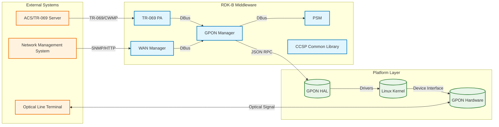
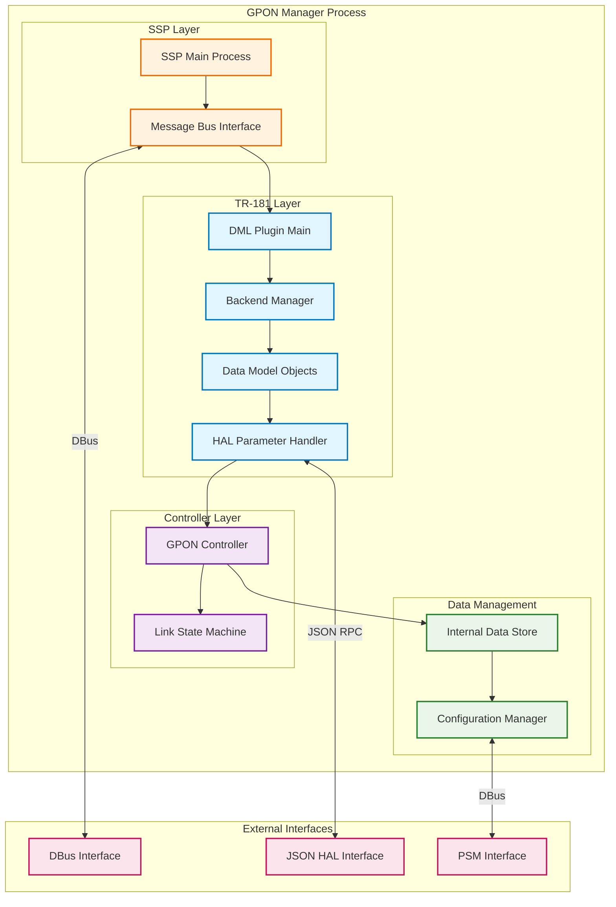
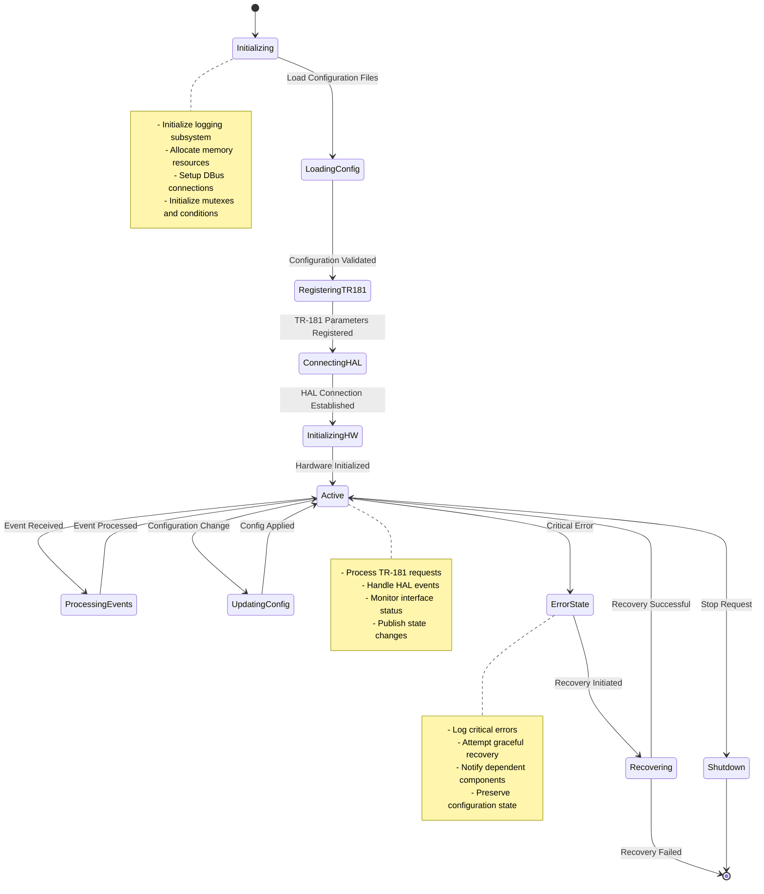
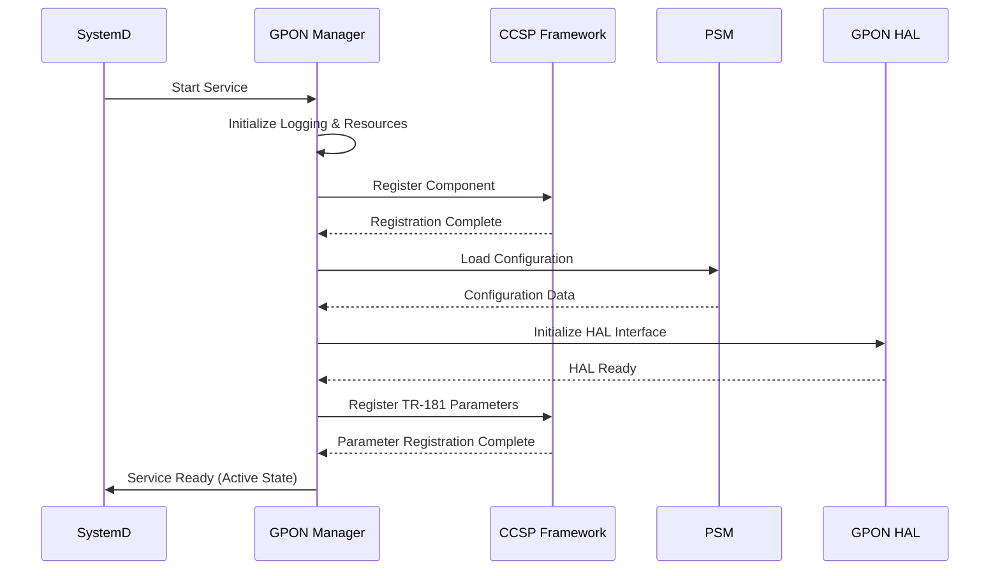
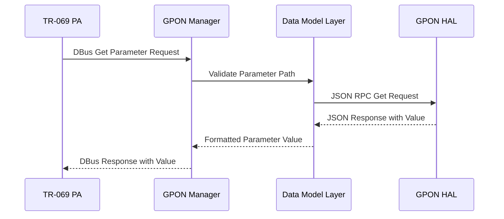
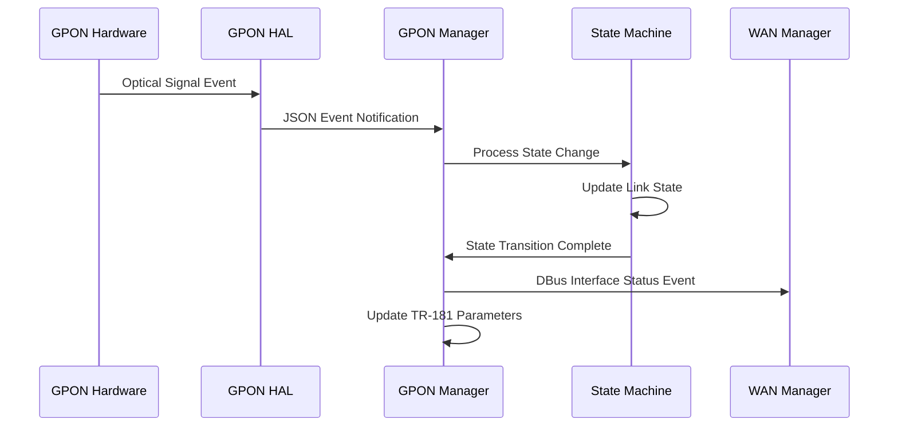
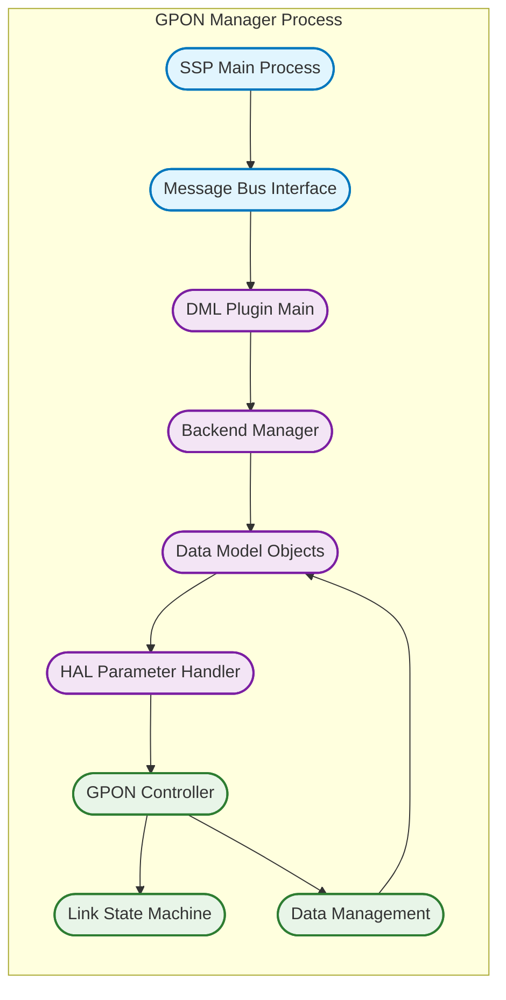
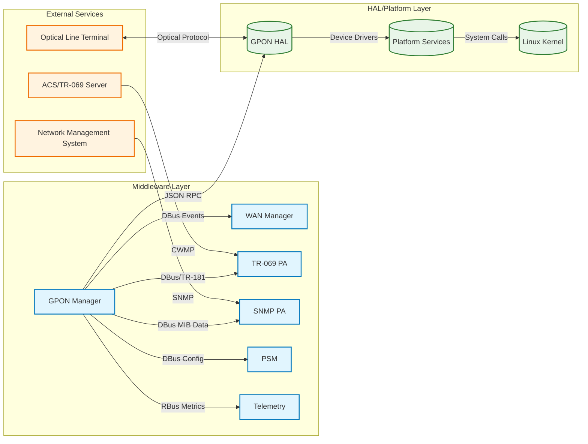
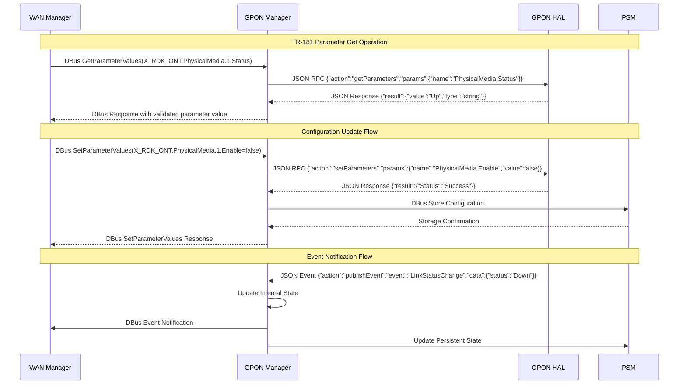

# GPON Manager Documentation

GPON Manager is the RDK-B middleware component responsible for managing and controlling GPON interfaces in RDK-B enabled devices. It serves as the primary orchestrator for GPON operations, providing standardized management and monitoring capabilities for fiber optic network connections. The component acts as a bridge between the RDK-B middleware stack and the underlying GPON hardware abstraction layer (HAL), enabling unified management of PON technologies including GPON, XG-PON, NG-PON2, and XGS-PON.

The GPON Manager provides essential services to the RDK-B device ecosystem by managing physical media interfaces, optical network termination (ONT) operations, and PON-specific protocols. It enables service providers to remotely configure, monitor, and troubleshoot GPON connections while ensuring compliance with ITU-T G.984 and related PON standards.



**Key Features & Responsibilities**: 

- **GPON Interface Management**: Manages physical GPON interfaces including status monitoring, configuration, and operational state control for multiple PON technologies (GPON, XG-PON, NG-PON2, XGS-PON)
- **TR-181 Data Model Implementation**: Implements comprehensive TR-181 data models for X_RDK_ONT objects including PhysicalMedia, GTC, PLOAM, OMCI, GEM, and VEIP parameters with full read/write access control
- **HAL Abstraction & Integration**: Provides JSON-based HAL interface abstraction for vendor-specific GPON implementations, enabling standardized communication between middleware and hardware layers
- **State Machine Management**: Orchestrates GPON link state machines for connection establishment, maintenance, and recovery operations with event-driven state transitions
- **Performance Monitoring**: Collects and reports GPON performance metrics, optical power levels, and link quality statistics for network optimization and troubleshooting
- **Event-Driven Architecture**: Publishes real-time events for GPON state changes, alarms, and performance thresholds to enable responsive network management

## Design

The GPON Manager follows a modular, event-driven architecture designed to provide scalable and maintainable GPON management capabilities. The design emphasizes separation of concerns with distinct layers for TR-181 data model handling, controller logic, and HAL abstraction. The component implements a publisher-subscriber pattern for real-time event handling and maintains persistent state through the PSM component. The architecture supports multiple concurrent GPON interfaces while ensuring thread-safe operations and efficient resource utilization.

The design integrates northbound interfaces through DBus messaging for TR-069 PA and WAN Manager interactions, enabling seamless integration with RDK-B middleware components. Southbound integration utilizes a JSON-based RPC mechanism for HAL communication, providing vendor-agnostic hardware abstraction. The component implements comprehensive data persistence through PSM integration for configuration storage and retrieval, ensuring state consistency across system reboots and providing rapid recovery capabilities.

The IPC architecture leverages DBus for middleware communication and JSON RPC for HAL interactions, supporting both synchronous and asynchronous messaging patterns. Event publishing utilizes RBus where supported, falling back to DBus for broader compatibility. The design includes robust error handling with graceful degradation, comprehensive logging for debugging, and configurable telemetry reporting for operational visibility.



### Prerequisites and Dependencies

**MUST Requirements:**
- RDK-B Common Component Software Platform (CCSP) framework for DBus messaging and component lifecycle management
- GPON HAL implementation supporting JSON RPC schema version 0.0.1 or compatible for hardware abstraction
- Parameter Storage Manager (PSM) for persistent configuration storage and retrieval capabilities
- Linux kernel with GPON device driver support and appropriate device node access permissions
- SystemD service management for component lifecycle and dependency resolution

**SHOULD Requirements:**
- RBus messaging framework for enhanced event publishing and subscription capabilities
- WAN Manager component for integrated interface management and unified WAN orchestration
- TR-069 Protocol Adapter for remote management and configuration synchronization
- SNMP Protocol Adapter for SNMP-based monitoring and management capabilities
- Telemetry component for performance metrics collection and reporting

**Dependent Components:**
- WAN Manager relies on GPON Manager for GPON interface status, configuration, and event notifications
- TR-069 PA depends on GPON Manager for TR-181 parameter access and modification capabilities
- SNMP PA requires GPON Manager for SNMP MIB data population and trap generation
- System Health Monitor depends on GPON Manager for interface health status and alarm reporting

**Threading Model**

The GPON Manager implements a hybrid threading architecture combining event-driven main thread processing with dedicated worker threads for specific operations. The design ensures thread-safe access to shared resources while maintaining responsive real-time event handling and efficient resource utilization across multiple GPON interfaces.

- **Threading Architecture**: Multi-threaded with event-driven main thread and specialized worker threads
- **Main Thread**: Handles DBus message processing, TR-181 parameter operations, event dispatching, and component lifecycle management including initialization and shutdown sequences
- **Worker Threads** (created on demand):
  - **HAL Communication Thread**: Manages JSON RPC communication with GPON HAL, handles asynchronous responses, and processes hardware events with configurable timeout handling
  - **State Machine Thread**: Executes GPON link state machine transitions, processes optical link events, and manages connection establishment and recovery procedures
  - **Telemetry Thread**: Collects performance metrics, processes statistical data, and publishes telemetry events at configurable intervals
- **Synchronization**: Utilizes pthread mutexes for shared data protection, condition variables for thread coordination, and atomic operations for performance counters

## Component State Flow

### Initialization to Active State

The GPON Manager follows a structured initialization sequence progressing through distinct states from component startup to full operational readiness. The initialization process ensures all dependencies are established, configuration is loaded, and hardware interfaces are properly initialized before entering active service mode.



### Runtime State Changes and Context Switching

During normal operation, the GPON Manager responds to various triggers that initiate state changes affecting GPON interface management, configuration updates, and operational mode transitions. These state changes ensure the component adapts to network conditions, hardware events, and administrative commands while maintaining service continuity.

**State Change Triggers:**
- **Hardware Events**: Optical signal detection, loss of signal (LOS), loss of frame (LOF), and transceiver insertion/removal events trigger interface state updates and recovery procedures
- **Configuration Updates**: TR-181 parameter modifications, PSM configuration changes, and administrative enable/disable commands initiate configuration validation and application sequences
- **Network Events**: OLT registration status changes, PLOAM message reception, and OMCI communication events trigger protocol state machine transitions
- **Performance Thresholds**: Optical power level violations, bit error rate thresholds, and performance monitoring alerts trigger alarm generation and notification procedures

**Context Switching Scenarios:**
- **Interface Mode Changes**: Switching between GPON, XG-PON, NG-PON2, and XGS-PON modes requires hardware reconfiguration and state machine reinitialization
- **Redundancy Failover**: Active/standby interface transitions for redundant GPON configurations with seamless service transfer
- **Maintenance Mode**: Transitioning to maintenance mode for firmware updates, calibration procedures, and diagnostic operations while preserving service state

## Call Flow

### Primary Call Flows

**Initialization Call Flow:**



**TR-181 Parameter Get Request Call Flow:**



**GPON Link State Change Event Flow:**



## TR‑181 Data Models

### Supported TR-181 Parameters

The GPON Manager implements comprehensive TR-181 data models following BBF specification guidelines for X_RDK_ONT objects. The implementation provides standardized access to GPON interface parameters, optical network termination settings, and performance monitoring data through a hierarchical object structure that supports dynamic instance creation and management.

#### Object Hierarchy

```
Device.
└── X_RDK_ONT.
    ├── PhysicalMedia.{i}.
    │   ├── Enable (boolean, R/W)
    │   ├── Status (string, R)
    │   ├── Cage (string, R)
    │   ├── ModuleVendor (string, R)
    │   ├── ModuleName (string, R)
    │   ├── PonMode (string, R)
    │   ├── Connector (string, R)
    │   ├── NominalBitRateDownstream (uint32, R)
    │   ├── NominalBitRateUpstream (uint32, R)
    │   └── RedundancyState (string, R)
    ├── Gtc.
    │   ├── Enable (boolean, R/W)
    │   ├── Status (string, R)
    │   ├── BerInterval (uint32, R/W)
    │   └── MissedKeepAliveMessages (uint32, R)
    ├── Ploam.
    │   ├── Enable (boolean, R/W)
    │   ├── Status (string, R)
    │   └── MicReceivedSuccessfully (uint32, R)
    ├── Omci.
    │   ├── Enable (boolean, R/W)
    │   ├── Status (string, R)
    │   └── IgnoreStdOmciFunction (boolean, R/W)
    ├── Gem.{i}.
    │   ├── Enable (boolean, R/W)
    │   ├── Status (string, R)
    │   ├── GemPortId (uint32, R/W)
    │   ├── Direction (string, R/W)
    │   └── TrafficType (string, R/W)
    └── Veip.{i}.
        ├── Enable (boolean, R/W)
        ├── Status (string, R)
        ├── VeipId (uint32, R/W)
        └── AdminState (string, R/W)
```

#### Parameter Definitions

**Core Parameters:**

| Parameter Path | Data Type | Access | Default Value | Description | BBF Compliance |
|----------------|-----------|--------|---------------|-------------|----------------|
| `Device.X_RDK_ONT.PhysicalMedia.{i}.Enable` | boolean | R/W | `true` | Enable or disable the GPON physical media interface. When disabled, the interface is administratively down and does not participate in GPON operations. | Custom Extension |
| `Device.X_RDK_ONT.PhysicalMedia.{i}.Status` | string | R | `"Down"` | Current operational status of the physical media interface. Enumerated values: Up(0), Down(1), Unknown(2), Dormant(3), NotPresent(4), LowerLayerDown(5), Error(6) | Custom Extension |
| `Device.X_RDK_ONT.PhysicalMedia.{i}.Cage` | string | R | `"BoB"` | Type of physical cage housing the optical module. Enumerated values: BoB(0) for Board-on-Board, SFP(1) for Small Form-factor Pluggable | Custom Extension |
| `Device.X_RDK_ONT.PhysicalMedia.{i}.PonMode` | string | R | `"GPON"` | PON technology mode supported by the interface. Enumerated values: GPON(0), XG-PON(1), NG-PON2(2), XGS-PON2(3) | Custom Extension |
| `Device.X_RDK_ONT.PhysicalMedia.{i}.NominalBitRateDownstream` | uint32 | R | `2488320` | Nominal downstream bit rate in kbps supported by the PON interface based on the configured PON mode | Custom Extension |
| `Device.X_RDK_ONT.PhysicalMedia.{i}.NominalBitRateUpstream` | uint32 | R | `1244160` | Nominal upstream bit rate in kbps supported by the PON interface based on the configured PON mode | Custom Extension |
| `Device.X_RDK_ONT.Gtc.Enable` | boolean | R/W | `true` | Enable or disable GPON Transmission Convergence (GTC) layer functionality for frame processing and bandwidth allocation | Custom Extension |
| `Device.X_RDK_ONT.Gtc.Status` | string | R | `"Disabled"` | Current operational status of the GTC layer. Values: Disabled, Enabled, Error indicate the functional state of GTC processing | Custom Extension |
| `Device.X_RDK_ONT.Ploam.Enable` | boolean | R/W | `true` | Enable or disable Physical Layer Operations, Administration and Maintenance (PLOAM) message processing for OLT communication | Custom Extension |
| `Device.X_RDK_ONT.Omci.Enable` | boolean | R/W | `true` | Enable or disable ONT Management and Control Interface (OMCI) for service provisioning and configuration management | Custom Extension |

**Custom Extensions:**

- **X_RDK_ONT Object Tree**: Complete custom extension providing comprehensive GPON management capabilities not defined in standard BBF TR-181 specifications
- **Physical Media Dynamic Table**: Supports multiple GPON interfaces with dynamic instance creation for multi-port ONT devices
- **GEM Port Management**: Custom parameters for GPON Encapsulation Method (GEM) port configuration and traffic management
- **VEIP Interface Control**: Virtual Ethernet Interface Point parameters for Ethernet service mapping and control

### Parameter Registration and Access

- **Implemented Parameters**: The GPON Manager implements over 50 TR-181 parameters across 6 major object categories, providing comprehensive coverage of GPON interface management, protocol control, and performance monitoring capabilities
- **Parameter Registration**: Parameters are registered through the CCSP DML framework using DBus messaging for component discovery and parameter tree publication to enable remote access
- **Access Mechanism**: Other RDK-B components access parameters via DBus method calls with standardized get/set operations, parameter validation, and atomic transaction support for configuration changes
- **Validation Rules**: Parameter values undergo strict validation including range checking for numeric values, enumeration validation for string parameters, and dependency checking for inter-parameter relationships

## Internal Modules

The GPON Manager is structured as a modular component with clear separation of concerns across multiple functional layers. Each module has specific responsibilities and well-defined interfaces, enabling maintainable code organization and efficient resource utilization while supporting concurrent operations across multiple GPON interfaces.

| Module/Class | Description | Key Files |
|-------------|------------|-----------|
| **SSP Main Process** | Core service startup and lifecycle management including initialization, shutdown, and process control | `ssp_main.c`, `ssp_global.h`, `ssp_internal.h` |
| **Message Bus Interface** | DBus communication handler for inter-component messaging and TR-181 parameter access | `ssp_messagebus_interface.c`, `ssp_messagebus_interface.h` |
| **DML Plugin Main** | TR-181 data model plugin entry point and parameter tree registration | `gponmgr_dml_plugin_main.c`, `gponmgr_dml_plugin_main.h` |
| **Backend Manager** | Central coordinator for data model operations and HAL interaction | `gponmgr_dml_backendmgr.c`, `gponmgr_dml_backendmgr.h` |
| **Data Model Objects** | TR-181 object implementations for PhysicalMedia, GTC, PLOAM, OMCI, GEM, and VEIP | `gponmgr_dml_obj.c`, `gponmgr_dml_obj.h` |
| **HAL Parameter Handler** | JSON RPC interface for GPON HAL communication and parameter translation | `gponmgr_dml_hal_param.c`, `gponmgr_dml_hal.c` |
| **GPON Controller** | Main control logic for GPON operations and state management | `gponmgr_controller.c`, `gponmgr_controller.h` |
| **Link State Machine** | State machine engine for GPON link establishment and maintenance | `gponmgr_link_state_machine.c`, `gponmgr_link_state_machine.h` |
| **Data Management** | Internal data structures and caching for GPON interface information | `gponmgr_dml_data.c`, `gponmgr_dml_data.h` |



## Component Interactions

### Middleware Components & System Layers

The GPON Manager integrates with multiple RDK-B middleware components and system layers to provide comprehensive GPON management capabilities. The component serves as a central orchestrator for GPON operations while maintaining standardized interfaces for configuration management, performance monitoring, and event notification across the RDK-B ecosystem.



**Component Interactions:**

| Component/Layer | Purpose of Interaction | Protocols/Mechanisms |
|-----------------|------------------------|----------------------|
| **Middleware Components** |
| WAN Manager | Interface status reporting, configuration coordination, and WAN connection management | DBus events, parameter notifications |
| TR-069 PA | Remote parameter management, configuration updates, and device provisioning | DBus method calls, TR-181 parameter access |
| SNMP PA | SNMP MIB data population, performance counter access, and trap generation | DBus data requests, structured parameter queries |
| PSM | Persistent configuration storage, default parameter values, and configuration recovery | DBus parameter storage/retrieval operations |
| Telemetry | Performance metrics collection, operational statistics, and monitoring data | RBus telemetry events, JSON data structures |
| **System Layers** |
| GPON HAL | Hardware abstraction, vendor-specific operations, and low-level GPON control | JSON RPC over Unix domain sockets |
| Platform Services | System logging, resource management, and service coordination | Standard system APIs, file system operations |
| **External Services** |
| ACS/TR-069 Server | Remote device management, configuration provisioning, and firmware management | CWMP over HTTP/HTTPS via TR-069 PA |
| OLT | GPON protocol communication, optical signal management, and service provisioning | ITU-T G.984 GPON protocols via HAL |

**Published Events:**

The GPON Manager publishes several key events that other components can subscribe to for coordination and monitoring purposes:

| Event | Purpose of Event | Reason for Trigger |
|-------|------------------|-------------------|
| GPON_INTERFACE_STATUS_CHANGE | Interface operational status updates | Physical layer state changes, optical signal detection/loss, administrative enable/disable |
| GPON_LINK_ESTABLISHED | GPON link establishment notification | Successful OLT registration, PLOAM messaging establishment, OMCI communication ready |
| GPON_ALARM_GENERATED | Critical alarm and threshold notifications | Optical power violations, bit error rate thresholds, hardware failures |
| GPON_PERFORMANCE_UPDATE | Performance monitoring data updates | Periodic statistics collection, performance counter updates, quality metrics |

## IPC Mechanism

The GPON Manager implements a hybrid IPC architecture utilizing multiple communication mechanisms optimized for different interaction patterns and performance requirements. The design ensures reliable communication with middleware components while providing efficient hardware abstraction for vendor-specific GPON implementations.

| Type of IPC | Message Format | Mechanism |
|---------------|-------------------------|----------|
| DBus Method Calls | Structured parameter objects with type safety, error codes, and transaction IDs for TR-181 operations | DBus with CCSP framework integration for component discovery and parameter tree management |
| JSON RPC over Unix Sockets | JSON-structured messages conforming to GPON HAL schema v0.0.1 with request/response correlation and event notifications | Unix domain sockets with configurable timeout and retry mechanisms |
| RBus Event Publishing | JSON telemetry objects with timestamp, source identification, and structured performance data | RBus messaging framework for high-performance event distribution |
| Configuration Storage | Key-value pairs with namespace isolation, atomic transactions, and backup/restore capabilities | DBus communication with PSM for persistent storage operations |



## Implementation Details

### Major HAL APIs Integration

The GPON Manager integrates with the GPON HAL through a comprehensive JSON RPC interface that provides vendor-agnostic access to GPON hardware functionality. The HAL integration supports multiple concurrent operations, asynchronous event handling, and robust error recovery mechanisms to ensure reliable hardware abstraction across different vendor implementations.

**Core HAL APIs:**

| HAL API | Purpose | Parameters | Return Values | Implementation File |
|---------|---------|------------|---------------|-------------------|
| `getParameters` | Retrieve GPON hardware parameters and status information | Parameter name, instance identifier, data type specification | JSON object with parameter value, type, and validation status | `gponmgr_dml_hal_param.c` |
| `setParameters` | Configure GPON hardware settings and operational parameters | Parameter name, value, type, validation flags | Success/failure status with error details and rollback information | `gponmgr_dml_hal_param.c` |
| `subscribeEvent` | Register for hardware event notifications and state changes | Event name, notification type, callback configuration | Subscription handle and confirmation status | `gponmgr_dml_hal.c` |
| `publishEvent` | Receive asynchronous hardware events and alarm notifications | Event data, timestamp, severity level, source identification | Event processing acknowledgment | `gponmgr_dml_hal.c` |
| `getSchema` | Retrieve HAL schema version and supported parameter definitions | Schema version request, parameter category filter | Schema file path and version compatibility information | `gponmgr_dml_hal.c` |

### Key Implementation Logic

- **State Machine Engine**: The core state machine implementation provides deterministic GPON link management with configurable timeout handling and automatic recovery procedures
  - Main implementation in `gponmgr_link_state_machine.c` with event-driven state transitions and comprehensive error handling
  - State transition handlers in `gponmgr_controller.c` with validation logic and rollback capabilities for failed operations
  
- **Event Processing**: Hardware events are processed through an asynchronous event queue with priority-based scheduling and guaranteed delivery mechanisms
  - Hardware interrupt handling through HAL event subscription with configurable timeout and retry parameters
  - Event queue management with circular buffer implementation and overflow protection mechanisms
  - Asynchronous event processing with worker thread pool and load balancing for optimal performance

- **Error Handling Strategy**: Comprehensive error detection and recovery mechanisms ensure system stability and service continuity during hardware failures and network disruptions
  - HAL error code mapping with vendor-specific error translation and standardized error reporting
  - Recovery mechanisms for failed transitions including automatic retry with exponential backoff and manual intervention triggers
  - Timeout handling and retry logic with configurable parameters and escalation procedures for persistent failures

- **Logging & Debugging**: Multi-level logging system provides comprehensive visibility into GPON operations with configurable verbosity and filtering capabilities
  - State transition logging with detailed parameter tracking and performance measurement
  - HAL API call tracing with request/response correlation and timing analysis
  - Debug hooks for troubleshooting connectivity issues including packet capture and protocol analysis tools

## Key Configuration Files

The GPON Manager utilizes several configuration files that control component behavior, HAL integration parameters, and TR-181 data model definitions. These files enable flexible deployment across different hardware platforms while maintaining standardized operational interfaces.

| Configuration File | Purpose | Key Parameters | Default Values | Override Mechanisms |
|--------------------|---------|---------------|----------------|--------------------|
| `gpon_manager_conf.json` | Main component configuration for HAL integration and service parameters | `hal_schema_path`, `server_port` | `/etc/rdk/schemas/gpon_hal_schema.json`, `40100` | Environment variables, command line arguments |
| `gpon_manager_wan_unify_conf.json` | WAN Manager integration configuration for unified interface management | `wan_unify_enabled`, `interface_priority` | `true`, `1` | PSM parameter override, runtime configuration |
| `RdkGponManager.xml` | TR-181 data model definitions and parameter specifications | Object hierarchy, parameter types, access permissions, function bindings | See XML specification | Compile-time conditional compilation flags |
| `gpon_hal_schema.json` | HAL interface schema definition and validation rules | Parameter definitions, data types, validation constraints | Version 0.0.1 schema | HAL vendor-specific schema extensions |
| `gpon_wan_unify_hal_schema.json` | Unified WAN HAL schema for integrated WAN management | Extended parameter set, unified operations | Enhanced schema with WAN unification support | WAN Manager configuration integration |