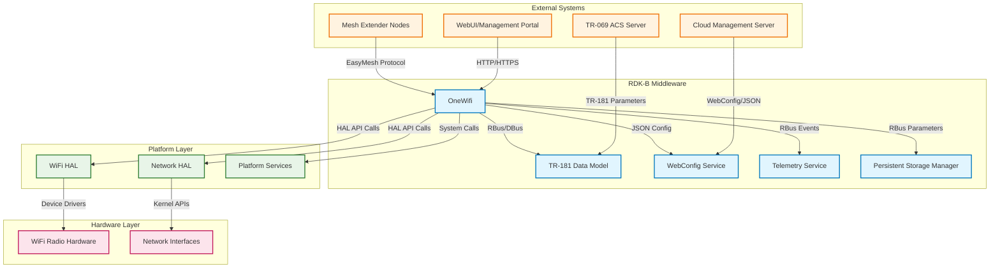
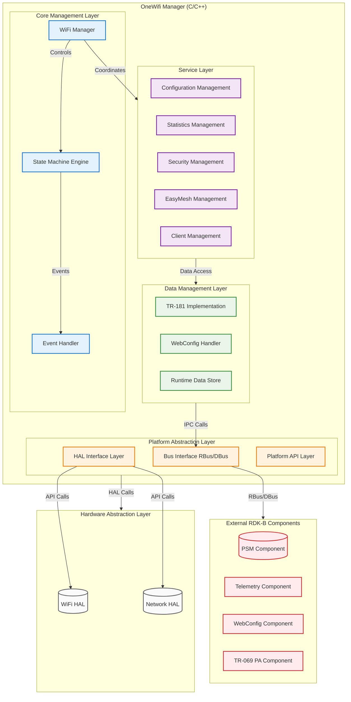
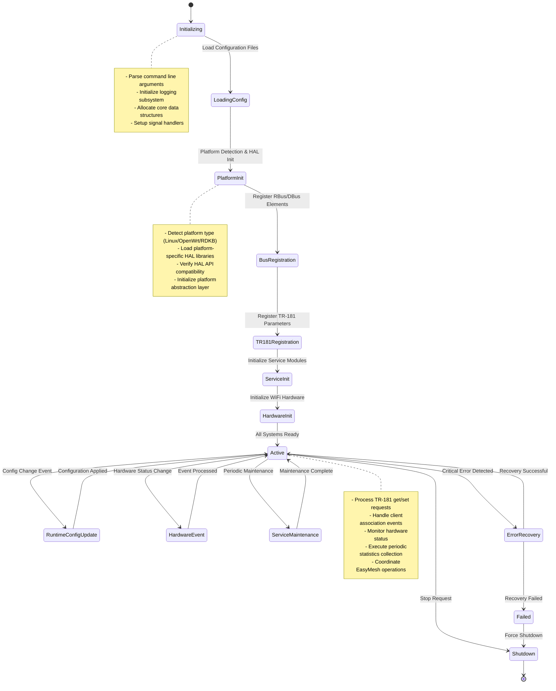
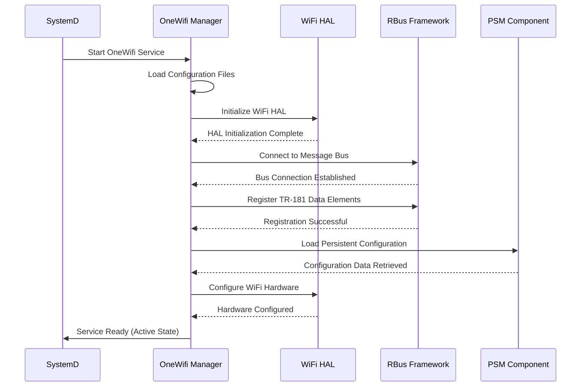
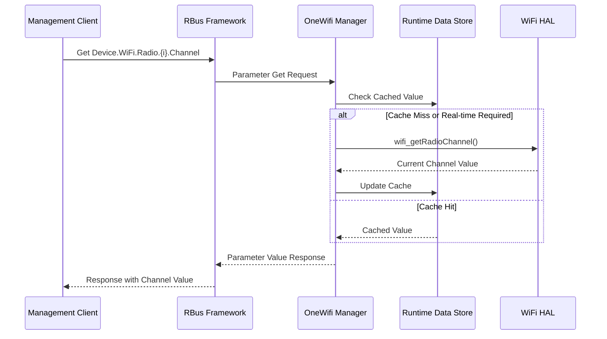
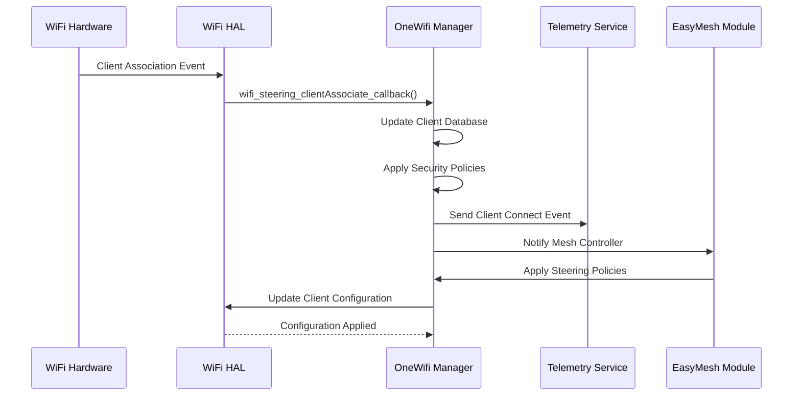
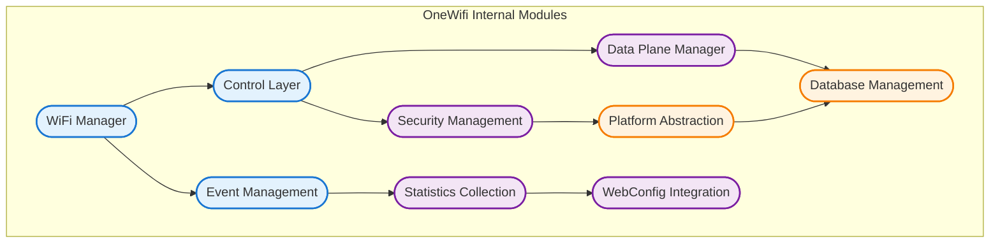
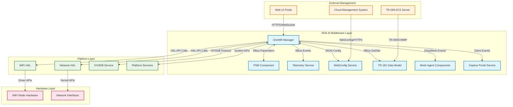
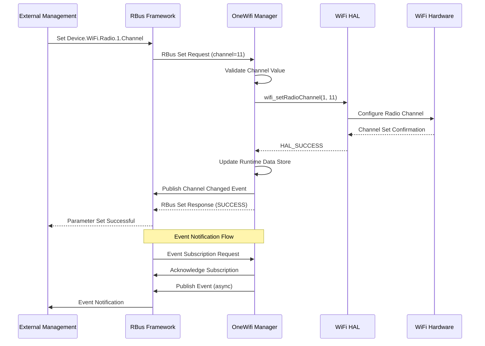

# OneWifi Documentation

OneWifi is a unified software architecture for managing Wi-Fi parameters, statistics, telemetry, steering and optimization, capable of running on both Gateways and Extenders. It provides a centralized Wi-Fi management solution within the RDK-B middleware stack that abstracts Wi-Fi hardware complexities and delivers consistent Wi-Fi functionality across different platforms and device types.

The component serves as the primary interface between RDK-B middleware layers and Wi-Fi hardware abstraction layers (HAL), enabling standardized Wi-Fi configuration, monitoring, and control. It consolidates various Wi-Fi management functionalities that were previously distributed across multiple components, providing a unified approach to Wi-Fi operations in RDK-B devices.



**Key Features & Responsibilities**: 

- **Unified Wi-Fi Management**: Centralized management of all Wi-Fi related operations including radio configuration, access point management, station management, and security policies across multiple radio interfaces
- **TR-181 Parameter Management**: Complete implementation of Wi-Fi related TR-181 data model parameters providing standardized configuration and monitoring interfaces for external management systems
- **Multi-Platform Support**: Platform abstraction layer supporting multiple hardware platforms (Linux, OpenWrt, RDKB) with consistent API interfaces regardless of underlying hardware implementation
- **WebConfig Integration**: Native support for WebConfig-based bulk configuration updates enabling efficient configuration synchronization with cloud management systems
- **EasyMesh Support**: Comprehensive IEEE 1905.1 EasyMesh controller and agent functionality for seamless mesh networking across multiple devices and vendors
- **Advanced Statistics & Telemetry**: Real-time Wi-Fi performance monitoring, client statistics collection, and telemetry data generation for network optimization and troubleshooting
- **Band Steering & Optimization**: Intelligent client steering algorithms, load balancing, and radio resource optimization to maximize network performance and user experience


## Design

OneWifi employs a layered architectural design that separates Wi-Fi management concerns into distinct functional layers while maintaining platform independence through abstraction interfaces. The core design principle centers around a unified Wi-Fi manager that coordinates all Wi-Fi operations through a centralized state machine, ensuring consistent behavior across different hardware platforms and deployment scenarios. The architecture follows a service-oriented approach where each major Wi-Fi functionality is encapsulated as a distinct service module that can operate independently while coordinating through the central manager.

The northbound interfaces are designed to support multiple IPC mechanisms including RBus (preferred) and DBus for legacy compatibility, enabling seamless integration with other RDK-B middleware components and external management systems. The southbound interfaces utilize platform-specific HAL APIs that abstract hardware differences, allowing the same OneWifi codebase to operate across different Wi-Fi chipsets and platforms. Data persistence is achieved through integration with the Platform Storage Manager (PSM) component for configuration data, while runtime state and statistics are maintained in optimized in-memory structures with selective persistence based on criticality.

The IPC mechanism design supports both synchronous and asynchronous communication patterns, with RBus providing the primary message bus for parameter access, event notifications, and method invocations. Event-driven architecture ensures responsive handling of hardware events, configuration changes, and external requests while maintaining system stability through comprehensive error handling and recovery mechanisms.

A Component diagram showing the component's internal structure and dependencies is given below:



### Prerequisites and Dependencies

**MUST Requirements:**
- RBus message bus framework (v1.0+) for inter-process communication with RDK-B components
- WiFi HAL implementation (platform-specific) providing standardized Wi-Fi hardware abstraction APIs
- PSM (Persistent Storage Manager) component for configuration data persistence and retrieval
- CcspCommonLibrary for CCSP framework integration and common utility functions
- Platform-specific build toolchain (GCC 7.0+ or compatible compiler with C99/C++11 support)
- Linux kernel with cfg80211/nl80211 wireless subsystem support or equivalent platform wireless APIs

**SHOULD Requirements:**
- Telemetry component for performance metrics collection and reporting
- WebConfig service for bulk configuration management and cloud synchronization
- TR-069 PA component for TR-181 parameter access via ACS management
- EasyMesh HAL extensions for advanced mesh networking capabilities (IEEE 1905.1 compliance)
- OVSDB (Open vSwitch Database) for advanced network virtualization features

**Dependent Components:**
- CcspWifiAgent (legacy) - OneWifi serves as the modernized replacement providing enhanced functionality
- Mesh Agent components - depend on OneWifi's EasyMesh implementation for mesh coordination
- Network Manager components - rely on OneWifi for Wi-Fi interface status and configuration
- Captive Portal services - depend on OneWifi for access point and client management
- Parental Control services - utilize OneWifi's client management and filtering capabilities

**Threading Model**

OneWifi employs a hybrid multi-threaded architecture designed to handle concurrent Wi-Fi operations while maintaining system responsiveness and data consistency. The threading model separates concerns between different operational domains to prevent blocking operations from affecting critical real-time functions.

- **Threading Architecture**: Multi-threaded with specialized thread pools for different operational contexts
- **Main Thread**: Handles initialization, configuration management, state machine coordination, and primary event processing loop. Manages the central Wi-Fi manager state and coordinates between service modules
- **Worker Threads**:
  - **HAL Interface Thread**: Dedicated thread for all HAL API calls to prevent blocking main operations during hardware interactions
  - **Statistics Collection Thread**: Periodic statistics gathering from hardware and client monitoring with configurable collection intervals
  - **Event Processing Thread**: Asynchronous event handling for hardware notifications, client connect/disconnect events, and external trigger processing
  - **WebConfig Processing Thread**: Background processing of configuration updates, validation, and application to minimize impact on runtime operations
  - **EasyMesh Communication Thread**: Dedicated thread for mesh protocol message handling and inter-node communication
- **Synchronization**: Uses mutex-protected shared data structures, condition variables for thread coordination, and lock-free queues for high-frequency event passing between threads

## Component State Flow

### Initialization to Active State

OneWifi follows a structured initialization sequence that ensures all dependencies are available before transitioning to operational state. The initialization process validates platform capabilities, establishes IPC connections, registers data model parameters, and initializes hardware interfaces in a predetermined order to avoid race conditions and ensure system stability.



### Runtime State Changes and Context Switching

During normal operation, OneWifi manages multiple concurrent state machines for different operational contexts including radio states, client association states, mesh networking states, and configuration synchronization states. Each context maintains independent state while coordinating through the central event dispatcher to ensure consistent system behavior.

**State Change Triggers:**
- **Configuration Updates**: WebConfig bulk updates, TR-181 parameter changes, or factory reset operations trigger configuration validation and application workflows
- **Hardware Events**: Radio up/down events, client connect/disconnect notifications, and hardware error conditions trigger corresponding state transitions and recovery actions  
- **Mesh Events**: EasyMesh topology changes, multi-AP coordination messages, and steering decisions trigger mesh state updates and client management actions
- **External Control Events**: Management system commands, diagnostic requests, and maintenance operations trigger controlled state transitions with rollback capabilities

**Context Switching Scenarios:**
- **Platform Mode Switching**: Dynamic switching between gateway and extender modes based on mesh role negotiation and topology detection
- **Radio Configuration Changes**: Runtime switching between different channel configurations, bandwidth settings, and security modes with minimal service interruption
- **Failover Operations**: Automatic failover to backup configurations during hardware failures or connectivity issues with restoration when conditions improve

## Call Flow

### Primary Call Flows

**Initialization Call Flow:**



**TR-181 Parameter Get Request Call Flow:**



**Client Association Event Call Flow:**



## TR‑181 Data Models

### Supported TR-181 Parameters

OneWifi implements comprehensive TR-181 Wi-Fi data model support following BBF TR-181 Issue 2 Amendment 15 specifications with additional RDK-specific extensions for enhanced functionality and platform-specific features.

#### Object Hierarchy

```
Device.
└── WiFi.
    ├── RadioNumberOfEntries (uint32, R)
    ├── SSIDNumberOfEntries (uint32, R)
    ├── AccessPointNumberOfEntries (uint32, R)
    ├── ApplyRadioSettings (boolean, R/W)
    ├── ApplyAccessPointSettings (boolean, R/W)
    ├── Radio.{i}.
    │   ├── Enable (boolean, R/W)
    │   ├── Status (string, R)
    │   ├── Name (string, R)
    │   ├── Channel (uint32, R/W)
    │   ├── AutoChannelEnable (boolean, R/W)
    │   ├── OperatingFrequencyBand (string, R/W)
    │   ├── OperatingChannelBandwidth (string, R/W)
    │   ├── TransmitPower (uint32, R/W)
    │   └── Stats.
    │       ├── BytesSent (uint64, R)
    │       ├── BytesReceived (uint64, R)
    │       ├── PacketsSent (uint64, R)
    │       └── PacketsReceived (uint64, R)
    ├── SSID.{i}.
    │   ├── Enable (boolean, R/W)
    │   ├── Status (string, R)
    │   ├── Name (string, R/W)
    │   ├── SSID (string, R/W)
    │   ├── MACAddress (string, R)
    │   └── Stats.
    │       ├── BytesSent (uint64, R)
    │       ├── BytesReceived (uint64, R)
    │       ├── AssociatedDeviceNumberOfEntries (uint32, R)
    │       └── AssociatedDevice.{i}.
    │           ├── MACAddress (string, R)
    │           ├── AuthenticationState (boolean, R)
    │           ├── LastDataDownlinkRate (uint32, R)
    │           └── SignalStrength (int32, R)
    ├── AccessPoint.{i}.
    │   ├── Enable (boolean, R/W)
    │   ├── Status (string, R)
    │   ├── SSIDReference (string, R/W)
    │   ├── Security.
    │   │   ├── ModesSupported (string, R)
    │   │   ├── ModeEnabled (string, R/W)
    │   │   ├── WEPKey (string, W)
    │   │   ├── PreSharedKey (string, W)
    │   │   └── KeyPassphrase (string, W)
    │   └── WPS.
    │       ├── Enable (boolean, R/W)
    │       ├── ConfigMethodsSupported (string, R)
    │       └── ConfigMethodsEnabled (string, R/W)
    └── X_RDKCENTRAL-COM_BandSteering.
        ├── Enable (boolean, R/W)
        ├── APGroup (string, R/W)
        ├── BandSteeringAlgorithm (string, R/W)
        └── History.{i}.
            ├── MACAddress (string, R)
            ├── SourceSSIDReference (string, R)
            ├── TargetSSIDReference (string, R)
            └── Time (dateTime, R)
```

#### Parameter Definitions

**Core Parameters:**

| Parameter Path | Data Type | Access | Default Value | Description | BBF Compliance |
|----------------|-----------|--------|---------------|-------------|----------------|
| `Device.WiFi.RadioNumberOfEntries` | uint32 | R | `0` | Total number of Wi-Fi radio entries in the Radio table. Automatically calculated based on detected hardware interfaces. | TR-181 Issue 2 |
| `Device.WiFi.SSIDNumberOfEntries` | uint32 | R | `0` | Total number of SSID entries in the SSID table. Reflects all configured virtual access points across all radios. | TR-181 Issue 2 |
| `Device.WiFi.Radio.{i}.Enable` | boolean | R/W | `false` | Enables or disables the radio interface. When disabled, all associated SSIDs and Access Points are automatically disabled. | TR-181 Issue 2 |
| `Device.WiFi.Radio.{i}.Status` | string | R | `"Down"` | Current operational status of the radio. Enumerated values: "Up", "Down", "Unknown", "Dormant", "NotPresent", "LowerLayerDown", "Error". | TR-181 Issue 2 |
| `Device.WiFi.Radio.{i}.Channel` | uint32 | R/W | `6` | Current operating channel number. Valid values depend on regulatory domain and operating frequency band. Auto-channel selection when AutoChannelEnable is true. | TR-181 Issue 2 |
| `Device.WiFi.SSID.{i}.SSID` | string(32) | R/W | `""` | Service Set Identifier (network name) for the wireless network. Maximum 32 octets as per IEEE 802.11 standard. UTF-8 encoding supported. | TR-181 Issue 2 |
| `Device.WiFi.AccessPoint.{i}.Security.ModeEnabled` | string | R/W | `"None"` | Security mode for the access point. Enumerated values: "None", "WEP-64", "WEP-128", "WPA-Personal", "WPA2-Personal", "WPA-WPA2-Personal", "WPA2-Enterprise", "WPA3-Personal", "WPA3-Enterprise". | TR-181 Issue 2 |

**Custom Extensions:**

- **X_RDKCENTRAL-COM_BandSteering**: RDK-specific extension providing intelligent band steering capabilities for dual-band and tri-band configurations with historical tracking and algorithm selection
- **X_RDKCENTRAL-COM_WiFiMesh**: EasyMesh implementation extensions including controller/agent role management, topology discovery, and multi-AP coordination parameters
- **X_RDKCENTRAL-COM_ClientSteering**: Advanced client steering controls beyond standard band steering including RSSI thresholds, steering policies, and client blacklisting capabilities

### Parameter Registration and Access

- **Implemented Parameters**: OneWifi implements over 200 TR-181 parameters covering complete Wi-Fi radio management, SSID configuration, access point security, client statistics, and RDK-specific extensions for mesh networking and advanced features
- **Parameter Registration**: Parameters are registered via RBus data element registration during component initialization. Each parameter includes metadata for data type validation, access control, and change notification subscriptions
- **Access Mechanism**: External components access parameters through RBus get/set method calls with automatic parameter validation, caching for performance optimization, and event notification for parameter changes
- **Validation Rules**: All parameter sets undergo validation including range checking for numeric values, enumeration validation for string parameters, cross-parameter dependency validation, and platform capability verification before hardware application

## Internal Modules

OneWifi is architected with modular design principles where each functional area is encapsulated in dedicated modules that maintain clear interfaces and responsibilities. The core modules coordinate through a central management layer while maintaining independence for testing, maintenance, and platform-specific customization.

| Module/Class | Description | Key Files |
|-------------|------------|-----------|
| **WiFi Manager** | Central coordination module managing overall Wi-Fi operations, state machine, and inter-module communication | `wifi_mgr.c`, `wifi_mgr.h` |
| **Control Layer** | Request processing and command coordination including TR-181 handlers, WebConfig processing, and API request routing | `wifi_ctrl.c`, `wifi_ctrl_rbus_handlers.c`, `wifi_ctrl_webconfig.c` |
| **Data Plane Manager** | Network data path management, traffic monitoring, and packet processing coordination | `wifi_data_plane.c`, `wifi_data_plane.h` |
| **Event Management** | Centralized event processing for hardware notifications, client events, and system triggers | `wifi_events.c` |
| **Security Management** | Authentication, encryption, access control, and security policy enforcement | `wifi_passpoint.c`, `wifi_8021x.c` |
| **EasyConnect Support** | Wi-Fi Easy Connect (DPP) implementation for simplified device onboarding | `wifi_easy_connect.c`, `wifi_easy_connect.h` |
| **Statistics Collection** | Performance metrics gathering, client monitoring, and telemetry data preparation | `source/stats/` |
| **WebConfig Integration** | Bulk configuration management and cloud synchronization support | `source/webconfig/` |
| **Platform Abstraction** | Hardware abstraction layer providing consistent APIs across different platforms | `source/platform/` |
| **Database Management** | Runtime data storage, configuration persistence, and data model maintenance | `source/db/` |



## Component Interactions

### Middleware Components & System Layers

OneWifi serves as a central hub within the RDK-B middleware ecosystem, coordinating Wi-Fi operations with multiple system components while abstracting hardware complexities. The component maintains active communication channels with data model services, telemetry systems, configuration management services, and platform-specific layers to deliver comprehensive Wi-Fi management capabilities.



**Component Interactions:**

| Component/Layer | Purpose of Interaction | Protocols/Mechanisms |
|-----------------|------------------------|----------------------|
| **Middleware Components** |
| PSM Component | Persistent storage of Wi-Fi configuration parameters, factory defaults, and runtime settings | RBus parameter get/set, bulk configuration operations |
| Telemetry Service | Real-time Wi-Fi performance metrics, client statistics, and operational event reporting | RBus events, JSON telemetry messages |
| WebConfig Service | Bulk configuration management, cloud synchronization, and configuration validation | JSON configuration documents, RBus notifications |
| TR-181 Data Model | Standardized parameter access for external management systems and diagnostic tools | RBus get/set operations, parameter change notifications |
| Mesh Agent Components | EasyMesh coordination, multi-AP management, and inter-device communication | Custom mesh protocols, RBus events |
| **System Layers** |
| WiFi HAL | Hardware-specific Wi-Fi operations including radio control, client management, and statistics collection | Standard HAL API calls, callback registrations |
| Network HAL | Network interface management, bridge operations, and VLAN configuration | HAL API calls, network configuration APIs |
| OVSDB Service | Advanced networking features, flow control, and network virtualization | OVSDB JSON-RPC protocol |
| **External Systems** |
| Cloud Management | Remote Wi-Fi configuration, firmware updates, and centralized network monitoring | HTTPS/TLS, WebConfig JSON format |

**Published Events:**

OneWifi publishes comprehensive event notifications that enable other RDK-B components to respond to Wi-Fi state changes and coordinate system-wide operations:

| Event | Purpose of Event | Reason for Trigger |
|-------|------------------|-------------------|
| `wifi.client.connect` | Client device association notification | New wireless client successfully authenticates and associates with access point |
| `wifi.client.disconnect` | Client device disassociation notification | Wireless client disconnects voluntarily or due to timeout/error conditions |
| `wifi.radio.statuschange` | Radio operational status change | Radio interface transitions between Up/Down/Error states due to configuration or hardware changes |
| `wifi.config.changed` | Configuration update notification | Wi-Fi configuration parameters modified via TR-181, WebConfig, or direct API calls |
| `wifi.mesh.topology.change` | EasyMesh topology modification | Mesh network topology changes including node additions, removals, or role changes |
| `wifi.security.violation` | Security policy breach detection | Authentication failures, intrusion attempts, or policy violations detected |
| `wifi.performance.threshold` | Performance threshold crossed | Network performance metrics exceed configured warning or error thresholds |

## IPC Mechanism

OneWifi employs a flexible IPC architecture supporting multiple message bus implementations to ensure compatibility across different RDK-B deployment scenarios while optimizing for performance and reliability.

| Type of IPC | Message Format | Mechanism |
|---------------|-------------------------|----------|
| **RBus (Primary)** | Binary-encoded messages with structured data types including integers, strings, objects, and arrays. Supports parameter metadata and type validation | RBus framework with direct method calls, parameter registration, and event subscriptions |
| **DBus (Legacy Support)** | D-Bus message format with XML introspection and standard D-Bus data types. Maintains backward compatibility with legacy RDK-B components | DBus system bus with standardized CCSP interfaces and object path registration |
| **JSON over RBus** | JSON-encoded configuration documents and telemetry data for complex structured information exchange | RBus transport with JSON payload encoding for WebConfig and bulk operations |
| **HAL Function Calls** | Direct C function calls with structured parameters and callback registrations for hardware interaction | Synchronous API calls with asynchronous callback notifications for events |



## Implementation Details

### Major HAL APIs Integration

OneWifi integrates with comprehensive WiFi HAL APIs providing standardized hardware abstraction across different chipset vendors and platform implementations. The HAL integration layer handles platform-specific variations while presenting consistent interfaces to the upper-level management functions.

**Core HAL APIs:**

| HAL API | Purpose | Parameters | Return Values | Implementation File |
|---------|---------|------------|---------------|-------------------|
| `wifi_init()` | Initialize WiFi HAL subsystem and detect available radios | `void` | `WIFI_HAL_SUCCESS`, `WIFI_HAL_ERROR` | `wifi_ctrl.c` |
| `wifi_getRadioNumberOfEntries()` | Query total number of WiFi radio interfaces | `unsigned long *output` | `WIFI_HAL_SUCCESS`, `WIFI_HAL_ERROR` | `wifi_ctrl_rbus_handlers.c` |
| `wifi_setRadioEnable()` | Enable or disable specific radio interface | `int radioIndex, BOOL enable` | `WIFI_HAL_SUCCESS`, `WIFI_HAL_ERROR` | `wifi_ctrl_wifiapi_handlers.c` |
| `wifi_getRadioChannel()` | Retrieve current operating channel for radio | `int radioIndex, unsigned long *output_ulong` | `WIFI_HAL_SUCCESS`, `WIFI_HAL_ERROR` | `wifi_ctrl.c` |
| `wifi_setRadioChannel()` | Configure operating channel for radio | `int radioIndex, unsigned long channel` | `WIFI_HAL_SUCCESS`, `WIFI_HAL_ERROR` | `wifi_ctrl.c` |
| `wifi_getSSIDName()` | Get SSID name for specified SSID index | `int ssidIndex, char *output_string` | `WIFI_HAL_SUCCESS`, `WIFI_HAL_ERROR` | `wifi_ctrl_rbus_handlers.c` |
| `wifi_setSSIDName()` | Configure SSID name for specified index | `int ssidIndex, char *ssid_string` | `WIFI_HAL_SUCCESS`, `WIFI_HAL_ERROR` | `wifi_ctrl_wifiapi_handlers.c` |
| `wifi_getApAssociatedDevicesCount()` | Get count of associated client devices | `int apIndex, unsigned long *output_ulong` | `WIFI_HAL_SUCCESS`, `WIFI_HAL_ERROR` | `wifi_data_plane.c` |

### Key Implementation Logic

- **State Machine Engine**: Core state management implemented in `wifi_mgr.c` with centralized state coordination across all WiFi operations. State transitions are managed through event-driven architecture with comprehensive error handling and recovery mechanisms.
  - Main implementation in `wifi_mgr.c` with `wifi_mgr_state_machine_process()` function coordinating all state transitions
  - State transition handlers in `wifi_ctrl_queue_handlers.c` managing request queuing and processing workflows

- **Event Processing**: Hardware and software events are processed through asynchronous event handling system with priority-based queuing and parallel processing capabilities.
  - Hardware interrupt handling via HAL callback registration system
  - Event queue management with circular buffers and overflow protection
  - Asynchronous event processing with dedicated worker threads for time-critical operations

- **Error Handling Strategy**: Comprehensive error detection and recovery system with multi-level error classification and appropriate response strategies for different failure scenarios.
  - HAL error code mapping with standardized error classification and logging
  - Recovery mechanisms including automatic retry logic, configuration rollback, and hardware reset procedures
  - Timeout handling with configurable timeout values and exponential backoff for hardware operations

- **Logging & Debugging**: Multi-level logging system with runtime configurable log levels, component-specific log categories, and integration with system logging infrastructure.
  - Component-specific logging with categories for WIFI_MGR, WIFI_CTRL, WIFI_HAL, and WIFI_EVENTS
  - HAL API call tracing with parameter logging and return value tracking
  - Debug hooks including runtime configuration dump, state machine visualization, and performance profiling

## Key Configuration Files

OneWifi utilizes multiple configuration files to support different deployment scenarios, platform requirements, and operational modes while maintaining consistent behavior across different hardware platforms.

| Configuration File | Purpose | Key Parameters | Default Values | Override Mechanisms |
|--------------------|---------|---------------|----------------|--------------------|
| `CcspWifi.cfg` | CCSP component registration and DBus configuration | `ID`, `Name`, `Version`, `DbusPath` | `com.cisco.spvtg.ccsp.wifi` | Environment variables |
| `TR181-WiFi-USGv2.XML` | TR-181 data model definitions and parameter mappings | WiFi object hierarchy, parameter types, access permissions | Standard BBF definitions | Platform-specific XML overlays |
| `CcspDmLib.cfg` | Data model library configuration and module loading | Library paths, initialization functions, memory management | Platform defaults | Runtime configuration files |
| `rdkb-wifi.ovsschema` | OVSDB schema definitions for advanced networking features | Table definitions, column types, constraints | OpenWrt networking schema | Custom schema extensions |
| `bus_dml_config.json` | Bus interface and data model element configuration | RBus element registration, callback mappings | Auto-generated mappings | Runtime JSON updates |
| `home.schema` / `private.schema` | WebConfig schema definitions for configuration validation | Parameter validation rules, configuration structure | BBF-compliant structure | Custom validation extensions |
| `WifiSingleClient.avsc` | Avro schema for telemetry data serialization | Client statistics structure, data types | Standard telemetry format | Custom telemetry schemas |