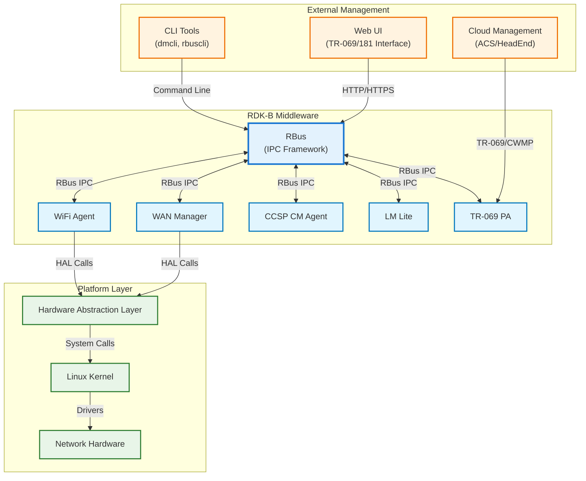
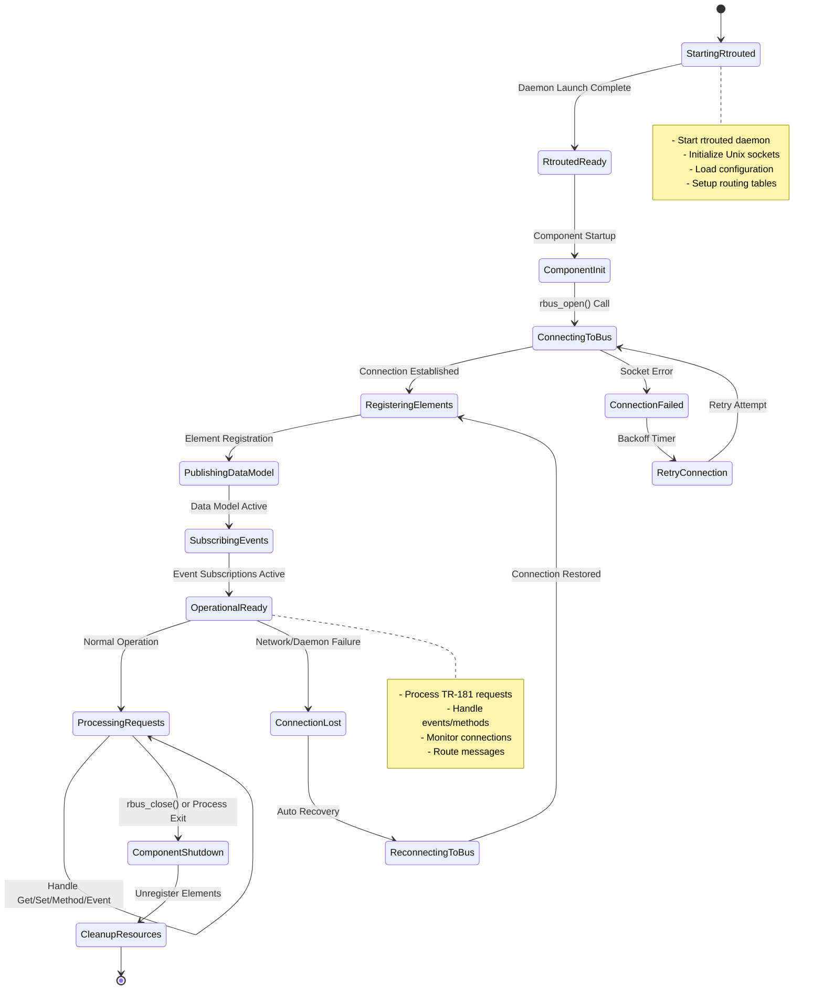
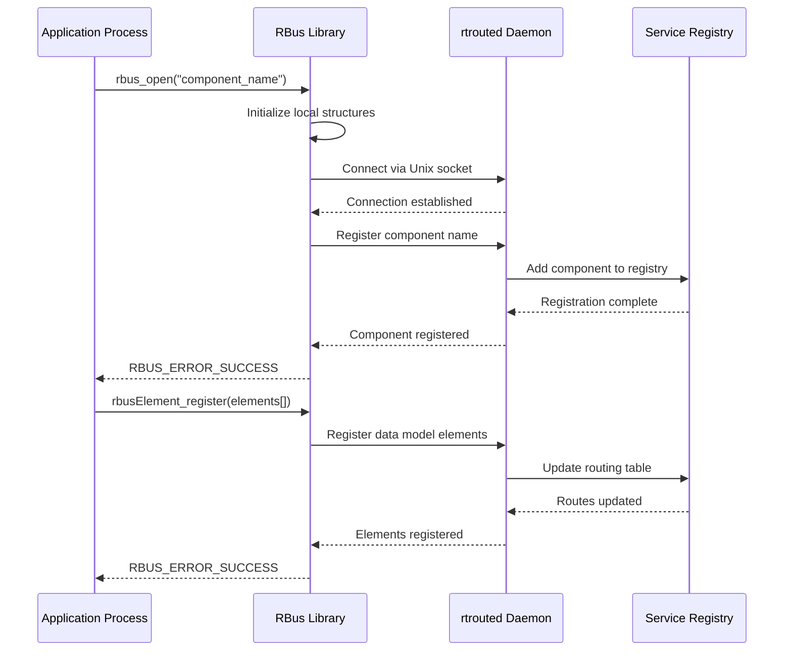
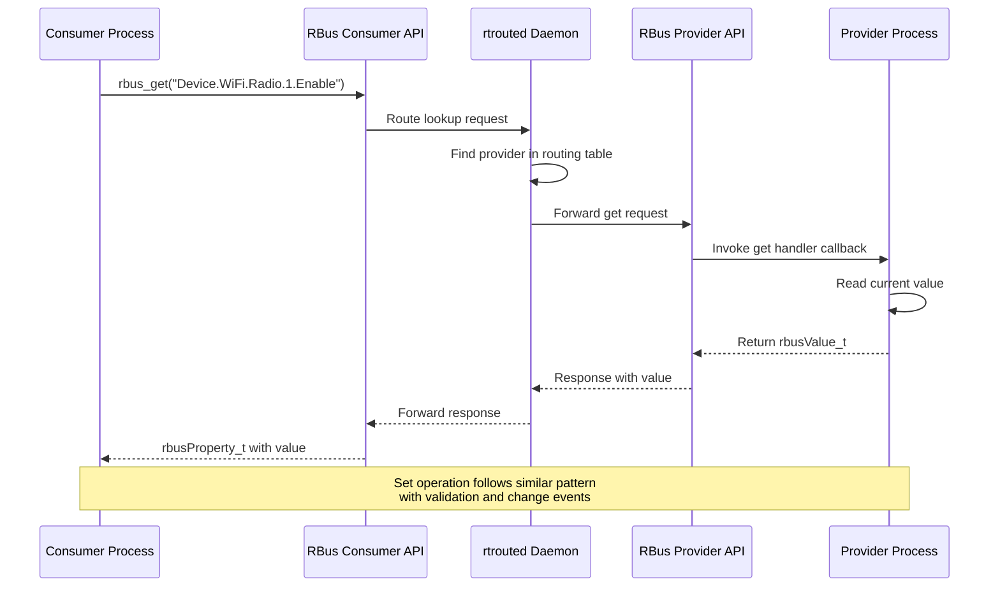
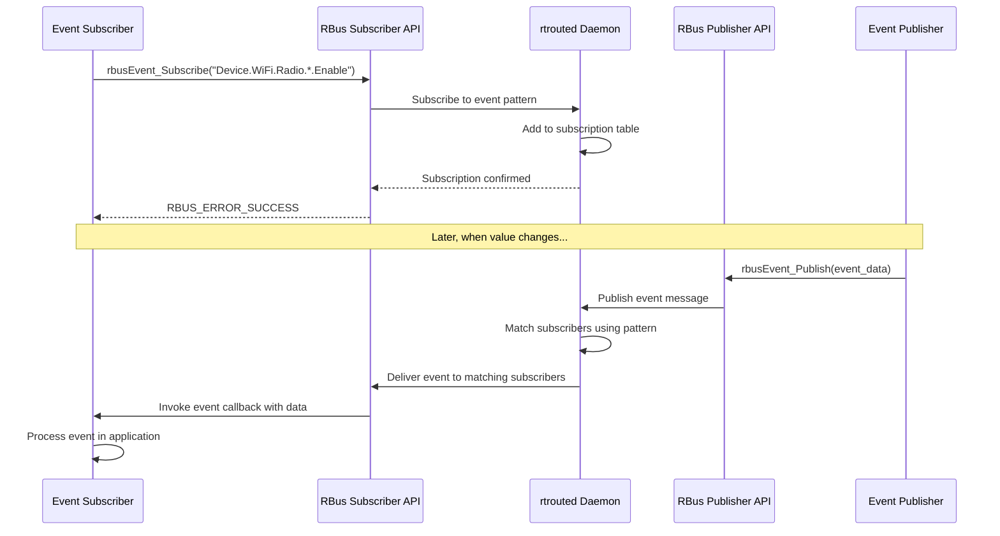
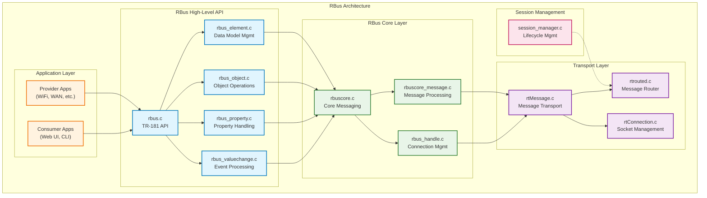
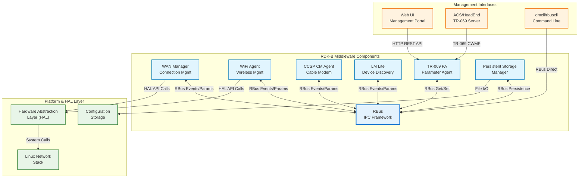
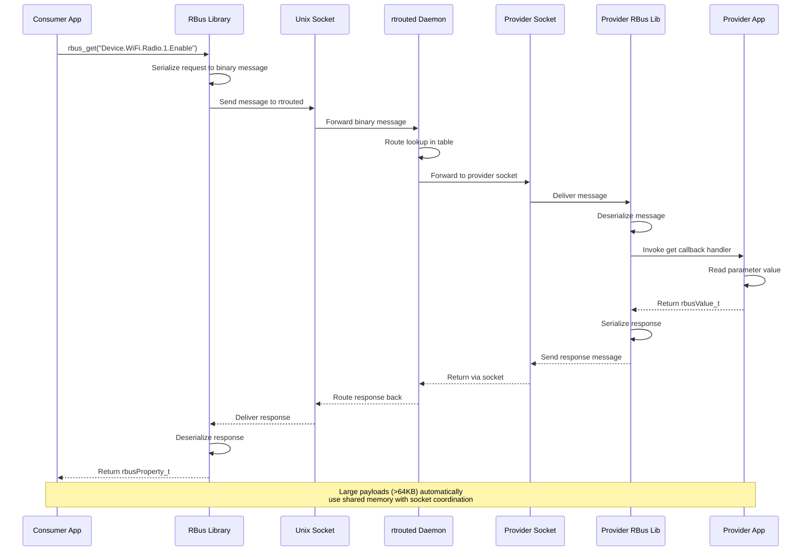

# RBus Documentation

RBus (RDK Bus) is a lightweight, fast and efficient bus messaging system that enables interprocess communication (IPC) and remote procedure calls (RPC) between multiple processes running on RDK-B devices. It provides a hierarchical data model framework supporting TR-181 parameter management, event-driven communication, and distributed object management across the RDK-B middleware stack.

RBus serves as the foundational IPC layer for RDK-B components, replacing traditional DBus implementations with a more efficient, purpose-built messaging system. It enables components to register data models, publish events, expose methods, and manage hierarchical object trees in a distributed environment. The system supports both provider and consumer patterns, allowing components to simultaneously expose services and consume services from other components.



**Key Features & Responsibilities**: 

- **Hierarchical Data Model Management**: Provides TR-181 compliant data model registration, access, and manipulation with support for objects, properties, events, and methods in a hierarchical namespace structure
- **Event-Driven Communication**: Enables publish-subscribe messaging patterns with value-change events, general events, and custom event types for real-time component coordination
- **Remote Method Invocation**: Supports synchronous and asynchronous method calls between components with parameter marshalling and result handling
- **High-Performance IPC**: Optimized message routing and serialization using custom binary protocols and memory-mapped communication for minimal latency
- **Session Management**: Handles component lifecycle, connection management, and automatic cleanup when processes terminate or disconnect
- **Discovery and Routing**: Automatic service discovery and intelligent message routing between distributed components using the rtrouted daemon

## Design

RBus implements a broker-based messaging architecture centered around the rtrouted daemon that provides centralized message routing, service discovery, and session management. The design separates the messaging transport layer (rtmessage) from the higher-level data model abstraction (rbus API), enabling both low-level message passing and high-level object-oriented interactions. Components register with rtrouted to publish data models and subscribe to events, with the broker handling intelligent routing, caching, and delivery guarantees.

The architecture supports both provider and consumer patterns within the same process, allowing components to simultaneously expose TR-181 parameters while consuming parameters from other components. The design emphasizes zero-copy message passing where possible, uses memory-mapped files for large data transfers, and implements connection pooling to minimize resource overhead. Event propagation follows a hierarchical subscription model where wildcards and filtering enable efficient targeted delivery.

The IPC mechanism integrates through direct API calls to the rbus library, which internally manages connections to rtrouted via Unix domain sockets. Message serialization uses a custom binary format optimized for TR-181 data types, with automatic type conversion and validation. Data persistence is handled by individual components rather than RBus itself, though RBus provides mechanisms for components to coordinate data synchronization and backup operations.

```mermaid
graph TD
    subgraph "RBus Runtime Environment (Linux Processes)"
        subgraph "rtrouted Daemon Process"
            Router["Message Router<br/>(C)"]
            Discovery["Service Discovery<br/>(C)"]
            SessionMgr["Session Manager<br/>(C)"]
            RouteCache["Routing Cache<br/>(C)"]
        end
        
        subgraph "Provider Process (e.g., WiFi Agent)"
            ProviderAPI["RBus Provider API<br/>(C)"]
            DataModel["TR-181 Data Model<br/>(C)"]
            EventPub["Event Publisher<br/>(C)"]
            MethodHandler["Method Handlers<br/>(C)"]
        end
        
        subgraph "Consumer Process (e.g., Web UI Backend)"
            ConsumerAPI["RBus Consumer API<br/>(C)"]
            EventSub["Event Subscriber<br/>(C)"]
            MethodClient["Method Client<br/>(C)"]
            ParamCache["Parameter Cache<br/>(C)"]
        end
        
        subgraph "Utilities"
            CLI["rbuscli<br/>(C)"]
            SessionMgrProc["rbus_session_mgr<br/>(C)"]
        end
    end
    
    subgraph "Shared Resources"
        UnixSockets[("Unix Domain Sockets<br/>/tmp/rtroute*")]
        SharedMem[("Shared Memory<br/>mmap regions")]
        ConfigFiles[("Configuration<br/>rbus*.conf")]
    end
    
    ProviderAPI -->|Unix Socket| Router
    ConsumerAPI -->|Unix Socket| Router
    CLI -->|Unix Socket| Router
    
    Router -->|Route Discovery| Discovery
    Router -->|Session Tracking| SessionMgr
    Router -->|Cache Lookup| RouteCache
    
    ProviderAPI -.->|Memory Mapping| SharedMem
    ConsumerAPI -.->|Memory Mapping| SharedMem
    
    SessionMgrProc -->|Monitor| UnixSockets
    Router -.->|Load Config| ConfigFiles
    
    note1["Note: rtrouted must be started first<br/>All components connect via Unix sockets<br/>Large payloads use shared memory"]
    
    classDef daemon fill:#fff3e0,stroke:#ef6c00,stroke-width:2px;
    classDef provider fill:#e8f5e8,stroke:#2e7d32,stroke-width:2px;
    classDef consumer fill:#e1f5fe,stroke:#0277bd,stroke-width:2px;
    classDef utility fill:#f3e5f5,stroke:#7b1fa2,stroke-width:2px;
    classDef resource fill:#fce4ec,stroke:#c2185b,stroke-width:2px;
    
    class Router,Discovery,SessionMgr,RouteCache daemon;
    class ProviderAPI,DataModel,EventPub,MethodHandler provider;
    class ConsumerAPI,EventSub,MethodClient,ParamCache consumer;
    class CLI,SessionMgrProc utility;
    class UnixSockets,SharedMem,ConfigFiles resource;
```



### Prerequisites and Dependencies

**MUST Requirements:**

- Linux operating system with systemd support for service management
- C99 compiler toolchain (gcc 4.8+ or clang 3.5+) for building native components
- CMake 2.8.12+ for build system configuration and dependency management
- Unix domain socket support in kernel for local IPC communication
- Memory mapping (mmap) support for large message handling and shared memory regions
- pthreads library for multi-threaded component support

**SHOULD Requirements:**

- msgpack-c library for enhanced message serialization performance
- cJSON library for JSON message format support in utility applications
- rdklogger integration for centralized logging across RDK-B components
- linenoise library for enhanced CLI experience in rbuscli utility
- Breakpad library for crash reporting and debugging support

**Dependent Components:**

- **WAN Manager**: Depends on RBus for TR-181 Device.X_RDK_WanManager parameter exposure and event notifications
- **WiFi Agent**: Uses RBus for Device.WiFi.* parameter management and client connection events
- **CCSP Components**: Legacy CCSP components transitioning to RBus from DBus for improved performance
- **TR-069 PA**: Leverages RBus for parameter value retrieval and modification during ACS interactions
- **LM Lite**: Utilizes RBus for device presence detection and network topology events
- **Web UI Backend**: Consumes RBus APIs for real-time device status and configuration management

**Threading Model**

RBus implements a hybrid threading architecture combining event-driven I/O with worker thread pools for optimal performance and responsiveness. The core rtrouted daemon operates on a single-threaded event loop using epoll for efficient socket multiplexing, while client libraries can operate in both single-threaded and multi-threaded modes depending on application requirements.

- **Threading Architecture**: Hybrid Event-Driven with Optional Multi-Threading
- **Main Thread**: Handles RBus API calls, connection management, and coordinates with rtrouted daemon
- **Worker Threads** (if applicable):
  - **Event Thread**: Processes incoming events and dispatches callbacks to registered handlers
  - **Method Thread**: Handles synchronous method invocations to prevent blocking main application logic
  - **Timer Thread**: Manages subscription intervals and timeout handling for periodic events
- **Synchronization**: Uses mutexes for critical sections, condition variables for thread coordination, and lock-free queues for high-frequency message passing

The rtrouted daemon maintains a single-threaded design for simplicity and performance, using an event loop to handle multiple client connections concurrently. Client applications can choose their threading model based on their specific requirements, with RBus providing thread-safe APIs when multi-threading is enabled.

## Component State Flow

### Initialization to Active State

RBus follows a multi-phase initialization sequence starting with rtrouted daemon startup, followed by component registration and data model publication. The system transitions through distinct states including service discovery, connection establishment, and full operational readiness with automatic recovery mechanisms for failed connections.



### Runtime State Changes and Context Switching

RBus maintains operational state through dynamic service discovery and automatic reconnection handling. Components can dynamically register and unregister data model elements during runtime, with the system automatically updating routing tables and notifying dependent components of availability changes.

**State Change Triggers:**

- **Component Registration/Deregistration**: Triggers routing table updates and service availability notifications to dependent components
- **Connection Loss/Recovery**: Activates automatic reconnection logic with exponential backoff and state restoration
- **Data Model Changes**: Dynamic addition or removal of TR-181 parameters triggers discovery updates and subscription re-evaluation
- **Event Subscription Changes**: Modifies event routing and filtering rules for optimal message delivery performance

**Context Switching Scenarios:**
- **Provider Mode to Consumer Mode**: Components can dynamically switch roles within the same process for bidirectional communication
- **Online to Offline Mode**: Handles graceful degradation when rtrouted daemon becomes unavailable with local caching
- **Debug Mode Switching**: Runtime log level changes and diagnostic mode activation without service interruption

## Call Flow

### Primary Call Flows

**Initialization Call Flow:**



**Parameter Get/Set Call Flow:**



**Event Subscription and Publishing Call Flow:**



## TR‑181 Data Models

### Supported TR-181 Parameters

RBus provides comprehensive support for TR-181 data model implementation following BBF-262 specification guidelines. The framework enables any component to register TR-181 compliant parameters with full support for the hierarchical object model, parameter validation, and standard access controls.

#### Object Hierarchy

```
Device.
└── RBus.
    ├── Enable (boolean, R/W)
    ├── Status (string, R)
    ├── ComponentList.{i}.
    │   ├── Name (string, R)
    │   ├── ConnectionStatus (string, R)
    │   ├── LastActivity (dateTime, R)
    │   └── MessageCount (unsignedInt, R)
    └── Statistics.
        ├── TotalMessages (unsignedInt, R)
        ├── ActiveConnections (unsignedInt, R)
        ├── ErrorCount (unsignedInt, R)
        └── UptimeSeconds (unsignedInt, R)
```

#### Parameter Definitions

**Core Parameters:**

| Parameter Path | Data Type | Access | Default Value | Description | BBF Compliance |
|----------------|-----------|--------|---------------|-------------|----------------|
| `Device.RBus.Enable` | boolean | R/W | `true` | Enables or disables the RBus messaging system. When disabled, all IPC communication is suspended and components must use alternative mechanisms. | Custom Extension |
| `Device.RBus.Status` | string | R | `"Up"` | Current operational status of RBus system. Enumerated values: "Up", "Down", "Error", "Starting", "Stopping". Reflects the rtrouted daemon state. | Custom Extension |
| `Device.RBus.ComponentList.{i}.Name` | string | R | `""` | Unique name identifier of the registered component as specified during rbus_open() call. Maximum length 256 characters following TR-181 naming conventions. | Custom Extension |
| `Device.RBus.ComponentList.{i}.ConnectionStatus` | string | R | `"Connected"` | Connection state of the component. Values: "Connected", "Disconnected", "Reconnecting", "Failed". Updated automatically by session manager. | Custom Extension |
| `Device.RBus.Statistics.TotalMessages` | unsignedInt | R | `0` | Cumulative count of all messages processed by rtrouted daemon since startup, including get/set operations, events, and method calls. | Custom Extension |

**Custom Extensions:**

- **Device.RBus.***: Complete custom namespace for RBus-specific monitoring and control parameters not defined in standard BBF specifications
- **Event Subscription Patterns**: Support for wildcard subscriptions using TR-181 hierarchical notation with "*" and "." pattern matching
- **Method Invocation Framework**: Custom extension enabling remote procedure calls within TR-181 namespace structure

### Parameter Registration and Access

- **Implemented Parameters**: Components register TR-181 parameters using rbusElement_register() with callbacks for get/set operations. RBus core itself exposes monitoring parameters under Device.RBus.* namespace.
- **Parameter Registration**: Registration occurs through rbus library API calls with automatic routing table updates in rtrouted daemon. Each parameter includes type information, access permissions, and callback handlers.
- **Access Mechanism**: Other components access parameters via rbus_get()/rbus_set() API calls which route through rtrouted daemon to the appropriate provider component via Unix domain sockets.
- **Validation Rules**: Type validation enforced at API level with custom validation callbacks supported for complex business rules. String length limits, numeric ranges, and enumerated value checking performed automatically.

## Internal Modules

RBus consists of several layered modules providing abstraction from low-level messaging to high-level data model management. The core modules handle message routing and connection management, while higher-level modules provide TR-181 compliant APIs and event processing capabilities.

| Module/Class | Description | Key Files |
|-------------|------------|-----------|
| **rtmessage** | Low-level message transport layer providing socket management, routing, and serialization | `rtMessage.c`, `rtrouted.c`, `rtConnection.c` |
| **rbuscore** | Core RBus API implementation handling component registration and message routing | `rbuscore.c`, `rbuscore_message.c` |
| **rbus** | High-level TR-181 compatible API providing object/property abstraction | `rbus.c`, `rbus_element.c`, `rbus_object.c` |
| **session_manager** | Component lifecycle management and connection monitoring | `session_manager.c`, `rbus_session_mgr.h` |
| **utilities** | Command-line tools and diagnostic utilities for system interaction | `rbuscli/`, `dataProvider/` |



## Component Interactions

### Middleware Components & System Layers

RBus serves as the central IPC backbone connecting all RDK-B middleware components through standardized messaging patterns. Components interact through TR-181 parameter get/set operations, event subscriptions, and method invocations. The system abstracts the underlying transport mechanism while providing high-performance message routing and automatic service discovery.



**Component Interactions:**

| Component/Layer | Purpose of Interaction | Protocols/Mechanisms |
|-----------------|------------------------|----------------------|
| **Middleware Components** |
| WAN Manager | TR-181 Device.X_RDK_WanManager.* parameter exposure and WAN interface events | RBus IPC, Event subscriptions |
| WiFi Agent | Device.WiFi.* parameter management, client association/disassociation events | RBus IPC, Value-change events |
| CCSP CM Agent | Cable modem status reporting, upstream/downstream parameter management | RBus IPC, Legacy DBus bridge |
| LM Lite | Device presence detection, network topology change notifications | RBus IPC, General events |
| TR-069 PA | Parameter value retrieval for ACS interactions, bulk configuration updates | RBus IPC, Synchronous get/set |
| PSM | Persistent parameter storage, configuration backup and restore operations | RBus IPC, Method calls |
| **System Layers** |
| HAL Layer | Hardware-specific parameter retrieval and configuration via standardized APIs | Direct API calls, No RBus involvement |
| Platform Services | System configuration, network stack interaction, file system operations | System calls, Configuration files |
| **Management Interfaces** |
| Web UI/ACS | Remote device management, configuration updates, status monitoring | HTTP/HTTPS, TR-069 CWMP, RBus proxy |

**Published Events:**

RBus facilitates cross-component coordination through a comprehensive event system enabling real-time notifications and state synchronization across the RDK-B middleware stack:

| Event | Purpose of Event | Reason for trigger |
|-------|------------------|-------------------|
| `Device.*.ValueChange` | Parameter value modification notification | Any TR-181 parameter change triggers event to notify subscribers of state updates |
| `Device.RBus.ComponentList.*.ConnectionChange` | Component connectivity status updates | Component registration/deregistration or connection loss detection for dependency management |
| `Device.WiFi.Radio.*.ClientConnect` | WiFi client association events | New device connection to wireless network for network topology tracking |
| `Device.X_RDK_WanManager.InterfaceStatusChange` | WAN interface state transitions | Interface up/down events for connection failover and load balancing decisions |
| `Device.DeviceInfo.SystemRestart` | System reboot notification | Device restart event for component coordination during shutdown/startup sequences |

## IPC Mechanism

RBus implements a high-performance IPC mechanism using Unix domain sockets for control messaging combined with shared memory regions for large data transfers. The system uses a custom binary serialization format optimized for TR-181 data types with automatic endianness handling and type validation.

| Type of IPC | Message Format | Mechanism |
|---------------|-------------------------|----------|
| **Parameter Get/Set** | Binary-encoded rbusMessage with type-tagged rbusValue payload containing parameter path, data type, and value | Unix domain sockets to rtrouted with automatic routing to provider component |
| **Event Publishing** | Custom event message format with event name, source component, timestamp, and typed payload data | Unix domain sockets with subscription-based routing and pattern matching |
| **Method Invocation** | RPC-style message with method name, input parameters as rbusObject, and response handling | Synchronous Unix socket communication with timeout handling and error propagation |
| **Large Data Transfer** | Memory-mapped regions with header containing size, type, and access permissions | Shared memory (mmap) for messages exceeding 64KB threshold with socket-based coordination |



## Implementation Details

### Major HAL APIs Integration

RBus operates as a middleware-layer IPC framework and does not directly integrate with HAL APIs. Instead, it provides the communication mechanism for RDK-B components that do interact with HAL layers. The framework enables components to expose HAL-derived data through TR-181 parameters and coordinate HAL operations through event notifications.

**HAL Integration Pattern:**

| Integration Pattern | Purpose | Implementation Approach | RBus Role |
|-------------------|---------|------------------------|-----------|
| **Parameter Bridging** | Expose HAL data as TR-181 parameters | Component registers HAL-backed parameters with RBus | Provides get/set callback routing to HAL-aware component |
| **Event Forwarding** | Convert HAL callbacks to RBus events | HAL callbacks trigger RBus event publication | Enables cross-component notification of hardware state changes |
| **Method Delegation** | Remote HAL operation invocation | RBus methods invoke HAL APIs in designated components | Provides RPC mechanism for coordinated HAL access |
| **Status Aggregation** | Combine multiple HAL sources | Components use RBus to share HAL status information | Facilitates status correlation across hardware subsystems |

### Key Implementation Logic

- **Message Routing Engine**: Core routing logic implemented in `rtrouted.c` using hash tables for O(1) component lookup and radix trees for efficient wildcard pattern matching in event subscriptions
  - Main implementation in `src/rtmessage/rtrouted.c` with routing table management and connection tracking
  - Route optimization logic in `src/rtmessage/rtRoutingTree.c` for hierarchical namespace pattern matching

- **Event Processing**: Asynchronous event handling with priority queues and configurable delivery guarantees ensuring reliable cross-component communication
  - Event queue management and subscription filtering
  - Callback thread pool for non-blocking event delivery
  - Automatic retry logic for failed event deliveries

- **Error Handling Strategy**: Comprehensive error detection with automatic recovery mechanisms and detailed error propagation through standardized error codes
  - Connection failure detection with exponential backoff retry logic
  - Message validation and type checking with detailed error reporting
  - Graceful degradation when rtrouted daemon becomes unavailable

- **Logging & Debugging**: Multi-level logging with component-specific categories and real-time log level adjustment for production debugging
  - Structured logging with component identification and message tracing
  - Performance metrics collection for message latency and throughput analysis
  - Debug hooks enabling runtime inspection of routing tables and subscription lists

## Key Configuration Files

RBus configuration management centers around systemd service files and runtime configuration that controls daemon behavior, logging, and component registration policies.

| Configuration File | Purpose | Key Parameters | Default Values | Override Mechanisms |
|--------------------|---------|---------------|----------------|--------------------|
| `rbus.service` | Systemd service definition for rtrouted daemon | `ExecStart`, `TimeoutSec`, `Restart` | `/usr/bin/rtrouted`, `300s`, `no` | Environment variables, systemd overrides |
| `rbus_session_mgr.service` | Session manager service configuration | `ExecStart`, `User`, `Group` | `/usr/bin/rbus_session_mgr` | Systemd drop-in files |
| `rbus_rdkv.conf` | RDK-V specific runtime configuration | Log levels, socket paths, timeouts | `INFO`, `/tmp/rtroute*`, `30s` | Runtime environment variables |
| `rbus_client_rdkc.conf` | RDK-C client configuration parameters | Connection limits, retry counts | `max_connections=100`, `retry=3` | Client-specific config files |

The configuration system supports dynamic parameter updates through environment variables and systemd service overrides, enabling deployment-specific customization without modifying core configuration files. Runtime parameters can be adjusted via RBus's own TR-181 interface for live system tuning.