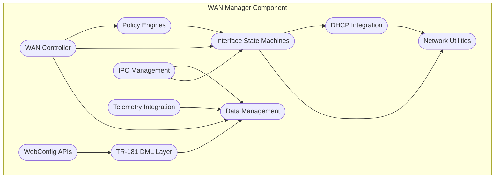

# WAN Manager Documentation

WAN Manager is the RDK-B middleware component responsible for managing WAN connectivity and interface orchestration. It serves as the central coordinator for WAN interface selection, failover management, and connectivity validation across multiple interface types including DOCSIS, Ethernet, Cellular (LTE), DSL (xDSL), and GPON. The component implements intelligent policy-driven selection algorithms and provides comprehensive WAN interface lifecycle management to ensure optimal internet connectivity for CPE devices.

WAN Manager abstracts the complexity of multi-WAN configurations from upper-layer applications while providing seamless failover capabilities and centralized WAN policy enforcement. As a core middleware service, it coordinates with various interface managers (DOCSIS Manager, Cellular Manager, etc.) and handles both link-layer and IP-layer configuration through integration with DHCP, VLAN Manager, and other RDK-B components.


**Key Features & Responsibilities**: 

- **Multi-WAN Interface Management**: Coordinates multiple WAN interface types (DOCSIS, Ethernet, Cellular, DSL, GPON) with intelligent selection and failover policies for optimal connectivity
- **Policy-Driven Selection**: Implements various selection algorithms including AutoWAN, Parallel Scan, Fixed Mode, and Primary Priority to determine the best available WAN interface
- **Failover and Redundancy**: Provides automatic failover between interface groups with configurable restoration delays and health monitoring for continuous internet connectivity
- **Interface State Machine**: Manages complete WAN interface lifecycle from physical layer validation through IP configuration with proper error handling and recovery mechanisms
- **DHCP Integration**: Handles DHCPv4 and DHCPv6 client operations including lease management, DNS configuration, and IPv6 prefix delegation for WAN interfaces
- **TR-181 Data Model**: Implements comprehensive TR-181 parameter tree for WAN management configuration, status reporting, and remote management capabilities
- **Telemetry and Monitoring**: Provides extensive telemetry data collection, system event publishing, and connectivity validation for network performance monitoring
- **WebConfig Support**: Enables cloud-based configuration management with bulk configuration updates and validation for simplified remote device management

## Design

WAN Manager employs a modular, event-driven architecture built around multiple state machines and policy engines that coordinate to provide intelligent WAN connectivity management. The design centers on three core operational components: a global Failover Policy managing interface group selection, per-group Selection Policies handling interface choice within groups, and per-interface State Machines managing individual interface lifecycle. This multi-layered approach enables flexible configuration scenarios from simple single-WAN setups to complex multi-group failover with diverse interface types.

The architecture separates concerns between physical interface management (handled by dedicated Interface Managers) and logical WAN configuration (managed by WAN Manager), allowing clean abstraction and simplified interface integration. WAN Manager coordinates with DHCP Manager for IP configuration, VLAN Manager for link-layer setup, and Telemetry systems for monitoring, while maintaining direct control over network stack configuration through Linux utilities. The design supports both RBus and DBus IPC mechanisms for backward compatibility and provides comprehensive TR-181 parameter exposure for standards-compliant management.

The north-bound interface provides TR-181 parameter access via RBus/DBus for remote management systems and WebConfig integration for cloud-based configuration, while south-bound interactions handle physical interface coordination through standardized RBus messaging with Interface Managers and direct HAL/system integration for network configuration. Data persistence is managed through syscfg for configuration storage and PSM (Persistent Storage Manager) for runtime state, ensuring configuration persistence across reboots and proper state recovery during system initialization.


### Prerequisites and Dependencies

WAN Manager has several critical dependencies that must be satisfied for proper operation. The component requires RBus infrastructure for modern IPC communication, though it maintains DBus compatibility for legacy integration. The underlying Linux network stack must support standard networking utilities (ip, ifconfig, route) and provide netlink socket access for network interface monitoring.

**MUST Requirements:**

- RDK-B Common Library (ccsp-common-library) for base RDK-B infrastructure and logging
- RBus library (rbus >= 1.0) for primary IPC communication or DBus for legacy support  
- Syscfg library for persistent configuration storage and retrieval
- PSM (Persistent Storage Manager) for runtime parameter persistence
- Linux kernel with netlink socket support and standard networking utilities
- System Events (sysevent) infrastructure for event publishing and subscription
- WebConfig Framework for cloud-based configuration management support

**SHOULD Requirements:**

- Telemetry 2.0 framework for enhanced monitoring and data collection capabilities
- DHCP Manager component for centralized DHCP client operations management
- VLAN Manager component for 802.1Q VLAN configuration on WAN interfaces
- Interface Manager components (DOCSIS Manager, Cellular Manager) for physical interface control
- HAL libraries specific to the platform's WAN interface hardware

**Dependent Components:**

- **Network Monitor (netmonitor)**: Depends on WAN Manager for interface status and connectivity validation
- **Firewall Manager**: Relies on WAN Manager for active interface information and routing decisions
- **Quality of Service (QoS) Manager**: Uses WAN interface selection data for traffic prioritization
- **Captive Portal Detection**: Depends on WAN connectivity validation and internet access status
- **Device Management (TR-069/USPAgent)**: Requires WAN Manager TR-181 parameters for device configuration
- **Diagnostic Tools**: Use WAN interface state and connectivity information for network troubleshooting

**Threading Model**

WAN Manager implements a multi-threaded architecture designed to handle concurrent operations across multiple WAN interfaces while maintaining responsive system behavior. The component uses a combination of event-driven processing and dedicated worker threads to manage the complexity of simultaneous interface state machines and policy execution.

- **Threading Architecture**: Multi-threaded with event-driven main loop
- **Main Thread**: Handles initialization, RBus/DBus message processing, TR-181 parameter operations, and coordinates overall component lifecycle
- **Controller Thread**: Runs the main WAN Controller state machine, manages policy engine coordination, and processes interface selection algorithms with 500ms processing cycles
- **Interface State Machine Threads**: Individual worker threads for each configured WAN interface (up to 128 supported), managing interface-specific lifecycle, DHCP operations, and connectivity validation
- **IPC Server Thread**: Dedicated thread for handling IPC message processing from Interface Managers, including status updates and configuration requests
- **WebConfig Thread**: Handles WebConfig framework integration, processing bulk configuration updates and validation operations
- **Telemetry Thread**: Manages telemetry data collection and event publishing to Telemetry 2.0 framework
- **Synchronization**: Uses mutex locks for shared data structures (WAN configuration database), condition variables for thread coordination, and RBus/DBus thread-safe APIs for inter-component communication

## Component State Flow

### Initialization to Active State

WAN Manager follows a structured initialization sequence that establishes IPC connectivity, loads configuration, registers TR-181 parameters, and initializes all internal state machines before entering active operation. The component waits for system readiness signals and dependent service availability before beginning WAN interface management operations.


### Runtime State Changes and Context Switching

WAN Manager continuously monitors and responds to various runtime events that trigger state changes in interface selection, policy execution, and network configuration. The component maintains separate state contexts for each interface while coordinating global policies that affect interface group selection and failover behavior.

**State Change Triggers:**
- **Physical Interface Events**: Interface up/down notifications from Interface Managers trigger state machine transitions and policy re-evaluation
- **Connectivity Validation**: Internet connectivity test results (DNS resolution, ping tests) trigger interface selection changes and failover decisions
- **Configuration Updates**: TR-181 parameter changes,or policy modifications trigger configuration reload and state machine restart
- **DHCP Events**: DHCP lease acquisition, renewal failures, or IP address changes trigger interface state updates and connectivity re-validation
- **System Events**: Network stack changes, routing table updates, or hardware events trigger interface monitoring and validation cycles

**Context Switching Scenarios:**
- **Interface Group Failover**: When the active interface group fails connectivity validation, WAN Manager switches to backup groups with configurable restoration delay
- **Policy Changes**: Runtime policy updates (AutoWAN to Fixed Mode) trigger complete state machine restart with new selection criteria
- **Interface Priority Updates**: Changes to interface priority rankings trigger re-evaluation of current selections without disrupting active connections
- **Emergency Fallback**: Critical interface failures trigger immediate fallback to any available interface regardless of policy constraints

## Call Flow

### Primary Call Flows

**Initialization Call Flow:**


**Interface Selection Call Flow:**


**Failover Call Flow:**


## TR‑181 Data Models

### Supported TR-181 Parameters

WAN Manager implements a comprehensive TR-181 parameter tree under the `Device.X_RDK_WanManager` namespace, providing complete configuration and status information for WAN interface management. The implementation follows BBF TR-181 specification guidelines while including RDK-specific extensions for advanced WAN management capabilities.

#### Object Hierarchy

```
Device.
└── X_RDK_WanManager.
    ├── Enable (boolean, R/W)
    ├── Policy (string, R/W) 
    ├── AllowRemoteInterfaces (boolean, R/W)
    ├── RestorationDelay (unsignedInt, R/W)
    ├── Data (string, R/W)
    ├── WanFailoverData (string, R/W)
    ├── ResetActiveInterface (boolean, R/W)
    ├── ResetDefaultConfig (boolean, R/W)
    ├── DnsConnectivityCheck.
    │   └── Enable (boolean, R/W)
    └── CPEInterface.{i}.
        ├── Name (string, R/W)
        ├── DisplayName (string, R/W)
        ├── ConfigureWanEnable (boolean, R/W)
        ├── EnableOperStatusMonitor (boolean, R/W)
        ├── EnableCustomConfig (boolean, R/W)
        ├── CustomConfigPath (string, R/W)
        ├── Phy.
        │   ├── Path (string, R/W)
        │   └── Status (string, R/W)
        ├── Wan.
        │   ├── Type (string, R/W)
        │   ├── Priority (unsignedInt, R/W) 
        │   ├── SelectionTimeOut (unsignedInt, R/W)
        │   ├── Group (unsignedInt, R/W)
        │   └── ActiveLink (boolean, R)
        ├── PPP.
        │   ├── Enable (boolean, R/W)
        │   ├── Username (string, R/W)
        │   └── Password (string, R/W)
        └── VirtualInterface.{i}.
            ├── Name (string, R/W)
            ├── Alias (string, R/W)
            ├── Enable (boolean, R/W)
            ├── Status (string, R)
            ├── VLANID (int, R/W)
            ├── Priority (unsignedInt, R/W)
            └── Marking.
                ├── SKBPort (unsignedInt, R/W)
                └── EthernetPriorityMark (int, R/W)
```

#### Parameter Definitions

**Core Parameters:**

| Parameter Path | Data Type | Access | Default Value | Description | BBF Compliance |
|----------------|-----------|--------|---------------|-------------|----------------|
| `Device.X_RDK_WanManager.Enable` | boolean | R/W | `true` | Enables or disables the WAN Manager component. When false, all WAN interface management is suspended and no interface selection policies are executed. | Custom Extension |
| `Device.X_RDK_WanManager.Policy` | string | R/W | `"AUTOWAN_MODE"` | Specifies the WAN interface selection policy. Valid values: FIXED_MODE_ON_BOOTUP(1), FIXED_MODE(2), PRIMARY_PRIORITY_ON_BOOTUP(3), PRIMARY_PRIORITY(4), MULTIWAN_MODE(5), AUTOWAN_MODE(6), PARALLEL_SCAN(7). Controls the algorithm used for interface selection and failover behavior. | Custom Extension |
| `Device.X_RDK_WanManager.RestorationDelay` | unsignedInt | R/W | `60` | Time in seconds to wait before attempting to restore a previously failed interface. Prevents rapid interface oscillation during intermittent connectivity issues. Range: 0-3600 seconds. | Custom Extension |
| `Device.X_RDK_WanManager.AllowRemoteInterfaces` | boolean | R/W | `false` | Enables support for remote WAN interfaces (e.g., bridge interfaces for remote connectivity). When enabled, allows configuration of interfaces not physically present on the local device. | Custom Extension |
| `Device.X_RDK_WanManager.CPEInterface.{i}.Name` | string | R/W | `""` | The interface name as known to the system (e.g., "erouter0", "eth0"). Must match the actual system interface name for proper operation. Maximum length: 64 characters. | Custom Extension |
| `Device.X_RDK_WanManager.CPEInterface.{i}.Wan.Priority` | unsignedInt | R/W | `1` | Interface selection priority within its group. Lower values indicate higher priority. Used by priority-based selection policies to determine interface precedence. Range: 1-255. | Custom Extension |
| `Device.X_RDK_WanManager.CPEInterface.{i}.Wan.Group` | unsignedInt | R/W | `1` | Interface group assignment for failover policy management. Interfaces in the same group are managed by the same selection policy. Range: 1-2. | Custom Extension |
| `Device.X_RDK_WanManager.CPEInterface.{i}.Wan.Type` | string | R/W | `"UNKNOWN"` | WAN interface type specification. Valid values: DOCSIS, ETHERNET_WAN, DSL, GPON, CELLULAR. Used for interface-specific configuration and management policies. | Custom Extension |

**Custom Extensions:**

WAN Manager includes several RDK-specific TR-181 extensions that provide advanced functionality beyond standard BBF specifications:

- **WebConfig Integration Parameters**: Support for bulk configuration updates via WebConfig framework with `Data` and `WanFailoverData` parameters for JSON-encoded configuration
- **Interface Grouping and Policies**: Multi-group interface management with configurable selection policies for complex failover scenarios not covered by standard TR-181
- **Virtual Interface Support**: Advanced VLAN and virtual interface configuration with QoS marking capabilities for service provider requirements
- **Connectivity Validation**: DNS-based connectivity checking with configurable validation parameters for robust internet connectivity detection

### Parameter Registration and Access

WAN Manager registers its complete TR-181 parameter tree during component initialization and provides both RBus and DBus access mechanisms for backward compatibility. Parameters are dynamically updated based on interface state changes and policy decisions, with immediate notification to subscribed management systems.

- **Implemented Parameters**: Complete implementation of X_RDK_WanManager namespace with 100+ parameters covering interface configuration, policy management, and status reporting
- **Parameter Registration**: Uses RBus data model registration for modern platforms with fallback to DBus Component Cache (CCSP) for legacy support
- **Access Mechanism**: RBus provides primary access path with optimized performance, while DBus maintains compatibility with existing management systems and components
- **Validation Rules**: Comprehensive parameter validation including range checking for numeric values, enumeration validation for policy strings, and dependency validation between related parameters
- **Event Notifications**: Automatic parameter change notifications via RBus events and DBus signals for real-time management system updates

## Internal Modules

WAN Manager is organized into several specialized modules that handle different aspects of WAN connectivity management. The modular design allows for clear separation of concerns while enabling coordinated operation across all WAN management functions.

| Module/Class | Description | Key Files |
|-------------|------------|-----------|
| **WAN Controller** | Main orchestration engine that coordinates policy execution and state machine management | `wanmgr_controller.c`, `wanmgr_controller.h` |
| **Policy Engines** | Implements various selection algorithms (AutoWAN, Parallel Scan, Fixed Mode) for interface selection | `wanmgr_policy_*_impl.c` files |
| **Interface State Machine** | Manages individual WAN interface lifecycle from initialization through active connectivity | `wanmgr_interface_sm.c`, `wanmgr_interface_sm.h` |
| **Data Management** | Central data store for WAN configuration and runtime state with thread-safe access | `wanmgr_data.c`, `wanmgr_data.h` |
| **TR-181 DML Layer** | Implements complete TR-181 parameter tree with RBus/DBus integration | `TR-181/middle_layer_src/wanmgr_dml_*.c` |
| **DHCP Integration** | Handles DHCPv4/DHCPv6 client operations and IP configuration management | `wanmgr_dhcpv4_*.c`, `wanmgr_dhcpv6_*.c` |
| **Network Utilities** | Provides network stack interaction and system command execution | `wanmgr_net_utils.c`, `wanmgr_net_utils.h` |
| **IPC Management** | Handles inter-process communication with Interface Managers and other components | `wanmgr_ipc.c`, `wanmgr_ipc.h` |
| **Telemetry Integration** | Manages telemetry data collection and event publishing for monitoring | `wanmgr_telemetry.c`, `wanmgr_t2_telemetry.c` |
| **WebConfig APIs** | Provides WebConfig framework integration for cloud-based configuration | `wanmgr_webconfig.c`, `wanmgr_webconfig_apis.c` |



## Component Interactions

### Middleware Components & System Layers

WAN Manager serves as a central coordination point in the RDK-B middleware stack, interacting with multiple components to provide comprehensive WAN connectivity management. The component maintains both control-plane interactions for configuration and management, and data-plane coordination for network traffic handling.


**Component Interactions:**

| Component/Layer | Purpose of Interaction | Protocols/Mechanisms |
|-----------------|------------------------|----------------------|
| **Middleware Components** |
| CCSP Data Model | TR-181 parameter registration and management | RBus data model APIs, parameter notifications |
| DHCP Manager | IP address configuration and lease management | RBus messaging for DHCP requests and status |
| VLAN Manager | 802.1Q VLAN configuration on WAN interfaces | RBus events for VLAN setup and teardown |
| Telemetry Manager | System metrics and performance data collection | Telemetry 2.0 APIs for event publishing |
| TR-069 Agent | Remote device management and configuration | Parameter value updates via RBus |
| WebConfig Framework | Bulk configuration management from cloud | WebConfig APIs with JSON configuration |
| Firewall Manager | WAN interface status for routing decisions | RBus events for active interface changes |
| **Interface Management Layer** |
| DOCSIS Manager | Physical DOCSIS interface control and status | RBus status subscriptions and control messages |
| Cellular Manager | LTE/5G interface management and connectivity | RBus interface control and event notifications |
| Ethernet Manager | Ethernet WAN interface configuration | RBus status monitoring and configuration |
| **System Layers** |
| HAL Interfaces | Low-level hardware abstraction | Direct function calls to HAL APIs |
| Linux Network Stack | Network interface and routing configuration | System calls (ip, ifconfig, route commands) |
| System Events | System-wide event notification | Sysevent publish/subscribe mechanisms |
| PSM Storage | Persistent configuration and state storage | PSM APIs for parameter storage and retrieval |
| **External Services** |
| Cloud Management | Remote configuration and monitoring | HTTPS/WebConfig, encrypted communication |
| Head-end Services | Service provider management systems | TR-069 over TLS, standardized protocols |

**Published Events:**

WAN Manager publishes several critical events that other RDK-B components subscribe to for coordination and system-wide awareness of WAN connectivity status:

| Event | Purpose of Event | Reason for Trigger |
|-------|------------------|-------------------|
| `wan-interface-active` | Notify system of active WAN interface change | Interface selection policy determines new active interface |
| `wan-connectivity-established` | Signal successful internet connectivity validation | DNS connectivity check and internet validation complete |
| `wan-connectivity-lost` | Alert system to loss of internet connectivity | Connectivity validation failure or interface down event |
| `wan-failover-initiated` | Indicate start of failover process to backup interface | Primary interface failure triggers failover policy |
| `wan-failover-completed` | Confirm successful failover to backup interface | Backup interface established and connectivity validated |
| `wan-interface-config-changed` | Notify of WAN interface configuration updates | TR-181 parameter changes or WebConfig updates applied |
| `wan-dhcp-lease-acquired` | Signal successful DHCP IP address acquisition | DHCPv4/DHCPv6 lease obtained on WAN interface |
| `wan-dhcp-lease-lost` | Alert to DHCP lease expiration or loss | DHCP lease renewal failure or interface reset |

## IPC Mechanism

WAN Manager employs a dual IPC architecture supporting both RBus (modern) and DBus (legacy) protocols to ensure compatibility across different RDK-B platform generations while providing optimal performance for real-time WAN management operations.

| Type of IPC | Message Format | Mechanism |
|---------------|-------------------------|----------|
| **RBus (Primary)** | JSON-structured messages with typed parameters, event subscriptions, and method invocations | RBus library with direct method calls, event publishing, and parameter get/set operations |
| **DBus (Legacy)** | CCSP-formatted XML messages with parameter trees and component registration | DBus message bus with CCSP protocol for TR-181 parameter access |
| **System Events** | Key-value string pairs with event names and data payloads | Sysevent publish/subscribe for system-wide notifications |
| **IPC Server (Internal)** | Custom binary protocol for Interface Manager communication | Unix domain sockets with message queuing and acknowledgment |

WAN Manager implements a comprehensive IPC framework that handles both synchronous request-response patterns for configuration operations and asynchronous event-driven communication for real-time status updates and coordination with other RDK-B components.


## Implementation Details

### Major HAL APIs Integration

WAN Manager integrates with several key HAL APIs to provide low-level network interface control and hardware abstraction. The component primarily relies on standard Linux networking APIs but also interfaces with platform-specific HAL implementations for advanced features.

**Core HAL APIs:**

| HAL API | Purpose | Parameters | Return Values | Implementation File |
|---------|---------|------------|---------------|-------------------|
| `platform_hal_GetBaseMacAddress` | Retrieve device base MAC address for interface configuration | `char *pValue` (output buffer) | `RETURN_OK`/`RETURN_ERR` | `wanmgr_net_utils.c` |
| `platform_hal_setLED` | Control WAN connectivity LED indicators | `PLATFORM_LED led`, `PLATFORM_LED_STATE state` | `RETURN_OK`/`RETURN_ERR` | `wanmgr_interface_sm.c` |
| `docsis_hal_GetNumOfActiveTxChannels` | Get DOCSIS active channel count for interface validation | `ULONG *pValue` (output) | `RETURN_OK`/`RETURN_ERR` | `wanmgr_policy_autowan_impl.c` |
| `mta_hal_GetDHCPInfo` | Retrieve MTA DHCP configuration for telephony interfaces | `PMTAMGMT_MTA_DHCP_INFO pInfo` | `RETURN_OK`/`RETURN_ERR` | `wanmgr_dhcpv4_apis.c` |
| `ethernet_hal_getEthWanLinkStatus` | Check Ethernet WAN physical link status | `BOOLEAN *pLinkStatus` | `RETURN_OK`/`RETURN_ERR` | `wanmgr_interface_sm.c` |

### Key Implementation Logic

WAN Manager implements a sophisticated multi-layered state management system that coordinates interface selection policies, individual interface state machines, and system-wide connectivity validation to provide reliable WAN connectivity management.

- **Policy Engine Architecture**: Core policy implementation resides in `wanmgr_controller.c` with specialized policy algorithms in dedicated files (`wanmgr_policy_autowan_impl.c`, `wanmgr_policy_parallel_scan_impl.c`). Each policy engine maintains its own state and coordinates with the central controller for interface selection decisions.

- **Interface State Machine**: Individual interface lifecycle management implemented in `wanmgr_interface_sm.c` with comprehensive state transitions covering physical validation, IP configuration, connectivity testing, and active monitoring. Each interface maintains independent state while coordinating through shared data structures.

- **Event Processing**: Asynchronous event handling system processes hardware interface changes, DHCP events, and connectivity validation results through event queues with priority-based processing to ensure responsive system behavior during network transitions.

- **Error Handling Strategy**: Multi-level error handling with graceful degradation includes interface-specific error recovery, policy-level fallback mechanisms, and system-wide error reporting. Failed interface attempts are tracked and temporarily blacklisted to prevent rapid retry cycles.

- **Connectivity Validation**: Internet connectivity validation implemented through DNS resolution tests, HTTP connectivity checks, and ping-based reachability tests with configurable validation parameters and timeout handling for reliable connectivity detection.

- **Logging & Debugging**: Comprehensive logging system with categorized log levels (ERROR, WARNING, INFO, DEBUG) and component-specific prefixes. Debug mode provides detailed state machine transitions, policy decision logging, and IPC message tracing for troubleshooting connectivity issues.

## Key Configuration Files

WAN Manager utilizes several configuration files and data sources to manage its operation, from compile-time parameter definitions to runtime configuration storage and persistent state management.

| Configuration File | Purpose | Key Parameters | Default Values | Override Mechanisms |
|--------------------|---------|---------------|----------------|--------------------|
| **RdkWanManager.xml** | TR-181 data model definitions | Parameter tree structure, access permissions, function mappings | N/A (schema definition) | Compile-time customization with preprocessor directives |
| **RdkWanManager_v2.xml** | Enhanced TR-181 model with extended features | Virtual interface support, advanced VLAN configuration | N/A (schema definition) | Feature flags and platform-specific builds |
| **syscfg database** | Persistent WAN configuration storage | `wan_policy`, `wan_interface_priority`, `restoration_delay` | `AUTOWAN_MODE`, `1`, `60` | TR-181 parameter updates, WebConfig |
| **PSM storage** | Runtime parameter persistence | Interface states, DHCP configurations, connectivity status | Component defaults | Dynamic updates via RBus/DBus |
| **/etc/debug.ini** | Debug logging configuration | Log levels, component-specific debugging | `INFO` level | Runtime modification via file edits |
| **WebConfig JSON** | Cloud-based bulk configuration | Complete WAN policy and interface configuration | Platform defaults | Cloud management system updates |

The configuration system supports hierarchical override mechanisms where cloud-based WebConfig takes precedence over local TR-181 settings, which in turn override compiled defaults, ensuring flexible deployment while maintaining configuration consistency across device lifecycles.