# Rialto Media Framework Documentation

## Overview

Rialto is a modular media framework designed for RDK-V (Reference Design Kit - Video) platforms that provides an out-of-process media playback solution with a client-server architecture. The framework separates media processing into dedicated server processes, enabling better resource management, security isolation, and system stability for STB (Set-Top Box) and other video devices.

At its core, Rialto consists of three main components working together:

1. **Rialto Core** - The main framework providing client-server IPC infrastructure, media pipeline services, and server management capabilities
2. **Rialto GStreamer Plugin** - Integration layer that bridges GStreamer-based applications with the Rialto media server
3. **Rialto OCDM** - OpenCDM (Content Decryption Module) adapter enabling DRM (Digital Rights Management) functionality through the Rialto framework

Rialto enables multiple applications to share hardware media decoders efficiently while maintaining process isolation. The Server Manager orchestrates multiple RialtoSessionServer instances, each dedicated to a specific application, with each session assigned a unique Unix domain socket for IPC communication. The design provides scalability, fault isolation, and optimized resource utilization across the RDK-V middleware stack.

### System Context in RDK-V Architecture

Rialto's position within the RDK-V ecosystem, bridging applications, middleware components, and hardware abstraction layers:

```mermaid
graph TD
    subgraph "Application Layer"
        WebBrowser["🌐 Web Browser<br/>(WPE/Chromium)"]
        MediaApps["📺 Media Applications<br/>(Native/HTML5)"]
    end

    subgraph "RDK-V Middleware"
        RialtoGst["Rialto GStreamer Plugin"]
        RialtoOCDM["Rialto OCDM"]
        OtherRDK["Other RDK Components<br/>(Thunder, IARM)"]
    end

    subgraph RialtoFramework ["Rialto Framework (Unix Domain Sockets)"]
        direction TB
        ServerMgr["🎯 Server Manager<br/>(Process Orchestration)"]
        
        subgraph Sessions ["Session Servers"]
            Session1["Session Server 1<br/>(App A Socket)"]
            Session2["Session Server 2<br/>(App B Socket)"]
        end
        
        subgraph ClientLib ["Client Library"]
            MediaPipelineClient["Media Pipeline Client"]
            MediaKeysClient["Media Keys Client"]
            ControlClient["Control Client"]
        end
        
        subgraph ServerCore ["Server Core"]
            MediaPipelineService["Media Pipeline Service"]
            MediaKeysService["Media Keys Service"]
            GstPlayer["GStreamer Player Backend"]
        end
    end

    subgraph "HAL Layer"
        SOCHAL["🔧 SOC HAL<br/>(Video/Audio Decoders)"]
        DRMHAL["🔐 DRM HAL<br/>(OpenCDM Interface)"]
        PlatformServices["Platform Services<br/>(Graphics, Memory)"]
    end

    subgraph "External Systems"
        LicenseServer["🌍 DRM License Server<br/>(HTTPS)"]
        CDN["📡 Content Delivery Network"]
    end

    WebBrowser -->|GStreamer Pipeline| RialtoGst
    MediaApps -->|GStreamer Pipeline| RialtoGst
    WebBrowser -->|EME API| RialtoOCDM
    
    RialtoGst -->|IMediaPipeline API| ClientLib
    RialtoOCDM -->|IMediaKeys API| ClientLib
    
    ServerMgr -->|Fork & Manage| Sessions
    ClientLib -->|Protobuf/IPC| Sessions
    Sessions -->|RPC Calls| ServerCore
    
    ServerCore -->|GStreamer Elements| GstPlayer
    GstPlayer -->|HAL Calls| SOCHAL
    ServerCore -->|DRM Operations| DRMHAL
    GstPlayer -->|Buffer Management| PlatformServices
    
    DRMHAL -.->|License Requests| LicenseServer
    GstPlayer -.->|Media Streaming| CDN
    
    OtherRDK -.->|System Events| RialtoFramework

    classDef application fill:#fff3e0,stroke:#ef6c00,stroke-width:2px;
    classDef middleware fill:#e1f5fe,stroke:#0277bd,stroke-width:2px;
    classDef core fill:#f3e5f5,stroke:#7b1fa2,stroke-width:3px;
    classDef hal fill:#e8f5e9,stroke:#2e7d32,stroke-width:2px;
    classDef external fill:#fce4ec,stroke:#c2185b,stroke-width:2px;
    
    class WebBrowser,MediaApps application;
    class RialtoGst,RialtoOCDM,OtherRDK middleware;
    class RialtoFramework,ServerMgr,Sessions,ClientLib,ServerCore,Session1,Session2,MediaPipelineClient,MediaKeysClient,ControlClient,MediaPipelineService,MediaKeysService,GstPlayer core;
    class SOCHAL,DRMHAL,PlatformServices hal;
    class LicenseServer,CDN external;
```



**Key Features & Responsibilities**: 

- **Out-of-Process Media Playback**: Isolates media processing in dedicated server processes, preventing application crashes from affecting media playback and improving system stability and security
- **Multi-Session Management**: Server Manager orchestrates multiple RialtoSessionServer instances, each serving a specific application with dedicated Unix domain sockets for IPC
- **GStreamer Integration**: Provides custom GStreamer sink elements (rialtomsevideosink, rialtomseaudiosink, rialtomsesubtitlesink, rialtowebaudiosink) enabling seamless integration with GStreamer-based applications
- **DRM Support**: OpenCDM adapter (rialto-ocdm) enables encrypted content playback with support for multiple DRM systems (Widevine, PlayReady, ClearKey) through the EME (Encrypted Media Extensions) API
- **Protobuf-based IPC**: High-performance communication using Protocol Buffers over Unix domain sockets, supporting RPC calls, asynchronous events, and file descriptor passing
- **Media Pipeline Services**: Comprehensive APIs for media source attachment, playback control (play/pause/seek/stop), rendering, volume control, and playback state management
- **WebAudio Support**: Dedicated WebAudio player service for low-latency audio rendering required by Web Audio API implementations
- **Resource Optimization**: Efficient hardware decoder sharing across applications with configurable session limits and application state management (ACTIVE/INACTIVE/NOT_RUNNING)


## Design

Rialto implements a sophisticated client-server architecture that separates media processing concerns from application logic. The design is built on several key principles: process isolation for fault tolerance, protocol-based IPC for language-agnostic communication, and hardware resource abstraction for platform portability.

The framework operates in three distinct layers. At the top, client libraries (embedded in applications through GStreamer plugins or OCDM adapters) provide standard media APIs. In the middle, the Server Manager acts as a process orchestrator, spawning and managing RialtoSessionServer instances based on application lifecycle and resource availability. At the bottom, each session server contains the actual media processing logic built on GStreamer, interfacing with platform-specific HAL implementations.

The IPC mechanism is central to Rialto's design. Unlike traditional shared-memory approaches, Rialto uses Protocol Buffers serialized over Unix domain sockets for strong type safety, version compatibility, and file descriptor passing for zero-copy buffer sharing. Protobuf definitions in the `/proto` directory define all service interfaces: MediaPipelineModule for A/V playback, MediaKeysModule for DRM, WebAudioPlayerModule for audio rendering, and ServerManagerModule for lifecycle management.

Data persistence and state management are handled at multiple levels. The Server Manager maintains application registration and socket assignments. Each session server tracks media pipeline state, buffering levels, and playback position. DRM session data is persisted through the OpenCDM backend, interfacing with secure storage provided by the DRM HAL. Configuration is primarily file-based, with session parameters passed during initialization and runtime adjustments made through the IPC control interface.

The north-bound interface exposes standard GStreamer and OpenCDM APIs, allowing applications to use familiar media frameworks without modification. The south-bound interface abstracts hardware through GStreamer element plugins and HAL function calls, enabling portability across different SoC platforms. The layered design keeps applications platform-agnostic while the server implementation can be optimized for specific hardware capabilities.

### Component Architecture

Rialto's internal structure with deployment boundaries and technology stack:


### Prerequisites and Dependencies

**RDK-V Platform and Integration Requirements (MUST):**

- **DISTRO Features**: `DISTRO_FEATURES += "rdk-v"` must be enabled in Yocto build configuration for Rialto integration
- **Build Dependencies**: 
  - Protocol Buffers (protobuf) >= 3.6 for IPC message serialization
  - GStreamer >= 1.14 including gst-plugins-base, gst-plugins-good
  - jsoncpp library for configuration parsing
  - CMake >= 3.10 for build system
  - C++17 compliant compiler (GCC >= 7.0 or Clang >= 5.0)
- **RDK-V Components**: 
  - Thunder/WPEFramework (for plugin integration and service management)
  - OCDM (OpenCDM interface for DRM)
  - RDK Logger (optional, for unified logging)
- **HAL Dependencies**: 
  - SoC-specific video/audio decoder HAL implementation
  - OpenCDM DRM system implementation for the target platform
  - Graphics compositor HAL (Wayland or DirectFB)
- **Systemd Services**: 
  - `RialtoServerManager.service` must be configured to start during system boot
  - DBus system bus must be available for inter-component communication
- **Configuration Files**: 
  - `/etc/rialto/servermanager.conf` - Server Manager configuration
  - `/etc/rialto/logging.conf` - Logging levels and output configuration (optional)
  - Application-specific socket paths in `/tmp/rialto-*`
- **Startup Order**: 
  - System DBus must be running before Server Manager initialization
  - Graphics compositor must be initialized before video rendering
  - DRM system must be available before encrypted content playback

**Threading Model** 

Rialto employs a multi-threaded design optimized for IPC handling, media processing, and event dispatching. The threading architecture varies between client and server components to match their respective responsibilities.

**Threading Architecture**: Multi-threaded with event-driven I/O

**Client Library Threads**:
- **Main Application Thread**: Hosts the GStreamer pipeline and processes application callbacks. Public API calls are invoked from this thread
- **IPC Event Thread**: Dedicated thread created by EventThread class for monitoring Unix domain socket events using poll/epoll. Dispatches incoming protobuf messages and events from the server
- **Timer Thread**: Handles timeout operations for IPC request/response cycles and retry logic

**Server Manager Threads**:
- **Main Service Thread**: Processes application registration requests, manages session server lifecycle (fork/exec), and maintains the session registry
- **IPC Listener Thread**: Monitors incoming control connections from RDK components requesting session server operations

**Session Server Threads**:
- **IPC Dispatcher Thread**: Processes incoming RPC calls from clients, deserializes protobuf messages, and invokes service layer methods
- **GStreamer Main Loop Thread**: Runs the GStreamer pipeline event loop (g_main_loop), handling bus messages, state changes, and buffer flow
- **Media Worker Threads**: GStreamer internally creates decoder threads and demuxer threads based on pipeline configuration
- **Event Notification Thread**: Sends asynchronous events (playback state changes, buffer underflow, position updates) to connected clients

**Synchronization**: 
- Mutex-based locking protects shared state (session registry, pipeline objects, client connection map)
- Condition variables coordinate thread startup/shutdown sequences
- Atomic operations for reference counting in shared_ptr usage
- Lock-free queues for high-throughput event dispatching between IPC and service layers

### Component State Flow

**Initialization to Active State**

The Rialto framework follows a multi-stage initialization process coordinated between the Server Manager, Session Servers, and client applications. The lifecycle begins with system boot and progresses through application registration, session establishment, and media pipeline activation.


**Runtime State Changes and Context Switching**

Rialto session servers transition between multiple states in response to system resource pressure, application lifecycle events, and media pipeline conditions. The Server Manager coordinates these transitions to optimize hardware decoder utilization across concurrent applications.

**State Change Triggers:**

- **Application Backgrounding**: When an application moves to background, the Server Manager sends `ChangeSessionServerState(appId, INACTIVE)`, causing the session server to release hardware decoder resources while maintaining pipeline state
- **Resource Contention**: If decoder limits are reached and a foreground application requires resources, the Server Manager preempts lower-priority sessions, transitioning them to INACTIVE
- **Network Buffering**: Media pipeline detects buffer underflow (< 2 seconds of data), triggering `BufferUnderflow` event to the client and transitioning to buffering state until sufficient data is available
- **Pipeline Errors**: Fatal GStreamer errors (decoder failure, unsupported format) trigger automatic pipeline teardown and error notification to the client
- **Graceful Shutdown**: Application termination or `DestroySession` call triggers orderly pipeline destruction, decoder release, and socket cleanup

**Context Switching Scenarios:**

- **ACTIVE ↔ INACTIVE Transitions**: When switching states, the session server detaches hardware decoders but maintains pipeline structure and buffered data. Reactivation reattaches decoders and resumes from the last known position without re-initialization
- **Session Server Restart**: If a session server crashes, the Server Manager detects the process termination, cleans up the socket, and can optionally respawn a new session server instance (configurable behavior)
- **DRM Session Migration**: During INACTIVE state, DRM sessions remain valid but license refresh operations are suspended. Upon ACTIVE transition, license validity is revalidated before playback resumes
- **Configuration Updates**: Runtime logging level changes propagate from Server Manager to all active session servers via control IPC messages without requiring restart

### Call Flow

**Initialization Call Flow:**


**Request Processing Call Flow:**

Media data transfer and playback control sequence demonstrating the MSE (Media Source Extensions) use case where the client application feeds encrypted media data to the server for decryption and rendering.


## Internal Modules

Rialto's architecture is organized into functionally distinct modules that handle specific aspects of media processing, IPC communication, and system integration. Each module encapsulates related functionality and exposes well-defined interfaces for inter-module communication.

**Core Framework Modules:**

| Module/Class | Description | Key Files |
|-------------|------------|-----------|
| **IPC Client** | Implements client-side protobuf RPC communication over Unix domain sockets. Manages connection lifecycle, message serialization/deserialization, and asynchronous event handling. Supports file descriptor passing for shared memory buffers. | `ipc/client/source/IpcClient.cpp`<br/>`ipc/client/include/IIpcClient.h`<br/>`ipc/common/proto/rialtoipc.proto` |
| **IPC Server** | Server-side IPC infrastructure that listens on Unix sockets, manages client connections, dispatches RPC calls to registered service modules, and sends asynchronous events. Handles concurrent client connections with per-client state tracking. | `ipc/server/source/IpcServerImpl.cpp`<br/>`ipc/server/include/IIpcServer.h`<br/>`ipc/server/source/IpcClientImpl.cpp` |
| **Media Pipeline Client** | Client library implementation of IMediaPipeline interface. Translates high-level media operations (play, pause, seek) into protobuf RPC calls. Manages media source lifecycle and buffer submission. | `media/client/ipc/source/MediaPipelineIpc.cpp`<br/>`media/client/main/source/MediaPipeline.cpp`<br/>`media/public/include/IMediaPipeline.h` |
| **Media Pipeline Service** | Server-side media pipeline orchestration. Creates and manages GStreamer playbin pipelines, coordinates source attachment, handles playback state transitions, and reports events back to clients. | `media/server/service/source/MediaPipelineService.cpp`<br/>`media/server/service/include/IMediaPipelineService.h` |
| **Media Keys Client** | DRM client implementation providing EME-compatible API for license acquisition, key management, and content decryption. Interfaces with server-side DRM modules. | `media/client/ipc/source/MediaKeysIpc.cpp`<br/>`media/client/main/source/MediaKeys.cpp`<br/>`media/public/include/IMediaKeys.h` |
| **Media Keys Service** | Server-side DRM service that interfaces with OpenCDM backend. Manages DRM sessions, license requests/responses, and attaches protection metadata to GStreamer pipelines for hardware-based decryption. | `media/server/service/source/MediaKeysService.cpp`<br/>`media/server/service/include/IMediaKeysService.h` |
| **WebAudio Player** | Dedicated audio player for WebAudio API requirements. Provides low-latency PCM audio rendering with precise timing control. Optimized for interactive audio applications. | `media/server/main/source/WebAudioPlayer.cpp`<br/>`media/server/main/include/IWebAudioPlayer.h`<br/>`proto/webaudioplayermodule.proto` |
| **Server Manager** | Process orchestrator that manages session server lifecycle. Handles application registration, spawns session server processes via fork/exec, assigns Unix socket paths, and monitors session health. | `serverManager/service/source/ServerManager.cpp`<br/>`serverManager/public/include/IServerManagerService.h`<br/>`proto/servermanagermodule.proto` |
| **Control Module** | Provides system-wide control APIs for application state management, logging configuration, and health monitoring. Enables coordination between Server Manager and session servers. | `media/server/ipc/source/ControlModuleService.cpp`<br/>`media/public/include/IControl.h`<br/>`proto/controlmodule.proto` |
| **GStreamer Player Backend** | Abstraction layer over GStreamer playbin. Manages pipeline construction, bus message handling, dynamic source linking, and hardware decoder integration. Platform-specific optimizations occur here. | `media/server/gstplayer/source/GstGenericPlayer.cpp`<br/>`media/server/gstplayer/include/IGstGenericPlayer.h` |
| **Common Utilities** | Shared infrastructure including event threading (EventThread), timer management (Timer), and Linux-specific utilities (shared memory, file descriptor handling). | `common/source/EventThread.cpp`<br/>`common/source/Timer.cpp`<br/>`common/interface/LinuxUtils.h` |

**Integration Modules:**

| Module/Class | Description | Key Files |
|-------------|------------|-----------|
| **Rialto GStreamer Sinks** | Custom GStreamer sink elements that bridge GStreamer pipelines to Rialto client API. Implements MSE (Media Source Extensions) data flow model with pull/push mode support. Includes video, audio, subtitle, and WebAudio sink variants. | `rialto-gstreamer/source/RialtoGStreamerMSEBaseSink.cpp`<br/>`rialto-gstreamer/source/RialtoGStreamerMSEVideoSink.cpp`<br/>`rialto-gstreamer/source/RialtoGStreamerMSEAudioSink.cpp`<br/>`rialto-gstreamer/source/RialtoGStreamerWebAudioSink.cpp` |
| **OCDM Adapter** | OpenCDM interface implementation that routes DRM operations through Rialto's MediaKeys API. Provides standard OpenCDM functions (opencdm_create_session, opencdm_update, etc.) expected by EME implementations in browsers. | `rialto-ocdm/library/source/open_cdm.cpp`<br/>`rialto-ocdm/library/source/OpenCDMSessionPrivate.cpp`<br/>`rialto-ocdm/library/include/OpenCDMSystem.h` |
| **Protection Metadata Handler** | Manages GStreamer protection events and metadata for encrypted content. Extracts initialization vectors, key IDs, and subsample information from demuxed streams for hardware decryption. | `rialto-gstreamer/source/GStreamerEMEUtils.cpp`<br/>`rialto-ocdm/library/include/RialtoGStreamerEMEProtectionMetadata.h` |

### Module Breakdown Diagram

Layered module organization within Rialto, showing separation between client-side, server-side, and integration components:


## Component Interactions

Rialto's component interactions span multiple layers of the RDK-V stack, from application-level GStreamer pipelines down to hardware-specific HAL implementations. The framework acts as a central orchestrator for media operations, DRM management, and inter-process communication across the video platform.

Primary interaction patterns:

1. **Application → Rialto Client → Session Server**: Applications using GStreamer interact with Rialto through custom sink elements that internally communicate with session servers via Unix domain sockets
2. **Server Manager → Session Servers**: Lifecycle management and state coordination flow from the Server Manager to individual session server processes
3. **Session Server → HAL**: Media decoding, rendering, and DRM operations are delegated to platform-specific HAL implementations
4. **DRM Workflows**: EME-based applications route license requests through the OCDM adapter, which communicates with the Rialto MediaKeys service, ultimately reaching the DRM HAL

Key interaction patterns:


### Interaction Matrix

Component interactions with purposes and key APIs/endpoints:

| Target Component/Layer | Interaction Purpose | Key APIs/Endpoints |
|------------------------|-------------------|------------------|
| **RDK-V Middleware Components** |
| Thunder Framework | Plugin lifecycle management, service discovery, and configuration updates | Thunder JSON-RPC API via `/jsonrpc` endpoint<br/>`org.rdk.RialtoServerManager` plugin |
| RDK Logger | Unified logging across all Rialto components with configurable verbosity levels | `RDK_LOG()` macro<br/>`rdk_logger_init()`<br/>Log levels: FATAL, ERROR, WARN, INFO, DEBUG |
| IARM Bus | System-wide event notifications for power state changes, display resolution updates, and HDCP status | `IARM_Bus_Connect()`<br/>`IARM_Bus_RegisterEventHandler()`<br/>Events: `IARM_BUS_PWRMGR_EVENT_MODECHANGED` |
| **System & HAL Layers** |
| SoC Video Decoder HAL | Hardware-accelerated video decoding for H.264, H.265, VP9, and AV1 codecs | GStreamer elements via registry: `v4l2h264dec`, `omxh264dec`<br/>Platform-specific decoder plugins |
| SoC Audio Decoder HAL | Hardware-accelerated audio decoding for AAC, EAC3, AC3, Opus codecs | GStreamer elements: `brcmaudiosink`, `amlhalasink`<br/>Platform-specific audio sinks |
| OpenCDM DRM HAL | Secure content decryption, license management, and key storage | `opencdm_create_system(keySystem)`<br/>`opencdm_session_update(session, key, keyLength)`<br/>`opencdm_gstreamer_session_decrypt()` |
| Graphics Compositor | Video frame presentation, surface management, and synchronization | Wayland protocol: `wl_surface_attach()`, `wl_surface_commit()`<br/>EGL: `eglSwapBuffers()`<br/>DirectFB (legacy platforms) |
| Shared Memory Manager | Zero-copy buffer sharing between client and server processes | `shm_open()`, `mmap()`<br/>File descriptor passing via `sendmsg()` with `SCM_RIGHTS` |
| **Platform Services** |
| systemd | Service lifecycle management, dependency ordering, and process supervision | `RialtoServerManager.service` unit file<br/>`Type=notify` with `sd_notify()` integration<br/>`Restart=on-failure` |
| DBus System Bus | Inter-component communication for RDK services | DBus service: `com.sky.RialtoServerManager`<br/>Object path: `/com/sky/RialtoServerManager`<br/>Interface: `com.sky.RialtoServerManager.Control` |

**Events Published by Rialto:**

| Event Name | Event Topic/Path | Trigger Condition | Subscriber Components |
|------------|-----------------|-------------------|---------------------|
| `PlaybackStateChangeEvent` | Protobuf event via IPC socket | Pipeline state transitions: IDLE → PLAYING → PAUSED → STOPPED | Rialto Client Library → Application (via IMediaPipelineClient callback) |
| `BufferUnderflowEvent` | Protobuf event via IPC socket | Media buffer level drops below 2 seconds of playback data | Rialto Client → GStreamer Sink Elements (triggers buffering state) |
| `PositionUpdateEvent` | Protobuf event via IPC socket (every 250ms) | Periodic position reporting during active playback | Rialto Client → Application (for progress bar updates) |
| `NeedMediaDataEvent` | Protobuf event via IPC socket | Server requests more data from client for MSE workflows | Rialto Client → GStreamer Sink (triggers needData callback) |
| `QosEvent` | Protobuf event via IPC socket | Quality of Service metrics (dropped frames, latency) | Rialto Client → Application (for adaptive streaming decisions) |
| `SessionServerStateChangeEvent` | DBus signal on system bus | Session server transitions between ACTIVE/INACTIVE/NOT_RUNNING states | Thunder RialtoServerManager Plugin, System Monitor |
| `PlaybackErrorEvent` | Protobuf event via IPC socket | Fatal errors: decoder failure, unsupported format, DRM license error | Rialto Client → Application (error handler) |
| `SourceFlushedEvent` | Protobuf event via IPC socket | Media source flush operation completed (used during seeks) | Rialto Client → GStreamer Sink (synchronization point) |

### IPC Flow Patterns

**Primary IPC Flow - Media Source Attachment:**


**Event Notification Flow:**


## Implementation Details

### Major HAL APIs Integration

Rialto integrates with platform-specific Hardware Abstraction Layers (HAL) to leverage hardware-accelerated media processing capabilities. The integration primarily occurs within the GStreamer backend, where platform-specific decoder elements and rendering sinks are dynamically selected based on capabilities queried at runtime.

**Core HAL APIs:**

| HAL API | Purpose | Implementation File |
|---------|---------|-------------------|
| **GStreamer Decoder Elements** | Hardware video decoding via platform-specific GStreamer plugins (e.g., `v4l2h264dec`, `omxh264dec`, `brcmvideodec`) | `media/server/gstplayer/source/GstDecryptionElement.cpp`<br/>`media/server/gstplayer/source/GstGenericPlayer.cpp` |
| **GStreamer Audio Sinks** | Platform-specific audio rendering through ALSA, PulseAudio, or proprietary sinks (e.g., `brcmaudiosink`, `amlhalasink`) | `media/server/gstplayer/source/GstGenericPlayer.cpp` (configures audio-sink property on playbin) |
| **OpenCDM APIs** | DRM session management and content decryption through standardized OpenCDM interface | `media/server/service/source/MediaKeysService.cpp`<br/>Calls: `opencdm_construct_session()`, `opencdm_session_update()`, `opencdm_gstreamer_session_decrypt()` |
| **GStreamer Protection System** | Attaches DRM context to GStreamer pipeline for hardware-based decryption during decode | `media/server/gstplayer/source/GstProtectionMetadata.cpp`<br/>Uses `gst_element_send_event()` with `GST_EVENT_PROTECTION` |
| **Graphics Rendering** | Video frame presentation through Wayland compositor or DirectFB | Configured via `GST_GL_WINDOW` and platform-specific video sinks<br/>`media/server/gstplayer/source/GstGenericPlayer.cpp` |
| **Shared Memory APIs** | Zero-copy buffer transfer between processes using POSIX shared memory | `common/interface/LinuxUtils.h`: `createSharedMemory()`, `mapSharedMemory()`<br/>`media/client/main/source/MediaPipeline.cpp` |

### Key Implementation Logic

The Rialto implementation employs several sophisticated mechanisms to handle media pipeline management, state transitions, and event processing across process boundaries.

- **State Machine Engine**: The media pipeline state machine is implemented in `MediaPipelineService` using a combination of GStreamer's built-in state management and custom application-level states. The core logic resides in:
  - State transition orchestration in `media/server/service/source/MediaPipelineService.cpp`
  - GStreamer state change handling in `media/server/gstplayer/source/GstGenericPlayer.cpp` using `gst_element_set_state()` with state transition callbacks
  - State synchronization between client and server via `PlaybackStateChangeEvent` protobuf messages
  - State transition handlers in `media/server/gstplayer/source/GstGenericPlayerPrivate.cpp` for async state change callbacks from GStreamer bus messages
  
- **Event Processing**: Hardware and pipeline events are processed through multiple layers with specific threading considerations:
  - GStreamer bus messages are monitored on a dedicated GLib main loop thread via `gst_bus_add_watch()` in `media/server/gstplayer/source/GstGenericPlayer.cpp`
  - Bus messages are dispatched to type-specific handlers: `handleEosMessage()`, `handleErrorMessage()`, `handleStateChangeMessage()`, `handleQosMessage()`
  - Events are translated to protobuf format and queued for transmission to clients via the IPC event notification system
  - Client-side event reception occurs on the IPC event thread, with callbacks marshalled to the application's main thread
  - Asynchronous event processing ensures non-blocking notification delivery even under high message volume
  
- **Error Handling Strategy**: Errors are detected at multiple levels with specific propagation and recovery mechanisms:
  - GStreamer fatal errors trigger immediate pipeline teardown and client notification via `PlaybackErrorEvent`
  - Non-fatal warnings (buffer underflow, QoS violations) generate warning events but allow playback to continue
  - IPC transport errors (broken socket, serialization failure) are logged and trigger automatic reconnection attempts with exponential backoff
  - Timeout handling for RPC calls uses configurable timeout values (default 5 seconds) with error codes returned to caller
  - Retry logic for transient failures (e.g., decoder initialization) implements 3-attempt retry with 100ms delays
  
- **Logging & Debugging**: Comprehensive logging infrastructure supports troubleshooting across all components:
  - RDK Logger integration provides unified logging with component-specific prefixes: `RIALTO_CLIENT`, `RIALTO_SERVER`, `RIALTO_IPC`
  - Configurable log levels (FATAL, ERROR, WARN, MIL, INFO, DEBUG) can be adjusted at runtime via Control API
  - GStreamer debug categories are registered for pipeline-specific logging: `GST_DEBUG=rialto-player:5`
  - Protobuf message tracing can be enabled to log all IPC messages for protocol-level debugging
  - Debug hooks for troubleshooting include state dump APIs that output current pipeline state, buffer levels, and active sessions

### Key Configuration Files

Configuration for Rialto is distributed across system-level files, application-specific parameters, and runtime environment variables.

| Configuration File | Purpose | Override Mechanisms |
|--------------------|---------|---------------------|
| `/etc/rialto/servermanager.conf` | Server Manager configuration including max sessions, socket base path, default application state, and resource limits | Environment variables: `RIALTO_SOCKET_PATH`, `RIALTO_MAX_SESSIONS`<br/>Runtime updates via Control API: `setLogLevels()` |
| `/etc/rialto/logging.conf` | Per-component logging levels and output targets (syslog, file, console) | Environment: `RIALTO_LOG_LEVEL`, `RDK_LOG_LEVEL`<br/>Runtime: `IClientLogControl::setLogLevels()` |
| Application Launch Parameters | Session-specific configuration passed during `initiateApplication()`: max video resolution, socket permissions, enable features | Passed via `AppConfig` protobuf structure in Server Manager IPC calls |
| GStreamer Environment Variables | GStreamer plugin paths, debug levels, and registry configuration | `GST_PLUGIN_PATH`, `GST_DEBUG`, `GST_REGISTRY`, `GST_DEBUG_FILE` |
| `/tmp/rialto-[appId]` | Unix domain socket path for client-server IPC (created dynamically per application) | Socket path template configured in `servermanager.conf`, actual path returned by `getAppConnectionInfo()` |
| Protected DRM Storage | Secure storage for DRM licenses and key material (platform-specific location) | Managed by OpenCDM backend, typically `/opt/drm/` or secure partition<br/>No user override (security requirement) |

**Configuration Precedence**: Environment variables > Runtime API calls > Configuration files > Compiled defaults

**Example Server Manager Configuration** (`/etc/rialto/servermanager.conf`):
```json
{
  "maxSessions": 2,
  "socketBasePath": "/tmp/rialto",
  "defaultState": "INACTIVE",
  "sessionTimeout": 3600,
  "enableHealthMonitoring": true,
  "logLevel": "INFO"
}
```

## Deployment Context

Rialto is deployed as a multi-process system integrated into the RDK-V middleware stack. The deployment architecture consists of a persistent Server Manager daemon and dynamically spawned Session Server processes, all orchestrated through systemd and configured via Yocto build recipes.

**Process Topology**:
- **RialtoServerManager** (PID 1 child, systemd-managed): Single instance per device, starts at boot
- **RialtoSessionServer** instances: One per active application, forked by Server Manager on demand
- Client libraries (`.so` files) loaded in-process within applications (browsers, media players)

**Runtime Requirements**:
- Minimum 64MB RAM per session server (varies by codec and resolution)
- Unix domain socket support in kernel (CONFIG_UNIX)
- Shared memory support (CONFIG_SYSVIPC, /dev/shm mounted)
- GStreamer 1.14+ runtime libraries
- Platform-specific decoder firmware loaded

**Integration Points**:
- Thunder Framework: RialtoServerManager registered as Thunder plugin for lifecycle control
- systemd: Service unit with `Type=notify` for proper startup synchronization
- Yocto recipes: `rialto_git.bb`, `rialto-gstreamer_git.bb`, `rialto-ocdm_git.bb` in meta-rdk-video layer

**Security Considerations**:
- Session servers run under application-specific user IDs for privilege separation
- Unix sockets created with restrictive permissions (0660, owner-only access)
- DRM operations isolated to secure DRM HAL with TEE integration
- No root privileges required for normal operation (except initial socket directory creation)

---

