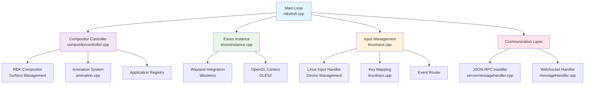
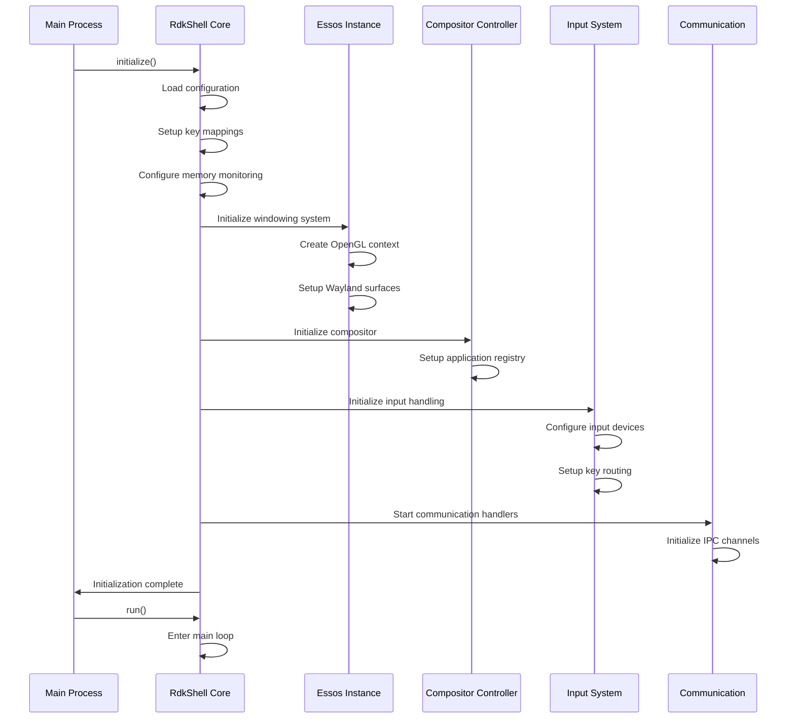
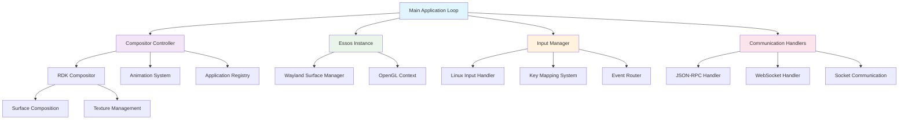

# RDK Shell 

RDKShell is a native component that serves as the foundational application management, composition, and input handling system within the RDK  ecosystem. It functions as a sophisticated window manager and compositor that provides comprehensive control over application lifecycle, display composition, and advanced input event processing for RDK powered set top boxes and TVs. integrates deeply with the Wayland display server protocol through Westeros and leverages Essos for flexible windowing system connectivity, enabling it to work seamlessly across different hardware platforms and display configurations.

!!! note
    **Wayland + Westeros + Essos**: RDKShell uses these to ensure cross-platform compatibility and modern graphics integration.

## Design

RDKShell follows a modular, event‑driven design with clear separation of concerns:



??? note "Key Architectural Principles"
    • **Event‑Driven Design** - Central main loop coordinates all subsystems through timed events and callbacks<br>
    • **Modular Components** - Each subsystem (compositor, input, communication) operates independently with well‑defined interfaces<br>
    • **Performance‑Focused** - 40 FPS rendering loop with frame rate limiting and efficient resource management<br>
    • **Cross‑Platform Compatibility** - Abstraction layers (Essos/Westeros) enable deployment across different hardware platforms<br>
    • **Extensible Communication** - Multiple IPC protocols (JSON‑RPC, WebSocket) support diverse integration scenarios<br>

### Graphics and Windowing Integration

RDKShell builds upon industry-standard graphics technologies including OpenGL ES 2.0 for hardware-accelerated rendering and the Wayland display server protocol for modern windowing system integration. Through its use of Westeros, it can create Wayland surfaces and displays that applications can connect to, while Essos provides the flexibility to connect to either native windowing systems or existing Wayland compositors depending on the deployment scenario.

!!! note
    Rendering strategies are dynamically selected based on available GPU/CPU capabilities.

The graphics integration is designed to work efficiently across a wide range of hardware capabilities, from high-end devices with dedicated GPUs to resource-constrained embedded systems. The system automatically detects available graphics capabilities and adjusts its rendering strategies accordingly to provide optimal performance while maintaining visual quality.

### Threading and Performance

The system is designed with performance as a primary consideration, implementing a carefully tuned main loop that maintains consistent frame rates while handling multiple concurrent operations. The default 40 FPS rendering loop can be adjusted based on system capabilities and requirements. Memory monitoring and other background operations are handled in separate threads to avoid impacting the critical rendering path.

!!! note
    Uses separate threads for background tasks to ensure smooth UI performance.

The threading architecture is designed to minimize contention and maximize parallelism where possible. Critical operations are prioritized to ensure responsive user interaction, while background tasks are scheduled to use available system resources without interfering with real-time requirements. The system includes sophisticated timing and synchronization mechanisms to coordinate between different subsystems.

### Extension and Plugin System

RDKShell includes a sophisticated extension system that allows for platform-specific customizations and additional functionality. The system supports Westeros plugins and includes built-in extensions for client control and extended input handling. This extensibility ensures that RDKShell can be adapted to specific hardware platforms and use cases while maintaining a consistent core architecture.

The plugin system is designed with security and stability in mind, providing isolation between different extensions and the core system. Extensions can be loaded and unloaded dynamically, enabling flexible deployment scenarios and reducing memory usage when specific functionality is not required. The system includes comprehensive APIs for extensions to interact with the core functionality while maintaining appropriate access controls.

### Configuration and Deployment Flexibility

The component supports extensive configuration through environment variables, configuration files, and runtime parameters. This includes display resolution control, memory monitoring thresholds, input device mappings, and permission systems. The configuration system is designed to support both development scenarios with extensive debugging capabilities and production deployments with optimized performance characteristics.

!!! note
    Configuration changes can be applied at runtime where possible — no reboot required.

The configuration system supports hierarchical configuration sources, allowing for system-wide defaults, platform-specific overrides, and application-specific customizations. Configuration changes can be applied at runtime where appropriate, enabling dynamic adaptation to changing system conditions and requirements without requiring system restarts.

## Core Modules

### Main Application Loop
The central component of RDKShell is the main application loop, which orchestrates all system operations through a carefully timed rendering loop that maintains consistent frame rates while processing input events, updating application states, and managing system resources. The loop operates at a configurable frame rate (default 40 FPS) and coordinates between all other subsystems.

The main loop implements sophisticated timing logic that adapts to system load while maintaining smooth visual output. It includes frame rate limiting to prevent excessive CPU usage and provides mechanisms for other subsystems to register for periodic callbacks. The loop also handles system shutdown procedures and ensures proper cleanup of all resources when the system terminates.

### Compositor Controller

The CompositorController serves as the primary interface for all application management operations. It maintains the master list of active applications, manages their z-order relationships, handles focus management, and coordinates display composition operations. This component implements the core business logic for window management including bounds calculation, visibility control, opacity management, and animation coordination.

The CompositorController provides a unified API that abstracts the complexity of the underlying graphics and windowing systems. It handles the translation between high-level application management operations and low-level graphics operations, ensuring that applications can be managed consistently regardless of the underlying hardware capabilities.

### Essos Instance Manager

The EssosInstance component provides the abstraction layer between RDKShell and the underlying windowing system. It handles the creation and management of Wayland surfaces, manages OpenGL ES contexts, and provides the rendering surface for the compositor. This component enables RDKShell to work with different windowing systems and graphics hardware through a consistent interface.

The EssosInstance manager handles the complex initialization sequences required for graphics systems and provides fallback mechanisms when specific capabilities are not available. It manages the relationship between logical displays and physical output devices, enabling support for multiple display configurations and dynamic display management.

### RDK Compositor System

The RdkCompositor hierarchy (RdkCompositor, RdkCompositorSurface, RdkCompositorNested) implements the actual display composition logic. These components handle the low-level details of surface management, texture handling, and rendering operations. They coordinate with the graphics hardware to ensure efficient composition of multiple application surfaces into the final display output.

The compositor system includes sophisticated damage tracking to minimize unnecessary redraws and optimize performance. It supports both hardware-accelerated composition when available and software fallback modes for systems with limited graphics capabilities. The system can handle complex composition scenarios including transparency, scaling, and rotation effects.

### Input Management System

The input management system consists of multiple components working together to provide comprehensive input handling. The LinuxInput component handles low-level input device management, while LinuxKeys provides key code mapping and translation. The system supports both physical input devices and virtual input generation, with sophisticated routing capabilities that allow applications to register for specific key combinations regardless of focus state.

The input system includes support for multiple input device types and provides configurable key mapping capabilities. It handles device hotplug events and can adapt to changing input device configurations at runtime. The system also provides input event filtering and transformation capabilities to support different application requirements.

### Communication Subsystem

RDKShell implements multiple communication protocols through a pluggable architecture. The ServerMessageHandler provides JSON-RPC over socket-based IPC, while the MessageHandler implements WebSocket-based communication. Both systems use the same underlying CompositorController APIs, ensuring consistent behavior across different communication methods.

The communication subsystem is designed to be extensible, allowing for the addition of new protocols and communication methods. It includes built-in security mechanisms and access control to ensure that only authorized applications can access sensitive functionality. The system supports both synchronous and asynchronous communication patterns.


## Initialization Sequence


## Component Interaction Flow



## Core Capabilities

### Application Lifecycle Management

RDKShell provides comprehensive application lifecycle management capabilities that extend beyond simple process control. It manages the complete lifecycle from application launch through suspension, resumption, and termination. The system maintains detailed state information for each managed application, including their display properties, input event subscriptions, and resource allocations. This enables sophisticated power management scenarios where applications can be suspended to conserve resources while maintaining their visual state for quick resumption.

!!! note
    Applications can register for lifecycle events to preserve state and perform cleanup during transitions.

The lifecycle management system supports both traditional application models where applications run continuously and modern power-efficient models where applications can be dynamically suspended and resumed based on user interaction patterns and system resource availability. Applications can register for lifecycle events to perform appropriate cleanup and state preservation operations during transitions.

### Advanced Display Composition

The composition engine within RDKShell handles complex multi-application display scenarios with pixel-perfect precision. It supports arbitrary positioning, scaling, rotation, and opacity control for each application window. The system can handle both traditional rectangular windows and more complex shapes through its integration with OpenGL ES 2.0 rendering pipelines. Advanced features include support for virtual displays, where applications can render to off-screen buffers for scenarios like picture-in-picture or thumbnail generation.

!!! note
    Supports both hardware-accelerated and software rendering, with fallback to software when hardware isn't available.

The compositor supports hardware-accelerated composition when available, automatically falling back to software rendering when necessary. It includes sophisticated damage tracking to minimize unnecessary redraws and optimize performance on resource-constrained devices. The system can handle multiple display outputs simultaneously, enabling scenarios where different applications are displayed on different screens or display zones.

### Sophisticated Input Event Management

RDKShell implements a highly configurable input event management system that goes far beyond simple key forwarding. Applications can register for specific key combinations even when they are not in focus, enabling global hotkey functionality and complex input routing scenarios. The system supports both physical key events from various input devices and virtual key generation for programmatic input simulation. Input event metadata is preserved and can be used for advanced input processing scenarios.

!!! note
    Global hotkeys and key remapping are supported across devices including remote controls and touch interfaces.

The input management system includes support for multiple input device types including traditional keyboards, remote controls, game controllers, and touch interfaces. It provides sophisticated key mapping capabilities that can translate between different input device protocols and key code formats. The system supports configurable key repeat rates, modifier key combinations, and complex input event filtering based on application requirements and system policies.

### Memory and Resource Monitoring

The component includes comprehensive system resource monitoring capabilities with configurable thresholds and automatic notification systems. It continuously monitors RAM usage, swap utilization, and can trigger low-memory notifications to applications and system components. This enables proactive resource management and helps prevent system instability due to resource exhaustion.

!!! note
    Applications should respond to low-memory warnings by reducing cache or suspending non-critical features.

The monitoring system operates in a separate thread to avoid impacting the main rendering loop performance. It provides both immediate notifications for critical resource conditions and periodic reports for trend analysis. Applications can register for different types of resource notifications and adjust their behavior accordingly, such as reducing cache sizes or suspending non-essential operations during low-memory conditions.

### Multi-Protocol Communication

RDKShell supports multiple communication protocols to accommodate different integration scenarios. It provides JSON-RPC APIs over both traditional socket-based IPC and modern WebSocket connections. Additionally, it offers direct C++ APIs for native code integration. This flexibility allows it to integrate with various system architectures and application frameworks commonly used in the RDK ecosystem.

!!! note
    RDKShell supports both synchronous and asynchronous APIs for efficient system communication.

The communication system is designed to be extensible, allowing for the addition of new protocols and communication methods as requirements evolve. It includes built-in security mechanisms to ensure that only authorized applications can access sensitive functionality. The system supports both synchronous and asynchronous communication patterns, enabling efficient integration with different application architectures.

## Data Flow

### Application Lifecycle

When an application is launched, the request flows through the communication layer to the CompositorController, which coordinates with the EssosInstance to create the necessary Wayland surfaces. The RdkCompositor system then manages the ongoing rendering and composition of the application's visual output. State changes are propagated back through the system to update client applications and maintain consistency.

### Input Event Processing

Input events originate from the LinuxInput system, which captures raw input from various devices. These events are processed through the key mapping system to translate hardware-specific codes into standardized key codes. The CompositorController then applies the configured input routing rules to determine which applications should receive each event, supporting both focused application delivery and global key intercepts.

### Rendering and Composition

The rendering pipeline begins with the main application loop triggering a frame update. The CompositorController coordinates with all active RdkCompositor instances to update their visual state, including position, size, opacity, and any active animations. The EssosInstance provides the OpenGL context and manages the final composition to the display surface.

## System Integration

RDKShell integrates with multiple layers of the RDK stack, from low-level graphics drivers through high-level application frameworks. It communicates with the Thunder framework for system-level coordination, integrates with various input subsystems for comprehensive input handling, and provides the foundation for application frameworks to build upon. The component's design ensures that it can adapt to different hardware capabilities while providing consistent APIs and behavior across different RDK implementations.

!!! note
    Integration interfaces are consistent across platforms, even with different display/input backends.

The integration architecture is designed to be modular and extensible, allowing for easy adaptation to new hardware platforms and software frameworks. The system provides well-defined interfaces for integration with external components while maintaining appropriate abstraction layers to ensure compatibility across different deployment scenarios.

## Use Cases and Applications

RDKShell is designed to support a wide range of use cases common in modern entertainment and smart home devices. These include traditional set-top box scenarios with multiple video applications, smart TV interfaces with app stores and content discovery, and advanced scenarios like multi-room audio/video distribution and home automation integration.

| Scenario                         | Description                                                                            |
|----------------------------------|----------------------------------------------------------------------------------------|
| Set-top boxes                    | Multi-app video playback, z-order management                                           |
| Smart TVs                        | App store navigation, content discovery, responsive UI                                |
| Multi-room AV                    | Render to off-screen buffers, distributed playback                                    |
| Home automation integration      | Input event routing, control overlay apps, support for virtual assistants and voice   |

The system's flexibility enables it to support both simple single-application scenarios and complex multi-application environments with sophisticated user interfaces. It can handle everything from basic remote control navigation to advanced touch-based interactions and voice control integration, making it suitable for a wide range of device types and user interaction models.

## Performance Considerations

**Frame Rate Management**: The architecture is designed around maintaining consistent frame rates through careful timing and resource management. The main loop includes sophisticated timing logic that adapts to system load while maintaining smooth visual output. The system can dynamically adjust frame rates based on system capabilities and current load conditions.

**Efficient Event Processing**: Input event processing is optimized to minimize latency while supporting complex routing scenarios. The system uses efficient data structures and algorithms to ensure that input responsiveness is maintained even with multiple applications and complex key intercept configurations.

**Graphics Pipeline Optimization**: The rendering pipeline is optimized for the specific requirements of set-top box and smart TV applications, with careful attention to memory bandwidth and GPU utilization patterns typical in these environments. The system includes sophisticated optimization techniques to maximize performance while maintaining visual quality.
    
## Configuration

RDKShell provides extensive configuration capabilities through environment variables, configuration files, and compile-time options. The configuration system is designed to support both development scenarios with detailed debugging capabilities and production deployments with optimized performance characteristics. The system supports hierarchical configuration sources, allowing for system-wide defaults, platform-specific overrides, and application-specific customizations.

### Environment Variables

#### Core System

| Variable | Type | Default | Description |
|----------|------|---------|-------------|
| `RDKSHELL_LOG_LEVEL` | string | "Information" | Sets the verbosity level for logging output. Valid values are "Debug", "Information", "Warn", "Error", and "Fatal". When set to "Debug", detailed runtime information is printed to help with development and troubleshooting. |
| `RDKSHELL_FRAMERATE` | integer | 40 | Controls the target frame rate for the main rendering loop. Higher values provide smoother animation but consume more CPU resources. The system will attempt to maintain this frame rate while processing input events and updating application states. |
| `RDKSHELL_ENABLE_IPC` | boolean | "0" | Enables the socket-based IPC communication system when set to "1". This allows external applications to communicate with RDKShell through JSON-RPC over Unix domain sockets. |
| `RDKSHELL_ENABLE_WS_IPC` | boolean | "0" | Enables the WebSocket-based IPC communication system when set to "1". This provides real-time bidirectional communication capabilities for web-based applications and modern client frameworks. |

#### Memory Management

| Variable | Type | Default | Description |
|----------|------|---------|-------------|
| `RDKSHELL_LOW_MEMORY_THRESHOLD` | double | 200.0 | Sets the threshold in megabytes for low memory notifications. When available system memory falls below this threshold, RDKShell will send low memory notifications to registered applications, allowing them to free up resources proactively. |
| `RDKSHELL_CRITICALLY_LOW_MEMORY_THRESHOLD` | double | 100.0 | Defines the critically low memory threshold in megabytes. When system memory falls below this level, RDKShell will send critical memory notifications and may take more aggressive resource management actions. This value must be less than or equal to the low memory threshold. |
| `RDKSHELL_SWAP_MEMORY_INCREASE_THRESHOLD` | double | 50.0 | Sets the threshold in megabytes for swap memory increase notifications. When swap usage increases by more than this amount, applications will be notified of potential memory pressure conditions. |

#### Input System

| Variable | Type | Default | Description |
|----------|------|---------|-------------|
| `RDKSHELL_KEY_INITIAL_DELAY` | integer | 500 | Configures the initial delay in milliseconds before key repeat events begin. This affects how long a user must hold a key before it starts repeating, providing control over input responsiveness and preventing accidental repeated inputs. |
| `RDKSHELL_KEY_REPEAT_INTERVAL` | integer | 100 | Sets the interval in milliseconds between key repeat events once repeating has started. Lower values result in faster key repetition, while higher values provide more controlled input for navigation scenarios. |

#### Display

| Variable | Type | Default | Description |
|----------|------|---------|-------------|
| `RDKSHELL_SET_GRAPHICS_720` | boolean | "0" | Forces the graphics system to initialize in 720p mode (1280x720) when set to "1". This is useful for devices with limited graphics capabilities or when 720p output is specifically required. The system will initialize with these dimensions regardless of the display's native resolution. |
| `RDKSHELL_SHOW_SPLASH_SCREEN` | string | undefined | When defined, enables the splash screen functionality. The splash screen provides visual feedback during system initialization and can be customized with specific images or animations. |
| `RDKSHELL_DISABLE_SPLASH_SCREEN_FILE` | string | undefined | Specifies a file path that, when present, will disable the splash screen even if `RDKSHELL_SHOW_SPLASH_SCREEN` is set. This provides a mechanism for runtime control of splash screen behavior. |

#### Plugin and Extension

| Variable | Type | Default | Description |
|----------|------|---------|-------------|
| `RDKSHELL_WESTEROS_PLUGIN_DIRECTORY` | string | "/usr/lib/plugins/westeros/" | Specifies the directory path where Westeros plugins are located. RDKShell will search this directory for compatible plugins that extend the core functionality with platform-specific features. |

### Configuration Files

#### Input Device

**File** :`inputdevices.conf`

```json
{
    "inputDevices": [
        {
            "vendor": "0x119b",
            "product": "0x2101", 
            "deviceType": "0x00",
            "deviceMode": "0x00"
        },
        {
            "vendor": "0x119b",
            "product": "0x212b",
            "deviceType": "0x01", 
            "deviceMode": "0x0f"
        },
        {
            "vendor": "0x06e7",
            "product": "0x8038",
            "deviceType": "0x02",
            "deviceMode": "0x03"
        }
    ],
    "irInputDeviceTypeMapping": [
        {
            "filterCode": 19,
            "deviceType": "0xf2"
        },
        {
            "filterCode": 20,
            "deviceType": "0xf1"
        },
        {
            "filterCode": 21,
            "deviceType": "0xf3"
        }
    ]
}
```

##### Input Device Parameters

| Parameter | Type | Description |
|-----------|------|-------------|
| `vendor` | string | USB vendor ID in hexadecimal format. This identifies the manufacturer of the input device and is used for device-specific handling and configuration. |
| `product` | string | USB product ID in hexadecimal format. Combined with the vendor ID, this uniquely identifies the specific device model and determines appropriate input handling behavior. |
| `deviceType` | string | Device type classification in hexadecimal format. This determines how the device's input events are processed and which input handling routines are applied. |
| `deviceMode` | string | Device mode configuration in hexadecimal format. This controls specific operational characteristics of the device, such as key repeat behavior and input event filtering. |

##### IR Input Device Mapping

| Parameter | Type | Description |
|-----------|------|-------------|
| `filterCode` | integer | IR filter code that identifies specific IR signal patterns. This allows the system to distinguish between different types of IR input devices and remote controls. |
| `deviceType` | string | Device type mapping for IR devices in hexadecimal format. This determines how IR input events are translated into standard input events within the system. |

#### Permissions
**File** : `rdkshellPermissions.conf`

```json
{
    "clients": [
        {
            "client": "trusted_application",
            "extensions": ["libwesteros_plugin_rdkshell_client_control.so"]
        },
        {
            "client": "system_service",
            "extensions": [
                "libwesteros_plugin_rdkshell_client_control.so",
                "libwesteros_plugin_rdkshell_extended_input.so"
            ]
        }
    ],
    "default": {
        "extensions": []
    }
}
```

##### Permission Parameters

| Parameter | Type | Description |
|-----------|------|-------------|
| `client` | string | Application identifier that matches the client name used in API calls. |
| `extensions` | array | List of extension library names that the client is permitted to use. |
| `default.extensions` | array | Default extension permissions applied to clients not explicitly listed in the configuration. |

### Compile-Time Configuration Options

#### Build Configuration Flags

| Option | Default | Description |
|--------|---------|-------------|
| `RDKSHELL_BUILD_APP` | ON | Controls whether the main RDKShell executable is built. |
| `RDKSHELL_BUILD_WEBSOCKET_IPC` | OFF | Enables WebSocket-based IPC communication support. |
| `RDKSHELL_BUILD_KEY_METADATA` | OFF | Enables extended key metadata support that provides additional information about input events. |
| `RDKSHELL_BUILD_IPC` | ON | Enables traditional socket-based IPC communication. |
| `RDKSHELL_BUILD_CLIENT` | ON | Controls whether the RDKShell client library is built. |
| `RDKSHELL_BUILD_FORCE_1080` | OFF | Enables compile-time support for forcing 1080p resolution. |
| `RDKSHELL_BUILD_ENABLE_KEYREPEATS` | OFF | Enables advanced key repeat functionality with configurable timing and behavior. |

#### Advanced Build Options

| Option | Default | Description |
|--------|---------|-------------|
| `RDKSHELL_BUILD_HIDDEN_SUPPORT` | OFF | Enables support for hidden application states. |
| `RDKSHELL_BUILD_EXTERNAL_APPLICATION_SURFACE_COMPOSITION` | ON | Enables support for compositing surfaces from external applications. |
| `RDKSHELL_BUILD_KEYBUBBING_TOP_MODE` | ON | Enables key bubbling to topmost applications. |
| `RDKSHELL_BUILD_KEY_METADATA_EXTENDED_SUPPORT_FOR_IR` | OFF | Enables extended IR support that provides additional metadata for infrared input devices. |

### Runtime Configuration

#### Memory Monitor

```cpp
// Configure memory monitoring with specific parameters
std::map<std::string, RdkShellData> config;
config["enable"] = true;
config["interval"] = 2.0;  // Check every 2 seconds
config["lowRam"] = 150.0;  // 150MB threshold
config["criticallyLowRam"] = 75.0;  // 75MB critical threshold
config["swapIncreaseLimit"] = 25.0;  // 25MB swap increase limit
RdkShell::setMemoryMonitor(config);
```

#### Dynamic Display

Display parameters can be adjusted at runtime through the API system, allowing applications to adapt to changing display conditions or user preferences. This includes resolution changes, display mode adjustments, and multi-display configuration management.

#### Input Device Runtime

Input device behavior can be modified at runtime through the input management APIs, enabling dynamic adaptation to different input scenarios and user preferences. This includes key mapping changes, device enable/disable operations, and input routing configuration.

## Key Mappings and Input Management

RDKShell implements a comprehensive key mapping system that translates between different key code formats and provides sophisticated input event routing capabilities. The system supports both Wayland key codes for low-level input handling and RDKShell virtual key codes for application-level input processing. This dual-layer approach ensures compatibility with various input devices while providing a consistent interface for applications.

The key mapping system is designed to handle the diverse input requirements of set-top box and smart TV environments, where applications must work with various remote controls, keyboards, and specialized input devices. The system provides flexible mapping capabilities that can be configured for different device types and user preferences.

### Key Code Translation System

* **Wayland Key Codes**: RDKShell uses Wayland key codes as the foundation for low-level input processing. These codes correspond directly to Linux input event codes and provide the interface between hardware input devices and the RDKShell input processing system. Wayland key codes are hardware-specific and may vary between different input devices and platforms.
* **RDKShell Virtual Key Codes**: The virtual key code system provides a standardized interface for applications, abstracting away hardware-specific details and ensuring consistent behavior across different input devices and platforms. Virtual key codes are designed to be stable across different hardware configurations and provide a consistent programming interface for application developers.

### Standard Key Mappings

#### Alphanumeric Keys

| Key | Wayland Code | RDKShell Code | Description |
|-----|--------------|---------------|-------------|
| 0 | 11 | 48 | Number zero key |
| 1 | 2 | 49 | Number one key |
| 2 | 3 | 50 | Number two key |
| 3 | 4 | 51 | Number three key |
| 4 | 5 | 52 | Number four key |
| 5 | 6 | 53 | Number five key |
| 6 | 7 | 54 | Number six key |
| 7 | 8 | 55 | Number seven key |
| 8 | 9 | 56 | Number eight key |
| 9 | 10 | 57 | Number nine key |
| A | 30 | 65 | Letter A key |
| B | 48 | 66 | Letter B key |
| C | 46 | 67 | Letter C key |
| D | 32 | 68 | Letter D key |
| E | 18 | 69 | Letter E key |
| F | 33 | 70 | Letter F key |
| G | 34 | 71 | Letter G key |
| H | 35 | 72 | Letter H key |
| I | 23 | 73 | Letter I key |
| J | 36 | 74 | Letter J key |
| K | 37 | 75 | Letter K key |
| L | 38 | 76 | Letter L key |
| M | 50 | 77 | Letter M key |
| N | 49 | 78 | Letter N key |
| O | 24 | 79 | Letter O key |
| P | 25 | 80 | Letter P key |
| Q | 16 | 81 | Letter Q key |
| R | 19 | 82 | Letter R key |
| S | 31 | 83 | Letter S key |
| T | 20 | 84 | Letter T key |
| U | 22 | 85 | Letter U key |
| V | 47 | 86 | Letter V key |
| W | 17 | 87 | Letter W key |
| X | 45 | 88 | Letter X key |
| Y | 21 | 89 | Letter Y key |
| Z | 44 | 90 | Letter Z key |

#### Function Keys

| Key | Wayland Code | RDKShell Code | Description |
|-----|--------------|---------------|-------------|
| F1 | 59 | 112 | Function key F1 |
| F2 | 60 | 113 | Function key F2 |
| F3 | 61 | 114 | Function key F3 |
| F4 | 62 | 115 | Function key F4 |
| F5 | 63 | 116 | Function key F5 |
| F6 | 64 | 117 | Function key F6 |
| F7 | 65 | 118 | Function key F7 |
| F8 | 66 | 119 | Function key F8 |
| F9 | 67 | 120 | Function key F9 |
| F10 | 68 | 121 | Function key F10 |
| F11 | 87 | 122 | Function key F11 |
| F12 | 88 | 123 | Function key F12 |
| F13 | 183 | 124 | Function key F13 |
| F14 | 184 | 125 | Function key F14 |
| F15 | 185 | 126 | Function key F15 |
| F16 | 186 | 127 | Function key F16 |
| F17 | 187 | 129 | Function key F17 |
| F18 | 188 | 130 | Function key F18 |
| F19 | 189 | 131 | Function key F19 |
| F20 | 190 | 132 | Function key F20 |
| F21 | 191 | 133 | Function key F21 |
| F22 | 192 | 134 | Function key F22 |
| F23 | 193 | 135 | Function key F23 |
| F24 | 194 | 136 | Function key F24 |

#### Navigation Keys

| Key | Wayland Code | RDKShell Code | Description |
|-----|--------------|---------------|-------------|
| Up Arrow | 103 | 38 | Directional up navigation key |
| Down Arrow | 108 | 40 | Directional down navigation key |
| Left Arrow | 105 | 37 | Directional left navigation key |
| Right Arrow | 106 | 39 | Directional right navigation key |
| Home | 102 | 36 | Home navigation key |
| End | 107 | 35 | End navigation key |
| Page Up | 104 | 33 | Page up navigation key |
| Page Down | 109 | 34 | Page down navigation key |
| Insert | 110 | 45 | Insert key |
| Delete | 111 | 46 | Delete key |

#### Control and Modifier Keys

| Key | Wayland Code | RDKShell Code | Flag Value | Description |
|-----|--------------|---------------|------------|-------------|
| Escape | 1 | 27 | - | Escape key for canceling operations |
| Tab | 15 | 9 | - | Tab key for navigation and focus control |
| Enter | 28 | 13 | - | Enter key for confirmation and line breaks |
| Space | 57 | 32 | - | Space bar for text input and selection |
| Backspace | 14 | 8 | - | Backspace key for deleting characters |
| Left Shift | 42 | 16 | 8 | Left shift modifier key |
| Right Shift | 54 | 16 | 8 | Right shift modifier key |
| Left Ctrl | 29 | 17 | 16 | Left control modifier key |
| Right Ctrl | 97 | 17 | 16 | Right control modifier key |
| Left Alt | 56 | 18 | 32 | Left alt modifier key |
| Right Alt | 100 | 18 | 32 | Right alt modifier key |
| Caps Lock | 58 | 20 | - | Caps lock toggle key |
| Num Lock | 69 | 144 | - | Numeric keypad lock toggle |
| Scroll Lock | 70 | 145 | - | Scroll lock toggle key |
| Pause | 119 | 19 | - | Pause/break key |

#### Special Media and Remote Control Keys

| Key | Wayland Code | RDKShell Code | Description |
|-----|--------------|---------------|-------------|
| Red | 0x190 | 405 | Red colored key typically found on remote controls |
| Green | 0x191 | 406 | Green colored key typically found on remote controls |
| Yellow | 0x18e | 403 | Yellow colored key typically found on remote controls |
| Blue | 0x18f | 404 | Blue colored key typically found on remote controls |
| Back | 158 | 407 | Back navigation key for returning to previous screens |
| Menu | 139 | 408 | Menu key for accessing application menus |
| Home Page | 172 | 409 | Home page key for returning to main interface |
| Volume Up | 115 | 175 | Volume increase key |
| Volume Down | 114 | 174 | Volume decrease key |
| Mute | 113 | 173 | Audio mute toggle key |
| Play/Pause | 164 | 227 | Media play/pause toggle key |
| Play | 207 | 226 | Media play key |
| Fast Forward | 208 | 223 | Media fast forward key |
| Rewind | 168 | 224 | Media rewind key |

#### Numeric Keypad

| Key | Wayland Code | RDKShell Code | Description |
|-----|--------------|---------------|-------------|
| Keypad 0 | 82 | 96 | Numeric keypad zero |
| Keypad 1 | 79 | 97 | Numeric keypad one |
| Keypad 2 | 80 | 98 | Numeric keypad two |
| Keypad 3 | 81 | 99 | Numeric keypad three |
| Keypad 4 | 75 | 100 | Numeric keypad four |
| Keypad 5 | 76 | 101 | Numeric keypad five |
| Keypad 6 | 77 | 102 | Numeric keypad six |
| Keypad 7 | 71 | 103 | Numeric keypad seven |
| Keypad 8 | 72 | 104 | Numeric keypad eight |
| Keypad 9 | 73 | 105 | Numeric keypad nine |
| Keypad Plus | 78 | 107 | Numeric keypad addition operator |
| Keypad Minus | 74 | 109 | Numeric keypad subtraction operator |
| Keypad Multiply | 55 | 106 | Numeric keypad multiplication operator |
| Keypad Divide | 98 | 111 | Numeric keypad division operator |
| Keypad Decimal | 83 | 110 | Numeric keypad decimal point |
| Keypad Enter | 96 | 13 | Numeric keypad enter key |

### Modifier Key Flags

RDKShell uses flag values to represent modifier key states that can be combined with regular key codes to create complex key combinations. These flags can be combined using bitwise OR operations to represent multiple simultaneous modifier keys.

| Modifier | Flag Value | Description |
|----------|------------|-------------|
| Shift | 8 | Shift key modifier for uppercase letters and symbol access |
| Control | 16 | Control key modifier for keyboard shortcuts and commands |
| Alt | 32 | Alt key modifier for alternative character input and shortcuts |
| Command | 64 | Command/Windows key modifier for system-level shortcuts |

#### Modifier Combination Examples

```cpp
// Ctrl+C combination
uint32_t keyCode = 67;  // C key
uint32_t flags = 16;    // Control modifier

// Ctrl+Shift+F combination  
uint32_t keyCode = 70;  // F key
uint32_t flags = 24;    // Control (16) + Shift (8)

// Alt+Tab combination
uint32_t keyCode = 9;   // Tab key
uint32_t flags = 32;    // Alt modifier

// Ctrl+Alt+Delete combination
uint32_t keyCode = 46;  // Delete key
uint32_t flags = 48;    // Control (16) + Alt (32)
```

### Input Event Processing

* **Key Event Types**: RDKShell processes two primary types of key events: key press events and key release events. Each event includes the key code, modifier flags, and timing metadata. The system maintains state information about which keys are currently pressed to support complex input scenarios and modifier key combinations.
* **Key Repeat Handling**: The system supports configurable key repeat functionality with separate settings for initial delay and repeat interval. Key repeat events are marked with a special flag to distinguish them from initial key press events. The repeat behavior can be configured globally or on a per-application basis.
```cpp
#define RDKSHELL_KEYDOWN_REPEAT 128
```
The key repeat system includes sophisticated logic to handle modifier keys correctly and ensure that repeat events are only generated for appropriate key types. Navigation keys and character keys typically support repeat, while modifier keys and special function keys do not.
* **Event Routing and Interception**: Applications can register to intercept specific key combinations even when they are not in focus. This enables global hotkey functionality and allows background applications to respond to specific input events. The interception system supports complex routing scenarios where multiple applications may be interested in the same key events. The event routing system includes priority mechanisms to ensure that critical system functions can always access required key combinations. Applications can register for different types of key interception, including exclusive access, shared access, and monitoring-only access.

### Mouse and Pointer Input

#### Mouse Button Mappings

| Button | Flag Value | Description |
|--------|------------|-------------|
| Left Button | 1 | Primary mouse button for selection and activation |
| Middle Button | 2 | Middle mouse button typically used for scrolling |
| Right Button | 4 | Secondary mouse button for context menus |

#### Pointer Event Processing

RDKShell processes pointer motion events and button press/release events, providing applications with precise cursor position information and button state changes. The system supports both absolute and relative pointer positioning and can handle multiple pointer devices simultaneously.

The pointer event system includes support for touch interfaces and gesture recognition when available. It provides coordinate transformation capabilities to support different display resolutions and scaling factors.

### Virtual Key Support

* **Virtual Key Generation**: The system supports programmatic generation of virtual key events, enabling applications to simulate user input for automation and testing scenarios. Virtual key events are processed through the same routing and interception mechanisms as physical key events.
* **Virtual Key Mapping**: Virtual keys can be mapped to physical key codes through string-based identifiers, providing a flexible interface for dynamic key mapping scenarios. This enables applications to define custom key mappings that can be configured at runtime.

## APIs

RDKShell provides multiple API interfaces to accommodate different integration scenarios and programming languages. The system supports JSON-RPC over both traditional socket-based IPC and modern WebSocket connections, as well as direct C++ APIs for native code integration. All APIs provide access to the same underlying functionality through the CompositorController interface.

### JSON-RPC API

#### Application Management

* **createDisplay**

**Method:** `org.rdk.RDKShell.1.createDisplay`

**Parameters:**
- `client` (string, required): Unique identifier for the application
- `displayName` (string, optional): Custom name for the display surface
- `displayWidth` (uint32, optional): Width of the display surface
- `displayHeight` (uint32, optional): Height of the display surface
- `virtualDisplayEnabled` (boolean, optional): Enable virtual display mode
- `virtualWidth` (uint32, optional): Virtual display width
- `virtualHeight` (uint32, optional): Virtual display height
- `topmost` (boolean, optional): Create display in topmost layer
- `focus` (boolean, optional): Give focus to the new display
- `autodestroy` (boolean, optional): Automatically destroy when client disconnects

**Response:**
```json
{
  "jsonrpc": "2.0",
  "id": "3",
  "result": {
    "success": true
  }
}
```

**Example Request:**
```json
{
  "jsonrpc": "2.0",
  "id": "3",
  "method": "org.rdk.RDKShell.1.createDisplay",
  "params": {
    "client": "netflix",
    "displayWidth": 1920,
    "displayHeight": 1080,
    "topmost": true,
    "focus": true
  }
}
```

* **launchApplication**

**Method:** `org.rdk.RDKShell.1.launchApplication`

**Parameters:**
- `client` (string, required): Application identifier
- `uri` (string, required): Application URI or path
- `mimeType` (string, required): MIME type of the application
- `topmost` (boolean, optional): Launch in topmost layer
- `focus` (boolean, optional): Give focus to launched application

**Response:**
```json
{
  "jsonrpc": "2.0",
  "id": "4",
  "result": {
    "success": true
  }
}
```

* **kill**

**Method:** `org.rdk.RDKShell.1.kill`

**Parameters:**
- `client` (string, required): Application identifier to terminate

**Response:**
```json
{
  "jsonrpc": "2.0",
  "id": "5",
  "result": {
    "success": true
  }
}
```

#### Display Management

* **getScreenResolution**
**Method:** `org.rdk.RDKShell.1.getScreenResolution`

**Parameters:** None

**Response:**
```json
{
  "jsonrpc": "2.0",
  "id": "6",
  "result": {
    "w": 1920,
    "h": 1080,
    "success": true
  }
}
```

* **setScreenResolution**
**Method:** `org.rdk.RDKShell.1.setScreenResolution`

**Parameters:**
- `w` (uint32, required): Screen width in pixels
- `h` (uint32, required): Screen height in pixels

**Response:**
```json
{
  "jsonrpc": "2.0",
  "id": "7",
  "result": {
    "success": true
  }
}
```

* **getBounds**

**Method:** `org.rdk.RDKShell.1.getBounds`

**Parameters:**
- `client` (string, required): Application identifier

**Response:**
```json
{
  "jsonrpc": "2.0",
  "id": "8",
  "result": {
    "bounds": {
      "x": 100,
      "y": 50,
      "w": 800,
      "h": 600
    },
    "success": true
  }
}
```

* **setBounds**

**Method:** `org.rdk.RDKShell.1.setBounds`

**Parameters:**
- `client` (string, required): Application identifier
- `x` (int32, required): X coordinate
- `y` (int32, required): Y coordinate
- `w` (uint32, required): Width in pixels
- `h` (uint32, required): Height in pixels

**Response:**
```json
{
  "jsonrpc": "2.0",
  "id": "9",
  "result": {
    "success": true
  }
}
```

#### Visibility and Appearance

* **getVisibility**

**Method:** `org.rdk.RDKShell.1.getVisibility`

**Parameters:**
- `client` (string, required): Application identifier

**Response:**
```json
{
  "jsonrpc": "2.0",
  "id": "10",
  "result": {
    "visible": true,
    "success": true
  }
}
```

* **setVisibility**

**Method:** `org.rdk.RDKShell.1.setVisibility`

**Parameters:**
- `client` (string, required): Application identifier
- `visible` (boolean, required): Visibility state

**Response:**
```json
{
  "jsonrpc": "2.0",
  "id": "11",
  "result": {
    "success": true
  }
}
```

* **getOpacity**

**Method:** `org.rdk.RDKShell.1.getOpacity`

**Parameters:**
- `client` (string, required): Application identifier

**Response:**
```json
{
  "jsonrpc": "2.0",
  "id": "12",
  "result": {
    "opacity": 255,
    "success": true
  }
}
```

* **setOpacity**

**Method:** `org.rdk.RDKShell.1.setOpacity`

**Parameters:**
- `client` (string, required): Application identifier
- `opacity` (uint32, required): Opacity value (0-255)

**Response:**
```json
{
  "jsonrpc": "2.0",
  "id": "13",
  "result": {
    "success": true
  }
}
```

#### Z-Order Management

* **moveToFront**

**Method:** `org.rdk.RDKShell.1.moveToFront`

**Parameters:**
- `client` (string, required): Application identifier

**Response:**
```json
{
  "jsonrpc": "2.0",
  "id": "14",
  "result": {
    "success": true
  }
}
```

* **moveToBack**

**Method:** `org.rdk.RDKShell.1.moveToBack`

**Parameters:**
- `client` (string, required): Application identifier

**Response:**
```json
{
  "jsonrpc": "2.0",
  "id": "15",
  "result": {
    "success": true
  }
}
```

* **moveBehind**

**Method:** `org.rdk.RDKShell.1.moveBehind`

**Parameters:**
- `client` (string, required): Application to move
- `target` (string, required): Application to move behind

**Response:**
```json
{
  "jsonrpc": "2.0",
  "id": "16",
  "result": {
    "success": true
  }
}
```

* **getZOrder**

**Method:** `org.rdk.RDKShell.1.getZOrder`

**Parameters:** None

**Response:**
```json
{
  "jsonrpc": "2.0",
  "id": "17",
  "result": {
    "clients": ["app1", "app2", "app3"],
    "success": true
  }
}
```

#### Focus Management

* **setFocus**

**Method:** `org.rdk.RDKShell.1.setFocus`

**Parameters:**
- `client` (string, required): Application identifier

**Response:**
```json
{
  "jsonrpc": "2.0",
  "id": "18",
  "result": {
    "success": true
  }
}
```

* **getFocused**

**Method:** `org.rdk.RDKShell.1.getFocused`

**Parameters:** None

**Response:**
```json
{
  "jsonrpc": "2.0",
  "id": "19",
  "result": {
    "client": "netflix",
    "success": true
  }
}
```

#### Input Management

* **addKeyIntercept**

**Method:** `org.rdk.RDKShell.1.addKeyIntercept`

**Parameters:**
- `client` (string, required): Application identifier
- `keyCode` (uint32, required): Key code to intercept
- `modifiers` (array, optional): Modifier keys (ctrl, shift, alt)

**Response:**
```json
{
  "jsonrpc": "2.0",
  "id": "20",
  "result": {
    "success": true
  }
}
```

**Example Request:**
```json
{
  "jsonrpc": "2.0",
  "id": "20",
  "method": "org.rdk.RDKShell.1.addKeyIntercept",
  "params": {
    "client": "netflix",
    "keyCode": 48,
    "modifiers": ["ctrl", "shift"]
  }
}
```

* **removeKeyIntercept**

**Method:** `org.rdk.RDKShell.1.removeKeyIntercept`

**Parameters:**
- `client` (string, required): Application identifier
- `keyCode` (uint32, required): Key code to remove
- `modifiers` (array, optional): Modifier keys

**Response:**
```json
{
  "jsonrpc": "2.0",
  "id": "21",
  "result": {
    "success": true
  }
}
```

#### System Information

* **getClients**

**Method:** `org.rdk.RDKShell.1.getClients`

**Parameters:** None

**Response:**
```json
{
  "jsonrpc": "2.0",
  "id": "22",
  "result": {
    "clients": ["netflix", "youtube", "settings"],
    "success": true
  }
}
```

### WebSocket API

RDKShell supports WebSocket-based communication for real-time interaction. The WebSocket API uses the same method names and parameters as the JSON-RPC API but operates over WebSocket connections for lower latency and bidirectional communication.

**Connection Endpoint:** `ws://localhost:3000`

**Message Format:**
```json
{
  "msg": "methodName",
  "params": {
    "parameter1": "value1",
    "parameter2": "value2"
  }
}
```


## Error Handling

All APIs return success/failure indicators and provide detailed error information when operations fail. Common error conditions include:

- **Invalid client identifier**: Specified application does not exist
- **Resource constraints**: Insufficient memory or graphics resources
- **Permission denied**: Application lacks required permissions
- **Invalid parameters**: Malformed or out-of-range parameter values
- **System state conflicts**: Operation conflicts with current system state

Error responses follow the JSON-RPC error format:
```json
{
  "jsonrpc": "2.0",
  "id": "23",
  "error": {
    "code": -32602,
    "message": "Invalid params",
    "data": "Client 'invalid_app' not found"
  }
}
```

## Best Practices

### Development
* Enable debug logging and extended metadata collection to facilitate troubleshooting and performance analysis.
* Use higher frame rates for smoother development experience but be aware of increased resource consumption.
* Enable additional build options that provide debugging capabilities and detailed system information.

### Production
* Use optimized logging levels and carefully tuned memory thresholds based on the specific hardware platform and application requirements.
* Disable unnecessary features to minimize resource usage and potential security exposure.
* Use conservative memory thresholds to ensure system stability under varying load conditions.

### Security
* Carefully configure the permissions system to ensure that only trusted applications have access to sensitive extensions and capabilities.
* Regularly review and update permission configurations as applications are added or removed from the system.
* Use the principle of least privilege when granting extension access to applications.

### Performance
* Configure frame rates and memory thresholds based on the specific hardware capabilities and performance requirements of the target deployment.
* Monitor system performance under typical usage scenarios and adjust configuration parameters to optimize for the specific use case and hardware platform

### Key mapping
* **Key Intercept Registration**: Applications should register for key intercepts only for the specific key combinations they need to handle globally. Excessive key intercept registrations can impact system performance and interfere with other applications. Applications should also properly remove their key intercept registrations when they are suspended or terminated.
* **Modifier Key Handling**: When processing key events with modifiers, applications should check for the specific modifier combinations they support and ignore unexpected modifier states to ensure robust input handling. Applications should also be prepared to handle cases where modifier keys are pressed or released independently of other keys.
* **Input Event Cleanup**: Applications should properly remove their key intercept registrations when they are suspended or terminated to prevent resource leaks and ensure proper input routing for other applications. The system includes automatic cleanup mechanisms, but applications should not rely solely on these mechanisms.
* **Performance Considerations**: Input event processing should be optimized to minimize latency and ensure responsive user interaction. Applications should avoid performing heavy processing in input event handlers and should use efficient data structures for key mapping and event routing operations.

