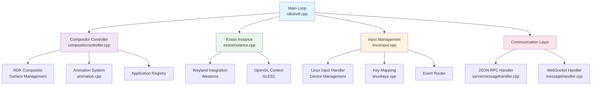
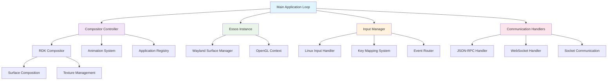
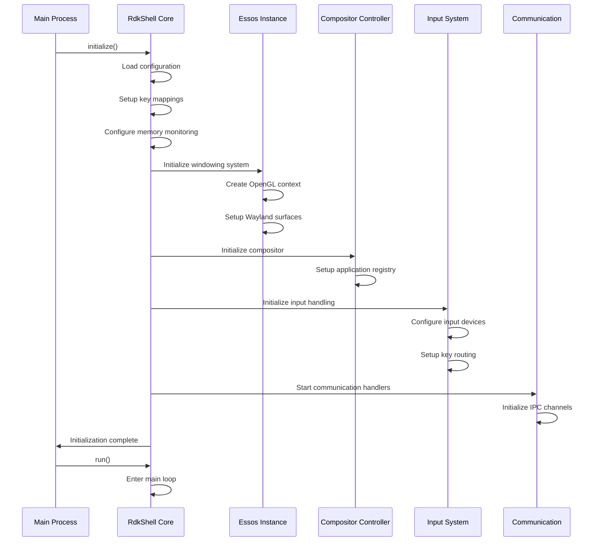

# RDKShell Architecture

## Architectural Design

RDKShell follows a modular, event‑driven architecture with clear separation of concerns:

??? note "Key Architectural Principles"
    • **Event‑Driven Design** - Central main loop coordinates all subsystems through timed events and callbacks  
    • **Modular Components** - Each subsystem (compositor, input, communication) operates independently with well‑defined interfaces  
    • **Performance‑Focused** - 40 FPS rendering loop with frame rate limiting and efficient resource management  
    • **Cross‑Platform Compatibility** - Abstraction layers (Essos/Westeros) enable deployment across different hardware platforms  
    • **Extensible Communication** - Multiple IPC protocols (JSON‑RPC, WebSocket) support diverse integration scenarios  

## Core Components

=== "Main Application Loop"

    The central component of RDKShell is the main application loop implemented in `rdkshell.cpp`. This component orchestrates all system operations through a carefully timed rendering loop that maintains consistent frame rates while processing input events, updating application states, and managing system resources. The main loop operates at a configurable frame rate (default 40 FPS) and coordinates between all other subsystems.

    The main loop implements sophisticated timing logic that adapts to system load while maintaining smooth visual output. It includes frame rate limiting to prevent excessive CPU usage and provides mechanisms for other subsystems to register for periodic callbacks. The loop also handles system shutdown procedures and ensures proper cleanup of all resources when the system terminates.

=== "Compositor Controller"

    The CompositorController serves as the primary interface for all application management operations. It maintains the master list of active applications, manages their z-order relationships, handles focus management, and coordinates display composition operations. This component implements the core business logic for window management including bounds calculation, visibility control, opacity management, and animation coordination.

    The CompositorController provides a unified API that abstracts the complexity of the underlying graphics and windowing systems. It handles the translation between high-level application management operations and low-level graphics operations, ensuring that applications can be managed consistently regardless of the underlying hardware capabilities.

=== "Essos Instance Manager"

    The EssosInstance component provides the abstraction layer between RDKShell and the underlying windowing system. It handles the creation and management of Wayland surfaces, manages OpenGL ES contexts, and provides the rendering surface for the compositor. This component enables RDKShell to work with different windowing systems and graphics hardware through a consistent interface.

    The EssosInstance manager handles the complex initialization sequences required for graphics systems and provides fallback mechanisms when specific capabilities are not available. It manages the relationship between logical displays and physical output devices, enabling support for multiple display configurations and dynamic display management.

=== "RDK Compositor System"

    The RdkCompositor hierarchy (RdkCompositor, RdkCompositorSurface, RdkCompositorNested) implements the actual display composition logic. These components handle the low-level details of surface management, texture handling, and rendering operations. They coordinate with the graphics hardware to ensure efficient composition of multiple application surfaces into the final display output.

    The compositor system includes sophisticated damage tracking to minimize unnecessary redraws and optimize performance. It supports both hardware-accelerated composition when available and software fallback modes for systems with limited graphics capabilities. The system can handle complex composition scenarios including transparency, scaling, and rotation effects.

=== "Input Management System"

    The input management system consists of multiple components working together to provide comprehensive input handling. The LinuxInput component handles low-level input device management, while LinuxKeys provides key code mapping and translation. The system supports both physical input devices and virtual input generation, with sophisticated routing capabilities that allow applications to register for specific key combinations regardless of focus state.

    The input system includes support for multiple input device types and provides configurable key mapping capabilities. It handles device hotplug events and can adapt to changing input device configurations at runtime. The system also provides input event filtering and transformation capabilities to support different application requirements.

=== "Communication Subsystem"

    RDKShell implements multiple communication protocols through a pluggable architecture. The ServerMessageHandler provides JSON-RPC over socket-based IPC, while the MessageHandler implements WebSocket-based communication. Both systems use the same underlying CompositorController APIs, ensuring consistent behavior across different communication methods.

    The communication subsystem is designed to be extensible, allowing for the addition of new protocols and communication methods. It includes built-in security mechanisms and access control to ensure that only authorized applications can access sensitive functionality. The system supports both synchronous and asynchronous communication patterns.

## Component Interaction Flow

## Data Flow Architecture

=== "Application Lifecycle Data Flow"

    When an application is launched, the request flows through the communication layer to the CompositorController, which coordinates with the EssosInstance to create the necessary Wayland surfaces. The RdkCompositor system then manages the ongoing rendering and composition of the application's visual output. State changes are propagated back through the system to update client applications and maintain consistency.

=== "Input Event Processing Flow"

    Input events originate from the LinuxInput system, which captures raw input from various devices. These events are processed through the key mapping system to translate hardware-specific codes into standardized key codes. The CompositorController then applies the configured input routing rules to determine which applications should receive each event, supporting both focused application delivery and global key intercepts.

=== "Rendering and Composition Flow"

    The rendering pipeline begins with the main application loop triggering a frame update. The CompositorController coordinates with all active RdkCompositor instances to update their visual state, including position, size, opacity, and any active animations. The EssosInstance provides the OpenGL context and manages the final composition to the display surface.

## Initialization Sequence

## Memory and Resource Management

=== "Memory Monitoring Architecture"

    RDKShell implements a sophisticated memory monitoring system that operates in a separate thread to avoid impacting the main rendering loop performance. The system continuously monitors system RAM, swap usage, and application-specific memory consumption. Configurable thresholds trigger notifications to applications and system components, enabling proactive resource management.

## Extension and Plugin Architecture

=== "Westeros Plugin Integration"

    RDKShell supports Westeros plugins that can extend the core functionality with platform-specific customizations and additional functionality. The plugin system is designed with security and stability in mind, providing isolation between different extensions and the core system. Extensions can be loaded and unloaded dynamically, enabling flexible deployment scenarios and reducing memory usage when specific functionality is not required. The system includes comprehensive APIs for extensions to interact with the core functionality while maintaining appropriate access controls.

=== "Built-in Extension System"

    The architecture includes built-in extensions for client control and extended input handling. These extensions demonstrate the plugin architecture and provide commonly needed functionality that can be enabled or disabled based on deployment requirements. The extension system is designed to be modular and allows for easy addition of new capabilities.

## Performance Considerations

=== "Frame Rate Management"

    The architecture is designed around maintaining consistent frame rates through careful timing and resource management. The main loop includes sophisticated timing logic that adapts to system load while maintaining smooth visual output. The system can dynamically adjust frame rates based on system capabilities and current load conditions.

=== "Efficient Event Processing"

    Input event processing is optimized to minimize latency while supporting complex routing scenarios. The system uses efficient data structures and algorithms to ensure that input responsiveness is maintained even with multiple applications and complex key intercept configurations.

=== "Graphics Pipeline Optimization"

    The rendering pipeline is optimized for the specific requirements of set-top box and smart TV applications, with careful attention to memory bandwidth and GPU utilization patterns typical in these environments. The system includes sophisticated optimization techniques to maximize performance while maintaining visual quality.
