# Rialto Documentation

Rialto is a media streaming framework for RDK-V (Reference Design Kit for Video) that provides a client-server architecture for audio/video playback and digital rights management (DRM). It serves as the media abstraction layer in the RDK-V middleware stack, implementing Media Source Extensions (MSE) and Encrypted Media Extensions (EME) specifications.

Rialto enables web browsers and native applications to play encrypted and unencrypted media content through a secure, isolated media server process backed by GStreamer. The framework is designed to isolate media processing and decryption from the application layer, enhancing security and enabling efficient resource management across multiple concurrent playback sessions.

Rialto fits into the RDK-V platform as a critical middleware component that sits between web runtime environments (such as WPEWebKit) and the platform GStreamer layer, managing media sessions, key management, hardware decoder allocation, and providing zero-copy data transfer through shared memory mechanisms.

```mermaid
graph TD
    subgraph "External Actors"
        U1["👤 End User<br/>(TV Viewer)"]
        U2["👨‍💻 App Developer<br/>(JavaScript/C++)"]
    end

    subgraph "Rialto Media Framework"
        CORE["🎬 Rialto Core System<br/>(Client + Server)"]
    end

    subgraph "Streaming Services"
        CDN1["📺 Netflix<br/>(MSE/DASH)"]
        CDN2["📺 YouTube<br/>(MSE/HLS)"]
        CDN3["📺 Prime Video<br/>(MSE/DASH)"]
    end

    subgraph "Platform Services"
        GST["🎵 GStreamer<br/>(Media Pipeline)"]
        OCDM["🔐 OpenCDM<br/>(DRM Interface)"]
        DRM1["🔑 Widevine CDM<br/>(Google DRM)"]
        DRM2["🔑 PlayReady<br/>(Microsoft DRM)"]
        WEST["📺 Westeros<br/>(Wayland Compositor)"]
    end

    subgraph "Hardware"
        HW1["💾 Shared Memory<br/>(/dev/shm)"]
        HW2["🎥 Video Decoder<br/>(V4L2/OpenMAX)"]
        HW3["🔊 Audio DSP<br/>(ALSA/SOC)"]
    end

    %% User interactions
    U1 -->|"Remote Control<br/>Input"| CORE
    U2 -->|"Rialto Client API<br/>(IMediaPipeline, IMediaKeys)"| CORE

    %% External service integrations
    CDN1 -->|"HTTPS GET<br/>(Encrypted MP4/WebM)"| CORE
    CDN2 -->|"HTTPS GET<br/>(Encrypted TS/MP4)"| CORE
    CDN3 -->|"HTTPS GET<br/>(Encrypted MP4)"| CORE

    %% Platform integrations
    CORE <-->|"GStreamer API<br/>(gst_element_*, pipelines)"| GST
    CORE <-->|"OpenCDM API<br/>(opencdm_*)"| OCDM
    OCDM <-->|"CDM Interface<br/>(DecryptBuffer)"| DRM1
    OCDM <-->|"CDM Interface<br/>(DecryptBuffer)"| DRM2
    CORE -->|"Wayland Protocol<br/>(wl_surface, video_window)"| WEST

    %% Hardware access
    CORE <-->|"mmap/memcpy<br/>(Media Buffers)"| HW1
    GST -->|"V4L2 IOCTL<br/>(VIDIOC_QBUF)"| HW2
    GST -->|"ALSA API<br/>(snd_pcm_*)"| HW3

    %% Styling
    classDef userStyle fill:#e1f5ff,stroke:#01579b,stroke-width:2px
    classDef coreStyle fill:#fff9c4,stroke:#f57f17,stroke-width:3px
    classDef streamingStyle fill:#f3e5f5,stroke:#4a148c,stroke-width:2px
    classDef platformStyle fill:#e8f5e9,stroke:#1b5e20,stroke-width:2px
    classDef hardwareStyle fill:#ffebee,stroke:#b71c1c,stroke-width:2px

    class U1,U2 userStyle
    class CORE coreStyle
    class CDN1,CDN2,CDN3 streamingStyle
    class GST,OCDM,DRM1,DRM2,WEST platformStyle
    class HW1,HW2,HW3 hardwareStyle
```

### External Integration Points

| System | Protocol | Purpose | Example Data |
|--------|----------|---------|--------------|
| **Netflix/YouTube** | HTTPS | Fetch encrypted media segments | GET /chunk_123.m4s (encrypted MP4) |
| **GStreamer** | C API | Media decoding/rendering | `gst_element_set_state(GST_STATE_PLAYING)` |
| **OpenCDM** | C API | DRM decryption | `opencdm_session_decrypt(buffer, key_id)` |
| **Widevine/PlayReady** | Binary Interface | Content decryption | License acquisition, key rotation |
| **Westeros** | Wayland Protocol | Video compositing | `wl_surface_attach(video_buffer)` |
| **Shared Memory** | mmap | Zero-copy buffer transfer | `/dev/shm/rialto_session_1` (16MB buffers) |

---

**Key Features & Responsibilities**: 

- **Media Source Extensions (MSE) Implementation**: Provides complete MSE API support enabling adaptive streaming protocols (HLS, DASH) through media source attachment, source buffer management, and append operations for segmented media delivery.

- **Encrypted Media Extensions (EME) Integration**: Implements EME specification with support for multiple DRM systems (Widevine, PlayReady) through OCDM, managing key sessions, license acquisition, and secure decryption pipelines.

- **Client-Server Architecture**: Isolates media processing in dedicated RialtoServer processes, enabling security sandboxing, resource isolation, crash recovery, and multi-session management with independent lifecycle control.

- **IPC Communication Framework**: Custom protobuf-based IPC library using Unix domain sockets for low-latency RPC calls, asynchronous events, file descriptor passing, and zero-copy shared memory data transfer.

- **GStreamer Pipeline Management**: Abstracts GStreamer complexity by managing pipeline creation, element configuration, state transitions, buffer submission, position queries, and event handling for audio/video playback.

- **Session Server Management**: Manages RialtoServer process lifecycle including on-demand spawning, health monitoring, resource allocation, socket management, and graceful shutdown with configurable preloading support.

- **Multi-Session Support**: Enables concurrent playback sessions from multiple clients with isolated pipelines, independent state management, resource quotas, and session-specific event delivery.

- **Web Audio Player**: Provides dedicated Web Audio API implementation for low-latency audio playback supporting PCM data submission, real-time processing, and precise timing control.

## Design

Rialto employs a multi-process client-server architecture to achieve strong security isolation between untrusted application code and privileged media operations. The design principle is to minimize the trusted computing base by isolating all GStreamer interaction, hardware decoder access, and DRM operations within a dedicated server process (RialtoServer) that runs with minimal privileges.

The client library (libRialtoClient.so) provides a clean C++ API implementing MSE and EME specifications, translating high-level media operations into protobuf messages sent over Unix domain sockets. The ServerManager acts as a process supervisor, spawning RialtoServer instances on-demand, assigning unique sockets per client, monitoring health through periodic pings, and performing automatic recovery on failures. Each RialtoServer instance hosts a GStreamer pipeline factory that creates isolated playback contexts for concurrent sessions, managing decoder allocation, buffer queuing, and event propagation back to clients.

The north-bound interface consists of C++ factory patterns and interface classes (IMediaPipeline, IMediaKeys, IWebAudioPlayer) consumed by WPEWebKit or native applications. The south-bound interface wraps GStreamer APIs, OCDM for DRM, and platform-specific utilities (RDK GStreamer Utils) for compositor integration. Thread safety is achieved through internal event dispatchers and serialized message processing on both client and server sides.

Data persistence is minimal—session state resides in memory within RialtoServer processes. Configuration is sourced from environment variables (GST_REGISTRY path, XDG_RUNTIME_DIR) and build-time CMake options. The ServerManager stores socket paths and process handles, but does not persist across reboots. Logging leverages a configurable multi-level system (FATAL, ERROR, WARN, MIL, INFO, DEBUG) with compile-time enablement flags.

IPC integration uses a custom protobuf library optimized for RPC services, supporting method calls with responses, asynchronous event streams, and file descriptor passing for shared memory handles. Messages are serialized using Google Protocol Buffers (minimum v3.6) and transported over SOCK_SEQPACKET Unix domain sockets, ensuring message boundaries and in-order delivery. The design avoids gRPC due to requirements for file descriptor passing and client association tracking.

### Prerequisites and Dependencies

**RDK-V Platform and Integration Requirements (MUST):**

- **DISTRO Features**: `DISTRO_FEATURES += "rialto"`, media playback support, DRM integration (Widevine or PlayReady)
- **Build Dependencies**: 
  - `meta-rdk-video` Yocto layer
  - Google Protocol Buffers compiler (protoc) >= 3.6
  - GStreamer development libraries >= 1.14
  - C++17 compliant compiler (GCC >= 8.0, Clang >= 7.0)
  - CMake >= 3.10
- **RDK-V Components**: 
  - WPEWebKit (consumes Rialto client library)
  - OCDM (OpenCDM for DRM key management)
  - RDK GStreamer Utils (platform compositor integration)
  - WPE Framework (optional, for Thunder plugin integration)
- **HAL Dependencies**: 
  - Video decoder HAL (V4L2 or OpenMAX IL)
  - Audio output HAL (ALSA or PulseAudio)
  - Hardware DRM/TEE interface for secure key storage
- **Systemd Services**: 
  - `wpeframework.service` (if using Thunder integration) must start before applications
  - Graphics compositor (Wayland/Westeros) must be active
- **Configuration Files**: 
  - GStreamer registry cache location: `/tmp/rialto-server-gstreamer-cache.bin` (configurable via `GST_REGISTRY` env var)
  - Runtime directory: `/tmp` (configurable via `XDG_RUNTIME_DIR`)
  - Socket permissions: default `666` (configurable at build time)
- **Startup Order**: 
  1. Graphics compositor initialization
  2. WPE Framework (if used)
  3. OCDM service availability
  4. Rialto ServerManager launch (on-demand or preloaded)
  5. Application/browser startup

**Threading Model** 

Rialto employs a hybrid threading model combining event-driven architectures with worker thread pools for asynchronous operations and blocking I/O.

- **Threading Architecture**: Multi-threaded with event-driven message dispatch on both client and server
- **Client Library Threads**:
  - **Main Application Thread**: Client API calls are typically invoked from application threads (e.g., WPEWebKit media thread). Calls are serialized and dispatched to the IPC layer.
  - **IPC Event Thread**: Dedicated event thread (`EventThread`) monitors Unix domain socket for incoming responses and asynchronous events from the server. Deserializes protobuf messages and invokes registered callbacks.
  - **Callback Dispatch Thread**: Client callbacks (`IMediaPipelineClient`, `IMediaKeysClient`) are invoked on the event thread. Applications must ensure thread-safe handling if callbacks touch shared state.
- **Server Manager Threads**:
  - **Main Thread**: Handles IPC requests from applications for session creation, manages process spawning, and socket assignment.
  - **Health Monitor Thread**: Periodic timer-based thread sends ping messages to each RialtoServer instance and tracks responses. Initiates recovery on timeout (configurable `NUM_OF_PINGS_BEFORE_RECOVERY`).
- **Rialto Server Threads**:
  - **IPC Server Thread**: Main event loop processes incoming RPC calls from clients, deserializes protobuf messages, and dispatches to service implementations (`MediaPipelineService`, `MediaKeysService`).
  - **GStreamer Main Loop Thread**: Each playback session may run a GLib main loop for GStreamer message bus processing, handling pipeline state changes, EOS, errors, and buffering events.
  - **Worker Threads**: GStreamer may spawn internal threads for demuxing, decoding (depending on decoder plugin), and rendering. These are managed by GStreamer and platform-specific elements.
  - **Decryption Threads**: OCDM may use internal threads for secure processing and interaction with TEE/DRM hardware.
- **Synchronization**: 
  - Mutex-based locking protects shared session state within RialtoServer
  - Atomic reference counting for object lifetime management
  - Message queues for cross-thread event delivery
  - GStreamer bus watches for pipeline event serialization

### Component State Flow

**Initialization to Active State**

Rialto components transition through distinct lifecycle states from system startup to active media playback. The ServerManager initializes first, preloading RialtoServer processes if configured (`NUM_OF_PRELOADED_SERVERS`). When an application creates a media pipeline, the client library requests a session from ServerManager, which assigns a socket and spawns or reuses a server process. The RialtoServer initializes GStreamer, registers IPC services, and transitions to ACTIVE state. Clients then attach media sources, configure DRM (if needed), and begin playback operations.

```mermaid
sequenceDiagram
    participant System as System Startup
    participant App as Application
    participant ClientLib as Rialto Client Library
    participant ServerMgr as Server Manager
    participant Server as Rialto Server
    participant GStreamer as GStreamer

    System->>ServerMgr: Launch ServerManager Process
    Note over ServerMgr: State: UNINITIALIZED → INACTIVE
    ServerMgr->>ServerMgr: Load Configuration (env vars)
    ServerMgr->>ServerMgr: Initialize Socket Manager
    opt Preload Servers (NUM_OF_PRELOADED_SERVERS > 0)
        ServerMgr->>Server: Spawn Preloaded Server(s)
        Server->>GStreamer: Initialize GStreamer (gst_init)
        Server->>ServerMgr: Ready (State: ACTIVE)
    end
    Note over ServerMgr: State: INACTIVE → ACTIVE
    
    App->>ClientLib: Create MediaPipeline (IMediaPipelineFactory)
    ClientLib->>ClientLib: Initialize IPC Client Channel
    ClientLib->>ServerMgr: Request Session (SetConfiguration RPC)
    Note over ServerMgr: Assign unique socket for client
    
    alt No Preloaded Server Available
        ServerMgr->>Server: Spawn New RialtoServer Process
        Server->>Server: Initialize Logging, IPC Server
        Server->>GStreamer: Initialize GStreamer (gst_init)
        Server->>Server: Register IPC Services (MediaPipeline, MediaKeys)
        Note over Server: State: UNINITIALIZED → ACTIVE
    end
    
    ServerMgr-->>ClientLib: Session Socket Path
    ClientLib->>Server: Connect to Session Socket
    Server-->>ClientLib: Connection Established
    ClientLib->>Server: CreateSession RPC (max_width, max_height)
    Server->>Server: Create MediaPipelineService Instance
    Server->>GStreamer: Prepare Pipeline Resources
    Server-->>ClientLib: Session ID
    Note over ClientLib: State: Initialized → Ready
    
    ClientLib-->>App: IMediaPipeline Instance (Active)
    
    loop Runtime Operations
        App->>ClientLib: AttachSource, Load, Play, etc.
        ClientLib->>Server: RPC Calls (Protobuf)
        Server->>GStreamer: Pipeline Operations
        Server-->>ClientLib: Events (State Changes, Position Updates)
        ClientLib-->>App: Callbacks (IMediaPipelineClient)
    end
    
    App->>ClientLib: Destroy MediaPipeline
    ClientLib->>Server: DestroySession RPC
    Server->>GStreamer: Cleanup Pipeline, Free Resources
    Server-->>ClientLib: Session Destroyed
    Note over Server: Idle (reusable or shutdown after timeout)
```

**Runtime State Changes and Context Switching**

During normal operation, Rialto components respond to various runtime triggers that cause state transitions or operational context changes.

**State Change Triggers:**

- **Application-Initiated**: `load()`, `play()`, `pause()`, `stop()` API calls trigger GStreamer pipeline state changes (NULL → READY → PAUSED → PLAYING and reverse).
- **Pipeline Events**: GStreamer bus messages (EOS, ERROR, BUFFERING, STATE_CHANGED) propagate to MediaPipelineService, which updates internal state and notifies clients via asynchronous events.
- **DRM License Updates**: `updateSession()` calls on MediaKeys trigger OCDM key status changes, potentially affecting pipeline readiness for encrypted content.
- **Health Monitor**: ServerManager pings detect unresponsive servers, triggering state transition to ERROR and initiating process recovery (respawn).
- **Resource Exhaustion**: Exceeding configured `maxPlaybacks` or `maxWebAudioPlayers` causes session creation failure, returning error to client.
- **Socket Disconnection**: Client process termination or socket closure triggers automatic session cleanup in RialtoServer, releasing pipeline resources.

**Context Switching Scenarios:**

- **Multi-Session Switching**: When multiple clients share a single RialtoServer, the server maintains isolated `GenericPlayer` instances per session. Context switches occur on RPC dispatch, with each call routed to the corresponding session's pipeline.
- **Configuration Updates**: `setLogLevels()` RPC dynamically adjusts logging verbosity across all Rialto modules without requiring restart.
- **Failover and Recovery**: On server crash or hang, ServerManager detects failure via health pings, terminates the unresponsive process, spawns a replacement, and notifies affected clients with connection loss events. Clients may retry session creation to recover playback.
- **Mode Changes**: Transitioning from clear (unencrypted) to encrypted playback involves attaching `MediaKeys` to the pipeline, installing OCDM decrypt elements, and updating pipeline graph before resuming playback.

### Call Flow

**Initialization Call Flow:**

**Request Processing Call Flow (AttachSource + Play):**

## Internal Modules

Rialto is organized into modular subsystems, each with well-defined responsibilities. The client-side modules provide API abstractions and IPC communication, while server-side modules handle media pipeline orchestration, DRM integration, and GStreamer interaction.

| Module/Class | Description | Key Files |
|-------------|------------|-----------|
| **MediaPipeline Client** | Implements IMediaPipeline interface for client applications, translates API calls to protobuf RPC messages, manages session lifecycle, and dispatches asynchronous events to application callbacks. | `media/client/main/source/MediaPipeline.cpp`, `media/client/ipc/source/MediaPipelineIpc.cpp` |
| **MediaKeys Client** | Implements IMediaKeys interface for EME/DRM operations, manages key sessions, license requests, and key status updates via OCDM backend through IPC. | `media/client/main/source/MediaKeys.cpp`, `media/client/ipc/source/MediaKeysIpc.cpp` |
| **WebAudioPlayer Client** | Provides Web Audio API implementation for low-latency PCM audio playback, supports buffer submission, play/pause control, and volume management. | `media/client/main/source/WebAudioPlayer.cpp`, `media/client/ipc/source/WebAudioPlayerIpc.cpp` |
| **IPC Client Library** | Generic protobuf-based IPC client using Unix domain sockets, supports RPC method calls, asynchronous event subscription, file descriptor passing for shared memory. Receives responses and events from server. | `ipc/client/source/IpcClient.cpp`, `ipc/client/source/IpcChannel.cpp` |
| **Server Manager** | Process supervisor managing RialtoServer lifecycle: spawns servers on-demand, assigns unique sockets per client, monitors health via periodic pings, handles crash recovery, and enforces resource limits (max sessions). | `serverManager/service/source/SessionServerManager.cpp`, `serverManager/service/source/ServiceContext.cpp` |
| **IPC Server Library** | Generic protobuf-based IPC server listening on Unix domain sockets, dispatches incoming RPC calls to registered services, sends asynchronous events to clients, manages client connections and socket lifecycle. | `ipc/server/source/IpcServer.cpp`, `ipc/server/source/IpcServerFactory.cpp` |
| **MediaPipelineService** | Server-side RPC implementation of MediaPipeline protocol, orchestrates GenericPlayer instances per session, handles source attachment, playback control, buffer submission, position queries, and propagates pipeline events to clients. | `media/server/service/source/MediaPipelineService.cpp`, `media/server/service/source/SessionServerManager.cpp` |
| **MediaKeysService** | Server-side RPC implementation of MediaKeys protocol, integrates with OCDM for DRM key management, handles license requests, key updates, and manages MediaKeySession lifecycle. | `media/server/service/source/MediaKeysService.cpp`, `media/server/service/source/MediaKeysServerInternal.cpp` |
| **GenericPlayer** | Core playback state machine managing GStreamer pipeline lifecycle, implements playback operations (load, play, pause, stop), handles pipeline events (EOS, error, buffering), and coordinates buffer submission via GstPlayer. | `media/server/main/source/GenericPlayer.cpp`, `media/server/main/source/GenericPlayerContext.cpp` |
| **GstPlayer / GstPlayerEngine** | Low-level GStreamer abstraction encapsulating pipeline construction, element creation (appsrc, decoders, sinks), caps negotiation, buffer injection, and event handling. Isolates GStreamer API complexity from higher layers. | `media/server/gstplayer/source/GstGenericPlayer.cpp`, `media/server/gstplayer/source/GstWebAudioPlayer.cpp` |
| **Decryption Service** | Integrates OCDM (OpenCDM) for encrypted content handling, creates MediaKeySession instances, submits license requests to DRM servers, installs decrypt elements in GStreamer pipeline, and manages key expiration. | `media/server/main/source/DecryptionService.cpp`, `media/server/service/source/MediaKeysServerInternal.cpp` |
| **Shared Memory Manager** | Manages shared memory regions for zero-copy media buffer transfer between client and server, handles file descriptor passing over IPC, maps memory in both processes, and coordinates buffer lifecycle. | `media/server/main/source/SharedMemoryBuffer.cpp` |
| **Capabilities Modules** | Query platform capabilities (supported codecs, DRM systems, container formats) from GStreamer and OCDM, exposed via IMediaPipelineCapabilities and IMediaKeysCapabilities APIs for client-side codec negotiation. | `media/server/service/source/MediaPipelineCapabilities.cpp`, `media/server/service/source/MediaKeysCapabilities.cpp` |
| **Common Utilities** | Shared infrastructure including EventThread (event loop abstraction), Timer (periodic callbacks), LinuxUtils (process/system utilities), and logging framework with compile-time verbosity control. | `common/source/EventThread.cpp`, `common/source/Timer.cpp`, `common/source/LinuxUtils.cpp` |
| **Protocol Definitions** | Protobuf `.proto` files defining RPC service interfaces, message structures, and enumerations for MediaPipeline, MediaKeys, ServerManager, and WebAudioPlayer modules. Compiled into C++ stub code. | `proto/mediapipelinemodule.proto`, `proto/mediakeysmodule.proto`, `proto/servermanagermodule.proto` |

## Component Interactions

Rialto interacts extensively with external RDK-V middleware components, platform services, and hardware abstraction layers to deliver end-to-end media playback and DRM functionality.

```mermaid
flowchart TD
    subgraph ExternalApps["External Applications"]
        WPEWebKit["🌐 WPEWebKit<br/>(Browser Engine)"]
        NativeApps["📱 Native RDK Apps"]
    end
    
    subgraph RialtoComponents["Rialto Middleware"]
        RialtoClientLib["📦 Rialto Client Library"]
        ServerManager["⚙️ Server Manager"]
        RialtoServer["🎬 Rialto Server"]
    end
    
    subgraph RDKVMiddleware["RDK-V Middleware Components"]
        OCDM["🔐 OCDM<br/>(OpenCDM)"]
        RDKGstUtils["🎵 RDK GStreamer Utils"]
        Thunder["⚡ Thunder Framework<br/>(Optional)"]
    end
    
    subgraph PlatformServices["Platform Services"]
        GStreamer["🎬 GStreamer Framework"]
        Wayland["🖥️ Wayland/Westeros<br/>(Compositor)"]
        SystemD["⚙️ SystemD<br/>(Process Manager)"]
    end
    
    subgraph HALLayer["Hardware Abstraction Layer"]
        VideoHAL["🎥 Video Decoder HAL<br/>(V4L2/OpenMAX)"]
        AudioHAL["🔊 Audio HAL<br/>(ALSA)"]
        DRMHAL["🔐 DRM/TEE Hardware"]
    end
    
    subgraph ExternalServices["External Services"]
        LicenseServer["🔑 DRM License Server"]
    end

    WPEWebKit -->|"IMediaPipeline API<br/>(C++ Interface)"| RialtoClientLib
    NativeApps -->|"IMediaPipeline API<br/>(C++ Interface)"| RialtoClientLib
    RialtoClientLib -->|"Protobuf RPC<br/>(Unix Socket)"| ServerManager
    RialtoClientLib -->|"Protobuf RPC<br/>(Unix Socket)"| RialtoServer
    
    ServerManager -.->|"Process Control<br/>(fork/exec, signals)"| SystemD
    
    RialtoServer -->|"gst_element_*<br/>(Pipeline API)"| GStreamer
    RialtoServer -->|"OpenCDM API<br/>(Key Sessions)"| OCDM
    RialtoServer -->|"RDK Utils API<br/>(Compositor Integration)"| RDKGstUtils
    RialtoServer -.->|"Thunder IPC<br/>(Optional)"| Thunder
    
    OCDM -->|"DRM API<br/>(TEE Calls)"| DRMHAL
    OCDM -.->|"HTTPS<br/>(License Request)"| LicenseServer
    
    GStreamer -->|"V4L2 IOCTL"| VideoHAL
    GStreamer -->|"ALSA API"| AudioHAL
    RDKGstUtils -->|"Wayland Protocol"| Wayland
    
    classDef external fill:#fff3e0,stroke:#ef6c00,stroke-width:2px;
    classDef rialto fill:#e1f5fe,stroke:#0277bd,stroke-width:2px;
    classDef rdkv fill:#f3e5f5,stroke:#7b1fa2,stroke-width:2px;
    classDef platform fill:#e8f5e8,stroke:#2e7d32,stroke-width:2px;
    classDef hal fill:#fce4ec,stroke:#c2185b,stroke-width:2px;
    classDef service fill:#fff9c4,stroke:#f57f17,stroke-width:2px;
    
    class WPEWebKit,NativeApps external;
    class RialtoClientLib,ServerManager,RialtoServer rialto;
    class OCDM,RDKGstUtils,Thunder rdkv;
    class GStreamer,Wayland,SystemD platform;
    class VideoHAL,AudioHAL,DRMHAL hal;
    class LicenseServer service;
```

### Interaction Matrix

| Target Component/Layer | Interaction Purpose | Key APIs/Endpoints |
|------------------------|-------------------|------------------|
| **RDK-V Middleware Components** |
| WPEWebKit | Rialto provides MSE/EME backend for HTML5 video playback in browser, enabling adaptive streaming and DRM content | `IMediaPipelineFactory::createMediaPipeline()`, `IMediaKeysFactory::createMediaKeys()`, `attachSource()`, `play()`, `pause()` |
| OCDM (OpenCDM) | DRM key management and license acquisition for encrypted content playback, creates key sessions and handles decryption | `opencdm_construct_session()`, `opencdm_session_update()`, `opencdm_gstreamer_session_decrypt()` |
| RDK GStreamer Utils | Platform-specific compositor integration for video rendering, provides custom GStreamer elements for Wayland/Westeros sinks | `rdk_gstreamer_utils_get_video_sink()`, `rdk_gstreamer_utils_configure_pipeline()` |
| Thunder Framework | Optional integration for component lifecycle management, configuration, and inter-process communication via Thunder plugin architecture | Thunder COM-RPC interfaces (if enabled) |
| **System & Platform Services** |
| GStreamer Framework | Core media framework for pipeline construction, codec negotiation, buffer flow, and hardware decoder integration | `gst_init()`, `gst_element_factory_make()`, `gst_element_set_state()`, `gst_app_src_push_buffer()`, `gst_bus_add_watch()` |
| Wayland/Westeros | Graphics compositor for video surface presentation, window management, and display synchronization | Wayland protocol messages, `wl_surface`, `wl_compositor` interfaces |
| SystemD | Process lifecycle management, service startup ordering, watchdog monitoring, and resource limits | Service file `rialto-server-manager.service`, `sd_notify()` for readiness signaling |
| **Hardware Abstraction Layer** |
| Video Decoder HAL | Hardware video decoding (H.264, H.265, VP9), frame buffer allocation, and render synchronization | V4L2 IOCTL (`VIDIOC_*` commands) or OpenMAX IL (`OMX_*` API) |
| Audio HAL | Audio output routing, PCM playback, volume control, and audio synchronization | ALSA API (`snd_pcm_*`) or PulseAudio client API |
| DRM/TEE Hardware | Secure key storage, hardware-backed decryption, and Trusted Execution Environment (TEE) operations for content protection | Platform-specific DRM HAL, TEE client API, secure memory allocation |
| **External Services** |
| DRM License Server | Remote license acquisition for Widevine, PlayReady, or other DRM systems, provides decryption keys in response to challenge messages | HTTPS POST to license server URL (configured by application) with protobuf or JSON payloads |

**Events Published by Rialto:**

| Event Name | Event Topic/Path | Trigger Condition | Subscriber Components |
|------------|-----------------|-------------------|---------------------|
| PlaybackStateChangeEvent | `firebolt.rialto.PlaybackStateChangeEvent` (IPC) | GStreamer pipeline state changes (IDLE, BUFFERING, PLAYING, PAUSED, STOPPED, END_OF_STREAM, FAILURE) | WPEWebKit, Native Applications (via IMediaPipelineClient callback) |
| PositionChangeEvent | `firebolt.rialto.PositionChangeEvent` (IPC) | Periodic position updates during playback (configurable interval) | Applications for progress bar updates |
| NetworkStateChangeEvent | `firebolt.rialto.NetworkStateChangeEvent` (IPC) | Network buffering state changes, connectivity issues, or stream underrun/overrun | Applications for buffering UI indicators |
| QosEvent | `firebolt.rialto.QosEvent` (IPC) | Quality-of-Service metrics (frames dropped, bitrate, buffer levels) | Applications for adaptive bitrate decisions |
| BufferUnderflowEvent | `firebolt.rialto.BufferUnderflowEvent` (IPC) | Source buffer underflow detected, needs more data | Applications to submit additional media segments |
| PlaybackErrorEvent | `firebolt.rialto.PlaybackErrorEvent` (IPC) | Pipeline errors (decoder failure, unsupported format, DRM errors) | Applications for error handling and user notification |
| SourceFlushedEvent | `firebolt.rialto.SourceFlushedEvent` (IPC) | Source buffer flush completed after seek or discontinuity | Applications to resume data submission post-seek |
| KeyStatusChangeEvent | `firebolt.rialto.MediaKeyStatusChangeEvent` (IPC) | DRM key status updates (USABLE, EXPIRED, OUTPUT_RESTRICTED, INTERNAL_ERROR) | Applications (via IMediaKeysClient callback) for license renewal or playback restrictions |

### IPC Flow Patterns

**Primary IPC Flow - Media Playback Session Creation:**

**Event Notification Flow - Playback State Change:**

**Shared Memory Buffer Transfer Flow:**

## Implementation Details

### Major HAL APIs Integration

Rialto does not directly call HAL APIs; instead, it leverages GStreamer plugins that encapsulate platform-specific HAL interactions. The table below describes the key HAL interfaces utilized indirectly through GStreamer elements.

**Core HAL APIs (via GStreamer Plugins):**

| HAL API | Purpose | Implementation File |
|---------|---------|-------------------|
| **V4L2 Video Decoder** (`VIDIOC_QUERYCAP`, `VIDIOC_S_FMT`, `VIDIOC_QBUF`, `VIDIOC_DQBUF`) | Hardware video decoding for H.264, H.265, VP9 codecs; manages decoder initialization, buffer submission, and decoded frame retrieval | GStreamer `v4l2` plugin (platform-provided, e.g., `gst-plugins-good`) or vendor-specific decoder plugins |
| **OpenMAX IL** (`OMX_GetHandle`, `OMX_SetParameter`, `OMX_EmptyThisBuffer`, `OMX_FillThisBuffer`) | Alternative hardware decoder interface on platforms using OpenMAX, provides similar decode functionality with OMX component architecture | GStreamer `omx` plugin (platform-provided, e.g., `gst-omx`) |
| **ALSA PCM** (`snd_pcm_open`, `snd_pcm_hw_params`, `snd_pcm_writei`, `snd_pcm_drain`) | Audio output for decoded PCM streams, handles audio device configuration, buffer writes, and synchronization | GStreamer `alsasink` element (`gst-plugins-base`) or platform audio sink plugins |
| **DRM/TEE API** (platform-specific secure APIs, e.g., `TEE_OpenSession`, `TEE_InvokeCommand`) | Secure key storage, decryption in Trusted Execution Environment, hardware-backed content protection | OCDM library (`libRialtoOcdm.so`) integrates with platform DRM HAL, invoked by Rialto via OCDM API |
| **Wayland/Westeros Protocol** (`wl_compositor_create_surface`, `wl_surface_attach`, `wl_surface_commit`) | Video frame presentation to compositor, manages video overlay or texture surfaces for rendering | RDK GStreamer Utils / Westeros sink plugin, invoked by GStreamer pipeline configured by Rialto |

### Key Implementation Logic

- **State Machine Engine**: GenericPlayer implements the core playback state machine managing transitions between IDLE, BUFFERING, PLAYING, PAUSED, STOPPED, END_OF_STREAM, and FAILURE states. State transitions are triggered by application API calls (play, pause, stop) and GStreamer pipeline events (state change messages, EOS, errors). 

  - Main implementation in `media/server/main/source/GenericPlayer.cpp` 
  - State transition handlers in `media/server/main/source/GenericPlayerContext.cpp` (transition validation logic)
  
- **Event Processing**: GStreamer bus messages (STATE_CHANGED, EOS, ERROR, BUFFERING, QOS) are monitored via `gst_bus_add_watch()` callback. The callback runs on GStreamer's main loop thread, extracting message details and dispatching to GenericPlayer's event handlers. These handlers update internal state, trigger client notifications via IPC asynchronous events, and coordinate pipeline control actions. 

  - Hardware interrupt handling: Not directly handled by Rialto; decoder/audio HAL plugins manage hardware interrupts internally 
  - Event queue management: GLib main loop processes GStreamer messages; Rialto queues client notifications for IPC thread delivery 
  - Asynchronous event processing: IPC server publishes events to client sockets; client event thread deserializes and invokes application callbacks 

- **Error Handling Strategy**: Errors are categorized into recoverable (buffering underflow, temporary network loss) and fatal (decoder failure, unsupported format, DRM error). Recoverable errors trigger retries or buffering state transitions. Fatal errors cause pipeline state change to FAILURE, event propagation to client, and resource cleanup. 

  - HAL error code mapping: GStreamer plugins translate V4L2/OMX/ALSA error codes to GStreamer error messages (GST_MESSAGE_ERROR) 
  - Recovery mechanisms for failed transitions: GenericPlayer attempts graceful state rollback (e.g., PLAYING → PAUSED on error), then transitions to FAILURE if rollback fails 
  - Timeout handling and retry logic: Buffer underflow triggers BUFFERING state with configurable timeout; prolonged buffering (if stream data not submitted) eventually escalates to error 

- **Logging & Debugging**: Rialto uses a tiered logging framework with six levels (FATAL, ERROR, WARN, MIL, INFO, DEBUG). Each level is compile-time enabled via CMake options (`RIALTO_LOG_*_ENABLED`), allowing production builds to exclude verbose logs. Runtime log level filtering is supported via `setLogLevels()` RPC for dynamic verbosity adjustment. 

  - State transition logging: Each GenericPlayer state change logs entry/exit with timestamps and triggering event (API call or GStreamer message) 
  - HAL API call tracing: GStreamer debug logs (configurable via `GST_DEBUG` environment variable) trace plugin interactions with HAL; Rialto logs can be correlated via session IDs 
  - Debug hooks for troubleshooting connectivity issues: IPC layer logs RPC call IDs, timestamps, and payload sizes; health monitor logs ping/pong cycles for server liveness tracking

### Key Configuration Files

| Configuration File | Purpose | Override Mechanisms |
|--------------------|---------|--------------------|
| **Environment Variables** | Primary configuration mechanism for Rialto runtime behavior, GStreamer setup, and system paths | Set in systemd service file (`/lib/systemd/system/rialto-server-manager.service`) or shell environment before launch |
| `XDG_RUNTIME_DIR` | Specifies runtime directory for Unix domain sockets (default: `/tmp`) | Environment variable override, typically set by systemd or login session |
| `GST_REGISTRY` | Path to GStreamer plugin registry cache (default: `/tmp/rialto-server-gstreamer-cache.bin`), avoids rescanning plugins on each launch | Environment variable, can be set per-process or globally |
| `GST_PLUGIN_PATH` | Additional directories to search for GStreamer plugins, enables custom or platform-specific elements | Environment variable, colon-separated paths |
| `GST_DEBUG` | GStreamer debug log verbosity and category filters (e.g., `2`, `*:3`, `rialto:5`) | Environment variable, runtime adjustable via `gst-launch-1.0` or application |
| `WESTEROS_SINK_USE_ESSRMGR` | Enables Westeros compositor resource manager integration for video surface management (default: `1`) | Environment variable, set in ENVIRONMENT_VARIABLES CMake configuration |
| **CMake Build Options** | Compile-time configuration embedded in binaries, affects logging, features, and paths | Specified during `cmake` invocation (e.g., `-DENABLE_SERVER=ON`, `-DRIALTO_LOG_INFO_ENABLED=OFF`) |
| `SESSION_SERVER_PATH` | Absolute path to RialtoServer executable (default: `/usr/bin/RialtoServer`) | CMake variable, embedded in ServerManager binary |
| `NUM_OF_PRELOADED_SERVERS` | Number of RialtoServer processes to spawn at ServerManager startup for reduced session creation latency (default: `0`) | CMake variable, embedded in ServerManager configuration |
| `SOCKET_PERMISSIONS` | Unix file permissions for IPC sockets in octal (default: `666` = rw-rw-rw-) | CMake variable, parsed into owner/group/other permissions at build time |
| `SOCKET_OWNER` / `SOCKET_GROUP` | Owner and group for IPC sockets (default: empty string, inherits from process) | CMake variables, embedded as strings in ServerManager |
| `HEALTHCHECK_INTERVAL_S` | Interval in seconds between health monitor pings to RialtoServer instances (default: `5`) | CMake variable, controls watchdog timer frequency |
| `NUM_OF_PINGS_BEFORE_RECOVERY` | Number of consecutive failed pings before ServerManager declares server unresponsive and initiates recovery (default: `3`) | CMake variable, sets recovery threshold |
| `LOG_LEVEL` | Default log level for all Rialto modules at startup (0=FATAL, 1=ERROR, 2=WARN, 3=MIL, 4=INFO, 5=DEBUG) (default: `3`) | CMake variable, can be overridden at runtime via `setLogLevels()` RPC |
| **Protobuf Definitions** | Protocol schemas define RPC interfaces, message structures, and enumerations, compiled into C++ code | Modifications require editing `.proto` files in `proto/` and rebuilding (`protoc` regenerates stubs) |
| `proto/mediapipelinemodule.proto` | Defines MediaPipeline RPC service (CreateSession, AttachSource, Play, Pause, etc.) and associated messages | Edit source and rebuild to extend API |
| `proto/mediakeysmodule.proto` | Defines MediaKeys RPC service for DRM operations and key session management | Edit source and rebuild to add DRM features |
| `proto/servermanagermodule.proto` | Defines ServerManager RPC service for session initialization, configuration, and state queries | Edit source and rebuild to extend server management capabilities |
