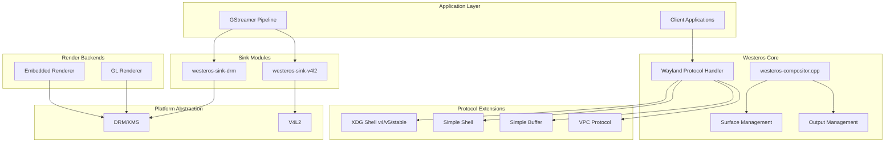
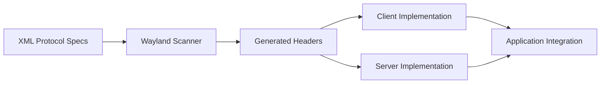
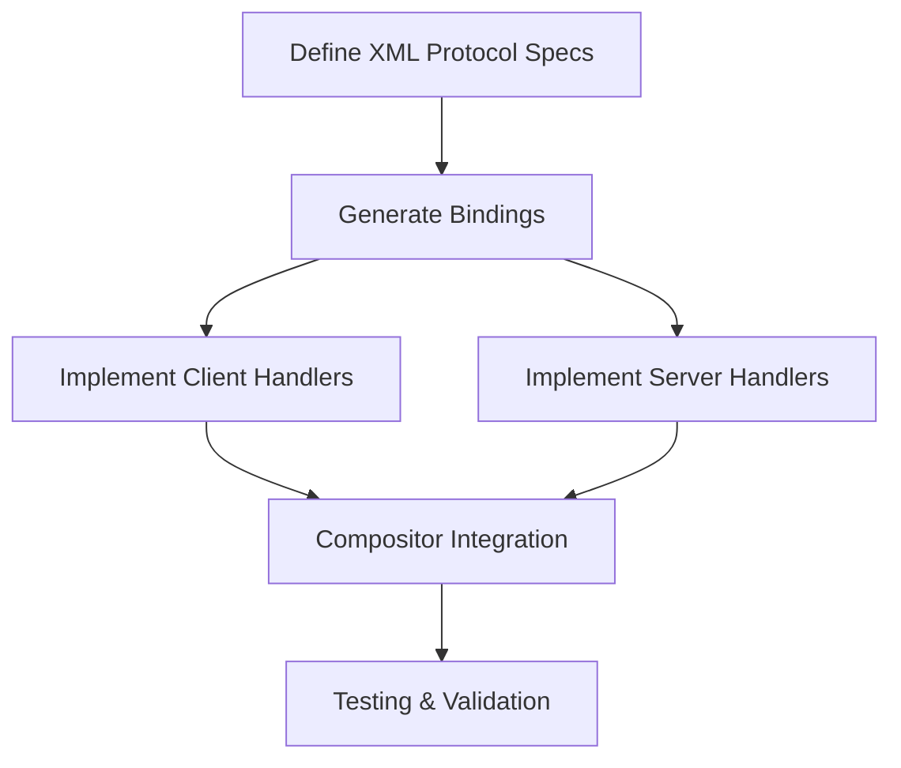

# Westeros Wayland Compositor

Westeros is a lightweight Wayland compositor library designed for embedded systems , including set-top boxes. It provides a flexible framework for creating normal, nested, and embedded Wayland compositors with support for hardware-accelerated video rendering and multiple backend platforms. The compositor implements the Wayland protocol and is designed to be compatible with applications built to use Wayland compositors. It enables applications to create one or more Wayland displays and supports three distinct compositor types: normal compositors that display output directly to the screen, nested compositors that send output to another compositor as a client surface, and embedded compositors that allow applications to incorporate composited output into their UI for seamless integration of third-party applications.

## Design


### Module Interface Specifications

| Interface | Purpose | Key Methods |
|-----------|---------|-------------|
| `WstModuleInit` | Primary initialization function | Resource allocation, hardware initialization, capability registration |
| `WstModuleTerm` | Cleanup functionality | Resource deallocation, system state restoration |
| `WstOutput` | Display output configuration | Resolution setting, refresh rate control, multi-display management |
| `WstCompositor` | Main compositor context | Primary API for application integration |

The Westeros module system provides standardized entry points for platform-specific implementations. The `WstOutput` interface abstracts display output configuration across different platforms, providing consistent methods for resolution setting, refresh rate control, and multi-display management.

### Protocol Binding Generation
Protocol bindings are automatically generated from XML specifications using the Wayland scanner tool. The generated headers in `protocol/` directories provide both client and server implementations for each supported protocol extension.



The build system integrates Wayland scanner tool execution, automatically regenerating protocol bindings when XML specifications are updated. This ensures that protocol implementations remain synchronized with specification changes and maintain compatibility with standard Wayland applications.
## Core modules

### Compositor Core

- **File**: `westeros-compositor.cpp`
- **Purpose**: Main compositor implementation handling Wayland protocol, surface management, and client coordination
- **Key Structures**:
  - `WstCompositor`: Represents the main compositor context, managing state, client connections, and coordinating Wayland displays and subsystems
  - `WstOutput`: Manages display output configurations like resolution and refresh rate, abstracting hardware differences for a consistent application interface.
  - `WstModule`: Enables runtime loading of platform-specific modules, allowing the compositor to support multiple hardware platforms with a single build.

### Sink Modules
The sink modules are hardware-specific GStreamer sink elements that handle video rendering on different platforms. Each sink module is tailored to leverage the specific capabilities and APIs of its target platform while providing a consistent GStreamer interface.

#### DRM Sink

- **Direct Rendering Manager support** – The DRM sink supports generic Linux graphics stacks via the DRM/KMS framework, making it compatible with a wide range of Linux platforms using standard graphics drivers.
- **Generic Linux graphics stack** – It uses GBM for efficient buffer allocation and supports both video overlay and texture rendering, choosing the best method based on hardware and system conditions.
- **KMS (Kernel Mode Setting) integration** – The sink manages display settings like resolution, refresh rate, and multi-monitor support through KMS. It supports both atomic and legacy APIs for broad kernel compatibility.

#### V4L2 Sink

- **Video4Linux2 API support** – The V4L2 sink offers broad compatibility using the standard Video4Linux2 API, making it ideal for systems without specialized video interfaces.
- **Capture and display buffer management** – It handles both capture and display buffers, supports various pixel formats and DMA buffers for zero-copy operations, and negotiates formats for optimal hardware performance.
- **Cross-platform video handling** – Supports hardware-accelerated decoding with graceful fallback to software, and maintains proper audio-video synchronization during playback.

### Protocol Extensions

#### XDG Shell Support
Westeros provides full support for XDG Shell protocol versions v4, v5, and stable, allowing applications to manage surfaces as toplevel or popup windows. It supports window states like maximized, minimized, fullscreen, and resizable, with constraint handling. Surface roles, input focus, and event routing are properly implemented. Bindings are auto-generated from XML using the Wayland scanner, ensuring compatibility with standard Wayland clients.

#### Simple Shell
A custom Westeros extension designed for embedded systems, offering lightweight window management. It supports basic functions such as window creation, positioning, and state transitions, with reduced complexity compared to full-featured shell protocols like XDG Shell—ideal for low-resource environments.

#### Simple Buffer
A protocol extension focused on efficient cross-process buffer sharing. It minimizes memory overhead by supporting shared memory, DMA buffers, and platform-specific formats. Reference counting and lifecycle management are included to ensure proper cleanup and resource handling—critical for performance in embedded systems.

## Platform Support Matrix

| Platform | Sink Module | Renderer | Hardware Acceleration | Key Features |
|----------|-------------|----------|----------------------|--------------|
| Generic Linux | drm | gl | ✓ DRM/KMS | GBM, Atomic KMS, Multi-display |
| V4L2 Devices | v4l2 | gl | ✓ Hardware Decode | Cross-platform, Standard APIs |

## Key Features

### Compositor Types
Westeros supports three distinct compositor configurations, each designed for specific use cases and deployment scenarios.

**Normal Compositor** operates as a standalone display server, directly controlling screen output and managing all client applications. This configuration is typical for embedded devices where Westeros serves as the primary display system. The normal compositor handles all aspects of display management, including resolution setting, refresh rate control, and multi-monitor support where available.

**Nested Compositor** functions as a client to another Wayland compositor while simultaneously serving as a compositor for its own clients. This configuration enables complex display hierarchies and is useful for scenarios like running multiple UI environments or creating sandboxed application spaces. The nested compositor can be moved, resized, and managed like any other window while maintaining full compositor functionality for its clients.

**Embedded Compositor** allows applications to integrate Wayland compositor functionality directly into their user interface. This enables seamless incorporation of external applications into a host application's UI, creating unified user experiences where third-party applications appear as native components of the host interface.

### Video Capabilities
Westeros supports hardware-accelerated video decoding across all platform backends, automatically selecting the optimal decoding path based on system and hardware capabilities. It handles multiple video planes for features like picture-in-picture and multi-stream rendering, with per-stream scaling and effects.

Aspect ratio management ensures proper display adaptation through modes like letterboxing, pillarboxing, and custom configurations. Frame stepping and seeking allow for frame-accurate navigation and variable playback rates, essential for advanced media playback.

Audio/video synchronization is maintained through precise timing mechanisms that consider processing delays and hardware latency, ensuring smooth, accurate playback across various configurations.

### Advanced Features
ERM (External Resource Manager) integration enables robust resource handling across applications, with support for conflict resolution, priority-based allocation, and graceful degradation under load.

Westeros supports seamless dynamic resolution switching without restarting apps or the compositor. It also handles multi-display setups with independent resolution, refresh, and color settings—enabling mirroring and extended desktop modes.

Comprehensive input handling includes support for multi-touch displays, external keyboards, and embedded system input devices, ensuring flexible user interaction across platforms.

## Usage Examples

### Basic Compositor Launch
Different launch configurations demonstrate the flexibility of the Westeros compositor across various platforms and use cases.

```bash
# DRM backend with OpenGL renderer
LD_PRELOAD=libwesteros_gl.so westeros --renderer libwesteros_render_gl.so

# Embedded compositor with specific display
westeros --embedded --display :1 --renderer libwesteros_render_embedded.so

# Nested compositor configuration
westeros --nested --parent-display wayland-0 --renderer libwesteros_render_gl.so

# Display-specific launch with debugging
WESTEROS_DEBUG=1 westeros_test --display westeros-2455-0
```

### GStreamer Pipeline Integration
Westeros sink integration with GStreamer enables sophisticated media processing pipelines with hardware acceleration.

```bash
# Basic video playback with hardware acceleration
gst-launch-1.0 filesrc location=video.mp4 ! decodebin ! westerossink

# Advanced pipeline with scaling and effects
gst-launch-1.0 filesrc location=input.mp4 ! decodebin ! videoscale ! \
  video/x-raw,width=1920,height=1080 ! westerossink window-set="0,0,1920,1080"

# Multi-stream pipeline with picture-in-picture
gst-launch-1.0 filesrc location=main.mp4 ! decodebin ! westerossink name=main \
  filesrc location=pip.mp4 ! decodebin ! westerossink name=pip window-set="1440,810,480,270"
```

## Dependencies

### Core Dependencies
The Westeros compositor requires several core libraries that provide essential functionality for Wayland protocol handling, input processing, and graphics rendering.

Wayland (>= 1.6.0) provides the fundamental protocol implementation and client-server communication mechanisms. The compositor uses both client and server-side Wayland libraries for different operational modes.

libxkbcommon (>= 0.8.3) and xkeyboard-config (>= 2.18) handle keyboard input processing, including keymap loading, key symbol translation, and internationalization support.

GStreamer (>= 1.10.4) integration enables sophisticated media processing capabilities and provides the plugin architecture for the Westeros sink modules.

EGL (>= 1.4) and OpenGL ES (>= 2.0) provide hardware-accelerated graphics rendering capabilities across different platforms.

### Platform-Specific Dependencies
Each platform backend requires specific libraries and development packages for optimal functionality.

**DRM platforms** need libdrm for direct rendering manager access and GBM (Generic Buffer Manager) for efficient buffer allocation and management.

**V4L2 platforms** need Video4Linux2 kernel headers and may benefit from additional codec libraries for enhanced format support.

## Testing and Coverage

### Automated Testing Framework
The testing system provides comprehensive validation across multiple platforms and configurations. Located in the `test/` directory, the framework includes platform-specific test suites and code coverage analysis.

| Test Category | Coverage | Platform Support |
|---------------|----------|-------------------|
| Core Compositor | Protocol compliance, surface management | All platforms |
| Video Rendering | Hardware acceleration, format support | DRM, V4L2 |
| Input Handling | Touch, keyboard, pointer devices | All platforms |
| Resource Management | ERM integration, memory optimization | All platforms |

Code coverage analysis uses gcov integration to provide detailed reports on test coverage, helping identify areas that need additional testing and ensuring comprehensive validation of critical code paths.

### Test Execution and Coverage Analysis
```bash
# Execute platform-specific test suites
./run-tests.sh drm     # DRM platform tests
./run-tests.sh v4l2    # V4L2 platform tests

# Generate comprehensive coverage reports
./get-coverage.sh drm     # DRM coverage analysis

# Run specific test categories
make -f Makefile.test clean && make -f Makefile.test
```

## Release Information

### Current Release: 
The latest release is `1.01.57` (November 25, 2024) and introduces several significant improvements and new features:

| Feature | Description | Impact |
|---------|-------------|---------|
| Active Format Descriptor (AFD) | Video presentation metadata support | Enhanced video formatting capabilities |
| Shutdown Robustness | Race condition and cleanup improvements | Better system stability |
| Timecode PTS Processing | Accurate timestamp handling fixes | Professional video application support |
| ALLM Management | Auto Low Latency Mode updates | Improved gaming performance |

## Development Guidelines

### Adding New Platform Support

| Step | Task | Details |
|------|------|---------|
| 1 | Create Sink Module | New module in `westeros-sink/<platform>/` |
| 2 | Implement Renderer | Platform-specific video rendering and display management |
| 3 | Protocol Extensions | Add specialized functionality if needed |
| 4 | Build Configuration | Update autotools, add compilation flags |
| 5 | Testing | Develop platform-specific test suites |

Platform-specific rendering backends must implement the standard Westeros renderer interface while leveraging platform-specific APIs for optimal performance. This typically involves integrating with the platform's graphics drivers, video acceleration APIs, and display management systems.

### Protocol Extension Development



Creating new protocol extensions requires careful design to ensure compatibility and maintainability. Protocol binding generation uses the wayland-scanner tool to create client and server implementation code from XML specifications.

## Troubleshooting

### Common Issues

| Issue Type | Observed Behavior | Diagnostic Steps | Solutions |
|------------|----------|------------------|-----------|
| Resource Conflicts | Multi-application failures | Check ERM configuration | Configure resource priorities |
| Display Initialization | Screen output problems | Verify driver configuration | Check kernel modules, permissions |
| Video Rendering | Playback issues | Test hardware acceleration | Verify codec support, drivers |
| Protocol Errors | Application crashes | Check version compatibility | Update protocol versions |

### Debug Options

| Tool | Environment Variable | Purpose | Usage |
|------|---------------------|---------|-------|
| Verbose Logging | `WESTEROS_DEBUG=1` | Detailed operation info | Compositor debugging |
| Protocol Debugging | `WAYLAND_DEBUG=1` | Message tracing | Client-server communication |
| Test Utility | `westeros_test` | Display verification | Basic functionality testing |
| Platform Tools | Platform-specific | Resource monitoring | Hardware state analysis |

Resource conflicts often arise in multi-application environments where multiple processes compete for limited hardware resources. Display initialization problems typically stem from incorrect driver configuration or hardware compatibility issues. Video rendering issues may indicate problems with hardware acceleration support or codec compatibility.
