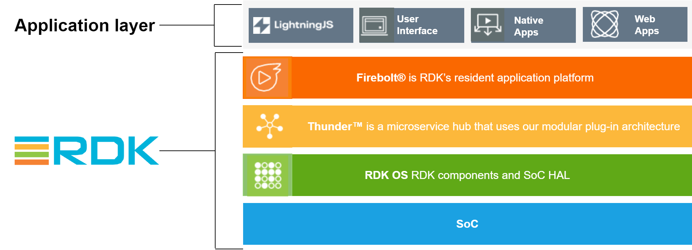

# RDK Video Documentation

------------------------------------------------------------------------

  

# What is RDK Video(RDK-V)?

RDK-V is a fully modular, portable, and customizable open source software solution for video devices. It accelerates the deployment of next-gen video products and services, simplifying customization and user experience.

RDK Video software stack is designed to simplify app development and integration. It features a restructured, modular three-layered architecture—comprising Vendor, Core, and Application layers—that improves development agility, portability, security, and ecosystem scalability. This modular design empowers independent development and testing across layers, streamlines integration across multiple hardware platforms, and enables faster innovation cycles. 
It provides companies with complete control over their apps, device data, and customer experience. 
RDK Video is designed for use with Lightning™, HTML5 based web apps as well as native streaming video apps
, all integrated through Firebolt®. RDK Video offers users an adaptable interface through its comprehensive Reference Lightning™ UI. Additionally, users can develop and customize their own UI based on their specific requirements. The platform is enhanced with Firebolt®,
which expedites the rigorous certification process required by today’s leading global streaming app providers and ensures compatibility with their latest releases, eliminating the need for future updates.

Furthermore, RDK Video integrates Thunder, an event-driven interface framework that allows the flexibility to enable or disable any feature as a plug-in. Thunder microservices, also known as RDKServices, are implemented as plug-ins and configured within the WPE subsystems. RDK Video supports global streaming apps by featuring pre-integrated top global streaming applications. This provision gives operators a straightforward pathway to deliver the most popular content to their subscribers.

------------------------------------------------------------------------

## RDK Device profiles

From the fundamental RDK IP STB to the more sophisticated RDK TV, RDK offers a variety of device profiles: IP STB and RDK TV.

### IP STB

[RDK Video for IP](https://wiki.rdkcentral.com/display/RDK/IP)
provides a common method to manage video playback functions. The IP client device serves as an interface and receives video content from an in-home media gateway device or from an external media server.

### TV

[RDK Video for TV](https://wiki.rdkcentral.com/display/RDK/TV)
is an open source Smart TV profile that allows manufacturers and operators to build RDK-based TV and video solutions.

------------------------------------------------------------------------

# Additional Resources

**Getting Started:**

-   Try out RDK
    : To know how to begin with trying out RDK, please follow
    [Try out RDK](https://wiki.rdkcentral.com/display/RDK/Try+Out+RDK)
    .

**User Guides:**

-   Features
    : A detailed list of features supported by RDK-V is available at 
    [Features](https://wiki.rdkcentral.com/display/RDK/RDK7+Features)
    .
-   Architecture
    : For RDK-V architecture details and structuring of RDK-V Components, follow
    [Architecture](https://wiki.rdkcentral.com/display/RDK/RDK7+Architecture)
    .
-   Components
    : For detailed documentation of RDK-V components, follow
    [Components](https://wiki.rdkcentral.com/display/RDK/Components-RDKV)
    .
-   Builds/Yocto
    : For details on Yocto build systems and RDK Yocto builds, follow
[rdk+yocto+build+systems](https://wiki.rdkcentral.com/display/RDK/RDK+Yocto+Build+Systems)
    .

**API References:**

-   HAL
    : For details of RDK Video HAL list, please follow 
    [HAL](https://wiki.rdkcentral.com/display/RDK/HAL)
     .

**Application Details:**

-   RDK UI:
    For details of available RDK UI options, follow 
    [RDK UI Options](https://wiki.rdkcentral.com/display/RDK/RDK+UI+Options)
    .

**Device Profiles:**

-   IP STB
    : For an overview of the RDK-V IP STB device profile, follow 
    [IP](https://wiki.rdkcentral.com/display/RDK/IP)
    . 
-   RDK-V TV
    : For an overview of the RDK-V TV device profile, follow 
    [TV](https://wiki.rdkcentral.com/display/RDK/TV)
    .

