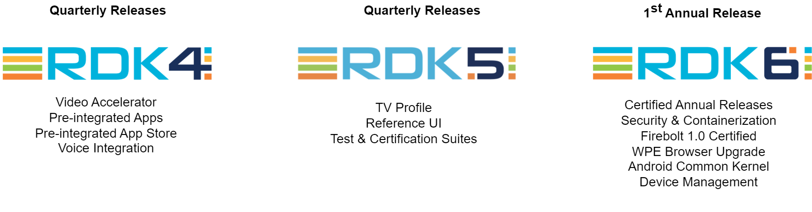
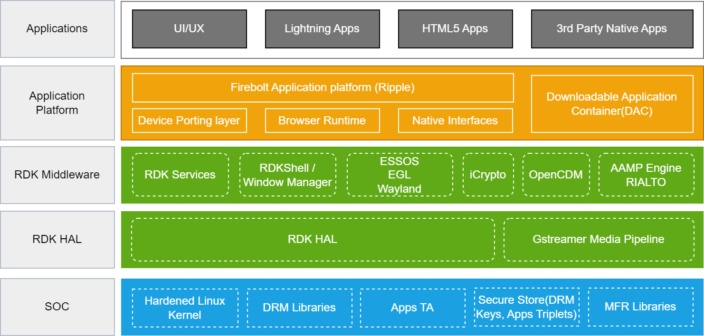

# Architecture

------------------------------------------------------------------------

RDK Video (RDK-V) Architecture is designed to enable service providers and device manufacturers to develop and deploy innovative video applications, services, and user experiences. It consists of several key components that work together seamlessly to provide a robust video platform.

By leveraging the pluggable architecture of RDK-V, a variety of target device profiles can be supported, ranging from a basic IP streaming video platform to a full-fledged TV.

-   [IP](./video_profiles.md) provides a common method to manage video playback functions. The IP client device serves as an interface and receives video content from an in-home gateway device or from an external media server.
-   [Hybrid](./video_profiles.md) is an IP video platform device with capabilities such as tuning and conditional access for its video delivery to manage hybrid video functions.
-   [TV](./video_profiles.md) is an open-source smart TV profile that allows manufacturers and operations to build RDK-based TV and video solutions.

!!! note
    RDK Hybrid TV is a combination of [TV](./profiles/tv/tv.md) plus [Hybrid](./profiles/hybrid/hybrid.md) capabilities such as tuning, conditional access, etc.

## Evolution of RDK

!!! info
    From RDK6, RDK-V shifted from quarterly to annual release cycles. 
    

The annual RDK release aims to synchronize RDK-V with standard industry release practices while comprehensively addressing shared challenges within the community. This approach facilitates the smoother and more consistent adoption of newly contributed features, utilizing the latest releases from technology partners. By aligning with SoC partners, the release enables better resource planning to support core RDK-V platforms. Furthermore, the RDK-V release aligns with SoC, OEM, and app releases, fostering a more cohesive and efficient ecosystem.
The first annual release is RDK6, and its release notes can be accessed from [RDK6 Release Notes](https://wiki.rdkcentral.com/display/RDK/RDK6+Release+Notes).

------------------------------------------------------------------------

## Architecture Details

Below is an illustrative representation of the RDK-V software stack, depicting the various components and their interactions.

At its core, RDK-V consists of five main stack levels, each serving a specific purpose in the overall architecture. These levels are as follows:

### Applications
The application layer primarily focuses on the end-user experience. This layer contains applications that provide various services, content, and features to the users. While the RDK-V ecosystem is continuously evolving, supported applications typically include popular   **OTT services** like Netflix, Amazon Prime Video, and YouTube, alongside native broadcaster applications and other services

### Application Platform
The Application Platform Layer in the RDK-V ecosystem offers essential tools for developers to create applications. It includes components like a  **UI framework**, **HTML5** rendering engine, and a **JavaScript runtime**.This layer acts as a communication channel, serving as a middleware between applications and core RDK-V services. In the RDK-V framework, [Firebolt®](https://developer.rdkcentral.com/firebolt/overview/) handles UI rendering and user input, enabling extensive customization.  [Lightning™](https://lightningjs.io/docs/#/what-is-lightning/index), an open-source JavaScript platform, manages the application lifecycle and integrates components using WebGL for rendering. Together, Firebolt® and Lightning™ form a robust foundation for seamless and efficient application development in the RDK-V ecosystem.
**Firebolt® 1.0 (Ripple) -** Firebol® 1.0 (Ripple) streamlines RDK-V app integration with standardized rules. Ripple, its open-source Rust-based Application gateway, facilitates dynamic extensions and serves as a Firebolt® gateway. RDK 6 is Firebolt® 1.0-certified, with a comprehensive test suite for compliance.
**Security -** The Application Platform Layer ensures robust security with Dobby-managed **containerization**, leveraging Linux kernel features for process isolation.
**Downloadable Application Containers (DAC)** enable the secure running of binary applications on video platforms without modification, ensuring compatibility across RDK 6 devices. Access control is enforced through
**AppArmor**, a proactive Linux security system. RDKM's open-sourced AppArmor profile generator tool for RDK 6 provides fine-grained control over process resources, contributing to a secure environment.

### RDK Middleware
Serving as a vital bridge between the Application Platform Layer and the hardware (HAL), the RDK Middleware Layer incorporates essential components that are pivotal for the seamless operation of the RDK-V platform. Core to this layer are **RDK services**, providing JSON-RPC services for interactive applications. In the realm of security,  **iCrypto** handles critical cryptographic operations, ensuring secure communication and data protection.  **Rialto** offers a secure solution for AV pipelines in containerized applications, and the **Window Manager** orchestrates GUI layout. **Device management** enables streamlined operations in RDK deployments, including bulk operations and firmware downloads. XCONF integration revolutionizes code downloads for a smoother deployment experience. Log uploads aid in comprehensive debugging, offering insights into system performance. RDK Feature Control (RFC) enables dynamic feature management for enhanced flexibility. Telemetry systematically collects essential data insights, while WebPA ensures secure communication between cloud servers and RDK devices. The Media Player, crucial for local rendering devices, manages various pipeline functions, supporting IP and QAM playback. The **Open Content Decryption Module(OCDM)** enforces Digital Rights Management (DRM) policies. Together with other RDK-V elements, these components ensure the efficient and secure functioning of the RDK-V platform.

### RDK HAL (Hardware Abstraction Layer)
In the RDK-V stack, the HAL layer plays a vital role in facilitating communication between the video application software and hardware components like the GPU, video encoding/decoding hardware, and audio devices. It provides a standardized framework for functions, data structures, and protocols, enabling efficient hardware resource utilization. The HAL layer manages **hardware initialization**, **input/output operations**, and  **hardware-specific events**, shielding software developers from hardware complexities and allowing them to prioritize user experience and functionality.

RDK-V provides a set of HAL APIs that abstract the platform from RDK. Vendors need to implement the HAL APIs to meet the HAL specifications. With the help of the HAL API specification for different RDK-V components, vendors can successfully port RDK-V to their platform. Depending on the device profile ([IP](./profiles/ip/ip.md), [TV](./profiles/tv/tv.md), [Hybrid](./profiles/hybrid/hybrid.md), etc.), vendors may choose the relevant components and perform the port by implementing the HAL layer. For more details on the vendor porting process, refer to the [Vendor Porting Guide](./vendor-porting-guide/vendor-porting-guide.md).

### SOC
The System on Chip (SOC) layer forms the foundational interface between hardware components, ensuring system security and reliability. It incorporates various crucial elements, such as **DRM Libraries,** which manage digital rights and secure content delivery to prevent unauthorized access and distribution. **Trusted Applications (Apps TA)** guarantee the secure execution of sensitive operations and protect critical data from unauthorized access. The  **Secure Store** oversees the storage of DRM keys and apps triplets, maintaining the confidentiality and integrity of vital data. Additionally, **MFR Libraries** manage hardware functionality, providing access to specific hardware features and capabilities, thereby contributing to the overall security and functionality of the system.

------------------------------------------------------------------------

## Application Scenario

Consider the use case of a user accessing a streaming application like Youtube on an RDK Video-supported device. The user interacts with the application through the Application Layer, selecting content and initiating playback. The Application Platform Layer, utilizing the Firebolt®
and Lightning™ frameworks, manages the user interface and application lifecycle.
The RDK-V Layer ensures seamless communication between the application and the hardware, managing services, cryptographic operations, inter-component communication, window management, and content decryption through OpenCDM.
The RDK HAL Layer then utilizes the Gstreamer media pipeline to decode and render the video content, ensuring a smooth and high-quality viewing experience.
Finally, the SOC Layer provides a secure environment for the entire system, safeguarding the hardware, managing DRM policies, and securing sensitive data, ensuring a secure and reliable video streaming experience for the user.

------------------------------------------------------------------------

## Useful Links

!!! Warning "Access Restriction"
    Some links on this page may be restricted. For the best experience, please make sure you are logged in. If you do not have an account, you can sign up at https://wiki.rdkcentral.com/signup.action. If you are logged in but still cannot access certain content, please contact support@rdkcentral.com for assistance.

**RDK-V:**

You can find an overview of the RDK-V platform, detailing its key features and functionalities at
[RDK Video Documentation](./README.md).

**Application Development:**

Developers interested in RDK-V application development using Firebolt
®
can refer
[Firebolt® Overview](https://developer.rdkcentral.com/firebolt/overview/),

Developers interested in RDK-V application development using Lightning™
the inhouse JavaScript framework -
can refer
[Lightning™ Framework](https://lightningjs.io/docs/#/what-is-lightning/index).

**Security:**

Understanding the concept of containerization in RDK-V is crucial for ensuring secure and efficient application deployment, and the '[Containerization in RDK](https://wiki.rdkcentral.com/display/RDK/Containerization+in+RDK)' document provides in-depth insights into this aspect.

To learn about the implementation and benefits of Downloadable Application Containers (DAC) within the RDK-V ecosystem, the '[DAC Documentation](https://wiki.rdkcentral.com/pages/viewpage.action?pageId=113967683)' offers comprehensive guidance for developers.

For insight into the Access Control Mechanism in RDK-V using AppArmor, developers can refer to the '[AppArmor Documentation](https://wiki.rdkcentral.com/display/RDK/Mandatory+Access+Control+in+RDK+using+AppArmor)' to understand how to enforce security policies and restrict application access within the RDK-V environment.
