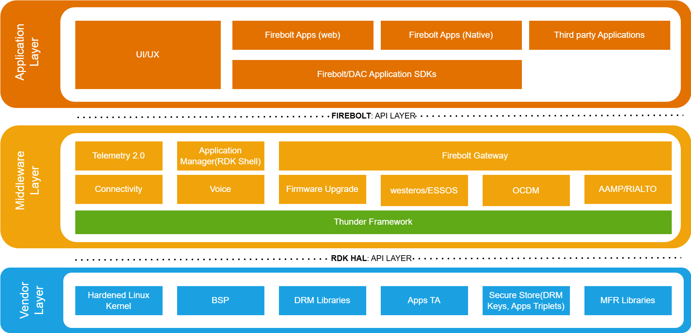
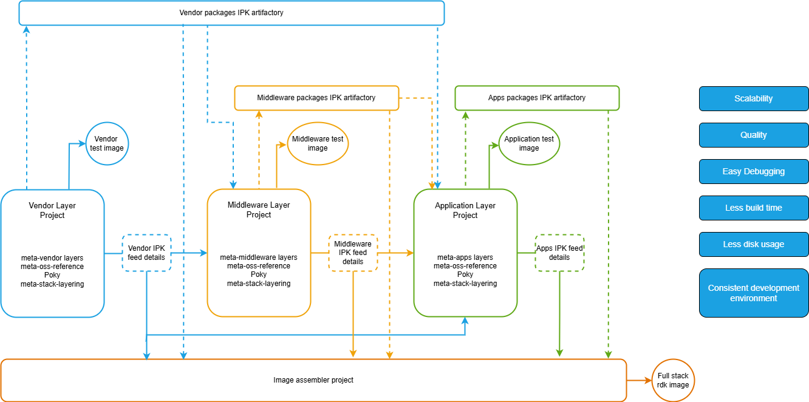
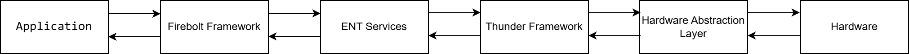

# RDK7 Architecture

------------------------------------------------------------------------

# Overview

RDK7 is the newest open source software release, representing the first release of RDK-E (Entertainment), evolving from the previous RDK-V (Video) platform. It supports both IP and TV video platforms, integrating over-the-top (OTT) video apps through the Firebolt™ framework, standardizing interfaces for video playback, digital rights management (DRM), graphics, and security. RDK7 builds upon previous RDK releases to further simplify app development, enhance security, and standardize functionality across diverse set-top box hardware.

The following key principles of RDK7 illustrate the areas of change and focus from RDK-V previous releases:


The Layered Design provides clear separation of functional responsibilities through distinct vendor, middleware, and application layers with independent development and update cycles. Hardware Abstraction reduces the cost of SoC/OEM deliver & platform through standardized hardware abstraction layer (HAL) and simplified platform adaptation. Application Community focuses on standardization of portable 3rd party apps, consistent APIs for application developers, and Firebolt framework for OTT integration. Quality & Robustness involves major transformation of delivery process to ensure quality, independent testing of each layer, and consistent development environment. Rapid Innovation is achieved through utilization of common tooling and patterns. Broadcast Functionality enables separation of broadcast technology from IP platform.

------------------------------------------------------------------------

# Architecture

A quick architecture overview of RDK7 to help associate the capabilities with the software stack is given below.



The architecture consists of three main layers. The Application Layer contains Firebolt Apps, Lightning UI, and Firebolt Framework. The Middleware Layer contains Thunder Framework, ENT Services, Media Framework, DRM Systems, and Device Management. The Vendor Layer contains HAL Implementation, Drivers, BSP, and Hardware Adaptation. The Application Layer connects to the Middleware Layer, which connects to the Vendor Layer.

## Vendor Layer

The objective of the vendor layer is to minimize the amount of code required per hardware platform, thereby reducing development time to support scalability. All vendor layer implementations must be fully compliant with the HAL specification to ensure compatibility with a common middleware build and provide standardized interfaces to the middleware layer, abstracting hardware differences.

The vendor layer contains hardware-specific drivers, BSPs, and platform-specific adaptations. Responsibility for build systems, updates, and security identification related to deliverables lies with the vendor implementer. To support management and cross-layer compatibility, a minimal subset of component implementations is specified, such as the Linux Kernel version, core libraries, and patches.

Reference open-source software is provided to enable reuse of common components; however, usage of these components is not mandatory for the vendor implementer. Manufacturing and serialization requirements and processes are defined in the Entertainment OS device specifications and must be followed accordingly. The vendor layer can be updated independently without affecting other layers.

## Middleware Layer

The middleware layer aims to provide a single, consistent implementation of core Entertainment device functionality. Middleware components are expected to utilize the Thunder framework to implement functionality in a standardized manner with unified orchestration, providing standardized APIs for the application layer to access device capabilities.

The middleware layer includes core RDK components, media playback, DRM systems, and device management. Middleware components are developed separately and delivered as binary packages (IPK), though all components should be delivered in source code unless agreed as an exception. The middleware layer owner holds responsibility for the quality of all components within the layer, including open-source and community contributions.

The middleware is designed to have the most simple, robust and co-operative implementation of the core functionality while enabling rapid innovation through common tooling and patterns. Reference open-source software is provided to allow re-use of common components, but the middleware is not obligated to use any of these components.

## Application Layer

The application layer is distinct from the lower layers in that it doesn't have a single layer owner. Instead, it's a set of tools and applications that harness the underlying layers to provide customer features directly or indirectly. The layer contains user-facing applications and experiences and includes the Firebolt framework for standardizing OTT app integration.

Third-party applications should use the Firebolt APIs, providing consistent APIs for application developers, and it is assumed all 3rd party applications are 'untrusted'. The layer supports various application types including native, web-based, and hybrid applications, and can be updated independently of the middleware and vendor layers.

Examples of Applications include:

-   **Application Runtimes:**
     
    Browsers or runtimes that support execution of application code
-   **3rd Party applications:**
     
    Standardized portable apps for consistent user experience
    -   Immersive Device Experience: A trusted application that provides the UI and business logic to allow eOS managed devices to be configured by the user and host the operating system interactions (e.g., Voice overlays and application orchestration)

The application layer enables rapid development and deployment of new features and services while standardizing portable 3rd party apps for consistent user experience.

# Detailed Architecture

The detailed architecture diagram illustrates the complete RDK7 software stack, showing the relationships between the different layers and components:


The RDK7 architecture includes key components across multiple layers. The Hardware Layer at the bottom is the physical hardware, which varies by device manufacturer. The Vendor Layer sits directly above the hardware, providing the necessary drivers and adaptations. The Middleware Layer serves as the core of the RDK7 platform, providing standardized services and APIs. The Application Layer forms the top layer, containing user-facing applications and experiences. The Thunder Framework provides a unified approach to component development and communication. The Firebolt Framework standardizes interfaces for OTT applications and services. The architecture emphasizes clear separation of concerns, standardized interfaces between layers, and modular component design to enable independent development and updates of different parts of the system.

------------------------------------------------------------------------

# Build System

RDK7 introduces a revolutionary layered build approach that significantly improves development efficiency. The build setup is divided into independent Stack layer projects, each comprising components that are developed separately and delivered as binary packages (IPK). These stack layers are then assembled into the final image using the Image Assembler tool.



The build system architecture includes the Reference OSS Layer that serves as a reference Yocto distribution layer with CVE patches, the Vendor Layer that contains vendor-specific code and hardware adaptations, the RDK Middleware Layer that contains core RDK middleware components, and the Application Layer that contains user-facing applications and services. The RDKE framework serves as the backbone of this layered architecture, designed to work seamlessly with Yocto without disrupting its normal functionalities while requiring minimal maintenance. It accommodates layering requirements without modifying Yocto's default tasks or variables.

## Build System Directory Structure

```
├── application
│ └── meta-application-release
├── common
│ ├── meta-openembedded
│ ├── meta-oss-reference-release
│ ├── meta-rdk-auxiliary
│ ├── meta-rdk-halif-headers
│ ├── meta-rdk-oss-reference
│ ├── meta-stack-layering-support
│ └── poky
├── configs
│ └── common
└── product-layer
└── meta-rdke
```

## Key Benefits of layered builds

The layered build approach offers several key benefits across multiple areas. 

-   **Scalability**
    is achieved as each layer can be updated independently without affecting or relying on other layers, and updating only the vendor layer can be achieved by using the latest tag from that layer and applying it to the stack.
-   **Quality**
    is ensured through each layer undergoing unit testing and layer-specific testing prior to release, with all requirements validated during this process and fully tested and tagged versions of the IPKs produced for quality assurance.
-   **Easy debugging**
    is facilitated as developers are required to compile only their own projects, IPKs from other components can be consumed directly eliminating the need to build the entire set of components, tagged versions of application cases can be used to verify individual components, and overall build time is significantly reduced.
-   **Less disk usage**
    is accomplished when working across multiple products as the middleware and application layers are designed to be as common as possible, the primary difference between products lies in the vendor layer, multiple vendor layers can be checked out and modified while using shared IPKs in the application layer, and this approach eliminates the need to check out the entire codebase for each product significantly saving disk space.
-   **Consistent development environment**
    is maintained as each developer builds components against tagged versions of other components, ensuring that regressions or issues in unrelated components do not affect development, and only tested and tagged versions are used.

The RDKE framework accommodates specific requirements for the layered build system by resolving both direct and indirect interlayer build dependencies, generating proper packaging metadata for runtime dependencies, creating IPKs without disrupting layer and interlayer runtime dependency chains, supporting installation of specific release versions of layer packages, creating target rootfs using both development packages and release layer IPKs, and supporting prebuilt kernels and device trees.

------------------------------------------------------------------------

# Component Interaction Flow

The typical flow of a request through the RDK7 stack:



The system follows a standardized request-response flow where the Application sends request to Firebolt Framework, Firebolt Framework translates request for ENT Services, ENT Services processes request and sends to Thunder Framework, Thunder Framework processes request and sends to Hardware Abstraction Layer, HAL executes command on Hardware, Hardware returns result to HAL, HAL processes result and sends to Thunder Framework, Thunder Framework formats response and sends to ENT Services, ENT Services translates response for Firebolt Framework, and Firebolt Framework returns result to Application. This standardized flow ensures consistent behavior across different hardware platforms and enables rapid innovation through common patterns.

------------------------------------------------------------------------

# Application Scenario

Consider the use case of a user accessing a streaming application like YouTube on an RDK7 Entertainment-supported device. The user interacts with the YouTube application through the Application Layer, selecting content and initiating playback, where the application utilizes the Firebolt Framework for standardized OTT app integration as a 3rd party 'untrusted' application. The Firebolt Framework translates the user's request into standardized API calls and sends them to the Thunder Framework, which processes the request using unified orchestration and coordinates between different middleware components with standardized communication patterns. The ENT Services within the Middleware Layer handle core Entertainment device functionality, including the Media Framework for video decoding and rendering, DRM Systems for content protection and digital rights management, and device management for optimal performance. The Hardware Abstraction Layer in the Vendor Layer executes commands on the hardware using standardized HAL specifications that abstract hardware differences across different SoC platforms, while the physical hardware processes the video content leveraging GPU, video encoding/decoding hardware, and audio devices. The response flows back through the same standardized path in reverse - hardware returns results to HAL, which processes and sends to ENT Services, then to Thunder Framework for translation, and finally the Firebolt Framework returns the result to the Application. This standardized request-response flow ensures consistent behavior across different hardware platforms while enabling rapid innovation through common patterns and modular component design, providing a seamless and secure YouTube streaming experience for the user with clear separation of concerns across the three-layer architecture.

------------------------------------------------------------------------
