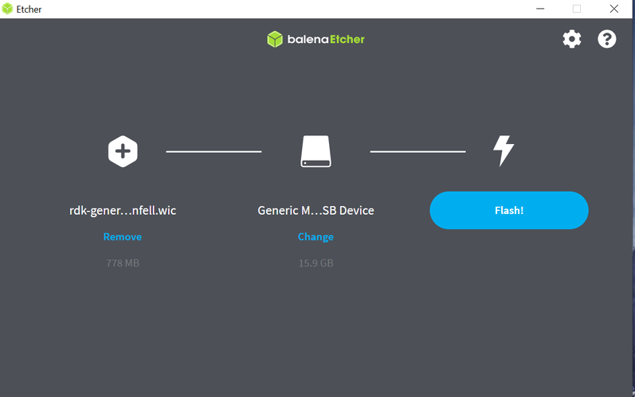
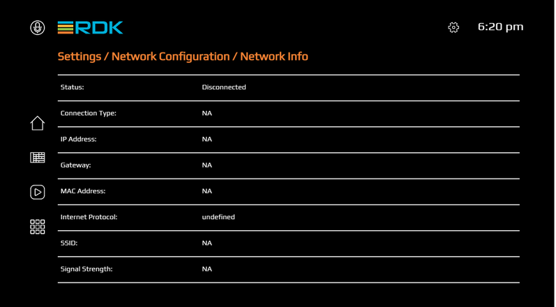

# Try Out RDK7


------------------------------------------------------------------------

This guide provides step-by-step instructions to create your own build and play around RDK using the popular open source platform Raspberry Pi 4 as the target device. The document covers the pre-requisites, build instructions , and detailed flashing instructions to get your Raspberry Pi up and running with RDK

------------------------------------------------------------------------

## Before you begin

If you prefer to use a pre-compiled image - so that you can proceed with flashing the image - please download a precompiled image for Raspberry Pi 4 from [here]( https://wiki.rdkcentral.com/download/attachments/80261869/lib32-rdk-fullstack-image-raspberrypi4-64-rdke-RDK7-1.0.0.wic.bz2?version=1&modificationDate=1757065983000&api=v2 ) and go to section [flashing-instruction](#flashing-instructions)


!!! info "Access restrictions"
    The download link requires you to have the free rdk licensee account. If you do not have, please signup [here](https://wiki.rdkcentral.com/signup.action). If you already have an account, sign in [here](https://wiki.rdkcentral.com/login.action) and then click on the above link of pre-compiled image

If you prefer to compile an RDK image from scratch and then try it out, please proceed to next section

## Pre requisites

### Host Setup

| Requirement              | Yocto 4.0 (Kirkstone) |
|--------------------------|-----------------------|
| **Linux**                | - 64 bit Ubuntu 20.04 LTS <br> - Shell BASH <br> [System requirements](https://docs.yoctoproject.org/kirkstone/ref-manual/system-requirements.html) |
| **Free HDD Space**       | - RDKE OSS: 75GB <br> - RDKE Vendor: 50GB <br> - RDKE Middleware: 120GB <br> - RDKE Application: 50GB <br> - RDKE Image Assembler: 30GB |
| **Host Tools Versions**  | - Git 1.8.3.1 or greater <br> - tar 1.28 or greater <br> - Python 3.9.0 or greater <br> - gcc 10.1 or greater <br> - GNU make 4.0 or greater |
| **Raspberry Pi Kit**     | RPI4 |


!!! warning "Python Path"
    Ensure that python exists in `/usr/bin/python`. If not, create a softlink for `/usr/bin/python` to python executable.
    ```bash
    $ which python
    # should give
    /usr/bin/python
    ```

!!! info "Host Setup"
    The instructions provided below are meant to be executed via the command line on an Ubuntu machine.

```bash
# essential package installation
# super user mode is required
# major essential packages
$ sudo apt install ant build-essential chrpath cmake curl diffstat fd g++ g++-multilib gcc gcc-multilib \\
git git-flow git-man jq libbz2-dev libffi-dev libglib2.0-dev libldap2-dev liblzma-dev libncurses5-dev \\
libreadline-dev libsasl2-dev libsqlite3-dev libslang2-dev libssl-dev libxml2-dev libxmlsec1-dev \\
llvm make nnn python3.8 ripgrep sysstat texinfo tk-dev tree wget \\
xz-utils zip zlib1g-dev zstd
```

!!! note "Locale Requirement"
    You also need to ensure you have the en_US.UTF-8 locale enabled.
    bash locale --all-locales | grep en_US.utf8
    ```bash
    $ bash locale --all-locales | grep en_US.utf8
    ```
#### Configure repo

In order to use Yocto build system, first you need to make sure that repo is properly installed on the machine:

```bash
# create a bin directory
$ mkdir ~/bin
$ export PATH=~/bin:$PATH
# Download the repo tool and ensure that it is executable
$ curl http://commondatastorage.googleapis.com/git-repo-downloads/repo > ~/bin/repo
$ chmod a+x ~/bin/repo
```

!!! note "Credentials"
    It is also recommended to put credentials in .netrc when interacting with the repo.

A sample .netrc file is illustrated below.
```bash
# RDK Central Gerrit
machine code.rdkcentral.com
    login <RDK Central SSO email address>
    password <PAT>
  
# RDK Central Github
machine github.com
    login <Public GitHub UserID>
    password <PAT>
```

#### Creating your PAT

!!! warning "PAT Requirement"
    Without proper PATs, you will not be able to clone, push, or interact with RDK Gerrit/GitHub repositories.

**Gerrit**

Set your Gerrit PAT here:
[https://code.rdkcentral.com/r/settings/#HTTPCredentials](https://code.rdkcentral.com/r/settings/#HTTPCredentials)


**GitHub**

For GitHub to create a PAT navigate to
*Settings - Developer Settings - Personal access tokens - Tokens (classic)*

-   [https://github.com/settings/profile](https://github.com/settings/profile)
    ← click on
    *"Developer settings"*
    here

!!! note "GitHub PAT Scopes"
    For Git actions (clone/push/pr) you need to select at least the following scopes:
     - repo
     - write:packages


------------------------------------------------------------------------

## Build Steps

The following steps describe how to build each of the required layers and finally generate a full stack image by building the image assembler layer.

!!! note "Layer Dependency"
    Each layer depends on the IPKs generated by the previous layer. 
    The IPK paths given are **examples only** — the actual path will depend on how you store your IPKs.


#### OSS Layer
```bash
$ repo init -u "https://github.com/rdkcentral/rdke-oss-manifest/" -b refs/tags/4.6.2-community -m rdk-arm.xml
$ repo sync
$ MACHINE=rdk-arm64 source ./scripts/setup-environment
$ bitbake lib32-packagegroup-oss-layer
```
This produces IPK objects that can be packaged into the OSS IPK feed. The OSS IPK feed is located in `build-rdk-arm64/tmp/deploy/ipk/rdk-arm64-oss/`
<br>

-   Locate the `opkg-make-index` utility that is part of the native built components. For OSS layer, this should be located in `build-rdk-arm64/tmp/work/x86_64-linux/opkg-utils-native/0.5.0-r0/git/opkg-make-index`

-   Run the opkg-make-index utility to create the IPK Package index
```bash
$ ./build-rdk-arm64/tmp/work/x86_64-linux/opkg-utils-native/0.5.0-r0/git/opkg-make-index ./build-rdk-arm64/tmp/deploy/ipk/rdk-arm64-oss/ > ./build-rdk-arm64/tmp/deploy/ipk/rdk-arm64-oss/Packages
```

-   Compress the package index
```bash
$ cd build-rdk-arm64/tmp/deploy/ipk/rdk-arm64-oss/
$ gzip -c9 Packages > Packages.gz
```

-   Copy or rsync the IPK feed into a location in the local file system, e.g. Rsyncing from `./build-rdk-arm64/tmp/deploy/ipk/rdk-arm64-oss/*` to `${HOME}/community_shared/rdk-arm64-oss/4.6.2-community/ipk/`

OSS layer is a common layer and not platform specific. The above-mentioned configuration is building OSS for arm64 machine and can be reused for any platforms with the same configuration.

#### Vendor Layer
```bash
$ repo init -u "https://github.com/rdkcentral/vendor-manifest-raspberrypi/" -b refs/tags/RDK7-1.0.0 -m rdke-raspberrypi.xml
$ repo sync
```
Setup the IPK feed(s): Please note for local IPK feed in local file system, the `"file:/"` prefix and the `"/"` suffix are important.

-   OSS IPK feed
Modify this file: `rdke/common/meta-oss-reference-release/conf/machine/include/oss.inc` and set `OSS_IPK_SERVER_PATH` to the IPK feed location in the local file system,
e.g:
```bash
OSS_IPK_SERVER_PATH = "file:/${HOME}/community_shared/rdk-arm64-oss/4.6.2-community/ipk/"
```

```bash
$ MACHINE=raspberrypi4-64-rdke source ./scripts/setup-environment
$ echo 'DEPLOY_IPK_FEED = "1"' >> conf/local.conf
$ bitbake lib32-packagegroup-vendor-layer (to build vendor layer IPK feed for other layers to consume)
OR
$ bitbake lib32-vendor-test-image (wrapper over packagegroup-vendor-layer to compile a bootable vendor layer test image)
```
At least  one of packagegroup or test-image is required to be successful to produce the IPK feed for the next layer. The produced IPK objects that can be found at `./build-raspberrypi4-64-rdke/tmp/deploy/ipk/raspberrypi4-64-rdke-vendor/`

-   Copy or rsync the IPK feed into a location in the local file system, e.g. Rsyncing from `./build-raspberrypi4-64-rdke/tmp/deploy/ipk/raspberrypi4-64-rdke-vendor/*` to `${HOME}/community_shared/raspberrypi4-64-rdke-vendor/RDK7-1.0.0/ipk/`


#### Middleware Layer
```bash
$ repo init -u "https://github.com/rdkcentral/middleware-manifest-rdke/" -b refs/tags/RDK7-1.0.0 -m raspberrypi4-64.xml
$ repo sync
```

Setup the IPK feed(s): Please note for local IPK feed in local file system, the `"file:/"` prefix and the `"/"` suffix are important

-   OSS IPK feed
Modify the file `rdke/common/meta-oss-reference-release/conf/machine/include/oss.inc` and set `OSS_IPK_SERVER_PATH` to the IPK feed location in the local file system, e.g.
```bash
OSS_IPK_SERVER_PATH = "file:/${HOME}/community_shared/rdk-arm64-oss/4.6.2-community/ipk/"
```

-   Vendor IPK feed
Modify the file `rdke/vendor/meta-vendor-release/conf/machine/include/vendor.inc` and set `VENDOR_IPK_SERVER_PATH` to the IPK feed location in the local file system, e.g.
```bash
VENDOR_IPK_SERVER_PATH = "file:/${HOME}/community_shared/raspberrypi4-64-rdke-vendor/RDK7-1.0.0/ipk/"
```

```bash
$ MACHINE=raspberrypi4-64-rdke source ./scripts/setup-environment
$ echo 'DEPLOY_IPK_FEED = "1"' >> conf/local.conf
$ bitbake lib32-packagegroup-middleware-layer (to build middleware layer IPK feed for other layers to consume)
OR
$ bitbake lib32-middleware-test-image (wrapper over packagegroup-middleware-layer to compile a bootable middleware layer test image)
```

At least  one of packagegroup or test-image  is required to be successful to produce the IPK feed for the next layer. The produced IPK objects that can be packaged into the Middleware IPK feed can be found at `./build-raspberrypi4-64-rdke/tmp/deploy/ipk/raspberrypi4-64-rdke-middleware/`


-   Copy or rsync the IPK feed into a location in the local file system, e.g. Rsyncing from `./build-raspberrypi4-64-rdke/tmp/deploy/ipk/raspberrypi4-64-rdke-middleware/*` to `${HOME}/community_shared/raspberrypi4-64-rdke-middleware/RDK7-1.0.0/ipk/`

#### Application Layer

```bash
$ repo init -u "https://github.com/rdkcentral/application-manifest-rdke/" -b refs/tags/RDK7-1.0.0 -m raspberrypi4-64.xml
$ repo sync
```

Setup the IPK feed(s): Please note for local IPK feed in local file system, the `"file:/"` prefix and the `"/"` suffix are important


-   OSS IPK feed
Modify the file `rdke/common/meta-oss-reference-release/conf/machine/include/oss.inc` and set `OSS_IPK_SERVER_PATH` to the IPK feed location in the local file system. e.g.
```bash
OSS_IPK_SERVER_PATH = "file:/${HOME}/community_shared/rdk-arm64-oss/4.6.2-community/ipk/"
```

-   Vendor IPK feed
Modify the file `rdke/vendor/meta-vendor-release/conf/machine/include/vendor.inc` and set `VENDOR_IPK_SERVER_PATH` to the IPK feed location in the local file system. e.g.
```bash
VENDOR_IPK_SERVER_PATH = "file:/${HOME}/community_shared/raspberrypi4-64-rdke-vendor/RDK7-1.0.0/ipk/"
```

-   Middleware IPK feed
Modify the file `rdke/middleware/meta-middleware-release/conf/machine/include/middleware.inc` and set `MW_IPK_SERVER_PATH` to the IPK feed location in the local file system. e.g.
`MW_IPK_SERVER_PATH = "file:/${HOME}/community_shared/raspberrypi4-64-rdke-middleware/RDK7-1.0.0/ipk/"`


```bash
$ MACHINE=raspberrypi4-64-rdke source ./scripts/setup-environment
$ echo 'DEPLOY_IPK_FEED = "1"' >> conf/local.conf
$ bitbake lib32-packagegroup-application-layer (to build application layer IPK feed for other layers to consume)
OR
$ bitbake lib32-application-test-image (wrapper over packagegroup-application-layer to compile a bootable application layer test image)
```

At least  one of packagegroup or test-image is required to be successful to produce the IPK feed for the next layer. The produced IPK objects that can be packaged into the Application IPK feed can be found at `./build-raspberrypi4-64-rdke/tmp/deploy/ipk/raspberrypi4-64-rdke-application/`

-   Copy or rsync the IPK feed into a location in the local file system. e.g. Rsyncing from `./build-raspberrypi4-64-rdke/tmp/deploy/ipk/raspberrypi4-64-rdke-application/*` to `${HOME}/community_shared/raspberrypi4-64-rdke-application/RDK7-1.0.0/ipk/`

#### Image Assembler

```bash
$ repo init -u "https://github.com/rdkcentral/image-assembler-manifest-rdke/" -b refs/tags/RDK7-1.0.0 -m raspberrypi4-64.xml
$ repo sync
```

Setup the IPK feed(s): Please note for local IPK feed in local file system, the `"file:/"` prefix and the `"/"` suffix are important

-   OSS IPK feed
Modify the file `rdke/common/meta-oss-reference-release/conf/machine/include/oss.inc` and set `OSS_IPK_SERVER_PATH` to the IPK feed location in the local file system. e.g.
```bash
OSS_IPK_SERVER_PATH = "file:/${HOME}/community_shared/rdk-arm64-oss/4.6.2-community/ipk/"
```

-   Vendor IPK feed
Modify the file `rdke/vendor/meta-vendor-release/conf/machine/include/vendor.inc` and set `VENDOR_IPK_SERVER_PATH` to the IPK feed location in the local file system. e.g.
```bash
VENDOR_IPK_SERVER_PATH = "file:/${HOME}/community_shared/raspberrypi4-64-rdke-vendor/RDK7-1.0.0/ipk/"
```

-   Middleware IPK feed
Modify the file `rdke/middleware/meta-middleware-release/conf/machine/include/middleware.inc` and set `MW_IPK_SERVER_PATH` to the IPK feed location in the local file system. e.g.
`MW_IPK_SERVER_PATH = "file:/${HOME}/community_shared/raspberrypi4-64-rdke-middleware/RDK7-1.0.0/ipk/"`


-   Application IPK feed
Modify the file `rdke/application/meta-application-release/conf/machine/include/application.inc` and set `APPLICATION_IPK_SERVER_PATH` to the IPK feed location in the local file system. e.g. `APPLICATION_IPK_SERVER_PATH = "file:/${HOME}/community_shared/raspberrypi4-64-rdke-application/RDK7-1.0.0/ipk/"`

```bash
$ MACHINE=raspberrypi4-64-rdke source ./scripts/setup-environment
$ bitbake lib32-rdk-fullstack-image (for full stack image)
#(Final flash'able image will be present in ./build-raspberrypi4-64-rdke/tmp/deploy/images/raspberrypi4-64-rdke/<imagename>.wic.bz2)
```

------------------------------------------------------------------------

## Flashing Instructions

The micro SD card should be formatted before writing the RPI image to it. After flashing, remove the SD card and insert it to the Raspberry Pi 4 device' SD card slot.

!!! note "SD Card Requirement"
    The minimum SD card size recommended is **8GB**
    Prefer **16GB or 32GB** for apps support in RDK

### Using Linux

Using dd on linux/macOS:

```bash
bzcat <IMAGE_NAME>.wic.bz2 | sudo dd of=/dev/sdb bs=4M iflag=fullblock oflag=direct conv=fsync
```

### Using Windows

**Using balenaEtcher:**

To flash the image on an SD card, you will need to download the balenaEtcher application -
[https://www.balena.io/etcher/](https://www.balena.io/etcher/)

!!! info "Steps"
    - Open the application → Select the image from your download folder
    - Select the drive containing your SD card
    - Click **Flash** to copy the image


 <br>

 
!!! warning "BalenaEtcher Stuck at 7%"
    In some cases, latest versions of BalenaEtcher freeze at **7% flashing**
    If this happens, downgrade to version **1.18.11**.


**Power on the Raspberry Pi:**

-   TV screen will display the default RDK UI as shown below.


-    
    To view the
    Raspberry Pi's IP address(referred as machineIP from now), Go to
    *'Settings → Network Configuration → Network Info → check for 'IP Address''*
    *.*



-   For ssh, we can use `ssh root@ip-address`
-   For verifying the image details, we can use `cat /version.txt` command

------------------------------------------------------------------------
