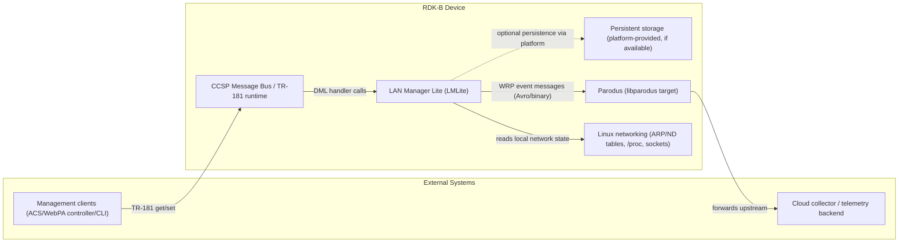
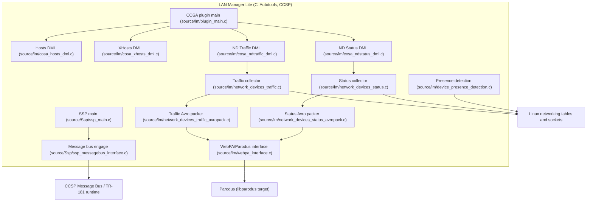
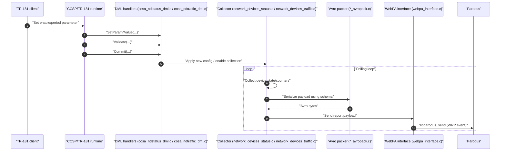
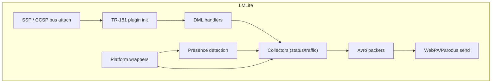

# LM Lite Kavia freeflow

## Overview

LAN Manager Lite (often referred to in code and configs as **LMLite**) is an RDK-B middleware component that exposes LAN-host and LAN-device telemetry/control surfaces through a CCSP/TR-181 data model plugin and implements periodic reporting of device status and traffic using Avro-encoded payloads sent upstream via WebPA/Parodus.

In this repository, the component is built as an Autotools project. In this workspace checkout, its top-level directory is `lan-manager-lite-2474/`. It contains an SSP (Subsystem Plugin) entry point (`source/Ssp/ssp_main.c`) that engages the CCSP message bus and loads a data-model plugin. The data-model plugin registers TR-181 handlers for host tables and reporting objects and routes “get/set/validate/commit/rollback” operations to DML implementation files such as `source/lm/cosa_hosts_dml.c`, `source/lm/cosa_ndstatus_dml.c`, and `source/lm/cosa_ndtraffic_dml.c`. Separately, “reporting” modules such as `source/lm/network_devices_status.c` and `source/lm/network_devices_traffic.c` implement the runtime collection loops that are driven by enable flags and polling/reporting periods.

At runtime, LMLite also contains a WebPA/Parodus client interface (`source/lm/webpa_interface.c`) used by the Avro “packer” modules (for example `source/lm/network_devices_status_avropack.c` and `source/lm/network_devices_traffic_avropack.c`) to publish upstream telemetry.

A high-level system context (evidence-limited to repository artifacts) is shown below.

## Key Features

LAN Manager Lite provides a mixture of data-model exposure (TR-181) and telemetry generation features that are evidenced by the source tree.

It exposes host information through CCSP/TR-181 handler implementations, including host table access and extended host properties, implemented in `source/lm/cosa_hosts_dml.c` and `source/lm/cosa_xhosts_dml.c`.

It provides two telemetry/reporting domains for LAN devices, both backed by Avro schema definitions shipped in `config/` (located at `lan-manager-lite-2474/config/` in this workspace checkout):

First, **Network Devices Status** reporting uses `config/NetworkDevicesStatus.avsc` and runtime logic in `source/lm/network_devices_status.c` and `source/lm/network_devices_status_avropack.c` to collect per-device status and serialize it as Avro.

Second, **Network Devices Traffic** reporting uses `config/NetworkDevicesTraffic.avsc` and runtime logic in `source/lm/network_devices_traffic.c` and `source/lm/network_devices_traffic_avropack.c` to collect traffic counters and serialize them as Avro.

It implements device presence detection logic in `source/lm/device_presence_detection.c`, which reads local neighbor/ARP state and generates join/leave style presence updates that the rest of the component can use to drive host/device state.

It contains an explicit WebPA/Parodus communication layer (`source/lm/webpa_interface.c`) that encapsulates Parodus initialization and send semantics for WRP messages carrying Avro payloads.

## Design

LAN Manager Lite follows the classic CCSP “SSP + plugin” structure.

The SSP side (under `source/Ssp/`) is responsible for lifecycle and CCSP bus engagement. The SSP main (`source/Ssp/ssp_main.c`) is the process entry point that daemonizes/initializes and then uses the CCSP “message bus engage” path implemented in `source/Ssp/ssp_messagebus_interface.c`. This is the northbound control-plane entry for TR-181 operations: when a management client does a get/set/commit, the CCSP framework routes those calls to the DML functions registered by the plugin.

The data-model plugin is implemented as a COSA plugin and is initialized by `source/lm/plugin_main.c`. In that file, the plugin registers TR-181 handler entry points via `RegisterFunction(...)`, then constructs and initializes backend objects. The backend initialization path ties the TR-181 tree defined in `config/LMLite.XML` to the C handler implementations under `source/lm/`.

The southbound, runtime “data collection” side is implemented in the `source/lm/` modules. These modules acquire system state by reading local kernel tables and interfaces. For example, presence detection and host enumeration rely on ARP/neighbor discovery parsing and socket/netlink style IO in `source/lm/device_presence_detection.c` and the wrapper utilities in `source/lm/lm_wrapper.c` / `source/lm/lm_wrapper_priv.c`.

The reporting modules separate collection from encoding and sending. Collection modules (status/traffic) build in-memory device lists and counters; Avro packers serialize using the schemas shipped in `config/*.avsc`; then `webpa_interface.c` sends the Avro bytes via Parodus as WRP event messages.

A simplified internal component diagram (grounded to file-level modules in this repo) is shown below.

## Prerequisites and Dependencies

LAN Manager Lite is built as an Autotools component and expects a CCSP runtime environment at deployment time.

At build time, the Autotools project definition is provided by `configure.ac` and the Automake manifests under `Makefile.am` and `source/Makefile.am` (in this workspace checkout, these files are under `lan-manager-lite-2474/`). These files determine which libraries and feature macros are enabled for the build.

At runtime, the SSP path requires that the CCSP message bus is available and that the CCSP framework can load the component data model XML and plugin. The data model definition is in `config/LMLite.XML` (in this workspace checkout: `lan-manager-lite-2474/config/LMLite.XML`), which is the authoritative “what objects/parameters exist and which C functions implement them” source in this repository.

For telemetry, LMLite relies on the presence of Parodus and its client library since sending is implemented in `source/lm/webpa_interface.c`. Avro schemas required for encoding are shipped in-repo under `config/NetworkDevicesStatus.avsc` and `config/NetworkDevicesTraffic.avsc` (in this workspace checkout: `lan-manager-lite-2474/config/`). Platform integration is responsible for installing those schemas at the runtime paths expected by the component’s Avro packers (the exact runtime search paths are implemented in the Avro packer sources and may be conditional by build macros).

For southbound device-state collection, LMLite expects Linux networking support (ARP, Neighbor Discovery, interface enumeration) because modules like `device_presence_detection.c` and wrappers in `lm_wrapper.c` parse kernel tables and use sockets.

## Build-Time Flags and Configuration

The build system is rooted in Autotools and Automake.

The main build feature switches and compile-time gates should be treated as “evidence-based only”; the authoritative list of configure-time options is in `configure.ac`, while the compilation units and library/executable wiring are in `source/Makefile.am` and `source/lm/Makefile.am` (in this workspace checkout, these are under `lan-manager-lite-2474/`).

Several source files also demonstrate explicit conditional compilation that changes behavior depending on macros. For example, the WebPA interface and Avro packers typically include “simulation vs production” style compile paths, and some builds include RBUS support for WAN-related events (this is indicated by RBUS-guarded declarations in `source/lm/webpa_interface.h` and corresponding guarded code in `source/lm/webpa_interface.c`).

Because build flags are ultimately authoritative in `configure.ac` and the Automake conditionals, platform integrators should confirm which macros are defined in their build (for example in generated `config.h`) before assuming a given runtime behavior.

## RDK-B Platform and Integration Requirements

LAN Manager Lite is designed to run as a CCSP component in an RDK-B stack. In practical integration terms, it requires:

The CCSP message bus and TR-181 runtime must be available before LMLite starts, because `source/Ssp/ssp_main.c` engages the message bus and the plugin expects CCSP to call into its `COSA_Init` registration path.

The component’s TR-181 data model XML (`config/LMLite.XML`, located at `lan-manager-lite-2474/config/LMLite.XML` in this workspace checkout) must be installed to the location expected by the CCSP framework on the target device, and the built plugin library must be loadable by the CCSP component loader.

Parodus must be available and running if upstream telemetry is expected, because Avro report send paths in `source/lm/webpa_interface.c` depend on initializing and sending via libparodus.

The Avro schemas (`config/NetworkDevicesStatus.avsc` and `config/NetworkDevicesTraffic.avsc`) must be deployed alongside the component in the runtime filesystem location the packers use when loading schema JSON. Without those schema files, Avro encoding cannot initialize successfully.

The component also assumes standard RDK-B filesystem conventions for logs and runtime state (exact file paths are defined in the source via macros and are therefore platform-dependent), and it assumes that Linux networking interfaces for neighbor/ARP queries are present and permitted.

## Threading Model

LAN Manager Lite uses a multi-threaded model.

The SSP side runs a main thread that initializes and then enters a steady-state loop after engaging the message bus. The runtime collection and reporting subsystems create worker threads to perform periodic polling and reporting work. These threads typically run timed loops that wake based on polling periods and trigger report generation when the reporting period threshold is met, as implemented in modules such as `source/lm/network_devices_status.c` and `source/lm/network_devices_traffic.c`.

The WebPA/Parodus interface also includes concurrency and synchronization primitives. `source/lm/webpa_interface.c` contains shared send-path logic that must be safe against concurrent reporters calling into the send API; this pattern is typically implemented with a send mutex around `libparodus_send` in RDK-B components, and the presence of thread and synchronization constructs in this file should be treated as the evidence source for exact locking behavior.

Presence detection (`source/lm/device_presence_detection.c`) is also implemented as an ongoing monitoring activity and may run either as a dedicated thread or as a subsystem invoked by periodic collectors, depending on build-time configuration and how the module is initialized by the DML/backend init path.

## Component Flow (Request/Response)

LAN Manager Lite has two primary “flows” that are evidenced in this repository: TR-181 request/response operations and asynchronous telemetry reporting.

### TR-181 request/response (CCSP get/set/commit)

TR-181 operations enter via the CCSP framework, which loads the data model described by `config/LMLite.XML` and calls the plugin initialization (`source/lm/plugin_main.c`) to register handler functions.

A representative request flow is:

A management client issues a TR-181 set on a reporting enable flag or period parameter defined in the XML.

The CCSP runtime calls the corresponding “SetParam*Value” handler in the relevant DML file (for example `source/lm/cosa_ndstatus_dml.c` or `source/lm/cosa_ndtraffic_dml.c`).

The CCSP runtime then calls the module’s “Validate” and “Commit” handlers; the commit path applies the configuration to the runtime collector modules (status/traffic). In classic CCSP patterns, rollback handlers revert staged changes if validation fails. The presence of `Validate`, `Commit`, and `Rollback` handlers is evidenced by the naming and structure in these DML source files.

### Telemetry report generation and send (collector → Avro packer → WebPA)

The runtime collector modules periodically build device lists and counters, then call into the Avro packer modules to serialize.

The packers use the Avro schemas shipped under `config/` to construct the payload bytes.

The serialized payload is then handed to the WebPA interface (`source/lm/webpa_interface.c`), which prepares a WRP message and uses libparodus to send it to Parodus for upstream forwarding.

The following sequence diagram captures the intended control flow at a level that matches the repository’s module layout.

## TR-181 Data Models

The authoritative TR-181 data model for LAN Manager Lite in this repository is `config/LMLite.XML` (in this workspace checkout: `lan-manager-lite-2474/config/LMLite.XML`).

This XML file defines the object hierarchy, parameters, and the function mappings into the plugin library. The concrete set of objects/parameters must be read from the XML because it is the contract between CCSP and the plugin.

In addition to host/host-table related objects, LMLite includes objects that correspond to the Network Devices Status and Network Devices Traffic reporting subsystems, since there are dedicated DML implementations for both (`cosa_ndstatus_dml.c` and `cosa_ndtraffic_dml.c`) and Avro schemas in `config/`.

When documenting exact parameter names and access types for a product integration, the XML should be used as the primary source of truth, and the DML files should be used to understand validation rules, commit semantics, and any persistence behavior.

## Internal Modules

LAN Manager Lite’s repository structure gives a clear mapping from modules to files.

| Module | Description | Key Files |
|---|---|---|
| SSP entry and CCSP message bus engagement | Process entry point, daemonization, CCSP bus connect, and component lifecycle. | `source/Ssp/ssp_main.c`, `source/Ssp/ssp_messagebus_interface.c` |
| TR-181 plugin initialization | Registers handler functions and creates backend objects that map XML to code. | `source/lm/plugin_main.c` |
| Hosts data model (TR-181) | Implements TR-181 handlers for host tables and host properties. | `source/lm/cosa_hosts_dml.c`, `source/lm/cosa_xhosts_dml.c` |
| Network Devices Status DML | TR-181 handlers for configuring status reporting (enable/periods, validation/commit). | `source/lm/cosa_ndstatus_dml.c` |
| Network Devices Traffic DML | TR-181 handlers for configuring traffic reporting (enable/periods, validation/commit). | `source/lm/cosa_ndtraffic_dml.c` |
| Status collector | Runtime collection loop and device-status list management. | `source/lm/network_devices_status.c`, `source/lm/network_devices_status.h` |
| Traffic collector | Runtime collection loop and device-traffic list management. | `source/lm/network_devices_traffic.c`, `source/lm/network_devices_traffic.h` |
| Presence detection | Determines device join/leave and presence using local kernel tables and sockets. | `source/lm/device_presence_detection.c`, `source/lm/device_presence_detection.h` |
| WebPA/Parodus interface | Initializes Parodus client and sends WRP event messages containing Avro payloads. | `source/lm/webpa_interface.c`, `source/lm/webpa_interface.h` |
| Wrapper / platform helpers | Reads and normalizes LAN interface/host information from the OS and platform. | `source/lm/lm_wrapper.c`, `source/lm/lm_wrapper_priv.c` |
| Avro packers | Loads schema, serializes status/traffic structures into Avro bytes. | `source/lm/network_devices_status_avropack.c`, `source/lm/network_devices_traffic_avropack.c` |

## Key Implementation Logic

The repository’s implementation logic centers on three areas: staged TR-181 configuration, periodic reporting, and system-state acquisition.

First, TR-181 configuration is implemented with the CCSP “validate/commit/rollback” pattern in `cosa_ndstatus_dml.c` and `cosa_ndtraffic_dml.c`. These modules typically stage changes on set calls, validate them (including constraints such as allowed polling/reporting periods and ordering requirements), and then apply them during commit. This pattern prevents partially applied configuration and provides consistent error handling semantics to northbound management clients.

Second, periodic reporting logic is implemented in `network_devices_status.c` and `network_devices_traffic.c` as polling loops. These loops collect data at the configured polling cadence, accumulate into in-memory structures, and then trigger report generation when the configured reporting cadence is reached. The “current period counter vs configured reporting period” approach is evidenced by the presence of polling/reporting configuration primitives and periodic report functions in these modules.

Third, system-state acquisition and normalization is implemented in `device_presence_detection.c` and wrapper modules (`lm_wrapper.c` and `lm_wrapper_priv.c`). These modules read OS-level data such as ARP/neighbor tables, interface metadata, and potentially DHCP lease/state information to build a consistent view of LAN devices. The collector modules then use that normalized view to populate Avro report structures.

Finally, the Avro packers (`*_avropack.c`) load schema JSON from the `.avsc` files, prepare writers, and serialize the in-memory structures into Avro binary. The WebPA interface then transmits these bytes upstream via Parodus.

## Key Configuration Files

LAN Manager Lite’s key configuration files are the TR-181 XML model and the Avro schemas.

| File | Purpose | Notes (as evidenced in this repository) |
|---|---|---|
| `config/LMLite.XML` | Defines the CCSP/TR-181 data model and function mappings into the plugin library. | In this workspace checkout, this file is located at `lan-manager-lite-2474/config/LMLite.XML`. |
| `config/NetworkDevicesStatus.avsc` | Avro schema for network-device status reports. | Used by `network_devices_status_avropack.c`. In this workspace checkout, this file is located at `lan-manager-lite-2474/config/NetworkDevicesStatus.avsc`. |
| `config/NetworkDevicesTraffic.avsc` | Avro schema for network-device traffic reports. | Used by `network_devices_traffic_avropack.c`. In this workspace checkout, this file is located at `lan-manager-lite-2474/config/NetworkDevicesTraffic.avsc`. |
| `configure.ac` | Autotools project configuration, feature detection, and build option definitions. | In this workspace checkout, this file is located at `lan-manager-lite-2474/configure.ac`. |
| `Makefile.am` and `source/Makefile.am` | Automake build wiring for subdirectories, libraries, and artifacts. | In this workspace checkout, these files are located under `lan-manager-lite-2474/`. |

## Notes on repository evidence and scope

This document is intentionally constrained to artifacts present in this repository snapshot. For platform-specific integration details that are commonly part of RDK-B delivery (for example, systemd unit files, Yocto recipes, packaging paths, and device-specific filesystem layouts), those artifacts are not present in this workspace checkout and therefore are not described here as concrete files. Where the component relies on platform-provided services (CCSP runtime, Parodus, persistent storage), the repository evidence is the source code integration points and the TR-181 XML contract.
