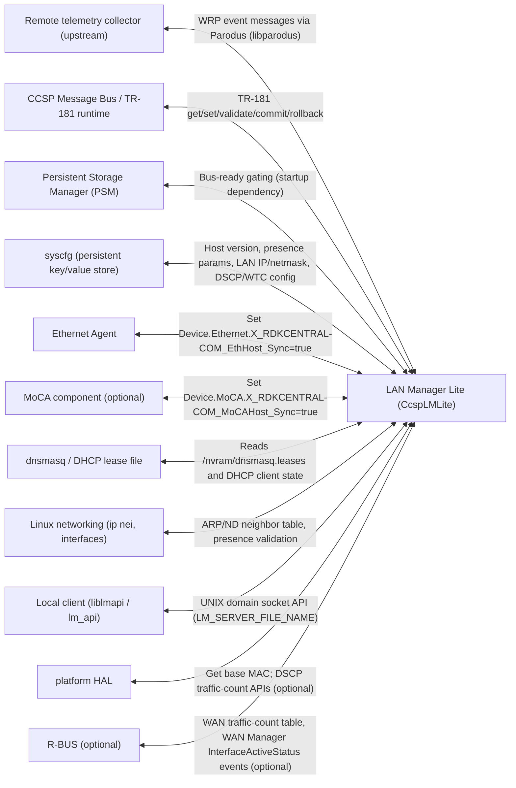
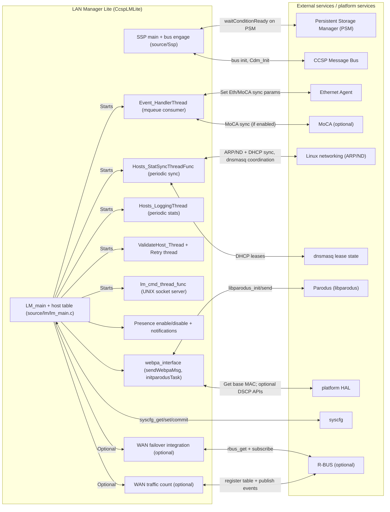
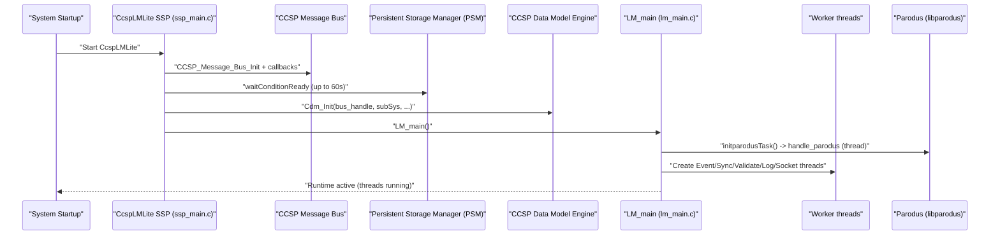
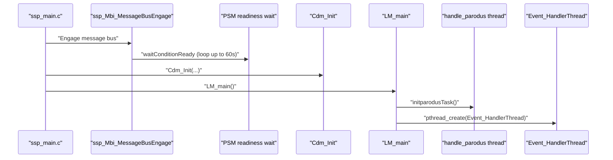
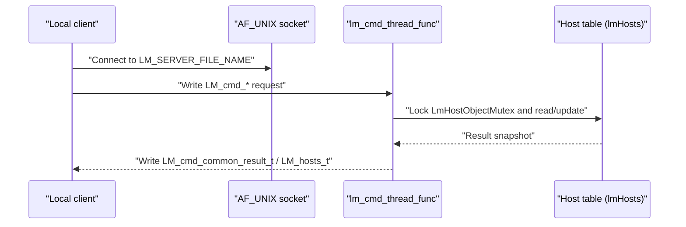

# LM Lite - Kavia template based

## Overview

LAN Manager Lite (LMLite) is an RDK-B middleware component that runs as the `CcspLMLite` CCSP process and maintains a live view of LAN-side devices. In the `lan-manager-lite` repository, its operational core is implemented in `source/lm/lm_main.c` and is started by the SSP entrypoint in `source/Ssp/ssp_main.c`. At runtime it continuously ingests LAN observations (ARP/neighbor state, DHCP lease state, and asynchronous “client event” messages pushed in via queues), updates the TR-181 `Device.Hosts.*` view, and produces telemetry using WebPA/Parodus.

This document is intentionally grounded only in the `lan-manager-lite` source and build files. It does not describe “usual RDK-B behavior” unless the corresponding behavior is visible in this repository. Where platform integration artifacts are typically expected (Yocto recipes, systemd units, etc.), those are explicitly called out as not verifiable if they are not present here.

## C4 System Context Diagram

## Key Features & Responsibilities

LMLite’s responsibilities in this codebase are implemented across the `source/lm/` modules and the SSP integration under `source/Ssp/`. Operationally, most of the “always-on” runtime behavior begins inside `LM_main()` in `source/lm/lm_main.c`, which creates worker threads, primes host state, and then relies on those threads to keep the in-memory host table and reporting subsystems current.

- **CCSP message bus engagement and TR-181 runtime attachment**: The SSP process (`source/Ssp/ssp_main.c`) daemonizes by default, engages the CCSP message bus via `ssp_Mbi_MessageBusEngage(...)` (`source/Ssp/ssp_messagebus_interface.c`), and initializes the CCSP Data Model engine via `Cdm_Init(...)`. As a startup gating step, `ssp_messagebus_interface.c` waits up to 60 seconds for the Persistent Storage Manager (PSM) component to be “ready” on the bus.

- **Host/device information management and `Device.Hosts.*` maintenance**: The main host table is managed in `source/lm/lm_main.c`. Hosts are added/removed and updated based on ARP/neighbor observations, DHCP client parsing, and asynchronous events. The module uses mutexes such as `LmHostObjectMutex` and `PresenceDetectionMutex` to serialize concurrent updates across multiple worker threads.

- **Asynchronous event ingestion using POSIX message queues**: The runtime uses named POSIX mqueues, including `"/Event_queue"` and `"/Validate_host_queue"` (`source/lm/lm_main.c`), to receive event messages about Ethernet, WiFi, MoCA (optional), and feature-control (RFC-style) toggles. The `Event_HandlerThread` blocks on `mq_receive(...)` for `"/Event_queue"` and updates host entries accordingly.

- **Device presence detection and presence notifications**: Presence enablement is controlled through syscfg keys (for example `PresenceDetectEnabled` and the WebPA notification toggle `notify_presence_webpa`), and presence status is tracked per-host via `LM_HOST_PresenceActiveId` and related fields. Presence workflow is implemented primarily in `source/lm/lm_main.c`, which enables/disables the presence detection task, pushes dnsmasq coordination messages (`Sendmsg_dnsmasq(...)`), and updates detection status via `Hosts_UpdateDeviceIntoPresenceDetection(...)`.

- **Upstream telemetry message sending via WebPA/Parodus**: The `webpa_interface` layer (`source/lm/webpa_interface.c`) initializes a detached Parodus client thread (`initparodusTask()` creates a pthread that runs `handle_parodus()`), and it sends WRP event messages using `libparodus_send(...)` in `sendWebpaMsg(...)`. The send path is protected by `webpa_mutex` and implements exponential backoff retry (up to 6 attempts) on send failure.

- **Local client API over a UNIX domain socket**: Under `LM_IPC_SUPPORT`, LMLite implements a long-lived UNIX domain socket server thread (`lm_cmd_thread_func`) that `bind()`s and `listen()`s on `LM_SERVER_FILE_NAME` (`source/lm/lm_main.c`). This dispatches commands such as “get hosts”, “get host by MAC”, “set comment”, and “get online-device count” to handler functions that snapshot host state under `LmHostObjectMutex`. The library-side `liblmapi.la` is built from `source/lm/lm_api.c` (top-level `Makefile.am`).

- **Optional R-BUS integration for WAN failover / WAN traffic counting**: The code contains two distinct optional R-BUS areas. First, under `WAN_FAILOVER_SUPPORTED`, `LM_main()` checks `checkRbusEnabled()` and can open R-BUS as `LMLITE_COMPONENT_NAME`, read `Device.X_RDK_WanManager.InterfaceActiveStatus` via `rbus_get(...)`, and subscribe to InterfaceActiveStatus events (`rbusEvent_SubscribeAsync(...)`) in `source/lm/webpa_interface.c`. Second, under `WAN_TRAFFIC_COUNT_SUPPORT` (configure-time option in `configure.ac`), WAN traffic counting is initialized via `WTC_Init()` (`source/lm/cosa_wantraffic_api.c`), registers a `Device.X_RDK_WAN.Interface.{i}` table and stats parameters (`source/lm/wtc_rbus_apis.c`), and publishes per-interval/total DSCP counters via R-BUS events.

## Design

The overall design uses a CCSP SSP “shell” for message-bus attachment and data model registration, while the long-running host/presence logic lives in `LM_main()` and its worker threads. The SSP flow is visible in `source/Ssp/ssp_main.c`: it engages the message bus, creates and engages the SSP, initializes the CCSP Data Model (`Cdm_Init`), and then calls `LM_main()`.

The `LM_main()` design is explicitly multi-threaded. It initializes core mutexes, initializes the wrapper layer (`lm_wrapper_init()`), loads persisted counters/config from syscfg (for example `X_RDKCENTRAL-COM_HostVersionId` and `X_RDKCENTRAL-COM_HostCountPeriod`), optionally initializes R-BUS and WAN traffic-counting, and then starts worker threads for event ingestion, periodic synchronization, validation workflows, statistics logging, and the UNIX socket command server.

For upstream publishing, `initparodusTask()` starts a dedicated Parodus init thread, and callers use `sendWebpaMsg(...)` to transmit. The send path is synchronized with `webpa_mutex` to avoid concurrent `libparodus_send(...)` calls and uses backoff-based retries.

### Component Diagram

A component diagram showing the component’s internal structure and dependencies is given below.

### Prerequisites and Dependencies

This repository contains an Autotools-based build (`configure.ac`, `Makefile.am`, and per-directory `Makefile.am` files). The primary runtime dependencies evidenced by linking and includes are CCSP common libraries, syscfg, sysevent, telemetry sender, Avro, libparodus/wrp, pthreads, and (optionally) R-BUS. Build-time wiring for the core library and SSP binary is in:

- `lan-manager-lite/source/lm/Makefile.am` (builds `libCcspLM.la` and links against `-lsyscfg -lsysevent -ltelemetry_msgsender -lavro -pthread -lnanomsg -lwrp-c -llibparodus -lsecure_wrapper -lhal_platform -lccsp_common` among others).
- `lan-manager-lite/source/Ssp/Makefile.am` (builds the `CcspLMLite` executable and links `libCcspLM.la` and `liblmapi.la`).

The SSP explicitly depends on the Persistent Storage Manager (PSM) being present on the message bus, because `source/Ssp/ssp_messagebus_interface.c` waits up to 60 seconds for it to become ready before proceeding.

The CCSP data model XML for this component is `lan-manager-lite/config/LMLite.XML`. This is the authoritative contract (within this repository) for the TR-181 object/parameter surfaces that CCSP can route into this component.

## Threading Model

LMLite is explicitly multi-threaded and creates multiple long-lived worker threads at startup.

In `LM_main()` (`lan-manager-lite/source/lm/lm_main.c`), the following thread creation sites are verified:

The component starts Parodus initialization in a detached thread using `initparodusTask()` (`lan-manager-lite/source/lm/webpa_interface.c`), which creates a pthread running `handle_parodus()` and then detaches itself (`pthread_detach(pthread_self())`) inside that function.

It creates a validation pipeline for WiFi/host sync using two threads:
- `ValidateHost_Thread` consumes `"/Validate_host_queue"` and either syncs immediately or adds hosts to a retry list.
- `ValidateHostRetry_Thread` wakes every 15 seconds and retries validation for items in that list up to three times.

It creates an `Event_HandlerThread` that blocks on `mq_receive(...)` from `"/Event_queue"` and applies updates for Ethernet/WiFi/MoCA (optional) and RFC-style enable/disable messages.

It creates a periodic sync thread, `Hosts_StatSyncThreadFunc`, which runs a loop that (when not in “bridge mode”) sends dnsmasq coordination messages, syncs DHCP and ARP state, and updates IPv6 addresses from dibbler cache.

It creates a periodic logging/telemetry thread, `Hosts_LoggingThread`, which sleeps 30 seconds and then logs aggregated connected-client counts (total/online/offline and per-medium breakdown), emits corresponding `t2_event_d(...)` telemetry events, and sleeps for `g_Client_Poll_interval * 60` seconds (where `g_Client_Poll_interval` is read from syscfg `X_RDKCENTRAL-COM_HostCountPeriod`).

Under `LM_IPC_SUPPORT`, it creates a UNIX domain socket server thread, `lm_cmd_thread_func`, which loops forever accepting connections and dispatching command handlers.

Additional conditional threading exists under `WAN_TRAFFIC_COUNT_SUPPORT` in `WTC_Init()` (WAN traffic count subsystem) where it creates and detaches a WAN traffic polling thread (`WTC_CreateThread()` creates `WTC_Thread` and detaches it). This subsystem is only compiled/linked when the `--enable-wan_traffic_count_support` configure option is enabled (`lan-manager-lite/configure.ac`) and the `WAN_TRAFFIC_COUNT_SUPPORT` automake conditional is active (`lan-manager-lite/source/lm/Makefile.am`).

Synchronization primitives and their usage are also source-verified. For example:
- `LmHostObjectMutex` guards the in-memory host table for both request handlers and worker threads.
- `PresenceDetectionMutex` is acquired together with `LmHostObjectMutex` via helper functions (`acquirePresencelocks()` / `releasePresenceLocks()`) to avoid inconsistent presence-table updates.
- `webpa_mutex` in `webpa_interface.c` serializes the Parodus send path (`sendWebpaMsg`).

## Component State Flow / Initialization

### Startup sequence (source-verified)

The end-to-end initialization sequence is visible across `source/Ssp/ssp_main.c`, `source/Ssp/ssp_messagebus_interface.c`, and `source/lm/lm_main.c`.

At process start, `ssp_main.c` parses flags such as `-subsys` (subsystem prefix) and `-c` (run in console, not daemonized). It then initializes telemetry (`t2_init("ccsp-lm-lite")`), daemonizes by default, installs signal handlers, and runs `cmd_dispatch('e')`, which performs:
- `ssp_Mbi_MessageBusEngage(componentId, CCSP_MSG_BUS_CFG, CCSP_COMPONENT_PATH_LMLITE)`
- `ssp_create()` and `ssp_engage()`

Then it initializes the CCSP data model engine via `Cdm_Init(bus_handle, subSys, ...)`, creates `/tmp/lmlite_initialized`, and calls `LM_main()`.

Inside `LM_main()` the component:
- Initializes mutexes.
- Calls `lm_wrapper_init()`.
- Allocates host arrays and initializes counters.
- Loads persisted values such as `X_RDKCENTRAL-COM_HostVersionId` and `X_RDKCENTRAL-COM_HostCountPeriod` from syscfg, defaulting and persisting `HostCountPeriod` to 60 minutes if missing.
- Optionally initializes R-BUS WAN failover hooks under `WAN_FAILOVER_SUPPORTED` by calling `checkRbusEnabled()`, `lmliteRbusInit(...)`, reading the current active interface list, and subscribing to InterfaceActiveStatus events.
- Starts Parodus init in the background by calling `initparodusTask()`.
- Optionally initializes WAN traffic counting under `WAN_TRAFFIC_COUNT_SUPPORT` by calling `WTC_Init()`.
- Spawns the worker threads described in the Threading Model section.
- Seeds initial host state by requesting Ethernet/MoCA (optional) host synchronization from other components via CCSP set calls (`Device.Ethernet.X_RDKCENTRAL-COM_EthHost_Sync=true` and `Device.MoCA.X_RDKCENTRAL-COM_MoCAHost_Sync=true`) and running `SyncWiFi()`, but only when `Hosts_stop_scan()` indicates it is not in bridge mode.
- Conditionally enables presence detection if syscfg `PresenceDetectEnabled` is `"true"`.

### Initialization to Active State (sequence diagram)

### Runtime state changes (source-verified examples)

Runtime “state changes” are primarily driven by:
- Bridge mode changes: `Hosts_stop_scan()` is polled in `Hosts_StatSyncThreadFunc`. When bridge mode is detected, host information is cleared via `Hosts_RmHosts()` and the thread sleeps, effectively shifting the component into a “minimal/no host tracking” mode until bridge mode ends.
- Presence detection enable/disable: The presence feature is toggled through syscfg (`PresenceDetectEnabled`) and runtime calls to `Hosts_EnablePresenceDetectionTask()` / `Hosts_DisablePresenceDetectionTask()`, which start/stop presence detection, reset syscfg keys, and coordinate with dnsmasq using a non-blocking message queue (`DNSMASQ_NOTIFY_QUEUE_NAME`).
- Host status transitions (online/offline): `LM_SET_ACTIVE_STATE_TIME(...)` updates `Active` state, timestamps, and emits logs/telemetry. For WiFi/Ethernet/MoCA events it is invoked by `Event_HandlerThread`.

## Detailed Integration Requirements (RDK-B platform dependencies)

This section is included because the repository contains concrete integration points and build/link evidence for these dependencies. Where a dependency is common in RDK-B but not directly evidenced by source/build files here, it is explicitly marked as not verifiable in this workspace.

The component requires a CCSP runtime and message bus because it uses `CCSP_Message_Bus_Init(...)`, `CcspBaseIf_*` calls, and initializes `Cdm_Init(...)` (`lan-manager-lite/source/Ssp/ssp_main.c` and `source/Ssp/ssp_messagebus_interface.c`). It also uses a data model XML (`lan-manager-lite/config/LMLite.XML`) that must be installed for CCSP to route TR-181 calls.

The component has a startup dependency on the Persistent Storage Manager (PSM) being available on the bus. This is not an inferred dependency; it is explicitly waited on in `ssp_messagebus_interface.c` using `waitConditionReady(...)` with a 60-second timeout loop.

The component uses syscfg as a persistent key/value store for operational state and configuration. This is evidenced by many direct calls in `lm_main.c` (for example `syscfg_get`, `syscfg_set_u_commit`, `syscfg_set_commit`, `syscfg_commit`, and `syscfg_unset`), and by the explicit link flag `-lsyscfg` in `lan-manager-lite/source/lm/Makefile.am`.

The component depends on Parodus (and WRP) for upstream telemetry. `webpa_interface.c` calls `libparodus_init` and `libparodus_send` and constructs `wrp_msg_t` event messages. The build links `-llibparodus` and `-lwrp-c` in `source/lm/Makefile.am`.

The component depends on Linux networking and local system state. `lm_main.c` reads ARP/neighbor state (either by calling `ip nei show` through `v_secure_system(...)` or using Core Net Lib under `CORE_NET_LIB`) and reads dnsmasq lease information from `/nvram/dnsmasq.leases`. These paths and commands are embedded in the code and therefore must exist/be permitted on the target image.

The component integrates with other CCSP components for “host sync” triggers. Specifically, it sets:
- `Device.Ethernet.X_RDKCENTRAL-COM_EthHost_Sync=true` on `eRT.com.cisco.spvtg.ccsp.ethagent` at `/com/cisco/spvtg/ccsp/ethagent` (`Send_Eth_Host_Sync_Req` in `lm_main.c`).
- `Device.MoCA.X_RDKCENTRAL-COM_MoCAHost_Sync=true` on `eRT.com.cisco.spvtg.ccsp.moca` at `/com/cisco/spvtg/ccsp/moca` when `CONFIG_SYSTEM_MOCA` is enabled (`Send_MoCA_Host_Sync_Req` in `lm_main.c`).

Optional R-BUS requirements exist and are feature-gated:
- Under `WAN_FAILOVER_SUPPORTED`, LMLite opens R-BUS and reads/subscribes to `Device.X_RDK_WanManager.InterfaceActiveStatus` in `webpa_interface.c`. For this feature to function, R-BUS must be enabled (`rbus_checkStatus()==RBUS_ENABLED`) and WAN Manager must publish that parameter/event.
- Under `WAN_TRAFFIC_COUNT_SUPPORT`, LMLite registers and publishes a `Device.X_RDK_WAN.Interface.{i}` table and stats parameters via R-BUS (`wtc_rbus_apis.c`) and uses platform HAL DSCP APIs (calls such as `platform_hal_setDscp(...)`, `platform_hal_getDscpClientList(...)`, and `platform_hal_resetDscpCounts(...)` in `cosa_wantraffic_api.c`). This feature is only present when compiled with the configure-time option `--enable-wan_traffic_count_support` (`configure.ac`) and the automake conditional includes these sources (`source/lm/Makefile.am`).

Not verifiable in this repository: systemd unit files, Yocto recipes, and explicit startup ordering via systemd dependencies. These artifacts are not present under `lan-manager-lite/` in this workspace snapshot, so this document does not state exact service names or unit dependencies beyond what is visible in code (PSM bus readiness wait and Parodus usage).

## Call Flow

### Initialization Call Flow

### Request Processing Call Flow (UNIX socket API)

The repository’s most concrete “request/response” flow that does not depend on CCSP runtime behavior is the UNIX domain socket command interface implemented in `lm_main.c` under `LM_IPC_SUPPORT`. The server accepts a connection, reads a command struct, and dispatches into handlers that snapshot host state under `LmHostObjectMutex`.

## Internal Modules

The internal modules in this repository are primarily organized under `lan-manager-lite/source/lm/` and are invoked from the SSP integration layer.

| Module/Class | Description | Key Files |
|-------------|------------|-----------|
| SSP entry and bus attach | Process startup, bus engage, PSM readiness wait, and Cdm_Init | `lan-manager-lite/source/Ssp/ssp_main.c`, `lan-manager-lite/source/Ssp/ssp_messagebus_interface.c` |
| Host table & runtime engine | In-memory host objects, mqueue ingestion, periodic sync/logging, presence workflows, UNIX socket server | `lan-manager-lite/source/lm/lm_main.c`, `lan-manager-lite/source/lm/lm_main.h` |
| WebPA/Parodus interface | Parodus init thread, WRP event construction, send retry/backoff, device MAC acquisition via HAL | `lan-manager-lite/source/lm/webpa_interface.c`, `lan-manager-lite/source/lm/webpa_interface.h` |
| Optional WAN traffic count (WTC) | R-BUS table registration, DSCP config in syscfg, HAL polling thread, event publish | `lan-manager-lite/source/lm/cosa_wantraffic_api.c`, `lan-manager-lite/source/lm/wtc_rbus_apis.c`, `lan-manager-lite/source/lm/wtc_rbus_handler_apis.c` |
| Data model contract | TR-181 objects/params surfaced by this component | `lan-manager-lite/config/LMLite.XML` |

## Component Interactions

LMLite interacts with upstream telemetry receivers through its WebPA/Parodus interface abstraction, interacts with CCSP/TR-181 through its SSP and data model, exposes a local UNIX socket API, and optionally integrates with R-BUS for WAN-related features. It also interacts with syscfg for persisted operational parameters and uses CCSP calls to trigger host synchronization in other RDK-B components (Ethernet Agent and optionally MoCA).

### Interaction Matrix

| Target Component/Layer | Interaction Purpose | Key APIs/Endpoints |
|------------------------|-------------------|------------------|
| Upstream telemetry receiver (via WebPA/Parodus) | Send WRP event messages containing telemetry payloads | `sendWebpaMsg(...)` (`lan-manager-lite/source/lm/webpa_interface.c`) |
| Parodus (libparodus) | Initialize client and send events with retry/backoff | `libparodus_init`, `libparodus_send` (`lan-manager-lite/source/lm/webpa_interface.c`) |
| CCSP message bus / TR-181 runtime | Bus attach + data model engine init; TR-181 routing into the component | `CCSP_Message_Bus_Init`, `Cdm_Init` (`lan-manager-lite/source/Ssp/ssp_messagebus_interface.c`, `ssp_main.c`); data model XML `lan-manager-lite/config/LMLite.XML` |
| Persistent Storage Manager (PSM) | Startup readiness gating on the bus | `waitConditionReady(..., PsmName, CCSP_DBUS_PATH_PSM, ...)` (`lan-manager-lite/source/Ssp/ssp_messagebus_interface.c`) |
| syscfg | Persist host version, polling interval, presence params, presence mac list entries, WTC DSCP config | `syscfg_get/set/commit/unset` calls throughout `lan-manager-lite/source/lm/lm_main.c` and `cosa_wantraffic_api.c` |
| Ethernet Agent | Trigger Ethernet host synchronization | `CcspBaseIf_setParameterValues` to `Device.Ethernet.X_RDKCENTRAL-COM_EthHost_Sync` (`lan-manager-lite/source/lm/lm_main.c`) |
| MoCA component (optional) | Trigger MoCA host synchronization | `CcspBaseIf_setParameterValues` to `Device.MoCA.X_RDKCENTRAL-COM_MoCAHost_Sync` (`lan-manager-lite/source/lm/lm_main.c`) |
| Linux networking + dnsmasq | Validate presence, sync ARP/ND and DHCP lease-derived state | `ip nei show` (via `v_secure_system`) or Core Net Lib path; `/nvram/dnsmasq.leases` access (`lan-manager-lite/source/lm/lm_main.c`) |
| R-BUS (optional) | WAN failover (InterfaceActiveStatus) and/or WAN traffic count (table/events) | `rbus_get`, `rbusEvent_SubscribeAsync` (`webpa_interface.c`); `rbus_regDataElements`, `rbusEvent_Publish` (`wtc_rbus_apis.c`, `cosa_wantraffic_api.c`) |
| platform HAL | Base MAC retrieval; DSCP traffic-count operations (optional) | `platform_hal_GetBaseMacAddress` (`webpa_interface.c`); `platform_hal_setDscp/getDscpClientList/resetDscpCounts` (`cosa_wantraffic_api.c`) |

### Any D-Bus references?

CcspLMLite uses CCSP’s D-Bus based message bus indirectly via the CCSP base APIs (for example `CCSP_Message_Bus_Init(...)` and the component path strings used when engaging the bus). This document does not introduce additional D-Bus IPC patterns beyond those CCSP APIs. The UNIX socket server is a separate, explicit IPC mechanism implemented in `lm_main.c`.

## Implementation Details

### Major Interfaces

The following interfaces are explicitly present in this repository and are suitable anchors for deeper operational documentation.

| Interface | Purpose | Key Files |
|---------|---------|-----------|
| `LM_main()` | Starts the runtime engine, threads, and integration flows | `lan-manager-lite/source/lm/lm_main.c` |
| `initparodusTask()` / `handle_parodus()` | Start Parodus init loop in a background thread | `lan-manager-lite/source/lm/webpa_interface.c` |
| `sendWebpaMsg(...)` | Build and send WRP event message via libparodus with retry/backoff | `lan-manager-lite/source/lm/webpa_interface.c` |
| `Event_HandlerThread` + `"/Event_queue"` | Apply Ethernet/WiFi/MoCA/RFC events to the host table | `lan-manager-lite-2474/source/lm/lm_main.c` |
| `Hosts_StatSyncThreadFunc` | Periodically sync DHCP/ARP/IPv6 cache and coordinate with dnsmasq | `lan-manager-lite/source/lm/lm_main.c` |
| `lm_cmd_thread_func` | UNIX domain socket server for local query/control | `lan-manager-lite/source/lm/lm_main.c` |
| `WTC_Init()` / `WTC_Thread()` (optional) | Initialize and run WAN traffic-counting, publish via R-BUS | `lan-manager-lite/source/lm/cosa_wantraffic_api.c` |
| `WTC_RbusInit()` / `WTC_EventPublish()` (optional) | Register WAN traffic-count table/params and publish events | `lan-manager-lite/source/lm/wtc_rbus_apis.c` |

### Key Configuration Files

| Configuration File | Purpose |
|--------------------|---------|
| `lan-manager-lite/config/LMLite.XML` | CCSP data model definition for LMLite |
| `lan-manager-lite/configure.ac` | Configure-time feature gates (notably `--enable-wan_traffic_count_support`) |
| `lan-manager-lite/source/lm/Makefile.am` | Link-time dependencies and optional source inclusion (WTC/R-BUS) |
