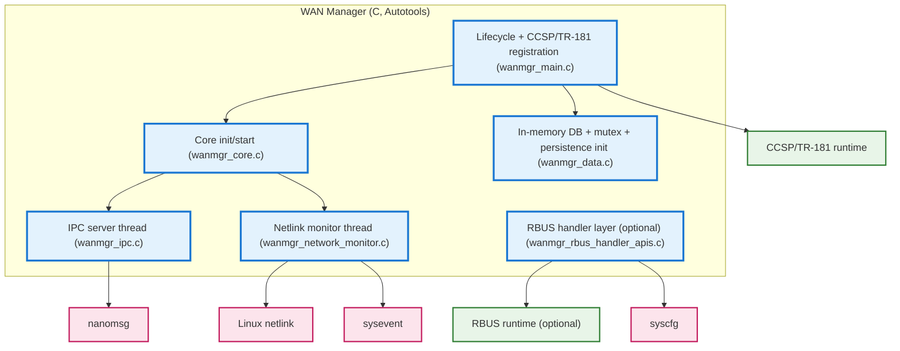
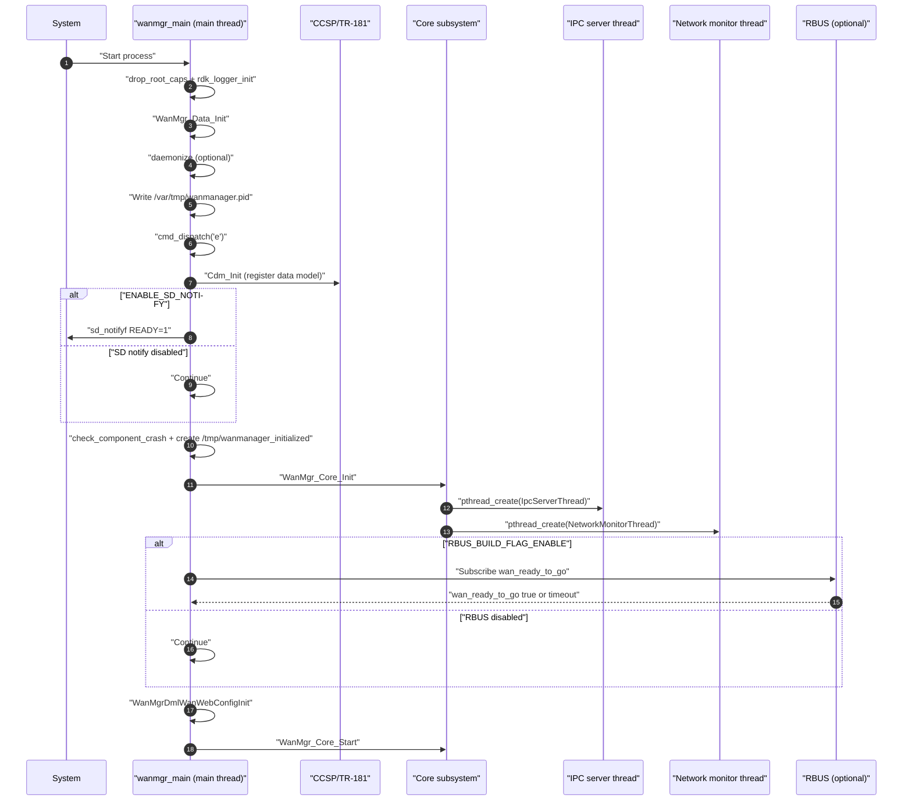
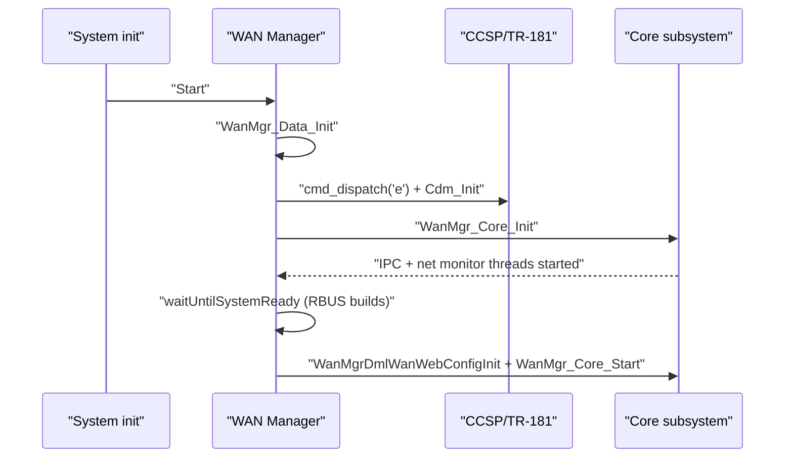
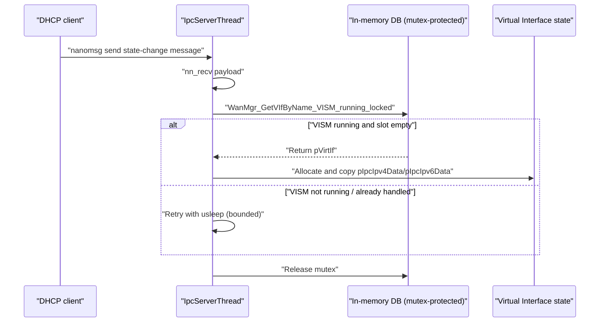

# WAN Manager - Kavia Template based

WAN Manager (`RdkWanManager`, main process entrypoint in `source/WanManager/wanmgr_main.c`) is the RDK-B middleware component responsible for orchestrating WAN connectivity above the physical-link layer. Interface managers (for example xDSL, Ethernet, DOCSIS, GPON, and cellular managers) are expected to bring up the physical interface and report physical-layer status and other configuration signals, and WAN Manager then configures link and IP layers and runs the business logic to establish and maintain internet connectivity (`wan-manager/README.md`, `source/WanManager/wanmgr_main.c`).

The daemon’s initialization sequence is explicitly implemented in `main()` and can be described without guessing. It drops root privileges (capability helper calls), initializes logging (`rdk_logger_init("/etc/debug.ini")`), initializes the in-memory database (`WanMgr_Data_Init()`), optionally daemonizes, writes its PID to `/var/tmp/wanmanager.pid`, engages the CCSP message bus (`cmd_dispatch('e')`), registers the TR-181 data model plugin via `Cdm_Init(...)`, optionally sends systemd readiness via `sd_notifyf(...)` when built with `--enable-notify`, informs the WebConfig framework about crash restart via `check_component_crash("/tmp/wanmanager_initialized")` and then creates `/tmp/wanmanager_initialized`, initializes the core subsystem (`WanMgr_Core_Init()`), optionally waits up to 180 seconds for `wan_ready_to_go` in RBUS builds, initializes WAN WebConfig (`WanMgrDmlWanWebConfigInit()`), and then starts the runtime (`WanMgr_Core_Start()`) in daemon mode (`source/WanManager/wanmgr_main.c`, `source/WanManager/wanmgr_core.c`).

Terminology replacement note: The task references an attachment containing an authoritative “name-only terminology replacement mapping”, but that attachment path was not found in the workspace during this run. As a result, no custom mapping could be applied; this update focuses on deepening operational detail and explicitly reporting what was confirmed vs not found.

```mermaid
graph LR
    subgraph "External Systems"
        RemoteMgmt["Remote Management (ACS, WebPA/USP controllers)"]
        LocalUI["Local Web UI / CLI"]
    end

    subgraph "RDK-B Platform"
        subgraph "Northbound Management"
            Agents["Management Agents (TR-069, WebPA, USP etc.)"]
            CCSP["CCSP/TR-181 Runtime"]
            RBUS["RBUS Runtime (optional)"]
            WebCfg["WebConfig Framework"]
        end

        WanMgr["WAN Manager"]

        subgraph "Platform Services and OS"
            PSM["PSM-backed DB via helper APIs"]
            Syscfg["syscfg"]
            SysEvent["sysevent"]
            Netlink["Linux netlink (IPv6 route/address)"]
            Nanomsg["nanomsg IPC (DHCP events)"]
        end
    end

    RemoteMgmt -->|TR-069/WebPA/USP| Agents
    LocalUI -->|HTTP/HTTPS| Agents

    Agents -->|TR-181 operations| CCSP
    Agents -->|WebConfig blobs| WebCfg
    Agents -->|RBUS methods/events (if enabled)| RBUS

    CCSP -->|Plugin calls| WanMgr
    RBUS -->|Properties, events, methods| WanMgr
    WebCfg -->|Subdocument init/apply/rollback| WanMgr

    WanMgr -->|Read/write persisted params| PSM
    WanMgr -->|Read platform keys| Syscfg
    WanMgr -->|Get/set system events| SysEvent
    WanMgr -->|Monitor routing/address changes| Netlink
    WanMgr -->|Receive DHCP client events| Nanomsg

    classDef external fill:#fff3e0,stroke:#ef6c00,stroke-width:2px;
    classDef rdkbComponent fill:#e8f5e8,stroke:#2e7d32,stroke-width:2px;
    classDef core fill:#e3f2fd,stroke:#1976d2,stroke-width:3px;
    classDef system fill:#fce4ec,stroke:#c2185b,stroke-width:2px;

    class RemoteMgmt,LocalUI external;
    class Agents,CCSP,RBUS,WebCfg rdkbComponent;
    class WanMgr core;
    class PSM,Syscfg,SysEvent,Netlink,Nanomsg system;
```

**Key Features & Responsibilities**:

- **Policy-driven WAN selection and failover (architecture-level)**: The repository explicitly describes one failover policy instance that handles runtime switching between interface groups, and “N instances of a Selection Policy, one instance per interface Group,” with examples like AutoWAN and Parallel Scan (`wan-manager/README.md`).
- **Per-virtual-interface orchestration (architecture-level)**: The repository explicitly states that WAN Manager runs “N instances of the WAN Interface State Machine, one instance per virtual interface,” and that the state machine “ensures correct configuration and deconfiguration of a virtual interface by building the stack from the bottom up” (`wan-manager/README.md`).
- **Concrete multi-threaded runtime with asynchronous event ingestion**: WAN Manager starts an IPC server thread that receives DHCPv4 and DHCPv6 state-change messages over nanomsg and deposits them into the correct virtual interface state when the virtual interface state machine is running, with bounded retry to avoid race windows at bring-up (`source/WanManager/wanmgr_core.c`, `source/WanManager/wanmgr_ipc.c`, `source/WanManager/wanmgr_data.c`).
- **Network monitoring for IPv6 route/address changes**: WAN Manager starts a netlink monitor thread that subscribes to IPv6 route and IPv6 interface-address groups, processes default gateway changes, toggles IPv6 behavior using sysevent key `ipv6Toggle`, and forwards global IPv6 address lifetime events to the DHCPv6 netlink address handler (`source/WanManager/wanmgr_network_monitor.c`).
- **Northbound TR-181 registration and (optional) RBUS exposure**: WAN Manager registers a TR-181 plugin via `Cdm_Init(...)` after engaging the CCSP bus (`source/WanManager/wanmgr_main.c`). When built with `RBUS_BUILD_FLAG_ENABLE`, WAN Manager registers RBUS properties/events/methods including per-interface methods like `Device.X_RDK_WanManager.Interface.{i}.WanStart()` and `WanStop()` and subscribes to the readiness event `wan_ready_to_go` (`source/TR-181/middle_layer_src/wanmgr_rbus_handler_apis.c`, `source/WanManager/wanmgr_main.c`).
- **WebConfig crash marker and WAN WebConfig initialization**: WAN Manager informs the WebConfig framework about crash restart using `/tmp/wanmanager_initialized` and initializes WAN WebConfig via `WanMgrDmlWanWebConfigInit()` (`source/WanManager/wanmgr_main.c`).
- **Thread-safe shared in-memory database**: WAN Manager maintains shared in-memory structures guarded by a recursive mutex (`PTHREAD_MUTEX_RECURSIVE`) and provides “locked + release” accessors for config and interface state (`source/WanManager/wanmgr_data.c`).

## Design

WAN Manager’s design is implemented as a daemon that owns and synchronizes in-memory configuration and runtime state, while separating asynchronous I/O and platform monitoring into dedicated threads to avoid blocking or deadlocking the control plane. The main process thread is responsible for lifecycle, CCSP bus engagement, TR-181 registration, optional systemd notification, marker-file management for WebConfig crash restart detection, and triggering core initialization and start (`source/WanManager/wanmgr_main.c`). The core layer explicitly initializes platform event handling and starts the two key worker threads: the IPC server and the network monitor (`source/WanManager/wanmgr_core.c`).

The IPC design is explicitly oriented around asynchronous state delivery. The IPC thread receives messages on a nanomsg PULL socket and maps them to a virtual interface by name. It only stores a message into `pVirtIf->IP.pIpcIpv4Data` or `pVirtIf->IP.pIpcIpv6Data` if it has not already stored one and if the interface state machine is running; otherwise it retries with a short delay for a bounded number of attempts (`WANMGR_MAX_IPC_PROCCESS_TRY` with `WANMGR_IPC_PROCCESS_TRY_WAIT_TIME`) (`source/WanManager/wanmgr_ipc.c`, `source/WanManager/wanmgr_data.c`).

The RBUS handler layer (RBUS builds) shows an explicit design principle of avoiding deadlocks by offloading certain operations into threads. For example, it creates a thread for TAD connectivity check configuration with the in-code comment “Run in thread to avoid mutex deadlock between WanManager and rbus handle,” and it also creates a thread to configure remote interface rows and subscriptions (`source/TR-181/middle_layer_src/wanmgr_rbus_handler_apis.c`).



### Prerequisites and Dependencies

**Build-Time Flags and Configuration:**

The following are defined in `configure.ac` and influence code paths and linked libraries.

| Configure Option | Macro / Conditional | Purpose | Evidence |
| --- | --- | --- | --- |
| `--enable-notify` | `ENABLE_SD_NOTIFY` and link `-lsystemd` | Enables systemd readiness notification via `sd_notifyf(...)`. | `configure.ac`, `source/WanManager/wanmgr_main.c` |
| `--enable-gtestapp` | `GTEST_ENABLE` and `WITH_GTEST_SUPPORT` | Enables building unit tests under `source/test/`. | `configure.ac`, `source/Makefile.am` |
| `--enable-wanunificationsupport` | `WAN_UNIFICATION_ENABLED` automake conditional | Enables conditional compilation blocks for unification mode. | `configure.ac` |
| `--enable-dhcp_manager` | `DHCPMANAGER_ENABLED` automake conditional | Enables DHCP manager support paths/conditional compilation. | `configure.ac` |

**RDK-B Platform and Integration Requirements (verifiable from source/build files only):**

WAN Manager requires a CCSP environment where it can engage the message bus and register its TR-181 data model plugin (`cmd_dispatch('e')` and `Cdm_Init(...)` in `source/WanManager/wanmgr_main.c`). If `RBUS_BUILD_FLAG_ENABLE` is defined, WAN Manager gates startup by waiting for `wan_ready_to_go`, subscribing via `WanMgr_Rbus_SubscribeWanReady()` and then waiting in `waitUntilSystemReady()` for up to 180 seconds (`source/WanManager/wanmgr_main.c`, `source/TR-181/middle_layer_src/wanmgr_rbus_handler_apis.c`).

WAN Manager also uses syscfg and sysevent in concretely verifiable ways. For example, `WanMgr_Rbus_UpdateLocalWanDb()` reads `syscfg_get(NULL, "Device_Mode", ...)` and sets local device networking mode, and `WanMgr_UpdatePrevData()` reads `SYSEVENT_NTP_TIME_SYNC` and sets `BootToWanUp` accordingly (`source/TR-181/middle_layer_src/wanmgr_rbus_handler_apis.c`, `source/WanManager/wanmgr_data.c`). It creates and uses `/var/tmp/wanmanager.pid` and `/tmp/wanmanager_initialized` (`source/WanManager/wanmgr_main.c`).

## Threading Model

WAN Manager is multi-threaded, with a main lifecycle/control thread and multiple worker threads created with `pthread_create()`. The shared in-memory database is protected by a recursive mutex (`PTHREAD_MUTEX_RECURSIVE`) to allow nested locking patterns across helper APIs and different call stacks (`source/WanManager/wanmgr_data.c`).

The main thread executes `main()` and performs startup, then calls `WanMgr_Core_Init()` and `WanMgr_Core_Start()` (`source/WanManager/wanmgr_main.c`, `source/WanManager/wanmgr_core.c`).

In `WanMgr_Core_Init()`, WAN Manager starts at least two worker threads:
The IPC server thread is started by `WanMgr_StartIpcServer()` and runs `IpcServerThread`. It binds a nanomsg PULL socket and continuously receives `ipc_msg_payload_t` messages, dispatching them to handlers for DHCPv4 and DHCPv6 events (and optionally IPoE health check events when compiled) (`source/WanManager/wanmgr_core.c`, `source/WanManager/wanmgr_ipc.c`).

The network monitor thread is started by `WanMgr_StartNetWorkMonitor()` and runs `NetworkMonitorThread`. It opens sysevent, binds a netlink socket for IPv6 route/address groups, and uses `select()` to drive an event loop that processes route and address changes (`source/WanManager/wanmgr_core.c`, `source/WanManager/wanmgr_network_monitor.c`).

In RBUS builds, additional threads are also used in the RBUS handler layer. Remote interface configuration and TAD connectivity-check configuration create worker threads, including an explicitly documented intent to avoid mutex deadlocks between WAN Manager locks and RBUS handle usage (`source/TR-181/middle_layer_src/wanmgr_rbus_handler_apis.c`).

## Component State Flow

### Initialization to Active State (procedural lifecycle confirmed in source)

WAN Manager’s initialization is procedural rather than a single “daemon lifecycle enum,” so the state flow here is grounded in the observed `main()` sequence and the transition into steady-state worker thread loops (`source/WanManager/wanmgr_main.c`, `source/WanManager/wanmgr_core.c`).



### Runtime state changes and context switching (examples confirmed in source)

WAN Manager’s steady-state runtime is event-driven, with worker threads feeding state into the shared in-memory database and other modules consuming it. The IPC server thread takes DHCP client state changes and stores them into interface-scoped fields on a virtual interface object. It selects the virtual interface by name and requires that `Interface_SM_Running == TRUE` (the VISM is running) before storing the first event, retrying briefly when the state machine is not yet ready (`source/WanManager/wanmgr_ipc.c`, `source/WanManager/wanmgr_data.c`).

The network monitor thread listens to netlink events for IPv6 default route and global IPv6 addresses. Default-route add/remove toggles a sysevent key `ipv6Toggle`, and global IPv6 address lifetime events (RTM_NEWADDR/RTM_DELADDR) are parsed and forwarded to `WanMgr_Handle_Dhcpv6_NetLink_Address_Event(...)` (`source/WanManager/wanmgr_network_monitor.c`).

In RBUS builds, WAN Manager’s startup context can be gated by the `wan_ready_to_go` event, and runtime context can also shift based on subscribed events such as device networking mode and IDM events (conditional by compilation flags) (`source/TR-181/middle_layer_src/wanmgr_rbus_handler_apis.c`).

## Call Flow

### Initialization Call Flow (code-verified)



### Representative asynchronous ingestion flow: DHCP client event arrival (code-verified)



## TR-181 Data Models

### Supported TR-181 parameters and RBUS methods (evidence-limited)

WAN Manager registers a TR-181 data model plugin via `Cdm_Init(...)` after engaging the CCSP bus (`source/WanManager/wanmgr_main.c`). In RBUS builds, the RBUS handler layer registers elements under the `Device.X_RDK_WanManager.*` namespace including properties and methods such as:

`Device.X_RDK_WanManager.Interface.{i}.WanStart()`, `WanStop()`, `Activate()`, `Deactivate()`, `DisableAutoRouting()`, and `EnableAutoRouting()` (`source/TR-181/middle_layer_src/wanmgr_rbus_handler_apis.c`).

## Internal Modules

WAN Manager is composed of runtime modules, optional RBUS handler code, and shared data/persistence initialization.

| Module/Class | Description | Key Files |
| --- | --- | --- |
| Daemon entrypoint and lifecycle | Capability drop, logging init, daemonize, PID/marker files, CCSP engagement + TR-181 registration, optional systemd notify, optional RBUS readiness gate, WebConfig init, core init/start. | `source/WanManager/wanmgr_main.c` |
| Core subsystem | Initializes system events and starts worker threads; in `WanMgr_Core_Start()` initializes policy state machine and (RBUS builds) calls `WanMgr_Rbus_UpdateLocalWanDb()` and subscribes to DML events. | `source/WanManager/wanmgr_core.c` |
| In-memory DB and initialization | Default config values, recursive mutex setup, group config loading from DB helper calls, interface/virtual-interface allocation and population from persisted values, safe getters and release functions. | `source/WanManager/wanmgr_data.c` |
| IPC server | Nanomsg receive loop and DHCP event mapping into interface state. | `source/WanManager/wanmgr_ipc.c` |
| Network monitor | Netlink subscribe + select loop and sysevent toggling for IPv6 behavior; forwards address events to DHCPv6 handler. | `source/WanManager/wanmgr_network_monitor.c` |
| RBUS handler layer (optional) | RBUS element registration, readiness + DML subscriptions, event publishing, method handlers, and worker threads for some flows. | `source/TR-181/middle_layer_src/wanmgr_rbus_handler_apis.c` |

## Component Interactions

WAN Manager’s interactions confirmed in source include CCSP/TR-181 registration, optional RBUS exposure and readiness gating, WebConfig crash marker integration, syscfg reads, sysevent reads/writes, netlink monitoring, and nanomsg IPC ingestion.

### Interaction Matrix

| Target Component/Layer | Interaction Purpose | Evidence |
| --- | --- | --- |
| CCSP/TR-181 runtime | Engage message bus and register TR-181 plugin. | `cmd_dispatch('e')`, `Cdm_Init(...)` (`source/WanManager/wanmgr_main.c`) |
| RBUS runtime (optional) | Readiness gating and method/property/event exposure. | `WanMgr_Rbus_SubscribeWanReady()` and RBUS method registrations (`source/TR-181/middle_layer_src/wanmgr_rbus_handler_apis.c`); `waitUntilSystemReady()` (`source/WanManager/wanmgr_main.c`) |
| WebConfig framework | Crash-restart marker and WAN WebConfig init. | `check_component_crash("/tmp/wanmanager_initialized")`, `creat("/tmp/wanmanager_initialized", ...)`, `WanMgrDmlWanWebConfigInit()` (`source/WanManager/wanmgr_main.c`) |
| syscfg | Read platform mode key. | `syscfg_get(NULL, "Device_Mode", ...)` (`source/TR-181/middle_layer_src/wanmgr_rbus_handler_apis.c`) |
| sysevent | Read NTP sync state and toggle IPv6 behavior. | `sysevent_get(..., SYSEVENT_NTP_TIME_SYNC, ...)` (`source/WanManager/wanmgr_data.c`); `sysevent_set(..., "ipv6Toggle", ...)` (`source/WanManager/wanmgr_network_monitor.c`) |
| Linux netlink | Subscribe to and process IPv6 route and global IPv6 address changes. | Netlink socket bound to `RTMGRP_IPV6_ROUTE | RTMGRP_IPV6_IFADDR` (`source/WanManager/wanmgr_network_monitor.c`) |
| nanomsg IPC | Receive DHCP client state change and optional health-check messages. | `nn_socket/nn_bind/nn_recv` receive loop (`source/WanManager/wanmgr_ipc.c`) |

## Implementation Details

### Major platform APIs integration (verified)

| API/Interface | Purpose | Implementation File |
| --- | --- | --- |
| `sd_notifyf()` (optional) | systemd readiness notification when built with `--enable-notify`. | `source/WanManager/wanmgr_main.c`, `configure.ac` |
| `pthread_create()` | Worker thread creation (IPC server, net monitor, RBUS handler worker threads). | `source/WanManager/wanmgr_ipc.c`, `source/WanManager/wanmgr_network_monitor.c`, `source/TR-181/middle_layer_src/wanmgr_rbus_handler_apis.c` |
| Recursive mutex (`PTHREAD_MUTEX_RECURSIVE`) | Thread-safe access to shared in-memory DB. | `source/WanManager/wanmgr_data.c` |
| nanomsg `NN_PULL/NN_PUSH` | IPC ingestion (and optional outbound messages to health-check component). | `source/WanManager/wanmgr_ipc.c` |
| netlink route/address monitoring | IPv6 default route and global IPv6 address monitoring. | `source/WanManager/wanmgr_network_monitor.c` |


