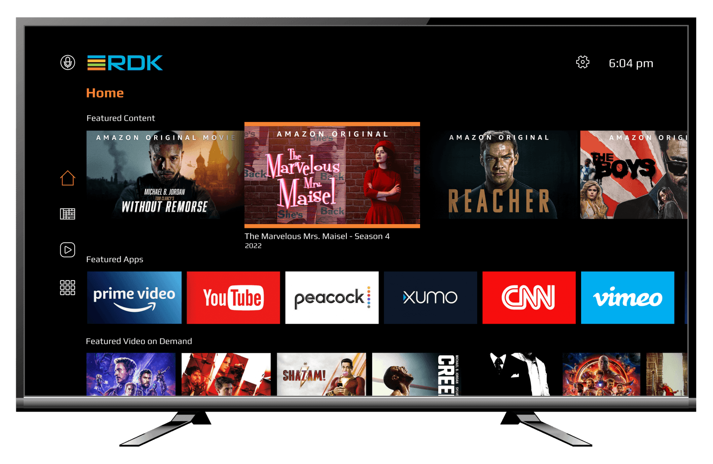

---
hide:
  - toc
  - navigation
---
RDK is a fully modular, portable, and customizable open-source software solution that standardizes core functions used in video, broadband, and IoT devices. Deployed on over a hundred million devices around the globe, RDK enables operators to manage devices and easily customize their UIs and apps, providing analytics to improve the customer experience. RDK is platform and operator agnostic, so it can easily be ported & adopted by multiple SoC/OEM/Operators, significantly reducing the time to market. With over 600 companies, RDK has an active open-source community that regularly contributes cutting edge technologies to the stack.

**RDK for Entertainment**
RDK middleware enables operators to add video streaming capabilities to their IP or hybrid devices. The latest version of the RDK Video software stack is designed to simplify app development and integration on any set-top device, while allowing companies to maintain complete control of their apps, device data, and customer experience. This is achieved through Firebolt™, the RDK application platform, which ensures compatibility with the latest app releases, eliminating the need for future updates. The seamless integration of global streaming apps provides operators with an easy path to offer subscribers today's most popular content.  

------------------------------------------------------------------------

**Video User Interface Preview**

The front end of any video device is the user interface that consumers will see. RDK comes with an open-source UI written in Lightning™ 
, or you can create your own. To experience the RDK UI, watch the Video:  

<video width="320" height="240" controls>
  <source src="../images/rdk-ui.mp4" type="video/mp4">
</video>

**Try Out RDK**

If you want to play around RDK, a port of RDK is available on the popular open source platform Raspberry Pi. A guide on how to bring up RDK for Entertainment in Raspberry Pi is available [here](./try-out-rdk-video.md)
