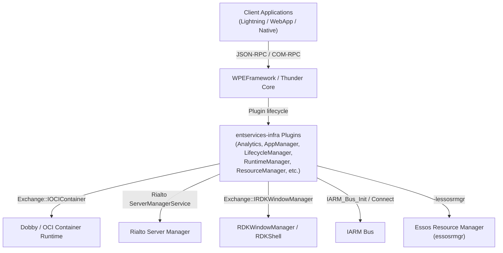
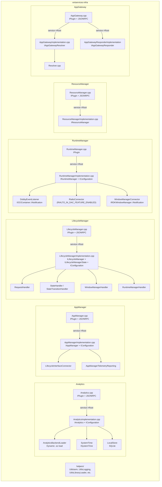
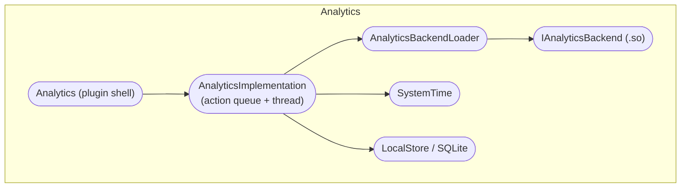
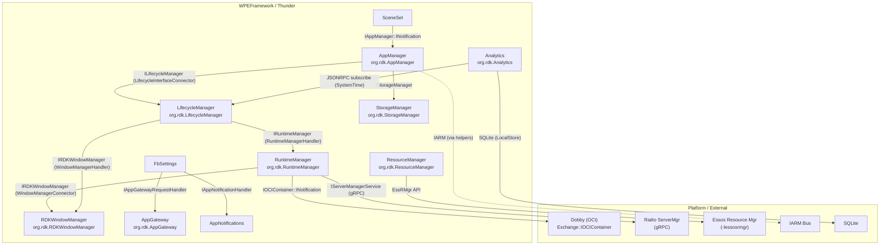
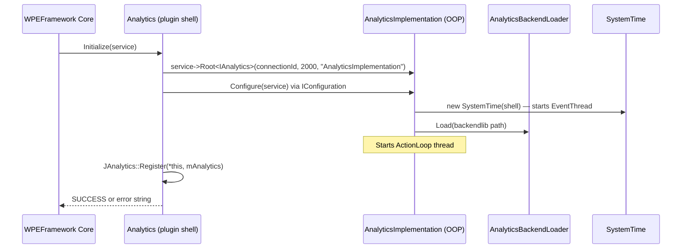
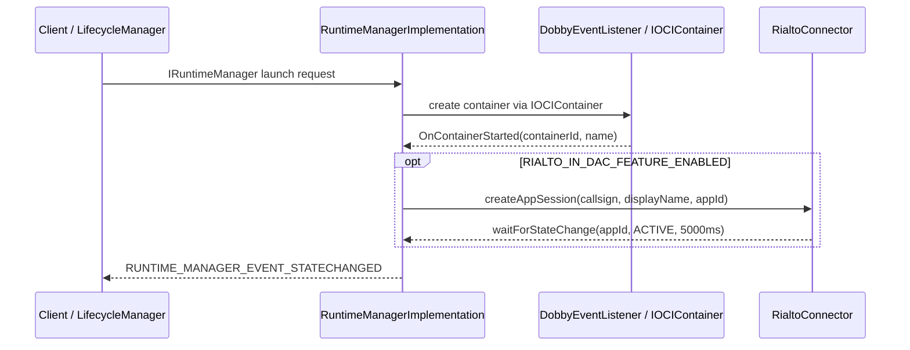

# entservices-infra

A collection of WPEFramework/Thunder plugins that form the infrastructure layer for RDK-E entertainment services, providing app lifecycle management, window management, analytics, resource management, storage, and related platform services.

---

## Overview

`entservices-infra` is a multi-plugin repository hosted at [github.com/rdkcentral/entservices-infra](https://github.com/rdkcentral/entservices-infra). It packages the following WPEFramework plugins into a single CMake super-project. Each plugin is independently activated via its own callsign and runs as a Thunder `IPlugin`.

**Migration note:** As of version 3.22.x, several plugins have been migrated to dedicated repositories (see [Plugin Migration Table](#plugin-migration-table)). New development for those plugins must target the listed repositories on the `develop` branch. Ongoing release changes for branches `8.0`–`8.4` still use this repository.

### Plugins included in this repository

| Plugin            | Callsign                      | CMake Guard                 |
| ----------------- | ----------------------------- | --------------------------- |
| Analytics         | `org.rdk.Analytics`           | `PLUGIN_ANALYTICS`          |
| AppGateway        | `org.rdk.AppGateway`          | `PLUGIN_APPGATEWAY`         |
| AppManager        | `org.rdk.AppManager`          | `PLUGIN_APPMANAGER`         |
| AppNotifications  | _(no callsign set in config)_ | `PLUGIN_APPNOTIFICATIONS`   |
| DownloadManager   | _(no callsign set in config)_ | `PLUGIN_DOWNLOADMANAGER`    |
| FbSettings        | _(internal)_                  | `PLUGIN_FBSETTINGS`         |
| LifecycleManager  | `org.rdk.LifecycleManager`    | `PLUGIN_LIFECYCLE_MANAGER`  |
| NativeJS          | _(no callsign set in config)_ | `PLUGIN_NATIVEJS`           |
| PackageManager    | _(no callsign set in config)_ | `PLUGIN_PACKAGE_MANAGER`    |
| PreinstallManager | _(no callsign set in config)_ | `PLUGIN_PREINSTALL_MANAGER` |
| RDKShell          | `org.rdk.RDKShell`            | `PLUGIN_RDKSHELL`           |
| RDKWindowManager  | `org.rdk.RDKWindowManager`    | `PLUGIN_RDK_WINDOW_MANAGER` |
| ResourceManager   | `org.rdk.ResourceManager`     | `PLUGIN_RESOURCEMANAGER`    |
| RuntimeManager    | `org.rdk.RuntimeManager`      | `PLUGIN_RUNTIME_MANAGER`    |
| RustAdapter       | _(configurable)_              | `PLUGIN_RUSTADAPTER`        |
| SceneSet          | _(no callsign set in config)_ | `PLUGIN_SCENESET`           |
| StorageManager    | `org.rdk.StorageManager`      | `PLUGIN_STORAGE_MANAGER`    |
| TelemetryMetrics  | _(no callsign set in config)_ | `PLUGIN_TELEMETRYMETRICS`   |
| WebBridge         | _(no callsign set in config)_ | `PLUGIN_WEBBRIDGE`          |

Product configuration is located under `/etc/entservices` at runtime (`PRODUCT_CONFIG_DIR`).



---

## Architecture

### High-Level Architecture

```
┌──────────────────────────────────────────────────────────────────┐
│                     Client Applications                          │
├──────────────────────────────────────────────────────────────────┤
│               JSON-RPC / COM-RPC (WPEFramework)                  │
├──────────────────────────────────────────────────────────────────┤
│                     entservices-infra                            │
│  ┌─────────────┬──────────────┬──────────────┬────────────────┐  │
│  │  Analytics  │  AppManager  │LifecycleManager RuntimeManager│  │
│  │  AppGateway │  AppNotifs   │ResourceManager StorageManager │  │
│  │  RDKShell   │RDKWindowMgr  │PackageManager  DownloadMgr   │  │
│  │  NativeJS   │  WebBridge   │RustAdapter     SceneSet       │  │
│  │  FbSettings │TelemetryMetrics PreinstallMgr               │  │
│  └─────────────┴──────────────┴──────────────┴────────────────┘  │
│                        helpers/                                   │
├──────────────────────────────────────────────────────────────────┤
│  IARM Bus │ Dobby / OCI │ Rialto ServerMgr │ essosrmgr │ SQLite  │
└──────────────────────────────────────────────────────────────────┘
```

### Key Architectural Patterns

| Pattern                                    | Description                                                                                                                                                                    | Where Applied                                                                                                                                                  |
| ------------------------------------------ | ------------------------------------------------------------------------------------------------------------------------------------------------------------------------------ | -------------------------------------------------------------------------------------------------------------------------------------------------------------- |
| Plugin split (thin shell + implementation) | `<Plugin>.cpp` delegates to `<Plugin>Implementation.cpp` via `Exchange::I<Name>` COM-RPC interface. The implementation runs in a separate process (`root.mode` configuration). | Analytics, AppManager, LifecycleManager, ResourceManager, RDKWindowManager, RuntimeManager, StorageManager, PackageManager, DownloadManager, PreinstallManager |
| Observer / Notification sink               | `Notification` inner class implements both `RPC::IRemoteConnection::INotification` and `Exchange::I<Name>::INotification`, routing events to the plugin host.                  | AppManager, LifecycleManager, RDKWindowManager, PreinstallManager                                                                                              |
| Action queue (producer-consumer)           | Events are pushed as typed `Action` structs onto a `std::queue<Action>` and consumed by a dedicated `std::thread`.                                                             | `AnalyticsImplementation`                                                                                                                                      |
| Backend loader (dynamic library)           | `AnalyticsBackendLoader` opens a backend `.so` at runtime via `Utils::LibraryLoader`; the path is set via CMake option `PLUGIN_ANALYTICS_BACKEND_LIBRARY_NAME`.                | Analytics                                                                                                                                                      |
| IConfiguration two-phase init              | Plugins call `QueryInterface<Exchange::IConfiguration>` on the implementation object and call `Configure(service)` after Out-of-Process (OOP) root activation.                 | Analytics, AppManager, RuntimeManager, StorageManager                                                                                                          |
| RAII thread                                | `AnalyticsImplementation` constructor starts `mThread`; destructor pushes `ACTION_TYPE_SHUTDOWN` and calls `mThread.join()`.                                                   | AnalyticsImplementation                                                                                                                                        |

### Threading & Concurrency

- **Analytics**: One dedicated worker thread (`mThread`) runs `ActionLoop()`. Events are enqueued from the Thunder dispatch thread and consumed by the worker thread. Coordination uses `std::mutex mQueueMutex` and `std::condition_variable mQueueCondition`.
- **SystemTime (Analytics sub-module)**: One event thread (`mEventThread`) runs `EventLoop()`, receiving time-status and time-zone events. Uses `std::mutex mQueueLock` and `std::condition_variable mQueueCondition`.
- **LifecycleManager**: Uses `Core::IDispatch` jobs (`Job::Create`) posted onto the Thunder thread pool for event dispatch.
- **All other plugins**: Rely on the WPEFramework Thunder dispatch thread for JSON-RPC and COM-RPC calls; no additional threads are created in the plugin (thin-shell) layer itself.

---

## Design

### Design Principles

Each plugin follows the WPEFramework two-process model: a thin plugin shell (`IPlugin` + `JSONRPC` or `IPluginExtended`) running in the main Thunder process, and an implementation library instantiated out-of-process via `service->Root<Exchange::I<Name>>(connectionId, timeout, "ImplementationName")`. The plugin shell and implementation communicate via COM-RPC Exchange interfaces defined in `entservices-apis`. The `helpers/` directory provides shared utilities (`UtilsIarm.h`, `UtilsLogging.h`, `UtilsLibraryLoader.h`, etc.) that are included by individual plugins at compile time; there is no separate helpers shared library.

### Northbound & Southbound Interactions

**Northbound:** Client applications reach plugins via Thunder's JSON-RPC WebSocket or COM-RPC. Plugins that expose `PluginHost::JSONRPC` register their methods using the generated `Exchange::J<Name>::Register(*this, impl)` call in `Initialize()`. Plugins that do not expose JSON-RPC directly (e.g., `RuntimeManager`, `TelemetryMetrics`) implement only `PluginHost::IPlugin` and expose their interface through the `INTERFACE_AGGREGATE` macro.

**Southbound:**

- `ResourceManagerImplementation` links against `-lessosrmgr` (Essos Resource Manager) for AV blacklisting and TTS resource reservation. When built with `ENABLE_ERM` or `ENABLE_L1TEST`, it instantiates an `EssRMgr*` object.
- `RuntimeManagerImplementation` integrates with **Dobby** via `Exchange::IOCIContainer` (listened to through `DobbyEventListener`), and optionally with **Rialto** (`RialtoConnector`, guarded by `RIALTO_IN_DAC_FEATURE_ENABLED`) for session lifecycle management.
- `AnalyticsImplementation` loads a backend `.so` at runtime and uses `SystemTime` (which subscribes to time-status JSON-RPC events) and `LocalStore` (SQLite via `DatabaseConnection`).
- `RDKShell` includes `rdkshell.h`, `rdkshellevents.h`, and `linuxkeys.h` from the `rdkshell` library.
- IARM bus is used by helper code (`UtilsIarm.h`) via `IARM_Bus_Init` / `IARM_Bus_Connect`.

### IPC Mechanisms

| Mechanism                         | Used By                                                                                                                                                                                    | Notes                                                                                                                       |
| --------------------------------- | ------------------------------------------------------------------------------------------------------------------------------------------------------------------------------------------ | --------------------------------------------------------------------------------------------------------------------------- |
| JSON-RPC (WPEFramework WebSocket) | Analytics, AppManager, AppGateway, AppNotifications, DownloadManager, LifecycleManager, NativeJS, PackageManager, PreinstallManager, RDKShell, RDKWindowManager, StorageManager, WebBridge | Primary client-facing API                                                                                                   |
| COM-RPC (Exchange interfaces)     | All out-of-process plugins                                                                                                                                                                 | Plugin shell ↔ implementation communication via `service->Root<>(...)`                                                      |
| IARM Bus (`libIBus.h`)            | `helpers/UtilsIarm.h`                                                                                                                                                                      | `IARM_Bus_Init`, `IARM_Bus_Connect` wrapped in `Utils::IARM::init()`                                                        |
| WebSocket (`IWebSocket`)          | WebBridge, NativeJS                                                                                                                                                                        | `WebBridge` implements `PluginHost::IWebSocket`; NativeJS uses websocket internally                                         |
| Unix socket / TCP socket          | RustAdapter                                                                                                                                                                                | `SocketServer` with configurable `address` and `port` for Rust plugin communication                                         |
| Rialto gRPC                       | RuntimeManager                                                                                                                                                                             | `RialtoConnector` uses `rialto::servermanager::service::IServerManagerService` (guarded by `RIALTO_IN_DAC_FEATURE_ENABLED`) |

### Data Persistence & Storage

- **Analytics (`LocalStore`)**: Uses SQLite via `DatabaseConnection`. `LocalStore` exposes `Open()`, `CreateTable()`, `AddEntry()`, `GetEntries()`, `RemoveEntries()`. The database path is passed to `LocalStore::Open()` at runtime.
- **All other plugins**: No direct persistence mechanism is implemented within the plugin (thin-shell) layer. Configuration is read from the Thunder plugin `.config` files at `Initialize()` time via `PluginHost::IShell::ConfigLine()` / `Core::JSON::Container`.

### Component Diagram



---

## Internal Modules

### Analytics

| Module / Class            | Description                                                                                                                                                                                                                                                                                            | Key Files                                                                                |
| ------------------------- | ------------------------------------------------------------------------------------------------------------------------------------------------------------------------------------------------------------------------------------------------------------------------------------------------------ | ---------------------------------------------------------------------------------------- |
| `Analytics`               | Plugin shell. Registers `Exchange::JAnalytics` JSON-RPC methods. Activates `AnalyticsImplementation` OOP.                                                                                                                                                                                              | `Analytics.cpp`, `Analytics.h`                                                           |
| `AnalyticsImplementation` | Business logic. Maintains a `std::queue<Action>` processed by `ActionLoop()` on a dedicated thread. Validates event fields, fills uptime if no timestamp provided, routes events to backends via `IAnalyticsBackend`. Supports an `EventMapper` for optional event-name remapping via a JSON map file. | `Implementation/AnalyticsImplementation.cpp`, `Implementation/AnalyticsImplementation.h` |
| `AnalyticsBackendLoader`  | Loads a backend `.so` at runtime using `Utils::LibraryLoader`. The path is configured via `backendlib` in the plugin config.                                                                                                                                                                           | `Implementation/Backend/AnalyticsBackendLoader.cpp`, `AnalyticsBackendLoader.h`          |
| `IAnalyticsBackend`       | Pure-virtual interface that backend implementations must satisfy: `Name()`, `Configure(shell, sysTime, store)`, `SendEvent(event)`.                                                                                                                                                                    | `Implementation/Interfaces/IAnalyticsBackend.h`                                          |
| `SystemTime`              | Subscribes to Thunder JSON-RPC events (`onTimeStatusChanged`, `onTimeZoneDSTChanged`) and provides `IsSystemTimeAvailable()` and `GetTimeZoneOffset()`. Owns an event thread.                                                                                                                          | `Implementation/SystemTime/SystemTime.cpp`, `SystemTime.h`                               |
| `LocalStore`              | SQLite-backed storage via `DatabaseConnection`. Implements `ILocalStore`: open, create table, set limit, add/get/remove entries.                                                                                                                                                                       | `Implementation/LocalStore/LocalStore.cpp`, `LocalStore.h`, `DatabaseConnection.cpp`     |



### AppManager

| Module / Class                 | Description                                                                                                                                                                                                                                                                          | Key Files                                                            |
| ------------------------------ | ------------------------------------------------------------------------------------------------------------------------------------------------------------------------------------------------------------------------------------------------------------------------------------ | -------------------------------------------------------------------- |
| `AppManager`                   | Plugin shell. Implements `Exchange::IAppManager::INotification` to forward `OnAppInstalled`, `OnAppUninstalled`, `OnAppLifecycleStateChanged`, `OnAppLaunchRequest`, `OnAppUnloaded` as JSON-RPC events via `Exchange::JAppManager::Event::*`.                                       | `AppManager.cpp`, `AppManager.h`                                     |
| `AppManagerImplementation`     | Business logic. Implements `IAppManager` + `IConfiguration`. Uses `IStore2`, `IAppPackageManager`, `IStorageManager`, `IPackageManager`. Tracks app packages in `std::map<string, PackageInfo>`. Optionally reports telemetry markers (`ENABLE_AIMANAGERS_TELEMETRY_METRICS` guard). | `AppManagerImplementation.cpp`, `AppManagerImplementation.h`         |
| `LifecycleInterfaceConnector`  | Bridges AppManager to the LifecycleManager Exchange interface.                                                                                                                                                                                                                       | `LifecycleInterfaceConnector.cpp`, `LifecycleInterfaceConnector.h`   |
| `AppManagerTelemetryReporting` | Handles telemetry reporting for app actions (guarded by `ENABLE_AIMANAGERS_TELEMETRY_METRICS`).                                                                                                                                                                                      | `AppManagerTelemetryReporting.cpp`, `AppManagerTelemetryReporting.h` |

### LifecycleManager

| Module / Class                            | Description                                                                                                                                                   | Key Files                                                                        |
| ----------------------------------------- | ------------------------------------------------------------------------------------------------------------------------------------------------------------- | -------------------------------------------------------------------------------- |
| `LifecycleManager`                        | Plugin shell. Subscribes to `ILifecycleManagerState::INotification` and dispatches `OnAppLifecycleStateChanged` JSON-RPC events.                              | `LifecycleManager.cpp`, `LifecycleManager.h`                                     |
| `LifecycleManagerImplementation`          | Implements `ILifecycleManager`, `ILifecycleManagerState`, `IConfiguration`, and `IEventHandler`. Uses a `Core::IDispatch`-based job system for event posting. | `LifecycleManagerImplementation.cpp`, `LifecycleManagerImplementation.h`         |
| `ApplicationContext`                      | Holds per-application state context.                                                                                                                          | `ApplicationContext.cpp`, `ApplicationContext.h`                                 |
| `RequestHandler`                          | Handles incoming lifecycle requests.                                                                                                                          | `RequestHandler.cpp`, `RequestHandler.h`                                         |
| `StateHandler` / `StateTransitionHandler` | Manages and validates lifecycle state transitions.                                                                                                            | `State.cpp`, `StateHandler.cpp`, `StateTransitionHandler.cpp`                    |
| `WindowManagerHandler`                    | Bridges LifecycleManager to the window manager for display-related lifecycle steps.                                                                           | `WindowManagerHandler.cpp`, `WindowManagerHandler.h`                             |
| `RuntimeManagerHandler`                   | Bridges LifecycleManager to RuntimeManager for container-level lifecycle operations.                                                                          | `RuntimeManagerHandler.cpp`, `RuntimeManagerHandler.h`                           |
| `LifecycleManagerTelemetryReporting`      | Telemetry reporting for lifecycle events.                                                                                                                     | `LifecycleManagerTelemetryReporting.cpp`, `LifecycleManagerTelemetryReporting.h` |

### RuntimeManager

| Module / Class                 | Description                                                                                                                                                                                                                                                                                                                                               | Key Files                                                            |
| ------------------------------ | --------------------------------------------------------------------------------------------------------------------------------------------------------------------------------------------------------------------------------------------------------------------------------------------------------------------------------------------------------- | -------------------------------------------------------------------- |
| `RuntimeManager`               | Plugin shell. Implements `IPlugin` only (no JSONRPC). Activates `RuntimeManagerImplementation` OOP via `IRuntimeManager`.                                                                                                                                                                                                                                 | `RuntimeManager.cpp`, `RuntimeManager.h`                             |
| `RuntimeManagerImplementation` | Implements `IRuntimeManager`, `IConfiguration`, `IEventHandler`. Reads `runtimeAppPortal` from plugin config. Emits events: `RUNTIME_MANAGER_EVENT_STATECHANGED`, `CONTAINERSTARTED`, `CONTAINERSTOPPED`, `CONTAINERFAILED`. Optionally records telemetry markers for launch/close/suspend/resume/hibernate/wake (`ENABLE_AIMANAGERS_TELEMETRY_METRICS`). | `RuntimeManagerImplementation.cpp`, `RuntimeManagerImplementation.h` |
| `DobbyEventListener`           | Subscribes to `Exchange::IOCIContainer::INotification` events (`OnContainerStarted`, `OnContainerStopped`, `OnContainerFailed`, `OnContainerStateChanged`) and routes them to `IEventHandler`.                                                                                                                                                            | `DobbyEventListener.cpp`, `DobbyEventListener.h`                     |
| `RialtoConnector`              | Manages Rialto `IServerManagerService` sessions: `createAppSession`, `resumeSession`, `suspendSession`, `deactivateSession`, `waitForStateChange`. Guarded by `RIALTO_IN_DAC_FEATURE_ENABLED`. Timeout: 5000 ms.                                                                                                                                          | `RialtoConnector.cpp`, `RialtoConnector.h`                           |
| `WindowManagerConnector`       | Subscribes to `Exchange::IRDKWindowManager::INotification::OnUserInactivity` events.                                                                                                                                                                                                                                                                      | `WindowManagerConnector.cpp`, `WindowManagerConnector.h`             |
| `UserIdManager`                | Manages user identity information for containers.                                                                                                                                                                                                                                                                                                         | `UserIdManager.cpp`, `UserIdManager.h`                               |
| `DobbySpecGenerator`           | Generates Dobby OCI container spec.                                                                                                                                                                                                                                                                                                                       | `DobbySpecGenerator.cpp`, `DobbySpecGenerator.h`                     |
| `AIConfiguration`              | Holds AI/app configuration for container creation.                                                                                                                                                                                                                                                                                                        | `AIConfiguration.cpp`, `AIConfiguration.h`                           |

### ResourceManager

| Module / Class                  | Description                                                                                                                                                                                                                                                                                                                                                          | Key Files                                                              |
| ------------------------------- | -------------------------------------------------------------------------------------------------------------------------------------------------------------------------------------------------------------------------------------------------------------------------------------------------------------------------------------------------------------------- | ---------------------------------------------------------------------- |
| `ResourceManager`               | Plugin shell. Implements `IPlugin` + `JSONRPC`. Activates `ResourceManagerImplementation` OOP.                                                                                                                                                                                                                                                                       | `ResourceManager.cpp`, `ResourceManager.h`                             |
| `ResourceManagerImplementation` | Implements `IResourceManager`. Provides `SetAVBlocked`, `GetBlockedAVApplications`, `ReserveTTSResource`, `ReserveTTSResourceForApps`. Links against `-lessosrmgr` (production build). Uses `EssRMgr*` when `ENABLE_ERM` or `ENABLE_L1TEST` is defined. `mAppsAVBlacklistStatus` is a `std::map<std::string, bool>` protected by `Core::CriticalSection _adminLock`. | `ResourceManagerImplementation.cpp`, `ResourceManagerImplementation.h` |

### AppGateway

| Module / Class                      | Description                                                                                                                                                                                                                                | Key Files                                                                      |
| ----------------------------------- | ------------------------------------------------------------------------------------------------------------------------------------------------------------------------------------------------------------------------------------------ | ------------------------------------------------------------------------------ |
| `AppGateway`                        | Plugin shell. Aggregates `Exchange::IAppGatewayResolver` and `Exchange::IAppGatewayResponder`.                                                                                                                                             | `AppGateway.cpp`, `AppGateway.h`                                               |
| `AppGatewayImplementation`          | Implements `IAppGatewayResolver` + `IConfiguration`. Reads resolver paths via `Configure(IStringIterator* paths)`. Handles `Resolve(context, origin, method, params, result)`. Posts async `RespondJob` (`Core::IDispatch`) for responses. | `AppGatewayImplementation.cpp`, `AppGatewayImplementation.h`                   |
| `AppGatewayResponderImplementation` | Implements `IAppGatewayResponder`.                                                                                                                                                                                                         | `AppGatewayResponderImplementation.cpp`, `AppGatewayResponderImplementation.h` |
| `Resolver`                          | Resolution logic for gateway routing to registered handlers.                                                                                                                                                                               | `Resolver.cpp`, `Resolver.h`                                                   |

### AppNotifications

| Module / Class                   | Description                                                                                             | Key Files                                                                |
| -------------------------------- | ------------------------------------------------------------------------------------------------------- | ------------------------------------------------------------------------ |
| `AppNotifications`               | Plugin shell. Aggregates `Exchange::IAppNotifications`. Activates `AppNotificationsImplementation` OOP. | `AppNotifications.cpp`, `AppNotifications.h`                             |
| `AppNotificationsImplementation` | Business logic implementing `IAppNotifications`.                                                        | `AppNotificationsImplementation.cpp`, `AppNotificationsImplementation.h` |

### StorageManager

| Module / Class                 | Description                                                                             | Key Files                                                            |
| ------------------------------ | --------------------------------------------------------------------------------------- | -------------------------------------------------------------------- |
| `StorageManager`               | Plugin shell. Implements `IPlugin` + `JSONRPC`. Aggregates `Exchange::IStorageManager`. | `StorageManager.cpp`, `StorageManager.h`                             |
| `StorageManagerImplementation` | Implements `IStorageManager` + `IConfiguration`.                                        | `StorageManagerImplementation.cpp`, `StorageManagerImplementation.h` |
| `RequestHandler`               | Internal request handling for storage operations.                                       | `RequestHandler.cpp`, `RequestHandler.h`                             |

### PackageManager

| Module / Class                 | Description                                                                                                                                                                                                               | Key Files                                                            |
| ------------------------------ | ------------------------------------------------------------------------------------------------------------------------------------------------------------------------------------------------------------------------- | -------------------------------------------------------------------- |
| `PackageManager`               | Plugin shell. Implements `IPlugin` + `JSONRPC`. Subscribes to `IPackageDownloader::INotification` and `IPackageInstaller::INotification`. Dispatches `OnAppDownloadStatus` and `OnAppInstallationStatus` JSON-RPC events. | `PackageManager.cpp`, `PackageManager.h`                             |
| `PackageManagerImplementation` | Business logic implementing the package download and install interfaces.                                                                                                                                                  | `PackageManagerImplementation.cpp`, `PackageManagerImplementation.h` |
| `HttpClient`                   | HTTP client used for package acquisition.                                                                                                                                                                                 | `HttpClient.cpp`, `HttpClient.h`                                     |

### DownloadManager

| Module / Class                  | Description                                                                                                                                                                                            | Key Files                                                              |
| ------------------------------- | ------------------------------------------------------------------------------------------------------------------------------------------------------------------------------------------------------ | ---------------------------------------------------------------------- |
| `DownloadManager`               | Plugin shell. Implements `IPlugin` + `JSONRPC`. Subscribes to `IDownloadManager::INotification`. Dispatches `OnAppDownloadStatus` events via `Exchange::JDownloadManager::Event::OnAppDownloadStatus`. | `DownloadManager.cpp`, `DownloadManager.h`                             |
| `DownloadManagerImplementation` | Business logic implementing `IDownloadManager`.                                                                                                                                                        | `DownloadManagerImplementation.cpp`, `DownloadManagerImplementation.h` |
| `DownloadManagerHttpClient`     | HTTP client component used internally.                                                                                                                                                                 | `DownloadManagerHttpClient.cpp`, `DownloadManagerHttpClient.h`         |

### PreinstallManager

| Module / Class                    | Description                                                                                                                                                                                                 | Key Files                                                                  |
| --------------------------------- | ----------------------------------------------------------------------------------------------------------------------------------------------------------------------------------------------------------- | -------------------------------------------------------------------------- |
| `PreinstallManager`               | Plugin shell. Implements `IPlugin` + `JSONRPC`. Subscribes to `IPreinstallManager::INotification`. Dispatches `OnAppInstallationStatus` via `Exchange::JPreinstallManager::Event::OnAppInstallationStatus`. | `PreinstallManager.cpp`, `PreinstallManager.h`                             |
| `PreinstallManagerImplementation` | Business logic implementing `IPreinstallManager` + `IConfiguration`.                                                                                                                                        | `PreinstallManagerImplementation.cpp`, `PreinstallManagerImplementation.h` |

### RDKShell

| Module / Class    | Description                                                                                                                                                                                                                                                                                                                                                                                                                                             | Key Files                                  |
| ----------------- | ------------------------------------------------------------------------------------------------------------------------------------------------------------------------------------------------------------------------------------------------------------------------------------------------------------------------------------------------------------------------------------------------------------------------------------------------------- | ------------------------------------------ |
| `RDKShell`        | Plugin shell. Implements `IPlugin` + `JSONRPC`. Aggregates `Exchange::ICapture` via `mScreenCapture`. Includes `rdkshell/rdkshell.h`, `rdkshellevents.h`, `linuxkeys.h`. Uses `tptimer.h` from helpers. Optionally integrates Rialto via `RialtoConnector` (`ENABLE_RIALTO_FEATURE`). Methods include window Z-ordering (`moveToFront`, `moveToBack`, `moveBehind`), focus control, key intercepts, key listeners, screen resolution, display creation. | `RDKShell.cpp`, `RDKShell.h`               |
| `RialtoConnector` | Shared Rialto session management (same pattern as RuntimeManager version). Guarded by `ENABLE_RIALTO_FEATURE`.                                                                                                                                                                                                                                                                                                                                          | `RialtoConnector.cpp`, `RialtoConnector.h` |

### RDKWindowManager

| Module / Class                   | Description                                                                                                                                               | Key Files                                                                |
| -------------------------------- | --------------------------------------------------------------------------------------------------------------------------------------------------------- | ------------------------------------------------------------------------ |
| `RDKWindowManager`               | Plugin shell. Implements `IPlugin` + `JSONRPC`. Subscribes to `IRDKWindowManager::INotification::OnUserInactivity` and dispatches it as a JSON-RPC event. | `RDKWindowManager.cpp`, `RDKWindowManager.h`                             |
| `RDKWindowManagerImplementation` | Implements `IRDKWindowManager`.                                                                                                                           | `RDKWindowManagerImplementation.cpp`, `RDKWindowManagerImplementation.h` |

### TelemetryMetrics

| Module / Class                   | Description                                                                                                          | Key Files                                                                |
| -------------------------------- | -------------------------------------------------------------------------------------------------------------------- | ------------------------------------------------------------------------ |
| `TelemetryMetrics`               | Plugin shell. Implements `IPlugin` only. Aggregates `Exchange::ITelemetryMetrics`. No JSONRPC exposure in the shell. | `TelemetryMetrics.cpp`, `TelemetryMetrics.h`                             |
| `TelemetryMetricsImplementation` | Implements `ITelemetryMetrics` + `IConfiguration`. Filters defined in `TelemetryFilters.h`.                          | `TelemetryMetricsImplementation.cpp`, `TelemetryMetricsImplementation.h` |

### WebBridge

| Module / Class | Description                                                                                                                                                                                                                                                                                                         | Key Files                      |
| -------------- | ------------------------------------------------------------------------------------------------------------------------------------------------------------------------------------------------------------------------------------------------------------------------------------------------------------------- | ------------------------------ |
| `WebBridge`    | Implements `IPluginExtended`, `IDispatcher`, `IWebSocket`. Handles WebSocket-based bridging with custom JSON-RPC routing states: `STATE_INCORRECT_HANDLER`, `STATE_INCORRECT_VERSION`, `STATE_UNKNOWN_METHOD`, `STATE_REGISTRATION`, `STATE_UNREGISTRATION`, `STATE_EXISTS`, `STATE_NONE_EXISTING`, `STATE_CUSTOM`. | `WebBridge.cpp`, `WebBridge.h` |

### NativeJS

| Module / Class           | Description                                                                                                                                                       | Key Files                                                |
| ------------------------ | ----------------------------------------------------------------------------------------------------------------------------------------------------------------- | -------------------------------------------------------- |
| `NativeJS`               | Plugin shell. Implements `IPlugin` + `JSONRPC`. Aggregates `Exchange::INativeJS`. Config fields: `embedthunderjs` (bool) and `clientidentifier` (display string). | `NativeJSPlugin.cpp`, `NativeJSPlugin.h`                 |
| `NativeJSImplementation` | Business logic implementing `INativeJS`.                                                                                                                          | `NativeJSImplementation.cpp`, `NativeJSImplementation.h` |

### SceneSet

| Module / Class | Description                                                                                                                                          | Key Files                    |
| -------------- | ---------------------------------------------------------------------------------------------------------------------------------------------------- | ---------------------------- |
| `SceneSet`     | Plugin. Implements `IPlugin`. Subscribes to `Exchange::IAppManager::INotification::OnAppLifecycleStateChanged`. Config field: `refAppName` (string). | `SceneSet.cpp`, `SceneSet.h` |

### RustAdapter

| Module / Class | Description                                                                                                                                                                                                                              | Key Files                            |
| -------------- | ---------------------------------------------------------------------------------------------------------------------------------------------------------------------------------------------------------------------------------------- | ------------------------------------ |
| `RustAdapter`  | Implements `Rust::IPlugin`. Config fields: `outofprocess` (bool), `address` (string), `port` (uint16), `autoexec` (bool), `libname` (string). Can run plugins as local in-process libraries or remote out-of-process via `SocketServer`. | `RustAdapter.cpp`, `RustAdapter.h`   |
| `LocalPlugin`  | Loads and runs a Rust plugin in-process.                                                                                                                                                                                                 | `LocalPlugin.cpp`, `LocalPlugin.h`   |
| `RemotePlugin` | Manages an out-of-process connection to a Rust plugin via socket.                                                                                                                                                                        | `RemotePlugin.cpp`, `RemotePlugin.h` |
| `SocketServer` | TCP/Unix socket server for remote Rust plugin communication.                                                                                                                                                                             | `SocketServer.cpp`, `SocketServer.h` |

### FbSettings

| Module / Class | Description                                                                                                                                                                                                                                                                                              | Key Files                        |
| -------------- | -------------------------------------------------------------------------------------------------------------------------------------------------------------------------------------------------------------------------------------------------------------------------------------------------------- | -------------------------------- |
| `FbSettings`   | Plugin. Implements `IPlugin`, `Exchange::IAppGatewayRequestHandler`, `Exchange::IAppNotificationHandler`. Handles app gateway requests and app notifications. Uses `SettingsDelegate` (in `delegate/`) and `UtilsController.h`. Posts event registration via `EventRegistrationJob` (`Core::IDispatch`). | `FbSettings.cpp`, `FbSettings.h` |

### helpers/

Shared header-only or inline utilities included by individual plugins. No separate compiled library.

| Header                                     | Purpose                                                                                                            |
| ------------------------------------------ | ------------------------------------------------------------------------------------------------------------------ |
| `UtilsIarm.h`                              | IARM Bus init/connect helpers (`Utils::IARM::init()`, `IARM_CHECK` macro)                                          |
| `UtilsLogging.h`                           | `LOGTRACE`, `LOGDBG`, `LOGINFO`, `LOGWARN`, `LOGERR` macros writing to stderr with thread ID, file, line, function |
| `UtilsLibraryLoader.h`                     | Dynamic `.so` loading (`Utils::LibraryLoader`) used by `AnalyticsBackendLoader`                                    |
| `UtilsJsonRpc.h`                           | JSON-RPC utility helpers                                                                                           |
| `UtilsController.h`                        | Thunder controller interaction utilities                                                                           |
| `UtilsCallsign.h`                          | Callsign resolution utilities                                                                                      |
| `PowerManagerInterface.h`                  | Power manager interface wrapper                                                                                    |
| `PluginInterfaceBuilder.h`                 | Exchange interface acquisition helpers                                                                             |
| `WebSocketLink.h`, `WsManager.h`           | WebSocket link and manager helpers                                                                                 |
| `tptimer.h`                                | Timer utility (used by RDKShell)                                                                                   |
| `UtilsThreadRAII.h`                        | Thread RAII wrapper                                                                                                |
| `UtilsSynchro.hpp`, `UtilsSynchroIarm.hpp` | Synchronization utilities                                                                                          |
| `frontpanel.cpp/.h`                        | Front panel helpers                                                                                                |

---

## Prerequisites & Dependencies

### RDK-E Platform Requirements

- **WPEFramework / Thunder**: Branch `R4.4.1` (cloned in `build_dependencies.sh`)
- **ThunderTools**: Branch `R4.4.3`
- **entservices-apis**: `main` branch — provides all `Exchange::I*` interfaces and generated JSON headers (`interfaces/json/J*.h`, `interfaces/json/JsonData_*.h`)
- **entservices-testframework**: Required for L1/L2 test builds

### Build Dependencies

| Dependency                                            | Version / Branch | Purpose                                                                               |
| ----------------------------------------------------- | ---------------- | ------------------------------------------------------------------------------------- |
| CMake                                                 | ≥ 3.3            | Build system (`cmake_minimum_required(VERSION 3.3)`)                                  |
| WPEFramework (Thunder)                                | R4.4.1           | Plugin host and COM-RPC framework                                                     |
| ThunderTools                                          | R4.4.3           | CMake helpers, code generation                                                        |
| entservices-apis                                      | main             | Exchange interface definitions (`IAnalytics`, `IAppManager`, `IRuntimeManager`, etc.) |
| libsqlite3-dev                                        | system           | SQLite used by `LocalStore` (Analytics)                                               |
| libcurl4-openssl-dev                                  | system           | HTTP client (DownloadManager, PackageManager)                                         |
| libsystemd-dev                                        | system           | systemd integration                                                                   |
| libboost-all-dev                                      | system           | Boost libraries                                                                       |
| libwebsocketpp-dev                                    | system           | WebSocket support                                                                     |
| protobuf-compiler-grpc, libgrpc-dev, libgrpc++-dev    | system           | Rialto gRPC (RuntimeManager)                                                          |
| libunwind-dev                                         | system           | Stack unwinding                                                                       |
| libgstreamer1.0-dev, libgstreamer-plugins-base1.0-dev | system           | GStreamer                                                                             |
| trower-base64                                         | main             | Base64 encoding (`build_dependencies.sh`)                                             |
| meson, ninja                                          | system           | Build tools for trower-base64 and Thunder                                             |
| essosrmgr (`-lessosrmgr`)                             | system           | Essos Resource Manager (ResourceManager)                                              |
| rdkshell (`rdkshell/rdkshell.h`)                      | system           | RDK Shell integration (RDKShell plugin)                                               |
| Dobby (`Exchange::IOCIContainer`)                     | system           | OCI container runtime (RuntimeManager)                                                |
| Rialto (`rialto/ServerManagerServiceFactory.h`)       | system           | Media session management (RuntimeManager, RDKShell)                                   |

### Runtime Dependencies

| Dependency                       | Notes                                                                                                                             |
| -------------------------------- | --------------------------------------------------------------------------------------------------------------------------------- |
| WPEFramework daemon              | Must be running; all plugins are activated by Thunder                                                                             |
| IARM Bus daemon                  | Required where `Utils::IARM::init()` is called (plugin-dependent via `USE_IARM` / `USE_IARM_BUS` definitions in `services.cmake`) |
| Dobby daemon                     | Required by RuntimeManager when OCI container features are used                                                                   |
| Rialto Server Manager            | Required by RuntimeManager (`RialtoConnector`) when `RIALTO_IN_DAC_FEATURE_ENABLED` is set                                        |
| Essos Resource Manager           | Required by ResourceManager in production build (`-lessosrmgr`)                                                                   |
| SQLite library (`libsqlite3.so`) | Required by Analytics `LocalStore` at runtime                                                                                     |

### Platform Build Defines (from `services.cmake`)

The following defines are set unconditionally in `services.cmake`:

| Define                                    | Purpose                                  |
| ----------------------------------------- | ---------------------------------------- |
| `USE_IARM`, `USE_IARM_BUS`, `USE_IARMBUS` | Enable IARM bus code paths               |
| `USE_TR_69`                               | Enable TR-069 code paths                 |
| `HAS_API_SYSTEM`, `HAS_API_POWERSTATE`    | Enable system/power-state API code paths |
| `RDK_LOG_MILESTONE`                       | Enable milestone logging                 |
| `USE_DS`                                  | Enable Device Services code paths        |
| `ENABLE_DEEP_SLEEP`                       | Enable deep sleep code paths             |

Conditional defines (set by CMake cache variables):

| Define                                                          | Guard Variable                            |
| --------------------------------------------------------------- | ----------------------------------------- |
| `BUILD_DBUS` / `IARM_USE_DBUS`                                  | `BUILD_DBUS`                              |
| `BUILD_ENABLE_THERMAL_PROTECTION` / `ENABLE_THERMAL_PROTECTION` | `BUILD_ENABLE_THERMAL_PROTECTION`         |
| `ENABLE_DEVICE_MANUFACTURER_INFO`                               | `BUILD_ENABLE_DEVICE_MANUFACTURER_INFO`   |
| `ENABLE_SYSTIMEMGR_SUPPORT`                                     | `BUILD_ENABLE_SYSTIMEMGR_SUPPORT`         |
| `CLOCK_BRIGHTNESS_ENABLED`                                      | `BUILD_ENABLE_CLOCK`                      |
| `ENABLE_TELEMETRY_LOGGING`                                      | `BUILD_ENABLE_TELEMETRY_LOGGING`          |
| `ENABLE_LINK_LOCALTIME`                                         | `BUILD_ENABLE_LINK_LOCALTIME`             |
| `APP_CONTROL_AUDIOPORT_INIT`                                    | `BUILD_ENABLE_APP_CONTROL_AUDIOPORT_INIT` |
| `NET_DISABLE_NETSRVMGR_CHECK`                                   | `NET_DISABLE_NETSRVMGR_CHECK`             |
| `ENABLE_WHOAMI`                                                 | `ENABLE_WHOAMI`                           |
| `ENABLE_RFC_MANAGER`                                            | `ENABLE_RFC_MANAGER`                      |
| `DISABLE_DCM_TASK`                                              | `DISABLE_DCM_TASK`                        |
| `ENABLE_ERM`                                                    | `BUILD_ENABLE_ERM`                        |
| `DISABLE_SECURITY_TOKEN`                                        | `DISABLE_SECURITY_TOKEN`                  |

---

## Build & Installation

The full build process (including dependencies) is scripted in `build_dependencies.sh`. Below are the essential steps.

### 1. Install System Packages

```bash
apt install -y libsqlite3-dev libcurl4-openssl-dev valgrind lcov clang \
    libsystemd-dev libboost-all-dev libwebsocketpp-dev meson libcunit1 \
    libcunit1-dev curl protobuf-compiler-grpc libgrpc-dev libgrpc++-dev \
    libunwind-dev libgstreamer1.0-dev libgstreamer-plugins-base1.0-dev
pip install jsonref
```

### 2. Build trower-base64

```bash
git clone https://github.com/xmidt-org/trower-base64.git
cd trower-base64
meson setup --warnlevel 3 --werror build
ninja -C build
ninja -C build install
cd ..
```

### 3. Clone and Build ThunderTools (R4.4.3)

```bash
git clone --branch R4.4.3 https://github.com/rdkcentral/ThunderTools.git
cmake -G Ninja -S ThunderTools -B build/ThunderTools \
    -DEXCEPTIONS_ENABLE=ON \
    -DCMAKE_INSTALL_PREFIX="$PWD/install/usr" \
    -DCMAKE_MODULE_PATH="$PWD/install/tools/cmake" \
    -DGENERIC_CMAKE_MODULE_PATH="$PWD/install/tools/cmake"
cmake --build build/ThunderTools --target install
```

### 4. Build Thunder (R4.4.1)

```bash
git clone --branch R4.4.1 https://github.com/rdkcentral/Thunder.git
cmake -G Ninja -S Thunder -B build/Thunder \
    -DMESSAGING=ON \
    -DCMAKE_INSTALL_PREFIX="$PWD/install/usr" \
    -DCMAKE_MODULE_PATH="$PWD/install/tools/cmake" \
    -DGENERIC_CMAKE_MODULE_PATH="$PWD/install/tools/cmake" \
    -DBUILD_TYPE=Debug \
    -DBINDING=127.0.0.1 \
    -DPORT=55555 \
    -DEXCEPTIONS_ENABLE=ON
cmake --build build/Thunder --target install
```

### 5. Build entservices-apis

```bash
git clone --branch main https://github.com/rdkcentral/entservices-apis.git
cmake -G Ninja -S entservices-apis -B build/entservices-apis \
    -DEXCEPTIONS_ENABLE=ON \
    -DCMAKE_INSTALL_PREFIX="$PWD/install/usr" \
    -DCMAKE_MODULE_PATH="$PWD/install/tools/cmake"
cmake --build build/entservices-apis --target install
```

### 6. Build entservices-infra

```bash
git clone https://github.com/rdkcentral/entservices-infra.git
cd entservices-infra
mkdir build && cd build
cmake -DCMAKE_BUILD_TYPE=Release \
      -DPLUGIN_ANALYTICS=ON \
      -DPLUGIN_APPMANAGER=ON \
      -DPLUGIN_LIFECYCLE_MANAGER=ON \
      -DPLUGIN_RUNTIME_MANAGER=ON \
      -DPLUGIN_RESOURCEMANAGER=ON \
      ../
make -j$(nproc)
sudo make install
```

### CMake Configuration Options

| Option                                  | Default   | Description                                             |
| --------------------------------------- | --------- | ------------------------------------------------------- |
| `PLUGIN_ANALYTICS`                      | OFF       | Build Analytics plugin                                  |
| `PLUGIN_APPMANAGER`                     | OFF       | Build AppManager plugin                                 |
| `PLUGIN_APPGATEWAY`                     | OFF       | Build AppGateway plugin                                 |
| `PLUGIN_APPNOTIFICATIONS`               | OFF       | Build AppNotifications plugin                           |
| `PLUGIN_LIFECYCLE_MANAGER`              | OFF       | Build LifecycleManager plugin                           |
| `PLUGIN_RUNTIME_MANAGER`                | OFF       | Build RuntimeManager plugin                             |
| `PLUGIN_RESOURCEMANAGER`                | OFF       | Build ResourceManager plugin                            |
| `PLUGIN_STORAGE_MANAGER`                | OFF       | Build StorageManager plugin                             |
| `PLUGIN_PACKAGE_MANAGER`                | OFF       | Build PackageManager plugin                             |
| `PLUGIN_DOWNLOADMANAGER`                | OFF       | Build DownloadManager plugin                            |
| `PLUGIN_PREINSTALL_MANAGER`             | OFF       | Build PreinstallManager plugin                          |
| `PLUGIN_RDKSHELL`                       | OFF       | Build RDKShell plugin                                   |
| `PLUGIN_RDK_WINDOW_MANAGER`             | OFF       | Build RDKWindowManager plugin                           |
| `PLUGIN_WEBBRIDGE`                      | OFF       | Build WebBridge plugin                                  |
| `PLUGIN_NATIVEJS`                       | OFF       | Build NativeJS plugin                                   |
| `PLUGIN_RUSTADAPTER`                    | OFF       | Build RustAdapter plugin                                |
| `PLUGIN_SCENESET`                       | OFF       | Build SceneSet plugin                                   |
| `PLUGIN_TELEMETRYMETRICS`               | OFF       | Build TelemetryMetrics plugin                           |
| `PLUGIN_FBSETTINGS`                     | OFF       | Build FbSettings plugin                                 |
| `COMCAST_CONFIG`                        | ON        | Include `services.cmake` feature definitions            |
| `DISABLE_SECURITY_TOKEN`                | OFF       | Disable security token enforcement                      |
| `RDK_SERVICES_L1_TEST`                  | OFF       | Build L1 unit tests                                     |
| `RDK_SERVICE_L2_TEST`                   | OFF       | Build L2 integration tests                              |
| `BUILD_ENABLE_ERM`                      | OFF       | Enable Essos Resource Manager in ResourceManager        |
| `PLUGIN_ANALYTICS_BACKEND_LIBRARY_NAME` | `""`      | Path to Analytics backend `.so`                         |
| `PLUGIN_ANALYTICS_AUTOSTART`            | `"false"` | Auto-start Analytics on Thunder startup                 |
| `PLUGIN_ANALYTICS_EVENTS_MAP`           | `""`      | Optional path to Analytics events mapping file          |
| `PLUGIN_RESOURCE_MANAGER_MODE`          | `"Off"`   | OOP mode for ResourceManager (`Off`, `Local`, `Remote`) |
| `PLUGIN_RUNTIME_MANAGER_MODE`           | `""`      | OOP mode for RuntimeManager                             |
| `PLUGIN_APP_MANAGER_MODE`               | `""`      | OOP mode for AppManager                                 |
| `PLUGIN_STORAGE_MANAGER_MODE`           | `""`      | OOP mode for StorageManager                             |

---

## Configuration

### Plugin Configuration Files

Each plugin generates a `.json` configuration file during build from its `.config` template. Files are installed under the Thunder configuration directory.

| Plugin           | Callsign                   | Preconditions | Autostart                                                           |
| ---------------- | -------------------------- | ------------- | ------------------------------------------------------------------- |
| Analytics        | `org.rdk.Analytics`        | `Platform`    | Configurable (`PLUGIN_ANALYTICS_AUTOSTART`, default `false`)        |
| AppGateway       | `org.rdk.AppGateway`       | `Platform`    | Configurable (`PLUGIN_APPGATEWAY_AUTOSTART`)                        |
| AppManager       | `org.rdk.AppManager`       | `Platform`    | Configurable (`PLUGIN_APP_MANAGER_AUTOSTART`)                       |
| LifecycleManager | `org.rdk.LifecycleManager` | `Platform`    | `false` (hardcoded)                                                 |
| ResourceManager  | `org.rdk.ResourceManager`  | `Platform`    | Configurable (`PLUGIN_RESOURCE_MANAGER_AUTOSTART`, default `false`) |
| RuntimeManager   | `org.rdk.RuntimeManager`   | `Platform`    | Configurable (`PLUGIN_RUNTIME_MANAGER_AUTOSTART`)                   |
| RDKShell         | `org.rdk.RDKShell`         | `Platform`    | Configurable (`PLUGIN_RDKSHELL_AUTOSTART`)                          |
| RDKWindowManager | `org.rdk.RDKWindowManager` | `Platform`    | `false` (hardcoded)                                                 |
| StorageManager   | `org.rdk.StorageManager`   | `Platform`    | Configurable (`PLUGIN_STORAGE_MANAGER_AUTOSTART`)                   |

### Analytics Configuration Parameters

| Parameter       | Source                                                       | Description                                                                                           |
| --------------- | ------------------------------------------------------------ | ----------------------------------------------------------------------------------------------------- |
| `eventsmap`     | `Analytics.config` / `PLUGIN_ANALYTICS_EVENTS_MAP`           | Optional path to JSON events mapping file. Loaded by `AnalyticsImplementation::ParseEventsMapFile()`. |
| `loggername`    | `Analytics.config` / `PLUGIN_ANALYTICS_LOGGER_NAME`          | Logger name (default: `Analytics`)                                                                    |
| `loggerversion` | `Analytics.config` / `PLUGIN_ANALYTICS_LOGGER_VERSION`       | Logger version (default: module version)                                                              |
| `backendlib`    | `Analytics.config` / `PLUGIN_ANALYTICS_BACKEND_LIBRARY_NAME` | Path to analytics backend `.so`. Loaded by `AnalyticsBackendLoader`.                                  |

### RuntimeManager Configuration Parameters

| Parameter          | Source                                | Description                         |
| ------------------ | ------------------------------------- | ----------------------------------- |
| `runtimeAppPortal` | `RuntimeManager.config` / JSON config | Runtime application portal endpoint |

### StorageManager Additional Configuration

| Parameter | Source                                                  | Description                             |
| --------- | ------------------------------------------------------- | --------------------------------------- |
| `path`    | `StorageManager.config` / `PLUGIN_STORAGE_MANAGER_PATH` | Storage path used by the implementation |

### RustAdapter Configuration Parameters

| Parameter      | Type   | Description                           |
| -------------- | ------ | ------------------------------------- |
| `outofprocess` | bool   | Run Rust plugin out-of-process        |
| `address`      | string | Socket address for remote Rust plugin |
| `port`         | uint16 | TCP port for remote Rust plugin       |
| `autoexec`     | bool   | Auto-execute plugin on load           |
| `libname`      | string | Rust plugin library name              |

---

## API / Usage

All client-facing plugins use **JSON-RPC over Thunder WebSocket**. The standard connection is:

```js
import ThunderJS from "ThunderJS";
const thunderJS = ThunderJS({ host: "<device-ip>" });
```

### Analytics — `org.rdk.Analytics`

#### `sendEvent`

Sends a single analytics event to the configured backend.

**Parameters**

| Name                 | Type            | Required | Description                                                                                    |
| -------------------- | --------------- | -------- | ---------------------------------------------------------------------------------------------- |
| `eventName`          | string          | Yes      | Name of the event. Must not be empty.                                                          |
| `eventVersion`       | string          | Yes      | Version string of the event schema.                                                            |
| `eventSource`        | string          | Yes      | Identifier of the event source. Must not be empty.                                             |
| `eventSourceVersion` | string          | Yes      | Version of the event source. Must not be empty.                                                |
| `cetList`            | array of string | No       | List of CET (Content Event Type) identifiers.                                                  |
| `epochTimestamp`     | uint64          | No       | Epoch timestamp in milliseconds. If 0 and `uptimeTimestamp` is also 0, current uptime is used. |
| `uptimeTimestamp`    | uint64          | No       | System uptime in milliseconds at event time.                                                   |
| `appId`              | string          | No       | Application identifier.                                                                        |
| `eventPayload`       | string          | Yes      | JSON payload for the event. Must not be empty.                                                 |
| `additionalContext`  | string          | No       | Additional contextual data.                                                                    |

**Response**

```json
{ "success": true }
```

**Example**

```js
thunderJS["org.rdk.Analytics"]
  .sendEvent({
    eventName: "appLaunched",
    eventVersion: "1.0",
    eventSource: "AppManager",
    eventSourceVersion: "1.0.0",
    epochTimestamp: 0,
    uptimeTimestamp: 0,
    appId: "com.example.app",
    eventPayload: '{"action":"launch"}',
    additionalContext: "",
  })
  .then((result) => console.log(result))
  .catch((err) => console.error(err));
```

### ResourceManager — `org.rdk.ResourceManager`

#### `setAVBlocked`

Blocks or unblocks AV output for a specific application.

**Parameters**

| Name      | Type   | Required | Description                            |
| --------- | ------ | -------- | -------------------------------------- |
| `appid`   | string | Yes      | Application identifier                 |
| `blocked` | bool   | Yes      | `true` to block AV, `false` to unblock |

**Response**

```json
{ "success": true }
```

#### `getBlockedAVApplications`

Returns the list of applications with AV blocked.

**Parameters**: none

**Response**

```json
{
  "clients": ["com.example.app1", "com.example.app2"],
  "success": true
}
```

#### `reserveTTSResource`

Reserves the TTS (Text-to-Speech) resource for a single application.

**Parameters**

| Name    | Type   | Required | Description            |
| ------- | ------ | -------- | ---------------------- |
| `appid` | string | Yes      | Application identifier |

**Response**

```json
{ "success": true }
```

#### `reserveTTSResourceForApps`

Reserves the TTS resource for multiple applications.

**Parameters**

| Name     | Type            | Required | Description             |
| -------- | --------------- | -------- | ----------------------- |
| `appids` | array of string | Yes      | Application identifiers |

**Response**

```json
{ "success": true }
```

### AppManager — `org.rdk.AppManager`

#### Events

| Event                        | Trigger Condition                      | Payload Fields                                                  |
| ---------------------------- | -------------------------------------- | --------------------------------------------------------------- |
| `onAppInstalled`             | Application package installed          | `appId` (string), `version` (string)                            |
| `onAppUninstalled`           | Application package removed            | `appId` (string)                                                |
| `onAppLifecycleStateChanged` | Application lifecycle state transition | `appId`, `appInstanceId`, `newState`, `oldState`, `errorReason` |
| `onAppLaunchRequest`         | External app launch request received   | `appId`, `intent`, `source`                                     |
| `onAppUnloaded`              | Application instance unloaded          | `appId`, `appInstanceId`                                        |

### LifecycleManager — `org.rdk.LifecycleManager`

#### Events

| Event                        | Trigger Condition                  | Payload Fields                                                       |
| ---------------------------- | ---------------------------------- | -------------------------------------------------------------------- |
| `onAppLifecycleStateChanged` | Application lifecycle state change | `appId`, `appInstanceId`, `oldState`, `newState`, `navigationIntent` |

### RDKWindowManager — `org.rdk.RDKWindowManager`

#### Events

| Event              | Trigger Condition        | Payload Fields     |
| ------------------ | ------------------------ | ------------------ |
| `onUserInactivity` | User inactivity detected | `minutes` (double) |

### DownloadManager

#### Events

| Event                 | Trigger Condition      | Payload              |
| --------------------- | ---------------------- | -------------------- |
| `onAppDownloadStatus` | Download status update | JSON response string |

### PackageManager

#### Events

| Event                     | Trigger Condition                  | Payload                          |
| ------------------------- | ---------------------------------- | -------------------------------- |
| `onAppDownloadStatus`     | Package download status update     | Iterator of package info objects |
| `onAppInstallationStatus` | Package installation status update | JSON response string             |

### PreinstallManager

#### Events

| Event                     | Trigger Condition         | Payload              |
| ------------------------- | ------------------------- | -------------------- |
| `onAppInstallationStatus` | Pre-install status update | JSON response string |

---

## Component Interactions



### Interaction Matrix

| Target                                | Interaction                                                                                                    | Key API                                                                                                                                                      |
| ------------------------------------- | -------------------------------------------------------------------------------------------------------------- | ------------------------------------------------------------------------------------------------------------------------------------------------------------ |
| **Dobby / OCI**                       | RuntimeManager listens for container lifecycle events                                                          | `Exchange::IOCIContainer::INotification` (`OnContainerStarted`, `OnContainerStopped`, `OnContainerFailed`, `OnContainerStateChanged`)                        |
| **Rialto Server Manager**             | RuntimeManager creates/resumes/suspends/deactivates media sessions                                             | `IServerManagerService` (`createAppSession`, `resumeSession`, `suspendSession`, `deactivateSession`, `waitForStateChange`) — `RIALTO_IN_DAC_FEATURE_ENABLED` |
| **Essos Resource Manager**            | ResourceManager enforces AV blocking and TTS reservation                                                       | `EssRMgr` (`-lessosrmgr`)                                                                                                                                    |
| **RDKWindowManager**                  | RuntimeManager and LifecycleManager subscribe to `OnUserInactivity`; LifecycleManager drives window operations | `Exchange::IRDKWindowManager::INotification`                                                                                                                 |
| **LifecycleManager → RuntimeManager** | LifecycleManager delegates container operations                                                                | `Exchange::IRuntimeManager` via `RuntimeManagerHandler`                                                                                                      |
| **AppManager → LifecycleManager**     | AppManager drives app lifecycle through LifecycleManager                                                       | `Exchange::ILifecycleManager` via `LifecycleInterfaceConnector`                                                                                              |
| **AppManager → StorageManager**       | AppManager queries and manages app storage                                                                     | `Exchange::IStorageManager`                                                                                                                                  |
| **SceneSet → AppManager**             | SceneSet reacts to app lifecycle state changes                                                                 | `Exchange::IAppManager::INotification`                                                                                                                       |
| **FbSettings → AppGateway**           | FbSettings handles app gateway requests                                                                        | `Exchange::IAppGatewayRequestHandler`                                                                                                                        |
| **FbSettings → AppNotifications**     | FbSettings handles app notification events                                                                     | `Exchange::IAppNotificationHandler`                                                                                                                          |
| **Analytics → SystemTime**            | Analytics waits for system time availability before forwarding events to backends                              | `ISystemTime` (subscribes via JSON-RPC to time-status events)                                                                                                |
| **Analytics → LocalStore**            | Analytics buffers events in SQLite                                                                             | `ILocalStore` (SQLite-backed)                                                                                                                                |
| **IARM Bus**                          | Available to all plugins via `UtilsIarm.h` (`USE_IARM`/`USE_IARM_BUS` defined in `services.cmake`)             | `IARM_Bus_Init`, `IARM_Bus_Connect`                                                                                                                          |

---

## Component State Flow

### Analytics Initialization



### RuntimeManager Container Launch Flow



---

## Implementation Details

### HAL / DS API Integration

No direct Device Services (DS) API calls are made in any of the plugins in this repository. `USE_DS` is defined in `services.cmake` as a compilation flag, but no `ds*()` function calls are present in the plugin source files reviewed.

IARM bus access is available through `helpers/UtilsIarm.h` (`IARM_Bus_Init`, `IARM_Bus_Connect`, `IARM_Bus_Call` macros). The plugins that use IARM do so through this helper.

| Integration            | API                                                     | Location                                                             |
| ---------------------- | ------------------------------------------------------- | -------------------------------------------------------------------- |
| Essos Resource Manager | `EssRMgr` (opaque pointer)                              | `ResourceManagerImplementation.cpp`                                  |
| OCI Container (Dobby)  | `Exchange::IOCIContainer`                               | `RuntimeManager/DobbyEventListener.cpp`                              |
| Rialto Server Manager  | `rialto::servermanager::service::IServerManagerService` | `RuntimeManager/RialtoConnector.cpp`, `RDKShell/RialtoConnector.cpp` |
| SQLite                 | `sqlite3_*` (via `DatabaseConnection`)                  | `Analytics/Implementation/LocalStore/DatabaseConnection.cpp`         |
| IARM Bus               | `IARM_Bus_Init`, `IARM_Bus_Connect`                     | `helpers/UtilsIarm.h`                                                |
| rdkshell library       | `RDKShell::RdkShell::*`                                 | `RDKShell/RDKShell.cpp`                                              |

### Error Handling Strategy

- `ResourceManagerImplementation`: `SetAVBlocked` and reservation calls return `Core::hresult`. Success is reported via the `Success& result` out-parameter.
- `AnalyticsImplementation::SendEvent`: Returns `Core::ERROR_GENERAL` if `eventName`, `eventSource`, `eventSourceVersion`, or `eventPayload` are empty. Returns `Core::ERROR_NONE` on successful queue insertion.
- Plugin initialization: `Initialize()` returns an empty string on success or a non-empty error string on failure. Example: `"Could not retrieve the Analytics interface."`.
- All plugins that root an OOP implementation assert `impl != nullptr` after `service->Root<>()` and log failure with `SYSLOG`.

### Logging & Diagnostics

All plugins use macros from `helpers/UtilsLogging.h`:

| Macro      | Level | Output                                        |
| ---------- | ----- | --------------------------------------------- |
| `LOGTRACE` | TRACE | `stderr`, only built in `__DEBUG__` mode      |
| `LOGDBG`   | DEBUG | `stderr` with thread ID, file, line, function |
| `LOGINFO`  | INFO  | `stderr` with thread ID, file, line, function |
| `LOGWARN`  | WARN  | `stderr` with thread ID, file, line, function |
| `LOGERR`   | ERROR | `stderr` with thread ID, file, line, function |

WPEFramework `SYSLOG` is used for startup and shutdown lifecycle messages (`Logging::Startup`, `Logging::Shutdown`).

---

## Testing

### Test Levels

| Level            | Scope                                                                            | Location               |
| ---------------- | -------------------------------------------------------------------------------- | ---------------------- |
| L1 – Unit        | Individual plugin classes with mocked Exchange interfaces, IARM, DS dependencies | `Tests/L1Tests/tests/` |
| L2 – Integration | Plugins with real or stub HAL interfaces                                         | `Tests/L2Tests/tests/` |

### Running L1 Tests

```bash
cd build
cmake -DRDK_SERVICES_L1_TEST=ON ../
make -j$(nproc)
ctest --output-on-failure
```

### Running L2 Tests

```bash
cd build
cmake -DRDK_SERVICE_L2_TEST=ON ../
make -j$(nproc)
ctest --output-on-failure
```

### Mock Framework

L1 tests use stub/mock headers generated under `entservices-testframework/Tests/headers/`. Empty mock headers are created for:

- `audiocapturemgr/audiocapturemgr_iarm.h`
- `rdk/ds/` (audioOutputPort, compositeIn, dsDisplay, dsError, dsMgr, dsTypes, dsUtl, host, manager, etc.)
- `rdk/iarmbus/` (libIARM.h, libIBus.h, libIBusDaemon.h)
- `rdk/halif/deepsleep-manager/deepSleepMgr.h`
- `rdk/iarmmgrs-hal/mfrMgr.h`
- `ccec/drivers/CecIARMBusMgr.h`
- `Dobby/Public/Dobby/` and `Dobby/IpcService/`
- `network/`, `proc/`, `libusb/`

L2 tests link against `TestMocklib` when available.

---

## Plugin Migration Table

As documented in `README.md`, the following plugins have been migrated to dedicated repositories. New code changes must go to those repositories on the `develop` branch.

| Plugin            | New Repository                                            |
| ----------------- | --------------------------------------------------------- |
| appgateway        | https://github.com/rdkcentral/entservices-appgateway      |
| appmanager        | https://github.com/rdkcentral/entservices-appmanagers     |
| appnotifications  | https://github.com/rdkcentral/entservices-appgateway      |
| cloudstore        | https://github.com/rdkcentral/entservices-cloudstore      |
| downloadmanager   | https://github.com/rdkcentral/entservices-appmanagers     |
| fbsettings        | Internal repo                                             |
| lifecyclemanager  | https://github.com/rdkcentral/entservices-appmanagers     |
| messagecontrol    | https://github.com/rdkcentral/entservices-messagecontrol  |
| migration         | https://github.com/rdkcentral/entservices-migration       |
| monitor           | https://github.com/rdkcentral/entservices-monitor         |
| ocicontainer      | https://github.com/rdkcentral/entservices-ocicontainer    |
| packagemanager    | https://github.com/rdkcentral/entservices-appmanagers     |
| persistentstore   | https://github.com/rdkcentral/entservices-persistentstore |
| preinstallmanager | https://github.com/rdkcentral/entservices-appmanagers     |
| rdkwindowmanager  | https://github.com/rdkcentral/entservices-appmanagers     |
| runtimemanager    | https://github.com/rdkcentral/entservices-appmanagers     |
| sharedstorage     | https://github.com/rdkcentral/entservices-sharedstorage   |
| storagemanager    | https://github.com/rdkcentral/entservices-appmanagers     |
| telemetry         | https://github.com/rdkcentral/entservices-telemetry       |
| telemetrymetrics  | https://github.com/rdkcentral/entservices-appmanagers     |
| usbdevice         | https://github.com/rdkcentral/entservices-usbdevice       |
| usbmassstorage    | https://github.com/rdkcentral/entservices-usbmassstorage  |
| usersettings      | https://github.com/rdkcentral/entservices-usersettings    |
| webbridge         | https://github.com/rdkcentral/entservices-appmanagers     |

Ongoing release changes for branches `8.0`, `8.1`, `8.2`, `8.3`, and `8.4` continue to use this repository.

---

## Versioning & Release

### Current Version

`3.23.0` (as of the latest CHANGELOG entry)

### Branch Strategy

| Branch                            | Purpose                                                      |
| --------------------------------- | ------------------------------------------------------------ |
| `develop`                         | Active development                                           |
| `main`                            | Not explicitly described; plugin migration targets `develop` |
| `8.0`, `8.1`, `8.2`, `8.3`, `8.4` | Ongoing release maintenance branches                         |

### Changelog

See [CHANGELOG.md](CHANGELOG.md) for the full release history. Recent releases:

| Version | Date        | Key Change                                                                             |
| ------- | ----------- | -------------------------------------------------------------------------------------- |
| 3.23.0  | —           | Fix black screen on Prime Video launch followed by Home screen redirect (RDKEMW-15283) |
| 3.22.5  | 11 Mar 2026 | Revert/re-apply plugin migration to dedicated repos                                    |
| 3.22.4  | 10 Mar 2026 | Data collection via T2 events for socprov.log (RDK-55906)                              |
| 3.22.2  | 9 Mar 2026  | Fix Coverity-identified issues (RDKEMW-11928)                                          |
| 3.22.0  | 2 Mar 2026  | Add COM-RPC support to ResourceManager plugin (RDKEMW-999)                             |
| 3.21.0  | 27 Feb 2026 | Disable Setup Cache in infra (RDKEMW-14703)                                            |

---

## Contributing

### License Requirements

1. Sign the RDK [Contributor License Agreement (CLA)](https://developer.rdkcentral.com/source/contribute/contribute/before_you_contribute/) before submitting code.
2. Each new file must include the Apache 2.0 license header as found in existing source files.
3. No additional license files should be added inside subdirectories.

### How to Contribute

1. Fork the repository and commit changes on a feature branch.
2. For plugins that have been migrated, submit changes to the respective dedicated repository on the `develop` branch.
3. Submit a pull request referencing the relevant RDK ticket or GitHub issue number.
4. Reference the ticket number in every commit message.

### Pull Request Checklist

As documented in `.github/CODEOWNERS` and workflow files:

- [ ] BlackDuck, copyright, and CLA checks pass.
- [ ] At least one reviewer has approved the PR.
- [ ] Commit messages include RDK ticket / GitHub issue numbers.
- [ ] New or changed APIs are documented.
- [ ] Unit tests (L1) cover the changed code path.

---

## Repository Structure

```
entservices-infra/
├── Analytics/              # Analytics plugin (IAnalytics)
│   └── Implementation/
│       ├── Backend/        # AnalyticsBackendLoader + IAnalyticsBackend interface
│       ├── Interfaces/     # IAnalyticsBackend.h, ILocalStore.h, ISystemTime.h
│       ├── LocalStore/     # SQLite-backed local event store
│       └── SystemTime/     # System time availability and timezone tracking
├── AppGateway/             # AppGateway plugin (IAppGatewayResolver + IAppGatewayResponder)
├── AppManager/             # AppManager plugin (IAppManager)
├── AppNotifications/       # AppNotifications plugin (IAppNotifications)
├── DownloadManager/        # DownloadManager plugin (IDownloadManager)
├── FbSettings/             # FbSettings plugin (IAppGatewayRequestHandler + IAppNotificationHandler)
│   └── delegate/
├── helpers/                # Shared header utilities (UtilsIarm, UtilsLogging, etc.)
│   └── WebSockets/
├── LifecycleManager/       # LifecycleManager plugin (ILifecycleManager + ILifecycleManagerState)
├── NativeJS/               # NativeJS plugin (INativeJS)
├── PackageManager/         # PackageManager plugin (IPackageDownloader + IPackageInstaller)
│   └── cmake/
├── PreinstallManager/      # PreinstallManager plugin (IPreinstallManager)
├── RDKShell/               # RDKShell plugin (ICapture + rdkshell library)
├── RDKWindowManager/       # RDKWindowManager plugin (IRDKWindowManager)
├── ResourceManager/        # ResourceManager plugin (IResourceManager)
├── RuntimeManager/         # RuntimeManager plugin (IRuntimeManager)
├── RustAdapter/            # RustAdapter plugin (Rust::IPlugin)
├── SceneSet/               # SceneSet plugin (IAppManager::INotification consumer)
├── StorageManager/         # StorageManager plugin (IStorageManager)
├── TelemetryMetrics/       # TelemetryMetrics plugin (ITelemetryMetrics)
├── WebBridge/              # WebBridge plugin (IPluginExtended + IWebSocket)
├── Tests/
│   ├── L1Tests/            # Unit tests (mocked dependencies)
│   └── L2Tests/            # Integration tests
├── cmake/                  # Find*.cmake scripts for third-party libraries
├── CMakeLists.txt          # Top-level build definition
├── services.cmake          # Comcast/product feature flags and definitions
├── build_dependencies.sh   # Full dependency build script
├── CHANGELOG.md
├── CONTRIBUTING.md
└── README.md
```

---

## Questions & Contact

- Open a [GitHub Issue](https://github.com/rdkcentral/entservices-infra/issues)
- RDK community: [https://rdkcentral.com](https://rdkcentral.com)
