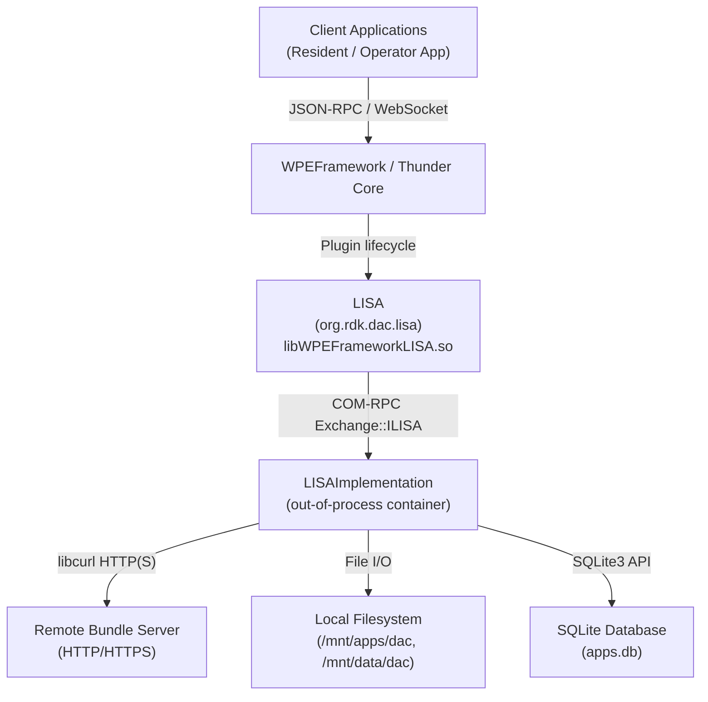
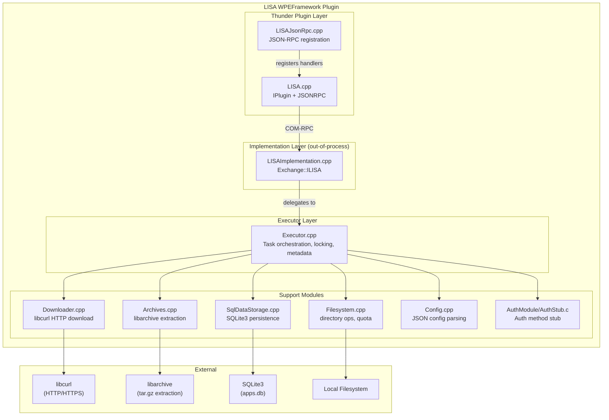
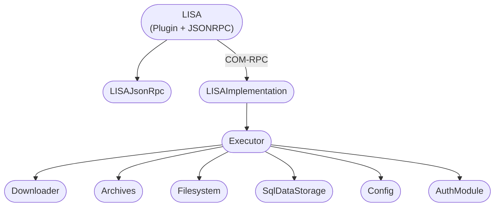
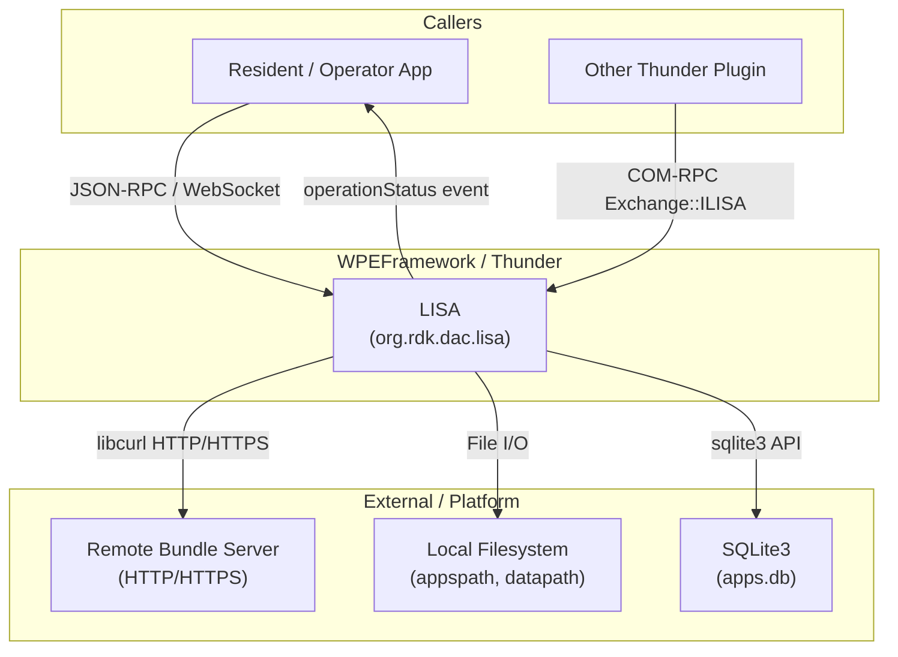
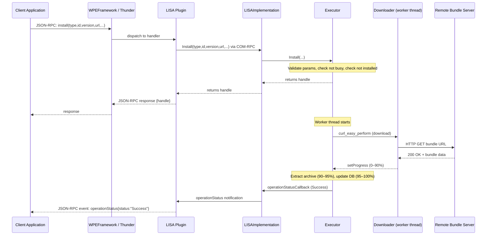
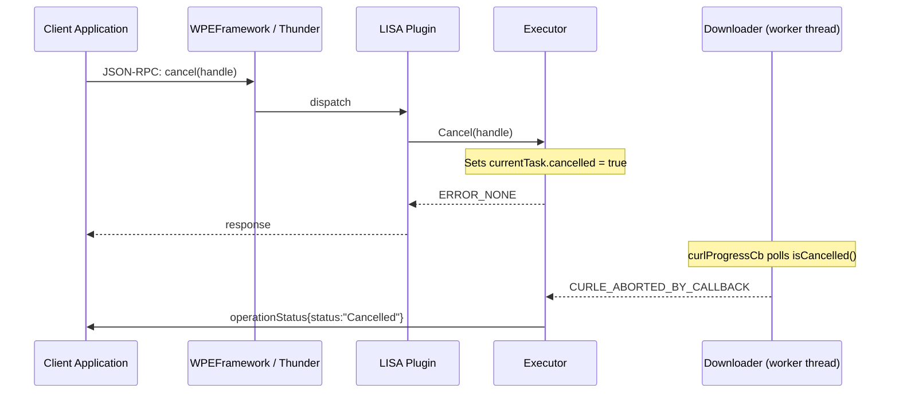
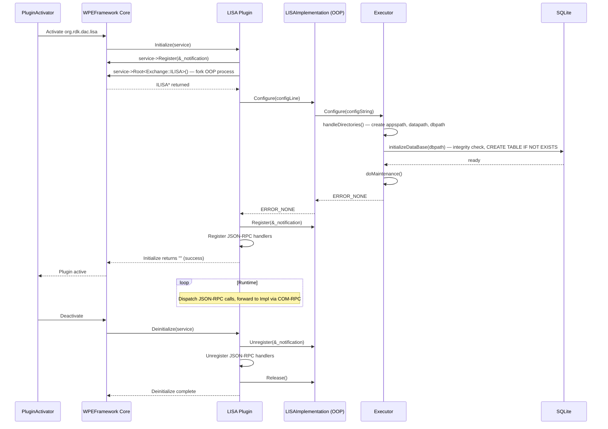
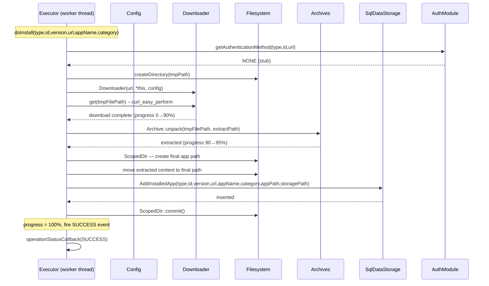
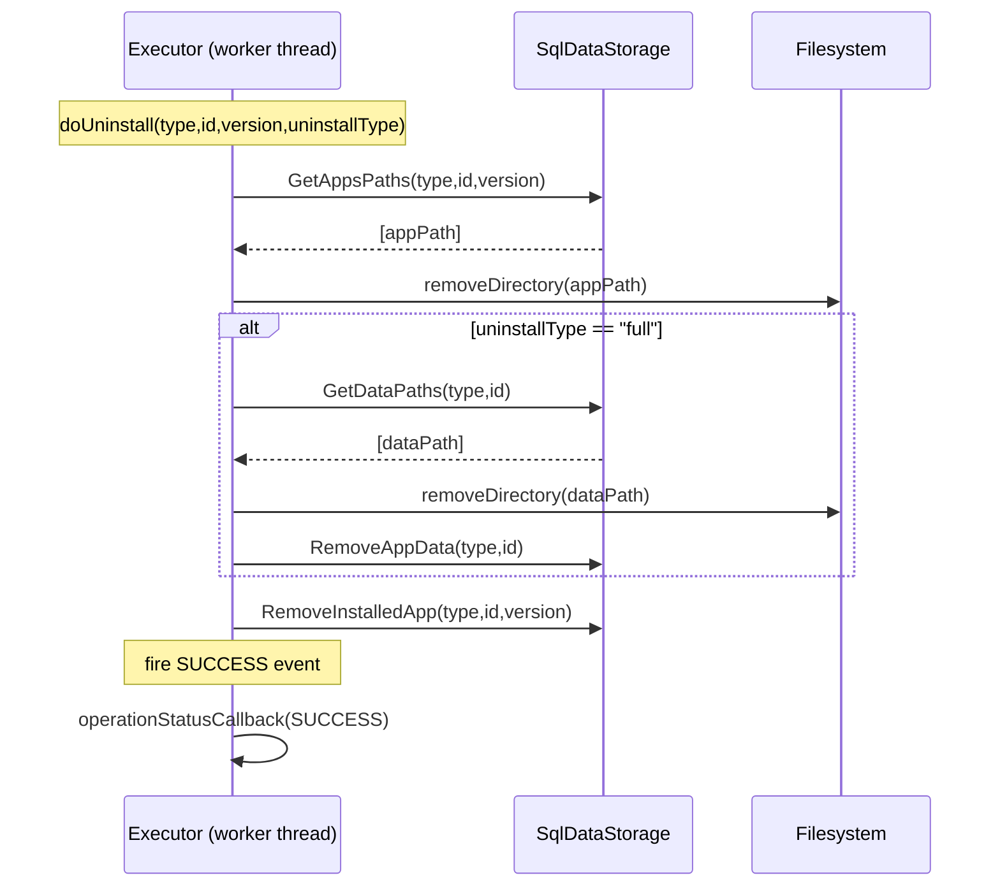

# LISA — Local Inventory Storage Manager of DAC Apps

LISA is a WPEFramework (Thunder) plugin that downloads, installs, and manages DAC (Downloadable Application Container) bundles on a set-top box, and maintains a local SQLite inventory and persistent storage for application data.

---

## Overview

LISA (Local Inventory Storage Manager of DAC Apps) is part of the RDK Downloadable Application Container framework on CPE.

1. **Component overview**: LISA manages the full lifecycle of DAC application bundles — authenticated download from a remote URL, archive extraction to local flash storage, SQLite-backed inventory tracking, and cleanup on uninstall. It also manages two distinct storage areas per application: the immutable bundle image path and a writable persistent data path.

2. **Product / device-level services**: Provides the operator or resident application a single API endpoint for installing, updating, uninstalling, and querying DAC applications on the device. Storage quota and usage per application are queryable at runtime.

3. **Module-level services**: Exposes the `Exchange::ILISA` COM-RPC interface to other WPEFramework plugins, and a JSON-RPC API over the Thunder WebSocket to external callers (resident apps, operator apps). Asynchronous installation progress and completion are reported via the `operationStatus` event.



**Key Features & Responsibilities:**

- **Application Installation**: Downloads a bundle archive from a provided URL using libcurl, extracts it using libarchive, records it in the SQLite database, and emits an `operationStatus` event on completion or failure.
- **Application Uninstall**: Removes bundle files from the image path. Supports two uninstall types: `full` (removes both bundle and persistent data) and `upgrade` (removes the bundle only, preserving persistent data).
- **Application Locking**: Prevents uninstall of an application that is currently in use. Locks are reference-counted by handle, with associated `reason` and `owner` metadata.
- **Local Inventory (GetList)**: Queries the SQLite database and returns a filtered list of installed applications with version, name, category, and URL metadata.
- **Storage Details**: Reports filesystem path, quota, and used space (in KB) for both the bundle image area and the persistent data area, per application or in aggregate.
- **Auxiliary Metadata**: Persists arbitrary key-value metadata per application version in the SQLite `metadata` table. Keys are unique per application version (`INSERT OR REPLACE`).
- **Progress Reporting**: Tracks and exposes installation progress as a percentage (0–100) mapped across three internal stages: downloading, extracting, and database update.
- **Authentication Module**: Provides an abstraction layer (`Auth.h`) for download authentication. The default build uses a stub (`AuthStub.c`) that returns `NONE` for all methods.

---

## Architecture

### High-Level Architecture

```
┌────────────────────────────────────────────────────────────────┐
│                   Client Applications                          │
│            (Resident App / Operator App)                       │
├────────────────────────────────────────────────────────────────┤
│       JSON-RPC over WPEFramework WebSocket                     │
├────────────────────────────────────────────────────────────────┤
│   LISA Plugin Layer (LISA.cpp / LISAJsonRpc.cpp)               │
│   IPlugin + JSONRPC                                            │
├────────────────────────────────────────────────────────────────┤
│   COM-RPC Exchange::ILISA (out-of-process container)           │
├────────────────────────────────────────────────────────────────┤
│   LISAImplementation (LISAImplementation.cpp)                  │
│   ┌─────────────────────────────────────────────┐             │
│   │           Executor (Executor.cpp)            │             │
│   │  ┌──────────┐  ┌────────────┐  ┌─────────┐  │             │
│   │  │Downloader│  │SqlDataStore│  │Filesystem│  │             │
│   │  └──────────┘  └────────────┘  └─────────┘  │             │
│   │  ┌──────────┐  ┌────────────┐                │             │
│   │  │ Archives │  │   Config   │                │             │
│   │  └──────────┘  └────────────┘                │             │
│   └─────────────────────────────────────────────┘             │
├────────────────────────────────────────────────────────────────┤
│   Local Filesystem        SQLite3 (apps.db)   libcurl / HTTP   │
└────────────────────────────────────────────────────────────────┘
```

### Key Architectural Patterns

| Pattern         | Description                                                                                                 | Where Applied                         |
| --------------- | ----------------------------------------------------------------------------------------------------------- | ------------------------------------- |
| Proxy           | `LISA` plugin delegates all ILISA calls to an out-of-process `LISAImplementation` via COM-RPC               | `LISA.cpp` → `LISAImplementation.cpp` |
| Strategy        | `DataStorage` abstract class with `SqlDataStorage` as the concrete implementation                           | `DataStorage.h`, `SqlDataStorage.cpp` |
| Observer        | `ILISA::INotification` callback registered and called on `operationStatus` events                           | `LISAImplementation.cpp`, `LISA.cpp`  |
| RAII            | `ScopedDir` for temporary directory rollback; `RPCUnique` smart pointer for COM-RPC objects                 | `Filesystem.h`, `LISAJsonRpc.cpp`     |
| Template Method | `Executor` defines the install pipeline; sub-steps (download, extract, DB update) are called in fixed order | `Executor.cpp`                        |

### Threading & Concurrency

- **Threading Architecture**: The plugin layer is single-threaded (Thunder dispatch thread). The implementation layer runs one background worker thread per active install or uninstall operation.
- **Main Thread**: Handles JSON-RPC dispatch and plugin lifecycle (`Initialize`, `Deinitialize`).
- **Worker Thread**: `std::thread worker` created by `Executor::executeTask()` for each install or uninstall. The worker calls `doInstall()` or `doUninstall()` and emits `operationStatusCallback` upon completion, progress, failure, or cancellation.
- **Synchronization**: `std::mutex taskMutex` guards the `currentTask` struct, the `lockedApps` map, and the `worker` thread lifecycle. `std::lock_guard<std::mutex>` (`LockGuard`) is used at all entry points that touch shared state.
- **Concurrency Limit**: Only one background task can run at a time. `isWorkerBusy()` returns true if the worker thread is joinable, and callers receive `ERROR_TOO_MANY_REQUESTS` (1002).
- **Cancellation**: `currentTask.cancelled` is a `std::atomic_bool`. The `Downloader` polls `isCancelled()` through the `DownloaderListener` interface on each libcurl progress callback; a non-zero return from the progress callback causes libcurl to abort with `CURLE_ABORTED_BY_CALLBACK`.

---

## Design

### Design Principles

LISA separates the Thunder plugin interface (JSON-RPC registration, COM-RPC notification forwarding) from business logic by running the implementation out-of-process in a container (`outofprocess: true`, `mode: Container`). The `Executor` class owns all mutable state for a running task and serialises access with a single mutex, accepting only one concurrent install or uninstall. Persistent app inventory is stored exclusively in a SQLite database, making the state survives across crashes without any additional journaling logic. The download, extraction, and database update stages are composed sequentially inside the worker thread and map to a 0–100 progress range, allowing callers to poll `getProgress` at any time. Authentication for downloads is abstracted behind a C interface (`Auth.h`) compiled as a separate shared library (`LISAAuthModule`) so platform-specific auth can be substituted without modifying the core plugin.

### Northbound & Southbound Interactions

**Northbound**: The `LISA` class implements `PluginHost::IPlugin` and `PluginHost::JSONRPC`. `LISAJsonRpc.cpp` registers all JSON-RPC method handlers directly against the JSONRPC `module` reference. The plugin also implements `Exchange::ILISA` via `INTERFACE_AGGREGATE`, so other Thunder plugins can call it over COM-RPC using the `Exchange::ILISA` interface.

**Southbound**: The `Executor` calls into three southbound layers:

- `Downloader` uses libcurl for HTTP/HTTPS downloads
- `Archive::unpack()` uses libarchive to extract the downloaded bundle
- `SqlDataStorage` uses the sqlite3 C API directly for all database operations

No Device Services API calls and no IARM bus interactions are present in this codebase.

### IPC Mechanisms

| Mechanism                               | Usage                                                                                                           |
| --------------------------------------- | --------------------------------------------------------------------------------------------------------------- |
| JSON-RPC over WPEFramework WebSocket    | External callers (resident apps) invoke LISA methods and subscribe to `operationStatus` events                  |
| COM-RPC (`Exchange::ILISA`)             | The `LISA` plugin proxy calls the out-of-process `LISAImplementation` through the WPEFramework RPC mechanism    |
| `RPC::IRemoteConnection::INotification` | Detects out-of-process implementation crash; triggers plugin deactivation via `PluginHost::IShell::Job::Create` |

No IARM bus, D-Bus, or Unix socket IPC is used.

### Data Persistence & Storage

LISA uses a SQLite database for all persistent inventory state. The database consists of three tables:

- **`apps`**: One row per unique application `(type, app_id)`. Stores `data_path` (persistent storage path) and a `created` timestamp.
- **`installed_apps`**: One row per installed `(app_id, version)`. Stores `name`, `category`, `url`, `app_path`, `created`. Has a foreign key to `apps.idx` and a unique constraint on `(app_idx, version)`.
- **`metadata`**: Key-value pairs associated with an installed app version. Has a unique constraint on `(app_idx, meta_key)`; `SetMetadata` uses `INSERT OR REPLACE`.

The database file is named `apps.db` and is located under the configured `dbpath`. On startup, `SqlDataStorage::InitDB()` runs `PRAGMA integrity_check`; if the check fails, all three tables are dropped and recreated.

Two filesystem storage areas exist per application:

- **App bundle path** (`appspath`): Stores extracted bundle archives. Default: `/mnt/apps/dac/images/`
- **Persistent data path** (`datapath`): Writable storage for app runtime data. Default: `/mnt/data/dac/`
- **Temporary download path**: `<appspath>/tmp/`

### Component Diagram



---

## Internal Modules

| Module / Class       | Description                                                                                                                                                                                                                                                                                                                                                                         | Key Files                                    |
| -------------------- | ----------------------------------------------------------------------------------------------------------------------------------------------------------------------------------------------------------------------------------------------------------------------------------------------------------------------------------------------------------------------------------- | -------------------------------------------- |
| `LISA`               | WPEFramework plugin entry point. Implements `IPlugin` and `JSONRPC`. Instantiates the out-of-process implementation via `service->Root<Exchange::ILISA>()`. Registers the `Notification` sink for COM-RPC disconnect and `operationStatus` callbacks.                                                                                                                               | `LISA.cpp`, `LISA.h`                         |
| `LISAJsonRpc`        | Registers all JSON-RPC method handlers on the `PluginHost::JSONRPC` module. Handles parameter extraction and result serialisation using generated `JsonData::LISA` types.                                                                                                                                                                                                           | `LISAJsonRpc.cpp`                            |
| `LISAImplementation` | Implements `Exchange::ILISA`. Acts as the facade between the COM-RPC layer and the `Executor`. Contains inner classes (`AppVersionImpl`, `AppImpl`, `MetadataPayloadImpl`, `StoragePayloadImpl`, `HandleResultImpl`, `LockInfoImpl`) that implement the COM-RPC iterator interfaces. Manages the `_notificationCallbacks` list.                                                     | `LISAImplementation.cpp`                     |
| `Executor`           | Owns and orchestrates all installation and uninstall operations. Manages the single background `std::thread worker`, the `currentTask` struct, the `lockedApps` map, and the `DataStorage` pointer. Contains `doInstall()`, `doUninstall()`, and `doMaintenance()` private methods. Implements `DownloaderListener` to receive progress and cancellation signals from `Downloader`. | `Executor.cpp`, `Executor.h`                 |
| `Downloader`         | Performs HTTP/HTTPS downloads using libcurl. Reads `Retry-After` response headers and implements configurable retry logic (max retries, retry delay). SSL peer verification is enabled (`CURLOPT_SSL_VERIFYPEER = 1`). Reports progress back through `DownloaderListener::setProgress()` and polls `DownloaderListener::isCancelled()` on each progress callback.                   | `Downloader.cpp`, `Downloader.h`             |
| `Archives`           | Extracts archive files to a target directory using libarchive. Throws `ArchiveError` on failure.                                                                                                                                                                                                                                                                                    | `Archives.cpp`, `Archives.h`                 |
| `SqlDataStorage`     | Concrete `DataStorage` implementation using the sqlite3 C API. Manages three tables: `apps`, `installed_apps`, `metadata`. Runs `PRAGMA integrity_check` on startup and drops/recreates tables if the check fails. Foreign keys are enforced via `PRAGMA foreign_keys = ON`.                                                                                                        | `SqlDataStorage.cpp`, `SqlDataStorage.h`     |
| `DataStorage`        | Abstract base class defining the storage interface. All callers depend on `DataStorage*`; `SqlDataStorage` is the only concrete implementation.                                                                                                                                                                                                                                     | `DataStorage.h`                              |
| `Filesystem`         | Provides directory creation/removal, subdirectory scanning, free/used space calculation (`getFreeSpace`, `getDirectorySpace`), recursive permission setting, and `isAcceptableFilePath()` validation. `ScopedDir` provides automatic rollback of a created directory if `commit()` is not called.                                                                                   | `Filesystem.cpp`, `Filesystem.h`             |
| `Config`             | Parses plugin configuration JSON using `boost::property_tree`. Stores typed fields for all configurable parameters. Default values are set in member initializers.                                                                                                                                                                                                                  | `Config.cpp`, `Config.h`                     |
| `AuthModule`         | C interface for download authentication. Defines `AuthMethod` enum and five function signatures. The default build links `AuthStub.c`, which returns `NONE` for `getAuthenticationMethod()` and `ERROR_OTHER` for all credential retrievals.                                                                                                                                        | `AuthModule/Auth.h`, `AuthModule/AuthStub.c` |
| `File`               | RAII wrapper for a `FILE*`, used by `Downloader` to write the downloaded content to disk.                                                                                                                                                                                                                                                                                           | `File.cpp`, `File.h`                         |
| `Debug.h`            | Logging macros (`INFO`, `ERROR`, `INFO_THIS`). At compile time selects between `TRACE_L1`, `TRACE_GLOBAL`, or `std::cout` based on compile-time defines.                                                                                                                                                                                                                            | `Debug.h`                                    |



---

## Prerequisites & Dependencies

**Documentation Verification Checklist:**

- [x] **Thunder / WPEFramework APIs**: `IPlugin`, `JSONRPC`, `Exchange::ILISA`, `RPC::IRemoteConnection::INotification` — confirmed in `LISA.h` and `LISAImplementation.cpp`.
- [x] **IARM Bus**: No `IARM_Bus_RegisterEventHandler` or `IARM_Bus_Call` calls found anywhere in the source tree. IARM is not used.
- [x] **Device Services (DS) APIs**: No DS function calls found in the source tree. DS is not used.
- [x] **Persistent store**: Persistence is via SQLite3 directly (`sqlite3_open`, `sqlite3_exec`, `sqlite3_prepare_v2`), not the WPEFramework persistent store.
- [x] **Systemd services**: No `.service` file found in the repository.
- [x] **Configuration files**: `Config.cpp` opens and parses the JSON string passed via `service->ConfigLine()`. The `LISA.conf.in` template generates the Thunder plugin configuration.

### RDK-E Platform Requirements

- **WPEFramework Version**: Required — `find_package(WPEFramework)`, `find_package(${NAMESPACE}Plugins REQUIRED)`, `find_package(${NAMESPACE}Definitions REQUIRED)` in `CMakeLists.txt`.
- **Build Dependencies**: Yocto layers providing WPEFramework, libcurl, libarchive, Boost, SQLite3.
- **RDK-E Plugin Dependencies**: No other Thunder plugins are declared as runtime dependencies in source code.
- **Device Services / HAL**: Not used.
- **IARM Bus**: Not used.
- **Systemd Services**: Not declared in source code.
- **Configuration Files**: Plugin configuration is passed via `service->ConfigLine()` (Thunder plugin config). The generated config file (`LISA.conf.in`) sets `dbpath`, `appspath`, `datapath`, `annotationsFile`, `annotationsRegex`, and `root` (out-of-process mode).
- **Startup Order**: The plugin sets `autostart = "true"` in `LISA.conf.in`.

### Build Dependencies

| Dependency       | Minimum Version | Purpose                               |
| ---------------- | --------------- | ------------------------------------- |
| CMake            | 3.3             | Build system                          |
| WPEFramework     | —               | Plugin framework, COM-RPC, JSONRPC    |
| libcurl          | —               | HTTP/HTTPS bundle download            |
| libarchive       | —               | Bundle archive extraction             |
| Boost.Filesystem | —               | Directory scanning, path manipulation |
| Boost.System     | —               | Boost error codes                     |
| SQLite3          | —               | Application inventory database        |
| C++14            | —               | Language standard                     |

### Runtime Dependencies

| Dependency                                              | Notes                                                                       |
| ------------------------------------------------------- | --------------------------------------------------------------------------- |
| `libcurl`                                               | Loaded at runtime for HTTP/HTTPS download.                                  |
| `libarchive`                                            | Loaded at runtime for bundle extraction.                                    |
| `LISAAuthModule`                                        | Loaded at runtime for download authentication. Default stub returns `NONE`. |
| Writable filesystem at `appspath`, `datapath`, `dbpath` | Plugin creates directories on startup.                                      |

---

## Build & Installation

```bash
# Clone the repository
git clone https://github.com/rdkcentral/LISA.git
cd LISA

# Configure
mkdir build && cd build
cmake -DCMAKE_BUILD_TYPE=Release ../

# Build
make -j$(nproc)

# Install
sudo make install
```

The installed output is `libWPEFrameworkLISA.so` placed in `lib/<namespace>/plugins/`.

The auth module stub is installed separately to `lib/` as `libLISAAuthModule.so`.

### CMake Configuration Options

| Option                 | Values              | Default   | Description                                             |
| ---------------------- | ------------------- | --------- | ------------------------------------------------------- |
| `CMAKE_BUILD_TYPE`     | `Debug` / `Release` | `Release` | Build variant                                           |
| `PLUGIN_LISA_APPS_GID` | integer             | unset     | Group ID applied to the apps bundle directory.          |
| `PLUGIN_LISA_DATA_GID` | integer             | unset     | Group ID applied to the apps persistent data directory. |

### Building Tests

```bash
cd LISA/tests
mkdir build && cd build
cmake ../
make
./lisa_test
```

Tests use Catch2 v3. A Python 3 HTTP server (`python3 -m http.server 8899`) is started automatically by the test listener to serve test bundle tarballs from the `files/` directory.

---

## Quick Start

### 1. Connect via ThunderJS

```js
import ThunderJS from "thunderJS";
const thunderJS = ThunderJS({ host: "127.0.0.1" });
```

### 2. Install an Application

```js
thunderJS["org.rdk.dac.lisa"]
  .install({
    type: "application/vnd.rdk-app.dac.native",
    id: "com.example.myapp",
    version: "1.0.0",
    url: "https://example.com/bundles/myapp_1.0.0.tar.gz",
    appName: "My App",
    category: "application",
  })
  .then((handle) => {
    console.log("Install started, handle:", handle);
  })
  .catch((err) => console.error(err));
```

### 3. Subscribe to Operation Status Events

```js
thunderJS["org.rdk.dac.lisa"].on("operationStatus", (event) => {
  console.log(
    "handle:",
    event.handle,
    "operation:",
    event.operation,
    "status:",
    event.status,
    "details:",
    event.details,
  );
});
```

### 4. Poll Progress

```js
thunderJS["org.rdk.dac.lisa"]
  .getProgress({ handle: "<handle_from_install>" })
  .then((progress) => console.log("Progress:", progress, "%"))
  .catch((err) => console.error(err));
```

### 5. List Installed Applications

```js
thunderJS["org.rdk.dac.lisa"]
  .getList({
    type: "",
    id: "",
    version: "",
    appName: "",
    category: "",
  })
  .then((result) => console.log(result.apps))
  .catch((err) => console.error(err));
```

---

## Configuration

### Configuration Parameters

The configuration JSON is passed to the plugin via `service->ConfigLine()` at `Initialize()`. It is parsed by `Config::Config(const std::string& aConfig)` using `boost::property_tree`.

| Parameter                           | Type         | Default                 | Description                                                                                                                |
| ----------------------------------- | ------------ | ----------------------- | -------------------------------------------------------------------------------------------------------------------------- |
| `appspath`                          | string       | `/mnt/apps/dac/images/` | Root directory for extracted application bundles. A `tmp/` subdirectory is automatically appended for temporary downloads. |
| `dbpath`                            | string       | `/mnt/apps/dac/db/`     | Directory where the SQLite database file `apps.db` is created.                                                             |
| `datapath`                          | string       | `/mnt/data/dac/`        | Root directory for application persistent data storage.                                                                    |
| `annotationsFile`                   | string       | `""`                    | Path to an annotations JSON file that is imported into app metadata after install.                                         |
| `annotationsRegex`                  | string       | `""`                    | Regular expression applied to annotation keys during import.                                                               |
| `downloadRetryAfterSeconds`         | unsigned int | `30`                    | Seconds to wait before a download retry. Overridden by the `Retry-After` HTTP response header.                             |
| `downloadRetryMaxTimes`             | unsigned int | `4`                     | Maximum number of download retries on HTTP 202 responses.                                                                  |
| `downloadTimeoutSeconds`            | unsigned int | `900` (15 min)          | Overall libcurl timeout in seconds for a single download operation (`CURLOPT_TIMEOUT_MS`).                                 |
| `dacBundlePlatformNameOverride`     | string       | `""`                    | Platform name override passed to the DAC bundle config resolution.                                                         |
| `dacBundleFirmwareCompatibilityKey` | string       | `""`                    | Firmware compatibility key used in DAC bundle config resolution.                                                           |
| `configUrl`                         | string       | `""`                    | URL used for DAC bundle configuration retrieval.                                                                           |

### Configuration File Template (`LISA.conf.in`)

```
autostart = "true"

configuration = JSON()
configuration.add("dbpath", "/mnt/apps/dac/db")
configuration.add("appspath", "/mnt/apps/dac/images")
configuration.add("datapath", "/mnt/data/dac")
configuration.add("annotationsFile", "annotations.json")
configuration.add("annotationsRegex", "public\\.*")
rootobject = JSON()
rootobject.add("outofprocess", "true")
rootobject.add("mode", "Container")
configuration.add("root", rootobject)
```

### Configuration Persistence

Configuration is provided at plugin startup via the Thunder configuration file. The configuration is not written or modified at runtime. No runtime configuration changes are persisted across reboots via this plugin's own mechanism.

---

## API / Usage

### Interface Type

JSON-RPC over WPEFramework WebSocket. Plugin callsign: `org.rdk.dac.lisa`.

The plugin also implements `Exchange::ILISA` for COM-RPC access from other Thunder plugins.

---

### Methods

#### `install`

Schedules an asynchronous download and installation of a DAC bundle. Only one install or uninstall can be in progress at a time.

**Parameters**

| Name       | Type   | Required | Description                                                                |
| ---------- | ------ | -------- | -------------------------------------------------------------------------- |
| `type`     | string | Yes      | MIME type of the application (e.g., `application/vnd.rdk-app.dac.native`). |
| `id`       | string | Yes      | Application identifier. Must be unique across types once registered.       |
| `version`  | string | Yes      | Application version string.                                                |
| `url`      | string | Yes      | URL of the bundle archive to download.                                     |
| `appName`  | string | Yes      | Human-readable application name.                                           |
| `category` | string | Yes      | Application category string.                                               |

**Response**

```json
"<handle>"
```

Returns a random numeric string handle used to track this operation via `getProgress`, `cancel`, and `operationStatus` events.

**Error Codes**

| Code   | Meaning                                                                                                                                                                                       |
| ------ | --------------------------------------------------------------------------------------------------------------------------------------------------------------------------------------------- |
| `1001` | One or more required parameters are missing or invalid, or `id`/`version` contain characters not accepted by `isAcceptableFilePath()`, or `id` is already registered with a different `type`. |
| `1002` | Another install or uninstall is already in progress.                                                                                                                                          |
| `1003` | This `(type, id, version)` is already installed.                                                                                                                                              |

**Example**

```js
thunderJS["org.rdk.dac.lisa"]
  .install({
    type: "application/vnd.rdk-app.dac.native",
    id: "com.example.myapp",
    version: "1.0.0",
    url: "https://example.com/bundles/myapp_1.0.0.tar.gz",
    appName: "My App",
    category: "application",
  })
  .then((handle) => console.log(handle))
  .catch((err) => console.error(err));
```

---

#### `uninstall`

Schedules an asynchronous uninstall of an installed application version.

**Parameters**

| Name            | Type   | Required    | Description                                                                                                            |
| --------------- | ------ | ----------- | ---------------------------------------------------------------------------------------------------------------------- |
| `type`          | string | Yes         | Application type.                                                                                                      |
| `id`            | string | Yes         | Application identifier.                                                                                                |
| `version`       | string | Conditional | Application version. Required unless `uninstallType` is `full` and all versions have already been removed.             |
| `uninstallType` | string | Yes         | Must be `"full"` (removes bundle and persistent data) or `"upgrade"` (removes bundle only, preserves persistent data). |

**Response**

```json
"<handle>"
```

**Error Codes**

| Code   | Meaning                                                                           |
| ------ | --------------------------------------------------------------------------------- |
| `1001` | Invalid `uninstallType`, application not found, or invalid parameter combination. |
| `1002` | Another install or uninstall is in progress.                                      |
| `1009` | The application is currently locked.                                              |

---

#### `lock`

Acquires a lock on an installed application version to prevent it from being uninstalled.

**Parameters**

| Name      | Type   | Required | Description                                                       |
| --------- | ------ | -------- | ----------------------------------------------------------------- |
| `type`    | string | Yes      | Application type.                                                 |
| `id`      | string | Yes      | Application identifier.                                           |
| `version` | string | Yes      | Application version.                                              |
| `reason`  | string | Yes      | Reason for the lock (stored for informational purposes).          |
| `owner`   | string | Yes      | Identifier of the lock owner (stored for informational purposes). |

**Response**

```json
{ "handle": "<lock_handle>" }
```

**Error Codes**

| Code   | Meaning                                             |
| ------ | --------------------------------------------------- |
| `1001` | Parameters missing or application not found.        |
| `1002` | An install operation is in progress for this app.   |
| `1009` | Application is already locked.                      |
| `1010` | An uninstall operation is in progress for this app. |

---

#### `unlock`

Releases a lock by its handle.

**Parameters**

| Name     | Type   | Required | Description                     |
| -------- | ------ | -------- | ------------------------------- |
| `handle` | string | Yes      | Lock handle returned by `lock`. |

**Response**: Empty JSON object.

**Error Codes**

| Code   | Meaning                                  |
| ------ | ---------------------------------------- |
| `1007` | Handle not found in the locked apps map. |

---

#### `getLockInfo`

Returns the `reason` and `owner` for the lock held on an application version.

**Parameters**

| Name      | Type   | Required | Description             |
| --------- | ------ | -------- | ----------------------- |
| `type`    | string | Yes      | Application type.       |
| `id`      | string | Yes      | Application identifier. |
| `version` | string | Yes      | Application version.    |

**Response**

```json
{ "reason": "<reason>", "owner": "<owner>" }
```

**Error Codes**

| Code   | Meaning                                      |
| ------ | -------------------------------------------- |
| `1001` | Parameters missing or application not found. |
| `1007` | Application is not locked.                   |

---

#### `getProgress`

Returns the current installation or uninstall progress percentage for the given handle.

**Parameters**

| Name     | Type   | Required | Description                                            |
| -------- | ------ | -------- | ------------------------------------------------------ |
| `handle` | string | Yes      | Operation handle returned by `install` or `uninstall`. |

**Response**

```json
<integer 0–100>
```

**Error Codes**

| Code   | Meaning                                 |
| ------ | --------------------------------------- |
| `1001` | Handle does not match the current task. |

---

#### `cancel`

Requests cancellation of the currently running install or uninstall operation identified by the given handle.

**Parameters**

| Name     | Type   | Required | Description                 |
| -------- | ------ | -------- | --------------------------- |
| `handle` | string | Yes      | Operation handle to cancel. |

**Response**: Empty string.

---

#### `getList`

Returns the list of installed applications matching the filter criteria. All parameters act as optional filters; passing empty strings returns all installed applications.

**Parameters**

| Name       | Type   | Required | Description                                           |
| ---------- | ------ | -------- | ----------------------------------------------------- |
| `type`     | string | No       | Filter by application type. Empty string matches all. |
| `id`       | string | No       | Filter by application ID.                             |
| `version`  | string | No       | Filter by version.                                    |
| `appName`  | string | No       | Filter by application name.                           |
| `category` | string | No       | Filter by category.                                   |

**Response**

```json
{
  "apps": [
    {
      "id": "<app_id>",
      "type": "<type>",
      "installed": [
        {
          "version": "<version>",
          "appName": "<name>",
          "category": "<category>",
          "url": "<url>"
        }
      ]
    }
  ]
}
```

---

#### `getStorageDetails`

Returns storage path, quota, and used space for the bundle area and the persistent data area. If all parameters are empty, returns aggregate usage for the entire `appspath` and `datapath`.

**Parameters**

| Name      | Type   | Required | Description                                               |
| --------- | ------ | -------- | --------------------------------------------------------- |
| `type`    | string | No       | Application type.                                         |
| `id`      | string | No       | Application ID.                                           |
| `version` | string | No       | Application version (required to get bundle-level usage). |

**Response**

```json
{
  "apps": {
    "path": "<path>",
    "quotaKB": "<quota>",
    "usedKB": "<used>"
  },
  "persistent": {
    "path": "<path>",
    "quotaKB": "<quota>",
    "usedKB": "<used>"
  }
}
```

**Error Codes**

| Code   | Meaning                                                            |
| ------ | ------------------------------------------------------------------ |
| `1001` | `id` or `version` specified but application not found in database. |

---

#### `getMetadata`

Returns metadata for an installed application version: `appName`, `category`, `url`, `resources` (key-value list), and `auxMetadata` (key-value list).

**Parameters**

| Name      | Type   | Required | Description          |
| --------- | ------ | -------- | -------------------- |
| `type`    | string | Yes      | Application type.    |
| `id`      | string | Yes      | Application ID.      |
| `version` | string | Yes      | Application version. |

**Response**

```json
{
  "appName": "<name>",
  "category": "<category>",
  "url": "<url>",
  "resources": [{ "key": "<k>", "value": "<v>" }],
  "auxMetadata": [{ "key": "<k>", "value": "<v>" }]
}
```

> **Note**: The `resources` list is always empty in the current implementation. The TODO comment in `LISAImplementation.cpp` states resources (downloads) will be added when the `Download` function is implemented.

---

#### `setAuxMetadata`

Upserts a key-value pair in the `metadata` table for the specified application version. Uses `INSERT OR REPLACE` (keys are unique per app version).

**Parameters**

| Name      | Type   | Required | Description          |
| --------- | ------ | -------- | -------------------- |
| `type`    | string | Yes      | Application type.    |
| `id`      | string | Yes      | Application ID.      |
| `version` | string | Yes      | Application version. |
| `key`     | string | Yes      | Metadata key.        |
| `value`   | string | Yes      | Metadata value.      |

---

#### `clearAuxMetadata`

Deletes a metadata key for the specified application version.

**Parameters**

| Name      | Type   | Required | Description             |
| --------- | ------ | -------- | ----------------------- |
| `type`    | string | Yes      | Application type.       |
| `id`      | string | Yes      | Application ID.         |
| `version` | string | Yes      | Application version.    |
| `key`     | string | Yes      | Metadata key to delete. |

---

#### `download`

**Not fully implemented.** Returns a fixed handle string `"Download"` with `ERROR_NONE`. No actual download is performed by this method.

**Parameters**

| Name      | Type   | Required | Description          |
| --------- | ------ | -------- | -------------------- |
| `type`    | string | Yes      | Application type.    |
| `id`      | string | Yes      | Application ID.      |
| `version` | string | Yes      | Application version. |
| `resKey`  | string | Yes      | Resource key.        |
| `resUrl`  | string | Yes      | Resource URL.        |

---

#### `reset`

**Not implemented.** Returns `ERROR_NONE` without performing any action. Parameters are accepted but ignored.

---

### Events / Notifications

| Event             | Trigger Condition                                                                                                 | Payload                                                                                                                                                                                               |
| ----------------- | ----------------------------------------------------------------------------------------------------------------- | ----------------------------------------------------------------------------------------------------------------------------------------------------------------------------------------------------- |
| `operationStatus` | Fired during and after an install or uninstall: on progress updates, on success, on failure, and on cancellation. | `{ "handle": "<handle>", "operation": "Installing\|Uninstalling", "type": "<type>", "id": "<id>", "version": "<version>", "status": "Progress\|Success\|Failed\|Cancelled", "details": "<details>" }` |

---

## Component Interactions



### Interaction Matrix

| Target                  | Interaction Purpose                                 | Key APIs                                                             |
| ----------------------- | --------------------------------------------------- | -------------------------------------------------------------------- |
| **Callers**             |                                                     |                                                                      |
| Resident / Operator App | Install, uninstall, query apps, subscribe to events | `install`, `uninstall`, `getList`, `operationStatus` event           |
| Other Thunder Plugin    | COM-RPC access to ILISA interface                   | `Exchange::ILISA`                                                    |
| **Platform / System**   |                                                     |                                                                      |
| Remote Bundle Server    | Download DAC bundle archives                        | `libcurl` (`curl_easy_perform`)                                      |
| Local Filesystem        | Store/remove bundle images and persistent app data  | POSIX file and directory APIs via `Filesystem.cpp`                   |
| SQLite3 Database        | Persist app inventory and metadata                  | `sqlite3_open`, `sqlite3_exec`, `sqlite3_prepare_v2`, `sqlite3_step` |

No IARM bus, Device Services API, WebPA, or RFC interactions are present in the source code.

### IPC Flow Patterns

**Install Request Flow:**



**Cancellation Flow:**



---

## Component State Flow

### Initialization to Active State



### Runtime State Changes

- **Out-of-process crash**: `RPC::IRemoteConnection::INotification::Deactivated()` fires when the `LISAImplementation` process dies. LISA submits a `PluginHost::IShell::Job` with `DEACTIVATED` + `FAILURE` to the worker pool, which triggers plugin deactivation.
- **Task busy**: Any `install` or `uninstall` call while the worker thread is running returns `ERROR_TOO_MANY_REQUESTS` immediately without queuing.
- **Lock contention**: An `uninstall` call on a locked application returns `ERROR_APP_LOCKED`. An `install` or `lock` call on an application with an active uninstall returns `ERROR_APP_UNINSTALLING`.

---

## Call Flows

### Installation Call Flow (detailed)



### Uninstall Call Flow



---

## Implementation Details

### HAL / DS API Integration

No Device Services or HAL API calls are present in the LISA source code.

### Key Implementation Logic

- **Progress Tracking**: `Executor::setProgress(int percentValue, OperationStage stage)` maps the raw progress value from each stage (DOWNLOADING: 0–90, EXTRACTING: 90–95, UPDATING_DATABASE: 95–100) to a 0–100 scale using `stageBase` and `stageFactor` arrays. The computed percentage is stored in `currentTask.progress` and is readable via `getProgress`.

- **File Path Validation**: `Filesystem::isAcceptableFilePath()` is called on `id` and `version` before any install. This guards against path traversal attacks in the constructed bundle directory paths.

- **Database Integrity Check**: On every startup, `SqlDataStorage::Validate()` runs `PRAGMA integrity_check`. If the result is not `"ok"`, all three tables (`apps`, `installed_apps`, `metadata`) are dropped and recreated.

- **App Directory Scanning on Startup**: `Executor::doMaintenance()` scans the `appspath` and `datapath` directories and reconciles them with the database, removing orphaned directories and stale database entries.

- **App ID Uniqueness**: An application `id` is bound to exactly one `type` across all versions. `Executor::Install()` calls `dataBase->GetTypeOfApp(id)` and rejects the install if the type does not match the existing record.

- **Error Handling Strategy**: Errors from filesystem and database operations are thrown as `FilesystemError` or `SqlDataStorageError` (both are `std::runtime_error` subclasses). `Executor::doInstall()` catches these inside the worker thread and fires an `operationStatusCallback` with `OperationStatus::FAILED`. JSON-RPC callers receive `ERROR_GENERAL` (1) for unexpected failures and the specific `ERROR_*` codes for known conditions.

- **Logging**: Three compile-time modes:
  - `FORCE_TRACE_L1_DEBUGS` defined: uses `TRACE_L1`
  - `TRACE_GLOBAL` defined: uses `TRACE_GLOBAL` / `TRACE` (WPEFramework trace categories `Trace::Information` and `Trace::Error`)
  - Neither defined: writes to `std::cout` / `std::cerr`

---

## Data Flow

```
[Client JSON-RPC install() call]
        |
        v
[LISA::LISAJsonRpc — extract params from JsonData::LISA::InstallParamsData]
        |
        v
[LISAImplementation::Install() — forward params to Executor]
        |
        v
[Executor::Install() — validate params, check busy/installed/type, generate handle, start worker thread]
        |
        v
[Executor worker thread: doInstall()]
   |           |              |
   v           v              v
[Downloader] [Archives]  [SqlDataStorage]
 libcurl GET  libarchive   INSERT INTO apps,
 bundle URL   extract to   installed_apps
 → tmp file   final path
        |
        v
[operationStatusCallback(SUCCESS/FAILED/CANCELLED)]
        |
        v
[LISAImplementation::onOperationStatus() — iterate _notificationCallbacks]
        |
        v
[LISA::Notification::operationStatus() → SendEventOperationStatus()]
        |
        v
[JSON-RPC event "operationStatus" broadcast to subscribers]
```

---

## Error Handling

### Layered Error Handling

| Layer                | Error Type                                               | Handling Strategy                                                                                                                    |
| -------------------- | -------------------------------------------------------- | ------------------------------------------------------------------------------------------------------------------------------------ |
| Filesystem / Archive | `FilesystemError`, `ArchiveError` (`std::runtime_error`) | Caught in `Executor::doInstall()` / `doUninstall()`, fires `FAILED` event                                                            |
| Database             | `SqlDataStorageError` (`std::runtime_error`)             | Caught in `Executor::doInstall()` / `doUninstall()`, fires `FAILED` event. On startup: integrity failure drops and recreates tables. |
| Download             | `DownloadError`, `CancelledException`                    | `DownloadError` → `FAILED` event; `CancelledException` → `CANCELLED` event                                                           |
| Executor             | `ERROR_*` codes (1001–1010)                              | Returned synchronously to JSON-RPC callers before task is scheduled                                                                  |
| Plugin / COM-RPC     | COM-RPC forward errors                                   | Logged via `TRACE_L1`, propagated as HTTP errors by Thunder                                                                          |
| Out-of-process crash | `RPC::IRemoteConnection::INotification::Deactivated`     | Submits plugin deactivation job to Thunder worker pool                                                                               |

### Exception Safety

`Filesystem::ScopedDir` provides rollback of a created directory if `commit()` is not called before destruction — used in `doInstall()` to clean up partially extracted content on failure. The `RPCUnique` smart pointer in `LISAJsonRpc.cpp` ensures COM-RPC object `Release()` is called in all paths, including error returns.

---

## Testing

### Test Levels

| Level       | Scope                                                                                               | Location      |
| ----------- | --------------------------------------------------------------------------------------------------- | ------------- |
| Integration | `Executor` core logic with real filesystem and SQLite; HTTP server mocked by a local Python process | `LISA/tests/` |

The test suite uses Catch2 v3. A `TestRunListener` forks a `python3 -m http.server 8899` process before the test run and terminates it after. Test bundle tarballs are served from `LISA/tests/files/`. Two mock Python scripts (`server202.py`, `servertimeout.py`) simulate HTTP 202 / timeout server behaviours.

### Running Tests

```bash
cd LISA/tests
mkdir build && cd build
cmake ../
make
./lisa_test
```

### Test Configuration

The `configure()` helper function used in all tests sets:

- `dbpath`, `appspath`, `datapath` under a local `./lisa_playground` directory
- `downloadRetryAfterSeconds: 10`
- `downloadRetryMaxTimes: 1`
- `downloadTimeoutSeconds: 30`
- `dacBundlePlatformNameOverride: "rpi4"`
- `dacBundleFirmwareCompatibilityKey`
- `configUrl`

---

## Performance Considerations

- **One-task serialisation**: Only one install or uninstall can run at a time. Concurrent callers receive `ERROR_TOO_MANY_REQUESTS` immediately.
- **Download progress granularity**: Progress is reported on each libcurl progress callback invocation (`CURLOPT_XFERINFOFUNCTION`). No debounce is applied; the callback fires at libcurl's internal rate.
- **Download timeout**: Configurable via `downloadTimeoutSeconds` (default 900 s). Set via `CURLOPT_TIMEOUT_MS` as a total operation timeout.
- **Retry back-off**: On HTTP 202 responses, the downloader waits `downloadRetryAfterSeconds` seconds (overridable by the `Retry-After` response header) before retrying, up to `downloadRetryMaxTimes` retries.
- **Disk space**: `Filesystem::getFreeSpace()` is available for free space queries; individual directory sizes are measured with `getDirectorySpace()`. No pre-flight free space check before installation is visible in the current source.

---

## Security & Safety

### Input Validation

- `Filesystem::isAcceptableFilePath()` is called on `id` and `version` parameters before any path construction in `Executor::Install()`. Reject characters that could result in path traversal.
- `uninstallType` is explicitly validated against the strings `"full"` and `"upgrade"` before scheduling the uninstall.
- SQLite queries use `sqlite3_bind_text` with `SQLITE_TRANSIENT` throughout `SqlDataStorage`, preventing SQL injection via user-supplied values.

### Download Security

- SSL peer verification is enabled: `curl_easy_setopt(curl.get(), CURLOPT_SSL_VERIFYPEER, 1L)`.
- Authentication is delegated to the `AuthModule` interface. The stub returns `NONE`; platform-specific implementations can provide credentials, bearer tokens, API keys, or client certificates without modifying core plugin code.

### Threat Model Notes

- **Unauthenticated JSON-RPC callers**: LISA does not implement caller authentication at the plugin level. Access control is the responsibility of the WPEFramework security layer.
- **Malicious bundle content**: After download, `Archive::unpack()` extracts the archive to the configured `appspath`. No content scanning or integrity verification (checksums, signatures) of the bundle content is implemented in the current source.
- **Path traversal via `id`/`version`**: Mitigated by `isAcceptableFilePath()` validation before path construction.

---

## Extensibility

- **Authentication backends**: Replace the `LISAAuthModule` shared library with a platform-specific implementation of `Auth.h` (`getAuthenticationMethod`, `getAPIKey`, `getCredentials`, `getClientCertsFile`, `getToken`). The stub is built separately via `AuthModule/CMakeLists.txt` and linked as a runtime dependency.
- **Storage backend**: `DataStorage` is an abstract class. `SqlDataStorage` is the only current implementation. A different storage backend can be substituted by implementing the `DataStorage` interface.
- **Platform GID configuration**: `PLUGIN_LISA_APPS_GID` and `PLUGIN_LISA_DATA_GID` CMake options inject GIDs for filesystem permission setting via `Filesystem::createDirectory(path, gid, writeable)`.

---

## Contributing

1. Sign the RDK [Contributor License Agreement (CLA)](https://developer.rdkcentral.com/source/contribute/contribute/before_you_contribute/) before submitting code.
2. Each new file must include the Apache 2.0 license header as used throughout this repository.
3. Fork the repository and submit a pull request. Reference the relevant RDK ticket or GitHub issue in every commit and PR description.

See [CONTRIBUTING.md](CONTRIBUTING.md) for details.

---

## Repository Structure

```
LISA/
├── CMakeLists.txt              # Top-level build definition
├── CONTRIBUTING.md
├── LICENSE                     # Apache 2.0
├── NOTICE
├── README.md
├── cmake/
│   └── FindSqlite.cmake        # CMake find script for SQLite3
└── LISA/
    ├── CMakeLists.txt          # Plugin build definition
    ├── LISA.cpp                # IPlugin implementation: Initialize / Deinitialize
    ├── LISA.h                  # Plugin class declaration
    ├── LISAJsonRpc.cpp         # JSON-RPC handler registration
    ├── LISAImplementation.cpp  # Exchange::ILISA implementation + COM-RPC result types
    ├── Executor.cpp            # Task orchestration, install/uninstall, locking, metadata
    ├── Executor.h
    ├── Downloader.cpp          # libcurl HTTP/HTTPS download
    ├── Downloader.h
    ├── Archives.cpp            # libarchive extraction
    ├── Archives.h
    ├── Filesystem.cpp          # Directory operations, quota, ScopedDir
    ├── Filesystem.h
    ├── SqlDataStorage.cpp      # SQLite3 persistence (apps, installed_apps, metadata tables)
    ├── SqlDataStorage.h
    ├── DataStorage.h           # Abstract storage interface
    ├── Config.cpp              # JSON configuration parsing
    ├── Config.h
    ├── File.cpp                # RAII FILE* wrapper
    ├── File.h
    ├── Debug.h                 # Logging macros (INFO, ERROR)
    ├── Module.cpp              # WPEFramework module registration
    ├── Module.h
    ├── LISA.conf.in            # Thunder plugin configuration template
    ├── LISAPlugin.json         # Plugin descriptor
    ├── AuthModule/
    │   ├── Auth.h              # Authentication C interface
    │   ├── AuthStub.c          # Stub: returns NONE for all auth methods
    │   └── CMakeLists.txt      # Builds libLISAAuthModule.so
    └── tests/
        ├── CMakeLists.txt      # Test build definition (Catch2 v3)
        ├── LISATests.cpp       # Integration tests
        ├── files/              # Test bundle tarballs (.tar.gz)
        └── mock/
            ├── server202.py    # Mock server returning HTTP 202 (retry)
            └── servertimeout.py # Mock server simulating timeout
```

---

## Questions & Contact

- Open a [GitHub Issue](https://github.com/rdkcentral/LISA/issues)
- RDK community: [https://rdkcentral.com](https://rdkcentral.com)
