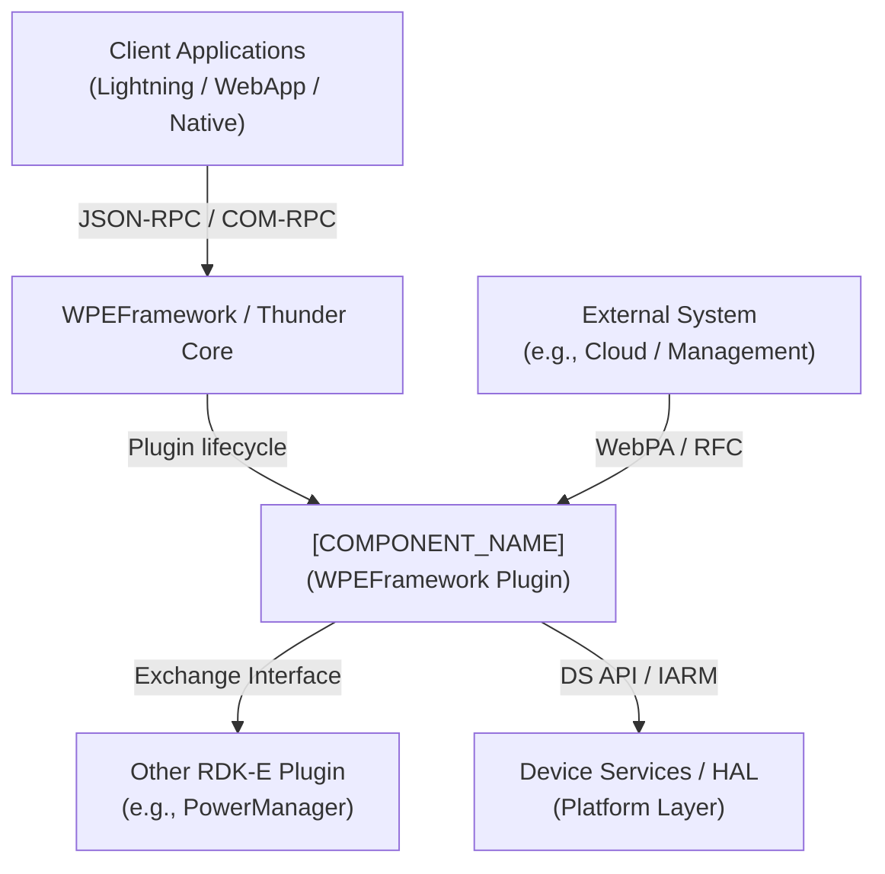
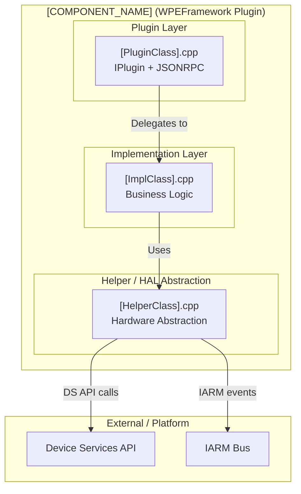
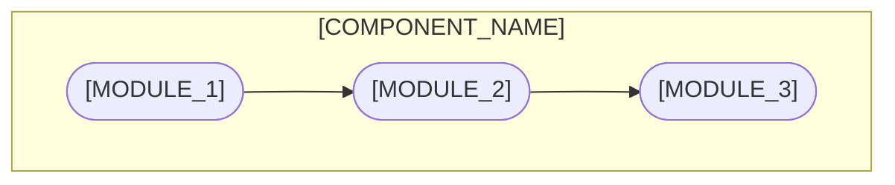
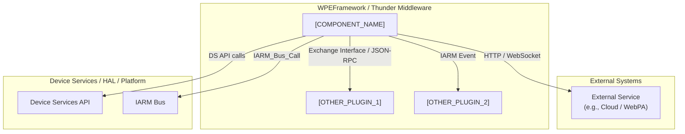
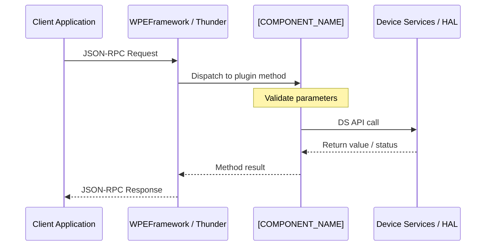
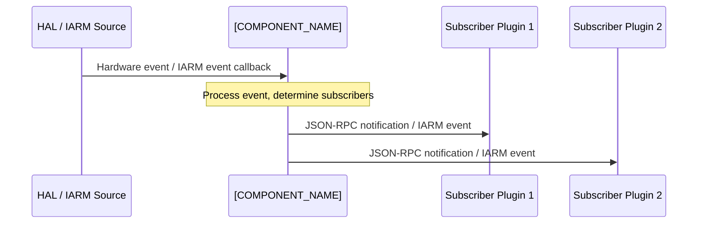
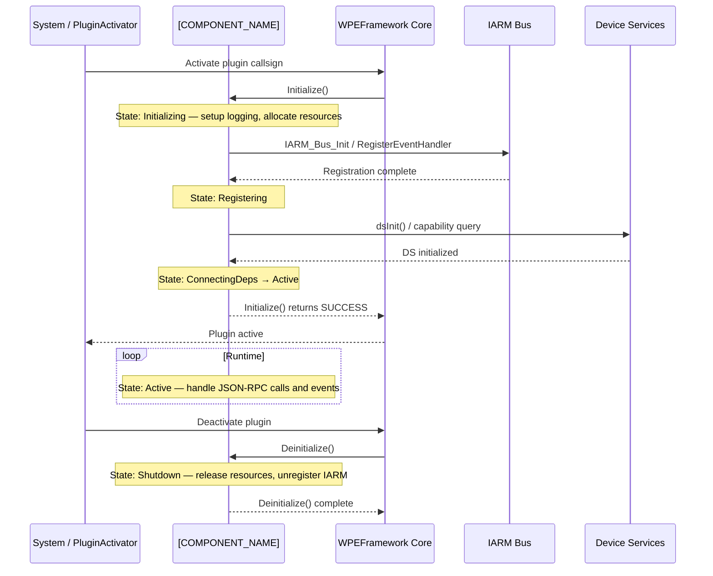
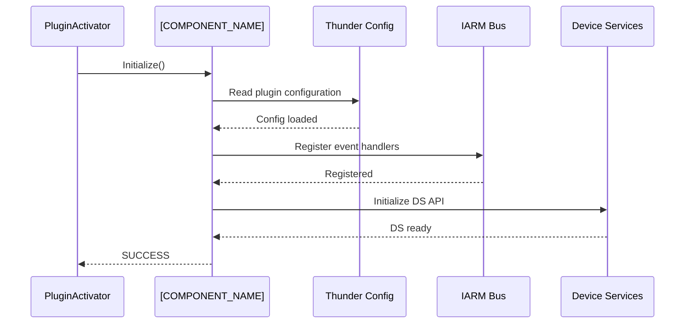
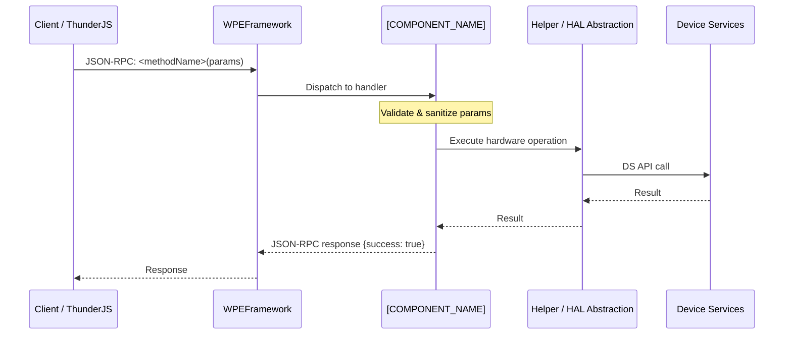

# \<Component Name\>


> One-sentence description of what this component does and its role in the RDK-E platform.

> **Documentation Best Practices:**
>
> - ✅ **Verify implementation**: Search source code for actual API calls before documenting features.
> - ✅ **Don't assume**: Build dependencies (CMakeLists, includes) ≠ actual runtime usage.
> - ✅ **Explicitly document absence**: If a feature or mechanism is not implemented, state it clearly rather than omitting it.
> - ✅ **Check function calls**: Use `grep -r "function_name"` to confirm APIs are called, not merely declared or linked.
> - ✅ **Example**: DS library linked but no calls present → document as "No Device Services integration implemented."

---


## Overview

Describe the component's role in the RDK-E platform across three levels:

1. **Component overview**: What is this component and what problem does it solve?
2. **Product / device-level services**: What does it provide to the end product or device stack?
3. **Module-level services**: What does it expose to other RDK-E middleware components?

Add a C4 System Context diagram showing the component's position relative to external systems (e.g., cloud services, management endpoints), the WPEFramework/Thunder core, other RDK-E plugins, and the HAL/platform layer.



**Key Features & Responsibilities:**

List the major capabilities this component provides. Use bold for the feature name followed by a one- or two-sentence explanation.

- **[FEATURE_1]**: [What this feature provides and why it matters.]
- **[FEATURE_2]**: [What this feature provides and why it matters.]
- **[FEATURE_3]**: [What this feature provides and why it matters.]

---

## Architecture

### High-Level Architecture

Provide a layered ASCII or Mermaid diagram showing the component's internal structure, the interfaces it exposes northbound (to clients / Thunder), and the interfaces it consumes southbound (DS API, IARM, HAL).

```
┌───────────────────────────────────────────────┐
│               Client Applications             │
├───────────────────────────────────────────────┤
│            <Interface Layer (e.g., JSON-RPC)> │
├───────────────────────────────────────────────┤
│              <Component Name>                 │
│  ┌──────────────────┬────────────────────┐    │
│  │  <Sub-Module A>  │   <Sub-Module B>   │    │
│  └──────────────────┴────────────────────┘    │
├───────────────────────────────────────────────┤
│          <Underlying Platform / HAL>          │
└───────────────────────────────────────────────┘
```

### Key Architectural Patterns

List the design patterns employed and the module(s) where each applies.

| Pattern   | Description                                                 | Where Applied    |
| --------- | ----------------------------------------------------------- | ---------------- |
| Singleton | Single point of access to shared hardware resource          | `<ClassName>`    |
| Observer  | Event notification to registered listeners                  | `<EventManager>` |
| Factory   | Platform-specific object creation behind a common interface | `<FactoryClass>` |
| RAII      | Resource lifecycle tied to object lifetime                  | Throughout       |

### Threading & Concurrency

Describe the threading model in detail. If the component is single-threaded, state that explicitly. If it uses worker threads, list each thread and its responsibility.

- **Threading Architecture**: [Single-threaded / Multi-threaded / Event-driven]
- **Main Thread**: [Responsibilities — e.g., JSON-RPC dispatch, plugin lifecycle.]
- **Worker Threads** (if applicable):
  - _[Thread name]_: [Purpose and what data or resources it owns.]
  - _[Thread name]_: [Purpose and what data or resources it owns.]
- **Synchronization**: [Mutexes, condition variables, lock-free structures used to protect shared state.]
- **Async / Event Dispatch**: [How callbacks or notifications are posted back to callers without blocking.]

---

## Design

### Design Principles

Provide a 4–6 sentence overview of the design philosophy: why the component is structured the way it is, which constraints (performance, portability, safety) shaped the design, and how those constraints are reflected in the architecture.

### Northbound & Southbound Interactions

Explain how the northbound interface (JSON-RPC / COM-RPC to client applications and the Thunder framework) and the southbound interface (Device Services API, IARM bus, HAL drivers) are integrated, including any abstraction layers that isolate the plugin logic from platform specifics.

### IPC Mechanisms

Explain which IPC mechanisms are used (JSON-RPC, COM-RPC Exchange interfaces, IARM bus, D-Bus, sockets) and why each was chosen for its specific interaction. Note any platform-capability guards that select one mechanism over another at runtime or compile time.

### Data Persistence & Storage

Document how configuration and state are persisted. Verify actual API usage in source code before writing this section.

- If persistence is implemented: describe the mechanism (e.g., WPEFramework persistent store, file I/O, vendor-specific storage) and which parameters are persisted.
- If **no** persistence is implemented: state explicitly — _"Configuration changes are not persisted across reboots."_

### Component Diagram

A component diagram showing the internal structure and sub-module dependencies is given below. Expand from the context diagram above to show internal sub-modules, their responsibilities, and how they connect to external systems.



---

## Internal Modules

Describe each significant module, class, or file. For modules that receive data from external sources, call that out explicitly.

| Module / Class | Description                                                                    | Key Files                  |
| -------------- | ------------------------------------------------------------------------------ | -------------------------- |
| `[MODULE_1]`   | [Role and responsibilities of this module. Note if it receives external data.] | `[file1.cpp]`, `[file1.h]` |
| `[MODULE_2]`   | [Role and responsibilities of this module.]                                    | `[file2.cpp]`              |
| `[MODULE_3]`   | [Role and responsibilities of this module.]                                    | `[file3.cpp]`              |



---

## Prerequisites & Dependencies

**Documentation Verification Checklist:**

Before documenting any dependency or integration, verify actual usage in source code:

- [ ] **Thunder / WPEFramework APIs**: Confirm which `IPlugin`, `JSONRPC`, and `Exchange` interfaces are actually implemented.
- [ ] **IARM Bus**: Verify actual `IARM_Bus_RegisterEventHandler` / `IARM_Bus_Call` usages — do not assume based on header includes.
- [ ] **Device Services (DS) APIs**: Confirm which DS functions are called, not just declared.
- [ ] **Persistent store**: Search for actual store read/write calls — do not assume based on linked libraries.
- [ ] **Systemd services**: Verify `After=` / `Requires=` entries in the `.service` file.
- [ ] **Configuration files**: Confirm files are actually opened and parsed by the component.

### RDK-E Platform Requirements

- **WPEFramework Version**: [Minimum WPEFramework / Thunder version required.]
- **Build Dependencies**: [Required Yocto layers, recipes, and build-time libraries.]
- **RDK-E Plugin Dependencies**: [Other Thunder plugins that must be active before this plugin initializes — e.g., `org.rdk.PowerManager`.]
- **Device Services / HAL**: [Required DS interfaces and minimum HAL versions.]
- **IARM Bus**: [IARM namespaces or event groups this component registers with.]
- **Systemd Services**: [System daemons that must be running before this plugin activates.]
- **Configuration Files**: [Mandatory configuration files and their expected filesystem locations.]
- **Startup Order**: [PluginActivator startup dependencies; reference `wpeframework-*.service` ordering if applicable.]

### Build Dependencies

| Dependency  | Minimum Version | Purpose      |
| ----------- | --------------- | ------------ |
| CMake       | 3.7             | Build system |
| \<library\> | \<version\>     | \<purpose\>  |

### Runtime Dependencies

| Dependency           | Notes                                              |
| -------------------- | -------------------------------------------------- |
| \<service / daemon\> | Must be running before this component initializes. |
| \<library\>          | Loaded dynamically at startup.                     |

---

## Build & Installation

Provide step-by-step build instructions. Include platform-specific variations and important CMake options.

```bash
# Clone the repository
git clone https://github.com/rdkcentral/<component>.git
cd <component>

# Configure
mkdir build && cd build
cmake -DCMAKE_BUILD_TYPE=Release ../

# Build
make -j$(nproc)

# Install
sudo make install
```

### CMake Configuration Options

| Option             | Values              | Default   | Description             |
| ------------------ | ------------------- | --------- | ----------------------- |
| `CMAKE_BUILD_TYPE` | `Debug` / `Release` | `Release` | Build variant           |
| `ENABLE_<FEATURE>` | `ON` / `OFF`        | `OFF`     | Enable optional feature |

---

## Quick Start

Provide the minimal working example that gets a developer from zero to a running integration. Include all necessary steps: initialization, a representative API call, and cleanup.

### 1. Include / Import

```c
// C / C++
#include "<component>.h"
```

```js
// JavaScript — ThunderJS
import ThunderJS from "ThunderJS";
const thunderJS = ThunderJS({ host: "192.168.1.100" });
```

### 2. Initialize

```c
// C / C++ — initialize the component
<ComponentHandle> handle = <component>_init(config);
if (!handle) {
    fprintf(stderr, "Initialization failed\n");
    return -1;
}
```

### 3. Use

```js
// JavaScript — invoke a JSON-RPC method
thunderJS.<PluginCallsign>.<methodName>({ param1: "value" })
  .then(result => console.log(result))
  .catch(err  => console.error(err))
```

### 4. Cleanup

```c
<component>_deinit(handle);
```

---

## Configuration

### Configuration Priority

List sources in order from lowest to highest precedence:

1. Built-in defaults (compile-time)
2. Operator / RFC settings
3. Stream-provided or device-provided settings
4. Application-provided settings
5. Developer override file (e.g., `/opt/<component>.cfg`)

### Configuration Parameters

| Parameter | Type | Default | Description                           |
| --------- | ---- | ------- | ------------------------------------- |
| `<param>` | bool | `true`  | Enable or disable \<feature\>.        |
| `<param>` | int  | `30`    | Timeout in seconds for \<operation\>. |

### Key Configuration Files

Describe each configuration file the component reads or writes. If no configuration files exist, omit this table.

| Configuration File | Purpose        | Override Mechanism           |
| ------------------ | -------------- | ---------------------------- |
| `<path/to/file>`   | [File purpose] | [Environment var / API call] |

### Runtime Configuration

If configuration can be changed at runtime (via Thunder API, RFC parameter, or CLI utility), document how:

```bash
# Example: change a parameter at runtime
<ctrl-utility> <module> <parameter> <value>
```

### Configuration Persistence

- If persistence is implemented: state which parameters are persisted, by what mechanism, and where they are stored.
- If **no** persistence is implemented: _"Configuration changes are not persisted across reboots."_

---

## API / Usage

### Interface Type

State the interface type(s): JSON-RPC over Thunder WebSocket, COM-RPC Exchange interface, C/C++ library API, IARM events, or a combination.

### Methods / Functions

For each method document: name, description, parameters, response, and a working example.

#### `<methodName>`

Description of what this method does and when to call it.

**Parameters**

| Name     | Type   | Required | Description     |
| -------- | ------ | -------- | --------------- |
| `param1` | string | Yes      | \<description\> |
| `param2` | int    | No       | \<description\> |

**Response**

```json
{
  "result": "<value>",
  "success": true
}
```

**Example**

```js
thunderJS.<PluginCallsign>.<methodName>({ param1: "value" })
  .then(result => console.log(result))
  .catch(err   => console.error(err))
```

### Events / Notifications

| Event           | Trigger Condition                   | Payload                  | Subscriber Examples  |
| --------------- | ----------------------------------- | ------------------------ | -------------------- |
| `on<EventName>` | \<condition that fires this event\> | `{ "field": "<value>" }` | \<consumer plugins\> |

---

## Component Interactions

Describe all interactions this component has with external modules, including Thunder plugin-to-plugin calls, IARM event publishing/subscribing, DS/HAL API calls, and any external service communications.



### Interaction Matrix

Consolidated view of all component interactions. Include only interactions verified in source code.

| Target Component / Layer  | Interaction Purpose                        | Key APIs / Topics                                |
| ------------------------- | ------------------------------------------ | ------------------------------------------------ |
| **RDK-E Plugins**         |                                            |                                                  |
| `[PLUGIN_1]`              | [e.g., Power state change notifications]   | `Exchange::I<Interface>`, `IARM_<EventName>`     |
| `[PLUGIN_2]`              | [e.g., Persistent settings read/write]     | `<method_name>()`                                |
| **Device Services / HAL** |                                            |                                                  |
| DS API                    | [e.g., Hardware control, capability query] | `<ds_function_1>()`, `<ds_function_2>()`         |
| IARM Bus                  | [e.g., System-wide event distribution]     | `IARM_Bus_RegisterEventHandler`, `IARM_Bus_Call` |
| **External Systems**      |                                            |                                                  |
| [External service]        | [e.g., RFC parameter delivery]             | `[endpoint / parameter path]`                    |

### Events Published

| Event Name  | IARM / JSON-RPC Topic  | Trigger Condition                 | Subscriber Components |
| ----------- | ---------------------- | --------------------------------- | --------------------- |
| `[Event_1]` | `[topic / event name]` | [Condition that fires this event] | [List of subscribers] |
| `[Event_2]` | `[topic / event name]` | [Condition that fires this event] | [List of subscribers] |

### IPC Flow Patterns

**Primary Request / Response Flow:**



**Event Notification Flow:**



---

## Component State Flow

### Initialization to Active State

Describe the component's lifecycle from system startup through full initialization to active operation. Highlight critical milestones such as Thunder plugin `Initialize()`, IARM registration, DS initialization, and readiness signaling.



### Runtime State Changes

Explain state changes that occur during normal operation (e.g., power state transitions, network availability changes, device capability changes).

**State Change Triggers:**

- [Event or condition that triggers a state change and its impact on component behavior.]
- [Describe recovery mechanisms or fallback behavior.]

**Context Switching Scenarios:**

- [Scenarios where the component changes operational mode — e.g., entering standby, losing a dependency plugin, receiving an RFC update.]

---

## Call Flows

### Initialization Call Flow



### Request Processing Call Flow

Document the most critical supported call flow (e.g., a JSON-RPC set/get operation that drives hardware state).



---

## Implementation Details

### HAL / DS API Integration

List every Device Services or HAL function the component actually calls. Verify against source code before populating.

| HAL / DS API        | Purpose               | Implementation File |
| ------------------- | --------------------- | ------------------- |
| `<ds_function_1>()` | [What this call does] | `[source_file.cpp]` |
| `<ds_function_2>()` | [What this call does] | `[source_file.cpp]` |

### Key Implementation Logic

- **State / Lifecycle Management**: Describe how the component tracks internal state (active, standby, error) and the files where state transition logic resides.
  - Core implementation: `[file.cpp]`
  - State transition handlers: `[file.cpp]`

- **Event Processing**: How IARM events or DS callbacks are received, queued, and dispatched to the correct handler.
  - Event queue or dispatch model used.
  - Any prioritization or debounce logic.

- **Error Handling Strategy**: How errors from DS/HAL are mapped, logged, and surfaced to JSON-RPC callers.
  - DS error code → JSON-RPC error mapping.
  - Retry / recovery logic for transient failures.
  - Timeout handling.

- **Logging & Diagnostics**: Logging categories, verbosity levels, and any component-specific debug mechanisms.
  - RDK Logger module name: `LOG.RDK.<COMPONENT>`
  - Key log points: initialization, state transitions, DS API errors.

---

## Data Flow

Provide a step-by-step walkthrough of data through the component for the primary use case.

```
[External Trigger / Input]
        |
        v
[Ingestion / Reception Layer — JSON-RPC handler or IARM callback]
        |
        v
[Processing / Business Logic — validation, state update, DS call]
        |
        v
[Output / Notification / Storage — JSON-RPC response, IARM event, persistent store]
```

---

## Error Handling

### Layered Error Handling

| Layer               | Error Type              | Handling Strategy                   |
| ------------------- | ----------------------- | ----------------------------------- |
| Hardware / DS       | Device-specific codes   | Map to standardized error enum      |
| Abstraction / HAL   | Standardized error enum | Log and propagate upward            |
| Plugin / API        | JSON-RPC error codes    | Return structured error response    |
| Framework / Thunder | Thunder propagation     | Caller receives error event or code |

### Exception Safety

Describe use of RAII for resource management, exception boundaries at API interfaces, and graceful degradation behavior when hardware operations fail.

---

## Testing

### Test Levels

| Level            | Scope                                                   | Location            |
| ---------------- | ------------------------------------------------------- | ------------------- |
| L1 – Unit        | Individual classes / functions, all dependencies mocked | `tests/l1/`         |
| L2 – Integration | Real DS / HAL interfaces or hardware stubs              | `tests/l2/`         |
| L3 – System      | End-to-end on a target RDK-E device                     | Manual / device lab |

### Running Tests

```bash
cd build
cmake -DBUILD_TESTS=ON ../
make -j$(nproc)
ctest --output-on-failure
```

### Mock Framework

Describe how Thunder, IARM, and DS/HAL dependencies are mocked for L1 tests. List key mock classes or files.

---

## Performance Considerations

Highlight real-time, latency, and memory constraints and how the design addresses them.

- **Memory footprint**: Hardware state caching strategy; allocator choices to minimize heap fragmentation.
- **Latency**: State any response-time SLAs (e.g., sub-millisecond LED control, <50 ms JSON-RPC round-trip).
- **Throughput**: Buffer management for high-frequency event or data paths.
- **Non-blocking design**: Identify APIs that must be non-blocking and the mechanism used (async dispatch, worker thread offload, etc.).
- **Timer management**: Describe any WPEFramework timer subsystem usage (e.g., blink patterns, watchdog timers, retry back-off).

---

## Security & Safety

### Input Validation

- All externally supplied JSON-RPC parameters are range-checked and type-validated before use.
- String parameters are sanitized to prevent injection into system calls or log output.

### Hardware / Resource Protection

- Safe operating limits enforced before writing to hardware (e.g., brightness caps, volume ceilings, thermal thresholds).
- Hardware capability boundary checks performed before any write operation.

### Threat Model Notes

Describe known attack surfaces specific to this component (e.g., unauthenticated JSON-RPC callers, IARM event spoofing) and the mitigations in place.

---

## Extensibility

Describe how the component can be extended without modifying its core logic.

- **Plugin / backend selection**: How to register a new implementation or engine (e.g., a new DS backend, a new voice engine).
- **Platform portability**: Abstraction layers that isolate platform-specific code from shared business logic.
- **Build-time feature flags**: CMake options that conditionally include optional subsystems.
- **Vendor overrides**: Configuration hooks or compile-time extension points for vendor-specific behavior.

---

## Platform Support

| Platform              | Status    | Notes                       |
| --------------------- | --------- | --------------------------- |
| RDK-E (set-top box)   | Supported | Primary target              |
| Raspberry Pi (dev VM) | Supported | Use `-DRDK_PLATFORM=DEV_VM` |
| x86 emulation         | Supported | For CI and unit testing     |

---

## Versioning & Release

### Branch Strategy

| Branch        | Purpose                              |
| ------------- | ------------------------------------ |
| `main`        | Stable, release-ready code           |
| `develop`     | Active development and contributions |
| `sprint/<id>` | Sprint-specific integration branches |

### Changelog

See [CHANGELOG.md](CHANGELOG.md) for the full release history.

### RFC / TR-181 Parameters

List parameters only if the component exposes configurable runtime behavior via RFC or TR-181. Verify by checking actual RFC handler code.

| TR-181 Parameter                                             | Type | Description                                 |
| ------------------------------------------------------------ | ---- | ------------------------------------------- |
| `DeviceInfo.X_RDKCENTRAL-COM_RFC.Feature.<Component>.Enable` | bool | Enable or disable the component at runtime. |

---

## Contributing

### License Requirements

1. Sign the RDK [Contributor License Agreement (CLA)](https://developer.rdkcentral.com/source/contribute/contribute/before_you_contribute/) before submitting code.
2. Each new file must include the [RDKM license header](https://developer.rdkcentral.com/source/source-code/source-code/coding_guideline/).
3. No additional license files should be added inside subdirectories.

### How to Contribute

1. Fork the repository and commit your changes on a feature branch.
2. Build and test on at least one approved RDK device or the development VM.
3. Submit a pull request to the active sprint or `develop` branch.
4. Reference the relevant RDK ticket or GitHub issue number in every commit and PR description.

### Pull Request Checklist

- [ ] BlackDuck, copyright, and CLA checks pass.
- [ ] At least one reviewer has approved the PR.
- [ ] Commit messages include RDK ticket / GitHub issue numbers and a reason for the change.
- [ ] New or changed APIs are documented in this file or the linked API reference.
- [ ] Unit tests (L1) cover the changed code path.
- [ ] If Thunder framework changes are required, limited regression testing has been completed.

### Coding Guidelines

Refer to [RDK Coding Guidelines](https://wiki.rdkcentral.com/display/ASP/RDK+Coding+Guidelines) for style, naming conventions, and code review standards.

---

## Repository Structure

```
<component>/
├── include/            # Public header files
├── src/                # Implementation source files
├── plugin/             # Thunder plugin layer (IPlugin, JSONRPC)
├── helpers/            # Internal utility / HAL abstraction modules
├── tests/
│   ├── l1/             # Unit tests (mocked dependencies)
│   └── l2/             # Integration tests (real DS / HAL)
├── docs/               # Extended documentation and diagrams
├── CMakeLists.txt      # Top-level build definition
├── CHANGELOG.md        # Release history
└── README.md           # This file
```

---

## Questions & Contact

For questions, issues, or feature discussions:

- Open a [GitHub Issue](https://github.com/rdkcentral/<component>/issues)
- Reach out to the maintainers: [Maintainer Name](mailto:maintainer@example.com)
- RDK community: [https://rdkcentral.com](https://rdkcentral.com)
