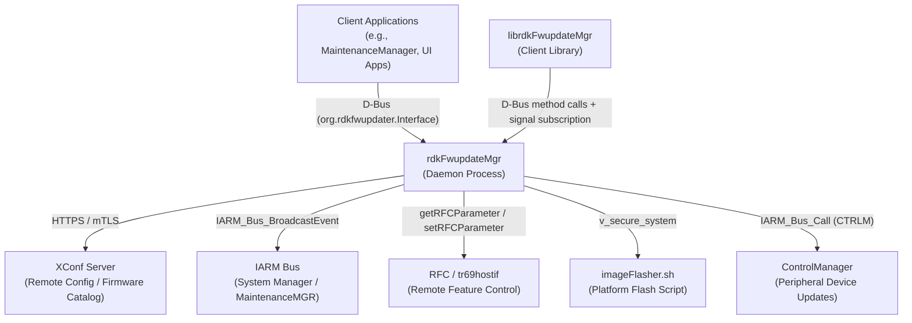
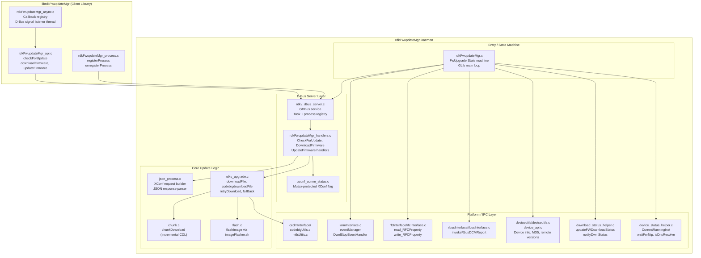
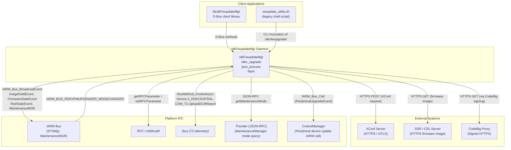
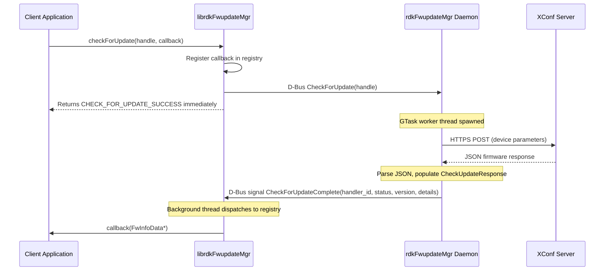
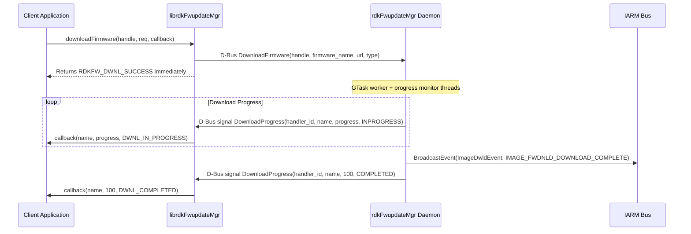
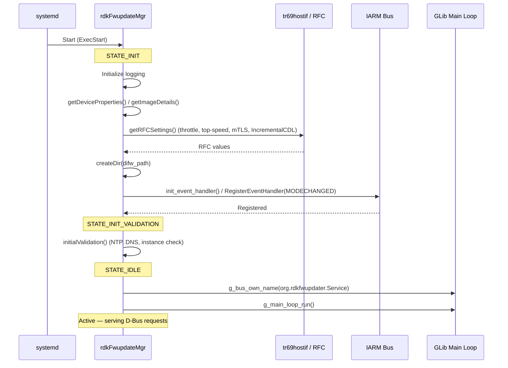
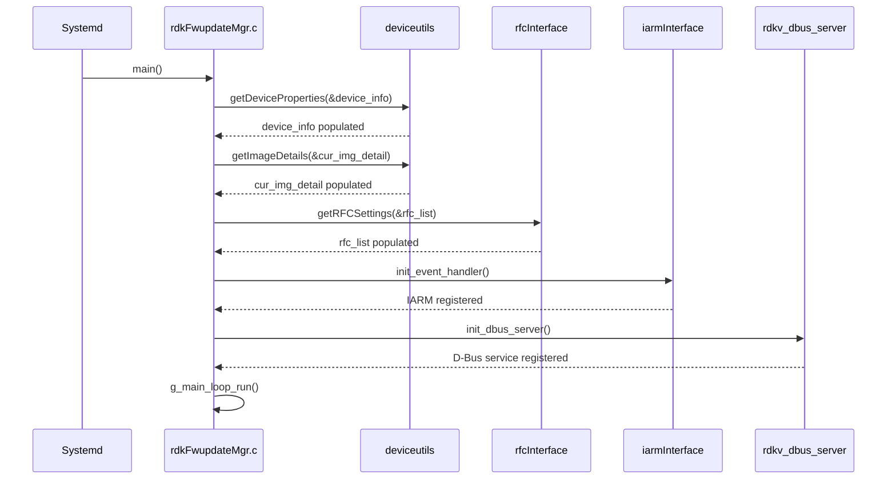
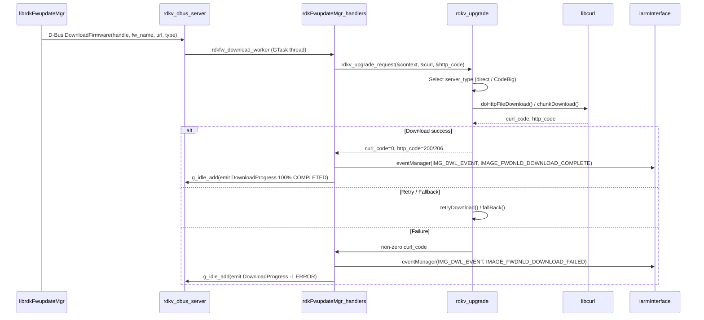

# rdkfwupdater

RDK Firmware Updater Manager — a C-language daemon and client library that checks for, downloads, and flashes firmware updates on RDK-E video devices by communicating with the XConf server and publishing download/flash state over IARM and D-Bus.

---

## Overview

### Component Overview

`rdkfwupdater` manages the full firmware update lifecycle on RDK-E devices. It contacts the remote XConf configuration server to determine whether a firmware update is available, downloads the firmware image over HTTPS (direct or via CodeBig proxy), and triggers the platform-specific flash script to install the image. The component also handles peripheral firmware updates (remote control firmware, audio, DSP, keyword model).

### Product / Device-Level Services

- Keeps device firmware current by querying XConf on schedule or on demand.
- Downloads firmware images using libcurl with mTLS and optional CodeBig signing.
- Writes firmware download and flash status to `/opt/fwdnldstatus.txt` for other system components to read.
- Reports download and flash progress to the RDK middleware via IARM system-state events.

### Module-Level Services

- Exposes a D-Bus service (`org.rdkfwupdater.Interface`) for client applications to register, check for updates, download firmware, and update firmware with asynchronous progress callbacks.
- Provides the `librdkFwupdateMgr` client library (C API) that client applications link against to communicate with the daemon over D-Bus.



**Key Features & Responsibilities:**

- **XConf Query and JSON Processing**: Builds a device-specific request (MAC, firmware version, model, partner ID, serial, account ID, etc.) and sends it to the XConf server. Parses the JSON response to extract firmware download URL, version, reboot flag, and peripheral firmware details.
- **Multi-Mode Firmware Download**: Downloads firmware images via direct HTTPS (`downloadFile()`), CodeBig proxy (`codebigdownloadFile()`), with automatic retry (`retryDownload()`) and direct/CodeBig fallback (`fallBack()`). Supports incremental (HTTP range / chunk) downloads when the `IncrementalCDL` RFC is enabled.
- **Image Flashing**: Invokes the platform script `/lib/rdk/imageFlasher.sh` with image file and protocol parameters to flash PCI, PDRI, or peripheral firmware.
- **D-Bus Service**: Runs a GLib main loop serving an `org.rdkfwupdater.Interface` D-Bus service for client registration, asynchronous update check, download, and flash operations with progress signals.
- **IARM Event Publishing**: Broadcasts `ImageDwldEvent`, `FirmwareStateEvent`, and `RedStateEvent` to the IARM system manager for consumption by other RDK-E middleware components.
- **RFC-Controlled Behavior**: Reads `SWDLSpLimit.Enable`/`TopSpeed`, `IncrementalCDL.Enable`, and `MTLS.mTlsXConfDownload.Enable` from the RFC subsystem to control download throttling, incremental CDL, and mTLS connection behavior at runtime.
- **State Red Recovery**: Detects HTTP 495 (expired client certificate) errors and enters State Red recovery mode via `checkAndEnterStateRed()`.
- **Throttle and Background Mode**: Responds to IARM `IARM_BUS_RDKVFWUPGRADER_MODECHANGED` events, pausing or stopping the active download when the caller switches the process to background mode and the throttle speed RFC is set to zero.

---

## Architecture

### High-Level Architecture

```
┌─────────────────────────────────────────────────────────────────────┐
│                      Client Applications                            │
│           (MaintenanceManager, UI, swupdate_utility.sh)             │
├───────────────────────────────────┬─────────────────────────────────┤
│  D-Bus (org.rdkfwupdater.Interface)│     IARM Bus (SYSMgr events)   │
├───────────────────────────────────┴─────────────────────────────────┤
│                     rdkFwupdateMgr Daemon                           │
│  ┌────────────────┬───────────────┬────────────────┬─────────────┐  │
│  │ D-Bus Server   │ XConf / JSON  │ Download Engine│   Flash     │  │
│  │rdkv_dbus_server│ json_process  │  rdkv_upgrade  │  flash.c    │  │
│  └────────────────┴───────────────┴────────────────┴─────────────┘  │
│  ┌────────────────┬───────────────┬────────────────┬─────────────┐  │
│  │  IARM Interface│ RFC Interface │  rbus Interface│ Device Utils│  │
│  │ iarmInterface  │ rfcInterface  │ rbusInterface  │ deviceutils /│  │
│  │                │               │                │ device_api  │  │
│  └────────────────┴───────────────┴────────────────┴─────────────┘  │
├─────────────────────────────────────────────────────────────────────┤
│  libcurl (HTTPS download) │ libcjson (JSON parse) │ GLib/GIO (D-Bus)│
├─────────────────────────────────────────────────────────────────────┤
│    XConf Server (remote) │ IARM Bus │ RFC/tr69hostif │ /lib/rdk/    │
└─────────────────────────────────────────────────────────────────────┘
```

### Key Architectural Patterns

| Pattern        | Description                                                                                                                         | Where Applied                      |
| -------------- | ----------------------------------------------------------------------------------------------------------------------------------- | ---------------------------------- |
| State Machine  | Daemon lifecycle tracked via `FwUpgraderState` enum                                                                                 | `rdkFwupdateMgr.c`                 |
| Async/GTask    | Long-running XConf fetch and download run in GTask worker threads to avoid blocking the GLib main loop                              | `rdkv_dbus_server.c`               |
| Observer       | IARM event broadcast notifies system-wide subscribers when download/flash state changes                                             | `iarmInterface.c`                  |
| Context Object | `RdkUpgradeContext_t` bundles all download parameters for stateless call into `rdkv_upgrade_request()`                              | `rdkv_upgrade.h`, `rdkv_upgrade.c` |
| Registry       | Client library maintains a callback registry keyed by `FirmwareInterfaceHandle` for dispatching D-Bus signals to the correct caller | `rdkFwupdateMgr_async_internal.h`  |

### Threading & Concurrency

- **Threading Architecture**: Multi-threaded with a GLib main loop.
- **Main Thread**: Runs the GLib main loop; handles all D-Bus method invocations serially via GLib's event dispatch guarantee.
- **Worker Threads**:
  - _XConf fetch worker_ (`rdkfw_xconf_fetch_worker`): Performs the blocking XConf HTTP request and JSON parse; created per `CheckForUpdate` operation via `GTask`.
  - _Download worker_ (`rdkfw_download_worker`): Executes `rdkv_upgrade_request()` for firmware download; created per `DownloadFirmware` D-Bus call via `GTask`.
  - _Flash worker_ (`rdkfw_flash_worker_thread`): Runs `flashImage()` in a `pthread`; progress updates are posted to the main loop via `g_idle_add()`.
  - _Progress monitor_ (`rdkfw_progress_monitor_thread`): Polls download byte count and emits `DownloadProgress` D-Bus signals back to clients.
  - _Signal listener_ (client library): Background pthread in `librdkFwupdateMgr` subscribes to D-Bus signals and dispatches callbacks.
- **Synchronization**:
  - `mutuex_dwnl_state` (`pthread_mutex_t`): Protects `DwnlState` global.
  - `app_mode_status` (`pthread_mutex_t`): Protects `app_mode` global.
  - `xconf_comm_status` module: Mutex-protected flag for XConf in-progress state (see `xconf_comm_status.h`).
  - Client library callback registry protected by `pthread_mutex`.
- **Async / Event Dispatch**: Worker thread results are sent to the main loop via `g_idle_add()` carrying `ProgressUpdate` structs; the main loop emits D-Bus signals from there, keeping signal emission on the main thread.

---

## Design

### Design Principles

The daemon is structured to keep blocking I/O (XConf HTTP, libcurl download) off the GLib main loop so that D-Bus method calls remain responsive. All long-running operations run in GTask worker threads and post results back to the main loop via `g_idle_add()`. A single-operation-at-a-time constraint (one `CheckForUpdate` and one `DownloadFirmware` concurrently system-wide) is enforced by the `IsCheckUpdateInProgress` mutex and `IsDownloadInProgress` flag; additional callers are queued and notified after the current operation completes. The client library (`librdkFwupdateMgr`) is designed as a thin fire-and-forget layer: all three major APIs (`checkForUpdate`, `downloadFirmware`, `updateFirmware`) return immediately and deliver results through registered callbacks, keeping the calling application unblocked. Build-time feature flags (`--enable-iarmevent`, `--enable-rfcapi`, `--enable-dbus-daemon`, `--enable-t2api`, `--enable-rdkcertselector`) allow the component to be compiled for different platform configurations without source changes.

### Northbound & Southbound Interactions

**Northbound**: The daemon exposes a GDBus system-bus service (`org.rdkfwupdater.Service`, object `/org/rdkfwupdater/Service`, interface `org.rdkfwupdater.Interface`). Client applications communicate through this interface using `librdkFwupdateMgr`. The legacy binary (`rdkvfwupgrader`) is also invocable directly from shell scripts (e.g., `swupdate_utility.sh`) with command-line arguments.

**Southbound**: The daemon calls the XConf server over HTTPS using libcurl with mTLS credentials. It invokes RFC APIs (`getRFCParameter`/`setRFCParameter`) through the `rfcInterface` module and publishes system state changes on the IARM bus via `IARM_Bus_BroadcastEvent`. The platform flash script (`/lib/rdk/imageFlasher.sh`) is invoked via `v_secure_system` to apply the downloaded image.

### IPC Mechanisms

| Mechanism                 | Direction     | Purpose                                                                                                                                                                                                           |
| ------------------------- | ------------- | ----------------------------------------------------------------------------------------------------------------------------------------------------------------------------------------------------------------- |
| D-Bus (GDBus, system bus) | Bidirectional | Client-to-daemon method calls (`RegisterProcess`, `CheckForUpdate`, `DownloadFirmware`, `UpdateFirmware`); daemon-to-client asynchronous signals (`CheckForUpdateComplete`, `DownloadProgress`, `UpdateProgress`) |
| IARM Bus                  | Outbound only | Daemon broadcasts download and flash state events to SYSMgr, MaintenanceMGR, and ControlManager                                                                                                                   |
| IARM Bus                  | Inbound       | Daemon subscribes to `IARM_BUS_RDKVFWUPGRADER_MODECHANGED` to interrupt downloads on app-mode change                                                                                                              |
| rbus                      | Outbound only | Daemon invokes `Device.X_RDKCENTRAL-COM_T2.UploadDCMReport` asynchronously via `rbusMethod_InvokeAsync` for T2 telemetry upload                                                                                   |
| JSON-RPC (HTTP)           | Outbound only | Daemon calls `org.rdk.MaintenanceManager.1.getMaintenanceMode` on Thunder to determine whether to operate in background mode                                                                                      |

IARM is conditionally compiled with `--enable-iarmevent`. D-Bus is conditionally compiled with `--enable-dbus-daemon`. rbus is used unconditionally for T2 telemetry, guarded by `#ifndef GTEST_ENABLE`.

### Data Persistence & Storage

The following files are read and written by the component at runtime:

| File                                      | Operation     | Purpose                                                                                                                                |
| ----------------------------------------- | ------------- | -------------------------------------------------------------------------------------------------------------------------------------- |
| `/opt/fwdnldstatus.txt`                   | Write         | Firmware download status record (method, protocol, status, failure reason, version, URL, last run time, FwUpdateState, delay download) |
| `/opt/xconf_curl_httpcode`                | Write         | Last HTTP response code from XConf server                                                                                              |
| `/opt/curl_progress`                      | Write         | Curl download progress                                                                                                                 |
| `/opt/.dnldURL`                           | Write         | Active download URL                                                                                                                    |
| `/opt/previous_flashed_file_name`         | Read/Write    | Name of previously flashed image                                                                                                       |
| `/opt/cdl_flashed_file_name`              | Read/Write    | Name of the CDL-flashed image                                                                                                          |
| `/opt/red_state_reboot`                   | Write         | Flag set when entering State Red                                                                                                       |
| `/tmp/downloaded_peripheral_versions.txt` | Read/Write    | Peripheral firmware versions downloaded in current session                                                                             |
| `/tmp/.curl.pid`                          | Write         | PID of the curl download process                                                                                                       |
| `/tmp/.fwdnld.pid`                        | Write         | PID of the firmware download process                                                                                                   |
| `/tmp/DIFD.pid`                           | Write         | PID of the device-initiated firmware download process                                                                                  |
| `/tmp/device_initiated_rcdl_in_progress`  | Create/Delete | Flag indicating HTTP CDL is in progress                                                                                                |
| `/tmp/.imageDnldInProgress`               | Create/Delete | Flag for mediaclient device type                                                                                                       |
| `/tmp/stateRedEnabled`                    | Read          | State Red enabled flag                                                                                                                 |
| `/tmp/.chunk_download_curl_headers`       | Read          | HTTP header file for chunk download content-length                                                                                     |

### Component Diagram



---

## Internal Modules

| Module / Class            | Description                                                                                                                                                                                                                                                                                                                                                                                                                 | Key Files                                                                                                                                                                                           |
| ------------------------- | --------------------------------------------------------------------------------------------------------------------------------------------------------------------------------------------------------------------------------------------------------------------------------------------------------------------------------------------------------------------------------------------------------------------------- | --------------------------------------------------------------------------------------------------------------------------------------------------------------------------------------------------- |
| `rdkFwupdateMgr`          | Daemon entry point. Implements the `FwUpgraderState` state machine (`STATE_INIT`, `STATE_INIT_VALIDATION`, `STATE_IDLE`). Initializes logging, device info, IARM, RFC, then enters the GLib main loop.                                                                                                                                                                                                                      | `src/rdkFwupdateMgr.c`                                                                                                                                                                              |
| `rdkv_main`               | Alternative entry point used without D-Bus mode; hosts the same initialization and linear upgrade flow. Also defines `interuptDwnl()`, `handle_signal()`, `initialize()`, `uninitialize()`.                                                                                                                                                                                                                                 | `src/rdkv_main.c`                                                                                                                                                                                   |
| `rdkv_dbus_server`        | GDBus service implementation. Manages client process registrations (`GHashTable`), async task tracking, concurrency flags (`IsCheckUpdateInProgress`, `IsDownloadInProgress`, `IsFlashInProgress`), and client queuing for serialized operations.                                                                                                                                                                           | `src/dbus/rdkv_dbus_server.c`, `src/dbus/rdkv_dbus_server.h`                                                                                                                                        |
| `rdkFwupdateMgr_handlers` | Implements the D-Bus method handlers: `rdkFwupdateMgr_checkForUpdate()`, download firmware handler, and update firmware handler. Queries XConf, validates results, and returns `CheckUpdateResponse`.                                                                                                                                                                                                                       | `src/dbus/rdkFwupdateMgr_handlers.c`, `src/dbus/rdkFwupdateMgr_handlers.h`                                                                                                                          |
| `xconf_comm_status`       | Thread-safe module wrapping a `GMutex`-protected boolean for the in-progress XConf fetch state. Provides `initXConfCommStatus`, `trySetXConfCommStatus`, `getXConfCommStatus`, `setXConfCommStatus`, `cleanupXConfCommStatus`.                                                                                                                                                                                              | `src/dbus/xconf_comm_status.c`, `src/dbus/xconf_comm_status.h`                                                                                                                                      |
| `json_process`            | Builds the XConf HTTP POST body from device properties (eStbMac, firmwareVersion, model, manufacturer, partnerId, serial, accountId, experience, osClass, etc.) via `createJsonString()`. Parses the JSON response via `processJsonResponse()` and populates an `XCONFRES` struct.                                                                                                                                          | `src/json_process.c`, `src/include/json_process.h`                                                                                                                                                  |
| `rdkv_upgrade`            | Core download engine. Implements `rdkv_upgrade_request()` (unified entry), `downloadFile()` (direct HTTPS via libcurl), `codebigdownloadFile()` (CodeBig proxy), `retryDownload()` (retry with delay), `fallBack()` (direct↔CodeBig switching), and `dwnlError()` (error state update). Uses `RdkUpgradeContext_t` to carry all per-call parameters without globals.                                                        | `src/rdkv_upgrade.c`, `src/include/rdkv_upgrade.h`                                                                                                                                                  |
| `flash`                   | Invokes `/lib/rdk/imageFlasher.sh` via `v_secure_system` to flash PCI or PDRI images. Reports flash progress via `eventManager`.                                                                                                                                                                                                                                                                                            | `src/flash.c`, `src/include/flash.h`                                                                                                                                                                |
| `chunk`                   | Implements incremental (HTTP range) download via `chunkDownload()`. Reads the `Content-Length` from the header file, computes an existing file offset, and requests only the remaining bytes from the server.                                                                                                                                                                                                               | `src/chunk.c`                                                                                                                                                                                       |
| `iarmInterface`           | IARM integration. `eventManager()` maps event names to `IARM_BUS_SYSMGR_SYSSTATE_*` IDs and calls `IARM_Bus_BroadcastEvent`. Handles `PeripheralUpgradeEvent` by calling `CTRLM_DEVICE_UPDATE_IARM_CALL_UPDATE_AVAILABLE`. `DwnlStopEventHandler()` processes `IARM_BUS_RDKVFWUPGRADER_MODECHANGED`. `init_event_handler()` / `term_event_handler()` manage IARM bus lifecycle. Conditionally compiled with `IARM_ENABLED`. | `src/iarmInterface/iarmInterface.c`, `src/include/iarmInterface.h`                                                                                                                                  |
| `rfcInterface`            | RFC read/write abstraction. `getRFCSettings()` populates `Rfc_t` with throttle, top-speed, incremental CDL, and mTLS values. `read_RFCProperty()` calls `getRFCParameter()` (with `RFC_API_ENABLED`) or a stub. `write_RFCProperty()` calls `setRFCParameter()`.                                                                                                                                                            | `src/rfcInterface/rfcInterface.c`, `src/include/rfcinterface.h`                                                                                                                                     |
| `rbusInterface`           | rbus integration. `invokeRbusDCMReport()` opens an rbus handle, calls `Device.X_RDKCENTRAL-COM_T2.UploadDCMReport` asynchronously via `rbusMethod_InvokeAsync`, waits 60 s, then closes the handle.                                                                                                                                                                                                                         | `src/rbusInterface/rbusInterface.c`                                                                                                                                                                 |
| `deviceutils`             | Device utility library. `RunCommand()` runs predefined system commands via `v_secure_popen` (WPEFrameworkSecurityUtility, mfr_util, md5sum, cdlSupport.sh). Provides remote version querying (`GetRemoteVers`), bundle list and manifest utilities.                                                                                                                                                                         | `src/deviceutils/deviceutils.c`, `src/deviceutils/deviceutils.h`                                                                                                                                    |
| `device_api`              | Device property access and security helpers. `isSecureDbgSrvUnlocked()`, MAC address retrieval, firmware version, model, partner ID, and other device attributes.                                                                                                                                                                                                                                                           | `src/deviceutils/device_api.c`, `src/deviceutils/device_api.h`                                                                                                                                      |
| `cedmInterface`           | Certificate and mTLS credential module. `doCodeBigSigning()` produces the Codebig authorization signature. `mtlsUtils.c` provides mTLS certificate/key selection logic.                                                                                                                                                                                                                                                     | `src/cedmInterface/codebigUtils.c`, `src/cedmInterface/mtlsUtils.c`                                                                                                                                 |
| `download_status_helper`  | Writes firmware download status to `/opt/fwdnldstatus.txt` via `updateFWDownloadStatus()`. Updates download status notifications to RFC via `notifyDwnlStatus()`.                                                                                                                                                                                                                                                           | `src/download_status_helper.c`, `src/include/download_status_helper.h`                                                                                                                              |
| `device_status_helper`    | Pre-download validation utilities. `CurrentRunningInst()` checks `/proc` to prevent duplicate instances. `waitForNtp()` polls `/tmp/stt_received` until NTP is available. `isDnsResolve()` checks `/etc/resolv.conf` for a nameserver entry.                                                                                                                                                                                | `src/device_status_helper.c`, `src/include/device_status_helper.h`                                                                                                                                  |
| `librdkFwupdateMgr`       | Client-side shared library. Public API: `registerProcess()`, `unregisterProcess()`, `checkForUpdate()`, `downloadFirmware()`, `updateFirmware()`. All three update APIs are non-blocking and deliver results via registered callbacks. An internal background thread subscribes to D-Bus signals. A callback registry (up to 30 slots, protected by `pthread_mutex`) routes signals to the correct caller.                  | `librdkFwupdateMgr/src/rdkFwupdateMgr_api.c`, `librdkFwupdateMgr/src/rdkFwupdateMgr_async.c`, `librdkFwupdateMgr/src/rdkFwupdateMgr_process.c`, `librdkFwupdateMgr/include/rdkFwupdateMgr_client.h` |

---

## Prerequisites & Dependencies

**Documentation Verification Checklist:**

- [x] **IARM Bus**: `IARM_Bus_BroadcastEvent`, `IARM_Bus_RegisterEventHandler`, `IARM_Bus_Call` confirmed in `iarmInterface.c`.
- [x] **RFC APIs**: `getRFCParameter` / `setRFCParameter` confirmed in `rfcInterface/rfcInterface.c`.
- [x] **rbus**: `rbus_open`, `rbusMethod_InvokeAsync`, `rbus_close` confirmed in `rbusInterface/rbusInterface.c`.
- [x] **Persistent files**: `fopen`/`fprintf` to `/opt/fwdnldstatus.txt` confirmed in `download_status_helper.c`.
- [x] **Systemd service**: `After=` and `Requires=` confirmed in `rdkFwupdateMgr.service`.
- [x] **D-Bus**: GDBus server and client calls confirmed in `rdkv_dbus_server.c` and `rdkFwupdateMgr_api.c`.

### RDK-E Platform Requirements

- **Build Dependencies**: libcurl, libcjson, glib-2.0, gio-2.0. Optional: rfcapi (WDMP), IARM bus libraries (`libIARMCore`, `libIBus`, `libIBusDaemon`, `sysMgr`), Telemetry 2 (`telemetry_busmessage_sender`), rbus, ControlManager IARM IPC (`ctrlm_ipc_device_update.h`), `librdkcertselector`, `secure_wrapper`.
- **RDK-E Plugin / Service Dependencies**: `tr69hostif` must be running before the daemon starts (enforced by `Requires=tr69hostif.service` in the systemd unit). D-Bus system bus must be running (`After=dbus.service`).
- **IARM Bus**: Registers on `IARM_BUS_RDKVFWUPGRADER_MGR_NAME` ("RdkvFWupgrader"). Subscribes to `IARM_BUS_RDKVFWUPGRADER_MODECHANGED`. Broadcasts on `IARM_BUS_SYSMGR_NAME` and, when enabled, `IARM_BUS_MAINTENANCE_MGR_NAME`.
- **Systemd Services**: `tr69hostif.service` (RFC), `dbus.service`. Activated by `ntp-time-sync.target`.
- **Configuration Files**: `/etc/device.properties` (device type, model, partner ID, MAC, CPU arch, DIFW path, etc.); `/etc/resolv.conf` (DNS check).
- **Platform Script**: `/lib/rdk/imageFlasher.sh` must be present on the device for image flashing to succeed.

### Build Dependencies

| Dependency                  | Minimum Version | Purpose                                                           |
| --------------------------- | --------------- | ----------------------------------------------------------------- |
| Autoconf                    | 2.65            | Build system configuration                                        |
| libcurl                     | —               | HTTPS firmware download                                           |
| libcjson                    | —               | XConf JSON response parsing                                       |
| glib-2.0                    | —               | GLib main loop, GTask async framework                             |
| gio-2.0                     | —               | GDBus D-Bus implementation                                        |
| rfcapi                      | —               | RFC parameter read/write (optional, `--enable-rfcapi`)            |
| libIARMCore / libIBus       | —               | IARM bus event broadcasting (optional, `--enable-iarmevent`)      |
| telemetry_busmessage_sender | —               | T2 telemetry markers (optional, `--enable-t2api`)                 |
| rbus                        | —               | T2 telemetry upload trigger                                       |
| secure_wrapper              | —               | `v_secure_system`, `v_secure_popen` for safe subprocess execution |

### Runtime Dependencies

| Dependency                                | Notes                                                                          |
| ----------------------------------------- | ------------------------------------------------------------------------------ |
| `tr69hostif` service                      | Must be running; provides RFC parameter API.                                   |
| `dbus-daemon` (system bus)                | Required for D-Bus service registration.                                       |
| `/lib/rdk/imageFlasher.sh`                | Device-specific, must be installed for flashing to work.                       |
| NTP synchronisation (`/tmp/stt_received`) | Daemon waits for this flag before proceeding with downloads on non-RPI models. |

---

## Build & Installation

```bash
# Clone the repository
git clone https://github.com/rdkcentral/rdkfwupdater.git
cd rdkfwupdater

# Generate build system files
autoreconf -i

# Configure (example: enable D-Bus daemon, IARM, RFC, T2)
./configure \
    --enable-dbus-daemon \
    --enable-iarmevent \
    --enable-rfcapi \
    --enable-t2api

# Build
make -j$(nproc)

# Install
sudo make install
```

### Configure Options

| Option                     | Values   | Default | Description                                                      |
| -------------------------- | -------- | ------- | ---------------------------------------------------------------- |
| `--enable-dbus-daemon`     | yes / no | no      | Build and enable the D-Bus daemon (`rdkFwupdateMgr`)             |
| `--enable-iarmevent`       | yes / no | no      | Enable IARM bus event broadcasting                               |
| `--enable-rfcapi`          | yes / no | no      | Enable RFC parameter API (`getRFCParameter`/`setRFCParameter`)   |
| `--enable-t2api`           | yes / no | no      | Enable Telemetry 2 event markers                                 |
| `--enable-rdkcertselector` | yes / no | no      | Use `librdkcertselector` for certificate selection               |
| `--enable-mountutils`      | yes / no | no      | Enable mountutils (librdkconfig)                                 |
| `--enable-extended-logger` | yes / no | no      | Use `rdk_logger_ext_init` for extended RDK logger initialization |
| `--enable-cpc-code`        | yes / no | no      | Enable CPC code support                                          |
| `--enable-test-fwupgrader` | yes / no | no      | Install test firmware upgrader binary                            |

---

## Quick Start

### 1. Include

```c
#include "rdkFwupdateMgr_client.h"
```

### 2. Register

```c
FirmwareInterfaceHandle handle = registerProcess("MyApp", "1.0.0");
if (handle == NULL) {
    fprintf(stderr, "Registration failed\n");
    return -1;
}
```

### 3. Check for Update

```c
void on_check_callback(const FwInfoData *info) {
    if (info->status == FIRMWARE_AVAILABLE) {
        printf("Update available: %s\n", info->UpdateDetails->FwVersion);
        /* Proceed to downloadFirmware() */
    }
}

CheckForUpdateResult rc = checkForUpdate(handle, on_check_callback);
/* Returns immediately; callback fires when XConf query completes (typically 5–30 s) */
```

### 4. Download Firmware

```c
void on_download_callback(const char *firmware_name, int progress, DownloadStatus status) {
    printf("Download %s: %d%% status=%d\n", firmware_name, progress, status);
}

FwDwnlReq req = {
    .firmwareName   = "firmware_v2.bin",
    .downloadUrl    = NULL,        /* NULL = daemon uses URL from XConf response */
    .TypeOfFirmware = "PCI"
};
downloadFirmware(handle, req, on_download_callback);
```

### 5. Flash Firmware

```c
void on_update_callback(const char *firmware_name, int progress, UpdateStatus status) {
    printf("Flash %s: %d%% status=%d\n", firmware_name, progress, status);
}

FwUpdateReq ureq = {
    .firmwareName       = "firmware_v2.bin",
    .TypeOfFirmware     = "PCI",
    .LocationOfFirmware = NULL,   /* NULL = use DIFW_PATH from device.properties */
    .rebootImmediately  = true
};
updateFirmware(handle, ureq, on_update_callback);
```

### 6. Unregister

```c
unregisterProcess(handle);
```

---

## API / Usage

### Interface Type

The daemon exposes a D-Bus system-bus service. Client applications use the `librdkFwupdateMgr` C library, which wraps GDBus method calls and signal subscriptions. The library API is non-blocking: all three core operations return immediately and deliver results via registered callbacks from a background thread.

### D-Bus Service Identity

| Property     | Value                        |
| ------------ | ---------------------------- |
| Service name | `org.rdkfwupdater.Service`   |
| Object path  | `/org/rdkfwupdater/Service`  |
| Interface    | `org.rdkfwupdater.Interface` |

### Client Library Methods

#### `registerProcess`

Registers the calling process with the daemon and returns a `FirmwareInterfaceHandle` string used for all subsequent calls.

**Parameters**

| Name           | Type           | Required | Description                                         |
| -------------- | -------------- | -------- | --------------------------------------------------- |
| `process_name` | `const char *` | Yes      | Caller-provided process identifier (must be unique) |
| `lib_version`  | `const char *` | Yes      | Client library version string                       |

**Returns**: `FirmwareInterfaceHandle` (string) on success, `NULL` on failure. The library owns this string; do not `free()` it.

---

#### `checkForUpdate`

Non-blocking. Sends `CheckForUpdate` D-Bus method call to the daemon and returns immediately. The daemon queries XConf and emits `CheckForUpdateComplete` signal when done. The registered callback fires once with the result.

**Parameters**

| Name       | Type                      | Required | Description                                    |
| ---------- | ------------------------- | -------- | ---------------------------------------------- |
| `handle`   | `FirmwareInterfaceHandle` | Yes      | Handle from `registerProcess`                  |
| `callback` | `UpdateEventCallback`     | Yes      | Function called when the XConf query completes |

**Returns**: `CHECK_FOR_UPDATE_SUCCESS` or `CHECK_FOR_UPDATE_FAIL`.

**Callback Signature**: `void fn(const FwInfoData *fwinfodata)`

---

#### `downloadFirmware`

Non-blocking. Sends `DownloadFirmware` D-Bus method call and returns immediately. Download progress is reported via repeated callback invocations. The callback receives `DWNL_COMPLETED` or `DWNL_ERROR` as the final status.

**Parameters**

| Name        | Type                      | Required | Description                                                                             |
| ----------- | ------------------------- | -------- | --------------------------------------------------------------------------------------- |
| `handle`    | `FirmwareInterfaceHandle` | Yes      | Handle from `registerProcess`                                                           |
| `fwdwnlreq` | `FwDwnlReq`               | Yes      | Firmware name, optional download URL, firmware type (`"PCI"`, `"PDRI"`, `"PERIPHERAL"`) |
| `callback`  | `DownloadCallback`        | Yes      | Function called at each progress update                                                 |

**Returns**: `RDKFW_DWNL_SUCCESS` or `RDKFW_DWNL_FAILED`.

---

#### `updateFirmware`

Non-blocking. Sends `UpdateFirmware` D-Bus method call and returns immediately. Flash progress is reported via the callback. Only one flash operation can run at a time; concurrent requests receive an error.

**Parameters**

| Name          | Type                      | Required | Description                                                     |
| ------------- | ------------------------- | -------- | --------------------------------------------------------------- |
| `handle`      | `FirmwareInterfaceHandle` | Yes      | Handle from `registerProcess`                                   |
| `fwupdatereq` | `FwUpdateReq`             | Yes      | Firmware name, type, optional location, reboot-immediately flag |
| `callback`    | `UpdateCallback`          | Yes      | Function called at each flash progress update                   |

**Returns**: `RDKFW_UPDATE_SUCCESS` or `RDKFW_UPDATE_FAILED`.

---

#### `unregisterProcess`

Unregisters the process and invalidates the handle.

**Parameters**

| Name     | Type                      | Required | Description                   |
| -------- | ------------------------- | -------- | ----------------------------- |
| `handle` | `FirmwareInterfaceHandle` | Yes      | Handle from `registerProcess` |

---

### Status Enumerations

**`CheckForUpdateStatus`**

| Value                        | Meaning                                           |
| ---------------------------- | ------------------------------------------------- |
| `FIRMWARE_AVAILABLE` (0)     | New firmware is available                         |
| `FIRMWARE_NOT_AVAILABLE` (1) | Device is already on the latest version           |
| `UPDATE_NOT_ALLOWED` (2)     | Firmware is not compatible with this device model |
| `FIRMWARE_CHECK_ERROR` (3)   | Error during update check                         |
| `IGNORE_OPTOUT` (4)          | Update blocked by software opt-out                |
| `BYPASS_OPTOUT` (5)          | Update available but requires user consent        |

**`DownloadStatus`** / **`UpdateStatus`**: `INPROGRESS` (0), `COMPLETED` (1), `ERROR` (2).

### D-Bus Signals Emitted by Daemon

| Signal                   | Trigger Condition                                      | Payload                                                                                                 |
| ------------------------ | ------------------------------------------------------ | ------------------------------------------------------------------------------------------------------- |
| `CheckForUpdateComplete` | XConf query finishes                                   | `handler_id`, `status_code`, `current_version`, `available_version`, `update_details`, `status_message` |
| `DownloadProgress`       | Periodic during download; final at completion or error | `handler_id`, `firmware_name`, `progress` (0–100), `status`                                             |
| `UpdateProgress`         | Periodic during flash; final at completion or error    | `handler_id`, `firmware_name`, `progress` (0–100), `status`                                             |

---

## Component Interactions



### Interaction Matrix

| Target Component / Layer      | Interaction Purpose                                     | Key APIs / Topics                                                                                                                                                                                                                                  |
| ----------------------------- | ------------------------------------------------------- | -------------------------------------------------------------------------------------------------------------------------------------------------------------------------------------------------------------------------------------------------- |
| **IARM Bus — SYSMgr**         | Broadcast download and flash state changes              | `IARM_Bus_BroadcastEvent(IARM_BUS_SYSMGR_NAME, IARM_BUS_SYSMGR_EVENT_SYSTEMSTATE, ...)`, state IDs: `IARM_BUS_SYSMGR_SYSSTATE_FIRMWARE_DWNLD`, `IARM_BUS_SYSMGR_SYSSTATE_FIRMWARE_UPDATE_STATE`, `IARM_BUS_SYSMGR_SYSSTATE_RED_RECOV_UPDATE_STATE` |
| **IARM Bus — MaintenanceMGR** | Report maintenance download status                      | `IARM_Bus_BroadcastEvent(IARM_BUS_MAINTENANCE_MGR_NAME, IARM_BUS_MAINTENANCEMGR_EVENT_UPDATE, ...)` (conditional on `EN_MAINTENANCE_MANAGER`)                                                                                                      |
| **IARM Bus — RdkvFWupgrader** | Receive app-mode change (foreground/background)         | `IARM_Bus_RegisterEventHandler` for `IARM_BUS_RDKVFWUPGRADER_MODECHANGED`                                                                                                                                                                          |
| **ControlManager (IARM)**     | Notify peripheral firmware update availability          | `IARM_Bus_Call(CTRLM_MAIN_IARM_BUS_NAME, CTRLM_DEVICE_UPDATE_IARM_CALL_UPDATE_AVAILABLE, ...)` (conditional on `CTRLM_ENABLED`)                                                                                                                    |
| **RFC / tr69hostif**          | Read/write device feature flags                         | `getRFCParameter()`, `setRFCParameter()` via `rfcapi.h`                                                                                                                                                                                            |
| **rbus**                      | Trigger T2 telemetry DCM report upload                  | `rbusMethod_InvokeAsync("Device.X_RDKCENTRAL-COM_T2.UploadDCMReport")`                                                                                                                                                                             |
| **Thunder (JSON-RPC)**        | Query MaintenanceManager for background/foreground mode | HTTP POST `org.rdk.MaintenanceManager.1.getMaintenanceMode` via `getJsonRpc()`                                                                                                                                                                     |
| **XConf Server**              | Query available firmware update                         | HTTPS POST with device parameters (MAC, version, model, etc.)                                                                                                                                                                                      |
| **SSR / CDL Server**          | Download firmware image                                 | HTTPS GET via libcurl (`downloadFile`, `chunkDownload`)                                                                                                                                                                                            |
| **CodeBig Proxy**             | Signed HTTPS download when direct fails 3 times         | `doCodeBigSigning()` + libcurl (`codebigdownloadFile`)                                                                                                                                                                                             |

### Events Published via IARM

| Event Name               | IARM Bus Name                   | State ID                                          | Trigger Condition                                                                                       | Typical Subscribers |
| ------------------------ | ------------------------------- | ------------------------------------------------- | ------------------------------------------------------------------------------------------------------- | ------------------- |
| `ImageDwldEvent`         | `IARM_BUS_SYSMGR_NAME`          | `IARM_BUS_SYSMGR_SYSSTATE_FIRMWARE_DWNLD`         | Download state changes (in-progress, complete, failed, flash in-progress, flash complete, flash failed) | SYSMgr, UI          |
| `FirmwareStateEvent`     | `IARM_BUS_SYSMGR_NAME`          | `IARM_BUS_SYSMGR_SYSSTATE_FIRMWARE_UPDATE_STATE`  | Overall firmware update state changes                                                                   | SYSMgr              |
| `RedStateEvent`          | `IARM_BUS_SYSMGR_NAME`          | `IARM_BUS_SYSMGR_SYSSTATE_RED_RECOV_UPDATE_STATE` | State Red enter/exit                                                                                    | SYSMgr              |
| `MaintenanceMGR`         | `IARM_BUS_MAINTENANCE_MGR_NAME` | —                                                 | Download complete, error, or aborted                                                                    | MaintenanceManager  |
| `PeripheralUpgradeEvent` | `CTRLM_MAIN_IARM_BUS_NAME`      | —                                                 | Peripheral firmware update available                                                                    | ControlManager      |

### IPC Flow

**CheckForUpdate Flow:**



**Download Flow:**



---

## Component State Flow

### Daemon Initialization to Active State



### Download State Transitions

The `DwnlState` variable tracks download progress using the following states:

| State Constant                    | Value | Meaning                            |
| --------------------------------- | ----- | ---------------------------------- |
| `RDKV_FWDNLD_UNINITIALIZED`       | 0     | No download initiated              |
| `RDKV_FWDNLD_DOWNLOAD_INIT`       | 1     | Download initializing              |
| `RDKV_FWDNLD_DOWNLOAD_INPROGRESS` | 2     | Download in progress (curl active) |
| `RDKV_FWDNLD_DOWNLOAD_EXIT`       | 3     | Download exiting                   |
| `RDKV_FWDNLD_DOWNLOAD_COMPLETE`   | 4     | Download complete                  |
| `RDKV_FWDNLD_DOWNLOAD_FAILED`     | 5     | Download failed                    |
| `RDKV_FWDNLD_FLASH_INPROGRESS`    | 6     | Image flashing in progress         |
| `RDKV_FWDNLD_FLASH_COMPLETE`      | 7     | Image flash complete               |
| `RDKV_FWDNLD_FLASH_FAILED`        | 8     | Image flash failed                 |

**Context Switching:**

- When `IARM_BUS_RDKVFWUPGRADER_MODECHANGED` fires with `app_mode=0` (background) and throttle RFC is enabled, the download is throttled to `rfc_topspeed`. If `rfc_topspeed` is `0`, `setForceStop(1)` halts the curl transfer and the download is aborted.
- When HTTP 495 is returned during download, `checkAndEnterStateRed()` is invoked and `RedStateEvent` is broadcast on IARM.

---

## Call Flows

### Initialization Call Flow



### Firmware Download Call Flow



---

## Implementation Details

### HAL / Platform API Integration

| API / Command                                                                                  | Purpose                                    | Source File                         |
| ---------------------------------------------------------------------------------------------- | ------------------------------------------ | ----------------------------------- |
| `v_secure_system("/lib/rdk/imageFlasher.sh ...")`                                              | Flash firmware image to device             | `src/flash.c`                       |
| `v_secure_popen("r", MD5SUM, pArgs)`                                                           | Compute MD5 checksum of firmware file      | `src/deviceutils/deviceutils.c`     |
| `v_secure_popen("r", MFRUTIL, ...)`                                                            | Query PDRI version via mfr_util            | `src/deviceutils/deviceutils.c`     |
| `v_secure_popen("r", "/lib/rdk/cdlSupport.sh getInstalledBundleList")`                         | Get installed software bundle list         | `src/deviceutils/deviceutils.c`     |
| `v_secure_popen("r", "/usr/bin/WPEFrameworkSecurityUtility")`                                  | Security token for WPEFramework            | `src/deviceutils/deviceutils.c`     |
| `IARM_Bus_BroadcastEvent(...)`                                                                 | Publish download/flash events system-wide  | `src/iarmInterface/iarmInterface.c` |
| `IARM_Bus_RegisterEventHandler(...)`                                                           | Subscribe to mode-change events            | `src/iarmInterface/iarmInterface.c` |
| `IARM_Bus_Call(CTRLM_MAIN_IARM_BUS_NAME, CTRLM_DEVICE_UPDATE_IARM_CALL_UPDATE_AVAILABLE, ...)` | Notify ControlManager of peripheral update | `src/iarmInterface/iarmInterface.c` |
| `getRFCParameter()` / `setRFCParameter()`                                                      | Read/write RFC feature flags               | `src/rfcInterface/rfcInterface.c`   |
| `rbusMethod_InvokeAsync("Device.X_RDKCENTRAL-COM_T2.UploadDCMReport", ...)`                    | Trigger T2 telemetry upload                | `src/rbusInterface/rbusInterface.c` |

### Key Implementation Logic

- **State Management**: `DwnlState` is accessed only via `setDwnlState()` / `getDwnlState()`, which acquire `mutuex_dwnl_state` before reading or writing. `app_mode` is accessed via `setAppMode()` / `getAppMode()` with `app_mode_status`. Daemon lifecycle state uses the `FwUpgraderState` enum (`STATE_INIT` → `STATE_INIT_VALIDATION` → `STATE_IDLE`).

- **Download Retry and Fallback Logic** (`rdkv_upgrade.c`):
  1. First attempt: direct HTTPS (`HTTP_SSR_DIRECT`).
  2. On failure: `retryDownload()` retries up to `RETRY_COUNT` (2) times.
  3. After 3 consecutive HTTP 0 / connectivity failures on direct, `fallBack()` switches to CodeBig (`HTTP_SSR_CODEBIG`).
  4. CodeBig retries up to `CB_RETRY_COUNT` (1) time.
  5. After CodeBig failure, `fallBack()` switches back to direct.
  6. A block file (`/tmp/.lastdirectfail_cdl`, `/tmp/.lastcodebigfail_cdl`) persists the last failure for each path.

- **Incremental CDL** (`chunk.c`): `chunkDownload()` reads `Content-Length` from the `.header` file written by the initial curl head request, computes the size of any partially downloaded file, and requests the remaining bytes using an HTTP `Range` header. Enabled when the `IncrementalCDL.Enable` RFC parameter is `true`.

- **Process Instance Check** (`device_status_helper.c`): `CurrentRunningInst()` reads the stored PID from `DIFD.pid`, opens `/proc/<pid>/cmdline`, and checks whether an `rdkvfwupgrader`, `rdkFwupdateMgr`, or `deviceInitiatedFWDnld` process is already running. If so, the process exits without starting a new download.

- **Software Opt-Out** (`rdkv_main.c`): `getOPTOUTValue()` reads the opt-out configuration file to check for `IGNORE_UPDATE` (block update) or `ENFORCE_OPTOUT` (blocked with logged reason).

- **Error Handling**:
  - Curl error codes are mapped to telemetry markers via `t2_event_d()` and human-readable strings via `rdkv_upgrade_strerror()`.
  - TLS errors (curl codes 35, 51, 53, 54, 58, 59, 60, 64, 66, 77, 80, 82, 83, 90, 91) are logged via `TLSLOG`.
  - HTTP 495 triggers `checkAndEnterStateRed()`.
  - HTTP 302 increments a telemetry marker `SYST_INFO_Http302`.
  - All download failures update `/opt/fwdnldstatus.txt` via `updateFWDownloadStatus()`.

- **Logging**: Uses `SWLOG_INFO` / `SWLOG_ERROR` / `TLSLOG` macros from `rdkv_cdl_log_wrapper.h`. RDK Logger module name: `LOG.RDK.SWUPDATE`. Output directed to `/opt/logs/swupdate.log` as per the systemd `ExecStart`.

---

## Data Flow

```
[XConf Server Response / CLI trigger / D-Bus CheckForUpdate method call]
        |
        v
[json_process.c — createJsonString() builds POST body with device params]
        |
        v
[libcurl HTTPS POST to XConf server — JSON response received]
        |
        v
[json_process.c — processJsonResponse() parses JSON → XCONFRES struct]
        |
        v
[rdkv_main.c / rdkFwupdateMgr_handlers.c — checkTriggerUpgrade() or rdkFwupdateMgr_checkForUpdate()]
  → Validate model compatibility, opt-out status, image version comparison
        |
        v
[rdkv_upgrade.c — rdkv_upgrade_request() / downloadFile() / codebigdownloadFile()]
  → libcurl HTTPS GET, chunk download if IncrementalCDL enabled, throttle via RFC
        |
        v
[iarmInterface.c — eventManager(IMG_DWL_EVENT, IMAGE_FWDNLD_DOWNLOAD_COMPLETE)]
[download_status_helper.c — updateFWDownloadStatus() → /opt/fwdnldstatus.txt]
[D-Bus signal DownloadProgress → librdkFwupdateMgr → client callback]
        |
        v
[flash.c — flashImage() → v_secure_system("/lib/rdk/imageFlasher.sh ...")]
        |
        v
[iarmInterface.c — eventManager(IMG_DWL_EVENT, IMAGE_FWDNLD_FLASH_COMPLETE)]
[download_status_helper.c — updateFWDownloadStatus() → /opt/fwdnldstatus.txt]
[D-Bus signal UpdateProgress → librdkFwupdateMgr → client callback]
```

---

## Error Handling

### Layered Error Handling

| Layer            | Error Type                                                     | Handling Strategy                                                                                                                                                                 |
| ---------------- | -------------------------------------------------------------- | --------------------------------------------------------------------------------------------------------------------------------------------------------------------------------- |
| libcurl          | CURL error codes (0 = success, non-zero = error)               | Mapped to telemetry markers; TLS codes logged via `TLSLOG`; non-zero code triggers retry or fallback                                                                              |
| HTTP             | HTTP status codes                                              | 200/206 = success; 404 = `SYST_INFO_Http302` or not-found failure reason; 495 = certificate expired, enter State Red; 5xx = server error failure reason; 0 = connectivity failure |
| Download Engine  | `rdkv_upgrade_error_t` enum                                    | `RDKV_UPGRADE_ERROR_THROTTLE_ZERO` stops download; `RDKV_UPGRADE_ERROR_FORCE_EXIT` (curl 23) stops download; both update status file and broadcast IARM event                     |
| Status Reporting | `FWDownloadStatus` struct                                      | `updateFWDownloadStatus()` writes all failure details to `/opt/fwdnldstatus.txt`                                                                                                  |
| D-Bus / Client   | `CheckForUpdateStatus`, `DownloadStatus`, `UpdateStatus` enums | Propagated to client callbacks; `FIRMWARE_CHECK_ERROR`, `DWNL_ERROR`, `UPDATE_ERROR` for failure cases                                                                            |

### Signal Handling

The daemon installs a `SIGUSR1` handler (`handle_signal()`) that sets `force_exit = 1`, calls `setForceStop(1)` to halt the libcurl transfer, broadcasts `FW_STATE_FAILED` on IARM, and calls `updateUpgradeFlag(2)` to clean up the in-progress flag file.

---

## Testing

### Test Levels

| Level            | Scope                                                                         | Location                 |
| ---------------- | ----------------------------------------------------------------------------- | ------------------------ |
| L1 – Unit        | Individual modules with mocked dependencies (IARM, rbus, RFC, libcurl, D-Bus) | `unittest/`              |
| L2 – Integration | Real or stubbed hardware interfaces; run with `run_l2.sh`                     | `test/functional-tests/` |

### Running Unit Tests

```bash
cd unittest
autoreconf -i
./configure
make -j$(nproc)
./run_ut.sh
```

### Running L2 Tests

```bash
./run_l2.sh
```

### Mock Framework

L1 tests use GTest and are compiled with `-DGTEST_ENABLE`, which substitutes alternative header files:

- `rdkv_cdl_log_wrapper.h` replaces `rdk_logger_milestone.h`
- `miscellaneous.h` / `miscellaneous_mock.cpp` stub out `downloadUtil`, `urlHelper`, `system_utils`, `common_device_api`
- `rbus_mock.h` stubs `rbusInterface`
- `test_dbus_fake.cpp` / `test_dbus_fake.h` stub D-Bus interactions
- `deviceutils_mock_global.h` stubs device property lookups
- File system paths (e.g., `/proc/<pid>/cmdline`) redirect to `/tmp/` equivalents

Key test files: `rdkfwupdatemgr_main_flow_gtest.cpp`, `fwdl_interface_gtest.cpp`, `rdkFwupdateMgr_async_*_gtest.cpp`, `device_status_helper_gtest.cpp`, `rdkFwupdateMgr_handlers_gtest.cpp`.

---

## Performance Considerations

- **Non-blocking D-Bus handling**: All D-Bus method handlers return immediately; long-running operations use GTask worker threads to keep the D-Bus dispatcher responsive.
- **Download throttling**: When `SWDLSpLimit.Enable` RFC is `true`, `doInteruptDwnl()` pauses and resumes the curl transfer at the speed specified by `SWDLSpLimit.TopSpeed`. If `TopSpeed` is `0` in background mode, the download is stopped entirely.
- **Queue management**: When a second `CheckForUpdate` request arrives while one is in progress, the caller's handler ID is added to `waiting_checkUpdate_ids`. After the current operation completes, queued callers receive the same result without a new XConf round trip.
- **XConf cache**: `rdkFwupdateMgr_checkForUpdate()` checks for an existing XConf cache file (`/tmp/xconf_response_thunder.txt`) before spawning a worker thread. A cache hit returns the result without a network round trip.
- **Incremental CDL**: `chunkDownload()` resumes partial downloads, avoiding re-downloading already-transferred bytes after a network interruption.

---

## Security & Safety

### Input Validation

- Null checks are performed on all function parameters before use. Functions return `FAILURE`/`false` on null input rather than dereferencing.
- String buffers are size-bounded; all `snprintf` calls use `sizeof(buffer)` to prevent overflow.
- Process name uniqueness is enforced at registration time; duplicate `process_name` registrations are rejected.

### Subprocess Execution

- All shell command invocations use `v_secure_system` and `v_secure_popen` from the `secure_wrapper` library rather than `system()` or `popen()`, preventing command injection.

### mTLS

When `MTLS.mTlsXConfDownload.Enable` is `true` (or the `MTLS_DEFAULT_DISABLE` compile flag is absent), all XConf and SSR communications use mutual TLS. Certificate and key selection is handled by the `cedmInterface` module.

### State Red

When HTTP 495 (expired client certificate) is returned from the download server, the component calls `checkAndEnterStateRed()` which sets the State Red flag and broadcasts `RedStateEvent` on IARM, preventing further download attempts with an invalid certificate.

### Concurrency

- Shared globals `DwnlState` and `app_mode` are protected by dedicated `pthread_mutex_t` locks accessed only through setter/getter functions.
- XConf in-progress state is protected by the `xconf_comm_status` mutex module.
- The client library callback registry is protected by `pthread_mutex`.

---

## RFC / TR-181 Parameters

| TR-181 Parameter                                                                              | Read/Write | Description                                                  |
| --------------------------------------------------------------------------------------------- | ---------- | ------------------------------------------------------------ |
| `Device.DeviceInfo.X_RDKCENTRAL-COM_RFC.Feature.SWDLSpLimit.Enable`                           | Read       | Enable download throttling                                   |
| `Device.DeviceInfo.X_RDKCENTRAL-COM_RFC.Feature.SWDLSpLimit.TopSpeed`                         | Read       | Maximum download speed in bytes/s when throttling is enabled |
| `Device.DeviceInfo.X_RDKCENTRAL-COM_RFC.Feature.IncrementalCDL.Enable`                        | Read       | Enable incremental (range/chunk) download                    |
| `Device.DeviceInfo.X_RDKCENTRAL-COM_RFC.Feature.MTLS.mTlsXConfDownload.Enable`                | Read       | Enable mTLS for XConf and download connections               |
| `Device.DeviceInfo.X_RDKCENTRAL-COM_RFC.Feature.ManageableNotification.Enable`                | Read       | Enable manageable notifications                              |
| `Device.DeviceInfo.X_RDKCENTRAL-COM_xOpsDeviceMgmt.RPC.FirmwareDownloadStartedNotification`   | Write      | Notification sent when firmware download starts              |
| `Device.DeviceInfo.X_RDKCENTRAL-COM_xOpsDeviceMgmt.RPC.FirmwareDownloadCompletedNotification` | Write      | Notification sent when firmware download completes           |
| `Device.DeviceInfo.X_RDKCENTRAL-COM_xOpsDeviceMgmt.RPC.RebootPendingNotification`             | Write      | Notification sent when reboot is pending                     |
| `Device.DeviceInfo.X_RDKCENTRAL-COM_RFC.Feature.FWUpdate.AutoExcluded.Enable`                 | Read       | Auto-exclude device from firmware updates                    |
| `Device.DeviceInfo.X_RDKCENTRAL-COM_RFC.Feature.RedRecovery.Status`                           | Read       | State Red recovery status                                    |
| `Device.X_COMCAST-COM_Xcalibur.Client.xconfCheckNow`                                          | Read       | Trigger immediate XConf check                                |

---

## Versioning & Release

### Current Version

1.6.1

### Branch Strategy

| Branch    | Purpose                              |
| --------- | ------------------------------------ |
| `main`    | Stable, release-ready code           |
| `develop` | Active development and contributions |

### Changelog

See [CHANGELOG.md](CHANGELOG.md) for the full release history.

---

## Contributing

### License Requirements

1. Sign the RDK [Contributor License Agreement (CLA)](https://developer.rdkcentral.com/source/contribute/contribute/before_you_contribute/) before submitting code.
2. Each new file must include the Apache 2.0 license header with the Comcast copyright notice.
3. No additional license files should be added inside subdirectories.

### How to Contribute

1. Fork the repository and commit your changes on a feature branch.
2. Build and test on at least one approved RDK device or the development VM.
3. Submit a pull request to the `develop` branch.
4. Reference the relevant RDK ticket or GitHub issue number in every commit and PR description.

### Pull Request Checklist

- [ ] BlackDuck, copyright, and CLA checks pass.
- [ ] At least one reviewer has approved the PR.
- [ ] Commit messages include RDK ticket / GitHub issue numbers.
- [ ] New or changed APIs are documented.
- [ ] Unit tests (L1) cover the changed code path.

### Coding Guidelines

Refer to [RDK Coding Guidelines](https://wiki.rdkcentral.com/display/ASP/RDK+Coding+Guidelines).

---

## Repository Structure

```
rdkfwupdater/
├── src/
│   ├── rdkFwupdateMgr.c          # Daemon entry point (D-Bus mode)
│   ├── rdkv_main.c               # Legacy entry point (script-invoked mode)
│   ├── rdkv_upgrade.c            # Core download engine
│   ├── flash.c                   # Image flashing
│   ├── chunk.c                   # Incremental CDL
│   ├── json_process.c            # XConf request builder / response parser
│   ├── download_status_helper.c  # Status file writer
│   ├── device_status_helper.c    # Pre-download validation
│   ├── cedmInterface/            # CodeBig signing and mTLS utilities
│   ├── dbus/                     # D-Bus server and method handlers
│   ├── deviceutils/              # Device property and info utilities
│   ├── iarmInterface/            # IARM event broadcast and subscription
│   ├── rbusInterface/            # rbus T2 telemetry integration
│   ├── rfcInterface/             # RFC read/write interface
│   └── include/                  # Internal header files
├── librdkFwupdateMgr/
│   ├── include/
│   │   └── rdkFwupdateMgr_client.h  # Public client library API
│   ├── src/
│   │   ├── rdkFwupdateMgr_api.c     # Public API implementations
│   │   ├── rdkFwupdateMgr_async.c   # Callback registry and D-Bus signal listener
│   │   ├── rdkFwupdateMgr_process.c # registerProcess / unregisterProcess
│   │   └── rdkFwupdateMgr_log.c     # Client library logging
│   └── examples/
│       └── example_app.c            # Complete one-shot workflow example
├── unittest/                     # L1 unit tests (GTest, mocked dependencies)
├── test/                         # L2 functional tests
├── rdkFwupdateMgr.service        # systemd service unit
├── configure.ac                  # Autoconf build configuration
├── Makefile.am                   # Automake build rules
├── CHANGELOG.md                  # Release history
└── README.md                     # Code flow description
```

---

## Questions & Contact

- Open a [GitHub Issue](https://github.com/rdkcentral/rdkfwupdater/issues)
- RDK community: [https://rdkcentral.com](https://rdkcentral.com)
