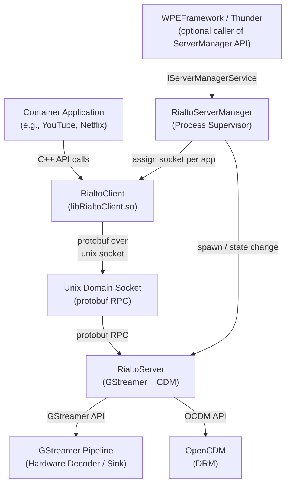
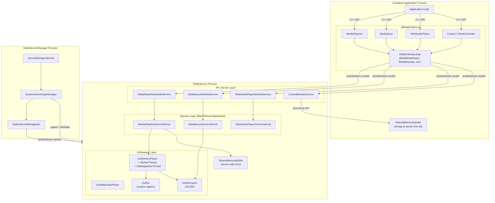
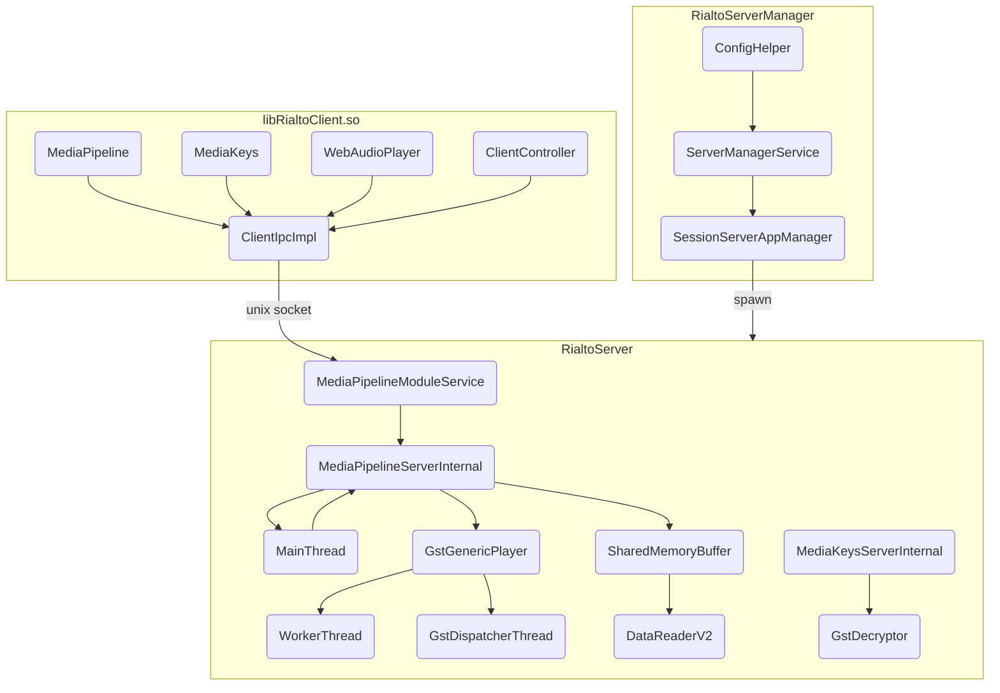
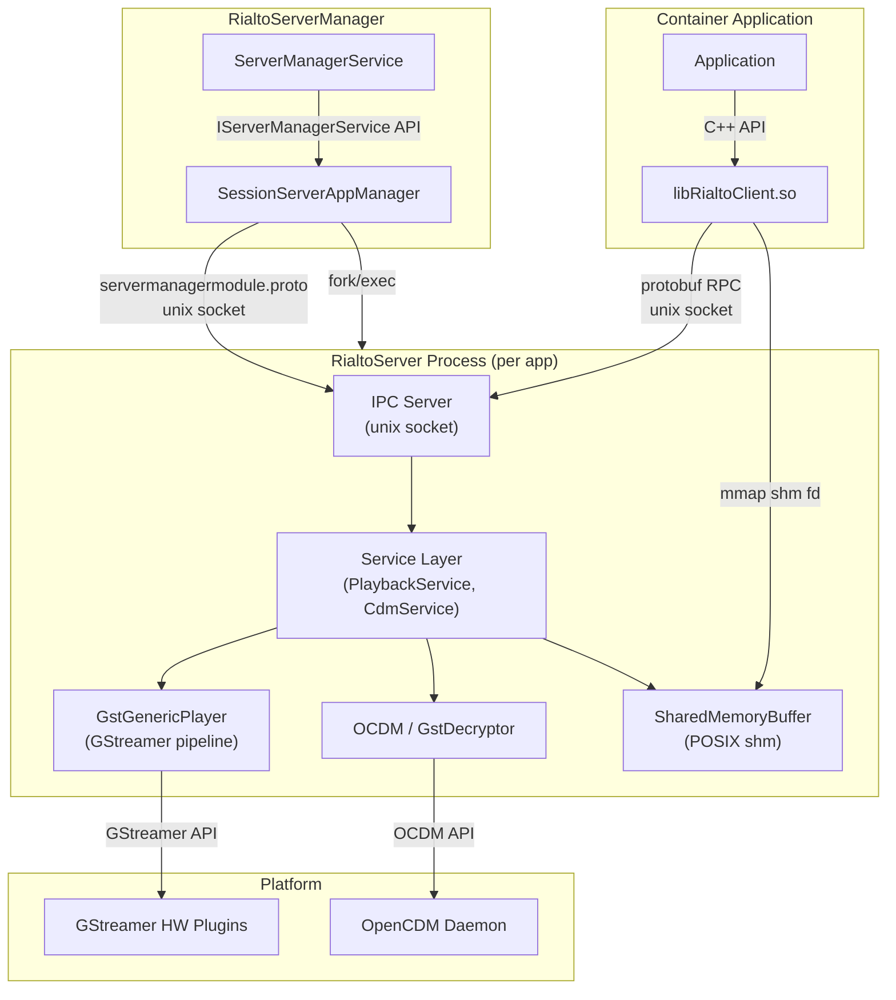
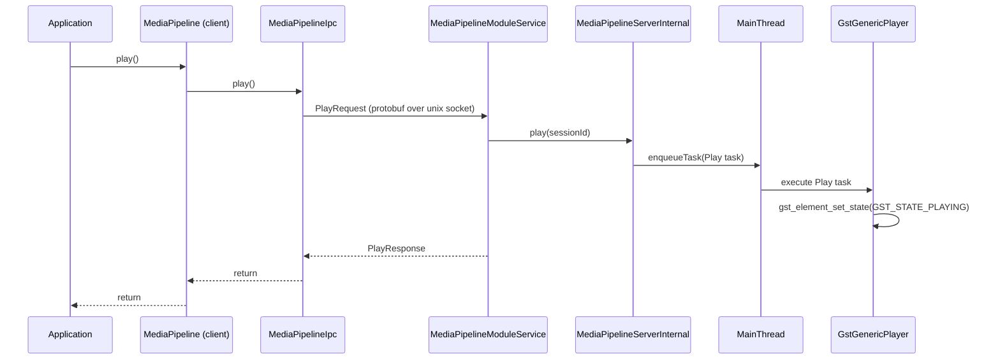
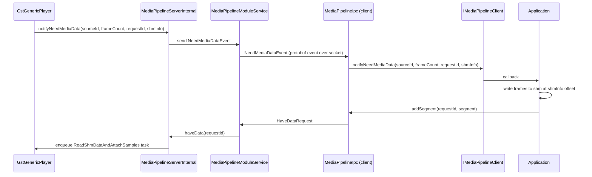
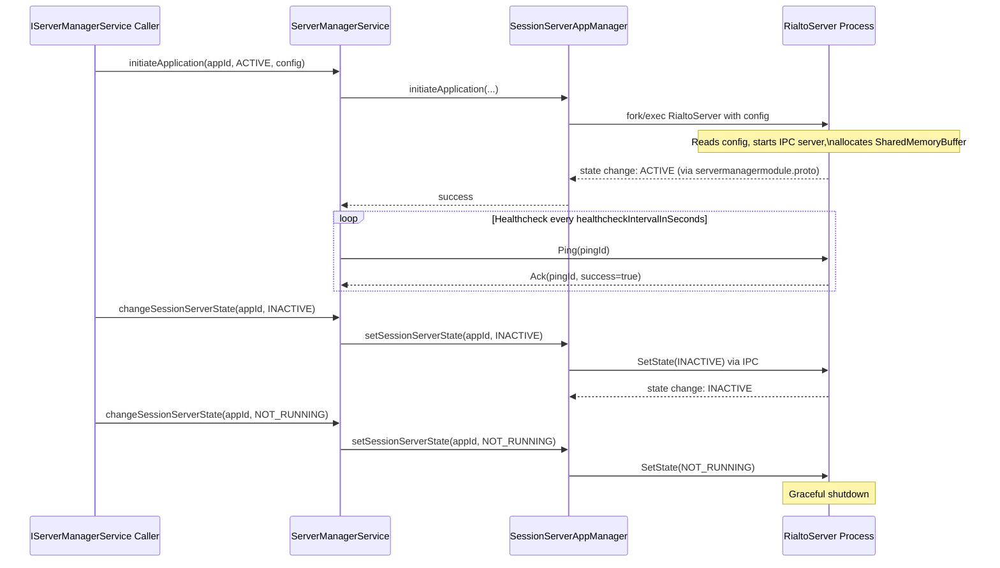
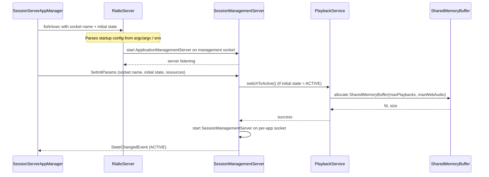
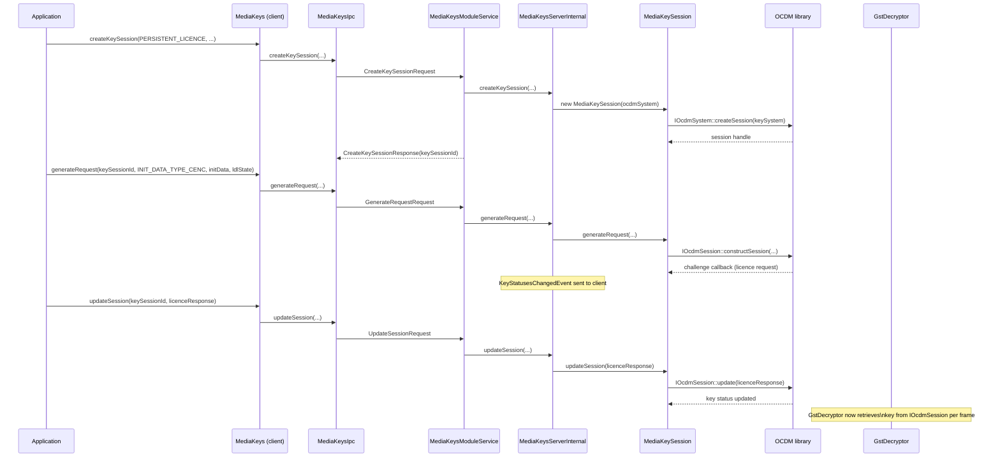

# Rialto

A C++ media playback framework that provides A/V pipeline management and DRM key session handling for application containers in a multi-process RDK-E environment.

---

## Overview

Rialto separates media playback capability from the container application process. A privileged server process (`RialtoServer`) owns GStreamer pipelines and CDM sessions, while client applications in sandboxed containers use a lightweight client library (`RialtoClient`) to control playback over a protobuf IPC channel. A supervisor process (`RialtoServerManager`) manages the lifecycle of server instances, allocating one per application container.

**Product / Device-Level Services:**
Rialto allows multiple sandboxed applications to perform A/V playback and DRM decryption on a shared hardware platform without each application requiring direct access to GStreamer or the OpenCDM stack.

**Module-Level Services:**

- A/V pipeline control: load, play, pause, seek, stop, source attachment (audio, video, subtitle, Dolby Vision)
- EME-compatible key session management for encrypted content
- Web Audio PCM mixing
- Shared memory transport for zero-copy media frame delivery
- Application state signalling (RUNNING / INACTIVE)



**Key Features & Responsibilities:**

- **A/V Media Pipeline**: `IMediaPipeline` controls creation, source attachment, play, pause, seek, stop, flush, and position reporting for MSE-based video/audio playback. Supports audio, video, Dolby Vision, and subtitle source types.
- **EME Key Management**: `IMediaKeys` implements W3C EME-compatible key session lifecycle (create, generate request, update, close, remove) against key systems registered via OCDM.
- **Web Audio Mixing**: `IWebAudioPlayer` accepts raw PCM (`audio/x-raw`) and mixes it into the current audio output with configurable priority.
- **Shared Memory Transport**: The server allocates a shared memory region, passes its file descriptor to the client via IPC, and both sides operate on named partitions. The client writes media frames; the server reads and feeds GStreamer.
- **Application Lifecycle**: `IControl` / `IServerManagerService` let callers transition server instances between INACTIVE and ACTIVE states, with heartbeat monitoring to detect and recover from failures.
- **GStreamer Abstraction**: All GStreamer API calls are wrapped behind `IGstWrapper` / `IGlibWrapper` interfaces, enabling mock injection for unit and component tests.

---

## Architecture

### High-Level Architecture

```
┌────────────────────────────────────────────────────────────────────────┐
│                      Container Application                             │
├────────────────────────────────────────────────────────────────────────┤
│                      RialtoClient Library                              │
│  ┌─────────────────┬──────────────────┬─────────────┬───────────────┐ │
│  │  MediaPipeline  │   MediaKeys      │WebAudioPlayer│   Control    │ │
│  └────────┬────────┴────────┬─────────┴──────┬──────┴───────┬───────┘ │
│           │      IPC Layer (RialtoClientIpcImpl)             │         │
│           │      MediaPipelineIpc / MediaKeysIpc / ...       │         │
└───────────┼──────────────────────────────────────────────────┼─────────┘
            │          Unix Domain Socket (protobuf)           │
┌───────────┼──────────────────────────────────────────────────┼─────────┐
│           │          RialtoServer Process                    │         │
│  ┌────────┴────────────────────────────────────────────────┐ │         │
│  │  IPC Server Layer (MediaPipelineModuleService,          │ │         │
│  │   MediaKeysModuleService, ControlModuleService, …)      │ │         │
│  ├─────────────────────────────────────────────────────────┤ │         │
│  │  Session Layer (MediaPipelineServerInternal,            │ │         │
│  │   MediaKeysServerInternal, WebAudioPlayerServerInternal)│ │         │
│  ├─────────────────────────────────────────────────────────┤ │         │
│  │  GStreamer Player Layer (GstGenericPlayer,              │ │         │
│  │   GstWebAudioPlayer, GstDecryptor, GstSrc)              │ │         │
│  ├─────────────────────────────────────────────────────────┤ │         │
│  │  Shared Memory Buffer (SharedMemoryBuffer)              │ │         │
│  └─────────────────────────────────────────────────────────┘ │         │
│                          GStreamer / OCDM / Hardware          │         │
└───────────────────────────────────────────────────────────────┘
                    RialtoServerManager (separate process)
                    ├── ServerManagerService
                    ├── SessionServerAppManager
                    └── IPC Controller (RialtoServerManagerIpc)
```

### Key Architectural Patterns

| Pattern   | Description                                                                                                                     | Where Applied                                                          |
| --------- | ------------------------------------------------------------------------------------------------------------------------------- | ---------------------------------------------------------------------- |
| Factory   | Each public interface has a corresponding factory class for object creation                                                     | `IMediaPipelineFactory`, `IGstGenericPlayerFactory`, `IControlFactory` |
| Singleton | `MainThread` (server) and `GstGenericPlayerFactory` are singletons                                                              | `MainThread`, `GstGenericPlayerFactory`                                |
| Command   | GStreamer operations are encapsulated as `IPlayerTask` objects queued on `WorkerThread`                                         | `tasks/generic/`, `tasks/webAudio/`, `WorkerThread`                    |
| Adapter   | `IGstWrapper`, `IGlibWrapper`, `IOcdm*` wrap third-party APIs behind interfaces for test injection                              | `wrappers/`                                                            |
| Observer  | `IMediaPipelineClient`, `IMediaKeysClient`, `IWebAudioPlayerClient` callbacks notify callers of state changes and data requests | Public client interfaces                                               |
| RAII      | Shared memory allocation, socket lifecycle, GStreamer element refs                                                              | `SharedMemoryBuffer`, IPC client/server, `GstGenericPlayer`            |

### Threading & Concurrency

- **Threading Architecture**: Multi-threaded; threads are separated by architectural layer.
- **Client-side IPC Thread**: One thread per IPC connection handles socket reads (`IpcClient`). The IPC library itself contains no internal threads; callers drive it via this external thread.
- **Server — `MainThread`**: A singleton task-dispatching thread. All session operations (`MediaPipelineServerInternal`, `MediaKeysServerInternal`, `WebAudioPlayerServerInternal`, `ControlServerInternal`) post tasks via `enqueueTask()` or `enqueueTaskAndWait()` and are serialised through this thread.
- **Server — `WorkerThread`**: One per `GstGenericPlayer` instance. Dequeues `IPlayerTask` objects (Play, Pause, AttachSamples, SetVolume, etc.) and executes them on a dedicated thread to avoid blocking the `MainThread`.
- **Server — `GstDispatcherThread`**: One per `GstGenericPlayer` instance. Polls the GStreamer message bus (`gst_bus_poll`) and dispatches bus messages (EOS, error, state-change) to `IGstDispatcherThreadClient`.
- **Synchronization**: `MainThread` uses a `std::deque` protected by `std::mutex` / `std::condition_variable`. `WorkerThread` uses the same pattern. `HeartbeatProcedure` uses `std::atomic_bool` for thread-safe acknowledgement tracking.
- **Async / Event Dispatch**: Notifications from server to client (playback state, need-media-data, QoS) are sent as protobuf event messages over the unix socket, received by the client IPC thread, and dispatched to `IMediaPipelineClient` callbacks on that IPC thread.

---

## Design

### Design Principles

Rialto is designed around strict process isolation: the GStreamer pipeline and CDM sessions run in a single privileged server process, while client applications in sandboxed containers interact with them only through a narrow C++ API and a protobuf IPC channel. This separation prevents any one container from affecting the media stack of another. The public C++ interface (`IMediaPipeline`, `IMediaKeys`, etc.) is identical whether used client-side or server-side, enabling the same test suites to exercise both implementations. All platform-specific dependencies (GStreamer, OCDM, WPEFramework COM) are hidden behind wrapper interfaces, which are replaced with mock objects in unit and component tests. Shared memory is used for the high-bandwidth media frame path to avoid serialising raw frame data through the IPC channel, while all control messages are protobuf RPCs.

### Northbound & Southbound Interactions

**Northbound**: Applications include `libRialtoClient.so` and call the factory methods in `IMediaPipelineFactory`, `IMediaKeysFactory`, `IWebAudioPlayerFactory`, and `IControlFactory` (declared in `media/public/include/`) to obtain interface objects. All northbound calls are C++ virtual dispatch; there is no JSON-RPC or COM-RPC layer on the northbound side of `RialtoClient`.

**Southbound (Client → Server)**: `RialtoClient` serialises each API call to a protobuf `Request` message and sends it over a per-application Unix domain socket. The server replies with a protobuf `Response`. Server-to-client event messages (state notifications, need-media-data requests) flow back asynchronously over the same socket.

**Southbound (Server → Platform)**: `RialtoServer` calls GStreamer via `IGstWrapper` / `IGlibWrapper` (production) or mock wrappers (tests). DRM operations go through `IOcdm` / `IOcdmSystem` / `IOcdmSession` wrappers backed by the OpenCDM library. Text track access uses `ITextTrackAccessor` backed by the WPEFramework `ITextTrack` interface when `RIALTO_ENABLE_TEXT_TRACK` is defined.

### IPC Mechanisms

**Intra-process (client ↔ server)**: Custom protobuf RPC over Unix domain sockets, implemented in the `ipc/` library (`RialtoIpcClient`, `RialtoIpcServer`, `RialtoIpcCommon`). The library adds Unix file-descriptor passing (used for shared memory `fd` delivery) and asynchronous event support on top of standard protobuf service stubs. gRPC was not used because it lacks client identity (PID/UID), file-descriptor passing, and asynchronous event primitives (see `ipc/README.md`).

**Manager → Server**: `RialtoServerManager` spawns the `RialtoServer` binary and communicates with it over a separate Unix socket (`RialtoServerManagerIpc`) using the `servermanagermodule.proto` protocol to set state (INACTIVE / ACTIVE) and send health-check pings.

**No IARM bus, D-Bus, or WPEFramework COM-RPC**: The source code contains no `IARM_Bus_*` calls. Rialto does not implement a WPEFramework plugin. `WPEFramework` headers appear only in the `wrappers/` layer for the `ITextTrack` optional integration and the `ThunderWrapper`.

### Data Persistence & Storage

Configuration for `RialtoServerManager` is read from `rialto-config.json` at startup (path resolved at build time via CMake). When `RIALTO_ENABLE_CONFIG_FILE` is set, `ConfigReader` additionally processes an override file at `RIALTO_CONFIG_OVERRIDES_FILE_DIR/rialto-config-overrides.json` (debug builds only). Media pipeline state, key session state, and playback parameters are not persisted across reboots; all state is in-memory and bound to the lifetime of the server process.

### Component Diagram



---

## Internal Modules

| Module / Class                          | Description                                                                                                                                                        | Key Files                                                                                       |
| --------------------------------------- | ------------------------------------------------------------------------------------------------------------------------------------------------------------------ | ----------------------------------------------------------------------------------------------- |
| `IMediaPipeline`                        | Public A/V pipeline interface. Defines `load`, `attachSource`, `play`, `pause`, `stop`, `seek`, `setVolume`, `addSegment`, `flush`, and related methods.           | `media/public/include/IMediaPipeline.h`                                                         |
| `MediaPipeline` (client)                | Client-side implementation. Serialises calls to `IMediaPipelineIpc`; receives playback events via `IMediaPipelineIpcClient` callbacks.                             | `media/client/main/source/MediaPipeline.cpp`                                                    |
| `MediaPipelineIpc`                      | Client IPC proxy for `IMediaPipeline`. Builds protobuf requests, sends over unix socket, unwraps responses, and dispatches server-sent events.                     | `media/client/ipc/source/MediaPipelineIpc.cpp`                                                  |
| `MediaPipelineServerInternal`           | Server-side A/V session. Owns one `GstGenericPlayer`. Posts all operations to `MainThread`. Reads media frames from `SharedMemoryBuffer` via `DataReaderV2`.       | `media/server/main/source/MediaPipelineServerInternal.cpp`                                      |
| `MediaPipelineModuleService`            | Receives protobuf RPC calls from a connected client and forwards them to `IPlaybackService` / `MediaPipelineServerInternal`.                                       | `media/server/ipc/source/MediaPipelineModuleService.cpp`                                        |
| `GstGenericPlayer`                      | Drives the GStreamer pipeline. Enqueues `IPlayerTask` objects on `WorkerThread`. Receives GStreamer bus events from `GstDispatcherThread`.                         | `media/server/gstplayer/source/GstGenericPlayer.cpp`                                            |
| `WorkerThread`                          | Owns a `std::thread` and a task queue. Dequeues and executes `IPlayerTask` objects sequentially.                                                                   | `media/server/gstplayer/include/WorkerThread.h`                                                 |
| `GstDispatcherThread`                   | Polls the GStreamer bus in a dedicated thread and dispatches EOS, error, and state-change messages to `IGstDispatcherThreadClient`.                                | `media/server/gstplayer/source/GstDispatcherThread.cpp`                                         |
| `GstSrc`                                | Custom GStreamer `appsrc`-based element that feeds demuxed media frames from shared memory into the pipeline.                                                      | `media/server/gstplayer/source/GstSrc.cpp`                                                      |
| `GstDecryptor`                          | Custom GStreamer element that decrypts encrypted frames using the OCDM API before they reach the hardware decoder.                                                 | `media/server/gstplayer/source/GstDecryptor.cpp`                                                |
| `SharedMemoryBuffer`                    | Allocates a POSIX shared memory region partitioned for each active playback session (audio, video, subtitle sub-buffers).                                          | `media/server/main/source/SharedMemoryBuffer.cpp`                                               |
| `DataReaderV2`                          | Reads `MediaSegment` objects written by the client into shared memory partitions.                                                                                  | `media/server/main/source/DataReaderV2.cpp`                                                     |
| `MainThread`                            | Singleton task dispatcher for the server. Clients register an ID, enqueue tasks with `enqueueTask` / `enqueueTaskAndWait`, and the thread processes them in order. | `media/server/main/source/MainThread.cpp`                                                       |
| `IMediaKeys` / `MediaKeys`              | Public and client-side EME key session interface and implementation.                                                                                               | `media/public/include/IMediaKeys.h`, `media/client/main/source/MediaKeys.cpp`                   |
| `MediaKeysServerInternal`               | Server-side CDM session manager. Creates `MediaKeySession` objects; routes CDM operations to the OCDM layer.                                                       | `media/server/main/source/MediaKeysServerInternal.cpp`                                          |
| `IWebAudioPlayer` / `GstWebAudioPlayer` | Public interface and server-side GStreamer implementation for PCM audio mixing.                                                                                    | `media/public/include/IWebAudioPlayer.h`, `media/server/gstplayer/source/GstWebAudioPlayer.cpp` |
| `ClientController`                      | Client-side singleton managing the IPC connection and shared memory handle. Other client objects (`MediaPipeline`, etc.) register with it.                         | `media/client/main/source/ClientController.cpp`                                                 |
| `IpcClient` / `IpcServer`               | General-purpose protobuf-over-unix-socket transport. No internal threads; driven by the caller's event loop.                                                       | `ipc/client/`, `ipc/server/`                                                                    |
| `ServerManagerService`                  | Implements `IServerManagerService`. Delegates to `SessionServerAppManager` for process lifecycle and `IServiceContext` for IPC.                                    | `serverManager/service/source/ServerManagerService.cpp`                                         |
| `SessionServerAppManager`               | Spawns `RialtoServer` child processes, tracks their state, sends ping events, and calls `restartServer` after `numOfPingsBeforeRecovery` failures.                 | `serverManager/common/`                                                                         |
| `ConfigHelper`                          | Reads `rialto-config.json` (and optional overrides file) to supply startup parameters to `ServiceContext`.                                                         | `serverManager/service/source/ConfigHelper.cpp`                                                 |
| `RialtoWrappers`                        | Wrapper library providing `IGstWrapper`, `IGlibWrapper`, `IOcdm*`, `ILinuxWrapper`, and optional `ITextTrackPluginWrapper`.                                        | `wrappers/`                                                                                     |
| `RialtoLogging` / `RialtoEthanLog`      | Logging library. Supports FATAL, ERROR, WARNING, MILESTONE, INFO, DEBUG levels per component. Optional EthanLog backend selected at build time.                    | `logging/source/RialtoLogging.cpp`                                                              |



---

## Prerequisites & Dependencies

### RDK-E Platform Requirements

- **Build System**: CMake ≥ 3.10
- **C++ Standard**: C++17
- **GStreamer**: `gstreamer-app-1.0`, `gstreamer-pbutils-1.0`, `gstreamer-audio-1.0` (via `pkg-config`). Required for `RialtoServerGstPlayer` and `RialtoWrappers`.
- **Protobuf**: Minimum version 3.6. Required by both IPC library and generated proto stubs.
- **OpenCDM (ocdm)**: Required for `RialtoWrappers` (DRM decryption). Found via CMake `find_package(ocdm)`.
- **WPEFramework Core / COM**: `WPEFrameworkCore`, `WPEFrameworkCOM`. Required for `RialtoWrappers`. Found via `find_package`.
- **pthreads**: Found via CMake `find_package(Threads)`.
- **EthanLog** (optional): If found and `RIALTO_ENABLE_ETHAN_LOG` is set, `RialtoEthanLog` links against it; otherwise `RialtoEthanLog` is an alias for `RialtoLogging`.
- **jsoncpp** (optional): Required when `RIALTO_ENABLE_CONFIG_FILE=ON`. Used by `ConfigReader` to parse `rialto-config.json`.
- **WPEFramework `ITextTrack`** (optional): If `WPEFramework/interfaces/ITextTrack.h` is found, `RIALTO_ENABLE_TEXT_TRACK` is defined and subtitle/text track support is compiled in.
- **IARM Bus**: Not used. No `IARM_Bus_*` calls exist in the source.

### Build Dependencies

| Dependency        | Minimum Version | Purpose                                                          |
| ----------------- | --------------- | ---------------------------------------------------------------- |
| CMake             | 3.10            | Build system                                                     |
| GCC / Clang       | C++17 support   | Compiler                                                         |
| GStreamer         | 1.0             | A/V pipeline (gstreamer-app, gstreamer-pbutils, gstreamer-audio) |
| protobuf + protoc | 3.6             | IPC serialisation and RPC stub generation                        |
| OpenCDM (ocdm)    | —               | DRM key session and decryption                                   |
| WPEFrameworkCore  | —               | WPEFramework core types (wrappers layer)                         |
| WPEFrameworkCOM   | —               | WPEFramework COM interface (wrappers layer)                      |
| pthreads          | —               | Thread support                                                   |
| jsoncpp           | —               | Config file parsing (optional, `RIALTO_ENABLE_CONFIG_FILE`)      |
| EthanLog          | —               | Log backend (optional, `RIALTO_ENABLE_ETHAN_LOG`)                |
| GoogleTest        | —               | Unit and component test framework                                |

### Runtime Dependencies

| Dependency             | Notes                                                                           |
| ---------------------- | ------------------------------------------------------------------------------- |
| GStreamer plugins      | Hardware decoder and sink plugins must be present for the target platform.      |
| OpenCDM daemon         | Must be reachable for DRM session operations.                                   |
| `RialtoServer` binary  | Default path `/usr/bin/RialtoServer`. Spawned by `RialtoServerManager` per app. |
| Unix domain socket dir | `XDG_RUNTIME_DIR` (default `/tmp`) must be writable for socket creation.        |

---

## Build & Installation

```bash
# Clone the repository
git clone https://github.com/rdkcentral/rialto.git
cd rialto

# Configure — Release build with server and server manager enabled
mkdir build && cd build
cmake -DCMAKE_BUILD_TYPE=Release \
      -DENABLE_SERVER=ON \
      -DENABLE_SERVER_MANAGER=ON \
      ../

# Build
make -j$(nproc)

# Install
sudo make install
```

For native (non-Yocto) builds, pass `-DNATIVE_BUILD=ON`. This activates stub libraries for `opencdm`, `wpeframework-core`, and `wpeframework-com` located in `stubs/`, and sets the GStreamer cache to `/tmp/rialto-server-gstreamer-cache.bin`.

```bash
# Native build example
cmake -DNATIVE_BUILD=ON \
      -DRIALTO_BUILD_TYPE=Debug \
      ../
```

### CMake Configuration Options

| Option                         | Values              | Default                                                                 | Description                                                                  |
| ------------------------------ | ------------------- | ----------------------------------------------------------------------- | ---------------------------------------------------------------------------- |
| `CMAKE_BUILD_TYPE`             | `Debug` / `Release` | `Release`                                                               | Compiler optimisation level.                                                 |
| `RIALTO_BUILD_TYPE`            | `Debug` / (unset)   | (unset, treated as Release)                                             | Controls whether `INFO` and `DEBUG` log levels are compiled in.              |
| `ENABLE_SERVER`                | `ON` / `OFF`        | `ON`                                                                    | Build `RialtoServer` targets.                                                |
| `ENABLE_SERVER_MANAGER`        | `ON` / `OFF`        | `ON`                                                                    | Build `RialtoServerManager` targets.                                         |
| `NATIVE_BUILD`                 | `ON` / `OFF`        | `OFF`                                                                   | Use stub dependencies for local / CI builds without real platform libraries. |
| `RIALTO_ENABLE_CONFIG_FILE`    | `ON` / `OFF`        | `OFF`                                                                   | Enable reading `rialto-config.json`; requires jsoncpp.                       |
| `RIALTO_ENABLE_ETHAN_LOG`      | `ON` / `OFF`        | `OFF`                                                                   | Route log output through the EthanLog backend.                               |
| `COVERAGE_ENABLED`             | `ON` / `OFF`        | `OFF`                                                                   | Add `--coverage -fprofile-update=atomic` for gcov coverage.                  |
| `PROTOC_PATH`                  | path string         | (empty, uses system protoc)                                             | Override path to the `protoc` host compiler.                                 |
| `SESSION_SERVER_PATH`          | path string         | `"/usr/bin/RialtoServer"`                                               | Path to the `RialtoServer` binary spawned by the manager.                    |
| `ENVIRONMENT_VARIABLES`        | JSON array          | `XDG_RUNTIME_DIR=/tmp`, `GST_REGISTRY=…`, `WESTEROS_SINK_USE_ESSRMGR=1` | Environment variables injected into spawned server processes.                |
| `STARTUP_TIMEOUT_MS`           | int                 | `0` (no timeout)                                                        | Milliseconds to wait for a server process to reach its initial state.        |
| `HEALTHCHECK_INTERVAL_S`       | int                 | `5`                                                                     | Seconds between health-check ping events.                                    |
| `SOCKET_PERMISSIONS`           | octal int           | `666`                                                                   | Unix socket file permissions.                                                |
| `NUM_OF_PRELOADED_SERVERS`     | int                 | `0`                                                                     | Number of `RialtoServer` instances pre-spawned at manager startup.           |
| `NUM_OF_PINGS_BEFORE_RECOVERY` | int                 | `3`                                                                     | Failed pings before the manager restarts a server.                           |
| `LOG_LEVEL`                    | int (bitmask)       | `3` (FATAL \| ERROR)                                                    | Default log level bitmask written into `rialto-config.json`.                 |
| `RIALTO_LOG_FATAL_ENABLED`     | `ON` / `OFF`        | `ON`                                                                    | Compile FATAL log statements.                                                |
| `RIALTO_LOG_ERROR_ENABLED`     | `ON` / `OFF`        | `ON`                                                                    | Compile ERROR log statements.                                                |
| `RIALTO_LOG_WARN_ENABLED`      | `ON` / `OFF`        | `ON`                                                                    | Compile WARNING log statements.                                              |
| `RIALTO_LOG_MIL_ENABLED`       | `ON` / `OFF`        | `ON`                                                                    | Compile MILESTONE log statements.                                            |
| `RIALTO_LOG_INFO_ENABLED`      | `ON` / `OFF`        | `OFF` (Release) / `ON` (Debug)                                          | Compile INFO log statements.                                                 |
| `RIALTO_LOG_DEBUG_ENABLED`     | `ON` / `OFF`        | `OFF` (Release) / `ON` (Debug)                                          | Compile DEBUG log statements.                                                |

### Running Unit Tests

```bash
# From the repository root
./build_ut.py --suite all

# Individual suites: servermain, servergstplayer, serveripc, serverservice,
# client, clientipc, playercommon, common, logging, manager, ipc
./build_ut.py --suite client
```

### Running Component Tests

```bash
./build_ct.py --suite all
# Suites: client, server
```

---

## Quick Start

### 1. Include

```cpp
#include "IMediaPipeline.h"
#include "IMediaPipelineClient.h"
#include "IControl.h"
#include "IControlClient.h"
```

### 2. Register with Rialto Control (initialise shared memory)

```cpp
class MyControlClient : public firebolt::rialto::IControlClient {
public:
    void notifyApplicationState(firebolt::rialto::ApplicationState state) override { /* handle */ }
};

auto controlFactory = firebolt::rialto::IControlFactory::createFactory();
auto control = controlFactory->createControl();

auto controlClient = std::make_shared<MyControlClient>();
firebolt::rialto::ApplicationState appState;
control->registerClient(controlClient, appState);
```

### 3. Create a Media Pipeline

```cpp
class MyPipelineClient : public firebolt::rialto::IMediaPipelineClient {
public:
    void notifyPlaybackState(firebolt::rialto::PlaybackState state) override { /* handle */ }
    void notifyNeedMediaData(int32_t sourceId, size_t frameCount, uint32_t requestId,
                             const std::shared_ptr<firebolt::rialto::MediaPlayerShmInfo> &shmInfo) override { /* write to shm */ }
    // ... implement all pure virtual methods
};

firebolt::rialto::VideoRequirements videoReq{1920, 1080};
auto pipelineFactory = firebolt::rialto::IMediaPipelineFactory::createFactory();
auto client = std::make_shared<MyPipelineClient>();
auto pipeline = pipelineFactory->createMediaPipeline(client, videoReq);

pipeline->load(firebolt::rialto::MediaType::MSE, "video/mp4", "");

auto audioSrc = std::make_unique<firebolt::rialto::IMediaPipeline::MediaSourceAudio>("audio/x-eac3");
pipeline->attachSource(*audioSrc);

auto videoSrc = std::make_unique<firebolt::rialto::IMediaPipeline::MediaSourceVideo>("video/x-h264", true, 1920, 1080);
pipeline->attachSource(*videoSrc);
```

### 4. Play / Pause / Stop

```cpp
pipeline->play();
pipeline->pause();
pipeline->stop();
```

### 5. Cleanup

```cpp
pipeline.reset();   // destructor tears down IPC and server session
control.reset();
```

---

## Configuration

### Configuration Priority

1. Built-in CMake defaults (`SESSION_SERVER_PATH`, `STARTUP_TIMEOUT_MS`, etc.)
2. `rialto-config.json` (read at `ServerManagerService` startup when `RIALTO_ENABLE_CONFIG_FILE=ON`)
3. Debug override file at `RIALTO_CONFIG_OVERRIDES_FILE_DIR/rialto-config-overrides.json` (debug builds only)

### Configuration Parameters (`rialto-config.json`)

| Parameter                      | Type   | CMake Default                                                                                                | Description                                                                           |
| ------------------------------ | ------ | ------------------------------------------------------------------------------------------------------------ | ------------------------------------------------------------------------------------- |
| `environmentVariables`         | array  | `XDG_RUNTIME_DIR=/tmp`, `GST_REGISTRY=/tmp/rialto-server-gstreamer-cache.bin`, `WESTEROS_SINK_USE_ESSRMGR=1` | Environment variables set for every spawned `RialtoServer` process.                   |
| `extraEnvVariables`            | array  | (empty)                                                                                                      | Additional env vars merged with `environmentVariables`.                               |
| `sessionServerPath`            | string | `/usr/bin/RialtoServer`                                                                                      | Absolute path to the `RialtoServer` executable.                                       |
| `startupTimeoutMs`             | int    | `0`                                                                                                          | Timeout in milliseconds for a server to complete startup. `0` = no timeout.           |
| `healthcheckIntervalInSeconds` | int    | `5`                                                                                                          | Interval between heartbeat pings sent to each server process.                         |
| `socketPermissions`            | int    | `666`                                                                                                        | File permission bits for the Unix domain socket created per application.              |
| `socketOwner`                  | string | `""` (no chown)                                                                                              | User name for socket ownership.                                                       |
| `socketGroup`                  | string | `""` (no chown)                                                                                              | Group name for socket ownership.                                                      |
| `numOfPreloadedServers`        | int    | `0`                                                                                                          | Number of server instances spawned at manager startup before any application request. |
| `logLevel`                     | int    | `3`                                                                                                          | Initial log level bitmask applied to all Rialto components.                           |
| `numOfPingsBeforeRecovery`     | int    | `3`                                                                                                          | Number of consecutive failed pings before the manager restarts a server.              |

### Configuration Persistence

Configuration is read from `rialto-config.json` at `RialtoServerManager` startup and is not written back at runtime. Media pipeline state and key session state are not persisted across reboots.

---

## API / Usage

### Interface Type

C++ virtual interface (direct in-process calls) on the client side. Internally, `RialtoClient` serialises each call to protobuf over a Unix domain socket directed at `RialtoServer`. There is no JSON-RPC or COM-RPC interface exposed by Rialto itself to external callers.

### Public Interfaces

All public headers are under `media/public/include/`. Each interface is obtained via its factory.

#### `IMediaPipeline`

Controls a single A/V playback session.

**Factory**: `IMediaPipelineFactory::createFactory()->createMediaPipeline(client, videoRequirements)`

| Method                                                                        | Description                                                                               |
| ----------------------------------------------------------------------------- | ----------------------------------------------------------------------------------------- |
| `load(type, mimeType, url)`                                                   | Loads the media pipeline for the specified `MediaType` (only `MSE` is defined in source). |
| `attachSource(mediaSource)`                                                   | Attaches an audio, video, Dolby Vision, or subtitle source. Returns a source id.          |
| `removeSource(sourceId)`                                                      | Removes a previously attached source.                                                     |
| `allSourcesAttached()`                                                        | Signals that all sources have been attached and pipeline setup can proceed.               |
| `play()`                                                                      | Starts or resumes playback.                                                               |
| `pause()`                                                                     | Pauses playback.                                                                          |
| `stop()`                                                                      | Stops playback and releases the GStreamer pipeline.                                       |
| `seek(seekPosition)`                                                          | Seeks to an absolute position in nanoseconds.                                             |
| `flush(sourceId, resetTime)`                                                  | Flushes the specified source's buffer.                                                    |
| `setSourcePosition(sourceId, position, resetTime, appliedRate, stopPosition)` | Sets the playback position for a source after a seek.                                     |
| `addSegment(requestId, segment)`                                              | Writes a `MediaSegment` (from shared memory) into the pipeline.                           |
| `getPosition(position)`                                                       | Returns the current playback position in nanoseconds.                                     |
| `setPlaybackRate(rate)`                                                       | Sets the playback rate (e.g., `1.0` normal, `2.0` fast-forward).                          |
| `setVideoWindow(x, y, width, height)`                                         | Sets the render window geometry.                                                          |
| `setVolume(volume, volumeDuration, easeType)`                                 | Sets volume with optional fade.                                                           |
| `getVolume(volume)`                                                           | Gets the current volume.                                                                  |
| `setMute(sourceId, mute)`                                                     | Mutes or unmutes the specified source.                                                    |
| `getMute(sourceId, mute)`                                                     | Gets the mute state of the specified source.                                              |
| `setLowLatency(lowLatency)`                                                   | Enables or disables low-latency mode.                                                     |
| `setSync(sync)`                                                               | Sets the synchronisation mode.                                                            |
| `setImmediateOutput(sourceId, immediateOutput)`                               | Enables immediate output mode on a source.                                                |
| `renderFrame()`                                                               | Requests a single video frame render (step).                                              |
| `setTextTrackIdentifier(identifier)`                                          | Sets the text track identifier (when text track support is compiled in).                  |
| `setSubtitleOffset(offset)`                                                   | Sets the subtitle time offset.                                                            |

**Client Callbacks (`IMediaPipelineClient`):**

| Callback                                                        | Trigger                                                                                                                       |
| --------------------------------------------------------------- | ----------------------------------------------------------------------------------------------------------------------------- |
| `notifyDuration(duration)`                                      | Server reports total media duration in nanoseconds (`kDurationUnknown` or `kDurationUnending` for live).                      |
| `notifyPosition(position)`                                      | Current playback position in nanoseconds. Called approximately every 250 ms during playback.                                  |
| `notifyNativeSize(w, h, aspect)`                                | Native video dimensions and pixel aspect ratio.                                                                               |
| `notifyNetworkState(state)`                                     | Network state changes (`IDLE`, `BUFFERING`, `BUFFERED`, `STALLED`, `FORMAT_ERROR`, etc.).                                     |
| `notifyPlaybackState(state)`                                    | Playback state changes (`IDLE`, `PLAYING`, `PAUSED`, `SEEKING`, `SEEK_DONE`, `STOPPED`, `END_OF_STREAM`, `FAILURE`).          |
| `notifyVideoData(hasData)`                                      | Video data availability changed.                                                                                              |
| `notifyAudioData(hasData)`                                      | Audio data availability changed.                                                                                              |
| `notifyNeedMediaData(sourceId, frameCount, requestId, shmInfo)` | Server requests media data. Client writes frames to the shared memory region described by `shmInfo`, then calls `addSegment`. |
| `notifyCancelNeedMediaData(sourceId)`                           | Server cancels a pending data request.                                                                                        |
| `notifyQos(sourceId, qosInfo)`                                  | A buffer dropped a video frame or audio sample.                                                                               |
| `notifyBufferUnderflow(sourceId)`                               | Buffer underflow on the specified source.                                                                                     |
| `notifyPlaybackError(sourceId, error)`                          | Non-fatal playback error; `PlaybackState` does not change.                                                                    |
| `notifySourceFlushed(sourceId)`                                 | A flush operation has completed.                                                                                              |
| `notifyPlaybackInfo(playbackInfo)`                              | Periodic playback info notification (every ~32 ms after entering PLAYING state).                                              |

---

#### `IMediaKeys`

Manages EME key sessions for encrypted content.

**Factory**: `IMediaKeysFactory::createFactory()->createMediaKeys(keySystem)`

| Method                                                            | Description                                               |
| ----------------------------------------------------------------- | --------------------------------------------------------- |
| `createKeySession(sessionType, client, keySessionId)`             | Creates a new key session. Returns `MediaKeyErrorStatus`. |
| `generateRequest(keySessionId, initDataType, initData, ldlState)` | Generates a licence request.                              |
| `loadSession(keySessionId)`                                       | Loads a persisted session.                                |
| `updateSession(keySessionId, responseData)`                       | Updates the session with a licence response.              |
| `closeKeySession(keySessionId)`                                   | Closes a key session.                                     |
| `removeKeySession(keySessionId)`                                  | Removes a key session.                                    |
| `containsKey(keySessionId, keyId)`                                | Returns true if the key is present.                       |
| `selectKeyId(keySessionId, keyId)`                                | Selects a key id (Netflix-specific).                      |
| `setDrmHeader(keySessionId, requestData)`                         | Sets a DRM header.                                        |
| `deleteDrmStore()`                                                | Deletes the DRM store.                                    |
| `deleteKeyStore()`                                                | Deletes the key store.                                    |
| `getDrmStoreHash(drmStoreHash)`                                   | Returns the hash of the DRM store.                        |
| `getKeyStoreHash(keyStoreHash)`                                   | Returns the hash of the key store.                        |
| `getLdlSessionsLimit(ldlLimit)`                                   | Returns the Limited Duration Licence session limit.       |
| `getLastDrmError(keySessionId, errorCode)`                        | Returns the last DRM error code.                          |
| `getDrmTime(drmTime)`                                             | Returns the current DRM system time.                      |
| `getCdmKeySessionId(keySessionId, cdmKeySessionId)`               | Returns the CDM-internal session ID string.               |
| `releaseKeySession(keySessionId)`                                 | Releases a key session.                                   |
| `getMetricSystemData(buffer)`                                     | Returns DRM metric data.                                  |

---

#### `IMediaKeysCapabilities`

Query supported DRM key systems.

**Factory**: `IMediaKeysCapabilitiesFactory::createFactory()->getMediaKeysCapabilities()`

| Method                                             | Description                                        |
| -------------------------------------------------- | -------------------------------------------------- |
| `getSupportedKeySystems()`                         | Returns list of supported key system strings.      |
| `supportsKeySystem(keySystem)`                     | Returns true if the key system is supported.       |
| `getSupportedKeySystemVersion(keySystem, version)` | Returns the version string for a key system.       |
| `isServerCertificateSupported(keySystem)`          | Returns true if server certificates are supported. |

---

#### `IWebAudioPlayer`

Mixes raw PCM audio (`audio/x-raw`) into the current audio output.

**Factory**: `IWebAudioPlayerFactory::createFactory()->createWebAudioPlayer(client, audioMimeType, priority, config)`

| Method                                                               | Description                                       |
| -------------------------------------------------------------------- | ------------------------------------------------- |
| `play()`                                                             | Starts playback.                                  |
| `pause()`                                                            | Pauses playback.                                  |
| `setEos()`                                                           | Signals end of stream.                            |
| `getBufferAvailable(availableFrames, shmInfo)`                       | Returns the number of frames that can be written. |
| `writeBuffer(numberOfFrames, data)`                                  | Writes PCM frames into the buffer.                |
| `getDeviceInfo(preferredFrames, maximumFrames, supportedSampleRate)` | Returns device audio capability info.             |
| `setVolume(volume)`                                                  | Sets volume level.                                |
| `getVolume(volume)`                                                  | Gets current volume.                              |

---

#### `IControl`

Registers a client to receive application state notifications and initialises shared memory.

**Factory**: `IControlFactory::createFactory()->createControl()`

| Method                             | Description                                                                               |
| ---------------------------------- | ----------------------------------------------------------------------------------------- |
| `registerClient(client, appState)` | Registers `IControlClient`; returns current `ApplicationState` (`RUNNING` or `INACTIVE`). |

**`IControlClient` Callback:**

| Callback                        | Trigger                                              |
| ------------------------------- | ---------------------------------------------------- |
| `notifyApplicationState(state)` | Server transitions between `RUNNING` and `INACTIVE`. |

---

#### `IServerManagerService`

External API for `RialtoServerManager`. Callers (e.g., a Thunder plugin) use this to manage server process lifecycles.

**Factory**: `ServerManagerServiceFactory` (in `serverManager/public/include/`)

| Method                                         | Description                                                                                   |
| ---------------------------------------------- | --------------------------------------------------------------------------------------------- |
| `initiateApplication(appId, state, appConfig)` | Spawns a new `RialtoServer` instance for `appId` in the requested state (ACTIVE or INACTIVE). |
| `changeSessionServerState(appId, state)`       | Transitions an existing server to a new state (ACTIVE, INACTIVE, NOT_RUNNING).                |
| `getAppConnectionInfo(appId)`                  | Returns the unix socket name used for client ↔ server communication for this application.     |
| `setLogLevels(logLevels)`                      | Requests all server instances to update their log levels.                                     |
| `registerLogHandler(handler)`                  | Registers a callback to receive forwarded log messages from server processes.                 |

---

## Component Interactions



### Interaction Matrix

| Target Component / Layer    | Interaction Purpose                                                   | Key APIs / Interface                                                                                      |
| --------------------------- | --------------------------------------------------------------------- | --------------------------------------------------------------------------------------------------------- |
| `RialtoServer` (IPC server) | Client sends playback and CDM control RPCs                            | `mediapipelinemodule.proto`, `mediakeysmodule.proto`, `webaudioplayermodule.proto`, `controlmodule.proto` |
| `RialtoServerManager` (IPC) | Manager sends lifecycle state changes and health pings to server      | `servermanagermodule.proto`                                                                               |
| GStreamer                   | Server drives A/V pipeline, attaches appsrc/decryptor elements        | `IGstWrapper`, `IGlibWrapper` (production); mock wrappers (tests)                                         |
| OpenCDM                     | CDM key session create/update/close; frame decryption in GstDecryptor | `IOcdm`, `IOcdmSystem`, `IOcdmSession`                                                                    |
| POSIX shared memory         | Zero-copy media frame transfer from client to server                  | `SharedMemoryBuffer::getFd()`, `mmap`, `DataReaderV2::readData()`                                         |
| WPEFramework `ITextTrack`   | Optional subtitle rendering (compiled in when header found)           | `ITextTrackAccessor`, `TextTrackPluginWrapper` (conditional)                                              |

### IPC Flow — Media Pipeline Request



### IPC Flow — Need Media Data



### Events Published (Server → Client)

| Event            | Proto Message              | Trigger Condition                                   |
| ---------------- | -------------------------- | --------------------------------------------------- |
| Playback state   | `PlaybackStateChangeEvent` | GStreamer state-change bus message processed        |
| Network state    | `NetworkStateChangeEvent`  | Error or buffer state change detected               |
| Need media data  | `NeedMediaDataEvent`       | `GstSrc` requests frames from its appsrc            |
| Cancel need data | `CancelNeedMediaDataEvent` | `GstSrc` no longer requires data for this source    |
| Position update  | `PositionChangeEvent`      | `ReportPosition` task fired by timer during PLAYING |
| QoS update       | `QosEvent`                 | Buffer drop reported by GStreamer                   |
| Duration changed | `DurationChangedEvent`     | Pipeline duration tag updated                       |
| Buffer underflow | `BufferUnderflowEvent`     | Underflow detected by `CheckAudioUnderflow` task    |
| Playback error   | `PlaybackErrorEvent`       | Non-fatal error from GStreamer bus                  |
| Source flushed   | `SourceFlushedEvent`       | Flush task completes on a source                    |
| Playback info    | `PlaybackInfoEvent`        | Periodic info tick (~32 ms) while in PLAYING state  |

---

## Component State Flow

### Server Process Lifecycle



### Media Pipeline State Machine

States are derived from `PlaybackState` in `MediaCommon.h`:

```
   IDLE ──play()──► PLAYING ──pause()──► PAUSED
     ▲                  │                    │
     │               seek()               play()
     │                  │                    │
     │             SEEKING ──────────► SEEK_DONE ──► PLAYING
     │
  stop()──► STOPPED    EOS ──► END_OF_STREAM    error ──► FAILURE
```

### Runtime State Transitions

- **INACTIVE → ACTIVE**: `IPlaybackService::switchToActive()` allocates a `SharedMemoryBuffer`, enables IPC accept for new media sessions, and reports the shm fd to connected clients.
- **ACTIVE → INACTIVE**: `switchToInactive()` destroys all active media pipeline and CDM sessions, releases the `SharedMemoryBuffer`.
- **Heartbeat failure**: After `numOfPingsBeforeRecovery` consecutive failed pings the `SessionServerAppManager` calls `restartServer`, which spawns a fresh `RialtoServer` instance for the affected application.

---

## Call Flows

### Server-Side Initialisation



### Encrypted Frame Decryption Flow



---

## Implementation Details

### Key Implementation Logic

- **`MainThread` Task Dispatch**: All server-side operations on `MediaPipelineServerInternal`, `MediaKeysServerInternal`, and `WebAudioPlayerServerInternal` are posted as lambdas to `MainThread` via `enqueueTask(clientId, task)` or `enqueueTaskAndWait(clientId, task)`. Each registered object holds an `int32_t` client ID. Priority tasks can be inserted at the front of the queue via `enqueuePriorityTaskAndWait`.

- **`WorkerThread` Task Queue**: `GstGenericPlayer` serialises all GStreamer state changes through `WorkerThread`. Each operation (Play, Pause, Seek, AttachSamples, SetVolume, etc.) is modelled as a concrete `IPlayerTask` class in `media/server/gstplayer/source/tasks/generic/`. The task factory `GenericPlayerTaskFactory` constructs them.

- **Shared Memory Frame Transfer**: When the server requires media data (`NeedData` task), it sends a `NeedMediaDataEvent` containing a `MediaPlayerShmInfo` describing the partition (`offset`, `length`). The client writes `MediaSegment` data (including encryption metadata) into that offset of the mmap'd region. The server's `DataReaderV2::readData()` then deserialises the frames from the buffer.

- **`GstDecryptor` Decryption**: `GstDecryptor` is a `GstBaseTransform` derived element. For each encrypted buffer it retrieves the OCDM session via `IOcdmSession` and calls decrypt. It reads the sub-sample map, IV, and key ID from the `GstProtectionMetadata` attached to the GStreamer buffer.

- **`GstInitialiser`**: Calls `gst_init()` once. Registered as a singleton-like helper. Also calls `gst_registry_scan_path` or uses the `GST_REGISTRY` env variable.

- **`GstLogForwarding`**: Registers a GStreamer log handler to route GStreamer log output through `RIALTO_COMPONENT_EXTERNAL` / `rialtoLogPrintf`, making it visible in the unified Rialto log stream.

- **`HeartbeatProcedure`**: When a ping arrives, the manager creates a `HeartbeatProcedure` with a `pingId`. All active sessions must call `IHeartbeatHandler::~HeartbeatHandler()` (RAII ack) without prior `error()` calls. On the last destructor call, `HeartbeatProcedure::onFinish(success)` sends the ack back to the manager.

- **Error Handling**: DS/HAL errors from GStreamer are mapped in `HandleBusMessage`: error bus messages result in `notifyPlaybackError` calls to the client. CDM errors from OCDM are mapped to `MediaKeyErrorStatus` values. JSON-RPC callers receive a populated response with `success=false` where applicable.

### Logging

Log levels are compile-time controlled by `RIALTO_LOG_*_ENABLED` preprocessor flags. At runtime they can be updated via `IServerManagerService::setLogLevels` which propagates a `LogLevels` protobuf to each server instance.

| Component enum                    | Component                        |
| --------------------------------- | -------------------------------- |
| `RIALTO_COMPONENT_CLIENT`         | `libRialtoClient.so`             |
| `RIALTO_COMPONENT_SERVER`         | `RialtoServer` process           |
| `RIALTO_COMPONENT_IPC`            | IPC library                      |
| `RIALTO_COMPONENT_SERVER_MANAGER` | `RialtoServerManager` process    |
| `RIALTO_COMPONENT_COMMON`         | Shared common code               |
| `RIALTO_COMPONENT_EXTERNAL`       | GStreamer (forwarded log output) |

Log levels: `FATAL`, `ERROR`, `WARNING`, `MILESTONE`, `INFO`, `DEBUG`. In Release builds only `FATAL`, `ERROR`, `WARNING`, and `MILESTONE` statements are compiled in by default.

---

## Data Flow

### Media Frame Path

```
Application (JavaScript / native)
        │  writes compressed frames from MSE SourceBuffer
        ▼
IMediaPipelineClient::notifyNeedMediaData(sourceId, frameCount, requestId, shmInfo)
        │  application writes MediaSegment metadata + frame data into shm at shmInfo.offset
        ▼
IMediaPipeline::addSegment(requestId, mediaSegment)
        │  client: MediaPipelineIpc serialises HaveDataRequest (protobuf)
        │  unix socket
        ▼
MediaPipelineModuleService::haveData()
        │  server: posts ReadShmDataAndAttachSamples task to WorkerThread
        ▼
DataReaderV2::readData()
        │  deserialises MediaSegment objects including encryption metadata from shm
        ▼
GstGenericPlayer (AttachSamples task)
        │  pushes GstBuffer via GstSrc appsrc → GStreamer pipeline
        ▼
GstDecryptor (if encrypted)
        │  calls IOcdmSession::decrypt() with sub-sample info
        ▼
Hardware Decoder GStreamer element
        │  decodes compressed frame
        ▼
Video / Audio Sink
```

---

## Error Handling

### Layered Error Handling

| Layer                        | Error Type                     | Handling Strategy                                                                                               |
| ---------------------------- | ------------------------------ | --------------------------------------------------------------------------------------------------------------- |
| GStreamer bus                | `GST_MESSAGE_ERROR`            | `HandleBusMessage` task calls `IGstGenericPlayerClient::notifyPlaybackError` and transitions to `FAILURE` state |
| OCDM                         | Non-zero `MediaKeyErrorStatus` | `MediaKeySession` propagates status upward; logged and returned to caller                                       |
| IPC transport                | Socket disconnect / timeout    | `IpcClient` notifies `IConnectionObserver`; `ClientController` triggers re-registration flow                    |
| Server → Client event decode | Protobuf parse errors          | Logged and dropped; connection remains open                                                                     |
| `SharedMemoryBuffer`         | `mmap` / `shmemi fd` errors    | Constructor throws; `IPlaybackService::switchToActive()` returns false                                          |

### Exception Safety

Resources are managed with RAII throughout: `SharedMemoryBuffer` allocates shm in its constructor and munmaps/closes in its destructor. `GstGenericPlayer` holds `GstElement*` references via `GstWrapper` and releases them in its destructor. `WorkerThread` joins the task thread on destruction. No C++ exceptions cross API boundaries; errors are communicated as return values (`bool`, `MediaKeyErrorStatus`).

---

## Testing

### Test Levels

| Level          | Scope                                                                 | Location                                                       |
| -------------- | --------------------------------------------------------------------- | -------------------------------------------------------------- |
| L1 – Unit      | Individual classes with all dependencies mocked (GoogleTest + GMock)  | `tests/unittests/`                                             |
| L2 – Component | Client and server tested together through their public C++ interfaces | `tests/componenttests/client/`, `tests/componenttests/server/` |

Unit test suites (from `build_ut.py`):

| Suite name        | Path                                      |
| ----------------- | ----------------------------------------- |
| `servermain`      | `tests/unittests/media/server/main/`      |
| `servergstplayer` | `tests/unittests/media/server/gstplayer/` |
| `serveripc`       | `tests/unittests/media/server/ipc/`       |
| `serverservice`   | `tests/unittests/media/server/service/`   |
| `client`          | `tests/unittests/media/client/main/`      |
| `clientipc`       | `tests/unittests/media/client/ipc/`       |
| `playercommon`    | `tests/unittests/media/common/`           |
| `common`          | `tests/unittests/common/unittests/`       |
| `logging`         | `tests/unittests/logging/`                |
| `manager`         | `tests/unittests/serverManager/`          |
| `ipc`             | `tests/unittests/ipc/`                    |

### Running Tests

```bash
# Unit tests
./build_ut.py --suite all

# Component tests
./build_ct.py --suite all

# With coverage report
./build_ct.py --suite all --coverage --output ./coverage_output
```

Build defines used by test builds: `-DCMAKE_BUILD_FLAG=UnitTests` or `-DCMAKE_BUILD_FLAG=ComponentTests`, `-DRIALTO_ENABLE_CONFIG_FILE=1`, `-DRIALTO_BUILD_TYPE=Debug`.

### Mock Framework

GStreamer (`IGstWrapper`, `IGlibWrapper`), OCDM (`IOcdm`, `IOcdmSystem`, `IOcdmSession`), Linux system calls (`ILinuxWrapper`), timers (`ITimer`), and the IPC client/server are all injected via interfaces. Unit tests replace them with GMock objects. Component tests use the real IPC transport over an in-process unix socket pair but replace GStreamer and OCDM with mocks.

---

## Performance Considerations

- **Zero-copy media frames**: Media frame data is never serialised through the protobuf channel. The shared memory path eliminates the copy from client to server for all compressed frame data.
- **`MainThread` serialisation**: All session state operations on the server go through a single `MainThread`. Long-running GStreamer operations are offloaded to `WorkerThread` to avoid stalling the `MainThread` for other sessions.
- **Pre-loaded servers**: `numOfPreloadedServers` allows the manager to spawn `RialtoServer` instances before any application requests one, eliminating spawn latency at first playback start.
- **Link-time optimisation**: Enabled by default (`CMAKE_INTERPROCEDURAL_OPTIMIZATION TRUE`) and disabled only for test builds to reduce build time.
- **Position reporting**: `ReportPosition` task fires on a timer; interval is implementation-defined in `GstGenericPlayer`. `notifyPlaybackInfo` fires approximately every 32 ms in the PLAYING state.
- **Non-blocking IPC library**: The `RialtoIpc` library has no internal threads; each library side runs on the caller's thread. This avoids unnecessary thread context switches on the hot path.

---

## Security & Safety

### Input Validation

- All protobuf `Request` messages are checked at the `ModuleService` layer before forwarding to the session layer. Session IDs are validated against the set of active sessions; invalid IDs result in an error response without accessing internal state.
- String parameters (mime types, URLs, socket names) passed in protobuf messages are not used in shell commands or `exec` calls without sanitisation.

### Hardware / Resource Protection

- `SharedMemoryBuffer` enforces partition boundaries: `getDataPtr` validates `MediaPlaybackType` and session ID; out-of-range accesses are rejected.
- `GstDecryptor` reads encryption parameters from `GstProtectionMetadata` attached to the buffer by the upstream element, not from the application directly.

### Socket Permissions

Unix domain socket permissions and ownership are configurable via `socketPermissions`, `socketOwner`, and `socketGroup` CMake variables (written into `rialto-config.json`). Default permissions are `666`.

---

## Extensibility

- **New GStreamer player tasks**: Add a concrete `IPlayerTask` subclass and a corresponding factory method in `IGenericPlayerTaskFactory` / `GenericPlayerTaskFactory` without modifying `GstGenericPlayer`.
- **Platform GStreamer / OCDM swap**: All direct library calls go through wrapper interfaces (`IGstWrapper`, `IOcdm*`). Replace these with alternative implementations to target a different platform.
- **Alternative log backend**: Link `RialtoEthanLog` instead of `RialtoLogging` by setting `RIALTO_ENABLE_ETHAN_LOG=ON` and providing an EthanLog installation.
- **Config file support**: Enable `RIALTO_ENABLE_CONFIG_FILE=ON` to activate `ConfigReader` and allow runtime parameter overrides via JSON without recompiling.
- **TextTrack / subtitle support**: Provide `WPEFramework/interfaces/ITextTrack.h` in the include path; `RIALTO_ENABLE_TEXT_TRACK` is defined automatically and `TextTrackAccessor` + `TextTrackSession` are activated.

---

## Platform Support

| Platform            | Status    | Notes                                                      |
| ------------------- | --------- | ---------------------------------------------------------- |
| RDK-E (set-top box) | Supported | Primary target; full GStreamer + OCDM + WPEFramework stack |
| Native Linux        | Supported | `-DNATIVE_BUILD=ON`; uses stubs for OCDM and WPEFramework  |
| CI / unit tests     | Supported | `-DCMAKE_BUILD_FLAG=UnitTests`; all platform deps mocked   |

---

## Versioning & Release

### Version

The project version is declared in `CMakeLists.txt` as `VERSION 1.0.0`. Git commit ID (`SRCREV`) and release tags matching `v<major>.<minor>.<patch>` are embedded at compile time via preprocessor definitions.

### Branch Strategy

| Branch | Purpose                    |
| ------ | -------------------------- |
| `main` | Stable, release-ready code |

### Changelog

See the GitHub releases page at https://github.com/rdkcentral/rialto for release history.

---

## Contributing

### License Requirements

1. Sign the RDK [Contributor License Agreement (CLA)](https://developer.rdkcentral.com/source/contribute/contribute/before_you_contribute/) before submitting code.
2. Each new file must include the Apache 2.0 license header as present in all existing source files.
3. No additional license files should be added inside subdirectories.

### How to Contribute

1. Fork the repository and commit your changes on a feature branch.
2. Build and verify with `./build_ut.py --suite all` and `./build_ct.py --suite all`.
3. Submit a pull request. Reference the relevant ticket or GitHub issue in commit messages.
4. See [Coding Guidelines](https://wiki.rdkcentral.com/display/ASP/Rialto+Coding+Guidelines) and [commit message template](https://wiki.rdkcentral.com/display/ASP/Commit+message+template).

### Pull Request Checklist

- [ ] CLA signed.
- [ ] All existing unit and component tests pass.
- [ ] New code is covered by unit tests under `tests/unittests/`.
- [ ] Commit messages follow the project template and include the issue reference.
- [ ] New or changed public APIs are documented.

---

## Repository Structure

```
rialto/
├── common/                     # Shared utilities: EventThread, Timer, LinuxUtils
├── docs/                       # IPC overview documentation
├── ipc/                        # RialtoIpcClient, RialtoIpcServer, RialtoIpcCommon libraries
│   ├── client/
│   ├── common/
│   ├── examples/
│   └── server/
├── logging/                    # RialtoLogging / RialtoEthanLog
├── media/
│   ├── public/include/         # IMediaPipeline.h, IMediaKeys.h, IWebAudioPlayer.h, IControl.h, MediaCommon.h, …
│   ├── client/                 # libRialtoClient.so (main/ + ipc/)
│   ├── server/                 # RialtoServer internals (main/ + gstplayer/ + ipc/ + service/)
│   └── common/                 # Shared media types between client and server
├── proto/                      # .proto files: mediapipelinemodule, mediakeysmodule, servermanagermodule, …
├── serverManager/              # RialtoServerManager (service/, common/, ipc/, config/)
├── stubs/                      # Stub libraries for native/CI builds (opencdm, wpeframework-core/com, rdk_gstreamer_utils)
├── tests/
│   ├── unittests/              # L1 unit tests per component
│   └── componenttests/         # L2 client and server component tests
├── wrappers/                   # IGstWrapper, IGlibWrapper, IOcdm*, ILinuxWrapper, ITextTrackPluginWrapper
├── scripts/                    # Build helpers, coverage, cpplint, clang-format
├── CMakeLists.txt              # Top-level build
├── build_ut.py                 # Unit test runner
├── build_ct.py                 # Component test runner
└── README.md
```

---

## Questions & Contact

- Open a [GitHub Issue](https://github.com/rdkcentral/rialto/issues)
- Project webpage (Doxygen + coverage): https://rdkcentral.github.io/rialto/
- RDK community: https://rdkcentral.com
